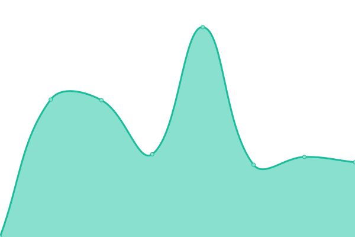
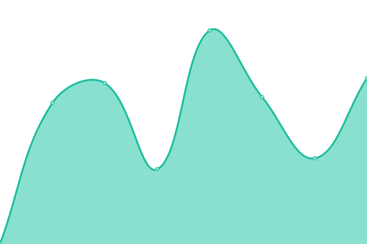
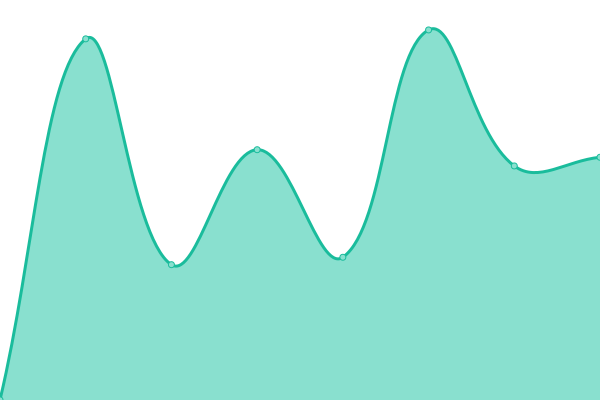
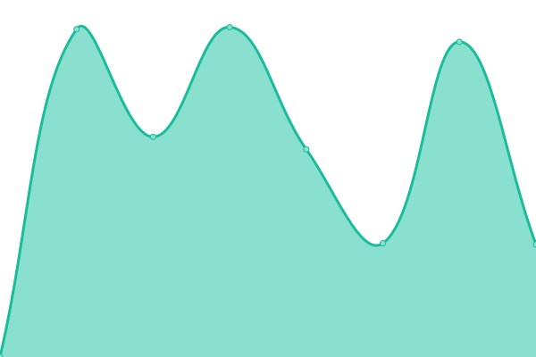
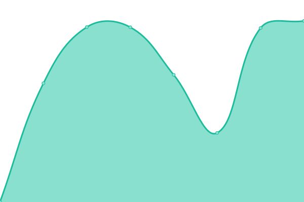
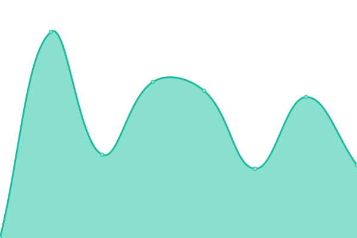
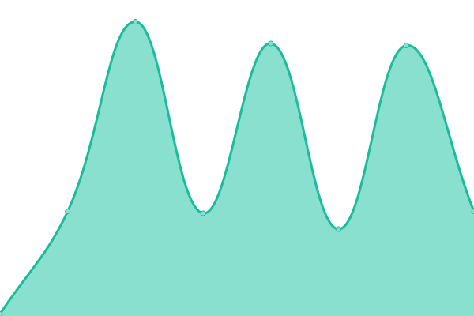

# [📈 Live Status](https://demo.upptime.js.org): <!--live status--> **🟧 Partial outage**

This repository contains the open-source uptime monitor and status page for [Patrick Little](Open.Canada.ca), powered by [Upptime](https://github.com/upptime/upptime).

With [Upptime](https://upptime.js.org), you can get your own unlimited and free uptime monitor and status page, powered entirely by a GitHub repository. We use [Issues](https://github.com/PatLittle/Consultations-Tracker/issues) as incident reports, [Actions](https://github.com/PatLittle/Consultations-Tracker/actions) as uptime monitors, and [Pages](https://demo.upptime.js.org) for the status page.

<!--start: status pages-->
<!-- This summary is generated by Upptime (https://github.com/upptime/upptime) -->
<!-- Do not edit this manually, your changes will be overwritten -->
<!-- prettier-ignore -->
| URL | Status | History | Response Time | Uptime |
| --- | ------ | ------- | ------------- | ------ |
|  [CBSA Assessment and Revenue Management (CARM) Information sessions on implementation](https://www.cbsa-asfc.gc.ca/prog/carm-gcra/menu-eng.html) | 🟥 Down | [cbsa-assessment-and-revenue-management-carm-information-sessions-on-implementation.yml](https://github.com/PatLittle/Consultations-Tracker/commits/HEAD/history/cbsa-assessment-and-revenue-management-carm-information-sessions-on-implementation.yml) | 

 265ms
     
 | 

<a href="https://PatLittle.github.io/Consultations-Tracker/history/cbsa-assessment-and-revenue-management-carm-information-sessions-on-implementation">100.00%</a>
    

|  [White River First Nations](https://www.rcaanc-cirnac.gc.ca/eng/1511969222951/1529103469169) | 🟩 Up | [white-river-first-nations.yml](https://github.com/PatLittle/Consultations-Tracker/commits/HEAD/history/white-river-first-nations.yml) | 

 1049ms
     
 | 

<a href="https://PatLittle.github.io/Consultations-Tracker/history/white-river-first-nations">100.00%</a>
    

|  [Use of digital tools at the border](https://www.cbsa-asfc.gc.ca/services/border-tech-frontiere/modern-eng.html) | 🟩 Up | [use-of-digital-tools-at-the-border.yml](https://github.com/PatLittle/Consultations-Tracker/commits/HEAD/history/use-of-digital-tools-at-the-border.yml) | 

 80ms
     
 | 

<a href="https://PatLittle.github.io/Consultations-Tracker/history/use-of-digital-tools-at-the-border">100.00%</a>
    

|  [Filing Manual Updates](https://www.cer-rec.gc.ca/en/applications-hearings/submit-applications-documents/filing-manuals/filing-manual/filing-manual-updates/index.html) | 🟩 Up | [filing-manual-updates.yml](https://github.com/PatLittle/Consultations-Tracker/commits/HEAD/history/filing-manual-updates.yml) | 

 529ms
     
 | 

<a href="https://PatLittle.github.io/Consultations-Tracker/history/filing-manual-updates">100.00%</a>
    

|  [Regulatory Framework Plan](https://can01.safelinks.protection.outlook.com/?url=https%3A%2F%2Fwww.cer-rec.gc.ca%2Fen%2Fabout%2Fhow-we-regulate%2Fplans-for-regulatory-framework%2F&data=05%7C02%7CMichelle.Shabits%40cer-rec.gc.ca%7Cec1c386ebea64452821d08dc41ebb1b9%7C56e9b8d38a3549abbdfc27de59608f01%7C0%7C0%7C638457728797041411%7CUnknown%7CTWFpbGZsb3d8eyJWIjoiMC4wLjAwMDAiLCJQIjoiV2luMzIiLCJBTiI6Ik1haWwiLCJXVCI6Mn0%3D%7C0%7C%7C%7C&sdata=tKxvqtPetzkvcXlETiyyf51rWnRpUftsM2o2U5IySO4%3D&reserved=0) | 🟩 Up | [regulatory-framework-plan.yml](https://github.com/PatLittle/Consultations-Tracker/commits/HEAD/history/regulatory-framework-plan.yml) | 

 758ms
     
 | 

<a href="https://PatLittle.github.io/Consultations-Tracker/history/regulatory-framework-plan">100.00%</a>
    

|  [Regulated Industry Engagement](https://www.cer-rec.gc.ca/en/consultation-engagement/stakeholder-engagement/regulated-industry-engagement/index.html) | 🟩 Up | [regulated-industry-engagement.yml](https://github.com/PatLittle/Consultations-Tracker/commits/HEAD/history/regulated-industry-engagement.yml) | 

 262ms
     
 | 

<a href="https://PatLittle.github.io/Consultations-Tracker/history/regulated-industry-engagement">100.00%</a>
    

|  [Revised Event Reporting Guidelines](https://www.cerdialogue.ca/event-reporting-guidelines) | 🟩 Up | [revised-event-reporting-guidelines.yml](https://github.com/PatLittle/Consultations-Tracker/commits/HEAD/history/revised-event-reporting-guidelines.yml) | 

 540ms
     
 | 

<a href="https://PatLittle.github.io/Consultations-Tracker/history/revised-event-reporting-guidelines">100.00%</a>
    

|  [Predictable and Efficient Processing and Assessment of Negligible-Risk and Low-Risk Activities](https://www.cerdialogue.ca/efficiency-project) | 🟩 Up | [predictable-and-efficient-processing-and-assessment-of-negligible-risk-and-low-risk-activities.yml](https://github.com/PatLittle/Consultations-Tracker/commits/HEAD/history/predictable-and-efficient-processing-and-assessment-of-negligible-risk-and-low-risk-activities.yml) | 

 267ms
     
 | 

<a href="https://PatLittle.github.io/Consultations-Tracker/history/predictable-and-efficient-processing-and-assessment-of-negligible-risk-and-low-risk-activities">100.00%</a>
    

|  [Share your thoughts: Draft National Potato Wart Response Plan](https://inspection.canada.ca/en/about-cfia/transparency/consultations-and-engagement/share-your-thoughts-draft-national-potato-wart-response-plan) | 🟩 Up | [share-your-thoughts-draft-national-potato-wart-response-plan.yml](https://github.com/PatLittle/Consultations-Tracker/commits/HEAD/history/share-your-thoughts-draft-national-potato-wart-response-plan.yml) | 

 893ms
     
 | 

<a href="https://PatLittle.github.io/Consultations-Tracker/history/share-your-thoughts-draft-national-potato-wart-response-plan">100.00%</a>
    

|  [Consultation on proposed changes to the Plant Breeders' Rights Regulations](https://inspection.canada.ca/en/about-cfia/transparency/consultations-and-engagement/plant-breeders-rights-regulations) | 🟩 Up | [consultation-on-proposed-changes-to-the-plant-breeders-rights-regulations.yml](https://github.com/PatLittle/Consultations-Tracker/commits/HEAD/history/consultation-on-proposed-changes-to-the-plant-breeders-rights-regulations.yml) | 

 950ms
     
 | 

<a href="https://PatLittle.github.io/Consultations-Tracker/history/consultation-on-proposed-changes-to-the-plant-breeders-rights-regulations">100.00%</a>
    

|  [International Plant Protection Convention (IPPC) Member consultation on draft International Standards for Phytosanitary Measures and Implementation and Capacity Development Documents](https://inspection.canada.ca/importing-food-plants-or-animals/plant-and-plant-product-imports/international-plant-protection/eng/1307387838940/1307388165125#a3) | 🟩 Up | [international-plant-protection-convention-ippc-member-consultation-on-draft-international-standards-for-phytosanitary-measures-and-implementation-and-capacity-development-documents.yml](https://github.com/PatLittle/Consultations-Tracker/commits/HEAD/history/international-plant-protection-convention-ippc-member-consultation-on-draft-international-standards-for-phytosanitary-measures-and-implementation-and-capacity-development-documents.yml) | 

 734ms
     
 | 

<a href="https://PatLittle.github.io/Consultations-Tracker/history/international-plant-protection-convention-ippc-member-consultation-on-draft-international-standards-for-phytosanitary-measures-and-implementation-and-capacity-development-documents">100.00%</a>
    

|  [Changing Narrative Fund](https://www.canada.ca/en/canadian-heritage/campaigns/changing-narratives-fund.html) | 🟩 Up | [changing-narrative-fund.yml](https://github.com/PatLittle/Consultations-Tracker/commits/HEAD/history/changing-narrative-fund.yml) | 

 1813ms
     
 | 

<a href="https://PatLittle.github.io/Consultations-Tracker/history/changing-narrative-fund">100.00%</a>
    

|  [2022-23 Consultations on renewal of the Museum Policy](https://www.canada.ca/en/canadian-heritage/campaigns/renewal-museum-policy.html) | 🟩 Up | [2022-23-consultations-on-renewal-of-the-museum-policy.yml](https://github.com/PatLittle/Consultations-Tracker/commits/HEAD/history/2022-23-consultations-on-renewal-of-the-museum-policy.yml) | 

 1803ms
     
 | 

<a href="https://PatLittle.github.io/Consultations-Tracker/history/2022-23-consultations-on-renewal-of-the-museum-policy">100.00%</a>
    

|  [Refreshing Canada's Strategy for Patient-Oriented Research](https://cihr-irsc.gc.ca/e/53699.html) | 🟩 Up | [refreshing-canada-s-strategy-for-patient-oriented-research.yml](https://github.com/PatLittle/Consultations-Tracker/commits/HEAD/history/refreshing-canada-s-strategy-for-patient-oriented-research.yml) | 

 167ms
     
 | 

<a href="https://PatLittle.github.io/Consultations-Tracker/history/refreshing-canada-s-strategy-for-patient-oriented-research">100.00%</a>
    

|  [Discussion Paper DIS-24-04, Future Amendments the Nuclear Security Regulations: Granting Peace Officer Powers, Initiating a Complaints Investigation Mechanism, and Transferring of Firearm Ownership to Licensees](https://letstalknuclearsafety.ca/dis-24-04-landing-page) | 🟩 Up | [discussion-paper-dis-24-04-future-amendments-the-nuclear-security-regulations-granting-peace-officer-powers-initiating-a-complaints-investigation-mechanism-and-transferring-of-firearm-ownership-to-licensees.yml](https://github.com/PatLittle/Consultations-Tracker/commits/HEAD/history/discussion-paper-dis-24-04-future-amendments-the-nuclear-security-regulations-granting-peace-officer-powers-initiating-a-complaints-investigation-mechanism-and-transferring-of-firearm-ownership-to-licensees.yml) | 

 295ms
     
 | 

<a href="https://PatLittle.github.io/Consultations-Tracker/history/discussion-paper-dis-24-04-future-amendments-the-nuclear-security-regulations-granting-peace-officer-powers-initiating-a-complaints-investigation-mechanism-and-transferring-of-firearm-ownership-to-licensees">100.00%</a>
    

|  [Co-development of a new Indigenous Broadcasting Policy](https://crtc.gc.ca/eng/archive/2019/2019-217.htm) | 🟩 Up | [co-development-of-a-new-indigenous-broadcasting-policy.yml](https://github.com/PatLittle/Consultations-Tracker/commits/HEAD/history/co-development-of-a-new-indigenous-broadcasting-policy.yml) | 

 247ms
     
 | 

<a href="https://PatLittle.github.io/Consultations-Tracker/history/co-development-of-a-new-indigenous-broadcasting-policy">100.00%</a>
    

|  [Share your thoughts about the regulatory framework for the Online News Act](https://crtc.gc.ca/eng/consultation/news-nouvelles.htm) | 🟩 Up | [share-your-thoughts-about-the-regulatory-framework-for-the-online-news-act.yml](https://github.com/PatLittle/Consultations-Tracker/commits/HEAD/history/share-your-thoughts-about-the-regulatory-framework-for-the-online-news-act.yml) | 

 42ms
     
 | 

<a href="https://PatLittle.github.io/Consultations-Tracker/history/share-your-thoughts-about-the-regulatory-framework-for-the-online-news-act">100.00%</a>
    

|  [Share your thoughts about Indigenous programming in Canada](https://crtc.gc.ca/eng/consultation/ibp-pra.htm) | 🟩 Up | [share-your-thoughts-about-indigenous-programming-in-canada.yml](https://github.com/PatLittle/Consultations-Tracker/commits/HEAD/history/share-your-thoughts-about-indigenous-programming-in-canada.yml) | 

 0ms
     
 | 

<a href="https://PatLittle.github.io/Consultations-Tracker/history/share-your-thoughts-about-indigenous-programming-in-canada">100.00%</a>
    

|  [Exempting Indigenous Settlement and Community Trusts from Alternative Minimum Tax](https://www.canada.ca/en/department-finance/programs/consultations/2024/consultation-exempting-indigenous-settlement-community-trusts-alternative-minimum-tax.html) | 🟩 Up | [exempting-indigenous-settlement-and-community-trusts-from-alternative-minimum-tax.yml](https://github.com/PatLittle/Consultations-Tracker/commits/HEAD/history/exempting-indigenous-settlement-and-community-trusts-from-alternative-minimum-tax.yml) | 

 2228ms
     
 | 

<a href="https://PatLittle.github.io/Consultations-Tracker/history/exempting-indigenous-settlement-and-community-trusts-from-alternative-minimum-tax">100.00%</a>
    

|  [Government releases draft regulations on coordinated vaping taxation framework](https://www.canada.ca/en/department-finance/news/2024/06/government-releases-draft-regulations-on-coordinated-vaping-taxation-framework.html) | 🟩 Up | [government-releases-draft-regulations-on-coordinated-vaping-taxation-framework.yml](https://github.com/PatLittle/Consultations-Tracker/commits/HEAD/history/government-releases-draft-regulations-on-coordinated-vaping-taxation-framework.yml) | 

 2167ms
     
 | 

<a href="https://PatLittle.github.io/Consultations-Tracker/history/government-releases-draft-regulations-on-coordinated-vaping-taxation-framework">100.00%</a>
    

|  [Council of Europe Second Additional Protocol to the Convention on Cybercrime on Enhanced Cooperation and Disclosure of Electronic EvidenceConsultations, 2023](https://www.justice.gc.ca/eng/cj-jp/cyber/id-di/index.html) | 🟩 Up | [council-of-europe-second-additional-protocol-to-the-convention-on-cybercrime-on-enhanced-cooperation-and-disclosure-of-electronic-evidence-consultations-2023.yml](https://github.com/PatLittle/Consultations-Tracker/commits/HEAD/history/council-of-europe-second-additional-protocol-to-the-convention-on-cybercrime-on-enhanced-cooperation-and-disclosure-of-electronic-evidence-consultations-2023.yml) | 

 346ms
     
 | 

<a href="https://PatLittle.github.io/Consultations-Tracker/history/council-of-europe-second-additional-protocol-to-the-convention-on-cybercrime-on-enhanced-cooperation-and-disclosure-of-electronic-evidence-consultations-2023">100.00%</a>
    

|  [Amending the Nuclear Exclusions Regulations](https://gazette.gc.ca/rp-pr/p1/2024/2024-04-27/html/index-eng.html) | 🟩 Up | [amending-the-nuclear-exclusions-regulations.yml](https://github.com/PatLittle/Consultations-Tracker/commits/HEAD/history/amending-the-nuclear-exclusions-regulations.yml) | 

 219ms
     
 | 

<a href="https://PatLittle.github.io/Consultations-Tracker/history/amending-the-nuclear-exclusions-regulations">100.00%</a>
    

|  [Modernization of the Employment Equity Act](https://www.canada.ca/en/employment-social-development/corporate/portfolio/labour/programs/employment-equity/consultation-act-modernization.html) | 🟩 Up | [modernization-of-the-employment-equity-act.yml](https://github.com/PatLittle/Consultations-Tracker/commits/HEAD/history/modernization-of-the-employment-equity-act.yml) | 

 1762ms
     
 | 

<a href="https://PatLittle.github.io/Consultations-Tracker/history/modernization-of-the-employment-equity-act">100.00%</a>
    

|  [Clean Fuel Standard](https://www.canada.ca/en/environment-climate-change/services/managing-pollution/energy-production/fuel-regulations/clean-fuel-standard.html) | 🟩 Up | [clean-fuel-standard.yml](https://github.com/PatLittle/Consultations-Tracker/commits/HEAD/history/clean-fuel-standard.yml) | 

 3006ms
     
 | 

<a href="https://PatLittle.github.io/Consultations-Tracker/history/clean-fuel-standard">100.00%</a>
    

|  [Share and view ideas: Renewal of the Federal Agenda for Volatile Organic Compounds in Consumer and Commercial Product](https://www.canada.ca/en/environment-climate-change/services/managing-pollution/sources-industry/volatile-organic-compounds-consumer-commercial/renewal-federal-agenda-volatile-organic-compound-consumer-commercial-product.html) | 🟩 Up | [share-and-view-ideas-renewal-of-the-federal-agenda-for-volatile-organic-compounds-in-consumer-and-commercial-product.yml](https://github.com/PatLittle/Consultations-Tracker/commits/HEAD/history/share-and-view-ideas-renewal-of-the-federal-agenda-for-volatile-organic-compounds-in-consumer-and-commercial-product.yml) | 

 0ms
     
 | 

<a href="https://PatLittle.github.io/Consultations-Tracker/history/share-and-view-ideas-renewal-of-the-federal-agenda-for-volatile-organic-compounds-in-consumer-and-commercial-product">100.00%</a>
    

|  [Share your ideas: Blackwater Project](https://www.canada.ca/en/environment-climate-change/services/managing-pollution/sources-industry/mining/metal-diamond-mining-effluent-regulation/blackwater-consultation.html) | 🟥 Down | [share-your-ideas-blackwater-project.yml](https://github.com/PatLittle/Consultations-Tracker/commits/HEAD/history/share-your-ideas-blackwater-project.yml) | 

 1478ms
     
 | 

<a href="https://PatLittle.github.io/Consultations-Tracker/history/share-your-ideas-blackwater-project">100.00%</a>
    

|  [Share ideas: Mont-Wright Mining Project (Dyno Basin)](https://canada.ca/en/environment-climate-change/services/managing-pollution/sources-industry/mining/metal-diamond-mining-effluent-regulation/basin-dyno-consultation.html) | 🟥 Down | [share-ideas-mont-wright-mining-project-dyno-basin.yml](https://github.com/PatLittle/Consultations-Tracker/commits/HEAD/history/share-ideas-mont-wright-mining-project-dyno-basin.yml) | 

 2677ms
     
 | 

<a href="https://PatLittle.github.io/Consultations-Tracker/history/share-ideas-mont-wright-mining-project-dyno-basin">100.00%</a>
    

|  [Recovery Strategy (Amended) and Action Plan for the Piping Plover melodus subspecies (Charadrius melodus melodus) in Canada [Proposed]](https://registre-especes.canada.ca/index-fr.html#/documents/923) | 🟩 Up | [recovery-strategy-amended-and-action-plan-for-the-piping-plover-melodus-subspecies-charadrius-melodus-melodus-in-canada-proposed.yml](https://github.com/PatLittle/Consultations-Tracker/commits/HEAD/history/recovery-strategy-amended-and-action-plan-for-the-piping-plover-melodus-subspecies-charadrius-melodus-melodus-in-canada-proposed.yml) | 

 0ms
     
 | 

<a href="https://PatLittle.github.io/Consultations-Tracker/history/recovery-strategy-amended-and-action-plan-for-the-piping-plover-melodus-subspecies-charadrius-melodus-melodus-in-canada-proposed">100.00%</a>
    

|  [Consultation on the Proposed Recovery Strategy for the Gypsy Cuckoo Bumble Bee](https://species-registry.canada.ca/index-en.html#/documents/268) | 🟩 Up | [consultation-on-the-proposed-recovery-strategy-for-the-gypsy-cuckoo-bumble-bee.yml](https://github.com/PatLittle/Consultations-Tracker/commits/HEAD/history/consultation-on-the-proposed-recovery-strategy-for-the-gypsy-cuckoo-bumble-bee.yml) | 

 150ms
     
 | 

<a href="https://PatLittle.github.io/Consultations-Tracker/history/consultation-on-the-proposed-recovery-strategy-for-the-gypsy-cuckoo-bumble-bee">100.00%</a>
    

|  [Offsetting Policy for Biodiversity](https://www.canada.ca/en/environment-climate-change/services/biodiversity/share-view-ideas-offsetting-policy-biodiversity.html) | 🟩 Up | [offsetting-policy-for-biodiversity.yml](https://github.com/PatLittle/Consultations-Tracker/commits/HEAD/history/offsetting-policy-for-biodiversity.yml) | 

 1784ms
     
 | 

<a href="https://PatLittle.github.io/Consultations-Tracker/history/offsetting-policy-for-biodiversity">100.00%</a>
    

|  [Consultations on Canada's 2030 Biodiversity Strategy](https://www.canada.ca/en/services/environment/wildlife-plants-species/biodiversity.html) | 🟩 Up | [consultations-on-canada-s-2030-biodiversity-strategy.yml](https://github.com/PatLittle/Consultations-Tracker/commits/HEAD/history/consultations-on-canada-s-2030-biodiversity-strategy.yml) | 

 1841ms
     
 | 

<a href="https://PatLittle.github.io/Consultations-Tracker/history/consultations-on-canada-s-2030-biodiversity-strategy">100.00%</a>
    

|  [Share and view ideas: Publication of a Notice of intent for the Federal Plastics Registry](https://canada.ca/en/environment-climate-change/services/managing-reducing-waste/consultations/technical-paper-registry.html) | 🟩 Up | [share-and-view-ideas-publication-of-a-notice-of-intent-for-the-federal-plastics-registry.yml](https://github.com/PatLittle/Consultations-Tracker/commits/HEAD/history/share-and-view-ideas-publication-of-a-notice-of-intent-for-the-federal-plastics-registry.yml) | 

 2109ms
     
 | 

<a href="https://PatLittle.github.io/Consultations-Tracker/history/share-and-view-ideas-publication-of-a-notice-of-intent-for-the-federal-plastics-registry">100.00%</a>
    

|  [Share your ideas: consultation on the modernization of the Pulp and Paper Effluent Regulations](https://canada.ca/en/environment-climate-change/services/managing-pollution/fisheries-act-registry/consultation-modernization-pulp-paper-effluent-regulations.html) | 🟩 Up | [share-your-ideas-consultation-on-the-modernization-of-the-pulp-and-paper-effluent-regulations.yml](https://github.com/PatLittle/Consultations-Tracker/commits/HEAD/history/share-your-ideas-consultation-on-the-modernization-of-the-pulp-and-paper-effluent-regulations.yml) | 

 2337ms
     
 | 

<a href="https://PatLittle.github.io/Consultations-Tracker/history/share-your-ideas-consultation-on-the-modernization-of-the-pulp-and-paper-effluent-regulations">100.00%</a>
    

|  [Consultation on Amending the List of Species under the Species at Risk Act: Terrestrial Species December 2023](https://species-registry.canada.ca/index-en.html#/documents/1171) | 🟩 Up | [consultation-on-amending-the-list-of-species-under-the-species-at-risk-act-terrestrial-species-december-2023.yml](https://github.com/PatLittle/Consultations-Tracker/commits/HEAD/history/consultation-on-amending-the-list-of-species-under-the-species-at-risk-act-terrestrial-species-december-2023.yml) | 

 11ms
     
 | 

<a href="https://PatLittle.github.io/Consultations-Tracker/history/consultation-on-amending-the-list-of-species-under-the-species-at-risk-act-terrestrial-species-december-2023">100.00%</a>
    

|  [Share your thoughts: Implementation Framework for a Right to a Healthy Environment in the Canadian Environmental Protection Act, 1999](https://www.canada.ca/en/environment-climate-change/corporate/transparency/consultations/right-healthy-environment.html) | 🟩 Up | [share-your-thoughts-implementation-framework-for-a-right-to-a-healthy-environment-in-the-canadian-environmental-protection-act-1999.yml](https://github.com/PatLittle/Consultations-Tracker/commits/HEAD/history/share-your-thoughts-implementation-framework-for-a-right-to-a-healthy-environment-in-the-canadian-environmental-protection-act-1999.yml) | 

 0ms
     
 | 

<a href="https://PatLittle.github.io/Consultations-Tracker/history/share-your-thoughts-implementation-framework-for-a-right-to-a-healthy-environment-in-the-canadian-environmental-protection-act-1999">100.00%</a>
    

|  [Share your ideas: Amendments to the Metal and Diamond Mining Effluent Regulations for the Red Lake Mine](https://www.canada.ca/en/environment-climate-change/corporate/transparency/consultations/red-lake-mine-project.html) | 🟩 Up | [share-your-ideas-amendments-to-the-metal-and-diamond-mining-effluent-regulations-for-the-red-lake-mine.yml](https://github.com/PatLittle/Consultations-Tracker/commits/HEAD/history/share-your-ideas-amendments-to-the-metal-and-diamond-mining-effluent-regulations-for-the-red-lake-mine.yml) | 

 2368ms
     
 | 

<a href="https://PatLittle.github.io/Consultations-Tracker/history/share-your-ideas-amendments-to-the-metal-and-diamond-mining-effluent-regulations-for-the-red-lake-mine">100.00%</a>
    

|  [Dolphin and Union Caribou pre-listing consultations](https://www.canada.ca/en/environment-climate-change/corporate/transparency/consultations/review-environmental-violations-administrative-monetary-penalties-regulations.html) | 🟩 Up | [dolphin-and-union-caribou-pre-listing-consultations.yml](https://github.com/PatLittle/Consultations-Tracker/commits/HEAD/history/dolphin-and-union-caribou-pre-listing-consultations.yml) | 

 2443ms
     
 | 

<a href="https://PatLittle.github.io/Consultations-Tracker/history/dolphin-and-union-caribou-pre-listing-consultations">100.00%</a>
    

|  [Share your ideas: Review of the Environmental Violations Administrative Monetary Penalties Regulations](https://www.canada.ca/en/environment-climate-change/corporate/transparency/consultations/review-environmental-violations-administrative-monetary-penalties-regulations.html) | 🟩 Up | [share-your-ideas-review-of-the-environmental-violations-administrative-monetary-penalties-regulations.yml](https://github.com/PatLittle/Consultations-Tracker/commits/HEAD/history/share-your-ideas-review-of-the-environmental-violations-administrative-monetary-penalties-regulations.yml) | 

 2220ms
     
 | 

<a href="https://PatLittle.github.io/Consultations-Tracker/history/share-your-ideas-review-of-the-environmental-violations-administrative-monetary-penalties-regulations">100.00%</a>
    

|  [Share your ideas: Amendments to the Metal and Diamond Mining Effluent Regulations for the Goldboro Gold Project](https://www.canada.ca/en/environment-climate-change/corporate/transparency/consultations/goldboro-mine-project.html) | 🟩 Up | [share-your-ideas-amendments-to-the-metal-and-diamond-mining-effluent-regulations-for-the-goldboro-gold-project.yml](https://github.com/PatLittle/Consultations-Tracker/commits/HEAD/history/share-your-ideas-amendments-to-the-metal-and-diamond-mining-effluent-regulations-for-the-goldboro-gold-project.yml) | 

 1966ms
     
 | 

<a href="https://PatLittle.github.io/Consultations-Tracker/history/share-your-ideas-amendments-to-the-metal-and-diamond-mining-effluent-regulations-for-the-goldboro-gold-project">100.00%</a>
    

|  [Proposed Regulations Amending the Wildlife Area Regulations – Delisting of 19 Units of the Prairie National Wildlife Area (NWA) and Designation of Five New NWAs](https://www.canada.ca/en/environment-climate-change/corporate/transparency/consultations/consultation-regulations-five-new-national-wildlife-areas.html) | 🟩 Up | [proposed-regulations-amending-the-wildlife-area-regulations-delisting-of-19-units-of-the-prairie-national-wildlife-area-nwa-and-designation-of-five-new-nw-as.yml](https://github.com/PatLittle/Consultations-Tracker/commits/HEAD/history/proposed-regulations-amending-the-wildlife-area-regulations-delisting-of-19-units-of-the-prairie-national-wildlife-area-nwa-and-designation-of-five-new-nw-as.yml) | 

 2431ms
     
 | 

<a href="https://PatLittle.github.io/Consultations-Tracker/history/proposed-regulations-amending-the-wildlife-area-regulations-delisting-of-19-units-of-the-prairie-national-wildlife-area-nwa-and-designation-of-five-new-nw-as">100.00%</a>
    

|  [Share your thoughts:  Proposed Regulations Amending the Storage Tank Systems for Petroleum Products and Allied Petroleum Products Regulations](https://www.canada.ca/en/environment-climate-change/corporate/transparency/consultations/amending-storage-tank-systems-petroleum-products-allied-products-regulations.html) | 🟩 Up | [share-your-thoughts-proposed-regulations-amending-the-storage-tank-systems-for-petroleum-products-and-allied-petroleum-products-regulations.yml](https://github.com/PatLittle/Consultations-Tracker/commits/HEAD/history/share-your-thoughts-proposed-regulations-amending-the-storage-tank-systems-for-petroleum-products-and-allied-petroleum-products-regulations.yml) | 

 1974ms
     
 | 

<a href="https://PatLittle.github.io/Consultations-Tracker/history/share-your-thoughts-proposed-regulations-amending-the-storage-tank-systems-for-petroleum-products-and-allied-petroleum-products-regulations">100.00%</a>
    

|  [Consultation on the proposed Emergency Order to protect boreal caribou in the provice of Quebec](https://species-registry.canada.ca/index-en.html#/documents/980) | 🟩 Up | [consultation-on-the-proposed-emergency-order-to-protect-boreal-caribou-in-the-provice-of-quebec.yml](https://github.com/PatLittle/Consultations-Tracker/commits/HEAD/history/consultation-on-the-proposed-emergency-order-to-protect-boreal-caribou-in-the-provice-of-quebec.yml) | 

 0ms
     
 | 

<a href="https://PatLittle.github.io/Consultations-Tracker/history/consultation-on-the-proposed-emergency-order-to-protect-boreal-caribou-in-the-provice-of-quebec">100.00%</a>
    

|  [Comment on: Draft Canada-Saskatchewan Equivalency Agreement on coal-fired electricity regulations (2025-2026)](https://www.canada.ca/en/environment-climate-change/services/canadian-environmental-protection-act-registry/agreements/equivalency/canada-saskatchewan-greenhouse-gas-electricity-producers-2025.html) | 🟩 Up | [comment-on-draft-canada-saskatchewan-equivalency-agreement-on-coal-fired-electricity-regulations-2025-2026.yml](https://github.com/PatLittle/Consultations-Tracker/commits/HEAD/history/comment-on-draft-canada-saskatchewan-equivalency-agreement-on-coal-fired-electricity-regulations-2025-2026.yml) | 

 1852ms
     
 | 

<a href="https://PatLittle.github.io/Consultations-Tracker/history/comment-on-draft-canada-saskatchewan-equivalency-agreement-on-coal-fired-electricity-regulations-2025-2026">100.00%</a>
    

|  [Share your thoughts: Proposed Regulations Respecting the Reduction in the Release of Methane (Waste Sector)](https://www.canada.ca/en/environment-climate-change/corporate/transparency/consultations/proposed-regulations-respecting-reduction-release-methane-waste-sector.html) | 🟩 Up | [share-your-thoughts-proposed-regulations-respecting-the-reduction-in-the-release-of-methane-waste-sector.yml](https://github.com/PatLittle/Consultations-Tracker/commits/HEAD/history/share-your-thoughts-proposed-regulations-respecting-the-reduction-in-the-release-of-methane-waste-sector.yml) | 

 0ms
     
 | 

<a href="https://PatLittle.github.io/Consultations-Tracker/history/share-your-thoughts-proposed-regulations-respecting-the-reduction-in-the-release-of-methane-waste-sector">100.00%</a>
    

|  [Share your thoughts: Regulatory Review of the Ozone-depleting Substances and Halocarbon Alternatives Regulations](https://www.canada.ca/en/environment-climate-change/corporate/transparency/consultations/regulatory-review-ozone-depleting-substances-halocarbon-alternatives-regulations.html) | 🟩 Up | [share-your-thoughts-regulatory-review-of-the-ozone-depleting-substances-and-halocarbon-alternatives-regulations.yml](https://github.com/PatLittle/Consultations-Tracker/commits/HEAD/history/share-your-thoughts-regulatory-review-of-the-ozone-depleting-substances-and-halocarbon-alternatives-regulations.yml) | 

 2181ms
     
 | 

<a href="https://PatLittle.github.io/Consultations-Tracker/history/share-your-thoughts-regulatory-review-of-the-ozone-depleting-substances-and-halocarbon-alternatives-regulations">100.00%</a>
    

|  [Share and view ideas: Consultation addressing plastic waste and pollution from the textile and apparel sector](https://canada.ca/en/environment-climate-change/services/managing-reducing-waste/consultations/roadmap-plastic-waste-pollution-textile-apparel-sector.html) | 🟩 Up | [share-and-view-ideas-consultation-addressing-plastic-waste-and-pollution-from-the-textile-and-apparel-sector.yml](https://github.com/PatLittle/Consultations-Tracker/commits/HEAD/history/share-and-view-ideas-consultation-addressing-plastic-waste-and-pollution-from-the-textile-and-apparel-sector.yml) | 

 1962ms
     
 | 

<a href="https://PatLittle.github.io/Consultations-Tracker/history/share-and-view-ideas-consultation-addressing-plastic-waste-and-pollution-from-the-textile-and-apparel-sector">100.00%</a>
    

|  [Share your thoughts: Updated Draft State of Per- and Polyfluoroalkyl Substances (PFAS) Report and Revised Risk Management Scope](https://www.canada.ca/en/environment-climate-change/corporate/transparency/updated-draft-state-pfas-report-consultation.html) | 🟩 Up | [share-your-thoughts-updated-draft-state-of-per-and-polyfluoroalkyl-substances-pfas-report-and-revised-risk-management-scope.yml](https://github.com/PatLittle/Consultations-Tracker/commits/HEAD/history/share-your-thoughts-updated-draft-state-of-per-and-polyfluoroalkyl-substances-pfas-report-and-revised-risk-management-scope.yml) | 

 2157ms
     
 | 

<a href="https://PatLittle.github.io/Consultations-Tracker/history/share-your-thoughts-updated-draft-state-of-per-and-polyfluoroalkyl-substances-pfas-report-and-revised-risk-management-scope">100.00%</a>
    

|  [Eastern Shore Islands Area of Interest Consultations](http://www.dfo-mpo.gc.ca/oceans/consultations/easternshore-ilescoteest/index-eng.html) | 🟩 Up | [eastern-shore-islands-area-of-interest-consultations.yml](https://github.com/PatLittle/Consultations-Tracker/commits/HEAD/history/eastern-shore-islands-area-of-interest-consultations.yml) | 

 415ms
     
 | 

<a href="https://PatLittle.github.io/Consultations-Tracker/history/eastern-shore-islands-area-of-interest-consultations">100.00%</a>
    

|  [Fundian Channel- Browns Bank Area of Interest](https://www.dfo-mpo.gc.ca/oceans/aoi-si/fundian-fundy-browns-eng.html) | 🟩 Up | [fundian-channel-browns-bank-area-of-interest.yml](https://github.com/PatLittle/Consultations-Tracker/commits/HEAD/history/fundian-channel-browns-bank-area-of-interest.yml) | 

 274ms
     
 | 

<a href="https://PatLittle.github.io/Consultations-Tracker/history/fundian-channel-browns-bank-area-of-interest">100.00%</a>
    

|  [Let's talk Pacific Salmon](https://letstalkpacificsalmon.ca/) | 🟩 Up | [let-s-talk-pacific-salmon.yml](https://github.com/PatLittle/Consultations-Tracker/commits/HEAD/history/let-s-talk-pacific-salmon.yml) | 

 688ms
     
 | 

<a href="https://PatLittle.github.io/Consultations-Tracker/history/let-s-talk-pacific-salmon">100.00%</a>
    

|  [Proposed ticketing for the enforcement of a fisheries offence under the Fisheries Act](TBD) | 🟥 Down | [proposed-ticketing-for-the-enforcement-of-a-fisheries-offence-under-the-fisheries-act.yml](https://github.com/PatLittle/Consultations-Tracker/commits/HEAD/history/proposed-ticketing-for-the-enforcement-of-a-fisheries-offence-under-the-fisheries-act.yml) | 

 0ms
     
 | 

<a href="https://PatLittle.github.io/Consultations-Tracker/history/proposed-ticketing-for-the-enforcement-of-a-fisheries-offence-under-the-fisheries-act">100.00%</a>
    

|  [Restore, Maintain, Thrive:Canada’s national strategy to ensure the future of Atlantic salmon](https://www.dfo-mpo.gc.ca/about-notre-sujet/engagement/2022/wild-salmon-saumon-sauvage-eng.html) | 🟩 Up | [restore-maintain-thrive-canada-s-national-strategy-to-ensure-the-future-of-atlantic-salmon.yml](https://github.com/PatLittle/Consultations-Tracker/commits/HEAD/history/restore-maintain-thrive-canada-s-national-strategy-to-ensure-the-future-of-atlantic-salmon.yml) | 

 63ms
     
 | 

<a href="https://PatLittle.github.io/Consultations-Tracker/history/restore-maintain-thrive-canada-s-national-strategy-to-ensure-the-future-of-atlantic-salmon">100.00%</a>
    

|  [Whitby Harbour Remediation Project](Whitby Harbour Remediation Project (dfo-mpo.gc.ca)) | 🟥 Down | [whitby-harbour-remediation-project.yml](https://github.com/PatLittle/Consultations-Tracker/commits/HEAD/history/whitby-harbour-remediation-project.yml) | 

 0ms
     
 | 

<a href="https://PatLittle.github.io/Consultations-Tracker/history/whitby-harbour-remediation-project">0.00%</a>
    

|  [Canadian Coast Guard Long-term Strategy](https://www.ccg-gcc.gc.ca/engagement/lts-slt/consultation-eng.html) | 🟩 Up | [canadian-coast-guard-long-term-strategy.yml](https://github.com/PatLittle/Consultations-Tracker/commits/HEAD/history/canadian-coast-guard-long-term-strategy.yml) | 

 439ms
     
 | 

<a href="https://PatLittle.github.io/Consultations-Tracker/history/canadian-coast-guard-long-term-strategy">98.28%</a>
    

|  [Revision of the management plan for Banc-des-Américains Marine Protected Area (MPA)](https://www.dfo-mpo.gc.ca/oceans/mpa-zpm/american-americains/index-eng.html) | 🟩 Up | [revision-of-the-management-plan-for-banc-des-americains-marine-protected-area-mpa.yml](https://github.com/PatLittle/Consultations-Tracker/commits/HEAD/history/revision-of-the-management-plan-for-banc-des-americains-marine-protected-area-mpa.yml) | 

 108ms
     
 | 

<a href="https://PatLittle.github.io/Consultations-Tracker/history/revision-of-the-management-plan-for-banc-des-americains-marine-protected-area-mpa">100.00%</a>
    

|  [Management Plan for the Mapleleaf (Quadrula quadrula) Great Lakes – Upper St. Lawrence Population, and Rainbow (Villosa iris) in Canada](https://wildlife-species.canada.ca/species-risk-registry/involved/consultation/default_e.cfm) | 🟩 Up | [management-plan-for-the-mapleleaf-quadrula-quadrula-great-lakes-upper-st-lawrence-population-and-rainbow-villosa-iris-in-canada.yml](https://github.com/PatLittle/Consultations-Tracker/commits/HEAD/history/management-plan-for-the-mapleleaf-quadrula-quadrula-great-lakes-upper-st-lawrence-population-and-rainbow-villosa-iris-in-canada.yml) | 

 0ms
     
 | 

<a href="https://PatLittle.github.io/Consultations-Tracker/history/management-plan-for-the-mapleleaf-quadrula-quadrula-great-lakes-upper-st-lawrence-population-and-rainbow-villosa-iris-in-canada">100.00%</a>
    

|  [Proposed Amendments to the Marine Mammal Regulations: Pacific Killer Whale approach distance and other amendments](https://www.dfo-mpo.gc.ca/about-notre-sujet/engagement/2024/marine-mammal-mammiferes-marins-eng.html) | 🟩 Up | [proposed-amendments-to-the-marine-mammal-regulations-pacific-killer-whale-approach-distance-and-other-amendments.yml](https://github.com/PatLittle/Consultations-Tracker/commits/HEAD/history/proposed-amendments-to-the-marine-mammal-regulations-pacific-killer-whale-approach-distance-and-other-amendments.yml) | 

 56ms
     
 | 

<a href="https://PatLittle.github.io/Consultations-Tracker/history/proposed-amendments-to-the-marine-mammal-regulations-pacific-killer-whale-approach-distance-and-other-amendments">100.00%</a>
    

|  [Multi-species Action Plan for the Richelieu River Watershed in Canada](https://species-registry.canada.ca/index-en.html#/consultations/2965) | 🟩 Up | [multi-species-action-plan-for-the-richelieu-river-watershed-in-canada.yml](https://github.com/PatLittle/Consultations-Tracker/commits/HEAD/history/multi-species-action-plan-for-the-richelieu-river-watershed-in-canada.yml) | 

 0ms
     
 | 

<a href="https://PatLittle.github.io/Consultations-Tracker/history/multi-species-action-plan-for-the-richelieu-river-watershed-in-canada">100.00%</a>
    

|  [Proposed Amendments to the Export Permits Regulations](https://www.international.gc.ca/trade-commerce/controls-controles/expor/backgrounder-amendments-epr-information-modification-rle.aspx?lang=eng) | 🟩 Up | [proposed-amendments-to-the-export-permits-regulations.yml](https://github.com/PatLittle/Consultations-Tracker/commits/HEAD/history/proposed-amendments-to-the-export-permits-regulations.yml) | 

 373ms
     
 | 

<a href="https://PatLittle.github.io/Consultations-Tracker/history/proposed-amendments-to-the-export-permits-regulations">100.00%</a>
    

|  [Join the discussion: The General Review of the Comprehensive and Progressive Agreement for Trans-Pacific Partnership (CPTPP)](https://www.international.gc.ca/trade-commerce/consultations/TRQ-CT/transpacific-cptpp-transpacifique-ptpgp.aspx?lang=eng) | 🟩 Up | [join-the-discussion-the-general-review-of-the-comprehensive-and-progressive-agreement-for-trans-pacific-partnership-cptpp.yml](https://github.com/PatLittle/Consultations-Tracker/commits/HEAD/history/join-the-discussion-the-general-review-of-the-comprehensive-and-progressive-agreement-for-trans-pacific-partnership-cptpp.yml) | 

 161ms
     
 | 

<a href="https://PatLittle.github.io/Consultations-Tracker/history/join-the-discussion-the-general-review-of-the-comprehensive-and-progressive-agreement-for-trans-pacific-partnership-cptpp">100.00%</a>
    

|  [Public consultations on Canada’s administration of import quotas for beef and veal products under the World Trade Organisation (WTO) Tariff Rate Quota (TRQ)](https://www.international.gc.ca/trade-commerce/consultations/TRQ-CT/wto-beef-veal-omc-boeuf-veau.aspx?lang=eng) | 🟩 Up | [public-consultations-on-canada-s-administration-of-import-quotas-for-beef-and-veal-products-under-the-world-trade-organisation-wto-tariff-rate-quota-trq.yml](https://github.com/PatLittle/Consultations-Tracker/commits/HEAD/history/public-consultations-on-canada-s-administration-of-import-quotas-for-beef-and-veal-products-under-the-world-trade-organisation-wto-tariff-rate-quota-trq.yml) | 

 121ms
     
 | 

<a href="https://PatLittle.github.io/Consultations-Tracker/history/public-consultations-on-canada-s-administration-of-import-quotas-for-beef-and-veal-products-under-the-world-trade-organisation-wto-tariff-rate-quota-trq">100.00%</a>
    

|  [Consultation on fluopyram, Proposed Maximum Residue Limit PMRL2024-04](https://www.canada.ca/en/health-canada/services/consumer-product-safety/pesticides-pest-management/public/consultations/proposed-maximum-residue-limit/2024/fluopyram.html) | 🟩 Up | [consultation-on-fluopyram-proposed-maximum-residue-limit-pmrl-2024-04.yml](https://github.com/PatLittle/Consultations-Tracker/commits/HEAD/history/consultation-on-fluopyram-proposed-maximum-residue-limit-pmrl-2024-04.yml) | 

 2423ms
     
 | 

<a href="https://PatLittle.github.io/Consultations-Tracker/history/consultation-on-fluopyram-proposed-maximum-residue-limit-pmrl-2024-04">100.00%</a>
    

|  [Consultation on trifloxystrobin, Proposed Maximum Residue Limit PMRL2024-05](https://www.canada.ca/en/health-canada/services/consumer-product-safety/pesticides-pest-management/public/consultations/proposed-maximum-residue-limit/2024/trifloxystrobin.html) | 🟩 Up | [consultation-on-trifloxystrobin-proposed-maximum-residue-limit-pmrl-2024-05.yml](https://github.com/PatLittle/Consultations-Tracker/commits/HEAD/history/consultation-on-trifloxystrobin-proposed-maximum-residue-limit-pmrl-2024-05.yml) | 

 1663ms
     
 | 

<a href="https://PatLittle.github.io/Consultations-Tracker/history/consultation-on-trifloxystrobin-proposed-maximum-residue-limit-pmrl-2024-05">100.00%</a>
    

|  [Consultation on picarbutrazox, Proposed Maximum Residue Limit PMRL2024-06](https://www.canada.ca/en/health-canada/services/consumer-product-safety/pesticides-pest-management/public/consultations/proposed-maximum-residue-limit/2024/picarbutrazox.html) | 🟩 Up | [consultation-on-picarbutrazox-proposed-maximum-residue-limit-pmrl-2024-06.yml](https://github.com/PatLittle/Consultations-Tracker/commits/HEAD/history/consultation-on-picarbutrazox-proposed-maximum-residue-limit-pmrl-2024-06.yml) | 

 2500ms
     
 | 

<a href="https://PatLittle.github.io/Consultations-Tracker/history/consultation-on-picarbutrazox-proposed-maximum-residue-limit-pmrl-2024-06">100.00%</a>
    

|  [Consultation on dichlorprop, Proposed Maximum Residue Limit PMRL2024-07](https://www.canada.ca/en/health-canada/services/consumer-product-safety/pesticides-pest-management/public/consultations/proposed-maximum-residue-limit/2024/dichlorprop.html) | 🟩 Up | [consultation-on-dichlorprop-proposed-maximum-residue-limit-pmrl-2024-07.yml](https://github.com/PatLittle/Consultations-Tracker/commits/HEAD/history/consultation-on-dichlorprop-proposed-maximum-residue-limit-pmrl-2024-07.yml) | 

 2694ms
     
 | 

<a href="https://PatLittle.github.io/Consultations-Tracker/history/consultation-on-dichlorprop-proposed-maximum-residue-limit-pmrl-2024-07">100.00%</a>
    

|  [Proposal to remove brominated vegetable oil from the List of permitted food additives with other accepted uses](https://www.canada.ca/en/health-canada/services/food-nutrition/public-involvement-partnerships/proposal-remove-brominated-vegetable-oil-list-permitted-food-additives-other-accepted-uses.html) | 🟩 Up | [proposal-to-remove-brominated-vegetable-oil-from-the-list-of-permitted-food-additives-with-other-accepted-uses.yml](https://github.com/PatLittle/Consultations-Tracker/commits/HEAD/history/proposal-to-remove-brominated-vegetable-oil-from-the-list-of-permitted-food-additives-with-other-accepted-uses.yml) | 

 2647ms
     
 | 

<a href="https://PatLittle.github.io/Consultations-Tracker/history/proposal-to-remove-brominated-vegetable-oil-from-the-list-of-permitted-food-additives-with-other-accepted-uses">100.00%</a>
    

|  [Notice of intent to consult on modernization of provisions pertaining to hospitals and practitioners in regulations made under the Controlled Drugs and Substances Act](https://www.canada.ca/en/public-health/programs/consultation-updating-provisions-hospitals-practitioners-regulations-controlled-drugs-substances-act.html) | 🟩 Up | [notice-of-intent-to-consult-on-modernization-of-provisions-pertaining-to-hospitals-and-practitioners-in-regulations-made-under-the-controlled-drugs-and-substances-act.yml](https://github.com/PatLittle/Consultations-Tracker/commits/HEAD/history/notice-of-intent-to-consult-on-modernization-of-provisions-pertaining-to-hospitals-and-practitioners-in-regulations-made-under-the-controlled-drugs-and-substances-act.yml) | 

 0ms
     
 | 

<a href="https://PatLittle.github.io/Consultations-Tracker/history/notice-of-intent-to-consult-on-modernization-of-provisions-pertaining-to-hospitals-and-practitioners-in-regulations-made-under-the-controlled-drugs-and-substances-act">100.00%</a>
    

|  [Consultation: Modernization of the regulations for controlled substances](https://www.canada.ca/en/public-health/programs/consultation-modernization-regulations-controlled-substances.html) | 🟩 Up | [consultation-modernization-of-the-regulations-for-controlled-substances.yml](https://github.com/PatLittle/Consultations-Tracker/commits/HEAD/history/consultation-modernization-of-the-regulations-for-controlled-substances.yml) | 

 2422ms
     
 | 

<a href="https://PatLittle.github.io/Consultations-Tracker/history/consultation-modernization-of-the-regulations-for-controlled-substances">100.00%</a>
    

|  [Consultation on broflanilide, Proposed Maximum Residue Limit PMRL2024-08](https://www.canada.ca/en/health-canada/services/consumer-product-safety/pesticides-pest-management/public/consultations/proposed-maximum-residue-limit/2024/broflanilide.html) | 🟩 Up | [consultation-on-broflanilide-proposed-maximum-residue-limit-pmrl-2024-08.yml](https://github.com/PatLittle/Consultations-Tracker/commits/HEAD/history/consultation-on-broflanilide-proposed-maximum-residue-limit-pmrl-2024-08.yml) | 

 1825ms
     
 | 

<a href="https://PatLittle.github.io/Consultations-Tracker/history/consultation-on-broflanilide-proposed-maximum-residue-limit-pmrl-2024-08">100.00%</a>
    

|  [Consultation on metsulfuron-methyl, Proposed Maximum Residue Limit PMRL2024-09](https://www.canada.ca/en/health-canada/services/consumer-product-safety/pesticides-pest-management/public/consultations/proposed-maximum-residue-limit/2024/metsulfuron-methyl.html) | 🟩 Up | [consultation-on-metsulfuron-methyl-proposed-maximum-residue-limit-pmrl-2024-09.yml](https://github.com/PatLittle/Consultations-Tracker/commits/HEAD/history/consultation-on-metsulfuron-methyl-proposed-maximum-residue-limit-pmrl-2024-09.yml) | 

 2162ms
     
 | 

<a href="https://PatLittle.github.io/Consultations-Tracker/history/consultation-on-metsulfuron-methyl-proposed-maximum-residue-limit-pmrl-2024-09">100.00%</a>
    

|  [Consultation on didecyl dimethyl ammonium chloride (DDAC), Acticide DDQ 50-E, Proposed Registration Decision PRD2024-06](https://www.canada.ca/en/health-canada/services/consumer-product-safety/pesticides-pest-management/public/consultations/proposed-registration-decisions/2024/didecyl-dimethyl-ammonium-chloride.html) | 🟩 Up | [consultation-on-didecyl-dimethyl-ammonium-chloride-ddac-acticide-ddq-50-e-proposed-registration-decision-prd-2024-06.yml](https://github.com/PatLittle/Consultations-Tracker/commits/HEAD/history/consultation-on-didecyl-dimethyl-ammonium-chloride-ddac-acticide-ddq-50-e-proposed-registration-decision-prd-2024-06.yml) | 

 1648ms
     
 | 

<a href="https://PatLittle.github.io/Consultations-Tracker/history/consultation-on-didecyl-dimethyl-ammonium-chloride-ddac-acticide-ddq-50-e-proposed-registration-decision-prd-2024-06">100.00%</a>
    

|  [Consultation on Nealta Miticide, containing cyflumetofen, Proposed Registration Decision PRD2024-07](https://www.canada.ca/en/health-canada/services/consumer-product-safety/pesticides-pest-management/public/consultations/proposed-registration-decisions/2024/nealta-miticide-containing-cyflumetofen.html) | 🟩 Up | [consultation-on-nealta-miticide-containing-cyflumetofen-proposed-registration-decision-prd-2024-07.yml](https://github.com/PatLittle/Consultations-Tracker/commits/HEAD/history/consultation-on-nealta-miticide-containing-cyflumetofen-proposed-registration-decision-prd-2024-07.yml) | 

 2323ms
     
 | 

<a href="https://PatLittle.github.io/Consultations-Tracker/history/consultation-on-nealta-miticide-containing-cyflumetofen-proposed-registration-decision-prd-2024-07">100.00%</a>
    

|  [Consultation on cyflumetofen, Proposed Maximum Residue Limit PMRL2024-10](https://www.canada.ca/en/health-canada/services/consumer-product-safety/pesticides-pest-management/public/consultations/proposed-maximum-residue-limit/2024/cyflumetofen.html) | 🟩 Up | [consultation-on-cyflumetofen-proposed-maximum-residue-limit-pmrl-2024-10.yml](https://github.com/PatLittle/Consultations-Tracker/commits/HEAD/history/consultation-on-cyflumetofen-proposed-maximum-residue-limit-pmrl-2024-10.yml) | 

 2282ms
     
 | 

<a href="https://PatLittle.github.io/Consultations-Tracker/history/consultation-on-cyflumetofen-proposed-maximum-residue-limit-pmrl-2024-10">100.00%</a>
    

|  [Regulations Amending the Pest Control Products Regulations (Strengthening the Regulation of Pest Control Products in Canada)](https://gazette.gc.ca/rp-pr/p1/2024/2024-06-15/html/reg2-eng.html) | 🟩 Up | [regulations-amending-the-pest-control-products-regulations-strengthening-the-regulation-of-pest-control-products-in-canada.yml](https://github.com/PatLittle/Consultations-Tracker/commits/HEAD/history/regulations-amending-the-pest-control-products-regulations-strengthening-the-regulation-of-pest-control-products-in-canada.yml) | 

 0ms
     
 | 

<a href="https://PatLittle.github.io/Consultations-Tracker/history/regulations-amending-the-pest-control-products-regulations-strengthening-the-regulation-of-pest-control-products-in-canada">100.00%</a>
    

|  [Consultation on accessing confidential test data under pest control products regulations – proposed guidance document, Regulatory Proposal PRO2024-02](https://www.canada.ca/en/health-canada/services/consumer-product-safety/pesticides-pest-management/public/consultations/regulatory-proposals/2024/accessing-confidential-test-data-pest-control-products-regulations.html) | 🟩 Up | [consultation-on-accessing-confidential-test-data-under-pest-control-products-regulations-proposed-guidance-document-regulatory-proposal-pro-2024-02.yml](https://github.com/PatLittle/Consultations-Tracker/commits/HEAD/history/consultation-on-accessing-confidential-test-data-under-pest-control-products-regulations-proposed-guidance-document-regulatory-proposal-pro-2024-02.yml) | 

 2237ms
     
 | 

<a href="https://PatLittle.github.io/Consultations-Tracker/history/consultation-on-accessing-confidential-test-data-under-pest-control-products-regulations-proposed-guidance-document-regulatory-proposal-pro-2024-02">100.00%</a>
    

|  [Consultation on bromoxynil, Proposed Maximum Residue Limit PMRL2024-11](https://www.canada.ca/en/health-canada/services/consumer-product-safety/pesticides-pest-management/public/consultations/proposed-maximum-residue-limit/2024/bromoxynil.html) | 🟩 Up | [consultation-on-bromoxynil-proposed-maximum-residue-limit-pmrl-2024-11.yml](https://github.com/PatLittle/Consultations-Tracker/commits/HEAD/history/consultation-on-bromoxynil-proposed-maximum-residue-limit-pmrl-2024-11.yml) | 

 1789ms
     
 | 

<a href="https://PatLittle.github.io/Consultations-Tracker/history/consultation-on-bromoxynil-proposed-maximum-residue-limit-pmrl-2024-11">100.00%</a>
    

|  [Consultation on trifloxystrobin, Proposed Maximum Residue Limit PMRL2024-12](https://www.canada.ca/en/health-canada/services/consumer-product-safety/pesticides-pest-management/public/consultations/proposed-maximum-residue-limit/2024/trifloxystrobin-various-commodities.html) | 🟩 Up | [consultation-on-trifloxystrobin-proposed-maximum-residue-limit-pmrl-2024-12.yml](https://github.com/PatLittle/Consultations-Tracker/commits/HEAD/history/consultation-on-trifloxystrobin-proposed-maximum-residue-limit-pmrl-2024-12.yml) | 

 2321ms
     
 | 

<a href="https://PatLittle.github.io/Consultations-Tracker/history/consultation-on-trifloxystrobin-proposed-maximum-residue-limit-pmrl-2024-12">100.00%</a>
    

|  [Consultation on the Youth Mental Health Fund](https://www.canada.ca/en/health-canada/programs/consultation-youth-mental-health-fund.html) | 🟩 Up | [consultation-on-the-youth-mental-health-fund.yml](https://github.com/PatLittle/Consultations-Tracker/commits/HEAD/history/consultation-on-the-youth-mental-health-fund.yml) | 

 2409ms
     
 | 

<a href="https://PatLittle.github.io/Consultations-Tracker/history/consultation-on-the-youth-mental-health-fund">100.00%</a>
    

|  [Consultation: Notice of intent to amend the regulations to address health product shortages in Canada](https://www.canada.ca/en/health-canada/programs/consultation-amend-regulations-address-health-product-shortages.html) | 🟩 Up | [consultation-notice-of-intent-to-amend-the-regulations-to-address-health-product-shortages-in-canada.yml](https://github.com/PatLittle/Consultations-Tracker/commits/HEAD/history/consultation-notice-of-intent-to-amend-the-regulations-to-address-health-product-shortages-in-canada.yml) | 

 0ms
     
 | 

<a href="https://PatLittle.github.io/Consultations-Tracker/history/consultation-notice-of-intent-to-amend-the-regulations-to-address-health-product-shortages-in-canada">100.00%</a>
    

|  [Consultation on abamectin, Proposed Maximum Residue Limit PMRL2024-13](https://www.canada.ca/en/health-canada/services/consumer-product-safety/pesticides-pest-management/public/consultations/proposed-maximum-residue-limit/2024/abamectin.html) | 🟩 Up | [consultation-on-abamectin-proposed-maximum-residue-limit-pmrl-2024-13.yml](https://github.com/PatLittle/Consultations-Tracker/commits/HEAD/history/consultation-on-abamectin-proposed-maximum-residue-limit-pmrl-2024-13.yml) | 

 1589ms
     
 | 

<a href="https://PatLittle.github.io/Consultations-Tracker/history/consultation-on-abamectin-proposed-maximum-residue-limit-pmrl-2024-13">100.00%</a>
    

|  [Consultation on dimethenamid, Proposed Maximum Residue Limit PMRL2024-14](https://www.canada.ca/en/health-canada/services/consumer-product-safety/pesticides-pest-management/public/consultations/proposed-maximum-residue-limit/2024/dimethenamid.html) | 🟩 Up | [consultation-on-dimethenamid-proposed-maximum-residue-limit-pmrl-2024-14.yml](https://github.com/PatLittle/Consultations-Tracker/commits/HEAD/history/consultation-on-dimethenamid-proposed-maximum-residue-limit-pmrl-2024-14.yml) | 

 2287ms
     
 | 

<a href="https://PatLittle.github.io/Consultations-Tracker/history/consultation-on-dimethenamid-proposed-maximum-residue-limit-pmrl-2024-14">100.00%</a>
    

|  [Consultation on metsulfuron-methyl, Proposed Maximum Residue Limit PMRL2024-15](https://www.canada.ca/en/health-canada/services/consumer-product-safety/pesticides-pest-management/public/consultations/proposed-maximum-residue-limit/2024/metsulfuron-methyl-rye-triticale.html) | 🟩 Up | [consultation-on-metsulfuron-methyl-proposed-maximum-residue-limit-pmrl-2024-15.yml](https://github.com/PatLittle/Consultations-Tracker/commits/HEAD/history/consultation-on-metsulfuron-methyl-proposed-maximum-residue-limit-pmrl-2024-15.yml) | 

 2020ms
     
 | 

<a href="https://PatLittle.github.io/Consultations-Tracker/history/consultation-on-metsulfuron-methyl-proposed-maximum-residue-limit-pmrl-2024-15">100.00%</a>
    

|  [Regulations Amending the Immigration and Refugee Protection Regulations (Temporary Foreign Workers)](https://gazette.gc.ca/rp-pr/p1/2021/2021-07-10/html/reg2-eng.html) | 🟩 Up | [regulations-amending-the-immigration-and-refugee-protection-regulations-temporary-foreign-workers.yml](https://github.com/PatLittle/Consultations-Tracker/commits/HEAD/history/regulations-amending-the-immigration-and-refugee-protection-regulations-temporary-foreign-workers.yml) | 

 255ms
     
 | 

<a href="https://PatLittle.github.io/Consultations-Tracker/history/regulations-amending-the-immigration-and-refugee-protection-regulations-temporary-foreign-workers">100.00%</a>
    

|  [Consultations on economic priorities for category-based selection in Express Entry](https://www.canada.ca/en/immigration-refugees-citizenship/corporate/transparency/consultations/2024-consultations-express-entry-selection.html) | 🟩 Up | [consultations-on-economic-priorities-for-category-based-selection-in-express-entry.yml](https://github.com/PatLittle/Consultations-Tracker/commits/HEAD/history/consultations-on-economic-priorities-for-category-based-selection-in-express-entry.yml) | 

 0ms
     
 | 

<a href="https://PatLittle.github.io/Consultations-Tracker/history/consultations-on-economic-priorities-for-category-based-selection-in-express-entry">100.00%</a>
    

|  [Public noticeGreat Bear Gold ProjectPublic Comments Invited on the Draft Tailored Impact Statement Guidelines and Public Participation Plan](https://iaac-aeic.gc.ca/050/evaluations/document/157305?culture=en-CA) | 🟩 Up | [public-notice-great-bear-gold-project-public-comments-invited-on-the-draft-tailored-impact-statement-guidelines-and-public-participation-plan.yml](https://github.com/PatLittle/Consultations-Tracker/commits/HEAD/history/public-notice-great-bear-gold-project-public-comments-invited-on-the-draft-tailored-impact-statement-guidelines-and-public-participation-plan.yml) | 

 548ms
     
 | 

<a href="https://PatLittle.github.io/Consultations-Tracker/history/public-notice-great-bear-gold-project-public-comments-invited-on-the-draft-tailored-impact-statement-guidelines-and-public-participation-plan">100.00%</a>
    

|  [Indian Oil and Gas Regulations - Phase II](http://www.pgic-iogc.gc.ca/eng/1471964522302/1471964567990) | 🟩 Up | [indian-oil-and-gas-regulations-phase-ii.yml](https://github.com/PatLittle/Consultations-Tracker/commits/HEAD/history/indian-oil-and-gas-regulations-phase-ii.yml) | 

 641ms
     
 | 

<a href="https://PatLittle.github.io/Consultations-Tracker/history/indian-oil-and-gas-regulations-phase-ii">100.00%</a>
    

|  [Indigenous Procurement Modernization (including Procurement Strategy for Aboriginal Business)](https://www.aadnc-aandc.gc.ca/eng/1554218527634/1554218554486) | 🟩 Up | [indigenous-procurement-modernization-including-procurement-strategy-for-aboriginal-business.yml](https://github.com/PatLittle/Consultations-Tracker/commits/HEAD/history/indigenous-procurement-modernization-including-procurement-strategy-for-aboriginal-business.yml) | 

 2315ms
     
 | 

<a href="https://PatLittle.github.io/Consultations-Tracker/history/indigenous-procurement-modernization-including-procurement-strategy-for-aboriginal-business">100.00%</a>
    

|  [Developing laws and regulations for First Nations drinking water and wastewater: engagement 2022/2023](Developing laws and regulations for First Nations drinking water and wastewaterengagement 2022/2023 (sac-isc.gc.ca)) | 🟥 Down | [developing-laws-and-regulations-for-first-nations-drinking-water-and-wastewater-engagement-2022-2023.yml](https://github.com/PatLittle/Consultations-Tracker/commits/HEAD/history/developing-laws-and-regulations-for-first-nations-drinking-water-and-wastewater-engagement-2022-2023.yml) | 

 0ms
     
 | 

<a href="https://PatLittle.github.io/Consultations-Tracker/history/developing-laws-and-regulations-for-first-nations-drinking-water-and-wastewater-engagement-2022-2023">100.00%</a>
    

|  [Engagement 2023: Updating the Protocol For Centralised Drinking Water Systems in First Nations communities](https://www.sac-isc.gc.ca/eng/1689939603075/1689939693020) | 🟩 Up | [engagement-2023-updating-the-protocol-for-centralised-drinking-water-systems-in-first-nations-communities.yml](https://github.com/PatLittle/Consultations-Tracker/commits/HEAD/history/engagement-2023-updating-the-protocol-for-centralised-drinking-water-systems-in-first-nations-communities.yml) | 

 0ms
     
 | 

<a href="https://PatLittle.github.io/Consultations-Tracker/history/engagement-2023-updating-the-protocol-for-centralised-drinking-water-systems-in-first-nations-communities">100.00%</a>
    

|  [National Infrastructure Assessment](https://www.infrastructure.gc.ca/nia-eni/index-eng.html) | 🟩 Up | [national-infrastructure-assessment.yml](https://github.com/PatLittle/Consultations-Tracker/commits/HEAD/history/national-infrastructure-assessment.yml) | 

 484ms
     
 | 

<a href="https://PatLittle.github.io/Consultations-Tracker/history/national-infrastructure-assessment">100.00%</a>
    

|  [Competition Bureau invites feedback on changes to the Textile Labelling and Advertising Regulations](https://www.ic.gc.ca/eic/site/cb-bc.nsf/eng/h_00142.html) | 🟩 Up | [competition-bureau-invites-feedback-on-changes-to-the-textile-labelling-and-advertising-regulations.yml](https://github.com/PatLittle/Consultations-Tracker/commits/HEAD/history/competition-bureau-invites-feedback-on-changes-to-the-textile-labelling-and-advertising-regulations.yml) | 

 1862ms
     
 | 

<a href="https://PatLittle.github.io/Consultations-Tracker/history/competition-bureau-invites-feedback-on-changes-to-the-textile-labelling-and-advertising-regulations">100.00%</a>
    

|  [Canada Gazette, Part I: Public Consultations on proposed changes to the Patent Rules and Trademark Regulations in regards to the creation of the College of Patent Agents and Trademark Agents , as part of Budget Implementation Act, 2018, No. 2.](Not yet available) | 🟥 Down | [canada-gazette-part-i-public-consultations-on-proposed-changes-to-the-patent-rules-and-trademark-regulations-in-regards-to-the-creation-of-the-college-of-patent-agents-and-trademark-agents-as-part-of-budget-implementation-act-2018-no-2.yml](https://github.com/PatLittle/Consultations-Tracker/commits/HEAD/history/canada-gazette-part-i-public-consultations-on-proposed-changes-to-the-patent-rules-and-trademark-regulations-in-regards-to-the-creation-of-the-college-of-patent-agents-and-trademark-agents-as-part-of-budget-implementation-act-2018-no-2.yml) | 

 0ms
     
 | 

<a href="https://PatLittle.github.io/Consultations-Tracker/history/canada-gazette-part-i-public-consultations-on-proposed-changes-to-the-patent-rules-and-trademark-regulations-in-regards-to-the-creation-of-the-college-of-patent-agents-and-trademark-agents-as-part-of-budget-implementation-act-2018-no-2">100.00%</a>
    

|  [Notice No. TIPB-001-2024 — Petition to the Governor in Council concerning Telecom Decision CRTC 2023-358](https://canadagazette.gc.ca/rp-pr/p1/2024/2024-04-27/pdf/g1-15817.pdf) | 🟩 Up | [notice-no-tipb-001-2024-petition-to-the-governor-in-council-concerning-telecom-decision-crtc-2023-358.yml](https://github.com/PatLittle/Consultations-Tracker/commits/HEAD/history/notice-no-tipb-001-2024-petition-to-the-governor-in-council-concerning-telecom-decision-crtc-2023-358.yml) | 

 686ms
     
 | 

<a href="https://PatLittle.github.io/Consultations-Tracker/history/notice-no-tipb-001-2024-petition-to-the-governor-in-council-concerning-telecom-decision-crtc-2023-358">100.00%</a>
    

|  [Amendments to Directive No 11R3, Surplus Income Directive](https://ised-isde.canada.ca/site/office-superintendent-bankruptcy/en/public-consultations) | 🟩 Up | [amendments-to-directive-no-11-r3-surplus-income-directive.yml](https://github.com/PatLittle/Consultations-Tracker/commits/HEAD/history/amendments-to-directive-no-11-r3-surplus-income-directive.yml) | 

 90ms
     
 | 

<a href="https://PatLittle.github.io/Consultations-Tracker/history/amendments-to-directive-no-11-r3-surplus-income-directive">100.00%</a>
    

|  [Consultation on proposed specifications and test procedures for the approval of Level 3 electric vehicle charging devices](https://ised-isde.canada.ca/site/measurement-canada/en/consultations/consultation-proposed-revisions-type-approval-specifications-and-test-procedures-electric-vehicle) | 🟩 Up | [consultation-on-proposed-specifications-and-test-procedures-for-the-approval-of-level-3-electric-vehicle-charging-devices.yml](https://github.com/PatLittle/Consultations-Tracker/commits/HEAD/history/consultation-on-proposed-specifications-and-test-procedures-for-the-approval-of-level-3-electric-vehicle-charging-devices.yml) | 

 63ms
     
 | 

<a href="https://PatLittle.github.io/Consultations-Tracker/history/consultation-on-proposed-specifications-and-test-procedures-for-the-approval-of-level-3-electric-vehicle-charging-devices">100.00%</a>
    

|  [Proposed Amendments to Directive No 23, Publication in Local Newspaper](https://ised-isde.canada.ca/site/office-superintendent-bankruptcy/en/public-consultations) | 🟩 Up | [proposed-amendments-to-directive-no-23-publication-in-local-newspaper.yml](https://github.com/PatLittle/Consultations-Tracker/commits/HEAD/history/proposed-amendments-to-directive-no-23-publication-in-local-newspaper.yml) | 

 0ms
     
 | 

<a href="https://PatLittle.github.io/Consultations-Tracker/history/proposed-amendments-to-directive-no-23-publication-in-local-newspaper">100.00%</a>
    

|  [Consultation on the Verification Specifications for In-service Level 1 and 2 AC Electric Vehicle Supply Equipment (EVSE).](https://ised-isde.canada.ca/site/measurement-canada/en/consultations/consultation-provisional-specifications-and-procedures-inspection-electric-vehicle-supply-equipment) | 🟩 Up | [consultation-on-the-verification-specifications-for-in-service-level-1-and-2-ac-electric-vehicle-supply-equipment-evse.yml](https://github.com/PatLittle/Consultations-Tracker/commits/HEAD/history/consultation-on-the-verification-specifications-for-in-service-level-1-and-2-ac-electric-vehicle-supply-equipment-evse.yml) | 

 45ms
     
 | 

<a href="https://PatLittle.github.io/Consultations-Tracker/history/consultation-on-the-verification-specifications-for-in-service-level-1-and-2-ac-electric-vehicle-supply-equipment-evse">100.00%</a>
    

|  [Consultation on Amendments to Bulletin S-G-03 (new meter type for thermal mass meters)](https://ised-isde.canada.ca/site/measurement-canada/en/consultations/consultation-proposed-revisions-specifications-type-approval-gas-metering-devices-including-thermal) | 🟩 Up | [consultation-on-amendments-to-bulletin-s-g-03-new-meter-type-for-thermal-mass-meters.yml](https://github.com/PatLittle/Consultations-Tracker/commits/HEAD/history/consultation-on-amendments-to-bulletin-s-g-03-new-meter-type-for-thermal-mass-meters.yml) | 

 44ms
     
 | 

<a href="https://PatLittle.github.io/Consultations-Tracker/history/consultation-on-amendments-to-bulletin-s-g-03-new-meter-type-for-thermal-mass-meters">100.00%</a>
    

|  [Consultation Relating to the Use of Radiocommunication Devices in Auto Theft](https://ised-isde.canada.ca/site/spectrum-management-telecommunications/en/node/2103) | 🟩 Up | [consultation-relating-to-the-use-of-radiocommunication-devices-in-auto-theft.yml](https://github.com/PatLittle/Consultations-Tracker/commits/HEAD/history/consultation-relating-to-the-use-of-radiocommunication-devices-in-auto-theft.yml) | 

 0ms
     
 | 

<a href="https://PatLittle.github.io/Consultations-Tracker/history/consultation-relating-to-the-use-of-radiocommunication-devices-in-auto-theft">100.00%</a>
    

|  [Informing Potential Legislated Targets for Canadian SMEs to meet Government of Canada Innovation Needs](https://ised-isde.canada.ca/site/ised/en/public-consultations/consultation-legislated-procurement-targets-canada) | 🟩 Up | [informing-potential-legislated-targets-for-canadian-sm-es-to-meet-government-of-canada-innovation-needs.yml](https://github.com/PatLittle/Consultations-Tracker/commits/HEAD/history/informing-potential-legislated-targets-for-canadian-sm-es-to-meet-government-of-canada-innovation-needs.yml) | 

 1027ms
     
 | 

<a href="https://PatLittle.github.io/Consultations-Tracker/history/informing-potential-legislated-targets-for-canadian-sm-es-to-meet-government-of-canada-innovation-needs">100.00%</a>
    

|  [Consultation on a Policy, and Licensing, and Technical Framework for Supplemental Mobile Coverage by Satellite](https://ised-isde.canada.ca/site/spectrum-management-telecommunications/en/learn-more/key-documents/consultations/consultation-policy-licensing-and-technical-framework-supplemental-mobile-coverage-satellite) | 🟩 Up | [consultation-on-a-policy-and-licensing-and-technical-framework-for-supplemental-mobile-coverage-by-satellite.yml](https://github.com/PatLittle/Consultations-Tracker/commits/HEAD/history/consultation-on-a-policy-and-licensing-and-technical-framework-for-supplemental-mobile-coverage-by-satellite.yml) | 

 111ms
     
 | 

<a href="https://PatLittle.github.io/Consultations-Tracker/history/consultation-on-a-policy-and-licensing-and-technical-framework-for-supplemental-mobile-coverage-by-satellite">100.00%</a>
    

|  [Right to Repair Consultation](https://ised-isde.canada.ca/site/ised/en/right-repair-consultation) | 🟩 Up | [right-to-repair-consultation.yml](https://github.com/PatLittle/Consultations-Tracker/commits/HEAD/history/right-to-repair-consultation.yml) | 

 966ms
     
 | 

<a href="https://PatLittle.github.io/Consultations-Tracker/history/right-to-repair-consultation">100.00%</a>
    

|  [AI Compute Consultations](https://ised-isde.canada.ca/site/ised/en/public-consultations/consultation-artificial-intelligence-ai-compute) | 🟩 Up | [ai-compute-consultations.yml](https://github.com/PatLittle/Consultations-Tracker/commits/HEAD/history/ai-compute-consultations.yml) | 

 924ms
     
 | 

<a href="https://PatLittle.github.io/Consultations-Tracker/history/ai-compute-consultations">100.00%</a>
    

|  [Indigenous Advisory Circle](https://library-archives.canada.ca/eng/corporate/about-us/our-partners/Pages/indigenous-advisory-circle.aspx) | 🟩 Up | [indigenous-advisory-circle.yml](https://github.com/PatLittle/Consultations-Tracker/commits/HEAD/history/indigenous-advisory-circle.yml) | 

 566ms
     
 | 

<a href="https://PatLittle.github.io/Consultations-Tracker/history/indigenous-advisory-circle">100.00%</a>
    

|  [Stakeholders' Forum](https://library-archives.canada.ca/eng/corporate/about-us/our-partners/pages/stakeholders-forum.aspx) | 🟩 Up | [stakeholders-forum.yml](https://github.com/PatLittle/Consultations-Tracker/commits/HEAD/history/stakeholders-forum.yml) | 

 312ms
     
 | 

<a href="https://PatLittle.github.io/Consultations-Tracker/history/stakeholders-forum">100.00%</a>
    

|  [Services Consultation Committee](https://library-archives.canada.ca/eng/corporate/about-us/our-partners/Pages/services-consultation-group.aspx) | 🟩 Up | [services-consultation-committee.yml](https://github.com/PatLittle/Consultations-Tracker/commits/HEAD/history/services-consultation-committee.yml) | 

 379ms
     
 | 

<a href="https://PatLittle.github.io/Consultations-Tracker/history/services-consultation-committee">100.00%</a>
    

|  [Youth Advisory Council](https://library-archives.canada.ca/eng/corporate/about-us/our-partners/Pages/youth-advisory-council.aspx) | 🟩 Up | [youth-advisory-council.yml](https://github.com/PatLittle/Consultations-Tracker/commits/HEAD/history/youth-advisory-council.yml) | 

 348ms
     
 | 

<a href="https://PatLittle.github.io/Consultations-Tracker/history/youth-advisory-council">100.00%</a>
    

|  [Consultation to inform the regulatory development to support the implementation of An Act to amend the National Defence Act and to make related and consequential amendments to other Acts](https://www.canada.ca/en/department-national-defence/services/benefits-military/legal-services/victim-service-offence.html) | 🟩 Up | [consultation-to-inform-the-regulatory-development-to-support-the-implementation-of-an-act-to-amend-the-national-defence-act-and-to-make-related-and-consequential-amendments-to-other-acts.yml](https://github.com/PatLittle/Consultations-Tracker/commits/HEAD/history/consultation-to-inform-the-regulatory-development-to-support-the-implementation-of-an-act-to-amend-the-national-defence-act-and-to-make-related-and-consequential-amendments-to-other-acts.yml) | 

 1998ms
     
 | 

<a href="https://PatLittle.github.io/Consultations-Tracker/history/consultation-to-inform-the-regulatory-development-to-support-the-implementation-of-an-act-to-amend-the-national-defence-act-and-to-make-related-and-consequential-amendments-to-other-acts">100.00%</a>
    

|  [Consultation to inform the regulatory development to support the implementation of An Act to amend the National Defence Act and to make related and consequential amendments to other Acts](https://www.canada.ca/en/department-national-defence/services/benefits-military/legal-services/victim-service-offence.html) | 🟩 Up | [consultation-to-inform-the-regulatory-development-to-support-the-implementation-of-an-act-to-amend-the-national-defence-act-and-to-make-related-and-consequential-amendments-to-other-acts.yml](https://github.com/PatLittle/Consultations-Tracker/commits/HEAD/history/consultation-to-inform-the-regulatory-development-to-support-the-implementation-of-an-act-to-amend-the-national-defence-act-and-to-make-related-and-consequential-amendments-to-other-acts.yml) | 

 1998ms
     
 | 

<a href="https://PatLittle.github.io/Consultations-Tracker/history/consultation-to-inform-the-regulatory-development-to-support-the-implementation-of-an-act-to-amend-the-national-defence-act-and-to-make-related-and-consequential-amendments-to-other-acts">100.00%</a>
    

|  [Social systems professional services](www.marsdd.com) | 🟩 Up | [social-systems-professional-services.yml](https://github.com/PatLittle/Consultations-Tracker/commits/HEAD/history/social-systems-professional-services.yml) | 

 260ms
     
 | 

<a href="https://PatLittle.github.io/Consultations-Tracker/history/social-systems-professional-services">100.00%</a>
    

|  [Canadian Military College Review Board - Public Consultation Research](https://www.canada.ca/en/department-national-defence/services/conduct-and-culture/consultation-and-engagement-on-culture/canadian-military-college-review-board-public-consultation-research.html) | 🟩 Up | [canadian-military-college-review-board-public-consultation-research.yml](https://github.com/PatLittle/Consultations-Tracker/commits/HEAD/history/canadian-military-college-review-board-public-consultation-research.yml) | 

 2131ms
     
 | 

<a href="https://PatLittle.github.io/Consultations-Tracker/history/canadian-military-college-review-board-public-consultation-research">100.00%</a>
    

|  [The Offshore Renewable Energy Regulations Initiative](https://www.rncanengagenrcan.ca/en/collections/offshore-renewable-energy-regulations-initiative) | 🟩 Up | [the-offshore-renewable-energy-regulations-initiative.yml](https://github.com/PatLittle/Consultations-Tracker/commits/HEAD/history/the-offshore-renewable-energy-regulations-initiative.yml) | 

 492ms
     
 | 

<a href="https://PatLittle.github.io/Consultations-Tracker/history/the-offshore-renewable-energy-regulations-initiative">100.00%</a>
    

|  [Indigenous Ministerial Arrangements Regulations](https://www.rncanengagenrcan.ca/en/content/development-new-indigenous-ministerial-arrangements-regulations) | 🟩 Up | [indigenous-ministerial-arrangements-regulations.yml](https://github.com/PatLittle/Consultations-Tracker/commits/HEAD/history/indigenous-ministerial-arrangements-regulations.yml) | 

 102ms
     
 | 

<a href="https://PatLittle.github.io/Consultations-Tracker/history/indigenous-ministerial-arrangements-regulations">100.00%</a>
    

|  [General Regulations under the Canada National Marine Conservation Areas Act](https://www.letstalknmcas.ca/) | 🟩 Up | [general-regulations-under-the-canada-national-marine-conservation-areas-act.yml](https://github.com/PatLittle/Consultations-Tracker/commits/HEAD/history/general-regulations-under-the-canada-national-marine-conservation-areas-act.yml) | 

 743ms
     
 | 

<a href="https://PatLittle.github.io/Consultations-Tracker/history/general-regulations-under-the-canada-national-marine-conservation-areas-act">100.00%</a>
    

|  [Notice of Mooring Restrictions – Ontario Waterways - Trent-Severn Waterway National Historic Site](https://parks.canada.ca/lhn-nhs/on/trentsevern/info/avis-restrictions-amarrage-notice-mooring-restrictions/) | 🟩 Up | [notice-of-mooring-restrictions-ontario-waterways-trent-severn-waterway-national-historic-site.yml](https://github.com/PatLittle/Consultations-Tracker/commits/HEAD/history/notice-of-mooring-restrictions-ontario-waterways-trent-severn-waterway-national-historic-site.yml) | 

 848ms
     
 | 

<a href="https://PatLittle.github.io/Consultations-Tracker/history/notice-of-mooring-restrictions-ontario-waterways-trent-severn-waterway-national-historic-site">100.00%</a>
    

|  [Notice of Mooring Restrictions – Ontario Waterways - Rideau Canal National Historic Site](https://parks.canada.ca/lhn-nhs/on/rideau/info/avis-restrictions-amarrage-notice-mooring-restrictions/) | 🟩 Up | [notice-of-mooring-restrictions-ontario-waterways-rideau-canal-national-historic-site.yml](https://github.com/PatLittle/Consultations-Tracker/commits/HEAD/history/notice-of-mooring-restrictions-ontario-waterways-rideau-canal-national-historic-site.yml) | 

 485ms
     
 | 

<a href="https://PatLittle.github.io/Consultations-Tracker/history/notice-of-mooring-restrictions-ontario-waterways-rideau-canal-national-historic-site">100.00%</a>
    

|  [Fortress of Louisbourg National Historic Site Management Plan](https://www.pc.gc.ca/en/lhn-nhs/ns/louisbourg/info/plan) | 🟩 Up | [fortress-of-louisbourg-national-historic-site-management-plan.yml](https://github.com/PatLittle/Consultations-Tracker/commits/HEAD/history/fortress-of-louisbourg-national-historic-site-management-plan.yml) | 

 754ms
     
 | 

<a href="https://PatLittle.github.io/Consultations-Tracker/history/fortress-of-louisbourg-national-historic-site-management-plan">100.00%</a>
    

|  [Share your thoughts: Proposed Indigenous Stewardship Policy](https://parks.canada.ca/agence-agency/aa-ia/politique-policy) | 🟩 Up | [share-your-thoughts-proposed-indigenous-stewardship-policy.yml](https://github.com/PatLittle/Consultations-Tracker/commits/HEAD/history/share-your-thoughts-proposed-indigenous-stewardship-policy.yml) | 

 509ms
     
 | 

<a href="https://PatLittle.github.io/Consultations-Tracker/history/share-your-thoughts-proposed-indigenous-stewardship-policy">100.00%</a>
    

|  [Visitor Use Management - Jasper National Park](https://www.letstalkmountainparks.ca/visitor-use-management-jasper) | 🟩 Up | [visitor-use-management-jasper-national-park.yml](https://github.com/PatLittle/Consultations-Tracker/commits/HEAD/history/visitor-use-management-jasper-national-park.yml) | 

 591ms
     
 | 

<a href="https://PatLittle.github.io/Consultations-Tracker/history/visitor-use-management-jasper-national-park">100.00%</a>
    

|  [Public consultation on the draft management plan for Fort Langley National Historic Site](https://parks.canada.ca/lhn-nhs/bc/langley/info/plan/developpement-development) | 🟩 Up | [public-consultation-on-the-draft-management-plan-for-fort-langley-national-historic-site.yml](https://github.com/PatLittle/Consultations-Tracker/commits/HEAD/history/public-consultation-on-the-draft-management-plan-for-fort-langley-national-historic-site.yml) | 

 394ms
     
 | 

<a href="https://PatLittle.github.io/Consultations-Tracker/history/public-consultation-on-the-draft-management-plan-for-fort-langley-national-historic-site">100.00%</a>
    

|  [Consultations on Foreign Interference](https://www.canada.ca/en/services/defence/nationalsecurity/consulting-canadians-countering-foreign-interference.html) | 🟩 Up | [consultations-on-foreign-interference.yml](https://github.com/PatLittle/Consultations-Tracker/commits/HEAD/history/consultations-on-foreign-interference.yml) | 

 1892ms
     
 | 

<a href="https://PatLittle.github.io/Consultations-Tracker/history/consultations-on-foreign-interference">100.00%</a>
    

|  [PSPC Controlled Goods Program’s Industry Engagement Committee (IEC)](https://www.tpsgc-pwgsc.gc.ca/pmc-cgp/pipmc-secgp-eng.html) | 🟩 Up | [pspc-controlled-goods-program-s-industry-engagement-committee-iec.yml](https://github.com/PatLittle/Consultations-Tracker/commits/HEAD/history/pspc-controlled-goods-program-s-industry-engagement-committee-iec.yml) | 

 289ms
     
 | 

<a href="https://PatLittle.github.io/Consultations-Tracker/history/pspc-controlled-goods-program-s-industry-engagement-committee-iec">100.00%</a>
    

|  [Providing green energy services to buildings in the National Capital Region (NCR) beyond the Federal Government Portfolio](https://www.tpsgc-pwgsc.gc.ca/trans/documentinfo-briefingmaterial/proc/2020_02_27/p15-eng.html#a3) | 🟥 Down | [providing-green-energy-services-to-buildings-in-the-national-capital-region-ncr-beyond-the-federal-government-portfolio.yml](https://github.com/PatLittle/Consultations-Tracker/commits/HEAD/history/providing-green-energy-services-to-buildings-in-the-national-capital-region-ncr-beyond-the-federal-government-portfolio.yml) | 

 0ms
     
 | 

<a href="https://PatLittle.github.io/Consultations-Tracker/history/providing-green-energy-services-to-buildings-in-the-national-capital-region-ncr-beyond-the-federal-government-portfolio">100.00%</a>
    

|  [Three-year Departmental Accessibility Plan](na) | 🟥 Down | [three-year-departmental-accessibility-plan.yml](https://github.com/PatLittle/Consultations-Tracker/commits/HEAD/history/three-year-departmental-accessibility-plan.yml) | 

 0ms
     
 | 

<a href="https://PatLittle.github.io/Consultations-Tracker/history/three-year-departmental-accessibility-plan">100.00%</a>
    

|  [Alexandra Bridge Replacement Project](https://ncc-ccn.gc.ca/projects/alexandra-bridge-replacement#) | 🟩 Up | [alexandra-bridge-replacement-project.yml](https://github.com/PatLittle/Consultations-Tracker/commits/HEAD/history/alexandra-bridge-replacement-project.yml) | 

 384ms
     
 | 

<a href="https://PatLittle.github.io/Consultations-Tracker/history/alexandra-bridge-replacement-project">100.00%</a>
    

|  [Multifactor Productivity Application](https://www.statcan.gc.ca/eng/consultation/2019/mpa) | 🟩 Up | [multifactor-productivity-application.yml](https://github.com/PatLittle/Consultations-Tracker/commits/HEAD/history/multifactor-productivity-application.yml) | 

 441ms
     
 | 

<a href="https://PatLittle.github.io/Consultations-Tracker/history/multifactor-productivity-application">100.00%</a>
    

|  [Statistics Canada Client Survey 2022](https://www.statcan.gc.ca/en/consultation/2022/sccs2022) | 🟩 Up | [statistics-canada-client-survey-2022.yml](https://github.com/PatLittle/Consultations-Tracker/commits/HEAD/history/statistics-canada-client-survey-2022.yml) | 

 125ms
     
 | 

<a href="https://PatLittle.github.io/Consultations-Tracker/history/statistics-canada-client-survey-2022">100.00%</a>
    

|  [Census of the Environment Program](https://www.statcan.gc.ca/en/consultation/2022/coep) | 🟩 Up | [census-of-the-environment-program.yml](https://github.com/PatLittle/Consultations-Tracker/commits/HEAD/history/census-of-the-environment-program.yml) | 

 125ms
     
 | 

<a href="https://PatLittle.github.io/Consultations-Tracker/history/census-of-the-environment-program">100.00%</a>
    

|  [Missing persons data standards consultative engagement](https://www.statcan.gc.ca/en/consultation/2023/missing-persons-data-standards) | 🟩 Up | [missing-persons-data-standards-consultative-engagement.yml](https://github.com/PatLittle/Consultations-Tracker/commits/HEAD/history/missing-persons-data-standards-consultative-engagement.yml) | 

 131ms
     
 | 

<a href="https://PatLittle.github.io/Consultations-Tracker/history/missing-persons-data-standards-consultative-engagement">100.00%</a>
    

|  [Census Data on Demand (CDOD) program consultative engagement](https://www.statcan.gc.ca/en/consultation/2023/census-data-on-demand) | 🟩 Up | [census-data-on-demand-cdod-program-consultative-engagement.yml](https://github.com/PatLittle/Consultations-Tracker/commits/HEAD/history/census-data-on-demand-cdod-program-consultative-engagement.yml) | 

 167ms
     
 | 

<a href="https://PatLittle.github.io/Consultations-Tracker/history/census-data-on-demand-cdod-program-consultative-engagement">100.00%</a>
    

|  [Invitation to participate in the revision of the North American Industry Classification System (NAICS) Canada](https://www.statcan.gc.ca/en/consultation/2023/naics) | 🟩 Up | [invitation-to-participate-in-the-revision-of-the-north-american-industry-classification-system-naics-canada.yml](https://github.com/PatLittle/Consultations-Tracker/commits/HEAD/history/invitation-to-participate-in-the-revision-of-the-north-american-industry-classification-system-naics-canada.yml) | 

 0ms
     
 | 

<a href="https://PatLittle.github.io/Consultations-Tracker/history/invitation-to-participate-in-the-revision-of-the-north-american-industry-classification-system-naics-canada">100.00%</a>
    

|  [Invitation to participate in the revision of the North American Product Classification System (NAPCS) Canada](https://www.statcan.gc.ca/en/consultation/2023/napcs) | 🟩 Up | [invitation-to-participate-in-the-revision-of-the-north-american-product-classification-system-napcs-canada.yml](https://github.com/PatLittle/Consultations-Tracker/commits/HEAD/history/invitation-to-participate-in-the-revision-of-the-north-american-product-classification-system-napcs-canada.yml) | 

 0ms
     
 | 

<a href="https://PatLittle.github.io/Consultations-Tracker/history/invitation-to-participate-in-the-revision-of-the-north-american-product-classification-system-napcs-canada">100.00%</a>
    

|  [Statistics Canada's data products consultative engagement](https://www.statcan.gc.ca/en/consultation/2023/stdp) | 🟩 Up | [statistics-canada-s-data-products-consultative-engagement.yml](https://github.com/PatLittle/Consultations-Tracker/commits/HEAD/history/statistics-canada-s-data-products-consultative-engagement.yml) | 

 100ms
     
 | 

<a href="https://PatLittle.github.io/Consultations-Tracker/history/statistics-canada-s-data-products-consultative-engagement">100.00%</a>
    

|  [Invitation to participate in a flood awareness consultative engagement](https://www.statcan.gc.ca/en/consultation/2024/flood-awareness) | 🟩 Up | [invitation-to-participate-in-a-flood-awareness-consultative-engagement.yml](https://github.com/PatLittle/Consultations-Tracker/commits/HEAD/history/invitation-to-participate-in-a-flood-awareness-consultative-engagement.yml) | 

 0ms
     
 | 

<a href="https://PatLittle.github.io/Consultations-Tracker/history/invitation-to-participate-in-a-flood-awareness-consultative-engagement">100.00%</a>
    

|  [Invitation to participate in the revision of the Classification of Instructional Programs (CIP) Canada](https://www.statcan.gc.ca/en/consultation/2024/cip) | 🟩 Up | [invitation-to-participate-in-the-revision-of-the-classification-of-instructional-programs-cip-canada.yml](https://github.com/PatLittle/Consultations-Tracker/commits/HEAD/history/invitation-to-participate-in-the-revision-of-the-classification-of-instructional-programs-cip-canada.yml) | 

 0ms
     
 | 

<a href="https://PatLittle.github.io/Consultations-Tracker/history/invitation-to-participate-in-the-revision-of-the-classification-of-instructional-programs-cip-canada">100.00%</a>
    

|  [Invitation to participate in the revision of the National Occupational Classification (NOC)](https://www.statcan.gc.ca/en/consultation/2024/noc) | 🟩 Up | [invitation-to-participate-in-the-revision-of-the-national-occupational-classification-noc.yml](https://github.com/PatLittle/Consultations-Tracker/commits/HEAD/history/invitation-to-participate-in-the-revision-of-the-national-occupational-classification-noc.yml) | 

 0ms
     
 | 

<a href="https://PatLittle.github.io/Consultations-Tracker/history/invitation-to-participate-in-the-revision-of-the-national-occupational-classification-noc">100.00%</a>
    

|  [Watchlist 2020 mid-cycle consultation with industry](https://www.tsb.gc.ca/eng/qui-about/relation.html) | 🟩 Up | [watchlist-2020-mid-cycle-consultation-with-industry.yml](https://github.com/PatLittle/Consultations-Tracker/commits/HEAD/history/watchlist-2020-mid-cycle-consultation-with-industry.yml) | 

 261ms
     
 | 

<a href="https://PatLittle.github.io/Consultations-Tracker/history/watchlist-2020-mid-cycle-consultation-with-industry">100.00%</a>
    

|  [Oceans Protection Plan](https://www.letstalktransportation.ca/OPP) | 🟩 Up | [oceans-protection-plan.yml](https://github.com/PatLittle/Consultations-Tracker/commits/HEAD/history/oceans-protection-plan.yml) | 

 826ms
     
 | 

<a href="https://PatLittle.github.io/Consultations-Tracker/history/oceans-protection-plan">100.00%</a>
    

|  [OPP - Understanding the Cumulative Effects of Marine Vessel Activity on Coastal and Marine Environments](https://letstalktransportation.ca/understanding-the-effects-of-marine-vessel-activity-on-coastal-environments) | 🟩 Up | [opp-understanding-the-cumulative-effects-of-marine-vessel-activity-on-coastal-and-marine-environments.yml](https://github.com/PatLittle/Consultations-Tracker/commits/HEAD/history/opp-understanding-the-cumulative-effects-of-marine-vessel-activity-on-coastal-and-marine-environments.yml) | 

 398ms
     
 | 

<a href="https://PatLittle.github.io/Consultations-Tracker/history/opp-understanding-the-cumulative-effects-of-marine-vessel-activity-on-coastal-and-marine-environments">100.00%</a>
    

|  [OPP: Northern Low-Impact Shipping Corridors](https://www.dfo-mpo.gc.ca/about-notre-sujet/engagement/2021/shipping-corridors-navigation-eng.html) | 🟩 Up | [opp-northern-low-impact-shipping-corridors.yml](https://github.com/PatLittle/Consultations-Tracker/commits/HEAD/history/opp-northern-low-impact-shipping-corridors.yml) | 

 196ms
     
 | 

<a href="https://PatLittle.github.io/Consultations-Tracker/history/opp-northern-low-impact-shipping-corridors">100.00%</a>
    

|  [Let’s Talk: Amendments to the Railway Safety Act in Bill C-33](https://tc.canada.ca/en/corporate-services/consultations/let-s-talk-amendments-railway-safety-act-bill-c-33) | 🟩 Up | [let-s-talk-amendments-to-the-railway-safety-act-in-bill-c-33.yml](https://github.com/PatLittle/Consultations-Tracker/commits/HEAD/history/let-s-talk-amendments-to-the-railway-safety-act-in-bill-c-33.yml) | 

 0ms
     
 | 

<a href="https://PatLittle.github.io/Consultations-Tracker/history/let-s-talk-amendments-to-the-railway-safety-act-in-bill-c-33">100.00%</a>
    

|  [TBD: Updating Technical Standard Documents to accommodate new Standard Reference Test Tire](https://N/A) | 🟥 Down | [tbd-updating-technical-standard-documents-to-accommodate-new-standard-reference-test-tire.yml](https://github.com/PatLittle/Consultations-Tracker/commits/HEAD/history/tbd-updating-technical-standard-documents-to-accommodate-new-standard-reference-test-tire.yml) | 

 0ms
     
 | 

<a href="https://PatLittle.github.io/Consultations-Tracker/history/tbd-updating-technical-standard-documents-to-accommodate-new-standard-reference-test-tire">100.00%</a>
    

|  [TBD: Adopting Global Technical Regulations 13 and 20 for Zero Emission Vehicle Safety (Electric Battery and Hydrogen)](https://N/A) | 🟥 Down | [tbd-adopting-global-technical-regulations-13-and-20-for-zero-emission-vehicle-safety-electric-battery-and-hydrogen.yml](https://github.com/PatLittle/Consultations-Tracker/commits/HEAD/history/tbd-adopting-global-technical-regulations-13-and-20-for-zero-emission-vehicle-safety-electric-battery-and-hydrogen.yml) | 

 0ms
     
 | 

<a href="https://PatLittle.github.io/Consultations-Tracker/history/tbd-adopting-global-technical-regulations-13-and-20-for-zero-emission-vehicle-safety-electric-battery-and-hydrogen">100.00%</a>
    

|  [TBD: Requirements for Automatic Emergency Braking Systems](https://N/A) | 🟥 Down | [tbd-requirements-for-automatic-emergency-braking-systems.yml](https://github.com/PatLittle/Consultations-Tracker/commits/HEAD/history/tbd-requirements-for-automatic-emergency-braking-systems.yml) | 

 0ms
     
 | 

<a href="https://PatLittle.github.io/Consultations-Tracker/history/tbd-requirements-for-automatic-emergency-braking-systems">100.00%</a>
    

|  [TBD: Requirements for Advanced Driver Assistance Systems](https://N/A) | 🟥 Down | [tbd-requirements-for-advanced-driver-assistance-systems.yml](https://github.com/PatLittle/Consultations-Tracker/commits/HEAD/history/tbd-requirements-for-advanced-driver-assistance-systems.yml) | 

 0ms
     
 | 

<a href="https://PatLittle.github.io/Consultations-Tracker/history/tbd-requirements-for-advanced-driver-assistance-systems">100.00%</a>
    

|  [Fee Modernisation Initiative for Transport Canada's Owned and Operated Ports](https://TBD) | 🟥 Down | [fee-modernisation-initiative-for-transport-canada-s-owned-and-operated-ports.yml](https://github.com/PatLittle/Consultations-Tracker/commits/HEAD/history/fee-modernisation-initiative-for-transport-canada-s-owned-and-operated-ports.yml) | 

 0ms
     
 | 

<a href="https://PatLittle.github.io/Consultations-Tracker/history/fee-modernisation-initiative-for-transport-canada-s-owned-and-operated-ports">100.00%</a>
    

|  [Proposed amendments to the Environmental Response Regulations](TBD) | 🟥 Down | [proposed-amendments-to-the-environmental-response-regulations.yml](https://github.com/PatLittle/Consultations-Tracker/commits/HEAD/history/proposed-amendments-to-the-environmental-response-regulations.yml) | 

 0ms
     
 | 

<a href="https://PatLittle.github.io/Consultations-Tracker/history/proposed-amendments-to-the-environmental-response-regulations">100.00%</a>
    

|  [Updated guidelines for passenger vessels operating in the Canadian Arctic](https://NA) | 🟥 Down | [updated-guidelines-for-passenger-vessels-operating-in-the-canadian-arctic.yml](https://github.com/PatLittle/Consultations-Tracker/commits/HEAD/history/updated-guidelines-for-passenger-vessels-operating-in-the-canadian-arctic.yml) | 

 0ms
     
 | 

<a href="https://PatLittle.github.io/Consultations-Tracker/history/updated-guidelines-for-passenger-vessels-operating-in-the-canadian-arctic">100.00%</a>
    

|  [Regulations Amending the Transportation of Dangerous Goods Regulations](https://canadagazette.gc.ca/rp-pr/p1/2023/2023-12-09/html/reg3-eng.html) | 🟩 Up | [regulations-amending-the-transportation-of-dangerous-goods-regulations.yml](https://github.com/PatLittle/Consultations-Tracker/commits/HEAD/history/regulations-amending-the-transportation-of-dangerous-goods-regulations.yml) | 

 511ms
     
 | 

<a href="https://PatLittle.github.io/Consultations-Tracker/history/regulations-amending-the-transportation-of-dangerous-goods-regulations">100.00%</a>
    

|  [Safety Management Systems - Proposed Amendments to Canadian Aviation Regulations](https://wwwapps.tc.gc.ca/Saf-Sec-Sur/2/NPA-APM/npaapmr.aspx?id=3046&GoCTemplateCulture=en-CA) | 🟩 Up | [safety-management-systems-proposed-amendments-to-canadian-aviation-regulations.yml](https://github.com/PatLittle/Consultations-Tracker/commits/HEAD/history/safety-management-systems-proposed-amendments-to-canadian-aviation-regulations.yml) | 

 3982ms
     
 | 

<a href="https://PatLittle.github.io/Consultations-Tracker/history/safety-management-systems-proposed-amendments-to-canadian-aviation-regulations">100.00%</a>
    

|  [Canadian Marine Advisory Council - Fall 2024](https://tc.canada.ca/en/marine/canadian-marine-advisory-council-cmac-engagement-opportunity-marine-safety-security-regulations#canada_gazette_1) | 🟩 Up | [canadian-marine-advisory-council-fall-2024.yml](https://github.com/PatLittle/Consultations-Tracker/commits/HEAD/history/canadian-marine-advisory-council-fall-2024.yml) | 

 591ms
     
 | 

<a href="https://PatLittle.github.io/Consultations-Tracker/history/canadian-marine-advisory-council-fall-2024">100.00%</a>
    

|  [Canadian Marine Advisory Council - Fall 2025](https://tc.canada.ca/en/marine/canadian-marine-advisory-council-cmac-engagement-opportunity-marine-safety-security-regulations#canada_gazette_1) | 🟩 Up | [canadian-marine-advisory-council-fall-2025.yml](https://github.com/PatLittle/Consultations-Tracker/commits/HEAD/history/canadian-marine-advisory-council-fall-2025.yml) | 

 76ms
     
 | 

<a href="https://PatLittle.github.io/Consultations-Tracker/history/canadian-marine-advisory-council-fall-2025">100.00%</a>
    

|  [Improving the safety of Pilot Transfer Arrangement](https://tc.canada.ca/en/corporate-services/consultations/improving-safety-pilot-transfer-arrangements) | 🟩 Up | [improving-the-safety-of-pilot-transfer-arrangement.yml](https://github.com/PatLittle/Consultations-Tracker/commits/HEAD/history/improving-the-safety-of-pilot-transfer-arrangement.yml) | 

 395ms
     
 | 

<a href="https://PatLittle.github.io/Consultations-Tracker/history/improving-the-safety-of-pilot-transfer-arrangement">100.00%</a>
    

|  [https://tc.canada.ca/en/corporate-services/consultations/canadian-navigable-waters-act-legislative-review](https://tc.canada.ca/en/corporate-services/consultations/canadian-navigable-waters-act-legislative-review) | 🟩 Up | [https-tc-canada-ca-en-corporate-services-consultations-canadian-navigable-waters-act-legislative-review.yml](https://github.com/PatLittle/Consultations-Tracker/commits/HEAD/history/https-tc-canada-ca-en-corporate-services-consultations-canadian-navigable-waters-act-legislative-review.yml) | 

 570ms
     
 | 

<a href="https://PatLittle.github.io/Consultations-Tracker/history/https-tc-canada-ca-en-corporate-services-consultations-canadian-navigable-waters-act-legislative-review">100.00%</a>
    

|  [Creating Canada’s 6th  National Action Plan on Open Government](https://letstalkopengovernment.ca.engagementhq.com/nap-engagement-project) | 🟩 Up | [creating-canada-s-6th-national-action-plan-on-open-government.yml](https://github.com/PatLittle/Consultations-Tracker/commits/HEAD/history/creating-canada-s-6th-national-action-plan-on-open-government.yml) | 

 569ms
     
 | 

<a href="https://PatLittle.github.io/Consultations-Tracker/history/creating-canada-s-6th-national-action-plan-on-open-government">100.00%</a>
    

|  [Supply Chain Regulatory Review - *New closing date*](https://letstalkfederalregulations.ca/) | 🟩 Up | [supply-chain-regulatory-review-new-closing-date.yml](https://github.com/PatLittle/Consultations-Tracker/commits/HEAD/history/supply-chain-regulatory-review-new-closing-date.yml) | 

 722ms
     
 | 

<a href="https://PatLittle.github.io/Consultations-Tracker/history/supply-chain-regulatory-review-new-closing-date">100.00%</a>
    

<!--end: status pages-->

[**Visit our status website →**](https://demo.upptime.js.org)

## 📄 License

- Powered by: [Upptime](https://github.com/upptime/upptime)
- Code: [MIT](./LICENSE) © [Patrick Little](Open.Canada.ca)
- Data in the `./history` directory: [Open Database License](https://opendatacommons.org/licenses/odbl/1-0/)
