# [📈 Live Status](https://demo.upptime.js.org): <!--live status--> **🟧 Partial outage**

This repository contains the open-source uptime monitor and status page for [Patrick Little](Open.Canada.ca), powered by [Upptime](https://github.com/upptime/upptime).

With [Upptime](https://upptime.js.org), you can get your own unlimited and free uptime monitor and status page, powered entirely by a GitHub repository. We use [Issues](https://github.com/PatLittle/Consultations-Tracker/issues) as incident reports, [Actions](https://github.com/PatLittle/Consultations-Tracker/actions) as uptime monitors, and [Pages](https://demo.upptime.js.org) for the status page.

<!--start: status pages-->
<!-- This summary is generated by Upptime (https://github.com/upptime/upptime) -->
<!-- Do not edit this manually, your changes will be overwritten -->
<!-- prettier-ignore -->
| URL | Status | History | Response Time | Uptime |
| --- | ------ | ------- | ------------- | ------ |
|  [White River First Nations](https://www.rcaanc-cirnac.gc.ca/eng/1511969222951/1529103469169) | 🟩 Up | [white-river-first-nations.yml](https://github.com/PatLittle/Consultations-Tracker/commits/HEAD/history/white-river-first-nations.yml) | 

 1487ms
     
 | 

<a href="https://PatLittle.github.io/Consultations-Tracker/history/white-river-first-nations">100.00%</a>
    

|  [Use of digital tools at the border](https://www.cbsa-asfc.gc.ca/services/border-tech-frontiere/modern-eng.html) | 🟩 Up | [use-of-digital-tools-at-the-border.yml](https://github.com/PatLittle/Consultations-Tracker/commits/HEAD/history/use-of-digital-tools-at-the-border.yml) | 

 368ms
     
 | 

<a href="https://PatLittle.github.io/Consultations-Tracker/history/use-of-digital-tools-at-the-border">97.76%</a>
    

|  [Administrative Monetary Penalty System Review](TBD) | 🟥 Down | [administrative-monetary-penalty-system-review.yml](https://github.com/PatLittle/Consultations-Tracker/commits/HEAD/history/administrative-monetary-penalty-system-review.yml) | 

 0ms
     
 | 

<a href="https://PatLittle.github.io/Consultations-Tracker/history/administrative-monetary-penalty-system-review">0.00%</a>
    

|  [Onshore Pipeline Regulations and Filing Manuals Review Project](https://www.cerdialogue.ca/opr) | 🟩 Up | [onshore-pipeline-regulations-and-filing-manuals-review-project.yml](https://github.com/PatLittle/Consultations-Tracker/commits/HEAD/history/onshore-pipeline-regulations-and-filing-manuals-review-project.yml) | 

 948ms
     
 | 

<a href="https://PatLittle.github.io/Consultations-Tracker/history/onshore-pipeline-regulations-and-filing-manuals-review-project">100.00%</a>
    

|  [Regulatory Framework Plan](https://can01.safelinks.protection.outlook.com/?url=https%3A%2F%2Fwww.cer-rec.gc.ca%2Fen%2Fabout%2Fhow-we-regulate%2Fplans-for-regulatory-framework%2F&data=05%7C02%7CMichelle.Shabits%40cer-rec.gc.ca%7Cec1c386ebea64452821d08dc41ebb1b9%7C56e9b8d38a3549abbdfc27de59608f01%7C0%7C0%7C638457728797041411%7CUnknown%7CTWFpbGZsb3d8eyJWIjoiMC4wLjAwMDAiLCJQIjoiV2luMzIiLCJBTiI6Ik1haWwiLCJXVCI6Mn0%3D%7C0%7C%7C%7C&sdata=tKxvqtPetzkvcXlETiyyf51rWnRpUftsM2o2U5IySO4%3D&reserved=0) | 🟥 Down | [regulatory-framework-plan.yml](https://github.com/PatLittle/Consultations-Tracker/commits/HEAD/history/regulatory-framework-plan.yml) | 

 1014ms
     
 | 

<a href="https://PatLittle.github.io/Consultations-Tracker/history/regulatory-framework-plan">99.99%</a>
    

|  [Regulated Industry Engagement](https://www.cer-rec.gc.ca/en/consultation-engagement/stakeholder-engagement/regulated-industry-engagement/index.html) | 🟥 Down | [regulated-industry-engagement.yml](https://github.com/PatLittle/Consultations-Tracker/commits/HEAD/history/regulated-industry-engagement.yml) | 

 328ms
     
 | 

<a href="https://PatLittle.github.io/Consultations-Tracker/history/regulated-industry-engagement">99.99%</a>
    

|  [Share your thoughts: Risk mitigation options for the importation of honey bee packages from the United States](https://inspection.canada.ca/en/about-cfia/transparency/consultations-and-engagement/honey-bee-packages-united-states) | 🟩 Up | [share-your-thoughts-risk-mitigation-options-for-the-importation-of-honey-bee-packages-from-the-united-states.yml](https://github.com/PatLittle/Consultations-Tracker/commits/HEAD/history/share-your-thoughts-risk-mitigation-options-for-the-importation-of-honey-bee-packages-from-the-united-states.yml) | 

 1105ms
     
 | 

<a href="https://PatLittle.github.io/Consultations-Tracker/history/share-your-thoughts-risk-mitigation-options-for-the-importation-of-honey-bee-packages-from-the-united-states">100.00%</a>
    

|  [Share your thoughts: Proposed amendments to the Tables of Permissible Claims for Feed Labels](N) | 🟥 Down | [share-your-thoughts-proposed-amendments-to-the-tables-of-permissible-claims-for-feed-labels.yml](https://github.com/PatLittle/Consultations-Tracker/commits/HEAD/history/share-your-thoughts-proposed-amendments-to-the-tables-of-permissible-claims-for-feed-labels.yml) | 

 0ms
     
 | 

<a href="https://PatLittle.github.io/Consultations-Tracker/history/share-your-thoughts-proposed-amendments-to-the-tables-of-permissible-claims-for-feed-labels">100.00%</a>
    

|  [Public consultation on proposed regulatory changes in Canada Gazette Part I amending the Plant Breeders' Rights Regulations](N) | 🟥 Down | [public-consultation-on-proposed-regulatory-changes-in-canada-gazette-part-i-amending-the-plant-breeders-rights-regulations.yml](https://github.com/PatLittle/Consultations-Tracker/commits/HEAD/history/public-consultation-on-proposed-regulatory-changes-in-canada-gazette-part-i-amending-the-plant-breeders-rights-regulations.yml) | 

 0ms
     
 | 

<a href="https://PatLittle.github.io/Consultations-Tracker/history/public-consultation-on-proposed-regulatory-changes-in-canada-gazette-part-i-amending-the-plant-breeders-rights-regulations">100.00%</a>
    

|  [Changing Narrative Fund](https://www.canada.ca/en/canadian-heritage/campaigns/changing-narratives-fund.html) | 🟩 Up | [changing-narrative-fund.yml](https://github.com/PatLittle/Consultations-Tracker/commits/HEAD/history/changing-narrative-fund.yml) | 

 314ms
     
 | 

<a href="https://PatLittle.github.io/Consultations-Tracker/history/changing-narrative-fund">100.00%</a>
    

|  [2022-23 Consultations on renewal of the Museum Policy](https://www.canada.ca/en/canadian-heritage/campaigns/renewal-museum-policy.html) | 🟩 Up | [2022-23-consultations-on-renewal-of-the-museum-policy.yml](https://github.com/PatLittle/Consultations-Tracker/commits/HEAD/history/2022-23-consultations-on-renewal-of-the-museum-policy.yml) | 

 192ms
     
 | 

<a href="https://PatLittle.github.io/Consultations-Tracker/history/2022-23-consultations-on-renewal-of-the-museum-policy">100.00%</a>
    

|  [REGDOC-2.6.4, Chemistry Control for Reactor Facilities](https://www.cnsc-ccsn.gc.ca/eng/acts-and-regulations/consultation/profile/2-6-4-2025/) | 🟩 Up | [regdoc-2-6-4-chemistry-control-for-reactor-facilities.yml](https://github.com/PatLittle/Consultations-Tracker/commits/HEAD/history/regdoc-2-6-4-chemistry-control-for-reactor-facilities.yml) | 

 260ms
     
 | 

<a href="https://PatLittle.github.io/Consultations-Tracker/history/regdoc-2-6-4-chemistry-control-for-reactor-facilities">100.00%</a>
    

|  [Co-development of a new Indigenous Broadcasting Policy](https://crtc.gc.ca/eng/archive/2019/2019-217.htm) | 🟩 Up | [co-development-of-a-new-indigenous-broadcasting-policy.yml](https://github.com/PatLittle/Consultations-Tracker/commits/HEAD/history/co-development-of-a-new-indigenous-broadcasting-policy.yml) | 

 286ms
     
 | 

<a href="https://PatLittle.github.io/Consultations-Tracker/history/co-development-of-a-new-indigenous-broadcasting-policy">100.00%</a>
    

|  [Share your thoughts about closed captioning of programming from online streaming services](https://crtc.gc.ca/eng/consultation/cc.htm) | 🟩 Up | [share-your-thoughts-about-closed-captioning-of-programming-from-online-streaming-services.yml](https://github.com/PatLittle/Consultations-Tracker/commits/HEAD/history/share-your-thoughts-about-closed-captioning-of-programming-from-online-streaming-services.yml) | 

 48ms
     
 | 

<a href="https://PatLittle.github.io/Consultations-Tracker/history/share-your-thoughts-about-closed-captioning-of-programming-from-online-streaming-services">100.00%</a>
    

|  [Share your thoughts about enhancing customer notification](https://crtc.gc.ca/eng/consultation/choi/notification.htm) | 🟩 Up | [share-your-thoughts-about-enhancing-customer-notification.yml](https://github.com/PatLittle/Consultations-Tracker/commits/HEAD/history/share-your-thoughts-about-enhancing-customer-notification.yml) | 

 47ms
     
 | 

<a href="https://PatLittle.github.io/Consultations-Tracker/history/share-your-thoughts-about-enhancing-customer-notification">100.00%</a>
    

|  [Share your thoughts about removing barriers to switching plans](https://crtc.gc.ca/eng/consultation/choi/obstacles.htm) | 🟩 Up | [share-your-thoughts-about-removing-barriers-to-switching-plans.yml](https://github.com/PatLittle/Consultations-Tracker/commits/HEAD/history/share-your-thoughts-about-removing-barriers-to-switching-plans.yml) | 

 47ms
     
 | 

<a href="https://PatLittle.github.io/Consultations-Tracker/history/share-your-thoughts-about-removing-barriers-to-switching-plans">100.00%</a>
    

|  [Share your thoughts on enhancing self-service](https://crtc.gc.ca/eng/consultation/choi/service.htm) | 🟩 Up | [share-your-thoughts-on-enhancing-self-service.yml](https://github.com/PatLittle/Consultations-Tracker/commits/HEAD/history/share-your-thoughts-on-enhancing-self-service.yml) | 

 49ms
     
 | 

<a href="https://PatLittle.github.io/Consultations-Tracker/history/share-your-thoughts-on-enhancing-self-service">100.00%</a>
    

|  [Share your thoughts on making shopping for Internet easier](https://crtc.gc.ca/eng/consultation/transp.htm) | 🟩 Up | [share-your-thoughts-on-making-shopping-for-internet-easier.yml](https://github.com/PatLittle/Consultations-Tracker/commits/HEAD/history/share-your-thoughts-on-making-shopping-for-internet-easier.yml) | 

 54ms
     
 | 

<a href="https://PatLittle.github.io/Consultations-Tracker/history/share-your-thoughts-on-making-shopping-for-internet-easier">100.00%</a>
    

|  [Share your thoughts on market dynamics and sustainability of Canada’s broadcasting system](https://crtc.gc.ca/eng/consultation/dynami.htm) | 🟩 Up | [share-your-thoughts-on-market-dynamics-and-sustainability-of-canada-s-broadcasting-system.yml](https://github.com/PatLittle/Consultations-Tracker/commits/HEAD/history/share-your-thoughts-on-market-dynamics-and-sustainability-of-canada-s-broadcasting-system.yml) | 

 52ms
     
 | 

<a href="https://PatLittle.github.io/Consultations-Tracker/history/share-your-thoughts-on-market-dynamics-and-sustainability-of-canada-s-broadcasting-system">100.00%</a>
    

|  [Share your thoughts on the implementation of an Internet subsidy in the Far North](https://crtc.gc.ca/eng/consultation/internetsub.htm) | 🟩 Up | [share-your-thoughts-on-the-implementation-of-an-internet-subsidy-in-the-far-north.yml](https://github.com/PatLittle/Consultations-Tracker/commits/HEAD/history/share-your-thoughts-on-the-implementation-of-an-internet-subsidy-in-the-far-north.yml) | 

 0ms
     
 | 

<a href="https://PatLittle.github.io/Consultations-Tracker/history/share-your-thoughts-on-the-implementation-of-an-internet-subsidy-in-the-far-north">100.00%</a>
    

|  [2024 Interswitching consultation](https://otc-cta.gc.ca/eng/consultation/2024-interswitching-consultation) | 🟩 Up | [2024-interswitching-consultation.yml](https://github.com/PatLittle/Consultations-Tracker/commits/HEAD/history/2024-interswitching-consultation.yml) | 

 499ms
     
 | 

<a href="https://PatLittle.github.io/Consultations-Tracker/history/2024-interswitching-consultation">98.49%</a>
    

|  [Consultation on proposed amendments to the Air Passenger Protection Regulations (APPR)](https://otc-cta.gc.ca/eng/consultation/consultation-proposed-amendments-air-passenger-protection-regulations-appr) | 🟩 Up | [consultation-on-proposed-amendments-to-the-air-passenger-protection-regulations-appr.yml](https://github.com/PatLittle/Consultations-Tracker/commits/HEAD/history/consultation-on-proposed-amendments-to-the-air-passenger-protection-regulations-appr.yml) | 

 272ms
     
 | 

<a href="https://PatLittle.github.io/Consultations-Tracker/history/consultation-on-proposed-amendments-to-the-air-passenger-protection-regulations-appr">100.00%</a>
    

|  [TRC Call to Action 66: Moving from Pilot Project to Long-Term Implementation](Not available) | 🟥 Down | [trc-call-to-action-66-moving-from-pilot-project-to-long-term-implementation.yml](https://github.com/PatLittle/Consultations-Tracker/commits/HEAD/history/trc-call-to-action-66-moving-from-pilot-project-to-long-term-implementation.yml) | 

 0ms
     
 | 

<a href="https://PatLittle.github.io/Consultations-Tracker/history/trc-call-to-action-66-moving-from-pilot-project-to-long-term-implementation">100.00%</a>
    

|  [National Infrastructure Assessment](https://www.infrastructure.gc.ca/nia-eni/index-eng.html) | 🟩 Up | [national-infrastructure-assessment.yml](https://github.com/PatLittle/Consultations-Tracker/commits/HEAD/history/national-infrastructure-assessment.yml) | 

 456ms
     
 | 

<a href="https://PatLittle.github.io/Consultations-Tracker/history/national-infrastructure-assessment">100.00%</a>
    

|  [Consultations for the 2025 Annual Report on the 2030 Agenda and the Sustainable Development Goals](https://srv217.services.gc.ca/ihst4/Intro.aspx?cid=2cd15f32-a51c-467a-8f45-18098c4f7cf7&lc=eng) | 🟩 Up | [consultations-for-the-2025-annual-report-on-the-2030-agenda-and-the-sustainable-development-goals.yml](https://github.com/PatLittle/Consultations-Tracker/commits/HEAD/history/consultations-for-the-2025-annual-report-on-the-2030-agenda-and-the-sustainable-development-goals.yml) | 

 963ms
     
 | 

<a href="https://PatLittle.github.io/Consultations-Tracker/history/consultations-for-the-2025-annual-report-on-the-2030-agenda-and-the-sustainable-development-goals">100.00%</a>
    

|  [Canadian School Food Data and Research Priorities](https://www.canada.ca/en/employment-social-development/programs/school-food/consultation-data-research-priorities.html) | 🟩 Up | [canadian-school-food-data-and-research-priorities.yml](https://github.com/PatLittle/Consultations-Tracker/commits/HEAD/history/canadian-school-food-data-and-research-priorities.yml) | 

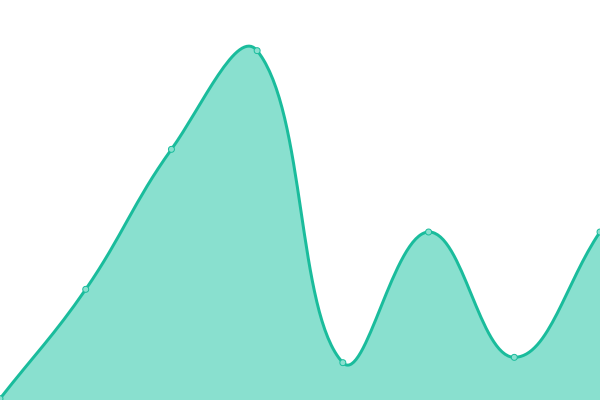 127ms
     
 | 

<a href="https://PatLittle.github.io/Consultations-Tracker/history/canadian-school-food-data-and-research-priorities">100.00%</a>
    

|  [Share your ideas: Blackwater Project](https://www.canada.ca/en/environment-climate-change/services/managing-pollution/sources-industry/mining/metal-diamond-mining-effluent-regulation/blackwater-consultation.html) | 🟥 Down | [share-your-ideas-blackwater-project.yml](https://github.com/PatLittle/Consultations-Tracker/commits/HEAD/history/share-your-ideas-blackwater-project.yml) | 

 141ms
     
 | 

<a href="https://PatLittle.github.io/Consultations-Tracker/history/share-your-ideas-blackwater-project">100.00%</a>
    

|  [Comment on: Draft Canada-Saskatchewan Equivalency Agreement on coal-fired electricity regulations (2025-2026)](https://www.canada.ca/en/environment-climate-change/services/canadian-environmental-protection-act-registry/agreements/equivalency/canada-saskatchewan-greenhouse-gas-electricity-producers-2025.html) | 🟩 Up | [comment-on-draft-canada-saskatchewan-equivalency-agreement-on-coal-fired-electricity-regulations-2025-2026.yml](https://github.com/PatLittle/Consultations-Tracker/commits/HEAD/history/comment-on-draft-canada-saskatchewan-equivalency-agreement-on-coal-fired-electricity-regulations-2025-2026.yml) | 

 149ms
     
 | 

<a href="https://PatLittle.github.io/Consultations-Tracker/history/comment-on-draft-canada-saskatchewan-equivalency-agreement-on-coal-fired-electricity-regulations-2025-2026">100.00%</a>
    

|  [Consultation on Proposed Amendments to the Export of Substances on the Export Control List Regulations](https://www.canada.ca/en/environment-climate-change/corporate/transparency/consultations/export-control-list-amendments.html) | 🟩 Up | [consultation-on-proposed-amendments-to-the-export-of-substances-on-the-export-control-list-regulations.yml](https://github.com/PatLittle/Consultations-Tracker/commits/HEAD/history/consultation-on-proposed-amendments-to-the-export-of-substances-on-the-export-control-list-regulations.yml) | 

 162ms
     
 | 

<a href="https://PatLittle.github.io/Consultations-Tracker/history/consultation-on-proposed-amendments-to-the-export-of-substances-on-the-export-control-list-regulations">100.00%</a>
    

|  [Draft implementation framework for a Right to a Healthy Environment in the Canadian Environmental Protection Act, 1999](https://www.canada.ca/en/environment-climate-change/corporate/transparency/consultations/draft-implementation-framework.html) | 🟩 Up | [draft-implementation-framework-for-a-right-to-a-healthy-environment-in-the-canadian-environmental-protection-act-1999.yml](https://github.com/PatLittle/Consultations-Tracker/commits/HEAD/history/draft-implementation-framework-for-a-right-to-a-healthy-environment-in-the-canadian-environmental-protection-act-1999.yml) | 

 0ms
     
 | 

<a href="https://PatLittle.github.io/Consultations-Tracker/history/draft-implementation-framework-for-a-right-to-a-healthy-environment-in-the-canadian-environmental-protection-act-1999">100.00%</a>
    

|  [Proposed Coal Mining Effluent Regulations](https://www.canada.ca/en/environment-climate-change/services/managing-pollution/sources-industry/mining-effluent/proposed-coal-mining-effluent-regulations.html) | 🟩 Up | [proposed-coal-mining-effluent-regulations.yml](https://github.com/PatLittle/Consultations-Tracker/commits/HEAD/history/proposed-coal-mining-effluent-regulations.yml) | 

 137ms
     
 | 

<a href="https://PatLittle.github.io/Consultations-Tracker/history/proposed-coal-mining-effluent-regulations">100.00%</a>
    

|  [Proposed Plan of Priorities](https://www.canada.ca/en/environment-climate-change/corporate/transparency/consultations/proposed-plan-priorities.html) | 🟩 Up | [proposed-plan-of-priorities.yml](https://github.com/PatLittle/Consultations-Tracker/commits/HEAD/history/proposed-plan-of-priorities.yml) | 

 120ms
     
 | 

<a href="https://PatLittle.github.io/Consultations-Tracker/history/proposed-plan-of-priorities">100.00%</a>
    

|  [Proposed Watch List Approach](https://www.canada.ca/en/environment-climate-change/corporate/transparency/consultations/proposed-watch-list.html) | 🟩 Up | [proposed-watch-list-approach.yml](https://github.com/PatLittle/Consultations-Tracker/commits/HEAD/history/proposed-watch-list-approach.yml) | 

 141ms
     
 | 

<a href="https://PatLittle.github.io/Consultations-Tracker/history/proposed-watch-list-approach">100.00%</a>
    

|  [Consultation on Amending the List of Species under the Species at Risk Act: Terrestrial Species January 2025](https://canada-preview.adobecqms.net/en/environment-climate-change/services/species-risk-public-registry/consultation-documents/part-3-consultation-amending-terrestrial-species-list-sara-summary-jan-2025.html) | 🟩 Up | [consultation-on-amending-the-list-of-species-under-the-species-at-risk-act-terrestrial-species-january-2025.yml](https://github.com/PatLittle/Consultations-Tracker/commits/HEAD/history/consultation-on-amending-the-list-of-species-under-the-species-at-risk-act-terrestrial-species-january-2025.yml) | 

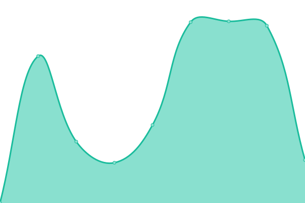 222ms
     
 | 

<a href="https://PatLittle.github.io/Consultations-Tracker/history/consultation-on-amending-the-list-of-species-under-the-species-at-risk-act-terrestrial-species-january-2025">100.00%</a>
    

|  [Roadmap to Extend the Life of Plastics in End-of-Use Electronics](https://canada.ca/en/environment-climate-change/services/managing-reducing-waste/consultations/roadmap-plastics-end-use-electronics.html) | 🟩 Up | [roadmap-to-extend-the-life-of-plastics-in-end-of-use-electronics.yml](https://github.com/PatLittle/Consultations-Tracker/commits/HEAD/history/roadmap-to-extend-the-life-of-plastics-in-end-of-use-electronics.yml) | 

 0ms
     
 | 

<a href="https://PatLittle.github.io/Consultations-Tracker/history/roadmap-to-extend-the-life-of-plastics-in-end-of-use-electronics">100.00%</a>
    

|  [Draft Assessment for the Fourteen Terpene and Terpenoid Substances Group and the Risk Management Scope](https://canadagazette.gc.ca/rp-pr/p1/2025/2025-01-25/html/notice-avis-eng.html#nl3) | 🟩 Up | [draft-assessment-for-the-fourteen-terpene-and-terpenoid-substances-group-and-the-risk-management-scope.yml](https://github.com/PatLittle/Consultations-Tracker/commits/HEAD/history/draft-assessment-for-the-fourteen-terpene-and-terpenoid-substances-group-and-the-risk-management-scope.yml) | 

 404ms
     
 | 

<a href="https://PatLittle.github.io/Consultations-Tracker/history/draft-assessment-for-the-fourteen-terpene-and-terpenoid-substances-group-and-the-risk-management-scope">100.00%</a>
    

|  [The Additional Risk Characterization Document for human health and the Risk Management Scope for melamine](https://gazette.gc.ca/rp-pr/p1/2025/2025-01-25/html/notice-avis-eng.html#nl4) | 🟩 Up | [the-additional-risk-characterization-document-for-human-health-and-the-risk-management-scope-for-melamine.yml](https://github.com/PatLittle/Consultations-Tracker/commits/HEAD/history/the-additional-risk-characterization-document-for-human-health-and-the-risk-management-scope-for-melamine.yml) | 

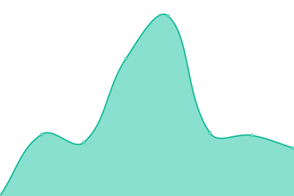 333ms
     
 | 

<a href="https://PatLittle.github.io/Consultations-Tracker/history/the-additional-risk-characterization-document-for-human-health-and-the-risk-management-scope-for-melamine">100.00%</a>
    

|  [Proposed Amendments to the Antarctic Environmental Protection Regulations](https://canadagazette.gc.ca/rp-pr/p1/2025/2025-02-08/html/reg1-eng.html) | 🟩 Up | [proposed-amendments-to-the-antarctic-environmental-protection-regulations.yml](https://github.com/PatLittle/Consultations-Tracker/commits/HEAD/history/proposed-amendments-to-the-antarctic-environmental-protection-regulations.yml) | 

 153ms
     
 | 

<a href="https://PatLittle.github.io/Consultations-Tracker/history/proposed-amendments-to-the-antarctic-environmental-protection-regulations">100.00%</a>
    

|  [Eastern Shore Islands Area of Interest Consultations](http://www.dfo-mpo.gc.ca/oceans/consultations/easternshore-ilescoteest/index-eng.html) | 🟩 Up | [eastern-shore-islands-area-of-interest-consultations.yml](https://github.com/PatLittle/Consultations-Tracker/commits/HEAD/history/eastern-shore-islands-area-of-interest-consultations.yml) | 

 419ms
     
 | 

<a href="https://PatLittle.github.io/Consultations-Tracker/history/eastern-shore-islands-area-of-interest-consultations">100.00%</a>
    

|  [Northern Gulf of St. Lawrence Study Area](https://www.dfo-mpo.gc.ca/oceans/canada-quebec-agreement-entente/index-eng.html) | 🟩 Up | [northern-gulf-of-st-lawrence-study-area.yml](https://github.com/PatLittle/Consultations-Tracker/commits/HEAD/history/northern-gulf-of-st-lawrence-study-area.yml) | 

 270ms
     
 | 

<a href="https://PatLittle.github.io/Consultations-Tracker/history/northern-gulf-of-st-lawrence-study-area">100.00%</a>
    

|  [Fundian Channel- Browns Bank Area of Interest](https://www.dfo-mpo.gc.ca/oceans/aoi-si/fundian-fundy-browns-eng.html) | 🟩 Up | [fundian-channel-browns-bank-area-of-interest.yml](https://github.com/PatLittle/Consultations-Tracker/commits/HEAD/history/fundian-channel-browns-bank-area-of-interest.yml) | 

 156ms
     
 | 

<a href="https://PatLittle.github.io/Consultations-Tracker/history/fundian-channel-browns-bank-area-of-interest">100.00%</a>
    

|  [Let's talk Pacific Salmon](https://letstalkpacificsalmon.ca/) | 🟩 Up | [let-s-talk-pacific-salmon.yml](https://github.com/PatLittle/Consultations-Tracker/commits/HEAD/history/let-s-talk-pacific-salmon.yml) | 

 1111ms
     
 | 

<a href="https://PatLittle.github.io/Consultations-Tracker/history/let-s-talk-pacific-salmon">100.00%</a>
    

|  [Proposed ticketing for the enforcement of a fisheries offence under the Fisheries Act](TBD) | 🟥 Down | [proposed-ticketing-for-the-enforcement-of-a-fisheries-offence-under-the-fisheries-act.yml](https://github.com/PatLittle/Consultations-Tracker/commits/HEAD/history/proposed-ticketing-for-the-enforcement-of-a-fisheries-offence-under-the-fisheries-act.yml) | 

 0ms
     
 | 

<a href="https://PatLittle.github.io/Consultations-Tracker/history/proposed-ticketing-for-the-enforcement-of-a-fisheries-offence-under-the-fisheries-act">100.00%</a>
    

|  [Marine Conservation Network Plan](https://www.dfo-mpo.gc.ca/oceans/networks-reseaux/development-developpement-eng.html) | 🟩 Up | [marine-conservation-network-plan.yml](https://github.com/PatLittle/Consultations-Tracker/commits/HEAD/history/marine-conservation-network-plan.yml) | 

 80ms
     
 | 

<a href="https://PatLittle.github.io/Consultations-Tracker/history/marine-conservation-network-plan">100.00%</a>
    

|  [Whitby Harbour Remediation Project](https://www.dfo-mpo.gc.ca/sch-ppb/whitby/index-eng.html) | 🟩 Up | [whitby-harbour-remediation-project.yml](https://github.com/PatLittle/Consultations-Tracker/commits/HEAD/history/whitby-harbour-remediation-project.yml) | 

 157ms
     
 | 

<a href="https://PatLittle.github.io/Consultations-Tracker/history/whitby-harbour-remediation-project">100.00%</a>
    

|  [Engagement to modernize or develop new policies, frameworks, instruments and guidance to further implement the fish and fish habitat protection provisions of the modernized Fisheries Act](https://www.dfo-mpo.gc.ca/campaign-campagne/fisheries-act-loi-sur-les-peches/introduction-eng.html) | 🟩 Up | [engagement-to-modernize-or-develop-new-policies-frameworks-instruments-and-guidance-to-further-implement-the-fish-and-fish-habitat-protection-provisions-of-the-modernized-fisheries-act.yml](https://github.com/PatLittle/Consultations-Tracker/commits/HEAD/history/engagement-to-modernize-or-develop-new-policies-frameworks-instruments-and-guidance-to-further-implement-the-fish-and-fish-habitat-protection-provisions-of-the-modernized-fisheries-act.yml) | 

 86ms
     
 | 

<a href="https://PatLittle.github.io/Consultations-Tracker/history/engagement-to-modernize-or-develop-new-policies-frameworks-instruments-and-guidance-to-further-implement-the-fish-and-fish-habitat-protection-provisions-of-the-modernized-fisheries-act">100.00%</a>
    

|  [Proposed Amendments to the Export Permits Regulations](https://www.international.gc.ca/trade-commerce/controls-controles/expor/backgrounder-amendments-epr-information-modification-rle.aspx?lang=eng) | 🟩 Up | [proposed-amendments-to-the-export-permits-regulations.yml](https://github.com/PatLittle/Consultations-Tracker/commits/HEAD/history/proposed-amendments-to-the-export-permits-regulations.yml) | 

 460ms
     
 | 

<a href="https://PatLittle.github.io/Consultations-Tracker/history/proposed-amendments-to-the-export-permits-regulations">100.00%</a>
    

|  [Consulting Canadians on a possible bilateral free trade agreement with the Philippines](https://international.canada.ca/en/global-affairs/consultations/2024-12-07-philippines-free-trade-agreement) | 🟩 Up | [consulting-canadians-on-a-possible-bilateral-free-trade-agreement-with-the-philippines.yml](https://github.com/PatLittle/Consultations-Tracker/commits/HEAD/history/consulting-canadians-on-a-possible-bilateral-free-trade-agreement-with-the-philippines.yml) | 

 488ms
     
 | 

<a href="https://PatLittle.github.io/Consultations-Tracker/history/consulting-canadians-on-a-possible-bilateral-free-trade-agreement-with-the-philippines">100.00%</a>
    

|  [Share your thoughts: Advance requests and medical assistance in dying](https://www.canada.ca/en/health-canada/programs/consultation-advance-requests-medical-assistance-dying.html) | 🟩 Up | [share-your-thoughts-advance-requests-and-medical-assistance-in-dying.yml](https://github.com/PatLittle/Consultations-Tracker/commits/HEAD/history/share-your-thoughts-advance-requests-and-medical-assistance-in-dying.yml) | 

 0ms
     
 | 

<a href="https://PatLittle.github.io/Consultations-Tracker/history/share-your-thoughts-advance-requests-and-medical-assistance-in-dying">100.00%</a>
    

|  [Regulations Amending the Pest Control Products Fees and Charges Regulations (Annual Charge)](https://gazette.gc.ca/rp-pr/p1/2024/2024-12-21/html/reg8-eng.html) | 🟩 Up | [regulations-amending-the-pest-control-products-fees-and-charges-regulations-annual-charge.yml](https://github.com/PatLittle/Consultations-Tracker/commits/HEAD/history/regulations-amending-the-pest-control-products-fees-and-charges-regulations-annual-charge.yml) | 

 457ms
     
 | 

<a href="https://PatLittle.github.io/Consultations-Tracker/history/regulations-amending-the-pest-control-products-fees-and-charges-regulations-annual-charge">100.00%</a>
    

|  [Share your views: Consultation on proposed amendments to regulations to address health product shortages in Canada](https://www.canada.ca/en/health-canada/programs/consultation-proposed-amendments-regulations-health-product-shortages.html) | 🟩 Up | [share-your-views-consultation-on-proposed-amendments-to-regulations-to-address-health-product-shortages-in-canada.yml](https://github.com/PatLittle/Consultations-Tracker/commits/HEAD/history/share-your-views-consultation-on-proposed-amendments-to-regulations-to-address-health-product-shortages-in-canada.yml) | 

 0ms
     
 | 

<a href="https://PatLittle.github.io/Consultations-Tracker/history/share-your-views-consultation-on-proposed-amendments-to-regulations-to-address-health-product-shortages-in-canada">100.00%</a>
    

|  [Release of draft (Step 2) ICH Guideline E6(R3) Annex 2: Good Clinical Practice](https://www.canada.ca/en/health-canada/services/drugs-health-products/drug-products/applications-submissions/guidance-documents/international-council-harmonisation/consultations-notices.html) | 🟩 Up | [release-of-draft-step-2-ich-guideline-e6-r3-annex-2-good-clinical-practice.yml](https://github.com/PatLittle/Consultations-Tracker/commits/HEAD/history/release-of-draft-step-2-ich-guideline-e6-r3-annex-2-good-clinical-practice.yml) | 

 138ms
     
 | 

<a href="https://PatLittle.github.io/Consultations-Tracker/history/release-of-draft-step-2-ich-guideline-e6-r3-annex-2-good-clinical-practice">100.00%</a>
    

|  [Release of draft (Step 2) ICH Guideline M15: Model Informed Drug Development](https://www.canada.ca/en/health-canada/services/drugs-health-products/drug-products/applications-submissions/guidance-documents/international-council-harmonisation/consultations-notices.html) | 🟩 Up | [release-of-draft-step-2-ich-guideline-m15-model-informed-drug-development.yml](https://github.com/PatLittle/Consultations-Tracker/commits/HEAD/history/release-of-draft-step-2-ich-guideline-m15-model-informed-drug-development.yml) | 

 124ms
     
 | 

<a href="https://PatLittle.github.io/Consultations-Tracker/history/release-of-draft-step-2-ich-guideline-m15-model-informed-drug-development">100.00%</a>
    

|  [Consultation: Draft Guidelines for Canadian Drinking Water Quality, Trihalomethanes](https://www.canada.ca/en/health-canada/programs/consultation-draft-guidelines-canadian-drinking-water-quality-trihalomethanes.html) | 🟩 Up | [consultation-draft-guidelines-for-canadian-drinking-water-quality-trihalomethanes.yml](https://github.com/PatLittle/Consultations-Tracker/commits/HEAD/history/consultation-draft-guidelines-for-canadian-drinking-water-quality-trihalomethanes.yml) | 

 176ms
     
 | 

<a href="https://PatLittle.github.io/Consultations-Tracker/history/consultation-draft-guidelines-for-canadian-drinking-water-quality-trihalomethanes">100.00%</a>
    

|  [Consultation on benzovindiflupyr, Proposed Maximum Residue Limit PMRL2025-01](https://www.canada.ca/en/health-canada/services/consumer-product-safety/pesticides-pest-management/public/consultations/proposed-maximum-residue-limit/2025/benzovindiflupyr.html) | 🟩 Up | [consultation-on-benzovindiflupyr-proposed-maximum-residue-limit-pmrl-2025-01.yml](https://github.com/PatLittle/Consultations-Tracker/commits/HEAD/history/consultation-on-benzovindiflupyr-proposed-maximum-residue-limit-pmrl-2025-01.yml) | 

 191ms
     
 | 

<a href="https://PatLittle.github.io/Consultations-Tracker/history/consultation-on-benzovindiflupyr-proposed-maximum-residue-limit-pmrl-2025-01">100.00%</a>
    

|  [Notice to Stakeholders – Consultation on the Impacts of Implementation of ICH M13A: Bioequivalence for Immediate Release Solid Oral Dosage Forms](https://www.canada.ca/en/health-canada/services/drugs-health-products/drug-products/announcements/notice-consultation-impacts-ich-m13a-bioequivalence-immediate-release-solid-oral-dosage-forms.html) | 🟩 Up | [notice-to-stakeholders-consultation-on-the-impacts-of-implementation-of-ich-m13-a-bioequivalence-for-immediate-release-solid-oral-dosage-forms.yml](https://github.com/PatLittle/Consultations-Tracker/commits/HEAD/history/notice-to-stakeholders-consultation-on-the-impacts-of-implementation-of-ich-m13-a-bioequivalence-for-immediate-release-solid-oral-dosage-forms.yml) | 

 154ms
     
 | 

<a href="https://PatLittle.github.io/Consultations-Tracker/history/notice-to-stakeholders-consultation-on-the-impacts-of-implementation-of-ich-m13-a-bioequivalence-for-immediate-release-solid-oral-dosage-forms">100.00%</a>
    

|  [Proposal to modify the Table of Permitted Nutrient Content Statements and Claims (free of sugars)](https://www.canada.ca/en/health-canada/services/food-nutrition/legislation-guidelines/acts-regulations/notices-proposal-notices-modification/table-permitted-nutrient-content-statements-claims-free-of-sugars.html) | 🟩 Up | [proposal-to-modify-the-table-of-permitted-nutrient-content-statements-and-claims-free-of-sugars.yml](https://github.com/PatLittle/Consultations-Tracker/commits/HEAD/history/proposal-to-modify-the-table-of-permitted-nutrient-content-statements-and-claims-free-of-sugars.yml) | 

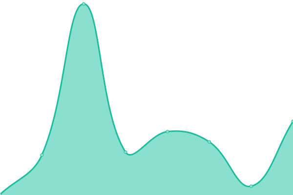 154ms
     
 | 

<a href="https://PatLittle.github.io/Consultations-Tracker/history/proposal-to-modify-the-table-of-permitted-nutrient-content-statements-and-claims-free-of-sugars">100.00%</a>
    

|  [Consultation on tebuconazole, Proposed Maximum Residue Limit PMRL2025-02](https://www.canada.ca/en/health-canada/services/consumer-product-safety/pesticides-pest-management/public/consultations/proposed-maximum-residue-limit/2025/tebuconazole.html) | 🟩 Up | [consultation-on-tebuconazole-proposed-maximum-residue-limit-pmrl-2025-02.yml](https://github.com/PatLittle/Consultations-Tracker/commits/HEAD/history/consultation-on-tebuconazole-proposed-maximum-residue-limit-pmrl-2025-02.yml) | 

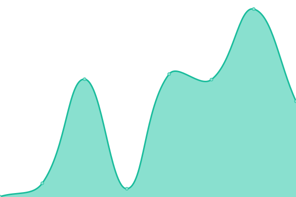 158ms
     
 | 

<a href="https://PatLittle.github.io/Consultations-Tracker/history/consultation-on-tebuconazole-proposed-maximum-residue-limit-pmrl-2025-02">100.00%</a>
    

|  [Consultation on Streptomyces lydicus Strain WYEC 108 and its associated end-use products, Proposed Re-evaluation Decision PRVD2025-01](https://www.canada.ca/en/health-canada/services/consumer-product-safety/pesticides-pest-management/public/consultations/proposed-re-evaluation-decisions/2025/streptomyces-lydicus-strain-wyec-108.html) | 🟩 Up | [consultation-on-streptomyces-lydicus-strain-wyec-108-and-its-associated-end-use-products-proposed-re-evaluation-decision-prvd-2025-01.yml](https://github.com/PatLittle/Consultations-Tracker/commits/HEAD/history/consultation-on-streptomyces-lydicus-strain-wyec-108-and-its-associated-end-use-products-proposed-re-evaluation-decision-prvd-2025-01.yml) | 

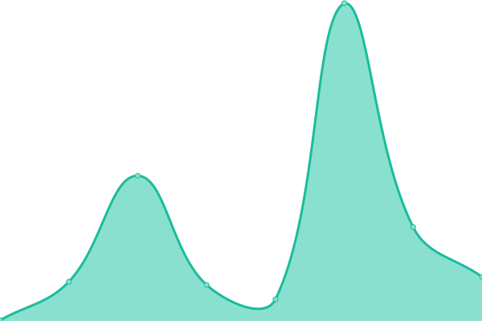 180ms
     
 | 

<a href="https://PatLittle.github.io/Consultations-Tracker/history/consultation-on-streptomyces-lydicus-strain-wyec-108-and-its-associated-end-use-products-proposed-re-evaluation-decision-prvd-2025-01">100.00%</a>
    

|  [Consultation: Proposal to Amend the Regulations for Precursors and Designated Devices](https://www.canada.ca/en/public-health/programs/consultation-proposal-amend-regulations-precursors-designated-devices.html) | 🟩 Up | [consultation-proposal-to-amend-the-regulations-for-precursors-and-designated-devices.yml](https://github.com/PatLittle/Consultations-Tracker/commits/HEAD/history/consultation-proposal-to-amend-the-regulations-for-precursors-and-designated-devices.yml) | 

 147ms
     
 | 

<a href="https://PatLittle.github.io/Consultations-Tracker/history/consultation-proposal-to-amend-the-regulations-for-precursors-and-designated-devices">100.00%</a>
    

|  [Consultation on lambda-cyhalothrin, Proposed Maximum Residue Limit PMRL2025-03](https://www.canada.ca/en/health-canada/services/consumer-product-safety/pesticides-pest-management/public/consultations/proposed-maximum-residue-limit/2025/lambda-cyhalothrin.html) | 🟩 Up | [consultation-on-lambda-cyhalothrin-proposed-maximum-residue-limit-pmrl-2025-03.yml](https://github.com/PatLittle/Consultations-Tracker/commits/HEAD/history/consultation-on-lambda-cyhalothrin-proposed-maximum-residue-limit-pmrl-2025-03.yml) | 

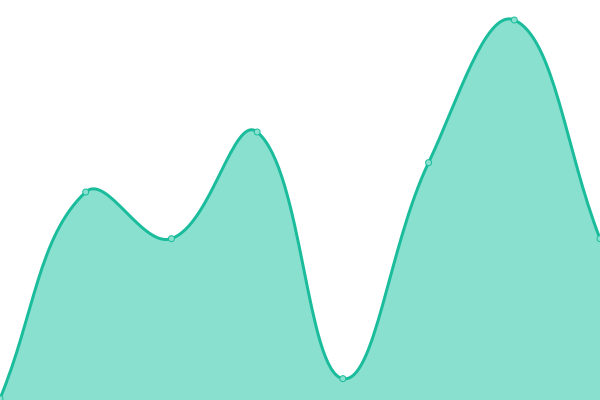 199ms
     
 | 

<a href="https://PatLittle.github.io/Consultations-Tracker/history/consultation-on-lambda-cyhalothrin-proposed-maximum-residue-limit-pmrl-2025-03">100.00%</a>
    

|  [Consultation: Proposal to amend the list of maximum residue limits for veterinary drugs in foods - Proposed MRL 2025-1](https://www.canada.ca/en/health-canada/programs/consultation-proposal-amend-list-maximum-residue-limits-veterinary-drugs-foods-mrl-2025-1.html) | 🟩 Up | [consultation-proposal-to-amend-the-list-of-maximum-residue-limits-for-veterinary-drugs-in-foods-proposed-mrl-2025-1.yml](https://github.com/PatLittle/Consultations-Tracker/commits/HEAD/history/consultation-proposal-to-amend-the-list-of-maximum-residue-limits-for-veterinary-drugs-in-foods-proposed-mrl-2025-1.yml) | 

 0ms
     
 | 

<a href="https://PatLittle.github.io/Consultations-Tracker/history/consultation-proposal-to-amend-the-list-of-maximum-residue-limits-for-veterinary-drugs-in-foods-proposed-mrl-2025-1">100.00%</a>
    

|  [Proposed Registration Decision PRD2025-01, Flg22-Bt Peptide, Vismax Seed Treatment, and Vismax Row Crop](https://www.canada.ca/en/health-canada/services/consumer-product-safety/pesticides-pest-management/public/consultations/proposed-registration-decisions/2025/flg22-bt-peptide-vismax-seed-treatment-row-crop.html) | 🟩 Up | [proposed-registration-decision-prd-2025-01-flg22-bt-peptide-vismax-seed-treatment-and-vismax-row-crop.yml](https://github.com/PatLittle/Consultations-Tracker/commits/HEAD/history/proposed-registration-decision-prd-2025-01-flg22-bt-peptide-vismax-seed-treatment-and-vismax-row-crop.yml) | 

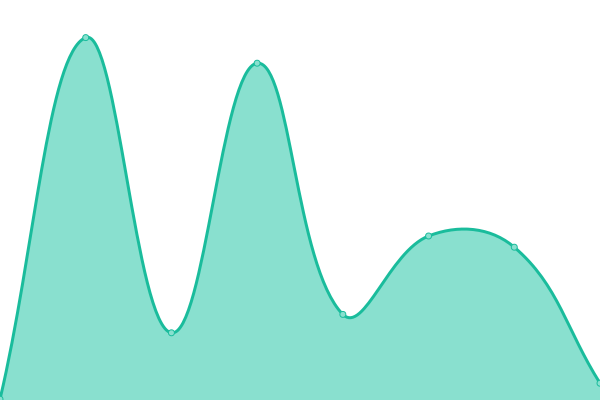 142ms
     
 | 

<a href="https://PatLittle.github.io/Consultations-Tracker/history/proposed-registration-decision-prd-2025-01-flg22-bt-peptide-vismax-seed-treatment-and-vismax-row-crop">100.00%</a>
    

|  [Regulations Amending the Immigration and Refugee Protection Regulations (Temporary Foreign Workers)](https://gazette.gc.ca/rp-pr/p1/2021/2021-07-10/html/reg2-eng.html) | 🟩 Up | [regulations-amending-the-immigration-and-refugee-protection-regulations-temporary-foreign-workers.yml](https://github.com/PatLittle/Consultations-Tracker/commits/HEAD/history/regulations-amending-the-immigration-and-refugee-protection-regulations-temporary-foreign-workers.yml) | 

 178ms
     
 | 

<a href="https://PatLittle.github.io/Consultations-Tracker/history/regulations-amending-the-immigration-and-refugee-protection-regulations-temporary-foreign-workers">100.00%</a>
    

|  [Crawford Nickel ProjectPublic NoticeComments Invited on the Summary of the Impact Statement](https://iaac-aeic.gc.ca/050/evaluations/document/159905?culture=en-CA) | 🟩 Up | [crawford-nickel-project-public-notice-comments-invited-on-the-summary-of-the-impact-statement.yml](https://github.com/PatLittle/Consultations-Tracker/commits/HEAD/history/crawford-nickel-project-public-notice-comments-invited-on-the-summary-of-the-impact-statement.yml) | 

 646ms
     
 | 

<a href="https://PatLittle.github.io/Consultations-Tracker/history/crawford-nickel-project-public-notice-comments-invited-on-the-summary-of-the-impact-statement">100.00%</a>
    

|  [Sussex Region Flood Diversion ProjectPublic NoticeComments Invited on the Summary of the Initial Project Description](https://iaac-aeic.gc.ca/050/evaluations/document/160494?culture=en-CA) | 🟩 Up | [sussex-region-flood-diversion-project-public-notice-comments-invited-on-the-summary-of-the-initial-project-description.yml](https://github.com/PatLittle/Consultations-Tracker/commits/HEAD/history/sussex-region-flood-diversion-project-public-notice-comments-invited-on-the-summary-of-the-initial-project-description.yml) | 

 434ms
     
 | 

<a href="https://PatLittle.github.io/Consultations-Tracker/history/sussex-region-flood-diversion-project-public-notice-comments-invited-on-the-summary-of-the-initial-project-description">100.00%</a>
    

|  [Sussex Region Flood Diversion ProjectPublic NoticeParticipant Funding Available](https://iaac-aeic.gc.ca/050/evaluations/document/160558?culture=en-CA) | 🟩 Up | [sussex-region-flood-diversion-project-public-notice-participant-funding-available.yml](https://github.com/PatLittle/Consultations-Tracker/commits/HEAD/history/sussex-region-flood-diversion-project-public-notice-participant-funding-available.yml) | 

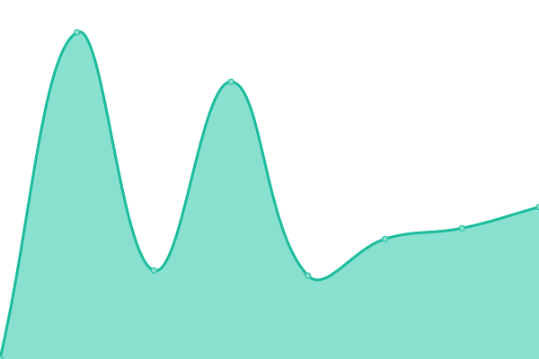 388ms
     
 | 

<a href="https://PatLittle.github.io/Consultations-Tracker/history/sussex-region-flood-diversion-project-public-notice-participant-funding-available">100.00%</a>
    

|  [Rose Lithium-Tantalum Mining ProjectPublic NoticePublic Comments Invited on Proposed Amendments to the Decision Statement](https://iaac-aeic.gc.ca/050/evaluations/document/160584?culture=en-CA) | 🟩 Up | [rose-lithium-tantalum-mining-project-public-notice-public-comments-invited-on-proposed-amendments-to-the-decision-statement.yml](https://github.com/PatLittle/Consultations-Tracker/commits/HEAD/history/rose-lithium-tantalum-mining-project-public-notice-public-comments-invited-on-proposed-amendments-to-the-decision-statement.yml) | 

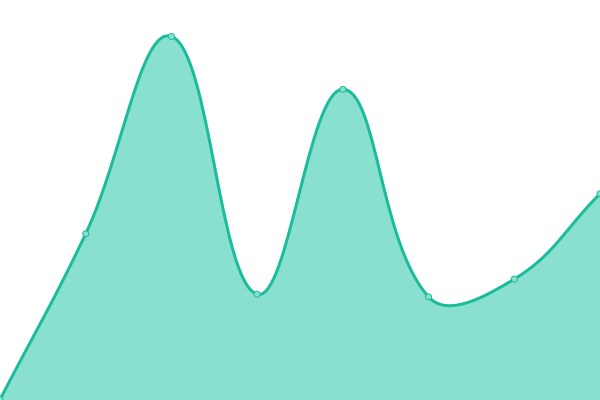 377ms
     
 | 

<a href="https://PatLittle.github.io/Consultations-Tracker/history/rose-lithium-tantalum-mining-project-public-notice-public-comments-invited-on-proposed-amendments-to-the-decision-statement">100.00%</a>
    

|  [Indian Oil and Gas Regulations - Phase II](http://www.pgic-iogc.gc.ca/eng/1471964522302/1471964567990) | 🟩 Up | [indian-oil-and-gas-regulations-phase-ii.yml](https://github.com/PatLittle/Consultations-Tracker/commits/HEAD/history/indian-oil-and-gas-regulations-phase-ii.yml) | 

 838ms
     
 | 

<a href="https://PatLittle.github.io/Consultations-Tracker/history/indian-oil-and-gas-regulations-phase-ii">100.00%</a>
    

|  [Indigenous Procurement Modernization (including Procurement Strategy for Aboriginal Business)](https://www.aadnc-aandc.gc.ca/eng/1554218527634/1554218554486) | 🟩 Up | [indigenous-procurement-modernization-including-procurement-strategy-for-aboriginal-business.yml](https://github.com/PatLittle/Consultations-Tracker/commits/HEAD/history/indigenous-procurement-modernization-including-procurement-strategy-for-aboriginal-business.yml) | 

 284ms
     
 | 

<a href="https://PatLittle.github.io/Consultations-Tracker/history/indigenous-procurement-modernization-including-procurement-strategy-for-aboriginal-business">100.00%</a>
    

|  [Developing laws and regulations for First Nations drinking water and wastewater: engagement 2022/2023](Developing laws and regulations for First Nations drinking water and wastewaterengagement 2022/2023 (sac-isc.gc.ca)) | 🟥 Down | [developing-laws-and-regulations-for-first-nations-drinking-water-and-wastewater-engagement-2022-2023.yml](https://github.com/PatLittle/Consultations-Tracker/commits/HEAD/history/developing-laws-and-regulations-for-first-nations-drinking-water-and-wastewater-engagement-2022-2023.yml) | 

 0ms
     
 | 

<a href="https://PatLittle.github.io/Consultations-Tracker/history/developing-laws-and-regulations-for-first-nations-drinking-water-and-wastewater-engagement-2022-2023">100.00%</a>
    

|  [Engagement 2023: Updating the Protocol For Centralised Drinking Water Systems in First Nations communities](https://www.sac-isc.gc.ca/eng/1689939603075/1689939693020) | 🟩 Up | [engagement-2023-updating-the-protocol-for-centralised-drinking-water-systems-in-first-nations-communities.yml](https://github.com/PatLittle/Consultations-Tracker/commits/HEAD/history/engagement-2023-updating-the-protocol-for-centralised-drinking-water-systems-in-first-nations-communities.yml) | 

 0ms
     
 | 

<a href="https://PatLittle.github.io/Consultations-Tracker/history/engagement-2023-updating-the-protocol-for-centralised-drinking-water-systems-in-first-nations-communities">100.00%</a>
    

|  [Competition Bureau invites feedback on changes to the Textile Labelling and Advertising Regulations](https://www.ic.gc.ca/eic/site/cb-bc.nsf/eng/h_00142.html) | 🟩 Up | [competition-bureau-invites-feedback-on-changes-to-the-textile-labelling-and-advertising-regulations.yml](https://github.com/PatLittle/Consultations-Tracker/commits/HEAD/history/competition-bureau-invites-feedback-on-changes-to-the-textile-labelling-and-advertising-regulations.yml) | 

 1861ms
     
 | 

<a href="https://PatLittle.github.io/Consultations-Tracker/history/competition-bureau-invites-feedback-on-changes-to-the-textile-labelling-and-advertising-regulations">100.00%</a>
    

|  [Canada Gazette, Part I: Public Consultations on proposed changes to the Patent Rules and Trademark Regulations in regards to the creation of the College of Patent Agents and Trademark Agents , as part of Budget Implementation Act, 2018, No. 2.](Not yet available) | 🟥 Down | [canada-gazette-part-i-public-consultations-on-proposed-changes-to-the-patent-rules-and-trademark-regulations-in-regards-to-the-creation-of-the-college-of-patent-agents-and-trademark-agents-as-part-of-budget-implementation-act-2018-no-2.yml](https://github.com/PatLittle/Consultations-Tracker/commits/HEAD/history/canada-gazette-part-i-public-consultations-on-proposed-changes-to-the-patent-rules-and-trademark-regulations-in-regards-to-the-creation-of-the-college-of-patent-agents-and-trademark-agents-as-part-of-budget-implementation-act-2018-no-2.yml) | 

 0ms
     
 | 

<a href="https://PatLittle.github.io/Consultations-Tracker/history/canada-gazette-part-i-public-consultations-on-proposed-changes-to-the-patent-rules-and-trademark-regulations-in-regards-to-the-creation-of-the-college-of-patent-agents-and-trademark-agents-as-part-of-budget-implementation-act-2018-no-2">100.00%</a>
    

|  [Notice No. TIPB-001-2024 — Petition to the Governor in Council concerning Telecom Decision CRTC 2023-358](https://canadagazette.gc.ca/rp-pr/p1/2024/2024-04-27/pdf/g1-15817.pdf) | 🟩 Up | [notice-no-tipb-001-2024-petition-to-the-governor-in-council-concerning-telecom-decision-crtc-2023-358.yml](https://github.com/PatLittle/Consultations-Tracker/commits/HEAD/history/notice-no-tipb-001-2024-petition-to-the-governor-in-council-concerning-telecom-decision-crtc-2023-358.yml) | 

 885ms
     
 | 

<a href="https://PatLittle.github.io/Consultations-Tracker/history/notice-no-tipb-001-2024-petition-to-the-governor-in-council-concerning-telecom-decision-crtc-2023-358">100.00%</a>
    

|  [Amendments to Directive No 11R3, Surplus Income Directive](https://ised-isde.canada.ca/site/office-superintendent-bankruptcy/en/public-consultations) | 🟩 Up | [amendments-to-directive-no-11-r3-surplus-income-directive.yml](https://github.com/PatLittle/Consultations-Tracker/commits/HEAD/history/amendments-to-directive-no-11-r3-surplus-income-directive.yml) | 

 455ms
     
 | 

<a href="https://PatLittle.github.io/Consultations-Tracker/history/amendments-to-directive-no-11-r3-surplus-income-directive">100.00%</a>
    

|  [Consultation on a Policy, and Licensing, and Technical Framework for Supplemental Mobile Coverage by Satellite](https://ised-isde.canada.ca/site/spectrum-management-telecommunications/en/learn-more/key-documents/consultations/consultation-policy-licensing-and-technical-framework-supplemental-mobile-coverage-satellite) | 🟩 Up | [consultation-on-a-policy-and-licensing-and-technical-framework-for-supplemental-mobile-coverage-by-satellite.yml](https://github.com/PatLittle/Consultations-Tracker/commits/HEAD/history/consultation-on-a-policy-and-licensing-and-technical-framework-for-supplemental-mobile-coverage-by-satellite.yml) | 

 93ms
     
 | 

<a href="https://PatLittle.github.io/Consultations-Tracker/history/consultation-on-a-policy-and-licensing-and-technical-framework-for-supplemental-mobile-coverage-by-satellite">100.00%</a>
    

|  [Indigenous Advisory Circle](https://library-archives.canada.ca/eng/corporate/about-us/our-partners/Pages/indigenous-advisory-circle.aspx) | 🟩 Up | [indigenous-advisory-circle.yml](https://github.com/PatLittle/Consultations-Tracker/commits/HEAD/history/indigenous-advisory-circle.yml) | 

 583ms
     
 | 

<a href="https://PatLittle.github.io/Consultations-Tracker/history/indigenous-advisory-circle">100.00%</a>
    

|  [Stakeholders' Forum](https://library-archives.canada.ca/eng/corporate/about-us/our-partners/pages/stakeholders-forum.aspx) | 🟩 Up | [stakeholders-forum.yml](https://github.com/PatLittle/Consultations-Tracker/commits/HEAD/history/stakeholders-forum.yml) | 

 386ms
     
 | 

<a href="https://PatLittle.github.io/Consultations-Tracker/history/stakeholders-forum">100.00%</a>
    

|  [Services Consultation Committee](https://library-archives.canada.ca/eng/corporate/about-us/our-partners/Pages/services-consultation-group.aspx) | 🟩 Up | [services-consultation-committee.yml](https://github.com/PatLittle/Consultations-Tracker/commits/HEAD/history/services-consultation-committee.yml) | 

 409ms
     
 | 

<a href="https://PatLittle.github.io/Consultations-Tracker/history/services-consultation-committee">100.00%</a>
    

|  [Youth Advisory Council](https://library-archives.canada.ca/eng/corporate/about-us/our-partners/Pages/youth-advisory-council.aspx) | 🟩 Up | [youth-advisory-council.yml](https://github.com/PatLittle/Consultations-Tracker/commits/HEAD/history/youth-advisory-council.yml) | 

 344ms
     
 | 

<a href="https://PatLittle.github.io/Consultations-Tracker/history/youth-advisory-council">100.00%</a>
    

|  [Consultation to inform the regulatory development to support the implementation of An Act to amend the National Defence Act and to make related and consequential amendments to other Acts](https://www.canada.ca/en/department-national-defence/services/benefits-military/legal-services/victim-service-offence.html) | 🟩 Up | [consultation-to-inform-the-regulatory-development-to-support-the-implementation-of-an-act-to-amend-the-national-defence-act-and-to-make-related-and-consequential-amendments-to-other-acts.yml](https://github.com/PatLittle/Consultations-Tracker/commits/HEAD/history/consultation-to-inform-the-regulatory-development-to-support-the-implementation-of-an-act-to-amend-the-national-defence-act-and-to-make-related-and-consequential-amendments-to-other-acts.yml) | 

 160ms
     
 | 

<a href="https://PatLittle.github.io/Consultations-Tracker/history/consultation-to-inform-the-regulatory-development-to-support-the-implementation-of-an-act-to-amend-the-national-defence-act-and-to-make-related-and-consequential-amendments-to-other-acts">100.00%</a>
    

|  [Consultation to inform the regulatory development to support the implementation of An Act to amend the National Defence Act and to make related and consequential amendments to other Acts](https://www.canada.ca/en/department-national-defence/services/benefits-military/legal-services/victim-service-offence.html) | 🟩 Up | [consultation-to-inform-the-regulatory-development-to-support-the-implementation-of-an-act-to-amend-the-national-defence-act-and-to-make-related-and-consequential-amendments-to-other-acts.yml](https://github.com/PatLittle/Consultations-Tracker/commits/HEAD/history/consultation-to-inform-the-regulatory-development-to-support-the-implementation-of-an-act-to-amend-the-national-defence-act-and-to-make-related-and-consequential-amendments-to-other-acts.yml) | 

 160ms
     
 | 

<a href="https://PatLittle.github.io/Consultations-Tracker/history/consultation-to-inform-the-regulatory-development-to-support-the-implementation-of-an-act-to-amend-the-national-defence-act-and-to-make-related-and-consequential-amendments-to-other-acts">100.00%</a>
    

|  [Social systems professional services](www.marsdd.com) | 🟩 Up | [social-systems-professional-services.yml](https://github.com/PatLittle/Consultations-Tracker/commits/HEAD/history/social-systems-professional-services.yml) | 

 300ms
     
 | 

<a href="https://PatLittle.github.io/Consultations-Tracker/history/social-systems-professional-services">100.00%</a>
    

|  [Indigenous Ministerial Arrangements Regulations](https://www.rncanengagenrcan.ca/en/content/development-new-indigenous-ministerial-arrangements-regulations) | 🟩 Up | [indigenous-ministerial-arrangements-regulations.yml](https://github.com/PatLittle/Consultations-Tracker/commits/HEAD/history/indigenous-ministerial-arrangements-regulations.yml) | 

 1591ms
     
 | 

<a href="https://PatLittle.github.io/Consultations-Tracker/history/indigenous-ministerial-arrangements-regulations">100.00%</a>
    

|  [Collaborative Geospatial Data Strategy for Canada](https://www.letstalknaturalresources.ca/geospatial-data-strategy) | 🟩 Up | [collaborative-geospatial-data-strategy-for-canada.yml](https://github.com/PatLittle/Consultations-Tracker/commits/HEAD/history/collaborative-geospatial-data-strategy-for-canada.yml) | 

 1943ms
     
 | 

<a href="https://PatLittle.github.io/Consultations-Tracker/history/collaborative-geospatial-data-strategy-for-canada">100.00%</a>
    

|  [General Regulations under the Canada National Marine Conservation Areas Act](https://www.letstalknmcas.ca/) | 🟩 Up | [general-regulations-under-the-canada-national-marine-conservation-areas-act.yml](https://github.com/PatLittle/Consultations-Tracker/commits/HEAD/history/general-regulations-under-the-canada-national-marine-conservation-areas-act.yml) | 

 1253ms
     
 | 

<a href="https://PatLittle.github.io/Consultations-Tracker/history/general-regulations-under-the-canada-national-marine-conservation-areas-act">100.00%</a>
    

|  [Notice of Mooring Restrictions – Ontario Waterways - Trent-Severn Waterway National Historic Site](https://parks.canada.ca/lhn-nhs/on/trentsevern/info/avis-restrictions-amarrage-notice-mooring-restrictions/) | 🟩 Up | [notice-of-mooring-restrictions-ontario-waterways-trent-severn-waterway-national-historic-site.yml](https://github.com/PatLittle/Consultations-Tracker/commits/HEAD/history/notice-of-mooring-restrictions-ontario-waterways-trent-severn-waterway-national-historic-site.yml) | 

 754ms
     
 | 

<a href="https://PatLittle.github.io/Consultations-Tracker/history/notice-of-mooring-restrictions-ontario-waterways-trent-severn-waterway-national-historic-site">100.00%</a>
    

|  [Notice of Mooring Restrictions – Ontario Waterways - Rideau Canal National Historic Site](https://parks.canada.ca/lhn-nhs/on/rideau/info/avis-restrictions-amarrage-notice-mooring-restrictions/) | 🟩 Up | [notice-of-mooring-restrictions-ontario-waterways-rideau-canal-national-historic-site.yml](https://github.com/PatLittle/Consultations-Tracker/commits/HEAD/history/notice-of-mooring-restrictions-ontario-waterways-rideau-canal-national-historic-site.yml) | 

 308ms
     
 | 

<a href="https://PatLittle.github.io/Consultations-Tracker/history/notice-of-mooring-restrictions-ontario-waterways-rideau-canal-national-historic-site">100.00%</a>
    

|  [Fortress of Louisbourg National Historic Site Management Plan](https://www.pc.gc.ca/en/lhn-nhs/ns/louisbourg/info/plan) | 🟩 Up | [fortress-of-louisbourg-national-historic-site-management-plan.yml](https://github.com/PatLittle/Consultations-Tracker/commits/HEAD/history/fortress-of-louisbourg-national-historic-site-management-plan.yml) | 

 459ms
     
 | 

<a href="https://PatLittle.github.io/Consultations-Tracker/history/fortress-of-louisbourg-national-historic-site-management-plan">100.00%</a>
    

|  [Visitor Use Management - Jasper National Park](https://www.letstalkmountainparks.ca/visitor-use-management-jasper) | 🟩 Up | [visitor-use-management-jasper-national-park.yml](https://github.com/PatLittle/Consultations-Tracker/commits/HEAD/history/visitor-use-management-jasper-national-park.yml) | 

 581ms
     
 | 

<a href="https://PatLittle.github.io/Consultations-Tracker/history/visitor-use-management-jasper-national-park">100.00%</a>
    

|  [Visitor Use Management - Lake Louise Area](https://www.letstalkmountainparks.ca/lakelouisevum) | 🟩 Up | [visitor-use-management-lake-louise-area.yml](https://github.com/PatLittle/Consultations-Tracker/commits/HEAD/history/visitor-use-management-lake-louise-area.yml) | 

 557ms
     
 | 

<a href="https://PatLittle.github.io/Consultations-Tracker/history/visitor-use-management-lake-louise-area">100.00%</a>
    

|  [Updating the Community Plans for Field, B.C. and Lake Louise, Alberta](https://www.letstalkmountainparks.ca/communityplanupdates) | 🟩 Up | [updating-the-community-plans-for-field-b-c-and-lake-louise-alberta.yml](https://github.com/PatLittle/Consultations-Tracker/commits/HEAD/history/updating-the-community-plans-for-field-b-c-and-lake-louise-alberta.yml) | 

 463ms
     
 | 

<a href="https://PatLittle.github.io/Consultations-Tracker/history/updating-the-community-plans-for-field-b-c-and-lake-louise-alberta">100.00%</a>
    

|  [Saguenay-St. Lawrence Marine Park expansion project](https://parcmarin.qc.ca/consultations/home/) | 🟩 Up | [saguenay-st-lawrence-marine-park-expansion-project.yml](https://github.com/PatLittle/Consultations-Tracker/commits/HEAD/history/saguenay-st-lawrence-marine-park-expansion-project.yml) | 

 2271ms
     
 | 

<a href="https://PatLittle.github.io/Consultations-Tracker/history/saguenay-st-lawrence-marine-park-expansion-project">100.00%</a>
    

|  [Public Engagement on the Strategic Environmental Assessment for the Town of Banff railway lands area redevelopment plan](www.letstalkmountainparks.ca/town-of-banff-area-redevelopment-plan-strategic-environmental-assessment) | 🟩 Up | [public-engagement-on-the-strategic-environmental-assessment-for-the-town-of-banff-railway-lands-area-redevelopment-plan.yml](https://github.com/PatLittle/Consultations-Tracker/commits/HEAD/history/public-engagement-on-the-strategic-environmental-assessment-for-the-town-of-banff-railway-lands-area-redevelopment-plan.yml) | 

 633ms
     
 | 

<a href="https://PatLittle.github.io/Consultations-Tracker/history/public-engagement-on-the-strategic-environmental-assessment-for-the-town-of-banff-railway-lands-area-redevelopment-plan">100.00%</a>
    

|  [Town of Banff Railways Lands Area Redevelopment Plan - Term of Reference for Strategic Environmental Assessment](https://www.letstalkmountainparks.ca/town-of-banff-area-redevelopment-plan-strategic-environmental-assessment/widgets/194782/documents) | 🟩 Up | [town-of-banff-railways-lands-area-redevelopment-plan-term-of-reference-for-strategic-environmental-assessment.yml](https://github.com/PatLittle/Consultations-Tracker/commits/HEAD/history/town-of-banff-railways-lands-area-redevelopment-plan-term-of-reference-for-strategic-environmental-assessment.yml) | 

 370ms
     
 | 

<a href="https://PatLittle.github.io/Consultations-Tracker/history/town-of-banff-railways-lands-area-redevelopment-plan-term-of-reference-for-strategic-environmental-assessment">100.00%</a>
    

|  [Consultation – Proposed national park in the Teetł’it Gwinjik (Peel River) Watershed](https://parks.canada.ca/pn-np/cnpn-cnnp/teetlit-gwinjik-peel) | 🟩 Up | [consultation-proposed-national-park-in-the-teetl-it-gwinjik-peel-river-watershed.yml](https://github.com/PatLittle/Consultations-Tracker/commits/HEAD/history/consultation-proposed-national-park-in-the-teetl-it-gwinjik-peel-river-watershed.yml) | 

 0ms
     
 | 

<a href="https://PatLittle.github.io/Consultations-Tracker/history/consultation-proposed-national-park-in-the-teetl-it-gwinjik-peel-river-watershed">100.00%</a>
    

|  [National Strategy to Combat Human Trafficking (HT) Targeted Engagement Annual Engagement](https://www.canada.ca/en/services/policing/police/crime-and-crime-prevention/human-trafficking-smuggling/nggmnt-rnwd-hmntrffckng.html) | 🟩 Up | [national-strategy-to-combat-human-trafficking-ht-targeted-engagement-annual-engagement.yml](https://github.com/PatLittle/Consultations-Tracker/commits/HEAD/history/national-strategy-to-combat-human-trafficking-ht-targeted-engagement-annual-engagement.yml) | 

 348ms
     
 | 

<a href="https://PatLittle.github.io/Consultations-Tracker/history/national-strategy-to-combat-human-trafficking-ht-targeted-engagement-annual-engagement">100.00%</a>
    

|  [Targeted Stakeholder Engagement to Inform Canada’s Public Safety Broadband Network (PSBN)](https://www.canada.ca/en/services/policing/emergencies/consultation-governance-framework-psbn.html) | 🟩 Up | [targeted-stakeholder-engagement-to-inform-canada-s-public-safety-broadband-network-psbn.yml](https://github.com/PatLittle/Consultations-Tracker/commits/HEAD/history/targeted-stakeholder-engagement-to-inform-canada-s-public-safety-broadband-network-psbn.yml) | 

 240ms
     
 | 

<a href="https://PatLittle.github.io/Consultations-Tracker/history/targeted-stakeholder-engagement-to-inform-canada-s-public-safety-broadband-network-psbn">100.00%</a>
    

|  [PSPC Controlled Goods Program’s Industry Engagement Committee (IEC)](https://www.tpsgc-pwgsc.gc.ca/pmc-cgp/pipmc-secgp-eng.html) | 🟥 Down | [pspc-controlled-goods-program-s-industry-engagement-committee-iec.yml](https://github.com/PatLittle/Consultations-Tracker/commits/HEAD/history/pspc-controlled-goods-program-s-industry-engagement-committee-iec.yml) | 

 332ms
     
 | 

<a href="https://PatLittle.github.io/Consultations-Tracker/history/pspc-controlled-goods-program-s-industry-engagement-committee-iec">100.00%</a>
    

|  [Three-year Departmental Accessibility Plan](https://www.canada.ca/en/public-services-procurement/corporate/accessibility.html) | 🟩 Up | [three-year-departmental-accessibility-plan.yml](https://github.com/PatLittle/Consultations-Tracker/commits/HEAD/history/three-year-departmental-accessibility-plan.yml) | 

 156ms
     
 | 

<a href="https://PatLittle.github.io/Consultations-Tracker/history/three-year-departmental-accessibility-plan">100.00%</a>
    

|  [Public Lands for Homes](https://www.canada.ca/en/public-services-procurement/services/infrastructure-buildings/public-lands-homes.html) | 🟩 Up | [public-lands-for-homes.yml](https://github.com/PatLittle/Consultations-Tracker/commits/HEAD/history/public-lands-for-homes.yml) | 

 135ms
     
 | 

<a href="https://PatLittle.github.io/Consultations-Tracker/history/public-lands-for-homes">100.00%</a>
    

|  [Multifactor Productivity Application](https://www.statcan.gc.ca/eng/consultation/2019/mpa) | 🟩 Up | [multifactor-productivity-application.yml](https://github.com/PatLittle/Consultations-Tracker/commits/HEAD/history/multifactor-productivity-application.yml) | 

 436ms
     
 | 

<a href="https://PatLittle.github.io/Consultations-Tracker/history/multifactor-productivity-application">100.00%</a>
    

|  [Statistics Canada Client Survey 2022](https://www.statcan.gc.ca/en/consultation/2022/sccs2022) | 🟩 Up | [statistics-canada-client-survey-2022.yml](https://github.com/PatLittle/Consultations-Tracker/commits/HEAD/history/statistics-canada-client-survey-2022.yml) | 

 98ms
     
 | 

<a href="https://PatLittle.github.io/Consultations-Tracker/history/statistics-canada-client-survey-2022">100.00%</a>
    

|  [Census of the Environment Program](https://www.statcan.gc.ca/en/consultation/2022/coep) | 🟩 Up | [census-of-the-environment-program.yml](https://github.com/PatLittle/Consultations-Tracker/commits/HEAD/history/census-of-the-environment-program.yml) | 

 82ms
     
 | 

<a href="https://PatLittle.github.io/Consultations-Tracker/history/census-of-the-environment-program">100.00%</a>
    

|  [Missing persons data standards consultative engagement](https://www.statcan.gc.ca/en/consultation/2023/missing-persons-data-standards) | 🟩 Up | [missing-persons-data-standards-consultative-engagement.yml](https://github.com/PatLittle/Consultations-Tracker/commits/HEAD/history/missing-persons-data-standards-consultative-engagement.yml) | 

 101ms
     
 | 

<a href="https://PatLittle.github.io/Consultations-Tracker/history/missing-persons-data-standards-consultative-engagement">100.00%</a>
    

|  [Census Data on Demand (CDOD) program consultative engagement](https://www.statcan.gc.ca/en/consultation/2023/census-data-on-demand) | 🟩 Up | [census-data-on-demand-cdod-program-consultative-engagement.yml](https://github.com/PatLittle/Consultations-Tracker/commits/HEAD/history/census-data-on-demand-cdod-program-consultative-engagement.yml) | 

 62ms
     
 | 

<a href="https://PatLittle.github.io/Consultations-Tracker/history/census-data-on-demand-cdod-program-consultative-engagement">100.00%</a>
    

|  [Invitation to participate in the revision of the North American Industry Classification System (NAICS) Canada](https://www.statcan.gc.ca/en/consultation/2023/naics) | 🟩 Up | [invitation-to-participate-in-the-revision-of-the-north-american-industry-classification-system-naics-canada.yml](https://github.com/PatLittle/Consultations-Tracker/commits/HEAD/history/invitation-to-participate-in-the-revision-of-the-north-american-industry-classification-system-naics-canada.yml) | 

 0ms
     
 | 

<a href="https://PatLittle.github.io/Consultations-Tracker/history/invitation-to-participate-in-the-revision-of-the-north-american-industry-classification-system-naics-canada">100.00%</a>
    

|  [Invitation to participate in the revision of the North American Product Classification System (NAPCS) Canada](https://www.statcan.gc.ca/en/consultation/2023/napcs) | 🟩 Up | [invitation-to-participate-in-the-revision-of-the-north-american-product-classification-system-napcs-canada.yml](https://github.com/PatLittle/Consultations-Tracker/commits/HEAD/history/invitation-to-participate-in-the-revision-of-the-north-american-product-classification-system-napcs-canada.yml) | 

 0ms
     
 | 

<a href="https://PatLittle.github.io/Consultations-Tracker/history/invitation-to-participate-in-the-revision-of-the-north-american-product-classification-system-napcs-canada">100.00%</a>
    

|  [Invitation to participate in a flood awareness consultative engagement](https://www.statcan.gc.ca/en/consultation/2024/flood-awareness) | 🟩 Up | [invitation-to-participate-in-a-flood-awareness-consultative-engagement.yml](https://github.com/PatLittle/Consultations-Tracker/commits/HEAD/history/invitation-to-participate-in-a-flood-awareness-consultative-engagement.yml) | 

 0ms
     
 | 

<a href="https://PatLittle.github.io/Consultations-Tracker/history/invitation-to-participate-in-a-flood-awareness-consultative-engagement">100.00%</a>
    

|  [Invitation to participate in the revision of the Classification of Instructional Programs (CIP) Canada](https://www.statcan.gc.ca/en/consultation/2024/cip) | 🟩 Up | [invitation-to-participate-in-the-revision-of-the-classification-of-instructional-programs-cip-canada.yml](https://github.com/PatLittle/Consultations-Tracker/commits/HEAD/history/invitation-to-participate-in-the-revision-of-the-classification-of-instructional-programs-cip-canada.yml) | 

 0ms
     
 | 

<a href="https://PatLittle.github.io/Consultations-Tracker/history/invitation-to-participate-in-the-revision-of-the-classification-of-instructional-programs-cip-canada">100.00%</a>
    

|  [Invitation to participate in the revision of the National Occupational Classification (NOC)](https://www.statcan.gc.ca/en/consultation/2024/noc) | 🟩 Up | [invitation-to-participate-in-the-revision-of-the-national-occupational-classification-noc.yml](https://github.com/PatLittle/Consultations-Tracker/commits/HEAD/history/invitation-to-participate-in-the-revision-of-the-national-occupational-classification-noc.yml) | 

 0ms
     
 | 

<a href="https://PatLittle.github.io/Consultations-Tracker/history/invitation-to-participate-in-the-revision-of-the-national-occupational-classification-noc">100.00%</a>
    

|  [Share your input on Statistics Canada’s service to the accessibility and disability community](https://www.statcan.gc.ca/en/consultation/2024/accessibility-disability) | 🟩 Up | [share-your-input-on-statistics-canada-s-service-to-the-accessibility-and-disability-community.yml](https://github.com/PatLittle/Consultations-Tracker/commits/HEAD/history/share-your-input-on-statistics-canada-s-service-to-the-accessibility-and-disability-community.yml) | 

 67ms
     
 | 

<a href="https://PatLittle.github.io/Consultations-Tracker/history/share-your-input-on-statistics-canada-s-service-to-the-accessibility-and-disability-community">100.00%</a>
    

|  [Participate in the permanent consultation for the revision of the Canadian Research and Development Classification (CRDC)](https://www.statcan.gc.ca/en/consultation/2025/crdc) | 🟩 Up | [participate-in-the-permanent-consultation-for-the-revision-of-the-canadian-research-and-development-classification-crdc.yml](https://github.com/PatLittle/Consultations-Tracker/commits/HEAD/history/participate-in-the-permanent-consultation-for-the-revision-of-the-canadian-research-and-development-classification-crdc.yml) | 

 0ms
     
 | 

<a href="https://PatLittle.github.io/Consultations-Tracker/history/participate-in-the-permanent-consultation-for-the-revision-of-the-canadian-research-and-development-classification-crdc">100.00%</a>
    

|  [Share your input on Statistics Canada’s Direct Health Measures Programs](https://www.statcan.gc.ca/en/consultation/2025/direct-health-measures) | 🟩 Up | [share-your-input-on-statistics-canada-s-direct-health-measures-programs.yml](https://github.com/PatLittle/Consultations-Tracker/commits/HEAD/history/share-your-input-on-statistics-canada-s-direct-health-measures-programs.yml) | 

 69ms
     
 | 

<a href="https://PatLittle.github.io/Consultations-Tracker/history/share-your-input-on-statistics-canada-s-direct-health-measures-programs">100.00%</a>
    

|  [Share your input on Measures to Collect Health Information with the Centre for Direct Health Measures](https://www.statcan.gc.ca/en/consultation/2025/measures-collect-health-information) | 🟩 Up | [share-your-input-on-measures-to-collect-health-information-with-the-centre-for-direct-health-measures.yml](https://github.com/PatLittle/Consultations-Tracker/commits/HEAD/history/share-your-input-on-measures-to-collect-health-information-with-the-centre-for-direct-health-measures.yml) | 

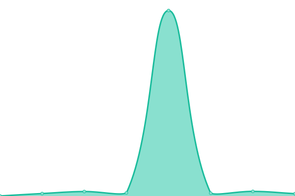 73ms
     
 | 

<a href="https://PatLittle.github.io/Consultations-Tracker/history/share-your-input-on-measures-to-collect-health-information-with-the-centre-for-direct-health-measures">100.00%</a>
    

|  [Watchlist 2020 mid-cycle consultation with industry](https://www.tsb.gc.ca/eng/qui-about/relation.html) | 🟥 Down | [watchlist-2020-mid-cycle-consultation-with-industry.yml](https://github.com/PatLittle/Consultations-Tracker/commits/HEAD/history/watchlist-2020-mid-cycle-consultation-with-industry.yml) | 

 594ms
     
 | 

<a href="https://PatLittle.github.io/Consultations-Tracker/history/watchlist-2020-mid-cycle-consultation-with-industry">100.00%</a>
    

|  [Watchlist 2025 mid-cycle consultations with industry](https://www.tsb.gc.ca/eng/surveillance-watchlist/2022.html) | 🟩 Up | [watchlist-2025-mid-cycle-consultations-with-industry.yml](https://github.com/PatLittle/Consultations-Tracker/commits/HEAD/history/watchlist-2025-mid-cycle-consultations-with-industry.yml) | 

 854ms
     
 | 

<a href="https://PatLittle.github.io/Consultations-Tracker/history/watchlist-2025-mid-cycle-consultations-with-industry">100.00%</a>
    

|  [Oceans Protection Plan](https://www.letstalktransportation.ca/OPP) | 🟩 Up | [oceans-protection-plan.yml](https://github.com/PatLittle/Consultations-Tracker/commits/HEAD/history/oceans-protection-plan.yml) | 

 1017ms
     
 | 

<a href="https://PatLittle.github.io/Consultations-Tracker/history/oceans-protection-plan">100.00%</a>
    

|  [OPP - Understanding the Cumulative Effects of Marine Vessel Activity on Coastal and Marine Environments](https://letstalktransportation.ca/understanding-the-effects-of-marine-vessel-activity-on-coastal-environments) | 🟩 Up | [opp-understanding-the-cumulative-effects-of-marine-vessel-activity-on-coastal-and-marine-environments.yml](https://github.com/PatLittle/Consultations-Tracker/commits/HEAD/history/opp-understanding-the-cumulative-effects-of-marine-vessel-activity-on-coastal-and-marine-environments.yml) | 

 486ms
     
 | 

<a href="https://PatLittle.github.io/Consultations-Tracker/history/opp-understanding-the-cumulative-effects-of-marine-vessel-activity-on-coastal-and-marine-environments">100.00%</a>
    

|  [OPP: Northern Low-Impact Shipping Corridors](https://www.dfo-mpo.gc.ca/about-notre-sujet/engagement/2021/shipping-corridors-navigation-eng.html) | 🟩 Up | [opp-northern-low-impact-shipping-corridors.yml](https://github.com/PatLittle/Consultations-Tracker/commits/HEAD/history/opp-northern-low-impact-shipping-corridors.yml) | 

 193ms
     
 | 

<a href="https://PatLittle.github.io/Consultations-Tracker/history/opp-northern-low-impact-shipping-corridors">100.00%</a>
    

|  [Adopting Global Technical Regulations 13 and 20 for Zero Emission Vehicle Safety (Electric Battery and Hydrogen)](https://N/A) | 🟥 Down | [adopting-global-technical-regulations-13-and-20-for-zero-emission-vehicle-safety-electric-battery-and-hydrogen.yml](https://github.com/PatLittle/Consultations-Tracker/commits/HEAD/history/adopting-global-technical-regulations-13-and-20-for-zero-emission-vehicle-safety-electric-battery-and-hydrogen.yml) | 

 0ms
     
 | 

<a href="https://PatLittle.github.io/Consultations-Tracker/history/adopting-global-technical-regulations-13-and-20-for-zero-emission-vehicle-safety-electric-battery-and-hydrogen">100.00%</a>
    

|  [Fee Modernisation Initiative for Transport Canada's Owned and Operated Ports](https://N/A) | 🟥 Down | [fee-modernisation-initiative-for-transport-canada-s-owned-and-operated-ports.yml](https://github.com/PatLittle/Consultations-Tracker/commits/HEAD/history/fee-modernisation-initiative-for-transport-canada-s-owned-and-operated-ports.yml) | 

 0ms
     
 | 

<a href="https://PatLittle.github.io/Consultations-Tracker/history/fee-modernisation-initiative-for-transport-canada-s-owned-and-operated-ports">100.00%</a>
    

|  [Proposed amendments to the Environmental Response Regulations](TBD) | 🟥 Down | [proposed-amendments-to-the-environmental-response-regulations.yml](https://github.com/PatLittle/Consultations-Tracker/commits/HEAD/history/proposed-amendments-to-the-environmental-response-regulations.yml) | 

 0ms
     
 | 

<a href="https://PatLittle.github.io/Consultations-Tracker/history/proposed-amendments-to-the-environmental-response-regulations">100.00%</a>
    

|  [Canadian Marine Advisory Council - Fall 2025](https://tc.canada.ca/en/marine/canadian-marine-advisory-council-cmac-engagement-opportunity-marine-safety-security-regulations#canada_gazette_1) | 🟩 Up | [canadian-marine-advisory-council-fall-2025.yml](https://github.com/PatLittle/Consultations-Tracker/commits/HEAD/history/canadian-marine-advisory-council-fall-2025.yml) | 

 668ms
     
 | 

<a href="https://PatLittle.github.io/Consultations-Tracker/history/canadian-marine-advisory-council-fall-2025">100.00%</a>
    

|  [Discussion Paper: Potential regulations to increase access to marine emergency services and to improve response to pollution incidents](https://tc.canada.ca/en/corporate-services/consultations/discussion-paper-potential-regulations-increase-access-marine-emergency-services-improve-response-pollution-incidents) | 🟩 Up | [discussion-paper-potential-regulations-to-increase-access-to-marine-emergency-services-and-to-improve-response-to-pollution-incidents.yml](https://github.com/PatLittle/Consultations-Tracker/commits/HEAD/history/discussion-paper-potential-regulations-to-increase-access-to-marine-emergency-services-and-to-improve-response-to-pollution-incidents.yml) | 

 556ms
     
 | 

<a href="https://PatLittle.github.io/Consultations-Tracker/history/discussion-paper-potential-regulations-to-increase-access-to-marine-emergency-services-and-to-improve-response-to-pollution-incidents">100.00%</a>
    

|  [Proposed regulatory project on administrative monetary penalties under the Marine Liability Act and parts of the Wrecked, Abandoned or Hazardous Vessels Act](https://tc.canada.ca/en/corporate-services/consultations/proposed-regulatory-project-administrative-monetary-penalties-under-marine-liability-act-parts-wrecked-abandoned-hazardous-vessels-act) | 🟩 Up | [proposed-regulatory-project-on-administrative-monetary-penalties-under-the-marine-liability-act-and-parts-of-the-wrecked-abandoned-or-hazardous-vessels-act.yml](https://github.com/PatLittle/Consultations-Tracker/commits/HEAD/history/proposed-regulatory-project-on-administrative-monetary-penalties-under-the-marine-liability-act-and-parts-of-the-wrecked-abandoned-or-hazardous-vessels-act.yml) | 

 654ms
     
 | 

<a href="https://PatLittle.github.io/Consultations-Tracker/history/proposed-regulatory-project-on-administrative-monetary-penalties-under-the-marine-liability-act-and-parts-of-the-wrecked-abandoned-or-hazardous-vessels-act">100.00%</a>
    

|  [Updating the Saskatoon John G Diefenbaker International Airport Zoning Regulations](https://N/A) | 🟥 Down | [updating-the-saskatoon-john-g-diefenbaker-international-airport-zoning-regulations.yml](https://github.com/PatLittle/Consultations-Tracker/commits/HEAD/history/updating-the-saskatoon-john-g-diefenbaker-international-airport-zoning-regulations.yml) | 

 0ms
     
 | 

<a href="https://PatLittle.github.io/Consultations-Tracker/history/updating-the-saskatoon-john-g-diefenbaker-international-airport-zoning-regulations">100.00%</a>
    

|  [Creating Canada’s 6th  National Action Plan on Open Government](https://letstalkopengovernment.ca/) | 🟩 Up | [creating-canada-s-6th-national-action-plan-on-open-government.yml](https://github.com/PatLittle/Consultations-Tracker/commits/HEAD/history/creating-canada-s-6th-national-action-plan-on-open-government.yml) | 

 399ms
     
 | 

<a href="https://PatLittle.github.io/Consultations-Tracker/history/creating-canada-s-6th-national-action-plan-on-open-government">100.00%</a>
    

|  [Artificial Intelligence Strategy for the Government of Canada](https://forms.office.com/r/4FqMrh8U43) | 🟩 Up | [artificial-intelligence-strategy-for-the-government-of-canada.yml](https://github.com/PatLittle/Consultations-Tracker/commits/HEAD/history/artificial-intelligence-strategy-for-the-government-of-canada.yml) | 

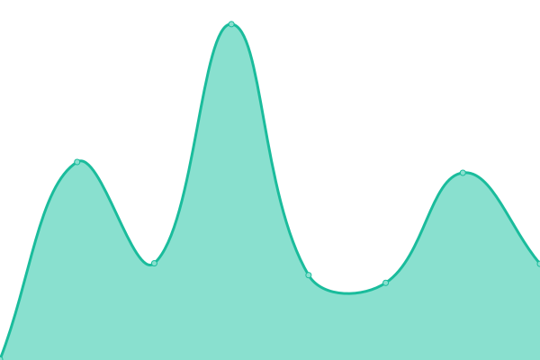 150ms
     
 | 

<a href="https://PatLittle.github.io/Consultations-Tracker/history/artificial-intelligence-strategy-for-the-government-of-canada">100.00%</a>
    

<!--end: status pages-->

[**Visit our status website →**](https://demo.upptime.js.org)

## 📄 License

- Powered by: [Upptime](https://github.com/upptime/upptime)
- Code: [MIT](./LICENSE) © [Patrick Little](Open.Canada.ca)
- Data in the `./history` directory: [Open Database License](https://opendatacommons.org/licenses/odbl/1-0/)
