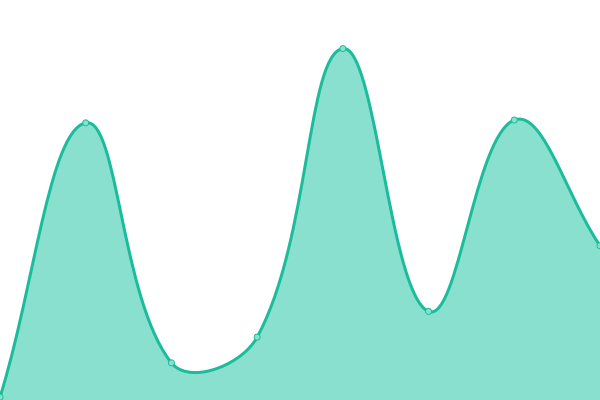
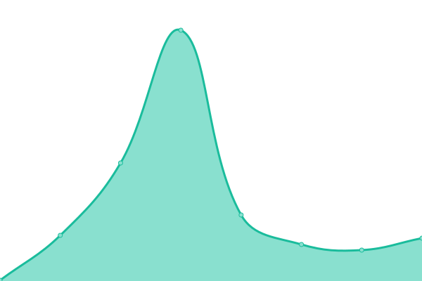
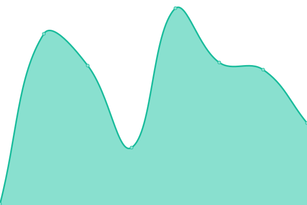
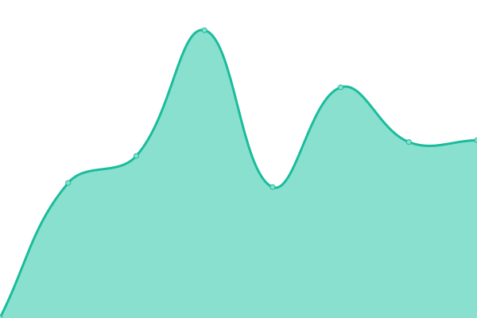
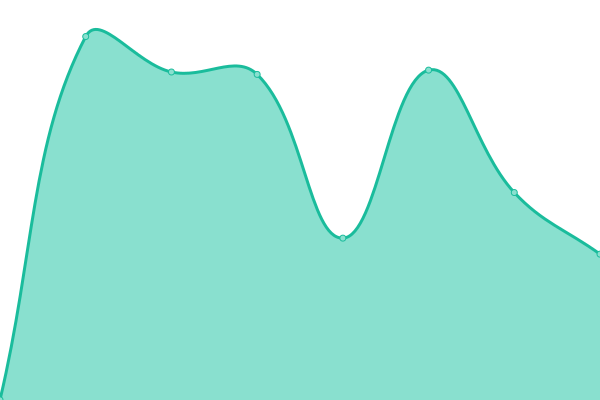
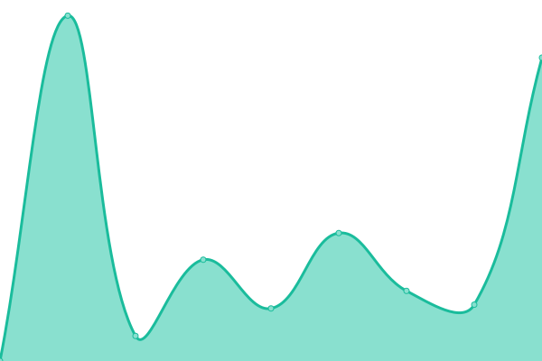

# [📈 Live Status](https://demo.upptime.js.org): <!--live status--> **🟧 Partial outage**

This repository contains the open-source uptime monitor and status page for [Patrick Little](Open.Canada.ca), powered by [Upptime](https://github.com/upptime/upptime).

With [Upptime](https://upptime.js.org), you can get your own unlimited and free uptime monitor and status page, powered entirely by a GitHub repository. We use [Issues](https://github.com/PatLittle/Consultations-Tracker/issues) as incident reports, [Actions](https://github.com/PatLittle/Consultations-Tracker/actions) as uptime monitors, and [Pages](https://demo.upptime.js.org) for the status page.

<!--start: status pages-->
<!-- This summary is generated by Upptime (https://github.com/upptime/upptime) -->
<!-- Do not edit this manually, your changes will be overwritten -->
<!-- prettier-ignore -->
| URL | Status | History | Response Time | Uptime |
| --- | ------ | ------- | ------------- | ------ |
|  [Consultations on the Next Agricultural Policy Framework](https://agriculture.canada.ca/en/department/transparency/public-opinion-research-consultations/share-ideas-next-agricultural-policy-framework-0) | 🟩 Up | [consultations-on-the-next-agricultural-policy-framework.yml](https://github.com/PatLittle/Consultations-Tracker/commits/HEAD/history/consultations-on-the-next-agricultural-policy-framework.yml) | 

 329ms
     
 | 

<a href="https://PatLittle.github.io/Consultations-Tracker/history/consultations-on-the-next-agricultural-policy-framework">100.00%</a>
    

|  [White River First Nations](https://www.rcaanc-cirnac.gc.ca/eng/1511969222951/1529103469169) | 🟩 Up | [white-river-first-nations.yml](https://github.com/PatLittle/Consultations-Tracker/commits/HEAD/history/white-river-first-nations.yml) | 

 1209ms
     
 | 

<a href="https://PatLittle.github.io/Consultations-Tracker/history/white-river-first-nations">95.81%</a>
    

|  [Administrative Monetary Penalty System Review](https://www.cbsa-asfc.gc.ca/trade-commerce/amps/menu-eng.html) | 🟩 Up | [administrative-monetary-penalty-system-review.yml](https://github.com/PatLittle/Consultations-Tracker/commits/HEAD/history/administrative-monetary-penalty-system-review.yml) | 

 237ms
     
 | 

<a href="https://PatLittle.github.io/Consultations-Tracker/history/administrative-monetary-penalty-system-review">95.82%</a>
    

|  [Telephone Reporting Sites in areas formerly covered by the Remote Area Border Crossing permit program](https://www.cbsa-asfc.gc.ca/agency-agence/consult/consultations/rabc-pfre-tel-eng.html) | 🟩 Up | [telephone-reporting-sites-in-areas-formerly-covered-by-the-remote-area-border-crossing-permit-program.yml](https://github.com/PatLittle/Consultations-Tracker/commits/HEAD/history/telephone-reporting-sites-in-areas-formerly-covered-by-the-remote-area-border-crossing-permit-program.yml) | 

 0ms
     
 | 

<a href="https://PatLittle.github.io/Consultations-Tracker/history/telephone-reporting-sites-in-areas-formerly-covered-by-the-remote-area-border-crossing-permit-program">100.00%</a>
    

|  [Regulatory Framework Plan](https://can01.safelinks.protection.outlook.com/?url=https%3A%2F%2Fwww.cer-rec.gc.ca%2Fen%2Fabout%2Fhow-we-regulate%2Fplans-for-regulatory-framework%2F&data=05%7C02%7CMichelle.Shabits%40cer-rec.gc.ca%7Cec1c386ebea64452821d08dc41ebb1b9%7C56e9b8d38a3549abbdfc27de59608f01%7C0%7C0%7C638457728797041411%7CUnknown%7CTWFpbGZsb3d8eyJWIjoiMC4wLjAwMDAiLCJQIjoiV2luMzIiLCJBTiI6Ik1haWwiLCJXVCI6Mn0%3D%7C0%7C%7C%7C&sdata=tKxvqtPetzkvcXlETiyyf51rWnRpUftsM2o2U5IySO4%3D&reserved=0) | 🟩 Up | [regulatory-framework-plan.yml](https://github.com/PatLittle/Consultations-Tracker/commits/HEAD/history/regulatory-framework-plan.yml) | 

 1023ms
     
 | 

<a href="https://PatLittle.github.io/Consultations-Tracker/history/regulatory-framework-plan">94.24%</a>
    

|  [Regulated Industry Engagement](https://www.cer-rec.gc.ca/en/consultation-engagement/stakeholder-engagement/regulated-industry-engagement/index.html) | 🟩 Up | [regulated-industry-engagement.yml](https://github.com/PatLittle/Consultations-Tracker/commits/HEAD/history/regulated-industry-engagement.yml) | 

 283ms
     
 | 

<a href="https://PatLittle.github.io/Consultations-Tracker/history/regulated-industry-engagement">94.25%</a>
    

|  [Draft Contractor Oversight Guidance](https://www.cerdialogue.ca/contractor-oversight-guidance) | 🟩 Up | [draft-contractor-oversight-guidance.yml](https://github.com/PatLittle/Consultations-Tracker/commits/HEAD/history/draft-contractor-oversight-guidance.yml) | 

 2213ms
     
 | 

<a href="https://PatLittle.github.io/Consultations-Tracker/history/draft-contractor-oversight-guidance">100.00%</a>
    

|  [Share your thoughts: Proposal to deregulate Phytophthora abietivora in Canada](https://inspection.canada.ca/en/about-cfia/transparency/consultations-and-engagement/deregulating-p-abietivora) | 🟩 Up | [share-your-thoughts-proposal-to-deregulate-phytophthora-abietivora-in-canada.yml](https://github.com/PatLittle/Consultations-Tracker/commits/HEAD/history/share-your-thoughts-proposal-to-deregulate-phytophthora-abietivora-in-canada.yml) | 

 273ms
     
 | 

<a href="https://PatLittle.github.io/Consultations-Tracker/history/share-your-thoughts-proposal-to-deregulate-phytophthora-abietivora-in-canada">100.00%</a>
    

|  [Share your thoughts: Proposals to Modernize Canada’s Seed Regulatory Framework (Part II: Seed Potatoes)](https://inspection.canada.ca/en/about-cfia/transparency/consultations-and-engagement/seed-potatoes) | 🟩 Up | [share-your-thoughts-proposals-to-modernize-canada-s-seed-regulatory-framework-part-ii-seed-potatoes.yml](https://github.com/PatLittle/Consultations-Tracker/commits/HEAD/history/share-your-thoughts-proposals-to-modernize-canada-s-seed-regulatory-framework-part-ii-seed-potatoes.yml) | 

 109ms
     
 | 

<a href="https://PatLittle.github.io/Consultations-Tracker/history/share-your-thoughts-proposals-to-modernize-canada-s-seed-regulatory-framework-part-ii-seed-potatoes">100.00%</a>
    

|  [Proposed amended livestock feed ingredient – DL-Methionine hydroxy analogue isopropyl ester](https://inspection.canada.ca/en/about-cfia/transparency/consultations-and-engagement/dl-methionine-hydroxy-analogue-isopropyl-ester) | 🟩 Up | [proposed-amended-livestock-feed-ingredient-dl-methionine-hydroxy-analogue-isopropyl-ester.yml](https://github.com/PatLittle/Consultations-Tracker/commits/HEAD/history/proposed-amended-livestock-feed-ingredient-dl-methionine-hydroxy-analogue-isopropyl-ester.yml) | 

 103ms
     
 | 

<a href="https://PatLittle.github.io/Consultations-Tracker/history/proposed-amended-livestock-feed-ingredient-dl-methionine-hydroxy-analogue-isopropyl-ester">100.00%</a>
    

|  [Share your thoughts: Proposed new licensing fees for hatchery and feed establishments](https://inspection.canada.ca/en/about-cfia/transparency/consultations-and-engagement/hatchery-and-feed) | 🟩 Up | [share-your-thoughts-proposed-new-licensing-fees-for-hatchery-and-feed-establishments.yml](https://github.com/PatLittle/Consultations-Tracker/commits/HEAD/history/share-your-thoughts-proposed-new-licensing-fees-for-hatchery-and-feed-establishments.yml) | 

 57ms
     
 | 

<a href="https://PatLittle.github.io/Consultations-Tracker/history/share-your-thoughts-proposed-new-licensing-fees-for-hatchery-and-feed-establishments">100.00%</a>
    

|  [Proposed licensing fees for hatchery and feed establishments](https://inspection.canada.ca/en/about-cfia/transparency/consultations-and-engagement/hatchery-and-feed) | 🟩 Up | [proposed-licensing-fees-for-hatchery-and-feed-establishments.yml](https://github.com/PatLittle/Consultations-Tracker/commits/HEAD/history/proposed-licensing-fees-for-hatchery-and-feed-establishments.yml) | 

 58ms
     
 | 

<a href="https://PatLittle.github.io/Consultations-Tracker/history/proposed-licensing-fees-for-hatchery-and-feed-establishments">100.00%</a>
    

|  [Proposed updated directive for managing Bacterial Ring Rot (BRR) in seed potatoes](https://inspection.canada.ca/en/about-cfia/transparency/consultations-and-engagement/proposed-updated-directive-managing-bacterial-ring-rot-brr-seed-potatoes) | 🟩 Up | [proposed-updated-directive-for-managing-bacterial-ring-rot-brr-in-seed-potatoes.yml](https://github.com/PatLittle/Consultations-Tracker/commits/HEAD/history/proposed-updated-directive-for-managing-bacterial-ring-rot-brr-in-seed-potatoes.yml) | 

 0ms
     
 | 

<a href="https://PatLittle.github.io/Consultations-Tracker/history/proposed-updated-directive-for-managing-bacterial-ring-rot-brr-in-seed-potatoes">100.00%</a>
    

|  [Proposed licensing fees for hatchery and feed establishments](https://inspection.canada.ca/en/about-cfia/transparency/consultations-and-engagement/hatchery-and-feed) | 🟩 Up | [proposed-licensing-fees-for-hatchery-and-feed-establishments.yml](https://github.com/PatLittle/Consultations-Tracker/commits/HEAD/history/proposed-licensing-fees-for-hatchery-and-feed-establishments.yml) | 

 58ms
     
 | 

<a href="https://PatLittle.github.io/Consultations-Tracker/history/proposed-licensing-fees-for-hatchery-and-feed-establishments">100.00%</a>
    

|  [Changing Narrative Fund](https://www.canada.ca/en/canadian-heritage/campaigns/changing-narratives-fund.html) | 🟩 Up | [changing-narrative-fund.yml](https://github.com/PatLittle/Consultations-Tracker/commits/HEAD/history/changing-narrative-fund.yml) | 

 262ms
     
 | 

<a href="https://PatLittle.github.io/Consultations-Tracker/history/changing-narrative-fund">100.00%</a>
    

|  [2022-23 Consultations on renewal of the Museum Policy](https://www.canada.ca/en/canadian-heritage/campaigns/renewal-museum-policy.html) | 🟩 Up | [2022-23-consultations-on-renewal-of-the-museum-policy.yml](https://github.com/PatLittle/Consultations-Tracker/commits/HEAD/history/2022-23-consultations-on-renewal-of-the-museum-policy.yml) | 

 151ms
     
 | 

<a href="https://PatLittle.github.io/Consultations-Tracker/history/2022-23-consultations-on-renewal-of-the-museum-policy">100.00%</a>
    

|  [REGDOC-3.2.2, Indigenous Engagement](https://www.cnsc-ccsn.gc.ca/eng/acts-and-regulations/regulatory-documents/history/regdoc3-2-2/) | 🟩 Up | [regdoc-3-2-2-indigenous-engagement.yml](https://github.com/PatLittle/Consultations-Tracker/commits/HEAD/history/regdoc-3-2-2-indigenous-engagement.yml) | 

 249ms
     
 | 

<a href="https://PatLittle.github.io/Consultations-Tracker/history/regdoc-3-2-2-indigenous-engagement">100.00%</a>
    

|  [REGDOC-2.13.2, Import and Export](https://www.cnsc-ccsn.gc.ca/eng/acts-and-regulations/regulatory-documents/history/regdoc2-13-2/) | 🟩 Up | [regdoc-2-13-2-import-and-export.yml](https://github.com/PatLittle/Consultations-Tracker/commits/HEAD/history/regdoc-2-13-2-import-and-export.yml) | 

 192ms
     
 | 

<a href="https://PatLittle.github.io/Consultations-Tracker/history/regdoc-2-13-2-import-and-export">100.00%</a>
    

|  [REGDOC-2.13.1, Safeguards and Nuclear Material Accountancy](https://www.cnsc-ccsn.gc.ca/eng/acts-and-regulations/regulatory-documents/published/html/regdoc2-13-1/) | 🟩 Up | [regdoc-2-13-1-safeguards-and-nuclear-material-accountancy.yml](https://github.com/PatLittle/Consultations-Tracker/commits/HEAD/history/regdoc-2-13-1-safeguards-and-nuclear-material-accountancy.yml) | 

 268ms
     
 | 

<a href="https://PatLittle.github.io/Consultations-Tracker/history/regdoc-2-13-1-safeguards-and-nuclear-material-accountancy">100.00%</a>
    

|  [Co-development of a new Indigenous Broadcasting Policy](https://crtc.gc.ca/eng/archive/2019/2019-217.htm) | 🟥 Down | [co-development-of-a-new-indigenous-broadcasting-policy.yml](https://github.com/PatLittle/Consultations-Tracker/commits/HEAD/history/co-development-of-a-new-indigenous-broadcasting-policy.yml) | 

 0ms
     
 | 

<a href="https://PatLittle.github.io/Consultations-Tracker/history/co-development-of-a-new-indigenous-broadcasting-policy">100.00%</a>
    

|  [Share your thoughts about closed captioning of programming from online streaming services](https://crtc.gc.ca/eng/consultation/cc.htm) | 🟥 Down | [share-your-thoughts-about-closed-captioning-of-programming-from-online-streaming-services.yml](https://github.com/PatLittle/Consultations-Tracker/commits/HEAD/history/share-your-thoughts-about-closed-captioning-of-programming-from-online-streaming-services.yml) | 

 0ms
     
 | 

<a href="https://PatLittle.github.io/Consultations-Tracker/history/share-your-thoughts-about-closed-captioning-of-programming-from-online-streaming-services">100.00%</a>
    

|  [Consultation on commercial market factors to be considered in determining fair and reasonable interswitching rates](https://otc-cta.gc.ca/eng/consultation/consultation-on-commercial-market-factors-to-be-considered-in-determining-fair-and-reasonable-interswitching-rates) | 🟩 Up | [consultation-on-commercial-market-factors-to-be-considered-in-determining-fair-and-reasonable-interswitching-rates.yml](https://github.com/PatLittle/Consultations-Tracker/commits/HEAD/history/consultation-on-commercial-market-factors-to-be-considered-in-determining-fair-and-reasonable-interswitching-rates.yml) | 

 0ms
     
 | 

<a href="https://PatLittle.github.io/Consultations-Tracker/history/consultation-on-commercial-market-factors-to-be-considered-in-determining-fair-and-reasonable-interswitching-rates">100.00%</a>
    

|  [National Infrastructure Assessment](https://www.infrastructure.gc.ca/nia-eni/index-eng.html) | 🟩 Up | [national-infrastructure-assessment.yml](https://github.com/PatLittle/Consultations-Tracker/commits/HEAD/history/national-infrastructure-assessment.yml) | 

 812ms
     
 | 

<a href="https://PatLittle.github.io/Consultations-Tracker/history/national-infrastructure-assessment">95.87%</a>
    

|  [National Capital (NCR) Residency for judges of the Federal Court and Tax Court of Canada](TBC) | 🟥 Down | [national-capital-ncr-residency-for-judges-of-the-federal-court-and-tax-court-of-canada.yml](https://github.com/PatLittle/Consultations-Tracker/commits/HEAD/history/national-capital-ncr-residency-for-judges-of-the-federal-court-and-tax-court-of-canada.yml) | 

 0ms
     
 | 

<a href="https://PatLittle.github.io/Consultations-Tracker/history/national-capital-ncr-residency-for-judges-of-the-federal-court-and-tax-court-of-canada">100.00%</a>
    

|  [Share your ideas: Blackwater Project](https://www.canada.ca/en/environment-climate-change/services/managing-pollution/sources-industry/mining/metal-diamond-mining-effluent-regulation/blackwater-consultation.html) | 🟥 Down | [share-your-ideas-blackwater-project.yml](https://github.com/PatLittle/Consultations-Tracker/commits/HEAD/history/share-your-ideas-blackwater-project.yml) | 

 142ms
     
 | 

<a href="https://PatLittle.github.io/Consultations-Tracker/history/share-your-ideas-blackwater-project">100.00%</a>
    

|  [Consultation on Amending the List of Species under the Species at Risk Act: Terrestrial Species January 2025](https://canada.ca/en/environment-climate-change/services/species-risk-public-registry/consultation-documents/part-3-consultation-amending-terrestrial-species-list-sara-summary-jan-2025.html) | 🟩 Up | [consultation-on-amending-the-list-of-species-under-the-species-at-risk-act-terrestrial-species-january-2025.yml](https://github.com/PatLittle/Consultations-Tracker/commits/HEAD/history/consultation-on-amending-the-list-of-species-under-the-species-at-risk-act-terrestrial-species-january-2025.yml) | 

 561ms
     
 | 

<a href="https://PatLittle.github.io/Consultations-Tracker/history/consultation-on-amending-the-list-of-species-under-the-species-at-risk-act-terrestrial-species-january-2025">100.00%</a>
    

|  [Share your views and ideas: Review of the Environmental Emergency Regulations, 2019](https://www.canada.ca/en/environment-climate-change/corporate/transparency/consultations/environmental-emergencies-regulations-consultation.html) | 🟩 Up | [share-your-views-and-ideas-review-of-the-environmental-emergency-regulations-2019.yml](https://github.com/PatLittle/Consultations-Tracker/commits/HEAD/history/share-your-views-and-ideas-review-of-the-environmental-emergency-regulations-2019.yml) | 

 123ms
     
 | 

<a href="https://PatLittle.github.io/Consultations-Tracker/history/share-your-views-and-ideas-review-of-the-environmental-emergency-regulations-2019">100.00%</a>
    

|  [Consultation on Amending the List of Species under the Species at Risk Act: Terrestrial Species January 2026](https://species-registry.canada.ca/index-en.html#/documents/wldyX0JgFdbCyk7E48LxX) | 🟩 Up | [consultation-on-amending-the-list-of-species-under-the-species-at-risk-act-terrestrial-species-january-2026.yml](https://github.com/PatLittle/Consultations-Tracker/commits/HEAD/history/consultation-on-amending-the-list-of-species-under-the-species-at-risk-act-terrestrial-species-january-2026.yml) | 

 205ms
     
 | 

<a href="https://PatLittle.github.io/Consultations-Tracker/history/consultation-on-amending-the-list-of-species-under-the-species-at-risk-act-terrestrial-species-january-2026">100.00%</a>
    

|  [2026-2029 Federal Sustainable Development Strategy](https://www.canada.ca/en/environment-climate-change/corporate/transparency/consultations/share-your-throughts-draft-2026-2029-federal-sustainable-development-strategy.html) | 🟩 Up | [2026-2029-federal-sustainable-development-strategy.yml](https://github.com/PatLittle/Consultations-Tracker/commits/HEAD/history/2026-2029-federal-sustainable-development-strategy.yml) | 

 77ms
     
 | 

<a href="https://PatLittle.github.io/Consultations-Tracker/history/2026-2029-federal-sustainable-development-strategy">100.00%</a>
    

|  [Proposed Posting: Amended Recovery Strategy and Amended Action Plan for the Piping Plover melodus subspecies (Charadrius melodus melodus) in Canada](https://species-registry.canada.ca/index-en.html#/consultations/3LN0Ew6Lk8XhGJDupe04E) | 🟩 Up | [proposed-posting-amended-recovery-strategy-and-amended-action-plan-for-the-piping-plover-melodus-subspecies-charadrius-melodus-melodus-in-canada.yml](https://github.com/PatLittle/Consultations-Tracker/commits/HEAD/history/proposed-posting-amended-recovery-strategy-and-amended-action-plan-for-the-piping-plover-melodus-subspecies-charadrius-melodus-melodus-in-canada.yml) | 

 0ms
     
 | 

<a href="https://PatLittle.github.io/Consultations-Tracker/history/proposed-posting-amended-recovery-strategy-and-amended-action-plan-for-the-piping-plover-melodus-subspecies-charadrius-melodus-melodus-in-canada">100.00%</a>
    

|  [Evaluation by Environment and Climate Change Canada of the ongoing need for the Emergency Order for the Protection of the Western Chorus Frog (Longueuil)](https://www.canada.ca/en/environment-climate-change/services/species-risk-public-registry/consultation-documents/western-chorus-frog-longueuil-2025.html) | 🟩 Up | [evaluation-by-environment-and-climate-change-canada-of-the-ongoing-need-for-the-emergency-order-for-the-protection-of-the-western-chorus-frog-longueuil.yml](https://github.com/PatLittle/Consultations-Tracker/commits/HEAD/history/evaluation-by-environment-and-climate-change-canada-of-the-ongoing-need-for-the-emergency-order-for-the-protection-of-the-western-chorus-frog-longueuil.yml) | 

 97ms
     
 | 

<a href="https://PatLittle.github.io/Consultations-Tracker/history/evaluation-by-environment-and-climate-change-canada-of-the-ongoing-need-for-the-emergency-order-for-the-protection-of-the-western-chorus-frog-longueuil">100.00%</a>
    

|  [Draft Assessment for Manganese and its Compounds, and the Risk Management Scope](https://gazette.gc.ca/rp-pr/p1/2025/2025-10-25/html/notice-avis-eng.html#ne3) | 🟩 Up | [draft-assessment-for-manganese-and-its-compounds-and-the-risk-management-scope.yml](https://github.com/PatLittle/Consultations-Tracker/commits/HEAD/history/draft-assessment-for-manganese-and-its-compounds-and-the-risk-management-scope.yml) | 

 2897ms
     
 | 

<a href="https://PatLittle.github.io/Consultations-Tracker/history/draft-assessment-for-manganese-and-its-compounds-and-the-risk-management-scope">100.00%</a>
    

|  [Science approach document on the prioritization of chemicals in plastics](https://gazette.gc.ca/rp-pr/p1/2025/2025-12-06/html/notice-avis-eng.html#na2) | 🟩 Up | [science-approach-document-on-the-prioritization-of-chemicals-in-plastics.yml](https://github.com/PatLittle/Consultations-Tracker/commits/HEAD/history/science-approach-document-on-the-prioritization-of-chemicals-in-plastics.yml) | 

 0ms
     
 | 

<a href="https://PatLittle.github.io/Consultations-Tracker/history/science-approach-document-on-the-prioritization-of-chemicals-in-plastics">100.00%</a>
    

|  [Proposed Regulations Amending the Sulphur in Gasoline Regulations](https://gazette.gc.ca/rp-pr/p1/2025/2025-12-13/html/reg1-eng.html) | 🟩 Up | [proposed-regulations-amending-the-sulphur-in-gasoline-regulations.yml](https://github.com/PatLittle/Consultations-Tracker/commits/HEAD/history/proposed-regulations-amending-the-sulphur-in-gasoline-regulations.yml) | 

 0ms
     
 | 

<a href="https://PatLittle.github.io/Consultations-Tracker/history/proposed-regulations-amending-the-sulphur-in-gasoline-regulations">100.00%</a>
    

|  [Driving Effective Carbon Markets in Canada](https://www.canada.ca/en/environment-climate-change/corporate/transparency/consultations/comment-driving-effective-carbon-markets.html) | 🟩 Up | [driving-effective-carbon-markets-in-canada.yml](https://github.com/PatLittle/Consultations-Tracker/commits/HEAD/history/driving-effective-carbon-markets-in-canada.yml) | 

 0ms
     
 | 

<a href="https://PatLittle.github.io/Consultations-Tracker/history/driving-effective-carbon-markets-in-canada">100.00%</a>
    

|  [Proposed Regulations Amending the Single-use Plastics Prohibition Regulations](https://www.canada.ca/en/environment-climate-change/corporate/transparency/consultations/proposed-amendments-single-use-plastics-prohibition-regulations.html) | 🟩 Up | [proposed-regulations-amending-the-single-use-plastics-prohibition-regulations.yml](https://github.com/PatLittle/Consultations-Tracker/commits/HEAD/history/proposed-regulations-amending-the-single-use-plastics-prohibition-regulations.yml) | 

 129ms
     
 | 

<a href="https://PatLittle.github.io/Consultations-Tracker/history/proposed-regulations-amending-the-single-use-plastics-prohibition-regulations">100.00%</a>
    

|  [Proposed Regulations Amending the Migratory Birds Regulations, 2022 - Biennial Hunting Amendments (2026-2028)](https://gazette.gc.ca/rp-pr/p1/2026/2026-01-17/html/notice-avis-eng.html#ne6) | 🟩 Up | [proposed-regulations-amending-the-migratory-birds-regulations-2022-biennial-hunting-amendments-2026-2028.yml](https://github.com/PatLittle/Consultations-Tracker/commits/HEAD/history/proposed-regulations-amending-the-migratory-birds-regulations-2022-biennial-hunting-amendments-2026-2028.yml) | 

 160ms
     
 | 

<a href="https://PatLittle.github.io/Consultations-Tracker/history/proposed-regulations-amending-the-migratory-birds-regulations-2022-biennial-hunting-amendments-2026-2028">100.00%</a>
    

|  [Share your ideas : Amendments to the Metal and Diamond Mining Effluent Regulations for the Scully Mine Tailings Expansion Project](https://www.canada.ca/en/environment-climate-change/corporate/transparency/consultations/scully-mine-project.html) | 🟩 Up | [share-your-ideas-amendments-to-the-metal-and-diamond-mining-effluent-regulations-for-the-scully-mine-tailings-expansion-project.yml](https://github.com/PatLittle/Consultations-Tracker/commits/HEAD/history/share-your-ideas-amendments-to-the-metal-and-diamond-mining-effluent-regulations-for-the-scully-mine-tailings-expansion-project.yml) | 

 99ms
     
 | 

<a href="https://PatLittle.github.io/Consultations-Tracker/history/share-your-ideas-amendments-to-the-metal-and-diamond-mining-effluent-regulations-for-the-scully-mine-tailings-expansion-project">100.00%</a>
    

|  [Proposed Regulations Amending the Migratory Birds Regulations, 2022 - Biennial Hunting Amendments (2026-2028)](https://gazette.gc.ca/rp-pr/p1/2026/2026-01-17/html/notice-avis-eng.html#ne6) | 🟩 Up | [proposed-regulations-amending-the-migratory-birds-regulations-2022-biennial-hunting-amendments-2026-2028.yml](https://github.com/PatLittle/Consultations-Tracker/commits/HEAD/history/proposed-regulations-amending-the-migratory-birds-regulations-2022-biennial-hunting-amendments-2026-2028.yml) | 

 160ms
     
 | 

<a href="https://PatLittle.github.io/Consultations-Tracker/history/proposed-regulations-amending-the-migratory-birds-regulations-2022-biennial-hunting-amendments-2026-2028">100.00%</a>
    

|  [Driving Effective Carbon Markets in Canada](https://www.canada.ca/en/environment-climate-change/corporate/transparency/consultations/comment-driving-effective-carbon-markets.html) | 🟩 Up | [driving-effective-carbon-markets-in-canada.yml](https://github.com/PatLittle/Consultations-Tracker/commits/HEAD/history/driving-effective-carbon-markets-in-canada.yml) | 

 0ms
     
 | 

<a href="https://PatLittle.github.io/Consultations-Tracker/history/driving-effective-carbon-markets-in-canada">100.00%</a>
    

|  [Share your ideas : Amendments to the Metal and Diamond Mining Effluent Regulations for the Scully Mine Tailings Expansion Project](https://www.canada.ca/en/environment-climate-change/corporate/transparency/consultations/scully-mine-project.html) | 🟩 Up | [share-your-ideas-amendments-to-the-metal-and-diamond-mining-effluent-regulations-for-the-scully-mine-tailings-expansion-project.yml](https://github.com/PatLittle/Consultations-Tracker/commits/HEAD/history/share-your-ideas-amendments-to-the-metal-and-diamond-mining-effluent-regulations-for-the-scully-mine-tailings-expansion-project.yml) | 

 99ms
     
 | 

<a href="https://PatLittle.github.io/Consultations-Tracker/history/share-your-ideas-amendments-to-the-metal-and-diamond-mining-effluent-regulations-for-the-scully-mine-tailings-expansion-project">100.00%</a>
    

|  [Engagement on renewing Canada’s National Financial Literacy Strategy](https://www.canada.ca/en/financial-consumer-agency/corporate/transparency/consultations/engagement-renewing-national-financial-literacy-strategy.html) | 🟩 Up | [engagement-on-renewing-canada-s-national-financial-literacy-strategy.yml](https://github.com/PatLittle/Consultations-Tracker/commits/HEAD/history/engagement-on-renewing-canada-s-national-financial-literacy-strategy.yml) | 

 154ms
     
 | 

<a href="https://PatLittle.github.io/Consultations-Tracker/history/engagement-on-renewing-canada-s-national-financial-literacy-strategy">100.00%</a>
    

|  [Let's talk Pacific Salmon](https://letstalkpacificsalmon.ca/) | 🟩 Up | [let-s-talk-pacific-salmon.yml](https://github.com/PatLittle/Consultations-Tracker/commits/HEAD/history/let-s-talk-pacific-salmon.yml) | 

 1728ms
     
 | 

<a href="https://PatLittle.github.io/Consultations-Tracker/history/let-s-talk-pacific-salmon">100.00%</a>
    

|  [Proposed ticketing for the enforcement of a fisheries offence under the Fisheries Act](TBD) | 🟥 Down | [proposed-ticketing-for-the-enforcement-of-a-fisheries-offence-under-the-fisheries-act.yml](https://github.com/PatLittle/Consultations-Tracker/commits/HEAD/history/proposed-ticketing-for-the-enforcement-of-a-fisheries-offence-under-the-fisheries-act.yml) | 

 0ms
     
 | 

<a href="https://PatLittle.github.io/Consultations-Tracker/history/proposed-ticketing-for-the-enforcement-of-a-fisheries-offence-under-the-fisheries-act">100.00%</a>
    

|  [Whitby Harbour Remediation Project](https://www.dfo-mpo.gc.ca/sch-ppb/whitby/index-eng.html) | 🟩 Up | [whitby-harbour-remediation-project.yml](https://github.com/PatLittle/Consultations-Tracker/commits/HEAD/history/whitby-harbour-remediation-project.yml) | 

 355ms
     
 | 

<a href="https://PatLittle.github.io/Consultations-Tracker/history/whitby-harbour-remediation-project">95.95%</a>
    

|  [Recovery Strategy for the Mountain Sucker (Catostomus platyrhynchus), Milk River populations, in Canada](https://species-registry.canada.ca/index-en.html#/documents/7LZ1syQXItFTRlqBFnKfT) | 🟩 Up | [recovery-strategy-for-the-mountain-sucker-catostomus-platyrhynchus-milk-river-populations-in-canada.yml](https://github.com/PatLittle/Consultations-Tracker/commits/HEAD/history/recovery-strategy-for-the-mountain-sucker-catostomus-platyrhynchus-milk-river-populations-in-canada.yml) | 

 0ms
     
 | 

<a href="https://PatLittle.github.io/Consultations-Tracker/history/recovery-strategy-for-the-mountain-sucker-catostomus-platyrhynchus-milk-river-populations-in-canada">100.00%</a>
    

|  [Management plan for the Channel Darter (St.Lawrence population)](https://species-registry.canada.ca/index-en.html#/documents/c1lK6z18p1C9z3ePBMQ8f) | 🟩 Up | [management-plan-for-the-channel-darter-st-lawrence-population.yml](https://github.com/PatLittle/Consultations-Tracker/commits/HEAD/history/management-plan-for-the-channel-darter-st-lawrence-population.yml) | 

 37ms
     
 | 

<a href="https://PatLittle.github.io/Consultations-Tracker/history/management-plan-for-the-channel-darter-st-lawrence-population">100.00%</a>
    

|  [Stakeholder engagement on potential marine conservation areas in Newfoundland and Labrador Region](https://www.dfo-mpo.gc.ca/oceans/conservation/plan/index-eng.html) | 🟩 Up | [stakeholder-engagement-on-potential-marine-conservation-areas-in-newfoundland-and-labrador-region.yml](https://github.com/PatLittle/Consultations-Tracker/commits/HEAD/history/stakeholder-engagement-on-potential-marine-conservation-areas-in-newfoundland-and-labrador-region.yml) | 

 0ms
     
 | 

<a href="https://PatLittle.github.io/Consultations-Tracker/history/stakeholder-engagement-on-potential-marine-conservation-areas-in-newfoundland-and-labrador-region">100.00%</a>
    

|  [Fish and Fish Habitat Restoration Priorities for Lake Ontario](https://www.talkfishhabitat.ca/wave-2/news_feed/announcing-ffhpp-framework-to-identify-fish-habitat-restoration-priorities) | 🟩 Up | [fish-and-fish-habitat-restoration-priorities-for-lake-ontario.yml](https://github.com/PatLittle/Consultations-Tracker/commits/HEAD/history/fish-and-fish-habitat-restoration-priorities-for-lake-ontario.yml) | 

 1191ms
     
 | 

<a href="https://PatLittle.github.io/Consultations-Tracker/history/fish-and-fish-habitat-restoration-priorities-for-lake-ontario">100.00%</a>
    

|  [Fish and Fish Habitat Restoration Priorities for Manitoba Phase 2](https://www.talkfishhabitat.ca/wave-2/news_feed/announcing-ffhpp-framework-to-identify-fish-habitat-restoration-priorities) | 🟩 Up | [fish-and-fish-habitat-restoration-priorities-for-manitoba-phase-2.yml](https://github.com/PatLittle/Consultations-Tracker/commits/HEAD/history/fish-and-fish-habitat-restoration-priorities-for-manitoba-phase-2.yml) | 

 700ms
     
 | 

<a href="https://PatLittle.github.io/Consultations-Tracker/history/fish-and-fish-habitat-restoration-priorities-for-manitoba-phase-2">100.00%</a>
    

|  [Proposed Amendments to the Export Permits Regulations](https://webarchiveweb.wayback.bac-lac.canada.ca/1/https://www.international.gc.ca/trade-commerce/controls-controles/expor/backgrounder-amendments-epr-information-modification-rle.aspx?lang=eng) | 🟩 Up | [proposed-amendments-to-the-export-permits-regulations.yml](https://github.com/PatLittle/Consultations-Tracker/commits/HEAD/history/proposed-amendments-to-the-export-permits-regulations.yml) | 

 567ms
     
 | 

<a href="https://PatLittle.github.io/Consultations-Tracker/history/proposed-amendments-to-the-export-permits-regulations">100.00%</a>
    

|  [Consultation on proposed updates to the Cosmetic Ingredient Hotlist: Prohibited and restricted ingredients](https://www.canada.ca/en/health-canada/programs/consultation-proposed-updates-cosmetic-ingredients-hotlist.html) | 🟩 Up | [consultation-on-proposed-updates-to-the-cosmetic-ingredient-hotlist-prohibited-and-restricted-ingredients.yml](https://github.com/PatLittle/Consultations-Tracker/commits/HEAD/history/consultation-on-proposed-updates-to-the-cosmetic-ingredient-hotlist-prohibited-and-restricted-ingredients.yml) | 

 208ms
     
 | 

<a href="https://PatLittle.github.io/Consultations-Tracker/history/consultation-on-proposed-updates-to-the-cosmetic-ingredient-hotlist-prohibited-and-restricted-ingredients">100.00%</a>
    

|  [Proposal to modify the List of Permitted Food Enzymes to authorize the use of exo-inulinase](https://www.canada.ca/en/health-canada/services/food-nutrition/legislation-guidelines/acts-regulations/notices-proposal-notices-modification/permitted-food-enzymes-authorize-exo-inulinase.html) | 🟩 Up | [proposal-to-modify-the-list-of-permitted-food-enzymes-to-authorize-the-use-of-exo-inulinase.yml](https://github.com/PatLittle/Consultations-Tracker/commits/HEAD/history/proposal-to-modify-the-list-of-permitted-food-enzymes-to-authorize-the-use-of-exo-inulinase.yml) | 

 130ms
     
 | 

<a href="https://PatLittle.github.io/Consultations-Tracker/history/proposal-to-modify-the-list-of-permitted-food-enzymes-to-authorize-the-use-of-exo-inulinase">100.00%</a>
    

|  [Consultation: Proposed new requirements for lithium-ion batteries and consumer products containing lithium-ion batteries under the Canada Consumer Product Safety Act](https://www.canada.ca/en/health-canada/programs/consultation-proposed-new-requirements-containing-lithium-ion-batteries-canada-consumer-product-safety-act.html) | 🟩 Up | [consultation-proposed-new-requirements-for-lithium-ion-batteries-and-consumer-products-containing-lithium-ion-batteries-under-the-canada-consumer-product-safety-act.yml](https://github.com/PatLittle/Consultations-Tracker/commits/HEAD/history/consultation-proposed-new-requirements-for-lithium-ion-batteries-and-consumer-products-containing-lithium-ion-batteries-under-the-canada-consumer-product-safety-act.yml) | 

 114ms
     
 | 

<a href="https://PatLittle.github.io/Consultations-Tracker/history/consultation-proposed-new-requirements-for-lithium-ion-batteries-and-consumer-products-containing-lithium-ion-batteries-under-the-canada-consumer-product-safety-act">100.00%</a>
    

|  [Proposal to modify the List of Permitted Preservatives to authorize the use of rosemary extract](https://www.canada.ca/en/health-canada/services/food-nutrition/legislation-guidelines/acts-regulations/notices-proposal-notices-modification/list-permitted-preservatives-authorize-use-rosemary-extract.html) | 🟩 Up | [proposal-to-modify-the-list-of-permitted-preservatives-to-authorize-the-use-of-rosemary-extract.yml](https://github.com/PatLittle/Consultations-Tracker/commits/HEAD/history/proposal-to-modify-the-list-of-permitted-preservatives-to-authorize-the-use-of-rosemary-extract.yml) | 

 143ms
     
 | 

<a href="https://PatLittle.github.io/Consultations-Tracker/history/proposal-to-modify-the-list-of-permitted-preservatives-to-authorize-the-use-of-rosemary-extract">100.00%</a>
    

|  [Consultation: Draft guidance on human and veterinary drug submissions based on promising evidence and terms and conditions](https://www.canada.ca/en/health-canada/programs/consultation-draft-guidance-human-veterinary-drug-submissions-based-promising-evidence-terms-conditions.html) | 🟩 Up | [consultation-draft-guidance-on-human-and-veterinary-drug-submissions-based-on-promising-evidence-and-terms-and-conditions.yml](https://github.com/PatLittle/Consultations-Tracker/commits/HEAD/history/consultation-draft-guidance-on-human-and-veterinary-drug-submissions-based-on-promising-evidence-and-terms-and-conditions.yml) | 

 105ms
     
 | 

<a href="https://PatLittle.github.io/Consultations-Tracker/history/consultation-draft-guidance-on-human-and-veterinary-drug-submissions-based-on-promising-evidence-and-terms-and-conditions">100.00%</a>
    

|  [Consultation: Draft guidance on terms and conditions for human and veterinary drugs](https://www.canada.ca/en/health-canada/programs/consultation-draft-guidance-terms-conditions-human-veterinary-drugs.html) | 🟩 Up | [consultation-draft-guidance-on-terms-and-conditions-for-human-and-veterinary-drugs.yml](https://github.com/PatLittle/Consultations-Tracker/commits/HEAD/history/consultation-draft-guidance-on-terms-and-conditions-for-human-and-veterinary-drugs.yml) | 

 137ms
     
 | 

<a href="https://PatLittle.github.io/Consultations-Tracker/history/consultation-draft-guidance-on-terms-and-conditions-for-human-and-veterinary-drugs">100.00%</a>
    

|  [Consultation: Modernizing the framework for clinical trials](https://www.canada.ca/en/health-canada/programs/consultation-modernizing-framework-clinical-trials.html) | 🟩 Up | [consultation-modernizing-the-framework-for-clinical-trials.yml](https://github.com/PatLittle/Consultations-Tracker/commits/HEAD/history/consultation-modernizing-the-framework-for-clinical-trials.yml) | 

 106ms
     
 | 

<a href="https://PatLittle.github.io/Consultations-Tracker/history/consultation-modernizing-the-framework-for-clinical-trials">100.00%</a>
    

|  [Canada Gazette, Part I, Volume 159, Number 51: Order Providing for Reliance on Decisions of, or Documents Produced by, Foreign Regulatory Authorities in Respect of Certain Drugs](https://gazette.gc.ca/rp-pr/p1/2025/2025-12-20/html/reg4-eng.html) | 🟩 Up | [canada-gazette-part-i-volume-159-number-51-order-providing-for-reliance-on-decisions-of-or-documents-produced-by-foreign-regulatory-authorities-in-respect-of-certain-drugs.yml](https://github.com/PatLittle/Consultations-Tracker/commits/HEAD/history/canada-gazette-part-i-volume-159-number-51-order-providing-for-reliance-on-decisions-of-or-documents-produced-by-foreign-regulatory-authorities-in-respect-of-certain-drugs.yml) | 

 0ms
     
 | 

<a href="https://PatLittle.github.io/Consultations-Tracker/history/canada-gazette-part-i-volume-159-number-51-order-providing-for-reliance-on-decisions-of-or-documents-produced-by-foreign-regulatory-authorities-in-respect-of-certain-drugs">100.00%</a>
    

|  [Consultation: Removal of reconsideration process from requests for priority review and advance consideration for Notice of Compliance with conditions](https://www.canada.ca/en/health-canada/programs/consultation-removal-reconsideration-process-requests-priority-review-advance-consideration-notice-compliance-conditions.html) | 🟩 Up | [consultation-removal-of-reconsideration-process-from-requests-for-priority-review-and-advance-consideration-for-notice-of-compliance-with-conditions.yml](https://github.com/PatLittle/Consultations-Tracker/commits/HEAD/history/consultation-removal-of-reconsideration-process-from-requests-for-priority-review-and-advance-consideration-for-notice-of-compliance-with-conditions.yml) | 

 108ms
     
 | 

<a href="https://PatLittle.github.io/Consultations-Tracker/history/consultation-removal-of-reconsideration-process-from-requests-for-priority-review-and-advance-consideration-for-notice-of-compliance-with-conditions">100.00%</a>
    

|  [Consultation: Draft guidance on decentralized clinical trials](https://www.canada.ca/en/health-canada/programs/consultation-draft-guidance-decentralized-clinical-trials.html) | 🟩 Up | [consultation-draft-guidance-on-decentralized-clinical-trials.yml](https://github.com/PatLittle/Consultations-Tracker/commits/HEAD/history/consultation-draft-guidance-on-decentralized-clinical-trials.yml) | 

 106ms
     
 | 

<a href="https://PatLittle.github.io/Consultations-Tracker/history/consultation-draft-guidance-on-decentralized-clinical-trials">100.00%</a>
    

|  [Consultation: Guidelines for Canadian Drinking Water Quality, Haloacetic Acids](https://www.canada.ca/en/health-canada/programs/consultation-guidelines-drinking-water-quality-haloacetic-acids.html) | 🟩 Up | [consultation-guidelines-for-canadian-drinking-water-quality-haloacetic-acids.yml](https://github.com/PatLittle/Consultations-Tracker/commits/HEAD/history/consultation-guidelines-for-canadian-drinking-water-quality-haloacetic-acids.yml) | 

 86ms
     
 | 

<a href="https://PatLittle.github.io/Consultations-Tracker/history/consultation-guidelines-for-canadian-drinking-water-quality-haloacetic-acids">100.00%</a>
    

|  [Release of draft (step 2) ICH E22: General Considerations for Patient Preference Studies](https://www.canada.ca/en/health-canada/services/drugs-health-products/drug-products/applications-submissions/guidance-documents/international-council-harmonisation/consultations-notices.html) | 🟩 Up | [release-of-draft-step-2-ich-e22-general-considerations-for-patient-preference-studies.yml](https://github.com/PatLittle/Consultations-Tracker/commits/HEAD/history/release-of-draft-step-2-ich-e22-general-considerations-for-patient-preference-studies.yml) | 

 44ms
     
 | 

<a href="https://PatLittle.github.io/Consultations-Tracker/history/release-of-draft-step-2-ich-e22-general-considerations-for-patient-preference-studies">100.00%</a>
    

|  [Consultation on prohexadione-calcium and its associated end-use products, Proposed Re-evaluation Decision PRVD2026-01](https://www.canada.ca/en/health-canada/services/consumer-product-safety/pesticides-pest-management/public/consultations/proposed-re-evaluation-decisions/2026/prohexadione-calcium.html) | 🟩 Up | [consultation-on-prohexadione-calcium-and-its-associated-end-use-products-proposed-re-evaluation-decision-prvd-2026-01.yml](https://github.com/PatLittle/Consultations-Tracker/commits/HEAD/history/consultation-on-prohexadione-calcium-and-its-associated-end-use-products-proposed-re-evaluation-decision-prvd-2026-01.yml) | 

 113ms
     
 | 

<a href="https://PatLittle.github.io/Consultations-Tracker/history/consultation-on-prohexadione-calcium-and-its-associated-end-use-products-proposed-re-evaluation-decision-prvd-2026-01">100.00%</a>
    

|  [Consultation on sedaxane, Proposed Maximum Residue Limit PMRL2026-01](https://www.canada.ca/en/health-canada/services/consumer-product-safety/pesticides-pest-management/public/consultations/proposed-maximum-residue-limit/2026/sedaxane.html) | 🟩 Up | [consultation-on-sedaxane-proposed-maximum-residue-limit-pmrl-2026-01.yml](https://github.com/PatLittle/Consultations-Tracker/commits/HEAD/history/consultation-on-sedaxane-proposed-maximum-residue-limit-pmrl-2026-01.yml) | 

 107ms
     
 | 

<a href="https://PatLittle.github.io/Consultations-Tracker/history/consultation-on-sedaxane-proposed-maximum-residue-limit-pmrl-2026-01">100.00%</a>
    

|  [Consultation: Guidance on asbestos in drinking water](https://www.canada.ca/en/health-canada/programs/consultation-guidance-asbestos-drinking-water.html) | 🟩 Up | [consultation-guidance-on-asbestos-in-drinking-water.yml](https://github.com/PatLittle/Consultations-Tracker/commits/HEAD/history/consultation-guidance-on-asbestos-in-drinking-water.yml) | 

 0ms
     
 | 

<a href="https://PatLittle.github.io/Consultations-Tracker/history/consultation-guidance-on-asbestos-in-drinking-water">100.00%</a>
    

|  [Consultation on 1-methylcyclopropene, Proposed Maximum Residue Limit PMRL2026-02](https://www.canada.ca/en/health-canada/services/consumer-product-safety/pesticides-pest-management/public/consultations/proposed-maximum-residue-limit/2026/1-methylcyclopropene.html) | 🟩 Up | [consultation-on-1-methylcyclopropene-proposed-maximum-residue-limit-pmrl-2026-02.yml](https://github.com/PatLittle/Consultations-Tracker/commits/HEAD/history/consultation-on-1-methylcyclopropene-proposed-maximum-residue-limit-pmrl-2026-02.yml) | 

 142ms
     
 | 

<a href="https://PatLittle.github.io/Consultations-Tracker/history/consultation-on-1-methylcyclopropene-proposed-maximum-residue-limit-pmrl-2026-02">100.00%</a>
    

|  [Consultation on cold pressed orange oil and Appeal, Proposed Registration Decision PRD2026-01](https://www.canada.ca/en/health-canada/services/consumer-product-safety/pesticides-pest-management/public/consultations/proposed-registration-decisions/2026/cold-pressed-orange-oil-appeal.html) | 🟩 Up | [consultation-on-cold-pressed-orange-oil-and-appeal-proposed-registration-decision-prd-2026-01.yml](https://github.com/PatLittle/Consultations-Tracker/commits/HEAD/history/consultation-on-cold-pressed-orange-oil-and-appeal-proposed-registration-decision-prd-2026-01.yml) | 

 131ms
     
 | 

<a href="https://PatLittle.github.io/Consultations-Tracker/history/consultation-on-cold-pressed-orange-oil-and-appeal-proposed-registration-decision-prd-2026-01">100.00%</a>
    

|  [Consultation on isocycloseram, A21377 CP, A21708 CP, A22466 CP, EQUENTO RFC and A23294 TO, Proposed Registration Decision PRD2026-02](https://www.canada.ca/en/health-canada/services/consumer-product-safety/pesticides-pest-management/public/consultations/proposed-registration-decisions/2026/isocycloseram-a21377-cp-a21708-cp-a22466-cp-equento-rfc-a23294-to.html) | 🟩 Up | [consultation-on-isocycloseram-a21377-cp-a21708-cp-a22466-cp-equento-rfc-and-a23294-to-proposed-registration-decision-prd-2026-02.yml](https://github.com/PatLittle/Consultations-Tracker/commits/HEAD/history/consultation-on-isocycloseram-a21377-cp-a21708-cp-a22466-cp-equento-rfc-and-a23294-to-proposed-registration-decision-prd-2026-02.yml) | 

 96ms
     
 | 

<a href="https://PatLittle.github.io/Consultations-Tracker/history/consultation-on-isocycloseram-a21377-cp-a21708-cp-a22466-cp-equento-rfc-and-a23294-to-proposed-registration-decision-prd-2026-02">100.00%</a>
    

|  [Consultation on isocycloseram, Proposed Maximum Residue Limit PMRL2026-03](https://www.canada.ca/en/health-canada/services/consumer-product-safety/pesticides-pest-management/public/consultations/proposed-maximum-residue-limit/2026/isocycloseram.html) | 🟩 Up | [consultation-on-isocycloseram-proposed-maximum-residue-limit-pmrl-2026-03.yml](https://github.com/PatLittle/Consultations-Tracker/commits/HEAD/history/consultation-on-isocycloseram-proposed-maximum-residue-limit-pmrl-2026-03.yml) | 

 144ms
     
 | 

<a href="https://PatLittle.github.io/Consultations-Tracker/history/consultation-on-isocycloseram-proposed-maximum-residue-limit-pmrl-2026-03">100.00%</a>
    

|  [Regulations Amending the Immigration and Refugee Protection Regulations (Temporary Foreign Workers)](https://gazette.gc.ca/rp-pr/p1/2021/2021-07-10/html/reg2-eng.html) | 🟩 Up | [regulations-amending-the-immigration-and-refugee-protection-regulations-temporary-foreign-workers.yml](https://github.com/PatLittle/Consultations-Tracker/commits/HEAD/history/regulations-amending-the-immigration-and-refugee-protection-regulations-temporary-foreign-workers.yml) | 

 370ms
     
 | 

<a href="https://PatLittle.github.io/Consultations-Tracker/history/regulations-amending-the-immigration-and-refugee-protection-regulations-temporary-foreign-workers">100.00%</a>
    

|  [Deep Geological Repository (DGR) for Canada's Used Nuclear Fuel Project](https://iaac-aeic.gc.ca/050/evaluations/proj/88774?culture=en-CA) | 🟩 Up | [deep-geological-repository-dgr-for-canada-s-used-nuclear-fuel-project.yml](https://github.com/PatLittle/Consultations-Tracker/commits/HEAD/history/deep-geological-repository-dgr-for-canada-s-used-nuclear-fuel-project.yml) | 

 1131ms
     
 | 

<a href="https://PatLittle.github.io/Consultations-Tracker/history/deep-geological-repository-dgr-for-canada-s-used-nuclear-fuel-project">100.00%</a>
    

|  [Valentine Gold ProjectPublic noticePublic Comments Invited on Proposed Amendments to the Decision Statement](https://iaac-aeic.gc.ca/050/evaluations/document/164493?culture=en-CA) | 🟩 Up | [valentine-gold-project-public-notice-public-comments-invited-on-proposed-amendments-to-the-decision-statement.yml](https://github.com/PatLittle/Consultations-Tracker/commits/HEAD/history/valentine-gold-project-public-notice-public-comments-invited-on-proposed-amendments-to-the-decision-statement.yml) | 

 305ms
     
 | 

<a href="https://PatLittle.github.io/Consultations-Tracker/history/valentine-gold-project-public-notice-public-comments-invited-on-proposed-amendments-to-the-decision-statement">100.00%</a>
    

|  [New Nuclear at Wesleyville Project](https://iaac-aeic.gc.ca/050/evaluations/proj/89802?culture=en-CA) | 🟩 Up | [new-nuclear-at-wesleyville-project.yml](https://github.com/PatLittle/Consultations-Tracker/commits/HEAD/history/new-nuclear-at-wesleyville-project.yml) | 

 1010ms
     
 | 

<a href="https://PatLittle.github.io/Consultations-Tracker/history/new-nuclear-at-wesleyville-project">96.03%</a>
    

|  [Lawyers-Ranch ProjectPublic NoticePublic Comments Invited and Funding Available](https://iaac-aeic.gc.ca/050/evaluations/document/164494?culture=en-CA) | 🟩 Up | [lawyers-ranch-project-public-notice-public-comments-invited-and-funding-available.yml](https://github.com/PatLittle/Consultations-Tracker/commits/HEAD/history/lawyers-ranch-project-public-notice-public-comments-invited-and-funding-available.yml) | 

 327ms
     
 | 

<a href="https://PatLittle.github.io/Consultations-Tracker/history/lawyers-ranch-project-public-notice-public-comments-invited-and-funding-available">100.00%</a>
    

|  [Fording River Extension ProjectPublic noticePublic comments invited on the draft guidelines and plans](https://iaac-aeic.gc.ca/050/evaluations/document/164558?culture=en-CA) | 🟩 Up | [fording-river-extension-project-public-notice-public-comments-invited-on-the-draft-guidelines-and-plans.yml](https://github.com/PatLittle/Consultations-Tracker/commits/HEAD/history/fording-river-extension-project-public-notice-public-comments-invited-on-the-draft-guidelines-and-plans.yml) | 

 306ms
     
 | 

<a href="https://PatLittle.github.io/Consultations-Tracker/history/fording-river-extension-project-public-notice-public-comments-invited-on-the-draft-guidelines-and-plans">100.00%</a>
    

|  [Shaakichiuwaanaan Mining ProjectPublic NoticeParticipant Funding Available](https://iaac-aeic.gc.ca/050/evaluations/document/164570?&culture=en-CA) | 🟩 Up | [shaakichiuwaanaan-mining-project-public-notice-participant-funding-available.yml](https://github.com/PatLittle/Consultations-Tracker/commits/HEAD/history/shaakichiuwaanaan-mining-project-public-notice-participant-funding-available.yml) | 

 298ms
     
 | 

<a href="https://PatLittle.github.io/Consultations-Tracker/history/shaakichiuwaanaan-mining-project-public-notice-participant-funding-available">100.00%</a>
    

|  [Great Bear Gold ProjectPublic noticeParticipant funding available](https://iaac-aeic.gc.ca/050/evaluations/document/164613?culture=en-CA) | 🟩 Up | [great-bear-gold-project-public-notice-participant-funding-available.yml](https://github.com/PatLittle/Consultations-Tracker/commits/HEAD/history/great-bear-gold-project-public-notice-participant-funding-available.yml) | 

 295ms
     
 | 

<a href="https://PatLittle.github.io/Consultations-Tracker/history/great-bear-gold-project-public-notice-participant-funding-available">100.00%</a>
    

|  [Indian Oil and Gas Regulations - Phase II](http://www.pgic-iogc.gc.ca/eng/1471964522302/1471964567990) | 🟩 Up | [indian-oil-and-gas-regulations-phase-ii.yml](https://github.com/PatLittle/Consultations-Tracker/commits/HEAD/history/indian-oil-and-gas-regulations-phase-ii.yml) | 

 732ms
     
 | 

<a href="https://PatLittle.github.io/Consultations-Tracker/history/indian-oil-and-gas-regulations-phase-ii">96.08%</a>
    

|  [Indigenous Procurement Modernization (including Procurement Strategy for Aboriginal Business)](https://www.aadnc-aandc.gc.ca/eng/1554218527634/1554218554486) | 🟩 Up | [indigenous-procurement-modernization-including-procurement-strategy-for-aboriginal-business.yml](https://github.com/PatLittle/Consultations-Tracker/commits/HEAD/history/indigenous-procurement-modernization-including-procurement-strategy-for-aboriginal-business.yml) | 

 293ms
     
 | 

<a href="https://PatLittle.github.io/Consultations-Tracker/history/indigenous-procurement-modernization-including-procurement-strategy-for-aboriginal-business">100.00%</a>
    

|  [Developing laws and regulations for First Nations drinking water and wastewater: engagement 2022/2023](Developing laws and regulations for First Nations drinking water and wastewaterengagement 2022/2023 (sac-isc.gc.ca)) | 🟥 Down | [developing-laws-and-regulations-for-first-nations-drinking-water-and-wastewater-engagement-2022-2023.yml](https://github.com/PatLittle/Consultations-Tracker/commits/HEAD/history/developing-laws-and-regulations-for-first-nations-drinking-water-and-wastewater-engagement-2022-2023.yml) | 

 0ms
     
 | 

<a href="https://PatLittle.github.io/Consultations-Tracker/history/developing-laws-and-regulations-for-first-nations-drinking-water-and-wastewater-engagement-2022-2023">100.00%</a>
    

|  [Competition Bureau invites feedback on changes to the Textile Labelling and Advertising Regulations](https://www.ic.gc.ca/eic/site/cb-bc.nsf/eng/h_00142.html) | 🟩 Up | [competition-bureau-invites-feedback-on-changes-to-the-textile-labelling-and-advertising-regulations.yml](https://github.com/PatLittle/Consultations-Tracker/commits/HEAD/history/competition-bureau-invites-feedback-on-changes-to-the-textile-labelling-and-advertising-regulations.yml) | 

 1567ms
     
 | 

<a href="https://PatLittle.github.io/Consultations-Tracker/history/competition-bureau-invites-feedback-on-changes-to-the-textile-labelling-and-advertising-regulations">100.00%</a>
    

|  [Canada Gazette, Part I: Public Consultations on proposed changes to the Patent Rules and Trademark Regulations in regards to the creation of the College of Patent Agents and Trademark Agents , as part of Budget Implementation Act, 2018, No. 2.](Not yet available) | 🟥 Down | [canada-gazette-part-i-public-consultations-on-proposed-changes-to-the-patent-rules-and-trademark-regulations-in-regards-to-the-creation-of-the-college-of-patent-agents-and-trademark-agents-as-part-of-budget-implementation-act-2018-no-2.yml](https://github.com/PatLittle/Consultations-Tracker/commits/HEAD/history/canada-gazette-part-i-public-consultations-on-proposed-changes-to-the-patent-rules-and-trademark-regulations-in-regards-to-the-creation-of-the-college-of-patent-agents-and-trademark-agents-as-part-of-budget-implementation-act-2018-no-2.yml) | 

 0ms
     
 | 

<a href="https://PatLittle.github.io/Consultations-Tracker/history/canada-gazette-part-i-public-consultations-on-proposed-changes-to-the-patent-rules-and-trademark-regulations-in-regards-to-the-creation-of-the-college-of-patent-agents-and-trademark-agents-as-part-of-budget-implementation-act-2018-no-2">100.00%</a>
    

|  [Notice No. TIPB-001-2024 — Petition to the Governor in Council concerning Telecom Decision CRTC 2023-358](https://canadagazette.gc.ca/rp-pr/p1/2024/2024-04-27/pdf/g1-15817.pdf) | 🟩 Up | [notice-no-tipb-001-2024-petition-to-the-governor-in-council-concerning-telecom-decision-crtc-2023-358.yml](https://github.com/PatLittle/Consultations-Tracker/commits/HEAD/history/notice-no-tipb-001-2024-petition-to-the-governor-in-council-concerning-telecom-decision-crtc-2023-358.yml) | 

 3518ms
     
 | 

<a href="https://PatLittle.github.io/Consultations-Tracker/history/notice-no-tipb-001-2024-petition-to-the-governor-in-council-concerning-telecom-decision-crtc-2023-358">100.00%</a>
    

|  [Amendments to Directive No 11R3, Surplus Income Directive](https://ised-isde.canada.ca/site/office-superintendent-bankruptcy/en/public-consultations) | 🟩 Up | [amendments-to-directive-no-11-r3-surplus-income-directive.yml](https://github.com/PatLittle/Consultations-Tracker/commits/HEAD/history/amendments-to-directive-no-11-r3-surplus-income-directive.yml) | 

 541ms
     
 | 

<a href="https://PatLittle.github.io/Consultations-Tracker/history/amendments-to-directive-no-11-r3-surplus-income-directive">100.00%</a>
    

|  [Consultation on a Policy, and Licensing, and Technical Framework for Supplemental Mobile Coverage by Satellite](https://ised-isde.canada.ca/site/spectrum-management-telecommunications/en/learn-more/key-documents/consultations/consultation-policy-licensing-and-technical-framework-supplemental-mobile-coverage-satellite) | 🟩 Up | [consultation-on-a-policy-and-licensing-and-technical-framework-for-supplemental-mobile-coverage-by-satellite.yml](https://github.com/PatLittle/Consultations-Tracker/commits/HEAD/history/consultation-on-a-policy-and-licensing-and-technical-framework-for-supplemental-mobile-coverage-by-satellite.yml) | 

 116ms
     
 | 

<a href="https://PatLittle.github.io/Consultations-Tracker/history/consultation-on-a-policy-and-licensing-and-technical-framework-for-supplemental-mobile-coverage-by-satellite">100.00%</a>
    

|  [Amendments to Directive No 2R2, Joint Filing, and to various forms](https://ised-isde.canada.ca/site/office-superintendent-bankruptcy/en/public-consultations) | 🟩 Up | [amendments-to-directive-no-2-r2-joint-filing-and-to-various-forms.yml](https://github.com/PatLittle/Consultations-Tracker/commits/HEAD/history/amendments-to-directive-no-2-r2-joint-filing-and-to-various-forms.yml) | 

 51ms
     
 | 

<a href="https://PatLittle.github.io/Consultations-Tracker/history/amendments-to-directive-no-2-r2-joint-filing-and-to-various-forms">100.00%</a>
    

|  [Amendments to Superintendent's directives relating to cybersecurity guidelines, minimum requirements and measures for the Licensed Insolvency Trustee community](https://ised-isde.canada.ca/site/office-superintendent-bankruptcy/en/public-consultations) | 🟩 Up | [amendments-to-superintendent-s-directives-relating-to-cybersecurity-guidelines-minimum-requirements-and-measures-for-the-licensed-insolvency-trustee-community.yml](https://github.com/PatLittle/Consultations-Tracker/commits/HEAD/history/amendments-to-superintendent-s-directives-relating-to-cybersecurity-guidelines-minimum-requirements-and-measures-for-the-licensed-insolvency-trustee-community.yml) | 

 69ms
     
 | 

<a href="https://PatLittle.github.io/Consultations-Tracker/history/amendments-to-superintendent-s-directives-relating-to-cybersecurity-guidelines-minimum-requirements-and-measures-for-the-licensed-insolvency-trustee-community">100.00%</a>
    

|  [Rural Development Action Plan - Consultation](https://ised-isde.canada.ca/site/rural/en/help-shape-future-rural-canada-moving-strategy-action) | 🟩 Up | [rural-development-action-plan-consultation.yml](https://github.com/PatLittle/Consultations-Tracker/commits/HEAD/history/rural-development-action-plan-consultation.yml) | 

 47ms
     
 | 

<a href="https://PatLittle.github.io/Consultations-Tracker/history/rural-development-action-plan-consultation">96.15%</a>
    

|  [Indigenous Advisory Circle](https://library-archives.canada.ca/eng/corporate/about-us/our-partners/Pages/indigenous-advisory-circle.aspx) | 🟩 Up | [indigenous-advisory-circle.yml](https://github.com/PatLittle/Consultations-Tracker/commits/HEAD/history/indigenous-advisory-circle.yml) | 

 427ms
     
 | 

<a href="https://PatLittle.github.io/Consultations-Tracker/history/indigenous-advisory-circle">96.16%</a>
    

|  [Stakeholders' Forum](https://library-archives.canada.ca/eng/corporate/about-us/our-partners/pages/stakeholders-forum.aspx) | 🟩 Up | [stakeholders-forum.yml](https://github.com/PatLittle/Consultations-Tracker/commits/HEAD/history/stakeholders-forum.yml) | 

 210ms
     
 | 

<a href="https://PatLittle.github.io/Consultations-Tracker/history/stakeholders-forum">96.17%</a>
    

|  [Services Consultation Committee](https://library-archives.canada.ca/eng/corporate/about-us/our-partners/Pages/services-consultation-group.aspx) | 🟩 Up | [services-consultation-committee.yml](https://github.com/PatLittle/Consultations-Tracker/commits/HEAD/history/services-consultation-committee.yml) | 

 191ms
     
 | 

<a href="https://PatLittle.github.io/Consultations-Tracker/history/services-consultation-committee">96.18%</a>
    

|  [Youth Advisory Council](https://library-archives.canada.ca/eng/corporate/about-us/our-partners/Pages/youth-advisory-council.aspx) | 🟩 Up | [youth-advisory-council.yml](https://github.com/PatLittle/Consultations-Tracker/commits/HEAD/history/youth-advisory-council.yml) | 

 203ms
     
 | 

<a href="https://PatLittle.github.io/Consultations-Tracker/history/youth-advisory-council">96.19%</a>
    

|  [Consultation to inform the regulatory development to support the implementation of An Act to amend the National Defence Act and to make related and consequential amendments to other Acts](https://www.canada.ca/en/department-national-defence/services/benefits-military/legal-services/victim-service-offence.html) | 🟩 Up | [consultation-to-inform-the-regulatory-development-to-support-the-implementation-of-an-act-to-amend-the-national-defence-act-and-to-make-related-and-consequential-amendments-to-other-acts.yml](https://github.com/PatLittle/Consultations-Tracker/commits/HEAD/history/consultation-to-inform-the-regulatory-development-to-support-the-implementation-of-an-act-to-amend-the-national-defence-act-and-to-make-related-and-consequential-amendments-to-other-acts.yml) | 

 100ms
     
 | 

<a href="https://PatLittle.github.io/Consultations-Tracker/history/consultation-to-inform-the-regulatory-development-to-support-the-implementation-of-an-act-to-amend-the-national-defence-act-and-to-make-related-and-consequential-amendments-to-other-acts">100.00%</a>
    

|  [Consultation to inform the regulatory development to support the implementation of An Act to amend the National Defence Act and to make related and consequential amendments to other Acts](https://www.canada.ca/en/department-national-defence/services/benefits-military/legal-services/victim-service-offence.html) | 🟩 Up | [consultation-to-inform-the-regulatory-development-to-support-the-implementation-of-an-act-to-amend-the-national-defence-act-and-to-make-related-and-consequential-amendments-to-other-acts.yml](https://github.com/PatLittle/Consultations-Tracker/commits/HEAD/history/consultation-to-inform-the-regulatory-development-to-support-the-implementation-of-an-act-to-amend-the-national-defence-act-and-to-make-related-and-consequential-amendments-to-other-acts.yml) | 

 100ms
     
 | 

<a href="https://PatLittle.github.io/Consultations-Tracker/history/consultation-to-inform-the-regulatory-development-to-support-the-implementation-of-an-act-to-amend-the-national-defence-act-and-to-make-related-and-consequential-amendments-to-other-acts">100.00%</a>
    

|  [Social systems professional services](www.marsdd.com) | 🟩 Up | [social-systems-professional-services.yml](https://github.com/PatLittle/Consultations-Tracker/commits/HEAD/history/social-systems-professional-services.yml) | 

 321ms
     
 | 

<a href="https://PatLittle.github.io/Consultations-Tracker/history/social-systems-professional-services">100.00%</a>
    

|  [Canada in a Changing Climate](https://natural-resources.canada.ca/climate-change/canada-changing-climate/canada-changing-climate-national-assessment-process) | 🟩 Up | [canada-in-a-changing-climate.yml](https://github.com/PatLittle/Consultations-Tracker/commits/HEAD/history/canada-in-a-changing-climate.yml) | 

 0ms
     
 | 

<a href="https://PatLittle.github.io/Consultations-Tracker/history/canada-in-a-changing-climate">100.00%</a>
    

|  [Indigenous Ministerial Arrangements Regulations](https://www.rncanengagenrcan.ca/en/content/development-new-indigenous-ministerial-arrangements-regulations) | 🟩 Up | [indigenous-ministerial-arrangements-regulations.yml](https://github.com/PatLittle/Consultations-Tracker/commits/HEAD/history/indigenous-ministerial-arrangements-regulations.yml) | 

 1625ms
     
 | 

<a href="https://PatLittle.github.io/Consultations-Tracker/history/indigenous-ministerial-arrangements-regulations">92.51%</a>
    

|  [Modernization of the Explosives Regulations, 2013](https://natural-resources.canada.ca/minerals-mining/explosives-fireworks-ammunition/explosives/amendments-explosives-regulations-2013) | 🟩 Up | [modernization-of-the-explosives-regulations-2013.yml](https://github.com/PatLittle/Consultations-Tracker/commits/HEAD/history/modernization-of-the-explosives-regulations-2013.yml) | 

 86ms
     
 | 

<a href="https://PatLittle.github.io/Consultations-Tracker/history/modernization-of-the-explosives-regulations-2013">100.00%</a>
    

|  [Canada-NS and Canada-NL Offshore Renewable Energy Regulations](The Offshore Renewable Energy Regulations Initiative - Natural Resources Canada) | 🟥 Down | [canada-ns-and-canada-nl-offshore-renewable-energy-regulations.yml](https://github.com/PatLittle/Consultations-Tracker/commits/HEAD/history/canada-ns-and-canada-nl-offshore-renewable-energy-regulations.yml) | 

 0ms
     
 | 

<a href="https://PatLittle.github.io/Consultations-Tracker/history/canada-ns-and-canada-nl-offshore-renewable-energy-regulations">100.00%</a>
    

|  [Amending the Nuclear Liability and Compensation Regulations, pre-publication in CG Part I]([To be updated in fall]) | 🟥 Down | [amending-the-nuclear-liability-and-compensation-regulations-pre-publication-in-cg-part-i.yml](https://github.com/PatLittle/Consultations-Tracker/commits/HEAD/history/amending-the-nuclear-liability-and-compensation-regulations-pre-publication-in-cg-part-i.yml) | 

 0ms
     
 | 

<a href="https://PatLittle.github.io/Consultations-Tracker/history/amending-the-nuclear-liability-and-compensation-regulations-pre-publication-in-cg-part-i">100.00%</a>
    

|  [Engagement: Proposed Indigenous Ministerial Arrangements Regulations under the Canadian Energy Regulator Act](www.letstalknaturalresources.ca/proposed-indigenous-ministerial-arrangements-regulations) | 🟩 Up | [engagement-proposed-indigenous-ministerial-arrangements-regulations-under-the-canadian-energy-regulator-act.yml](https://github.com/PatLittle/Consultations-Tracker/commits/HEAD/history/engagement-proposed-indigenous-ministerial-arrangements-regulations-under-the-canadian-energy-regulator-act.yml) | 

 2341ms
     
 | 

<a href="https://PatLittle.github.io/Consultations-Tracker/history/engagement-proposed-indigenous-ministerial-arrangements-regulations-under-the-canadian-energy-regulator-act">100.00%</a>
    

|  [Capital Adequacy Requirements (CAR) Guideline (2027)](https://www.osfi-bsif.gc.ca/en/guidance/guidance-library/capital-adequacy-requirements-car-guideline-2027?utm_campaign=PANTHEON_STRIPPED&utm_medium=PANTHEON_STRIPPED&utm_source=PANTHEON_STRIPPED&utm_term=PANTHEON_STRIPPED) | 🟩 Up | [capital-adequacy-requirements-car-guideline-2027.yml](https://github.com/PatLittle/Consultations-Tracker/commits/HEAD/history/capital-adequacy-requirements-car-guideline-2027.yml) | 

 1283ms
     
 | 

<a href="https://PatLittle.github.io/Consultations-Tracker/history/capital-adequacy-requirements-car-guideline-2027">100.00%</a>
    

|  [Consultative document on Credit Risk Management](https://www.osfi-bsif.gc.ca/en/guidance/guidance-library/consultative-document-credit-risk-management) | 🟩 Up | [consultative-document-on-credit-risk-management.yml](https://github.com/PatLittle/Consultations-Tracker/commits/HEAD/history/consultative-document-on-credit-risk-management.yml) | 

 258ms
     
 | 

<a href="https://PatLittle.github.io/Consultations-Tracker/history/consultative-document-on-credit-risk-management">100.00%</a>
    

|  [Consultative document on Senior Leader Accountability](https://www.osfi-bsif.gc.ca/en/guidance/guidance-library/consultative-document-proposed-senior-leader-regime) | 🟩 Up | [consultative-document-on-senior-leader-accountability.yml](https://github.com/PatLittle/Consultations-Tracker/commits/HEAD/history/consultative-document-on-senior-leader-accountability.yml) | 

 308ms
     
 | 

<a href="https://PatLittle.github.io/Consultations-Tracker/history/consultative-document-on-senior-leader-accountability">100.00%</a>
    

|  [General Regulations under the Canada National Marine Conservation Areas Act](https://www.letstalknmcas.ca/) | 🟩 Up | [general-regulations-under-the-canada-national-marine-conservation-areas-act.yml](https://github.com/PatLittle/Consultations-Tracker/commits/HEAD/history/general-regulations-under-the-canada-national-marine-conservation-areas-act.yml) | 

 2279ms
     
 | 

<a href="https://PatLittle.github.io/Consultations-Tracker/history/general-regulations-under-the-canada-national-marine-conservation-areas-act">100.00%</a>
    

|  [Notice of Mooring Restrictions – Ontario Waterways - Trent-Severn Waterway National Historic Site](https://parks.canada.ca/lhn-nhs/on/trentsevern/info/avis-restrictions-amarrage-notice-mooring-restrictions/) | 🟩 Up | [notice-of-mooring-restrictions-ontario-waterways-trent-severn-waterway-national-historic-site.yml](https://github.com/PatLittle/Consultations-Tracker/commits/HEAD/history/notice-of-mooring-restrictions-ontario-waterways-trent-severn-waterway-national-historic-site.yml) | 

 735ms
     
 | 

<a href="https://PatLittle.github.io/Consultations-Tracker/history/notice-of-mooring-restrictions-ontario-waterways-trent-severn-waterway-national-historic-site">100.00%</a>
    

|  [Notice of Mooring Restrictions – Ontario Waterways - Rideau Canal National Historic Site](https://parks.canada.ca/lhn-nhs/on/rideau/info/avis-restrictions-amarrage-notice-mooring-restrictions/) | 🟩 Up | [notice-of-mooring-restrictions-ontario-waterways-rideau-canal-national-historic-site.yml](https://github.com/PatLittle/Consultations-Tracker/commits/HEAD/history/notice-of-mooring-restrictions-ontario-waterways-rideau-canal-national-historic-site.yml) | 

 375ms
     
 | 

<a href="https://PatLittle.github.io/Consultations-Tracker/history/notice-of-mooring-restrictions-ontario-waterways-rideau-canal-national-historic-site">100.00%</a>
    

|  [Fortress of Louisbourg National Historic Site Management Plan](https://www.pc.gc.ca/en/lhn-nhs/ns/louisbourg/info/plan) | 🟩 Up | [fortress-of-louisbourg-national-historic-site-management-plan.yml](https://github.com/PatLittle/Consultations-Tracker/commits/HEAD/history/fortress-of-louisbourg-national-historic-site-management-plan.yml) | 

 489ms
     
 | 

<a href="https://PatLittle.github.io/Consultations-Tracker/history/fortress-of-louisbourg-national-historic-site-management-plan">100.00%</a>
    

|  [Visitor Use Management - Jasper National Park](https://www.letstalkmountainparks.ca/visitor-use-management-jasper) | 🟩 Up | [visitor-use-management-jasper-national-park.yml](https://github.com/PatLittle/Consultations-Tracker/commits/HEAD/history/visitor-use-management-jasper-national-park.yml) | 

 795ms
     
 | 

<a href="https://PatLittle.github.io/Consultations-Tracker/history/visitor-use-management-jasper-national-park">100.00%</a>
    

|  [Visitor Use Management - Lake Louise Area](https://www.letstalkmountainparks.ca/lakelouisevum) | 🟩 Up | [visitor-use-management-lake-louise-area.yml](https://github.com/PatLittle/Consultations-Tracker/commits/HEAD/history/visitor-use-management-lake-louise-area.yml) | 

 664ms
     
 | 

<a href="https://PatLittle.github.io/Consultations-Tracker/history/visitor-use-management-lake-louise-area">100.00%</a>
    

|  [Updating the Community Plans for Field, B.C. and Lake Louise, Alberta](https://www.letstalkmountainparks.ca/communityplanupdates) | 🟩 Up | [updating-the-community-plans-for-field-b-c-and-lake-louise-alberta.yml](https://github.com/PatLittle/Consultations-Tracker/commits/HEAD/history/updating-the-community-plans-for-field-b-c-and-lake-louise-alberta.yml) | 

 1941ms
     
 | 

<a href="https://PatLittle.github.io/Consultations-Tracker/history/updating-the-community-plans-for-field-b-c-and-lake-louise-alberta">100.00%</a>
    

|  [Public Engagement on the Strategic Environmental Assessment for the Town of Banff railway lands area redevelopment plan](www.letstalkmountainparks.ca/town-of-banff-area-redevelopment-plan-strategic-environmental-assessment) | 🟩 Up | [public-engagement-on-the-strategic-environmental-assessment-for-the-town-of-banff-railway-lands-area-redevelopment-plan.yml](https://github.com/PatLittle/Consultations-Tracker/commits/HEAD/history/public-engagement-on-the-strategic-environmental-assessment-for-the-town-of-banff-railway-lands-area-redevelopment-plan.yml) | 

 1119ms
     
 | 

<a href="https://PatLittle.github.io/Consultations-Tracker/history/public-engagement-on-the-strategic-environmental-assessment-for-the-town-of-banff-railway-lands-area-redevelopment-plan">100.00%</a>
    

|  [Town of Banff Railways Lands Area Redevelopment Plan - Term of Reference for Strategic Environmental Assessment](https://www.letstalkmountainparks.ca/town-of-banff-area-redevelopment-plan-strategic-environmental-assessment/widgets/194782/documents) | 🟩 Up | [town-of-banff-railways-lands-area-redevelopment-plan-term-of-reference-for-strategic-environmental-assessment.yml](https://github.com/PatLittle/Consultations-Tracker/commits/HEAD/history/town-of-banff-railways-lands-area-redevelopment-plan-term-of-reference-for-strategic-environmental-assessment.yml) | 

 381ms
     
 | 

<a href="https://PatLittle.github.io/Consultations-Tracker/history/town-of-banff-railways-lands-area-redevelopment-plan-term-of-reference-for-strategic-environmental-assessment">100.00%</a>
    

|  [Alexander Graham Bell National Historic Site Management Plan](https://parks.canada.ca/lhn-nhs/ns/grahambell/info/plan) | 🟩 Up | [alexander-graham-bell-national-historic-site-management-plan.yml](https://github.com/PatLittle/Consultations-Tracker/commits/HEAD/history/alexander-graham-bell-national-historic-site-management-plan.yml) | 

 215ms
     
 | 

<a href="https://PatLittle.github.io/Consultations-Tracker/history/alexander-graham-bell-national-historic-site-management-plan">100.00%</a>
    

|  [A Reimagined Visitor Centre and Community Space in the Heart of Banff](www.letstalkmountainparks.ca/200-block-banff-avenue-redevelopment-2026) | 🟩 Up | [a-reimagined-visitor-centre-and-community-space-in-the-heart-of-banff.yml](https://github.com/PatLittle/Consultations-Tracker/commits/HEAD/history/a-reimagined-visitor-centre-and-community-space-in-the-heart-of-banff.yml) | 

 0ms
     
 | 

<a href="https://PatLittle.github.io/Consultations-Tracker/history/a-reimagined-visitor-centre-and-community-space-in-the-heart-of-banff">100.00%</a>
    

|  [Independent Review of the Preclearance Act, 2016](https://www.canada.ca/en/public-safety-canada/consultations/public-consultation-towards-independent-review-preclearance-act-2016.html) | 🟩 Up | [independent-review-of-the-preclearance-act-2016.yml](https://github.com/PatLittle/Consultations-Tracker/commits/HEAD/history/independent-review-of-the-preclearance-act-2016.yml) | 

 210ms
     
 | 

<a href="https://PatLittle.github.io/Consultations-Tracker/history/independent-review-of-the-preclearance-act-2016">100.00%</a>
    

|  [Public engagement on how to strengthen federal leadership in emergency management](https://www.canada.ca/en/public-safety-canada/consultations/public-engagement-strengthen-federal-leadership-emergency-management.html) | 🟩 Up | [public-engagement-on-how-to-strengthen-federal-leadership-in-emergency-management.yml](https://github.com/PatLittle/Consultations-Tracker/commits/HEAD/history/public-engagement-on-how-to-strengthen-federal-leadership-in-emergency-management.yml) | 

 0ms
     
 | 

<a href="https://PatLittle.github.io/Consultations-Tracker/history/public-engagement-on-how-to-strengthen-federal-leadership-in-emergency-management">100.00%</a>
    

|  [PSPC Controlled Goods Program’s Industry Engagement Committee (IEC)](https://www.tpsgc-pwgsc.gc.ca/pmc-cgp/pipmc-secgp-eng.html) | 🟥 Down | [pspc-controlled-goods-program-s-industry-engagement-committee-iec.yml](https://github.com/PatLittle/Consultations-Tracker/commits/HEAD/history/pspc-controlled-goods-program-s-industry-engagement-committee-iec.yml) | 

 0ms
     
 | 

<a href="https://PatLittle.github.io/Consultations-Tracker/history/pspc-controlled-goods-program-s-industry-engagement-committee-iec">100.00%</a>
    

|  [Three-year Departmental Accessibility Plan](https://www.canada.ca/en/public-services-procurement/corporate/accessibility.html) | 🟩 Up | [three-year-departmental-accessibility-plan.yml](https://github.com/PatLittle/Consultations-Tracker/commits/HEAD/history/three-year-departmental-accessibility-plan.yml) | 

 88ms
     
 | 

<a href="https://PatLittle.github.io/Consultations-Tracker/history/three-year-departmental-accessibility-plan">100.00%</a>
    

|  [Domestic Assessment of Product Category Filters for the Green Public Procurement Tool (GPPT)](https://circularinnovation.ca/pspc-consultation-sessions-and-registration/) | 🟩 Up | [domestic-assessment-of-product-category-filters-for-the-green-public-procurement-tool-gppt.yml](https://github.com/PatLittle/Consultations-Tracker/commits/HEAD/history/domestic-assessment-of-product-category-filters-for-the-green-public-procurement-tool-gppt.yml) | 

 367ms
     
 | 

<a href="https://PatLittle.github.io/Consultations-Tracker/history/domestic-assessment-of-product-category-filters-for-the-green-public-procurement-tool-gppt">100.00%</a>
    

|  [Multifactor Productivity Application](https://www.statcan.gc.ca/eng/consultation/2019/mpa) | 🟩 Up | [multifactor-productivity-application.yml](https://github.com/PatLittle/Consultations-Tracker/commits/HEAD/history/multifactor-productivity-application.yml) | 

 539ms
     
 | 

<a href="https://PatLittle.github.io/Consultations-Tracker/history/multifactor-productivity-application">96.81%</a>
    

|  [Statistics Canada Client Survey 2022](https://www.statcan.gc.ca/en/consultation/2022/sccs2022) | 🟩 Up | [statistics-canada-client-survey-2022.yml](https://github.com/PatLittle/Consultations-Tracker/commits/HEAD/history/statistics-canada-client-survey-2022.yml) | 

 318ms
     
 | 

<a href="https://PatLittle.github.io/Consultations-Tracker/history/statistics-canada-client-survey-2022">100.00%</a>
    

|  [Census of the Environment Program](https://www.statcan.gc.ca/en/consultation/2022/coep) | 🟩 Up | [census-of-the-environment-program.yml](https://github.com/PatLittle/Consultations-Tracker/commits/HEAD/history/census-of-the-environment-program.yml) | 

 90ms
     
 | 

<a href="https://PatLittle.github.io/Consultations-Tracker/history/census-of-the-environment-program">100.00%</a>
    

|  [Missing persons data standards consultative engagement](https://www.statcan.gc.ca/en/consultation/2023/missing-persons-data-standards) | 🟩 Up | [missing-persons-data-standards-consultative-engagement.yml](https://github.com/PatLittle/Consultations-Tracker/commits/HEAD/history/missing-persons-data-standards-consultative-engagement.yml) | 

 89ms
     
 | 

<a href="https://PatLittle.github.io/Consultations-Tracker/history/missing-persons-data-standards-consultative-engagement">100.00%</a>
    

|  [Invitation to participate in the revision of the North American Industry Classification System (NAICS) Canada](https://www.statcan.gc.ca/en/consultation/2023/naics) | 🟩 Up | [invitation-to-participate-in-the-revision-of-the-north-american-industry-classification-system-naics-canada.yml](https://github.com/PatLittle/Consultations-Tracker/commits/HEAD/history/invitation-to-participate-in-the-revision-of-the-north-american-industry-classification-system-naics-canada.yml) | 

 0ms
     
 | 

<a href="https://PatLittle.github.io/Consultations-Tracker/history/invitation-to-participate-in-the-revision-of-the-north-american-industry-classification-system-naics-canada">100.00%</a>
    

|  [Invitation to participate in the revision of the North American Product Classification System (NAPCS) Canada](https://www.statcan.gc.ca/en/consultation/2023/napcs) | 🟩 Up | [invitation-to-participate-in-the-revision-of-the-north-american-product-classification-system-napcs-canada.yml](https://github.com/PatLittle/Consultations-Tracker/commits/HEAD/history/invitation-to-participate-in-the-revision-of-the-north-american-product-classification-system-napcs-canada.yml) | 

 0ms
     
 | 

<a href="https://PatLittle.github.io/Consultations-Tracker/history/invitation-to-participate-in-the-revision-of-the-north-american-product-classification-system-napcs-canada">100.00%</a>
    

|  [Invitation to participate in the revision of the Classification of Instructional Programs (CIP) Canada](https://www.statcan.gc.ca/en/consultation/2024/cip) | 🟩 Up | [invitation-to-participate-in-the-revision-of-the-classification-of-instructional-programs-cip-canada.yml](https://github.com/PatLittle/Consultations-Tracker/commits/HEAD/history/invitation-to-participate-in-the-revision-of-the-classification-of-instructional-programs-cip-canada.yml) | 

 0ms
     
 | 

<a href="https://PatLittle.github.io/Consultations-Tracker/history/invitation-to-participate-in-the-revision-of-the-classification-of-instructional-programs-cip-canada">100.00%</a>
    

|  [Invitation to participate in the revision of the National Occupational Classification (NOC)](https://www.statcan.gc.ca/en/consultation/2024/noc) | 🟩 Up | [invitation-to-participate-in-the-revision-of-the-national-occupational-classification-noc.yml](https://github.com/PatLittle/Consultations-Tracker/commits/HEAD/history/invitation-to-participate-in-the-revision-of-the-national-occupational-classification-noc.yml) | 

 0ms
     
 | 

<a href="https://PatLittle.github.io/Consultations-Tracker/history/invitation-to-participate-in-the-revision-of-the-national-occupational-classification-noc">100.00%</a>
    

|  [Participate in the permanent consultation for the revision of the Canadian Research and Development Classification (CRDC)](https://www.statcan.gc.ca/en/consultation/2025/crdc) | 🟩 Up | [participate-in-the-permanent-consultation-for-the-revision-of-the-canadian-research-and-development-classification-crdc.yml](https://github.com/PatLittle/Consultations-Tracker/commits/HEAD/history/participate-in-the-permanent-consultation-for-the-revision-of-the-canadian-research-and-development-classification-crdc.yml) | 

 0ms
     
 | 

<a href="https://PatLittle.github.io/Consultations-Tracker/history/participate-in-the-permanent-consultation-for-the-revision-of-the-canadian-research-and-development-classification-crdc">100.00%</a>
    

|  [Contribute to Statistics Canada's Web modernization Journey](https://www.statcan.gc.ca/en/consultation/2025/web-modernization-journey) | 🟩 Up | [contribute-to-statistics-canada-s-web-modernization-journey.yml](https://github.com/PatLittle/Consultations-Tracker/commits/HEAD/history/contribute-to-statistics-canada-s-web-modernization-journey.yml) | 

 72ms
     
 | 

<a href="https://PatLittle.github.io/Consultations-Tracker/history/contribute-to-statistics-canada-s-web-modernization-journey">100.00%</a>
    

|  [Share your feedback on Census of Environment products](https://www.statcan.gc.ca/en/consultation/2025/census-environment-products) | 🟩 Up | [share-your-feedback-on-census-of-environment-products.yml](https://github.com/PatLittle/Consultations-Tracker/commits/HEAD/history/share-your-feedback-on-census-of-environment-products.yml) | 

 70ms
     
 | 

<a href="https://PatLittle.github.io/Consultations-Tracker/history/share-your-feedback-on-census-of-environment-products">100.00%</a>
    

|  [Share your experiences with the Labour Force Survey](https://www.statcan.gc.ca/en/consultation/2025/labour-force-survey) | 🟩 Up | [share-your-experiences-with-the-labour-force-survey.yml](https://github.com/PatLittle/Consultations-Tracker/commits/HEAD/history/share-your-experiences-with-the-labour-force-survey.yml) | 

 327ms
     
 | 

<a href="https://PatLittle.github.io/Consultations-Tracker/history/share-your-experiences-with-the-labour-force-survey">100.00%</a>
    

|  [Contribute to Statistics Canada’s consultative engagement on the Residential Building Occupancy Project](https://www.statcan.gc.ca/en/consultation/2025/rbo) | 🟩 Up | [contribute-to-statistics-canada-s-consultative-engagement-on-the-residential-building-occupancy-project.yml](https://github.com/PatLittle/Consultations-Tracker/commits/HEAD/history/contribute-to-statistics-canada-s-consultative-engagement-on-the-residential-building-occupancy-project.yml) | 

 68ms
     
 | 

<a href="https://PatLittle.github.io/Consultations-Tracker/history/contribute-to-statistics-canada-s-consultative-engagement-on-the-residential-building-occupancy-project">100.00%</a>
    

|  [Watchlist 2020 mid-cycle consultation with industry](https://www.tsb.gc.ca/eng/qui-about/relation.html) | 🟥 Down | [watchlist-2020-mid-cycle-consultation-with-industry.yml](https://github.com/PatLittle/Consultations-Tracker/commits/HEAD/history/watchlist-2020-mid-cycle-consultation-with-industry.yml) | 

 394ms
     
 | 

<a href="https://PatLittle.github.io/Consultations-Tracker/history/watchlist-2020-mid-cycle-consultation-with-industry">100.00%</a>
    

|  [Watchlist 2025 mid-cycle consultations with industry](https://www.tsb.gc.ca/eng/surveillance-watchlist/2022.html) | 🟩 Up | [watchlist-2025-mid-cycle-consultations-with-industry.yml](https://github.com/PatLittle/Consultations-Tracker/commits/HEAD/history/watchlist-2025-mid-cycle-consultations-with-industry.yml) | 

 88ms
     
 | 

<a href="https://PatLittle.github.io/Consultations-Tracker/history/watchlist-2025-mid-cycle-consultations-with-industry">100.00%</a>
    

|  [Oceans Protection Plan](https://www.letstalktransportation.ca/OPP) | 🟩 Up | [oceans-protection-plan.yml](https://github.com/PatLittle/Consultations-Tracker/commits/HEAD/history/oceans-protection-plan.yml) | 

 719ms
     
 | 

<a href="https://PatLittle.github.io/Consultations-Tracker/history/oceans-protection-plan">96.26%</a>
    

|  [OPP - Understanding the Cumulative Effects of Marine Vessel Activity on Coastal and Marine Environments](https://letstalktransportation.ca/understanding-the-effects-of-marine-vessel-activity-on-coastal-environments) | 🟩 Up | [opp-understanding-the-cumulative-effects-of-marine-vessel-activity-on-coastal-and-marine-environments.yml](https://github.com/PatLittle/Consultations-Tracker/commits/HEAD/history/opp-understanding-the-cumulative-effects-of-marine-vessel-activity-on-coastal-and-marine-environments.yml) | 

 341ms
     
 | 

<a href="https://PatLittle.github.io/Consultations-Tracker/history/opp-understanding-the-cumulative-effects-of-marine-vessel-activity-on-coastal-and-marine-environments">100.00%</a>
    

|  [OPP: Northern Low-Impact Shipping Corridors](https://www.dfo-mpo.gc.ca/about-notre-sujet/engagement/2021/shipping-corridors-navigation-eng.html) | 🟩 Up | [opp-northern-low-impact-shipping-corridors.yml](https://github.com/PatLittle/Consultations-Tracker/commits/HEAD/history/opp-northern-low-impact-shipping-corridors.yml) | 

 221ms
     
 | 

<a href="https://PatLittle.github.io/Consultations-Tracker/history/opp-northern-low-impact-shipping-corridors">96.28%</a>
    

|  [Proposed amendments to the Environmental Response Regulations](TBD) | 🟥 Down | [proposed-amendments-to-the-environmental-response-regulations.yml](https://github.com/PatLittle/Consultations-Tracker/commits/HEAD/history/proposed-amendments-to-the-environmental-response-regulations.yml) | 

 0ms
     
 | 

<a href="https://PatLittle.github.io/Consultations-Tracker/history/proposed-amendments-to-the-environmental-response-regulations">100.00%</a>
    

|  [Regulations Amending the Motor Vehicle Safety Regulations (Theft Protection)](https://gazette.gc.ca/rp-pr/p1/2025/2025-12-27/html/reg1-eng.html) | 🟩 Up | [regulations-amending-the-motor-vehicle-safety-regulations-theft-protection.yml](https://github.com/PatLittle/Consultations-Tracker/commits/HEAD/history/regulations-amending-the-motor-vehicle-safety-regulations-theft-protection.yml) | 

 2060ms
     
 | 

<a href="https://PatLittle.github.io/Consultations-Tracker/history/regulations-amending-the-motor-vehicle-safety-regulations-theft-protection">100.00%</a>
    

|  [Preliminary Consultation for the Upset Prevention and Recovery Training (UPRT) Initiative - for air operators regulated under subpart 705](https://wwwapps.tc.gc.ca/Saf-Sec-Sur/2/NPA-APM/actr.aspx?id=125&aType=1&GoCTemplateCulture=en-CA) | 🟩 Up | [preliminary-consultation-for-the-upset-prevention-and-recovery-training-uprt-initiative-for-air-operators-regulated-under-subpart-705.yml](https://github.com/PatLittle/Consultations-Tracker/commits/HEAD/history/preliminary-consultation-for-the-upset-prevention-and-recovery-training-uprt-initiative-for-air-operators-regulated-under-subpart-705.yml) | 

 994ms
     
 | 

<a href="https://PatLittle.github.io/Consultations-Tracker/history/preliminary-consultation-for-the-upset-prevention-and-recovery-training-uprt-initiative-for-air-operators-regulated-under-subpart-705">100.00%</a>
    

|  [Horizontal Red Tape Reviews](https://www.canada.ca/en/government/system/laws/developing-improving-federal-regulations/red-tape-reduction-office/horizontal-red-tape-reviews.html) | 🟩 Up | [horizontal-red-tape-reviews.yml](https://github.com/PatLittle/Consultations-Tracker/commits/HEAD/history/horizontal-red-tape-reviews.yml) | 

 102ms
     
 | 

<a href="https://PatLittle.github.io/Consultations-Tracker/history/horizontal-red-tape-reviews">100.00%</a>
    

|  [Government of Canada Artificial Intelligence Register](https://forms-formulaires.alpha.canada.ca/en/id/cmkbdzco801d4x901rf4gqboq) | 🟩 Up | [government-of-canada-artificial-intelligence-register.yml](https://github.com/PatLittle/Consultations-Tracker/commits/HEAD/history/government-of-canada-artificial-intelligence-register.yml) | 

 399ms
     
 | 

<a href="https://PatLittle.github.io/Consultations-Tracker/history/government-of-canada-artificial-intelligence-register">100.00%</a>
    

|  [Ministerial Advisory Groups • Recognition  •  Families  • Care and Support • Policy •  Health and Well-being • Service Excellence and Transition](https://www.veterans.gc.ca/en/about-vac/public-engagement/ministerial-advisory-groups) | 🟩 Up | [ministerial-advisory-groups-recognition-families-care-and-support-policy-health-and-well-being-service-excellence-and-transition.yml](https://github.com/PatLittle/Consultations-Tracker/commits/HEAD/history/ministerial-advisory-groups-recognition-families-care-and-support-policy-health-and-well-being-service-excellence-and-transition.yml) | 

 1948ms
     
 | 

<a href="https://PatLittle.github.io/Consultations-Tracker/history/ministerial-advisory-groups-recognition-families-care-and-support-policy-health-and-well-being-service-excellence-and-transition">100.00%</a>
    

<!--end: status pages-->

[**Visit our status website →**](https://demo.upptime.js.org)

## 📄 License

- Powered by: [Upptime](https://github.com/upptime/upptime)
- Code: [MIT](./LICENSE) © [Patrick Little](Open.Canada.ca)
- Data in the `./history` directory: [Open Database License](https://opendatacommons.org/licenses/odbl/1-0/)
