# [📈 Live Status](https://demo.upptime.js.org): <!--live status--> **🟧 Partial outage**

This repository contains the open-source uptime monitor and status page for [Patrick Little](Open.Canada.ca), powered by [Upptime](https://github.com/upptime/upptime).

With [Upptime](https://upptime.js.org), you can get your own unlimited and free uptime monitor and status page, powered entirely by a GitHub repository. We use [Issues](https://github.com/PatLittle/Consultations-Tracker/issues) as incident reports, [Actions](https://github.com/PatLittle/Consultations-Tracker/actions) as uptime monitors, and [Pages](https://demo.upptime.js.org) for the status page.

<!--start: status pages-->
<!-- This summary is generated by Upptime (https://github.com/upptime/upptime) -->
<!-- Do not edit this manually, your changes will be overwritten -->
<!-- prettier-ignore -->
| URL | Status | History | Response Time | Uptime |
| --- | ------ | ------- | ------------- | ------ |
|  [CBSA Assessment and Revenue Management (CARM) Information sessions on implementation](https://www.cbsa-asfc.gc.ca/prog/carm-gcra/menu-eng.html) | 🟩 Up | [cbsa-assessment-and-revenue-management-carm-information-sessions-on-implementation.yml](https://github.com/PatLittle/Consultations-Tracker/commits/HEAD/history/cbsa-assessment-and-revenue-management-carm-information-sessions-on-implementation.yml) | 

 346ms
     
 | 

<a href="https://PatLittle.github.io/Consultations-Tracker/history/cbsa-assessment-and-revenue-management-carm-information-sessions-on-implementation">100.00%</a>
    

|  [White River First Nations](https://www.rcaanc-cirnac.gc.ca/eng/1511969222951/1529103469169) | 🟥 Down | [white-river-first-nations.yml](https://github.com/PatLittle/Consultations-Tracker/commits/HEAD/history/white-river-first-nations.yml) | 

 262ms
     
 | 

<a href="https://PatLittle.github.io/Consultations-Tracker/history/white-river-first-nations">0.00%</a>
    

|  [Filing Manual Updates](https://www.cer-rec.gc.ca/en/applications-hearings/submit-applications-documents/filing-manuals/filing-manual/filing-manual-updates/index.html) | 🟩 Up | [filing-manual-updates.yml](https://github.com/PatLittle/Consultations-Tracker/commits/HEAD/history/filing-manual-updates.yml) | 

 652ms
     
 | 

<a href="https://PatLittle.github.io/Consultations-Tracker/history/filing-manual-updates">100.00%</a>
    

|  [Regulatory Framework Plan](https://can01.safelinks.protection.outlook.com/?url=https%3A%2F%2Fwww.cer-rec.gc.ca%2Fen%2Fabout%2Fhow-we-regulate%2Fplans-for-regulatory-framework%2F&data=05%7C02%7CMichelle.Shabits%40cer-rec.gc.ca%7Cec1c386ebea64452821d08dc41ebb1b9%7C56e9b8d38a3549abbdfc27de59608f01%7C0%7C0%7C638457728797041411%7CUnknown%7CTWFpbGZsb3d8eyJWIjoiMC4wLjAwMDAiLCJQIjoiV2luMzIiLCJBTiI6Ik1haWwiLCJXVCI6Mn0%3D%7C0%7C%7C%7C&sdata=tKxvqtPetzkvcXlETiyyf51rWnRpUftsM2o2U5IySO4%3D&reserved=0) | 🟩 Up | [regulatory-framework-plan.yml](https://github.com/PatLittle/Consultations-Tracker/commits/HEAD/history/regulatory-framework-plan.yml) | 

 683ms
     
 | 

<a href="https://PatLittle.github.io/Consultations-Tracker/history/regulatory-framework-plan">100.00%</a>
    

|  [Regulated Industry Engagement ](https://www.cer-rec.gc.ca/en/consultation-engagement/stakeholder-engagement/regulated-industry-engagement/index.html) | 🟩 Up | [regulated-industry-engagement.yml](https://github.com/PatLittle/Consultations-Tracker/commits/HEAD/history/regulated-industry-engagement.yml) | 

 279ms
     
 | 

<a href="https://PatLittle.github.io/Consultations-Tracker/history/regulated-industry-engagement">100.00%</a>
    

|  [Revised Event Reporting Guidelines](https://www.cerdialogue.ca/event-reporting-guidelines) | 🟩 Up | [revised-event-reporting-guidelines.yml](https://github.com/PatLittle/Consultations-Tracker/commits/HEAD/history/revised-event-reporting-guidelines.yml) | 

 644ms
     
 | 

<a href="https://PatLittle.github.io/Consultations-Tracker/history/revised-event-reporting-guidelines">100.00%</a>
    

|  [Notice of Intent: Amendment to the Safe Food for Canadians Regulations](https://inspection.canada.ca/about-cfia/acts-and-regulations/regulatory-initiatives-notices-of-intent/amendment-of-sfcr/eng/1673446782165/1673446782946) | 🟩 Up | [notice-of-intent-amendment-to-the-safe-food-for-canadians-regulations.yml](https://github.com/PatLittle/Consultations-Tracker/commits/HEAD/history/notice-of-intent-amendment-to-the-safe-food-for-canadians-regulations.yml) | 

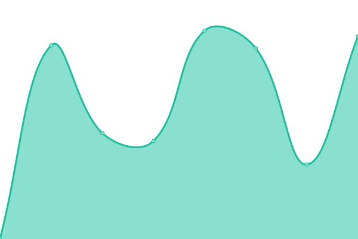 378ms
     
 | 

<a href="https://PatLittle.github.io/Consultations-Tracker/history/notice-of-intent-amendment-to-the-safe-food-for-canadians-regulations">100.00%</a>
    

|  [IPPC Member consultation on draft International Standards for Phytosanitary Measures and Implementation and Capacity Development Documents](https://inspection.canada.ca/importing-food-plants-or-animals/plant-and-plant-product-imports/international-plant-protection/eng/1307387838940/1307388165125#a3) | 🟩 Up | [ippc-member-consultation-on-draft-international-standards-for-phytosanitary-measures-and-implementation-and-capacity-development-documents.yml](https://github.com/PatLittle/Consultations-Tracker/commits/HEAD/history/ippc-member-consultation-on-draft-international-standards-for-phytosanitary-measures-and-implementation-and-capacity-development-documents.yml) | 

 57ms
     
 | 

<a href="https://PatLittle.github.io/Consultations-Tracker/history/ippc-member-consultation-on-draft-international-standards-for-phytosanitary-measures-and-implementation-and-capacity-development-documents">100.00%</a>
    

|  [Share your thoughts: Support the development of a new national-level potato wart response plan](https://inspection.canada.ca/about-cfia/transparency/consultations-and-engagement/national-potato-wart-response-plan/rmd-23-02/eng/1704393486135/1704393486479) | 🟩 Up | [share-your-thoughts-support-the-development-of-a-new-national-level-potato-wart-response-plan.yml](https://github.com/PatLittle/Consultations-Tracker/commits/HEAD/history/share-your-thoughts-support-the-development-of-a-new-national-level-potato-wart-response-plan.yml) | 

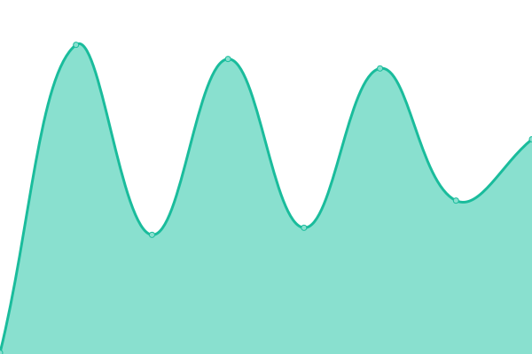 139ms
     
 | 

<a href="https://PatLittle.github.io/Consultations-Tracker/history/share-your-thoughts-support-the-development-of-a-new-national-level-potato-wart-response-plan">100.00%</a>
    

|  [Implementation of an interim standard for Per- and polyfluoroalkyl substances (PFAS) in municipal biosolids](https://inspection.canada.ca/about-cfia/transparency/consultations-and-engagement/interim-standards-for-pfas/eng/1702575266741/1702575267417) | 🟩 Up | [implementation-of-an-interim-standard-for-per-and-polyfluoroalkyl-substances-pfas-in-municipal-biosolids.yml](https://github.com/PatLittle/Consultations-Tracker/commits/HEAD/history/implementation-of-an-interim-standard-for-per-and-polyfluoroalkyl-substances-pfas-in-municipal-biosolids.yml) | 

 0ms
     
 | 

<a href="https://PatLittle.github.io/Consultations-Tracker/history/implementation-of-an-interim-standard-for-per-and-polyfluoroalkyl-substances-pfas-in-municipal-biosolids">100.00%</a>
    

|  [Share your thoughts: Pest risk management options to expand the regulated area for box tree moth in Canada](https://inspection.canada.ca/about-cfia/transparency/consultations-and-engagement/expanding-regulated-areas-for-box-tree-moth/eng/1704730654533/1704730655236) | 🟩 Up | [share-your-thoughts-pest-risk-management-options-to-expand-the-regulated-area-for-box-tree-moth-in-canada.yml](https://github.com/PatLittle/Consultations-Tracker/commits/HEAD/history/share-your-thoughts-pest-risk-management-options-to-expand-the-regulated-area-for-box-tree-moth-in-canada.yml) | 

 0ms
     
 | 

<a href="https://PatLittle.github.io/Consultations-Tracker/history/share-your-thoughts-pest-risk-management-options-to-expand-the-regulated-area-for-box-tree-moth-in-canada">100.00%</a>
    

|  [Share your thoughts: Implementation of the interim standard on per- and polyfluoroalkyl substances in biosolids](https://inspection.canada.ca/about-cfia/transparency/consultations-and-engagement/interim-standards-for-pfas/eng/1702575266741/1702575267417) | 🟩 Up | [share-your-thoughts-implementation-of-the-interim-standard-on-per-and-polyfluoroalkyl-substances-in-biosolids.yml](https://github.com/PatLittle/Consultations-Tracker/commits/HEAD/history/share-your-thoughts-implementation-of-the-interim-standard-on-per-and-polyfluoroalkyl-substances-in-biosolids.yml) | 

 0ms
     
 | 

<a href="https://PatLittle.github.io/Consultations-Tracker/history/share-your-thoughts-implementation-of-the-interim-standard-on-per-and-polyfluoroalkyl-substances-in-biosolids">100.00%</a>
    

|  [Share your thoughts: Pest risk management options to expand the regulated area for box tree moth in Canada](https://inspection.canada.ca/about-cfia/transparency/consultations-and-engagement/expanding-regulated-areas-for-box-tree-moth/eng/1704730654533/1704730655236) | 🟩 Up | [share-your-thoughts-pest-risk-management-options-to-expand-the-regulated-area-for-box-tree-moth-in-canada.yml](https://github.com/PatLittle/Consultations-Tracker/commits/HEAD/history/share-your-thoughts-pest-risk-management-options-to-expand-the-regulated-area-for-box-tree-moth-in-canada.yml) | 

 0ms
     
 | 

<a href="https://PatLittle.github.io/Consultations-Tracker/history/share-your-thoughts-pest-risk-management-options-to-expand-the-regulated-area-for-box-tree-moth-in-canada">100.00%</a>
    

|  [Share your thoughts: Winter 2024 Seed Regulatory Modernization Consultation (excluding seed potatoes)](https://inspection.canada.ca/about-the-cfia/transparency/consultations-and-engagement/seed-rm-winter-2024/eng/1706917169480/1706917170089) | 🟩 Up | [share-your-thoughts-winter-2024-seed-regulatory-modernization-consultation-excluding-seed-potatoes.yml](https://github.com/PatLittle/Consultations-Tracker/commits/HEAD/history/share-your-thoughts-winter-2024-seed-regulatory-modernization-consultation-excluding-seed-potatoes.yml) | 

 50ms
     
 | 

<a href="https://PatLittle.github.io/Consultations-Tracker/history/share-your-thoughts-winter-2024-seed-regulatory-modernization-consultation-excluding-seed-potatoes">100.00%</a>
    

|  [Public consultation on the proposed modernization of Part B of the Food and Drug Regulations (Regulations Amending Certain Regulations Concerning Food Additives and Compositional Standards, Microbiological Criteria, and Methods of Analysis for Food)](https://www.canada.ca/en/health-canada/programs/consultation-proposed-regulations-amending-certain-regulations-concerning-food-additives-compositional-standards-microbiological-criteria-methods-analysis-food.html ) | 🟥 Down | [public-consultation-on-the-proposed-modernization-of-part-b-of-the-food-and-drug-regulations-regulations-amending-certain-regulations-concerning-food-additives-and-compositional-standards-microbiological-criteria-and-methods-of-analysis-for-food.yml](https://github.com/PatLittle/Consultations-Tracker/commits/HEAD/history/public-consultation-on-the-proposed-modernization-of-part-b-of-the-food-and-drug-regulations-regulations-amending-certain-regulations-concerning-food-additives-and-compositional-standards-microbiological-criteria-and-methods-of-analysis-for-food.yml) | 

 0ms
     
 | 

<a href="https://PatLittle.github.io/Consultations-Tracker/history/public-consultation-on-the-proposed-modernization-of-part-b-of-the-food-and-drug-regulations-regulations-amending-certain-regulations-concerning-food-additives-and-compositional-standards-microbiological-criteria-and-methods-of-analysis-for-food">100.00%</a>
    

|  [Taking stock of progress: Legislative Review of the Safe Food for Canadians Act](https://inspection.canada.ca/about-the-cfia/transparency/consultations-and-engagement/legislative-review/eng/1711465871213/1711466412868) | 🟩 Up | [taking-stock-of-progress-legislative-review-of-the-safe-food-for-canadians-act.yml](https://github.com/PatLittle/Consultations-Tracker/commits/HEAD/history/taking-stock-of-progress-legislative-review-of-the-safe-food-for-canadians-act.yml) | 

 52ms
     
 | 

<a href="https://PatLittle.github.io/Consultations-Tracker/history/taking-stock-of-progress-legislative-review-of-the-safe-food-for-canadians-act">100.00%</a>
    

|  [Share your thoughts: Proposed new livestock feed ingredient - tannic acid](https://inspection.canada.ca/about-the-cfia/transparency/consultations-and-engagement/proposed-new-livestock-feed-ingredient-tannic-acid/eng/1711481337631/1711481338247) | 🟩 Up | [share-your-thoughts-proposed-new-livestock-feed-ingredient-tannic-acid.yml](https://github.com/PatLittle/Consultations-Tracker/commits/HEAD/history/share-your-thoughts-proposed-new-livestock-feed-ingredient-tannic-acid.yml) | 

 60ms
     
 | 

<a href="https://PatLittle.github.io/Consultations-Tracker/history/share-your-thoughts-proposed-new-livestock-feed-ingredient-tannic-acid">100.00%</a>
    

|  [Share your thoughts: Process for Prioritizing Feed Applications in Certain Unique Circumstances](N) | 🟥 Down | [share-your-thoughts-process-for-prioritizing-feed-applications-in-certain-unique-circumstances.yml](https://github.com/PatLittle/Consultations-Tracker/commits/HEAD/history/share-your-thoughts-process-for-prioritizing-feed-applications-in-certain-unique-circumstances.yml) | 

 0ms
     
 | 

<a href="https://PatLittle.github.io/Consultations-Tracker/history/share-your-thoughts-process-for-prioritizing-feed-applications-in-certain-unique-circumstances">100.00%</a>
    

|  [Changing Narrative Fund](https://www.canada.ca/en/canadian-heritage/campaigns/changing-narratives-fund.html) | 🟩 Up | [changing-narrative-fund.yml](https://github.com/PatLittle/Consultations-Tracker/commits/HEAD/history/changing-narrative-fund.yml) | 

 465ms
     
 | 

<a href="https://PatLittle.github.io/Consultations-Tracker/history/changing-narrative-fund">100.00%</a>
    

|  [2022-23 Consultations on renewal of the Museum Policy](https://www.canada.ca/en/canadian-heritage/campaigns/renewal-museum-policy.html) | 🟩 Up | [2022-23-consultations-on-renewal-of-the-museum-policy.yml](https://github.com/PatLittle/Consultations-Tracker/commits/HEAD/history/2022-23-consultations-on-renewal-of-the-museum-policy.yml) | 

 276ms
     
 | 

<a href="https://PatLittle.github.io/Consultations-Tracker/history/2022-23-consultations-on-renewal-of-the-museum-policy">100.00%</a>
    

|  [Refreshing Canada's Strategy for Patient-Oriented Research](https://cihr-irsc.gc.ca/e/53699.html) | 🟩 Up | [refreshing-canada-s-strategy-for-patient-oriented-research.yml](https://github.com/PatLittle/Consultations-Tracker/commits/HEAD/history/refreshing-canada-s-strategy-for-patient-oriented-research.yml) | 

 268ms
     
 | 

<a href="https://PatLittle.github.io/Consultations-Tracker/history/refreshing-canada-s-strategy-for-patient-oriented-research">100.00%</a>
    

|  [REGDOC-2.3.4, Operations Programs for Reactor Facilities](https://letstalknuclearsafety.ca/regdoc-234-operations-programs-reactor-facilities) | 🟩 Up | [regdoc-2-3-4-operations-programs-for-reactor-facilities.yml](https://github.com/PatLittle/Consultations-Tracker/commits/HEAD/history/regdoc-2-3-4-operations-programs-for-reactor-facilities.yml) | 

 124ms
     
 | 

<a href="https://PatLittle.github.io/Consultations-Tracker/history/regdoc-2-3-4-operations-programs-for-reactor-facilities">100.00%</a>
    

|  [REGDOC-1.3.1, Licence Application Guide: Uranium Mines and Mills](https://letstalknuclearsafety.ca/regdoc-131-licence-application-guide-uranium-mines-and-mills) | 🟩 Up | [regdoc-1-3-1-licence-application-guide-uranium-mines-and-mills.yml](https://github.com/PatLittle/Consultations-Tracker/commits/HEAD/history/regdoc-1-3-1-licence-application-guide-uranium-mines-and-mills.yml) | 

 76ms
     
 | 

<a href="https://PatLittle.github.io/Consultations-Tracker/history/regdoc-1-3-1-licence-application-guide-uranium-mines-and-mills">100.00%</a>
    

|  [Discussion Paper DIS-24-01 - Proposals to Amend the Packaging and Transport of Nuclear Substances Regulations, 2015 and the Nuclear Substances and Radiation Devices Regulations](https://letstalknuclearsafety.ca/discussion-paper-dis-24-01-proposals-amend-packaging-and-transport-nuclear-substances-regulations-0) | 🟩 Up | [discussion-paper-dis-24-01-proposals-to-amend-the-packaging-and-transport-of-nuclear-substances-regulations-2015-and-the-nuclear-substances-and-radiation-devices-regulations.yml](https://github.com/PatLittle/Consultations-Tracker/commits/HEAD/history/discussion-paper-dis-24-01-proposals-to-amend-the-packaging-and-transport-of-nuclear-substances-regulations-2015-and-the-nuclear-substances-and-radiation-devices-regulations.yml) | 

 76ms
     
 | 

<a href="https://PatLittle.github.io/Consultations-Tracker/history/discussion-paper-dis-24-01-proposals-to-amend-the-packaging-and-transport-of-nuclear-substances-regulations-2015-and-the-nuclear-substances-and-radiation-devices-regulations">100.00%</a>
    

|  [Discussion Paper DIS-24-02, Proposal to amend REGDOC-2.13.2, Import and Export](https://letstalknuclearsafety.ca/discussion-paper-dis-24-02-proposal-amend-regdoc-2132-import-and-export) | 🟩 Up | [discussion-paper-dis-24-02-proposal-to-amend-regdoc-2-13-2-import-and-export.yml](https://github.com/PatLittle/Consultations-Tracker/commits/HEAD/history/discussion-paper-dis-24-02-proposal-to-amend-regdoc-2-13-2-import-and-export.yml) | 

 121ms
     
 | 

<a href="https://PatLittle.github.io/Consultations-Tracker/history/discussion-paper-dis-24-02-proposal-to-amend-regdoc-2-13-2-import-and-export">100.00%</a>
    

|  [Discussion Paper DIS-24-03, Proposal to amend REGDOC-2.13.1, Safeguards and Nuclear Material Accountancy](https://letstalknuclearsafety.ca/discussion-paper-dis-24-03-proposal-amend-regdoc-2131-safeguards-and-nuclear-material-accountancy-0) | 🟩 Up | [discussion-paper-dis-24-03-proposal-to-amend-regdoc-2-13-1-safeguards-and-nuclear-material-accountancy.yml](https://github.com/PatLittle/Consultations-Tracker/commits/HEAD/history/discussion-paper-dis-24-03-proposal-to-amend-regdoc-2-13-1-safeguards-and-nuclear-material-accountancy.yml) | 

 75ms
     
 | 

<a href="https://PatLittle.github.io/Consultations-Tracker/history/discussion-paper-dis-24-03-proposal-to-amend-regdoc-2-13-1-safeguards-and-nuclear-material-accountancy">100.00%</a>
    

|  [Regulations Amending Certain Regulations Made Under the Nuclear Safety and Control Act (Imports, Exports and Safeguards)](https://canadagazette.gc.ca/rp-pr/p1/2024/2024-03-30/html/reg1-eng.html) | 🟩 Up | [regulations-amending-certain-regulations-made-under-the-nuclear-safety-and-control-act-imports-exports-and-safeguards.yml](https://github.com/PatLittle/Consultations-Tracker/commits/HEAD/history/regulations-amending-certain-regulations-made-under-the-nuclear-safety-and-control-act-imports-exports-and-safeguards.yml) | 

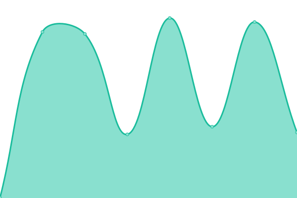 445ms
     
 | 

<a href="https://PatLittle.github.io/Consultations-Tracker/history/regulations-amending-certain-regulations-made-under-the-nuclear-safety-and-control-act-imports-exports-and-safeguards">100.00%</a>
    

|  [Co-development of a new Indigenous Broadcasting Policy](https://crtc.gc.ca/eng/archive/2019/2019-217.htm) | 🟩 Up | [co-development-of-a-new-indigenous-broadcasting-policy.yml](https://github.com/PatLittle/Consultations-Tracker/commits/HEAD/history/co-development-of-a-new-indigenous-broadcasting-policy.yml) | 

 345ms
     
 | 

<a href="https://PatLittle.github.io/Consultations-Tracker/history/co-development-of-a-new-indigenous-broadcasting-policy">100.00%</a>
    

|  [Share your thoughts about the regulatory framework for the Online News Act](https://crtc.gc.ca/eng/consultation/news-nouvelles.htm) | 🟩 Up | [share-your-thoughts-about-the-regulatory-framework-for-the-online-news-act.yml](https://github.com/PatLittle/Consultations-Tracker/commits/HEAD/history/share-your-thoughts-about-the-regulatory-framework-for-the-online-news-act.yml) | 

 53ms
     
 | 

<a href="https://PatLittle.github.io/Consultations-Tracker/history/share-your-thoughts-about-the-regulatory-framework-for-the-online-news-act">100.00%</a>
    

|  [Share your thoughts about Indigenous programming in Canada](https://crtc.gc.ca/eng/consultation/ibp-pra.htm) | 🟩 Up | [share-your-thoughts-about-indigenous-programming-in-canada.yml](https://github.com/PatLittle/Consultations-Tracker/commits/HEAD/history/share-your-thoughts-about-indigenous-programming-in-canada.yml) | 

 0ms
     
 | 

<a href="https://PatLittle.github.io/Consultations-Tracker/history/share-your-thoughts-about-indigenous-programming-in-canada">100.00%</a>
    

|  [Consultation on requests for Conditional Exemptions from the tactile requirement related to signage in terminals in the Accessible Transportation for Persons with Disabilities Regulations ](https://otc-cta.gc.ca/eng/consultation/consultation-requests-conditional-exemptions-catsa-cbsa-atpdr) | 🟩 Up | [consultation-on-requests-for-conditional-exemptions-from-the-tactile-requirement-related-to-signage-in-terminals-in-the-accessible-transportation-for-persons-with-disabilities-regulations.yml](https://github.com/PatLittle/Consultations-Tracker/commits/HEAD/history/consultation-on-requests-for-conditional-exemptions-from-the-tactile-requirement-related-to-signage-in-terminals-in-the-accessible-transportation-for-persons-with-disabilities-regulations.yml) | 

 0ms
     
 | 

<a href="https://PatLittle.github.io/Consultations-Tracker/history/consultation-on-requests-for-conditional-exemptions-from-the-tactile-requirement-related-to-signage-in-terminals-in-the-accessible-transportation-for-persons-with-disabilities-regulations">100.00%</a>
    

|  [Consultation on Scientific Research and Experimental Development](https://www.canada.ca/en/department-finance/programs/consultations/2024/consultation-on-scientific-research-and-experimental-development.html) | 🟩 Up | [consultation-on-scientific-research-and-experimental-development.yml](https://github.com/PatLittle/Consultations-Tracker/commits/HEAD/history/consultation-on-scientific-research-and-experimental-development.yml) | 

 205ms
     
 | 

<a href="https://PatLittle.github.io/Consultations-Tracker/history/consultation-on-scientific-research-and-experimental-development">100.00%</a>
    

|  [Consultation on Creating a Patent Box Regime](https://www.canada.ca/en/department-finance/programs/consultations/2024/consultation-on-creating-a-patent-box-regime.html) | 🟩 Up | [consultation-on-creating-a-patent-box-regime.yml](https://github.com/PatLittle/Consultations-Tracker/commits/HEAD/history/consultation-on-creating-a-patent-box-regime.yml) | 

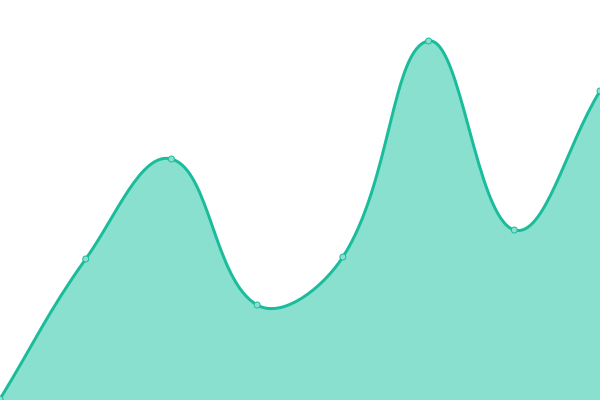 219ms
     
 | 

<a href="https://PatLittle.github.io/Consultations-Tracker/history/consultation-on-creating-a-patent-box-regime">100.00%</a>
    

|  [Council of Europe Second Additional Protocol to the Convention on Cybercrime on Enhanced Cooperation and Disclosure of Electronic EvidenceConsultations, 2023](https://www.justice.gc.ca/eng/cj-jp/cyber/id-di/index.html) | 🟩 Up | [council-of-europe-second-additional-protocol-to-the-convention-on-cybercrime-on-enhanced-cooperation-and-disclosure-of-electronic-evidence-consultations-2023.yml](https://github.com/PatLittle/Consultations-Tracker/commits/HEAD/history/council-of-europe-second-additional-protocol-to-the-convention-on-cybercrime-on-enhanced-cooperation-and-disclosure-of-electronic-evidence-consultations-2023.yml) | 

 397ms
     
 | 

<a href="https://PatLittle.github.io/Consultations-Tracker/history/council-of-europe-second-additional-protocol-to-the-convention-on-cybercrime-on-enhanced-cooperation-and-disclosure-of-electronic-evidence-consultations-2023">100.00%</a>
    

|  [Clean Fuel Standard](https://www.canada.ca/en/environment-climate-change/services/managing-pollution/energy-production/fuel-regulations/clean-fuel-standard.html) | 🟩 Up | [clean-fuel-standard.yml](https://github.com/PatLittle/Consultations-Tracker/commits/HEAD/history/clean-fuel-standard.yml) | 

 203ms
     
 | 

<a href="https://PatLittle.github.io/Consultations-Tracker/history/clean-fuel-standard">100.00%</a>
    

|  [Share and view ideas: Renewal of the Federal Agenda for Volatile Organic Compounds in Consumer and Commercial Product](https://www.canada.ca/en/environment-climate-change/services/managing-pollution/sources-industry/volatile-organic-compounds-consumer-commercial/renewal-federal-agenda-volatile-organic-compound-consumer-commercial-product.html) | 🟩 Up | [share-and-view-ideas-renewal-of-the-federal-agenda-for-volatile-organic-compounds-in-consumer-and-commercial-product.yml](https://github.com/PatLittle/Consultations-Tracker/commits/HEAD/history/share-and-view-ideas-renewal-of-the-federal-agenda-for-volatile-organic-compounds-in-consumer-and-commercial-product.yml) | 

 0ms
     
 | 

<a href="https://PatLittle.github.io/Consultations-Tracker/history/share-and-view-ideas-renewal-of-the-federal-agenda-for-volatile-organic-compounds-in-consumer-and-commercial-product">100.00%</a>
    

|  [Share your ideas: Blackwater Project](https://www.canada.ca/en/environment-climate-change/services/managing-pollution/sources-industry/mining/metal-diamond-mining-effluent-regulation/blackwater-consultation.html) | 🟥 Down | [share-your-ideas-blackwater-project.yml](https://github.com/PatLittle/Consultations-Tracker/commits/HEAD/history/share-your-ideas-blackwater-project.yml) | 

 141ms
     
 | 

<a href="https://PatLittle.github.io/Consultations-Tracker/history/share-your-ideas-blackwater-project">100.00%</a>
    

|  [Share ideas: Mont-Wright Mining Project (Dyno Basin)](https://canada.ca/en/environment-climate-change/services/managing-pollution/sources-industry/mining/metal-diamond-mining-effluent-regulation/basin-dyno-consultation.html) | 🟥 Down | [share-ideas-mont-wright-mining-project-dyno-basin.yml](https://github.com/PatLittle/Consultations-Tracker/commits/HEAD/history/share-ideas-mont-wright-mining-project-dyno-basin.yml) | 

 484ms
     
 | 

<a href="https://PatLittle.github.io/Consultations-Tracker/history/share-ideas-mont-wright-mining-project-dyno-basin">100.00%</a>
    

|  [Recovery Strategy (Amended) and Action Plan for the Piping Plover melodus subspecies (Charadrius melodus melodus) in Canada [Proposed]](https://registre-especes.canada.ca/index-fr.html#/documents/923) | 🟩 Up | [recovery-strategy-amended-and-action-plan-for-the-piping-plover-melodus-subspecies-charadrius-melodus-melodus-in-canada-proposed.yml](https://github.com/PatLittle/Consultations-Tracker/commits/HEAD/history/recovery-strategy-amended-and-action-plan-for-the-piping-plover-melodus-subspecies-charadrius-melodus-melodus-in-canada-proposed.yml) | 

 0ms
     
 | 

<a href="https://PatLittle.github.io/Consultations-Tracker/history/recovery-strategy-amended-and-action-plan-for-the-piping-plover-melodus-subspecies-charadrius-melodus-melodus-in-canada-proposed">100.00%</a>
    

|  [Consultation on the Proposed Recovery Strategy for the Gypsy Cuckoo Bumble Bee](https://species-registry.canada.ca/index-en.html#/documents/268 ) | 🟥 Down | [consultation-on-the-proposed-recovery-strategy-for-the-gypsy-cuckoo-bumble-bee.yml](https://github.com/PatLittle/Consultations-Tracker/commits/HEAD/history/consultation-on-the-proposed-recovery-strategy-for-the-gypsy-cuckoo-bumble-bee.yml) | 

 0ms
     
 | 

<a href="https://PatLittle.github.io/Consultations-Tracker/history/consultation-on-the-proposed-recovery-strategy-for-the-gypsy-cuckoo-bumble-bee">100.00%</a>
    

|  [Offsetting Policy for Biodiversity](https://www.canada.ca/en/environment-climate-change/services/biodiversity/share-view-ideas-offsetting-policy-biodiversity.html ) | 🟥 Down | [offsetting-policy-for-biodiversity.yml](https://github.com/PatLittle/Consultations-Tracker/commits/HEAD/history/offsetting-policy-for-biodiversity.yml) | 

 0ms
     
 | 

<a href="https://PatLittle.github.io/Consultations-Tracker/history/offsetting-policy-for-biodiversity">100.00%</a>
    

|  [Consultations on Canada's 2030 Biodiversity Strategy](https://www.canada.ca/en/services/environment/wildlife-plants-species/biodiversity.html) | 🟩 Up | [consultations-on-canada-s-2030-biodiversity-strategy.yml](https://github.com/PatLittle/Consultations-Tracker/commits/HEAD/history/consultations-on-canada-s-2030-biodiversity-strategy.yml) | 

 168ms
     
 | 

<a href="https://PatLittle.github.io/Consultations-Tracker/history/consultations-on-canada-s-2030-biodiversity-strategy">100.00%</a>
    

|  [Draft Canada-US Lake Huron Lakewide Action & Management Plan](https://binational.net/2023/03/13/2022-2026-lake-huron-lakewide-action-and-management-plan-available-for-public-review-and-comment/) | 🟥 Down | [draft-canada-us-lake-huron-lakewide-action-and-management-plan.yml](https://github.com/PatLittle/Consultations-Tracker/commits/HEAD/history/draft-canada-us-lake-huron-lakewide-action-and-management-plan.yml) | 

 0ms
     
 | 

<a href="https://PatLittle.github.io/Consultations-Tracker/history/draft-canada-us-lake-huron-lakewide-action-and-management-plan">100.00%</a>
    

|  [Share your ideas: Assessing phosphorus targets for Lake Ontario](https://www.canada.ca/en/environment-climate-change/corporate/transparency/consultations/consultation-phosphorus-lake-ontario.html) | 🟩 Up | [share-your-ideas-assessing-phosphorus-targets-for-lake-ontario.yml](https://github.com/PatLittle/Consultations-Tracker/commits/HEAD/history/share-your-ideas-assessing-phosphorus-targets-for-lake-ontario.yml) | 

 189ms
     
 | 

<a href="https://PatLittle.github.io/Consultations-Tracker/history/share-your-ideas-assessing-phosphorus-targets-for-lake-ontario">100.00%</a>
    

|  [Share and view ideas: Publication of a Notice of intent for the Federal Plastics Registry](https://canada.ca/en/environment-climate-change/services/managing-reducing-waste/consultations/technical-paper-registry.html) | 🟩 Up | [share-and-view-ideas-publication-of-a-notice-of-intent-for-the-federal-plastics-registry.yml](https://github.com/PatLittle/Consultations-Tracker/commits/HEAD/history/share-and-view-ideas-publication-of-a-notice-of-intent-for-the-federal-plastics-registry.yml) | 

 198ms
     
 | 

<a href="https://PatLittle.github.io/Consultations-Tracker/history/share-and-view-ideas-publication-of-a-notice-of-intent-for-the-federal-plastics-registry">100.00%</a>
    

|  [Share your ideas: consultation on the modernization of the Pulp and Paper Effluent Regulations](https://canada.ca/en/environment-climate-change/services/managing-pollution/fisheries-act-registry/consultation-modernization-pulp-paper-effluent-regulations.html) | 🟩 Up | [share-your-ideas-consultation-on-the-modernization-of-the-pulp-and-paper-effluent-regulations.yml](https://github.com/PatLittle/Consultations-Tracker/commits/HEAD/history/share-your-ideas-consultation-on-the-modernization-of-the-pulp-and-paper-effluent-regulations.yml) | 

 376ms
     
 | 

<a href="https://PatLittle.github.io/Consultations-Tracker/history/share-your-ideas-consultation-on-the-modernization-of-the-pulp-and-paper-effluent-regulations">100.00%</a>
    

|  [Consultation on Amending the List of Species under the Species at Risk Act: Terrestrial Species December 2023](https://species-registry.canada.ca/index-en.html#/documents/1171) | 🟩 Up | [consultation-on-amending-the-list-of-species-under-the-species-at-risk-act-terrestrial-species-december-2023.yml](https://github.com/PatLittle/Consultations-Tracker/commits/HEAD/history/consultation-on-amending-the-list-of-species-under-the-species-at-risk-act-terrestrial-species-december-2023.yml) | 

 172ms
     
 | 

<a href="https://PatLittle.github.io/Consultations-Tracker/history/consultation-on-amending-the-list-of-species-under-the-species-at-risk-act-terrestrial-species-december-2023">100.00%</a>
    

|  [Share your thoughts: Implementation Framework for a Right to a Healthy Environment in the Canadian Environmental Protection Act, 1999](https://www.canada.ca/en/environment-climate-change/corporate/transparency/consultations/right-healthy-environment.html) | 🟩 Up | [share-your-thoughts-implementation-framework-for-a-right-to-a-healthy-environment-in-the-canadian-environmental-protection-act-1999.yml](https://github.com/PatLittle/Consultations-Tracker/commits/HEAD/history/share-your-thoughts-implementation-framework-for-a-right-to-a-healthy-environment-in-the-canadian-environmental-protection-act-1999.yml) | 

 0ms
     
 | 

<a href="https://PatLittle.github.io/Consultations-Tracker/history/share-your-thoughts-implementation-framework-for-a-right-to-a-healthy-environment-in-the-canadian-environmental-protection-act-1999">100.00%</a>
    

|  [Share your ideas: Amendments to the Metal and Diamond Mining Effluent Regulations for the Red Lake Mine ](https://www.canada.ca/en/environment-climate-change/corporate/transparency/consultations/red-lake-mine-project.html) | 🟩 Up | [share-your-ideas-amendments-to-the-metal-and-diamond-mining-effluent-regulations-for-the-red-lake-mine.yml](https://github.com/PatLittle/Consultations-Tracker/commits/HEAD/history/share-your-ideas-amendments-to-the-metal-and-diamond-mining-effluent-regulations-for-the-red-lake-mine.yml) | 

 227ms
     
 | 

<a href="https://PatLittle.github.io/Consultations-Tracker/history/share-your-ideas-amendments-to-the-metal-and-diamond-mining-effluent-regulations-for-the-red-lake-mine">100.00%</a>
    

|  [Share your thoughts: Toward a National Framework for Environmental Learning Consultation](https://www.canada.ca/en/environment-climate-change/corporate/transparency/consultations/national-framework-environmental-learning.html) | 🟩 Up | [share-your-thoughts-toward-a-national-framework-for-environmental-learning-consultation.yml](https://github.com/PatLittle/Consultations-Tracker/commits/HEAD/history/share-your-thoughts-toward-a-national-framework-for-environmental-learning-consultation.yml) | 

 175ms
     
 | 

<a href="https://PatLittle.github.io/Consultations-Tracker/history/share-your-thoughts-toward-a-national-framework-for-environmental-learning-consultation">100.00%</a>
    

|  [Eastern Shore Islands Area of Interest Consultations ](http://www.dfo-mpo.gc.ca/oceans/consultations/easternshore-ilescoteest/index-eng.html) | 🟩 Up | [eastern-shore-islands-area-of-interest-consultations.yml](https://github.com/PatLittle/Consultations-Tracker/commits/HEAD/history/eastern-shore-islands-area-of-interest-consultations.yml) | 

 511ms
     
 | 

<a href="https://PatLittle.github.io/Consultations-Tracker/history/eastern-shore-islands-area-of-interest-consultations">100.00%</a>
    

|  [Fundian Channel- Browns Bank Area of Interest ](https://www.dfo-mpo.gc.ca/oceans/aoi-si/fundian-fundy-browns-eng.html) | 🟩 Up | [fundian-channel-browns-bank-area-of-interest.yml](https://github.com/PatLittle/Consultations-Tracker/commits/HEAD/history/fundian-channel-browns-bank-area-of-interest.yml) | 

 339ms
     
 | 

<a href="https://PatLittle.github.io/Consultations-Tracker/history/fundian-channel-browns-bank-area-of-interest">100.00%</a>
    

|  [Aquaculture Activities Regulations (AAR)](https://www.dfo-mpo.gc.ca/aquaculture/management-gestion/aar-raa-eng.htm) | 🟩 Up | [aquaculture-activities-regulations-aar.yml](https://github.com/PatLittle/Consultations-Tracker/commits/HEAD/history/aquaculture-activities-regulations-aar.yml) | 

 97ms
     
 | 

<a href="https://PatLittle.github.io/Consultations-Tracker/history/aquaculture-activities-regulations-aar">100.00%</a>
    

|  [Let's talk Pacific Salmon](https://letstalkpacificsalmon.ca/) | 🟩 Up | [let-s-talk-pacific-salmon.yml](https://github.com/PatLittle/Consultations-Tracker/commits/HEAD/history/let-s-talk-pacific-salmon.yml) | 

 777ms
     
 | 

<a href="https://PatLittle.github.io/Consultations-Tracker/history/let-s-talk-pacific-salmon">100.00%</a>
    

|  [Proposed ticketing for the enforcement of a fisheries offence under the Fisheries Act](TBD) | 🟥 Down | [proposed-ticketing-for-the-enforcement-of-a-fisheries-offence-under-the-fisheries-act.yml](https://github.com/PatLittle/Consultations-Tracker/commits/HEAD/history/proposed-ticketing-for-the-enforcement-of-a-fisheries-offence-under-the-fisheries-act.yml) | 

 0ms
     
 | 

<a href="https://PatLittle.github.io/Consultations-Tracker/history/proposed-ticketing-for-the-enforcement-of-a-fisheries-offence-under-the-fisheries-act">100.00%</a>
    

|  [Wave 3-Engagement on Policy and Regulatory Initiatives – Fish and Fish Habitat Protection](http://www.talkfishhabitat.ca) | 🟩 Up | [wave-3-engagement-on-policy-and-regulatory-initiatives-fish-and-fish-habitat-protection.yml](https://github.com/PatLittle/Consultations-Tracker/commits/HEAD/history/wave-3-engagement-on-policy-and-regulatory-initiatives-fish-and-fish-habitat-protection.yml) | 

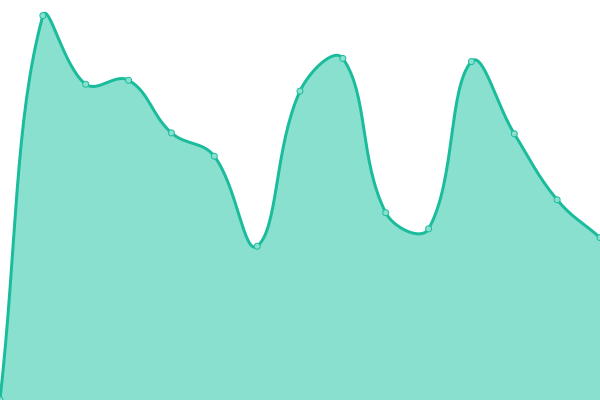 1032ms
     
 | 

<a href="https://PatLittle.github.io/Consultations-Tracker/history/wave-3-engagement-on-policy-and-regulatory-initiatives-fish-and-fish-habitat-protection">100.00%</a>
    

|  [Tang.ɢwan — ḥačxwiqak — Tsiǥis Marine Protected Area (Offshore Pacific)](https://www.canadagazette.gc.ca/rp-pr/p1/2023/2023-02-18/html/reg5-eng.html) | 🟩 Up | [tang-wan-acxwiqak-tsi-is-marine-protected-area-offshore-pacific.yml](https://github.com/PatLittle/Consultations-Tracker/commits/HEAD/history/tang-wan-acxwiqak-tsi-is-marine-protected-area-offshore-pacific.yml) | 

 347ms
     
 | 

<a href="https://PatLittle.github.io/Consultations-Tracker/history/tang-wan-acxwiqak-tsi-is-marine-protected-area-offshore-pacific">100.00%</a>
    

|  [Whitby Harbour Remediation Project](https://www.dfo-mpo.gc.ca/sch-ppb/whitby/index-eng.html) | 🟩 Up | [whitby-harbour-remediation-project.yml](https://github.com/PatLittle/Consultations-Tracker/commits/HEAD/history/whitby-harbour-remediation-project.yml) | 

 322ms
     
 | 

<a href="https://PatLittle.github.io/Consultations-Tracker/history/whitby-harbour-remediation-project">100.00%</a>
    

|  [Discussion framework for a BC aquaculture open-net pen transition plan](https://www.pac.dfo-mpo.gc.ca/consultation/aquaculture/bc-transition-cb/index-eng.html) | 🟩 Up | [discussion-framework-for-a-bc-aquaculture-open-net-pen-transition-plan.yml](https://github.com/PatLittle/Consultations-Tracker/commits/HEAD/history/discussion-framework-for-a-bc-aquaculture-open-net-pen-transition-plan.yml) | 

 578ms
     
 | 

<a href="https://PatLittle.github.io/Consultations-Tracker/history/discussion-framework-for-a-bc-aquaculture-open-net-pen-transition-plan">100.00%</a>
    

|  [Consultation check-in on 14 aquatic species under consideration for addition or reclassification to Schedule 1 of the Species at Risk Act](https://www.canada.ca/en/environment-climate-change/services/species-risk-public-registry/consultation-documents/check-in-14-aquatic.html) | 🟩 Up | [consultation-check-in-on-14-aquatic-species-under-consideration-for-addition-or-reclassification-to-schedule-1-of-the-species-at-risk-act.yml](https://github.com/PatLittle/Consultations-Tracker/commits/HEAD/history/consultation-check-in-on-14-aquatic-species-under-consideration-for-addition-or-reclassification-to-schedule-1-of-the-species-at-risk-act.yml) | 

 263ms
     
 | 

<a href="https://PatLittle.github.io/Consultations-Tracker/history/consultation-check-in-on-14-aquatic-species-under-consideration-for-addition-or-reclassification-to-schedule-1-of-the-species-at-risk-act">100.00%</a>
    

|  [Draft Ocean Noise Strategy for Canada](http://www.dfo-mpo.gc.ca/oceans/consultations/noise-bruit/index-eng.html) | 🟩 Up | [draft-ocean-noise-strategy-for-canada.yml](https://github.com/PatLittle/Consultations-Tracker/commits/HEAD/history/draft-ocean-noise-strategy-for-canada.yml) | 

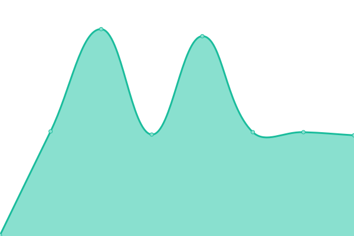 203ms
     
 | 

<a href="https://PatLittle.github.io/Consultations-Tracker/history/draft-ocean-noise-strategy-for-canada">100.00%</a>
    

|  [Revision of the management plan for Banc-des-Américains Marine Protected Area (MPA)](https://www.dfo-mpo.gc.ca/oceans/mpa-zpm/american-americains/index-eng.html) | 🟩 Up | [revision-of-the-management-plan-for-banc-des-americains-marine-protected-area-mpa.yml](https://github.com/PatLittle/Consultations-Tracker/commits/HEAD/history/revision-of-the-management-plan-for-banc-des-americains-marine-protected-area-mpa.yml) | 

 268ms
     
 | 

<a href="https://PatLittle.github.io/Consultations-Tracker/history/revision-of-the-management-plan-for-banc-des-americains-marine-protected-area-mpa">100.00%</a>
    

|  [Tang.ɢwan — ḥačxwiqak — Tsiǥis Marine Protected Area (Offshore Pacific)](https://www.canadagazette.gc.ca/rp-pr/p1/2023/2023-02-18/html/reg5-eng.html) | 🟩 Up | [tang-wan-acxwiqak-tsi-is-marine-protected-area-offshore-pacific.yml](https://github.com/PatLittle/Consultations-Tracker/commits/HEAD/history/tang-wan-acxwiqak-tsi-is-marine-protected-area-offshore-pacific.yml) | 

 347ms
     
 | 

<a href="https://PatLittle.github.io/Consultations-Tracker/history/tang-wan-acxwiqak-tsi-is-marine-protected-area-offshore-pacific">100.00%</a>
    

|  [Elver Fishery Management Review](https://www.dfo-mpo.gc.ca/fisheries-peches/ifmp-gmp/elver-anguille/index-eng.html) | 🟩 Up | [elver-fishery-management-review.yml](https://github.com/PatLittle/Consultations-Tracker/commits/HEAD/history/elver-fishery-management-review.yml) | 

 412ms
     
 | 

<a href="https://PatLittle.github.io/Consultations-Tracker/history/elver-fishery-management-review">100.00%</a>
    

|  [Marine Spatial Planning ](https://www.dfo-mpo.gc.ca/oceans/planning-planification/index-eng.html) | 🟩 Up | [marine-spatial-planning.yml](https://github.com/PatLittle/Consultations-Tracker/commits/HEAD/history/marine-spatial-planning.yml) | 

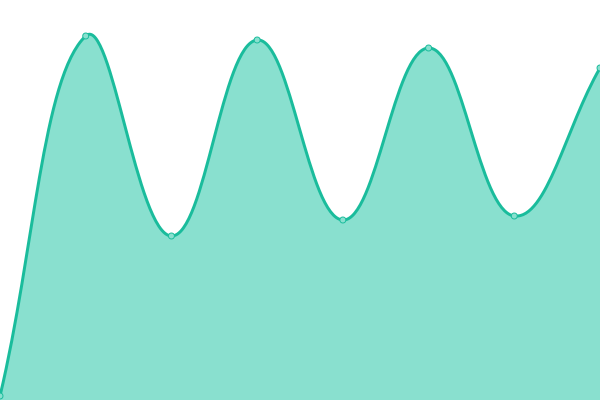 67ms
     
 | 

<a href="https://PatLittle.github.io/Consultations-Tracker/history/marine-spatial-planning">100.00%</a>
    

|  [Management Plan for the Mapleleaf (Quadrula quadrula) Great Lakes – Upper St. Lawrence Population, and Rainbow (Villosa iris) in Canada](https://wildlife-species.canada.ca/species-risk-registry/involved/consultation/default_e.cfm) | 🟩 Up | [management-plan-for-the-mapleleaf-quadrula-quadrula-great-lakes-upper-st-lawrence-population-and-rainbow-villosa-iris-in-canada.yml](https://github.com/PatLittle/Consultations-Tracker/commits/HEAD/history/management-plan-for-the-mapleleaf-quadrula-quadrula-great-lakes-upper-st-lawrence-population-and-rainbow-villosa-iris-in-canada.yml) | 

 0ms
     
 | 

<a href="https://PatLittle.github.io/Consultations-Tracker/history/management-plan-for-the-mapleleaf-quadrula-quadrula-great-lakes-upper-st-lawrence-population-and-rainbow-villosa-iris-in-canada">100.00%</a>
    

|  [Management Plan for the Northern Sunfish (Lepomis peltastes) in Canada (Great Lakes – Upper St. Lawrence Populations) ](https://www.registrelep-sararegistry.gc.ca/document/default_e.cfm?documentID=173) | 🟩 Up | [management-plan-for-the-northern-sunfish-lepomis-peltastes-in-canada-great-lakes-upper-st-lawrence-populations.yml](https://github.com/PatLittle/Consultations-Tracker/commits/HEAD/history/management-plan-for-the-northern-sunfish-lepomis-peltastes-in-canada-great-lakes-upper-st-lawrence-populations.yml) | 

 0ms
     
 | 

<a href="https://PatLittle.github.io/Consultations-Tracker/history/management-plan-for-the-northern-sunfish-lepomis-peltastes-in-canada-great-lakes-upper-st-lawrence-populations">100.00%</a>
    

|  [Addition of a line of floating pontoons and the riprap to breakwater 301 at Grosse-Île harbour, Magdalen Islands](https://iaac-aeic.gc.ca/050/evaluations/proj/86003?culture=en-CA) | 🟩 Up | [addition-of-a-line-of-floating-pontoons-and-the-riprap-to-breakwater-301-at-grosse-ile-harbour-magdalen-islands.yml](https://github.com/PatLittle/Consultations-Tracker/commits/HEAD/history/addition-of-a-line-of-floating-pontoons-and-the-riprap-to-breakwater-301-at-grosse-ile-harbour-magdalen-islands.yml) | 

 971ms
     
 | 

<a href="https://PatLittle.github.io/Consultations-Tracker/history/addition-of-a-line-of-floating-pontoons-and-the-riprap-to-breakwater-301-at-grosse-ile-harbour-magdalen-islands">100.00%</a>
    

|  [Listing of Lumpfish, Ringed Seal and Harbour Porpoise on the Species at Risk public registry](Species at risk public registry - Canada.ca) | 🟥 Down | [listing-of-lumpfish-ringed-seal-and-harbour-porpoise-on-the-species-at-risk-public-registry.yml](https://github.com/PatLittle/Consultations-Tracker/commits/HEAD/history/listing-of-lumpfish-ringed-seal-and-harbour-porpoise-on-the-species-at-risk-public-registry.yml) | 

 0ms
     
 | 

<a href="https://PatLittle.github.io/Consultations-Tracker/history/listing-of-lumpfish-ringed-seal-and-harbour-porpoise-on-the-species-at-risk-public-registry">100.00%</a>
    

|  [Share and view ideas: Potential amendments to the Aquatic Invasive Species Regulations pertaining to authorities for the deposit of deleterious substances](https://www.dfo-mpo.gc.ca/about-notre-sujet/engagement/2023/ais-regulations-reglement-eae-eng.html) | 🟩 Up | [share-and-view-ideas-potential-amendments-to-the-aquatic-invasive-species-regulations-pertaining-to-authorities-for-the-deposit-of-deleterious-substances.yml](https://github.com/PatLittle/Consultations-Tracker/commits/HEAD/history/share-and-view-ideas-potential-amendments-to-the-aquatic-invasive-species-regulations-pertaining-to-authorities-for-the-deposit-of-deleterious-substances.yml) | 

 109ms
     
 | 

<a href="https://PatLittle.github.io/Consultations-Tracker/history/share-and-view-ideas-potential-amendments-to-the-aquatic-invasive-species-regulations-pertaining-to-authorities-for-the-deposit-of-deleterious-substances">100.00%</a>
    

|  [Banc-des-Américains Oceans Act Marine Protected Area Management Plan](https://www.dfo-mpo.gc.ca/oceans/mpa-zpm/american-americains/index-eng.html) | 🟩 Up | [banc-des-americains-oceans-act-marine-protected-area-management-plan.yml](https://github.com/PatLittle/Consultations-Tracker/commits/HEAD/history/banc-des-americains-oceans-act-marine-protected-area-management-plan.yml) | 

 108ms
     
 | 

<a href="https://PatLittle.github.io/Consultations-Tracker/history/banc-des-americains-oceans-act-marine-protected-area-management-plan">100.00%</a>
    

|  [American Eel: Consultation check-in on listing under the Species at Risk Act](https://species-registry.canada.ca/index-en.html#/documents/1049) | 🟩 Up | [american-eel-consultation-check-in-on-listing-under-the-species-at-risk-act.yml](https://github.com/PatLittle/Consultations-Tracker/commits/HEAD/history/american-eel-consultation-check-in-on-listing-under-the-species-at-risk-act.yml) | 

 41ms
     
 | 

<a href="https://PatLittle.github.io/Consultations-Tracker/history/american-eel-consultation-check-in-on-listing-under-the-species-at-risk-act">100.00%</a>
    

|  [Proposed Amendments to the Export Permits Regulations](https://www.international.gc.ca/trade-commerce/controls-controles/expor/backgrounder-amendments-epr-information-modification-rle.aspx?lang=eng) | 🟩 Up | [proposed-amendments-to-the-export-permits-regulations.yml](https://github.com/PatLittle/Consultations-Tracker/commits/HEAD/history/proposed-amendments-to-the-export-permits-regulations.yml) | 

 462ms
     
 | 

<a href="https://PatLittle.github.io/Consultations-Tracker/history/proposed-amendments-to-the-export-permits-regulations">100.00%</a>
    

|  [Engagement on Indigenous Perspectives on Medical Assistance in Dying](https://www.canada.ca/en/health-canada/programs/engagement-indigenous-perspectives-medical-assistance-dying.html) | 🟩 Up | [engagement-on-indigenous-perspectives-on-medical-assistance-in-dying.yml](https://github.com/PatLittle/Consultations-Tracker/commits/HEAD/history/engagement-on-indigenous-perspectives-on-medical-assistance-in-dying.yml) | 

 0ms
     
 | 

<a href="https://PatLittle.github.io/Consultations-Tracker/history/engagement-on-indigenous-perspectives-on-medical-assistance-in-dying">100.00%</a>
    

|  [Notice of Intent to Repeal Sixteen Food-Related Marketing Authorizations](https://www.canada.ca/en/health-canada/services/food-nutrition/public-involvement-partnerships/notice-intent-repeal-sixteen-food-related-marketing-authorizations.html ) | 🟥 Down | [notice-of-intent-to-repeal-sixteen-food-related-marketing-authorizations.yml](https://github.com/PatLittle/Consultations-Tracker/commits/HEAD/history/notice-of-intent-to-repeal-sixteen-food-related-marketing-authorizations.yml) | 

 0ms
     
 | 

<a href="https://PatLittle.github.io/Consultations-Tracker/history/notice-of-intent-to-repeal-sixteen-food-related-marketing-authorizations">100.00%</a>
    

|  [Consultation on cloquintocet-mexyl, Proposed Maximum Residue Limit PMRL2024-03](https://www.canada.ca/en/health-canada/services/consumer-product-safety/pesticides-pest-management/public/consultations/proposed-maximum-residue-limit/2024/cloquintocet-mexyl.html) | 🟩 Up | [consultation-on-cloquintocet-mexyl-proposed-maximum-residue-limit-pmrl-2024-03.yml](https://github.com/PatLittle/Consultations-Tracker/commits/HEAD/history/consultation-on-cloquintocet-mexyl-proposed-maximum-residue-limit-pmrl-2024-03.yml) | 

 222ms
     
 | 

<a href="https://PatLittle.github.io/Consultations-Tracker/history/consultation-on-cloquintocet-mexyl-proposed-maximum-residue-limit-pmrl-2024-03">100.00%</a>
    

|  [Consultation on pyroxsulam, Proposed Maximum Residue Limit PMRL2024-02](https://www.canada.ca/en/health-canada/services/consumer-product-safety/pesticides-pest-management/public/consultations/proposed-maximum-residue-limit/2024/pyroxsulam.html) | 🟩 Up | [consultation-on-pyroxsulam-proposed-maximum-residue-limit-pmrl-2024-02.yml](https://github.com/PatLittle/Consultations-Tracker/commits/HEAD/history/consultation-on-pyroxsulam-proposed-maximum-residue-limit-pmrl-2024-02.yml) | 

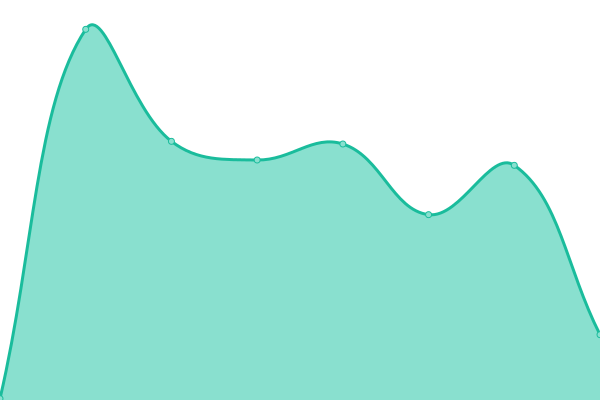 282ms
     
 | 

<a href="https://PatLittle.github.io/Consultations-Tracker/history/consultation-on-pyroxsulam-proposed-maximum-residue-limit-pmrl-2024-02">100.00%</a>
    

|  [Share your views: Draft guidance on how to interpret ‘significant change’ of a medical device](https://www.canada.ca/en/health-canada/programs/draft-guidance-how-to-interpret-significant-change-medical-device.html) | 🟩 Up | [share-your-views-draft-guidance-on-how-to-interpret-significant-change-of-a-medical-device.yml](https://github.com/PatLittle/Consultations-Tracker/commits/HEAD/history/share-your-views-draft-guidance-on-how-to-interpret-significant-change-of-a-medical-device.yml) | 

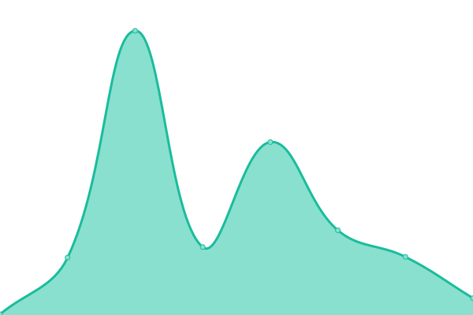 158ms
     
 | 

<a href="https://PatLittle.github.io/Consultations-Tracker/history/share-your-views-draft-guidance-on-how-to-interpret-significant-change-of-a-medical-device">100.00%</a>
    

|  [Share your views: How to demonstrate foreign building compliance with drug good manufacturing practices (GUI-0080)](https://www.canada.ca/en/health-canada/programs/consultation-foreign-building-compliance-drug-good-manufacturing-practice.html) | 🟩 Up | [share-your-views-how-to-demonstrate-foreign-building-compliance-with-drug-good-manufacturing-practices-gui-0080.yml](https://github.com/PatLittle/Consultations-Tracker/commits/HEAD/history/share-your-views-how-to-demonstrate-foreign-building-compliance-with-drug-good-manufacturing-practices-gui-0080.yml) | 

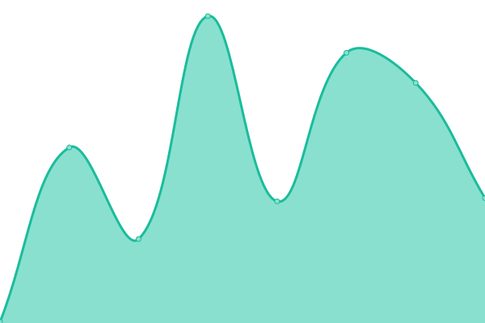 233ms
     
 | 

<a href="https://PatLittle.github.io/Consultations-Tracker/history/share-your-views-how-to-demonstrate-foreign-building-compliance-with-drug-good-manufacturing-practices-gui-0080">100.00%</a>
    

|  [Consultation: Comment period for the danger to human health or safety assessment for portable electric heaters](https://www.canada.ca/en/health-canada/programs/consultation-comment-period-danger-human-health-safety-assessment-portable-electric-heaters.html) | 🟩 Up | [consultation-comment-period-for-the-danger-to-human-health-or-safety-assessment-for-portable-electric-heaters.yml](https://github.com/PatLittle/Consultations-Tracker/commits/HEAD/history/consultation-comment-period-for-the-danger-to-human-health-or-safety-assessment-for-portable-electric-heaters.yml) | 

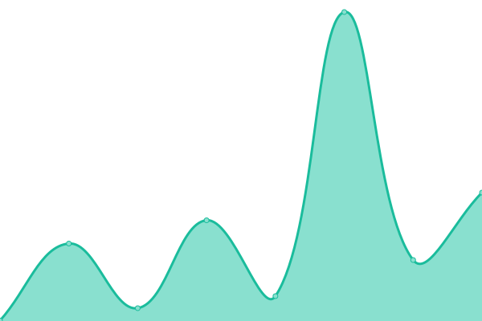 208ms
     
 | 

<a href="https://PatLittle.github.io/Consultations-Tracker/history/consultation-comment-period-for-the-danger-to-human-health-or-safety-assessment-for-portable-electric-heaters">100.00%</a>
    

|  [Consultation on the proposed re-evaluation decision of S-metolachlor and R-enantiomer and its associated end-use products, PRVD2024-01](https://www.canada.ca/en/health-canada/services/consumer-product-safety/pesticides-pest-management/public/consultations/proposed-re-evaluation-decisions/2024/s-metolachlor-r-enantiomer.html) | 🟩 Up | [consultation-on-the-proposed-re-evaluation-decision-of-s-metolachlor-and-r-enantiomer-and-its-associated-end-use-products-prvd-2024-01.yml](https://github.com/PatLittle/Consultations-Tracker/commits/HEAD/history/consultation-on-the-proposed-re-evaluation-decision-of-s-metolachlor-and-r-enantiomer-and-its-associated-end-use-products-prvd-2024-01.yml) | 

 251ms
     
 | 

<a href="https://PatLittle.github.io/Consultations-Tracker/history/consultation-on-the-proposed-re-evaluation-decision-of-s-metolachlor-and-r-enantiomer-and-its-associated-end-use-products-prvd-2024-01">100.00%</a>
    

|  [Notice of intent — Measures under consideration to modernize tobacco and vaping products information reporting requirements](https://www.canada.ca/en/health-canada/programs/consultation-measures-modernize-tobacco-vaping-products-information-reporting-requirements.html) | 🟩 Up | [notice-of-intent-measures-under-consideration-to-modernize-tobacco-and-vaping-products-information-reporting-requirements.yml](https://github.com/PatLittle/Consultations-Tracker/commits/HEAD/history/notice-of-intent-measures-under-consideration-to-modernize-tobacco-and-vaping-products-information-reporting-requirements.yml) | 

 177ms
     
 | 

<a href="https://PatLittle.github.io/Consultations-Tracker/history/notice-of-intent-measures-under-consideration-to-modernize-tobacco-and-vaping-products-information-reporting-requirements">100.00%</a>
    

|  [Consultation on spearmint oil and Biox-M, Proposed Registration Decision PRD2024-02](https://www.canada.ca/en/health-canada/services/consumer-product-safety/pesticides-pest-management/public/consultations/proposed-registration-decisions/2024/spearmint-oil-biox-m.html) | 🟩 Up | [consultation-on-spearmint-oil-and-biox-m-proposed-registration-decision-prd-2024-02.yml](https://github.com/PatLittle/Consultations-Tracker/commits/HEAD/history/consultation-on-spearmint-oil-and-biox-m-proposed-registration-decision-prd-2024-02.yml) | 

 189ms
     
 | 

<a href="https://PatLittle.github.io/Consultations-Tracker/history/consultation-on-spearmint-oil-and-biox-m-proposed-registration-decision-prd-2024-02">100.00%</a>
    

|  [Consultation on natamycin and its associated end-use products, Proposed Re-evaluation Decision PRVD2024-02](https://www.canada.ca/en/health-canada/services/consumer-product-safety/pesticides-pest-management/public/consultations/proposed-re-evaluation-decisions/2024/natamycin.html) | 🟩 Up | [consultation-on-natamycin-and-its-associated-end-use-products-proposed-re-evaluation-decision-prvd-2024-02.yml](https://github.com/PatLittle/Consultations-Tracker/commits/HEAD/history/consultation-on-natamycin-and-its-associated-end-use-products-proposed-re-evaluation-decision-prvd-2024-02.yml) | 

 187ms
     
 | 

<a href="https://PatLittle.github.io/Consultations-Tracker/history/consultation-on-natamycin-and-its-associated-end-use-products-proposed-re-evaluation-decision-prvd-2024-02">100.00%</a>
    

|  [Consultation: Guidelines for Canadian drinking water quality: Operational parameters](https://www.canada.ca/en/health-canada/programs/consultation-guidelines-canadian-drinking-water-quality-operational-parameters.html) | 🟩 Up | [consultation-guidelines-for-canadian-drinking-water-quality-operational-parameters.yml](https://github.com/PatLittle/Consultations-Tracker/commits/HEAD/history/consultation-guidelines-for-canadian-drinking-water-quality-operational-parameters.yml) | 

 184ms
     
 | 

<a href="https://PatLittle.github.io/Consultations-Tracker/history/consultation-guidelines-for-canadian-drinking-water-quality-operational-parameters">100.00%</a>
    

|  [Consultation on copper (metallic) and V2 Net, Proposed Registration Decision PRD2024-03](https://www.canada.ca/en/health-canada/services/consumer-product-safety/pesticides-pest-management/public/consultations/proposed-registration-decisions/2024/copper-metallic-v2-net.html) | 🟩 Up | [consultation-on-copper-metallic-and-v2-net-proposed-registration-decision-prd-2024-03.yml](https://github.com/PatLittle/Consultations-Tracker/commits/HEAD/history/consultation-on-copper-metallic-and-v2-net-proposed-registration-decision-prd-2024-03.yml) | 

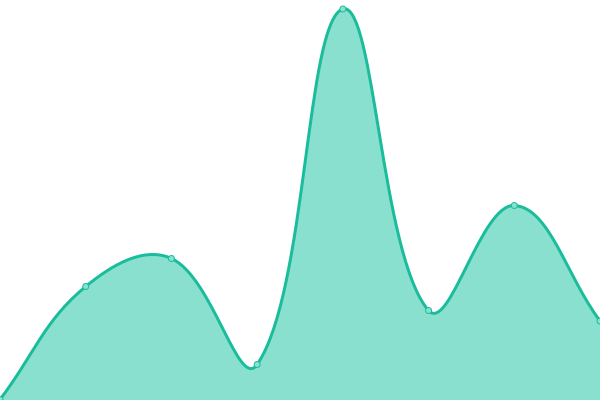 231ms
     
 | 

<a href="https://PatLittle.github.io/Consultations-Tracker/history/consultation-on-copper-metallic-and-v2-net-proposed-registration-decision-prd-2024-03">100.00%</a>
    

|  [Share your views: Updates to Guidance for Lot Release Program for Schedule D (biologic) drugs](https://www.canada.ca/en/health-canada/programs/consultation-updates-guidance-lot-release-schedule-d-drugs.html) | 🟩 Up | [share-your-views-updates-to-guidance-for-lot-release-program-for-schedule-d-biologic-drugs.yml](https://github.com/PatLittle/Consultations-Tracker/commits/HEAD/history/share-your-views-updates-to-guidance-for-lot-release-program-for-schedule-d-biologic-drugs.yml) | 

 221ms
     
 | 

<a href="https://PatLittle.github.io/Consultations-Tracker/history/share-your-views-updates-to-guidance-for-lot-release-program-for-schedule-d-biologic-drugs">100.00%</a>
    

|  [Consultation on the draft guidance for preparing veterinary abbreviated new drug submissions: Clinical and human safety requirements](https://www.canada.ca/en/health-canada/programs/consultation-draft-guidance-preparing-veterinary-abbreviated-new-drug-submissions-clinical-human-safety-requirements.html) | 🟩 Up | [consultation-on-the-draft-guidance-for-preparing-veterinary-abbreviated-new-drug-submissions-clinical-and-human-safety-requirements.yml](https://github.com/PatLittle/Consultations-Tracker/commits/HEAD/history/consultation-on-the-draft-guidance-for-preparing-veterinary-abbreviated-new-drug-submissions-clinical-and-human-safety-requirements.yml) | 

 227ms
     
 | 

<a href="https://PatLittle.github.io/Consultations-Tracker/history/consultation-on-the-draft-guidance-for-preparing-veterinary-abbreviated-new-drug-submissions-clinical-and-human-safety-requirements">100.00%</a>
    

|  [Consultation on the draft guidance for preparing veterinary drug submissions: Quality requirements](https://www.canada.ca/en/health-canada/programs/consultation-draft-guidance-preparing-veterinary-drug-submissions-quality-requirements.html) | 🟩 Up | [consultation-on-the-draft-guidance-for-preparing-veterinary-drug-submissions-quality-requirements.yml](https://github.com/PatLittle/Consultations-Tracker/commits/HEAD/history/consultation-on-the-draft-guidance-for-preparing-veterinary-drug-submissions-quality-requirements.yml) | 

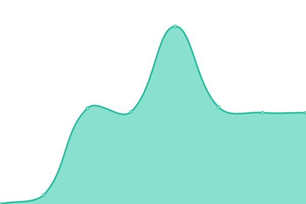 171ms
     
 | 

<a href="https://PatLittle.github.io/Consultations-Tracker/history/consultation-on-the-draft-guidance-for-preparing-veterinary-drug-submissions-quality-requirements">100.00%</a>
    

|  [Share your views: New Annex 13 to the Good manufacturing practices guide for drugs used in clinical trials (GUI-0036)](https://www.canada.ca/en/services/health/consultations/consultation-annex-13-gmp-guide-drugs-clinical-trials-0036.html) | 🟩 Up | [share-your-views-new-annex-13-to-the-good-manufacturing-practices-guide-for-drugs-used-in-clinical-trials-gui-0036.yml](https://github.com/PatLittle/Consultations-Tracker/commits/HEAD/history/share-your-views-new-annex-13-to-the-good-manufacturing-practices-guide-for-drugs-used-in-clinical-trials-gui-0036.yml) | 

 0ms
     
 | 

<a href="https://PatLittle.github.io/Consultations-Tracker/history/share-your-views-new-annex-13-to-the-good-manufacturing-practices-guide-for-drugs-used-in-clinical-trials-gui-0036">100.00%</a>
    

|  [Notice: Consultation on the Framework for Pesticide Water Monitoring Programs in Canada](https://www.canada.ca/en/health-canada/services/consumer-product-safety/pesticides-pest-management/public/consultations/framework-pesticide-water-monitoring-programs.html) | 🟩 Up | [notice-consultation-on-the-framework-for-pesticide-water-monitoring-programs-in-canada.yml](https://github.com/PatLittle/Consultations-Tracker/commits/HEAD/history/notice-consultation-on-the-framework-for-pesticide-water-monitoring-programs-in-canada.yml) | 

 0ms
     
 | 

<a href="https://PatLittle.github.io/Consultations-Tracker/history/notice-consultation-on-the-framework-for-pesticide-water-monitoring-programs-in-canada">100.00%</a>
    

|  [Share your thoughts: Foods derived from somatic cell nuclear transfer clones and their offspring policy update](https://www.canada.ca/en/health-canada/programs/consulation-food-derived-somatic-cell-nuclear-transfer-clones-offspring-policy-update.html) | 🟩 Up | [share-your-thoughts-foods-derived-from-somatic-cell-nuclear-transfer-clones-and-their-offspring-policy-update.yml](https://github.com/PatLittle/Consultations-Tracker/commits/HEAD/history/share-your-thoughts-foods-derived-from-somatic-cell-nuclear-transfer-clones-and-their-offspring-policy-update.yml) | 

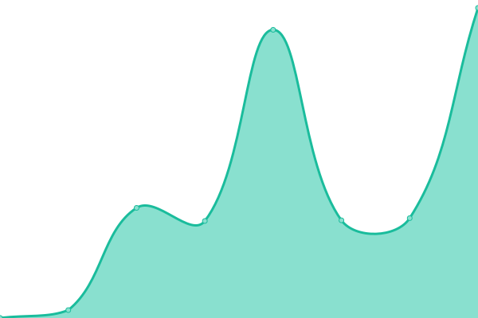 190ms
     
 | 

<a href="https://PatLittle.github.io/Consultations-Tracker/history/share-your-thoughts-foods-derived-from-somatic-cell-nuclear-transfer-clones-and-their-offspring-policy-update">100.00%</a>
    

|  [Consultation on methyl bromide and its associated end-use products, Proposed Re-evaluation Decision PRVD2024-03](https://www.canada.ca/en/health-canada/services/consumer-product-safety/pesticides-pest-management/public/consultations/proposed-re-evaluation-decisions/2024/methyl-bromide.html) | 🟩 Up | [consultation-on-methyl-bromide-and-its-associated-end-use-products-proposed-re-evaluation-decision-prvd-2024-03.yml](https://github.com/PatLittle/Consultations-Tracker/commits/HEAD/history/consultation-on-methyl-bromide-and-its-associated-end-use-products-proposed-re-evaluation-decision-prvd-2024-03.yml) | 

 218ms
     
 | 

<a href="https://PatLittle.github.io/Consultations-Tracker/history/consultation-on-methyl-bromide-and-its-associated-end-use-products-proposed-re-evaluation-decision-prvd-2024-03">100.00%</a>
    

|  [Consultation on the proposed special review decision of methyl bromide and its associated end-use products, PSRD2024-01](https://www.canada.ca/en/health-canada/services/consumer-product-safety/pesticides-pest-management/public/consultations/proposed-special-review-decision/2024/methyl-bromide.html) | 🟩 Up | [consultation-on-the-proposed-special-review-decision-of-methyl-bromide-and-its-associated-end-use-products-psrd-2024-01.yml](https://github.com/PatLittle/Consultations-Tracker/commits/HEAD/history/consultation-on-the-proposed-special-review-decision-of-methyl-bromide-and-its-associated-end-use-products-psrd-2024-01.yml) | 

 253ms
     
 | 

<a href="https://PatLittle.github.io/Consultations-Tracker/history/consultation-on-the-proposed-special-review-decision-of-methyl-bromide-and-its-associated-end-use-products-psrd-2024-01">100.00%</a>
    

|  [Consultation on foramsulfuron and its associated end-use products, Proposed Re-evaluation Decision PRVD2024-04](https://www.canada.ca/en/health-canada/services/consumer-product-safety/pesticides-pest-management/public/consultations/proposed-re-evaluation-decisions/2024/foramsulfuron.html) | 🟩 Up | [consultation-on-foramsulfuron-and-its-associated-end-use-products-proposed-re-evaluation-decision-prvd-2024-04.yml](https://github.com/PatLittle/Consultations-Tracker/commits/HEAD/history/consultation-on-foramsulfuron-and-its-associated-end-use-products-proposed-re-evaluation-decision-prvd-2024-04.yml) | 

 185ms
     
 | 

<a href="https://PatLittle.github.io/Consultations-Tracker/history/consultation-on-foramsulfuron-and-its-associated-end-use-products-proposed-re-evaluation-decision-prvd-2024-04">100.00%</a>
    

|  [Consultation on Extract of Swinglea glutinosa and EcoSwing Botanical Fungicide, Proposed Registration Decision PRD2024-04](https://www.canada.ca/en/health-canada/services/consumer-product-safety/pesticides-pest-management/public/consultations/proposed-registration-decisions/2024/swinglea-glutinosa-ecoswing-botanical-fungicide.html) | 🟩 Up | [consultation-on-extract-of-swinglea-glutinosa-and-eco-swing-botanical-fungicide-proposed-registration-decision-prd-2024-04.yml](https://github.com/PatLittle/Consultations-Tracker/commits/HEAD/history/consultation-on-extract-of-swinglea-glutinosa-and-eco-swing-botanical-fungicide-proposed-registration-decision-prd-2024-04.yml) | 

 168ms
     
 | 

<a href="https://PatLittle.github.io/Consultations-Tracker/history/consultation-on-extract-of-swinglea-glutinosa-and-eco-swing-botanical-fungicide-proposed-registration-decision-prd-2024-04">100.00%</a>
    

|  [Regulations Amending the Immigration and Refugee Protection Regulations (Temporary Foreign Workers)]( https://gazette.gc.ca/rp-pr/p1/2021/2021-07-10/html/reg2-eng.html) | 🟥 Down | [regulations-amending-the-immigration-and-refugee-protection-regulations-temporary-foreign-workers.yml](https://github.com/PatLittle/Consultations-Tracker/commits/HEAD/history/regulations-amending-the-immigration-and-refugee-protection-regulations-temporary-foreign-workers.yml) | 

 0ms
     
 | 

<a href="https://PatLittle.github.io/Consultations-Tracker/history/regulations-amending-the-immigration-and-refugee-protection-regulations-temporary-foreign-workers">100.00%</a>
    

|  [An immigration system for Canada’s future](https://www.canada.ca/en/immigration-refugees-citizenship/campaigns/canada-future-immigration-system.html) | 🟩 Up | [an-immigration-system-for-canada-s-future.yml](https://github.com/PatLittle/Consultations-Tracker/commits/HEAD/history/an-immigration-system-for-canada-s-future.yml) | 

 172ms
     
 | 

<a href="https://PatLittle.github.io/Consultations-Tracker/history/an-immigration-system-for-canada-s-future">100.00%</a>
    

|  [Public NoticeCrown Mountain Coking Coal ProjectPublic Comments Invited on the Summary of the Environmental Impact Statement](https://iaac-aeic.gc.ca/050/evaluations/document/155068?culture=en-CA) | 🟩 Up | [public-notice-crown-mountain-coking-coal-project-public-comments-invited-on-the-summary-of-the-environmental-impact-statement.yml](https://github.com/PatLittle/Consultations-Tracker/commits/HEAD/history/public-notice-crown-mountain-coking-coal-project-public-comments-invited-on-the-summary-of-the-environmental-impact-statement.yml) | 

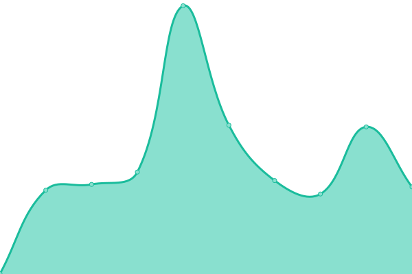 487ms
     
 | 

<a href="https://PatLittle.github.io/Consultations-Tracker/history/public-notice-crown-mountain-coking-coal-project-public-comments-invited-on-the-summary-of-the-environmental-impact-statement">100.00%</a>
    

|  [De Havilland Field ProjectComments Invited on the Summary of the Initial Project Description](Public Notice - Comments Invited on the Summary of the Initial Project Description (iaac-aeic.gc.ca)) | 🟥 Down | [de-havilland-field-project-comments-invited-on-the-summary-of-the-initial-project-description.yml](https://github.com/PatLittle/Consultations-Tracker/commits/HEAD/history/de-havilland-field-project-comments-invited-on-the-summary-of-the-initial-project-description.yml) | 

 0ms
     
 | 

<a href="https://PatLittle.github.io/Consultations-Tracker/history/de-havilland-field-project-comments-invited-on-the-summary-of-the-initial-project-description">100.00%</a>
    

|  [Aspen Power Station Project -Participant Funding Available](Public Notice - Participant Funding Available (iaac-aeic.gc.ca)) | 🟥 Down | [aspen-power-station-project-participant-funding-available.yml](https://github.com/PatLittle/Consultations-Tracker/commits/HEAD/history/aspen-power-station-project-participant-funding-available.yml) | 

 0ms
     
 | 

<a href="https://PatLittle.github.io/Consultations-Tracker/history/aspen-power-station-project-participant-funding-available">100.00%</a>
    

|  [Aspen Power Station Project - Comments Invited on the Summary of the Initial Project Description](Public NoticeComments Invited on the Summary of the Initial Project Description (iaac-aeic.gc.ca)) | 🟥 Down | [aspen-power-station-project-comments-invited-on-the-summary-of-the-initial-project-description.yml](https://github.com/PatLittle/Consultations-Tracker/commits/HEAD/history/aspen-power-station-project-comments-invited-on-the-summary-of-the-initial-project-description.yml) | 

 0ms
     
 | 

<a href="https://PatLittle.github.io/Consultations-Tracker/history/aspen-power-station-project-comments-invited-on-the-summary-of-the-initial-project-description">100.00%</a>
    

|  [Public NoticeNew Nain Airport ProjectPublic Comments Invited on the Summary of the Initial Project Description](https://iaac-aeic.gc.ca/050/evaluations/document/154770?culture=en-CA) | 🟩 Up | [public-notice-new-nain-airport-project-public-comments-invited-on-the-summary-of-the-initial-project-description.yml](https://github.com/PatLittle/Consultations-Tracker/commits/HEAD/history/public-notice-new-nain-airport-project-public-comments-invited-on-the-summary-of-the-initial-project-description.yml) | 

 355ms
     
 | 

<a href="https://PatLittle.github.io/Consultations-Tracker/history/public-notice-new-nain-airport-project-public-comments-invited-on-the-summary-of-the-initial-project-description">100.00%</a>
    

|  [Public NoticeNew Nain Airport ProjectParticipant Funding Available](https://iaac-aeic.gc.ca/050/evaluations/document/154829?culture=en-CA) | 🟩 Up | [public-notice-new-nain-airport-project-participant-funding-available.yml](https://github.com/PatLittle/Consultations-Tracker/commits/HEAD/history/public-notice-new-nain-airport-project-participant-funding-available.yml) | 

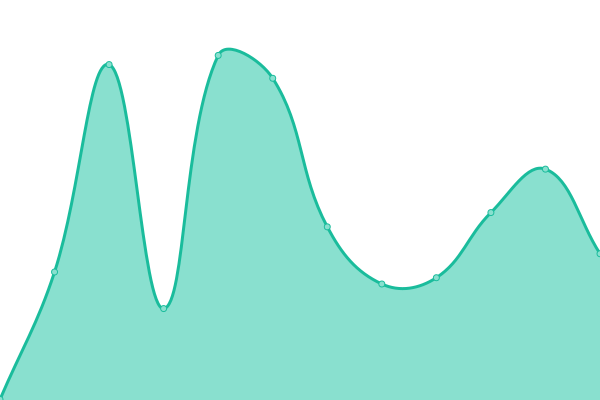 337ms
     
 | 

<a href="https://PatLittle.github.io/Consultations-Tracker/history/public-notice-new-nain-airport-project-participant-funding-available">100.00%</a>
    

|  [Indian Oil and Gas Regulations - Phase II](http://www.pgic-iogc.gc.ca/eng/1471964522302/1471964567990) | 🟩 Up | [indian-oil-and-gas-regulations-phase-ii.yml](https://github.com/PatLittle/Consultations-Tracker/commits/HEAD/history/indian-oil-and-gas-regulations-phase-ii.yml) | 

 963ms
     
 | 

<a href="https://PatLittle.github.io/Consultations-Tracker/history/indian-oil-and-gas-regulations-phase-ii">100.00%</a>
    

|  [Indigenous Procurement Modernization (including Procurement Strategy for Aboriginal Business)](https://www.aadnc-aandc.gc.ca/eng/1554218527634/1554218554486) | 🟩 Up | [indigenous-procurement-modernization-including-procurement-strategy-for-aboriginal-business.yml](https://github.com/PatLittle/Consultations-Tracker/commits/HEAD/history/indigenous-procurement-modernization-including-procurement-strategy-for-aboriginal-business.yml) | 

 439ms
     
 | 

<a href="https://PatLittle.github.io/Consultations-Tracker/history/indigenous-procurement-modernization-including-procurement-strategy-for-aboriginal-business">100.00%</a>
    

|  [Developing laws and regulations for First Nations drinking water and wastewater: engagement 2022/2023](Developing laws and regulations for First Nations drinking water and wastewaterengagement 2022/2023 (sac-isc.gc.ca)) | 🟥 Down | [developing-laws-and-regulations-for-first-nations-drinking-water-and-wastewater-engagement-2022-2023.yml](https://github.com/PatLittle/Consultations-Tracker/commits/HEAD/history/developing-laws-and-regulations-for-first-nations-drinking-water-and-wastewater-engagement-2022-2023.yml) | 

 0ms
     
 | 

<a href="https://PatLittle.github.io/Consultations-Tracker/history/developing-laws-and-regulations-for-first-nations-drinking-water-and-wastewater-engagement-2022-2023">100.00%</a>
    

|  [Engagement 2023: Updating the Protocol For Centralised Drinking Water Systems in First Nations communities](https://www.sac-isc.gc.ca/eng/1689939603075/1689939693020) | 🟩 Up | [engagement-2023-updating-the-protocol-for-centralised-drinking-water-systems-in-first-nations-communities.yml](https://github.com/PatLittle/Consultations-Tracker/commits/HEAD/history/engagement-2023-updating-the-protocol-for-centralised-drinking-water-systems-in-first-nations-communities.yml) | 

 0ms
     
 | 

<a href="https://PatLittle.github.io/Consultations-Tracker/history/engagement-2023-updating-the-protocol-for-centralised-drinking-water-systems-in-first-nations-communities">100.00%</a>
    

|  [National Infrastructure Assessment](https://www.infrastructure.gc.ca/nia-eni/index-eng.html) | 🟩 Up | [national-infrastructure-assessment.yml](https://github.com/PatLittle/Consultations-Tracker/commits/HEAD/history/national-infrastructure-assessment.yml) | 

 374ms
     
 | 

<a href="https://PatLittle.github.io/Consultations-Tracker/history/national-infrastructure-assessment">100.00%</a>
    

|  [Competition Bureau invites feedback on changes to the Textile Labelling and Advertising Regulations](https://www.ic.gc.ca/eic/site/cb-bc.nsf/eng/h_00142.html) | 🟩 Up | [competition-bureau-invites-feedback-on-changes-to-the-textile-labelling-and-advertising-regulations.yml](https://github.com/PatLittle/Consultations-Tracker/commits/HEAD/history/competition-bureau-invites-feedback-on-changes-to-the-textile-labelling-and-advertising-regulations.yml) | 

 1955ms
     
 | 

<a href="https://PatLittle.github.io/Consultations-Tracker/history/competition-bureau-invites-feedback-on-changes-to-the-textile-labelling-and-advertising-regulations">100.00%</a>
    

|  [Canada Gazette, Part I: Public Consultations on proposed changes to the Patent Rules and Trademark Regulations in regards to the creation of the College of Patent Agents and Trademark Agents , as part of Budget Implementation Act, 2018, No. 2.   ](Not yet available) | 🟥 Down | [canada-gazette-part-i-public-consultations-on-proposed-changes-to-the-patent-rules-and-trademark-regulations-in-regards-to-the-creation-of-the-college-of-patent-agents-and-trademark-agents-as-part-of-budget-implementation-act-2018-no-2.yml](https://github.com/PatLittle/Consultations-Tracker/commits/HEAD/history/canada-gazette-part-i-public-consultations-on-proposed-changes-to-the-patent-rules-and-trademark-regulations-in-regards-to-the-creation-of-the-college-of-patent-agents-and-trademark-agents-as-part-of-budget-implementation-act-2018-no-2.yml) | 

 0ms
     
 | 

<a href="https://PatLittle.github.io/Consultations-Tracker/history/canada-gazette-part-i-public-consultations-on-proposed-changes-to-the-patent-rules-and-trademark-regulations-in-regards-to-the-creation-of-the-college-of-patent-agents-and-trademark-agents-as-part-of-budget-implementation-act-2018-no-2">100.00%</a>
    

|  [Form 60.1, Request for Withdrawal of Mediation, Form 80.1, Notice of Withdrawal of the Opposition to Discharge of Bankrupt, and Proposed Amendments to Forms 62, Notice of Cancellation of Mediation, and Form 84, Certificate of Discharge](https://ised-isde.canada.ca/site/office-superintendent-bankruptcy/en/public-consultations) | 🟩 Up | [form-60-1-request-for-withdrawal-of-mediation-form-80-1-notice-of-withdrawal-of-the-opposition-to-discharge-of-bankrupt-and-proposed-amendments-to-forms-62-notice-of-cancellation-of-mediation-and-form-84-certificate-of-discharge.yml](https://github.com/PatLittle/Consultations-Tracker/commits/HEAD/history/form-60-1-request-for-withdrawal-of-mediation-form-80-1-notice-of-withdrawal-of-the-opposition-to-discharge-of-bankrupt-and-proposed-amendments-to-forms-62-notice-of-cancellation-of-mediation-and-form-84-certificate-of-discharge.yml) | 

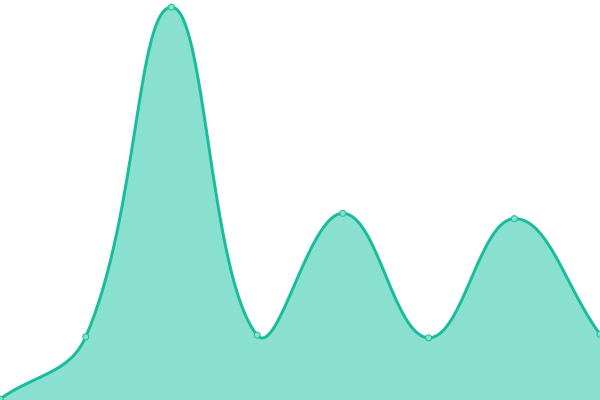 128ms
     
 | 

<a href="https://PatLittle.github.io/Consultations-Tracker/history/form-60-1-request-for-withdrawal-of-mediation-form-80-1-notice-of-withdrawal-of-the-opposition-to-discharge-of-bankrupt-and-proposed-amendments-to-forms-62-notice-of-cancellation-of-mediation-and-form-84-certificate-of-discharge">100.00%</a>
    

|  [Amendements to Directive No 11R3, Surplus Income Directive](https://ised-isde.canada.ca/site/office-superintendent-bankruptcy/en/public-consultations) | 🟩 Up | [amendements-to-directive-no-11-r3-surplus-income-directive.yml](https://github.com/PatLittle/Consultations-Tracker/commits/HEAD/history/amendements-to-directive-no-11-r3-surplus-income-directive.yml) | 

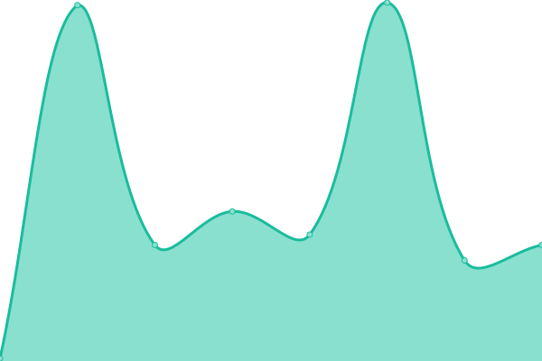 91ms
     
 | 

<a href="https://PatLittle.github.io/Consultations-Tracker/history/amendements-to-directive-no-11-r3-surplus-income-directive">100.00%</a>
    

|  [Proposed Amendments to Directive No 23, Publication in Local Newspaper](https://ised-isde.canada.ca/site/office-superintendent-bankruptcy/en/public-consultations) | 🟩 Up | [proposed-amendments-to-directive-no-23-publication-in-local-newspaper.yml](https://github.com/PatLittle/Consultations-Tracker/commits/HEAD/history/proposed-amendments-to-directive-no-23-publication-in-local-newspaper.yml) | 

 0ms
     
 | 

<a href="https://PatLittle.github.io/Consultations-Tracker/history/proposed-amendments-to-directive-no-23-publication-in-local-newspaper">100.00%</a>
    

|  [Indigenous Advisory Circle](https://library-archives.canada.ca/eng/corporate/about-us/our-partners/Pages/indigenous-advisory-circle.aspx) | 🟩 Up | [indigenous-advisory-circle.yml](https://github.com/PatLittle/Consultations-Tracker/commits/HEAD/history/indigenous-advisory-circle.yml) | 

 559ms
     
 | 

<a href="https://PatLittle.github.io/Consultations-Tracker/history/indigenous-advisory-circle">100.00%</a>
    

|  [Stakeholders' Forum ](https://library-archives.canada.ca/eng/corporate/about-us/our-partners/pages/stakeholders-forum.aspx) | 🟩 Up | [stakeholders-forum.yml](https://github.com/PatLittle/Consultations-Tracker/commits/HEAD/history/stakeholders-forum.yml) | 

 344ms
     
 | 

<a href="https://PatLittle.github.io/Consultations-Tracker/history/stakeholders-forum">100.00%</a>
    

|  [Services Consultation Committee](https://library-archives.canada.ca/eng/corporate/about-us/our-partners/Pages/services-consultation-group.aspx) | 🟩 Up | [services-consultation-committee.yml](https://github.com/PatLittle/Consultations-Tracker/commits/HEAD/history/services-consultation-committee.yml) | 

 392ms
     
 | 

<a href="https://PatLittle.github.io/Consultations-Tracker/history/services-consultation-committee">100.00%</a>
    

|  [Youth Advisory Council](https://library-archives.canada.ca/eng/corporate/about-us/our-partners/Pages/youth-advisory-council.aspx) | 🟩 Up | [youth-advisory-council.yml](https://github.com/PatLittle/Consultations-Tracker/commits/HEAD/history/youth-advisory-council.yml) | 

 344ms
     
 | 

<a href="https://PatLittle.github.io/Consultations-Tracker/history/youth-advisory-council">100.00%</a>
    

|  [Consultation to inform the regulatory development to support the implementation of An Act to amend the National Defence Act and to make related and consequential amendments to other Acts](https://www.canada.ca/en/department-national-defence/services/benefits-military/legal-services/victim-service-offence.html) | 🟩 Up | [consultation-to-inform-the-regulatory-development-to-support-the-implementation-of-an-act-to-amend-the-national-defence-act-and-to-make-related-and-consequential-amendments-to-other-acts.yml](https://github.com/PatLittle/Consultations-Tracker/commits/HEAD/history/consultation-to-inform-the-regulatory-development-to-support-the-implementation-of-an-act-to-amend-the-national-defence-act-and-to-make-related-and-consequential-amendments-to-other-acts.yml) | 

 117ms
     
 | 

<a href="https://PatLittle.github.io/Consultations-Tracker/history/consultation-to-inform-the-regulatory-development-to-support-the-implementation-of-an-act-to-amend-the-national-defence-act-and-to-make-related-and-consequential-amendments-to-other-acts">100.00%</a>
    

|  [Consultation to inform the regulatory development to support the implementation of An Act to amend the National Defence Act and to make related and consequential amendments to other Acts](https://www.canada.ca/en/department-national-defence/services/benefits-military/legal-services/victim-service-offence.html) | 🟩 Up | [consultation-to-inform-the-regulatory-development-to-support-the-implementation-of-an-act-to-amend-the-national-defence-act-and-to-make-related-and-consequential-amendments-to-other-acts.yml](https://github.com/PatLittle/Consultations-Tracker/commits/HEAD/history/consultation-to-inform-the-regulatory-development-to-support-the-implementation-of-an-act-to-amend-the-national-defence-act-and-to-make-related-and-consequential-amendments-to-other-acts.yml) | 

 117ms
     
 | 

<a href="https://PatLittle.github.io/Consultations-Tracker/history/consultation-to-inform-the-regulatory-development-to-support-the-implementation-of-an-act-to-amend-the-national-defence-act-and-to-make-related-and-consequential-amendments-to-other-acts">100.00%</a>
    

|  [Social systems professional services](www.marsdd.com) | 🟩 Up | [social-systems-professional-services.yml](https://github.com/PatLittle/Consultations-Tracker/commits/HEAD/history/social-systems-professional-services.yml) | 

 306ms
     
 | 

<a href="https://PatLittle.github.io/Consultations-Tracker/history/social-systems-professional-services">100.00%</a>
    

|  [The Offshore Renewable Energy Regulations Initiative](https://www.rncanengagenrcan.ca/en/collections/offshore-renewable-energy-regulations-initiative) | 🟩 Up | [the-offshore-renewable-energy-regulations-initiative.yml](https://github.com/PatLittle/Consultations-Tracker/commits/HEAD/history/the-offshore-renewable-energy-regulations-initiative.yml) | 

 506ms
     
 | 

<a href="https://PatLittle.github.io/Consultations-Tracker/history/the-offshore-renewable-energy-regulations-initiative">100.00%</a>
    

|  [Indigenous Ministerial Arrangements Regulations](https://www.rncanengagenrcan.ca/en/content/development-new-indigenous-ministerial-arrangements-regulations) | 🟩 Up | [indigenous-ministerial-arrangements-regulations.yml](https://github.com/PatLittle/Consultations-Tracker/commits/HEAD/history/indigenous-ministerial-arrangements-regulations.yml) | 

 115ms
     
 | 

<a href="https://PatLittle.github.io/Consultations-Tracker/history/indigenous-ministerial-arrangements-regulations">95.35%</a>
    

|  [General Regulations under the Canada National Marine Conservation Areas Act](https://www.letstalknmcas.ca/) | 🟩 Up | [general-regulations-under-the-canada-national-marine-conservation-areas-act.yml](https://github.com/PatLittle/Consultations-Tracker/commits/HEAD/history/general-regulations-under-the-canada-national-marine-conservation-areas-act.yml) | 

 830ms
     
 | 

<a href="https://PatLittle.github.io/Consultations-Tracker/history/general-regulations-under-the-canada-national-marine-conservation-areas-act">100.00%</a>
    

|  [Notice of Mooring Restrictions – Ontario Waterways - Trent-Severn Waterway National Historic Site](https://parks.canada.ca/lhn-nhs/on/trentsevern/info/avis-restrictions-amarrage-notice-mooring-restrictions/ ) | 🟥 Down | [notice-of-mooring-restrictions-ontario-waterways-trent-severn-waterway-national-historic-site.yml](https://github.com/PatLittle/Consultations-Tracker/commits/HEAD/history/notice-of-mooring-restrictions-ontario-waterways-trent-severn-waterway-national-historic-site.yml) | 

 0ms
     
 | 

<a href="https://PatLittle.github.io/Consultations-Tracker/history/notice-of-mooring-restrictions-ontario-waterways-trent-severn-waterway-national-historic-site">100.00%</a>
    

|  [Notice of Mooring Restrictions – Ontario Waterways - Rideau Canal National Historic Site](https://parks.canada.ca/lhn-nhs/on/rideau/info/avis-restrictions-amarrage-notice-mooring-restrictions/) | 🟩 Up | [notice-of-mooring-restrictions-ontario-waterways-rideau-canal-national-historic-site.yml](https://github.com/PatLittle/Consultations-Tracker/commits/HEAD/history/notice-of-mooring-restrictions-ontario-waterways-rideau-canal-national-historic-site.yml) | 

 715ms
     
 | 

<a href="https://PatLittle.github.io/Consultations-Tracker/history/notice-of-mooring-restrictions-ontario-waterways-rideau-canal-national-historic-site">100.00%</a>
    

|  [Public consultation on the draft management plan for the Gulf of Georgia Cannery National Historic Site](https://parks.canada.ca/lhn-nhs/bc/georgia/plan/plan1/gestion-management) | 🟩 Up | [public-consultation-on-the-draft-management-plan-for-the-gulf-of-georgia-cannery-national-historic-site.yml](https://github.com/PatLittle/Consultations-Tracker/commits/HEAD/history/public-consultation-on-the-draft-management-plan-for-the-gulf-of-georgia-cannery-national-historic-site.yml) | 

 386ms
     
 | 

<a href="https://PatLittle.github.io/Consultations-Tracker/history/public-consultation-on-the-draft-management-plan-for-the-gulf-of-georgia-cannery-national-historic-site">100.00%</a>
    

|  [Thaidene Nene National Park Reserve and Thaidene Nëné Indigenous Protected Area Relationship (Management) Plan](https://parks.canada.ca/pn-np/nt/thaidene-nene/info/plan) | 🟩 Up | [thaidene-nene-national-park-reserve-and-thaidene-nene-indigenous-protected-area-relationship-management-plan.yml](https://github.com/PatLittle/Consultations-Tracker/commits/HEAD/history/thaidene-nene-national-park-reserve-and-thaidene-nene-indigenous-protected-area-relationship-management-plan.yml) | 

 657ms
     
 | 

<a href="https://PatLittle.github.io/Consultations-Tracker/history/thaidene-nene-national-park-reserve-and-thaidene-nene-indigenous-protected-area-relationship-management-plan">100.00%</a>
    

|  [National Risk Profile (NRP) Targeted Engagement](https://www.canada.ca/en/services/policing/emergencies/targeted-engagement-nrp.html) | 🟩 Up | [national-risk-profile-nrp-targeted-engagement.yml](https://github.com/PatLittle/Consultations-Tracker/commits/HEAD/history/national-risk-profile-nrp-targeted-engagement.yml) | 

 426ms
     
 | 

<a href="https://PatLittle.github.io/Consultations-Tracker/history/national-risk-profile-nrp-targeted-engagement">100.00%</a>
    

|  [Consultations on Foreign Interference](https://www.canada.ca/en/services/defence/nationalsecurity/consulting-canadians-countering-foreign-interference.html) | 🟩 Up | [consultations-on-foreign-interference.yml](https://github.com/PatLittle/Consultations-Tracker/commits/HEAD/history/consultations-on-foreign-interference.yml) | 

 219ms
     
 | 

<a href="https://PatLittle.github.io/Consultations-Tracker/history/consultations-on-foreign-interference">100.00%</a>
    

|  [PSPC Controlled Goods Program’s Industry Engagement Committee (IEC) ](https://www.tpsgc-pwgsc.gc.ca/pmc-cgp/pipmc-secgp-eng.html) | 🟩 Up | [pspc-controlled-goods-program-s-industry-engagement-committee-iec.yml](https://github.com/PatLittle/Consultations-Tracker/commits/HEAD/history/pspc-controlled-goods-program-s-industry-engagement-committee-iec.yml) | 

 379ms
     
 | 

<a href="https://PatLittle.github.io/Consultations-Tracker/history/pspc-controlled-goods-program-s-industry-engagement-committee-iec">100.00%</a>
    

|  [Providing green energy services to buildings in the National Capital Region (NCR) beyond the Federal Government Portfolio](https://www.tpsgc-pwgsc.gc.ca/trans/documentinfo-briefingmaterial/proc/2020_02_27/p15-eng.html#a3) | 🟩 Up | [providing-green-energy-services-to-buildings-in-the-national-capital-region-ncr-beyond-the-federal-government-portfolio.yml](https://github.com/PatLittle/Consultations-Tracker/commits/HEAD/history/providing-green-energy-services-to-buildings-in-the-national-capital-region-ncr-beyond-the-federal-government-portfolio.yml) | 

 0ms
     
 | 

<a href="https://PatLittle.github.io/Consultations-Tracker/history/providing-green-energy-services-to-buildings-in-the-national-capital-region-ncr-beyond-the-federal-government-portfolio">100.00%</a>
    

|  [Three-year Departmental Accessibility Plan](na) | 🟥 Down | [three-year-departmental-accessibility-plan.yml](https://github.com/PatLittle/Consultations-Tracker/commits/HEAD/history/three-year-departmental-accessibility-plan.yml) | 

 0ms
     
 | 

<a href="https://PatLittle.github.io/Consultations-Tracker/history/three-year-departmental-accessibility-plan">100.00%</a>
    

|  [Alexandra Bridge Replacement Project](https://ncc-ccn.gc.ca/projects/alexandra-bridge-replacement#) | 🟩 Up | [alexandra-bridge-replacement-project.yml](https://github.com/PatLittle/Consultations-Tracker/commits/HEAD/history/alexandra-bridge-replacement-project.yml) | 

 443ms
     
 | 

<a href="https://PatLittle.github.io/Consultations-Tracker/history/alexandra-bridge-replacement-project">100.00%</a>
    

|  [Multifactor Productivity Application](https://www.statcan.gc.ca/eng/consultation/2019/mpa ) | 🟥 Down | [multifactor-productivity-application.yml](https://github.com/PatLittle/Consultations-Tracker/commits/HEAD/history/multifactor-productivity-application.yml) | 

 0ms
     
 | 

<a href="https://PatLittle.github.io/Consultations-Tracker/history/multifactor-productivity-application">100.00%</a>
    

|  [Statistics Canada Client Survey 2022](https://www.statcan.gc.ca/en/consultation/2022/sccs2022) | 🟩 Up | [statistics-canada-client-survey-2022.yml](https://github.com/PatLittle/Consultations-Tracker/commits/HEAD/history/statistics-canada-client-survey-2022.yml) | 

 306ms
     
 | 

<a href="https://PatLittle.github.io/Consultations-Tracker/history/statistics-canada-client-survey-2022">100.00%</a>
    

|  [Census of the Environment Program](https://www.statcan.gc.ca/en/consultation/2022/coep) | 🟩 Up | [census-of-the-environment-program.yml](https://github.com/PatLittle/Consultations-Tracker/commits/HEAD/history/census-of-the-environment-program.yml) | 

 111ms
     
 | 

<a href="https://PatLittle.github.io/Consultations-Tracker/history/census-of-the-environment-program">100.00%</a>
    

|  [Missing persons data standards consultative engagement](https://www.statcan.gc.ca/en/consultation/2023/missing-persons-data-standards) | 🟩 Up | [missing-persons-data-standards-consultative-engagement.yml](https://github.com/PatLittle/Consultations-Tracker/commits/HEAD/history/missing-persons-data-standards-consultative-engagement.yml) | 

 108ms
     
 | 

<a href="https://PatLittle.github.io/Consultations-Tracker/history/missing-persons-data-standards-consultative-engagement">100.00%</a>
    

|  [Statistics Canada's data products consultative engagement](https://www.statcan.gc.ca/en/consultation/2023/stdp) | 🟩 Up | [statistics-canada-s-data-products-consultative-engagement.yml](https://github.com/PatLittle/Consultations-Tracker/commits/HEAD/history/statistics-canada-s-data-products-consultative-engagement.yml) | 

 79ms
     
 | 

<a href="https://PatLittle.github.io/Consultations-Tracker/history/statistics-canada-s-data-products-consultative-engagement">100.00%</a>
    

|  [Census Data on Demand (CDOD) program consultative engagement](https://www.statcan.gc.ca/en/consultation/2023/census-data-on-demand ) | 🟥 Down | [census-data-on-demand-cdod-program-consultative-engagement.yml](https://github.com/PatLittle/Consultations-Tracker/commits/HEAD/history/census-data-on-demand-cdod-program-consultative-engagement.yml) | 

 0ms
     
 | 

<a href="https://PatLittle.github.io/Consultations-Tracker/history/census-data-on-demand-cdod-program-consultative-engagement">100.00%</a>
    

|  [Invitation to participate in the revision of the North American Industry Classification System (NAICS) Canada](https://www.statcan.gc.ca/en/consultation/2023/naics) | 🟩 Up | [invitation-to-participate-in-the-revision-of-the-north-american-industry-classification-system-naics-canada.yml](https://github.com/PatLittle/Consultations-Tracker/commits/HEAD/history/invitation-to-participate-in-the-revision-of-the-north-american-industry-classification-system-naics-canada.yml) | 

 0ms
     
 | 

<a href="https://PatLittle.github.io/Consultations-Tracker/history/invitation-to-participate-in-the-revision-of-the-north-american-industry-classification-system-naics-canada">100.00%</a>
    

|  [Invitation to participate in the revision of the North American Product Classification System (NAPCS) Canada](https://www.statcan.gc.ca/en/consultation/2023/napcs) | 🟩 Up | [invitation-to-participate-in-the-revision-of-the-north-american-product-classification-system-napcs-canada.yml](https://github.com/PatLittle/Consultations-Tracker/commits/HEAD/history/invitation-to-participate-in-the-revision-of-the-north-american-product-classification-system-napcs-canada.yml) | 

 0ms
     
 | 

<a href="https://PatLittle.github.io/Consultations-Tracker/history/invitation-to-participate-in-the-revision-of-the-north-american-product-classification-system-napcs-canada">100.00%</a>
    

|  [Market Basket Measure of poverty (2023-base) consultative engagement](https://www.statcan.gc.ca/en/consultation/2023/mbm-poverty) | 🟩 Up | [market-basket-measure-of-poverty-2023-base-consultative-engagement.yml](https://github.com/PatLittle/Consultations-Tracker/commits/HEAD/history/market-basket-measure-of-poverty-2023-base-consultative-engagement.yml) | 

 82ms
     
 | 

<a href="https://PatLittle.github.io/Consultations-Tracker/history/market-basket-measure-of-poverty-2023-base-consultative-engagement">100.00%</a>
    

|  [Statistics Canada's data products consultative engagement](https://www.statcan.gc.ca/en/consultation/2023/stdp) | 🟩 Up | [statistics-canada-s-data-products-consultative-engagement.yml](https://github.com/PatLittle/Consultations-Tracker/commits/HEAD/history/statistics-canada-s-data-products-consultative-engagement.yml) | 

 79ms
     
 | 

<a href="https://PatLittle.github.io/Consultations-Tracker/history/statistics-canada-s-data-products-consultative-engagement">100.00%</a>
    

|  [Share your input on Canada’s Oral Health Statistics Program](https://www.statcan.gc.ca/en/consultation/2023/oral-health) | 🟩 Up | [share-your-input-on-canada-s-oral-health-statistics-program.yml](https://github.com/PatLittle/Consultations-Tracker/commits/HEAD/history/share-your-input-on-canada-s-oral-health-statistics-program.yml) | 

 68ms
     
 | 

<a href="https://PatLittle.github.io/Consultations-Tracker/history/share-your-input-on-canada-s-oral-health-statistics-program">100.00%</a>
    

|  [2026 Census of Population dissemination consultative engagement](https://www.statcan.gc.ca/en/consultation/2023/census-of-population2026) | 🟩 Up | [2026-census-of-population-dissemination-consultative-engagement.yml](https://github.com/PatLittle/Consultations-Tracker/commits/HEAD/history/2026-census-of-population-dissemination-consultative-engagement.yml) | 

 449ms
     
 | 

<a href="https://PatLittle.github.io/Consultations-Tracker/history/2026-census-of-population-dissemination-consultative-engagement">100.00%</a>
    

|  [Invitation to participate in a flood awareness consultative engagement](https://www.statcan.gc.ca/en/consultation/2024/flood-awareness) | 🟩 Up | [invitation-to-participate-in-a-flood-awareness-consultative-engagement.yml](https://github.com/PatLittle/Consultations-Tracker/commits/HEAD/history/invitation-to-participate-in-a-flood-awareness-consultative-engagement.yml) | 

 0ms
     
 | 

<a href="https://PatLittle.github.io/Consultations-Tracker/history/invitation-to-participate-in-a-flood-awareness-consultative-engagement">100.00%</a>
    

|  [Watchlist 2020 mid-cycle consultation with industry](	https://www.tsb.gc.ca/eng/qui-about/relation.html) | 🟥 Down | [watchlist-2020-mid-cycle-consultation-with-industry.yml](https://github.com/PatLittle/Consultations-Tracker/commits/HEAD/history/watchlist-2020-mid-cycle-consultation-with-industry.yml) | 

 0ms
     
 | 

<a href="https://PatLittle.github.io/Consultations-Tracker/history/watchlist-2020-mid-cycle-consultation-with-industry">100.00%</a>
    

|  [Oceans Protection Plan](https://www.letstalktransportation.ca/OPP) | 🟩 Up | [oceans-protection-plan.yml](https://github.com/PatLittle/Consultations-Tracker/commits/HEAD/history/oceans-protection-plan.yml) | 

 920ms
     
 | 

<a href="https://PatLittle.github.io/Consultations-Tracker/history/oceans-protection-plan">100.00%</a>
    

|  [OPP - Understanding the Cumulative Effects of Marine Vessel Activity on Coastal and Marine Environments](https://letstalktransportation.ca/understanding-the-effects-of-marine-vessel-activity-on-coastal-environments) | 🟩 Up | [opp-understanding-the-cumulative-effects-of-marine-vessel-activity-on-coastal-and-marine-environments.yml](https://github.com/PatLittle/Consultations-Tracker/commits/HEAD/history/opp-understanding-the-cumulative-effects-of-marine-vessel-activity-on-coastal-and-marine-environments.yml) | 

 371ms
     
 | 

<a href="https://PatLittle.github.io/Consultations-Tracker/history/opp-understanding-the-cumulative-effects-of-marine-vessel-activity-on-coastal-and-marine-environments">100.00%</a>
    

|  [Canadian Marine Advisory Council (CMAC)](https://www.tc.gc.ca/eng/engagement-marine-safety-security-regulations.html) | 🟩 Up | [canadian-marine-advisory-council-cmac.yml](https://github.com/PatLittle/Consultations-Tracker/commits/HEAD/history/canadian-marine-advisory-council-cmac.yml) | 

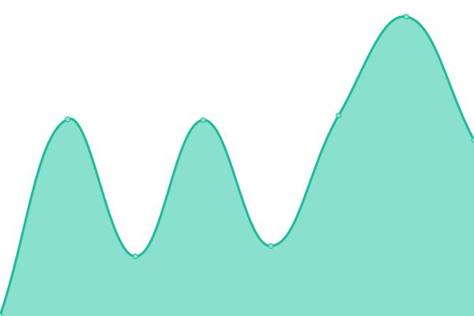 1238ms
     
 | 

<a href="https://PatLittle.github.io/Consultations-Tracker/history/canadian-marine-advisory-council-cmac">100.00%</a>
    

|  [OPP: Northern Low-Impact Shipping Corridors](https://www.dfo-mpo.gc.ca/about-notre-sujet/engagement/2021/shipping-corridors-navigation-eng.html) | 🟩 Up | [opp-northern-low-impact-shipping-corridors.yml](https://github.com/PatLittle/Consultations-Tracker/commits/HEAD/history/opp-northern-low-impact-shipping-corridors.yml) | 

 218ms
     
 | 

<a href="https://PatLittle.github.io/Consultations-Tracker/history/opp-northern-low-impact-shipping-corridors">100.00%</a>
    

|  [Options to Address Mandatory Wear of Lifejackets/Personal Floatation Devices on Pleasure Craft](https://N/A) | 🟥 Down | [options-to-address-mandatory-wear-of-lifejackets-personal-floatation-devices-on-pleasure-craft.yml](https://github.com/PatLittle/Consultations-Tracker/commits/HEAD/history/options-to-address-mandatory-wear-of-lifejackets-personal-floatation-devices-on-pleasure-craft.yml) | 

 0ms
     
 | 

<a href="https://PatLittle.github.io/Consultations-Tracker/history/options-to-address-mandatory-wear-of-lifejackets-personal-floatation-devices-on-pleasure-craft">100.00%</a>
    

|  [Let’s Talk Polar Code: Adding new vessel types to the Arctic Shipping Safety and Pollution Prevention Regulations](https://tc.canada.ca/en/corporate-services/consultations/let-s-talk-polar-code-adding-new-vessel-types-arctic-shipping-safety-pollution-prevention-regulations) | 🟩 Up | [let-s-talk-polar-code-adding-new-vessel-types-to-the-arctic-shipping-safety-and-pollution-prevention-regulations.yml](https://github.com/PatLittle/Consultations-Tracker/commits/HEAD/history/let-s-talk-polar-code-adding-new-vessel-types-to-the-arctic-shipping-safety-and-pollution-prevention-regulations.yml) | 

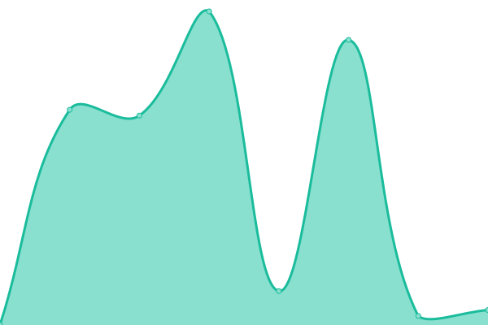 1196ms
     
 | 

<a href="https://PatLittle.github.io/Consultations-Tracker/history/let-s-talk-polar-code-adding-new-vessel-types-to-the-arctic-shipping-safety-and-pollution-prevention-regulations">100.00%</a>
    

|  [Let’s Talk Transportation: Public Interest Assessment of Bunge’s Proposed Acquisition of Viterra](https://tc.canada.ca/en/corporate-services/consultations/let-s-talk-transportation-public-interest-assessment-bunge-s-proposed-acquisition-viterra) | 🟩 Up | [let-s-talk-transportation-public-interest-assessment-of-bunge-s-proposed-acquisition-of-viterra.yml](https://github.com/PatLittle/Consultations-Tracker/commits/HEAD/history/let-s-talk-transportation-public-interest-assessment-of-bunge-s-proposed-acquisition-of-viterra.yml) | 

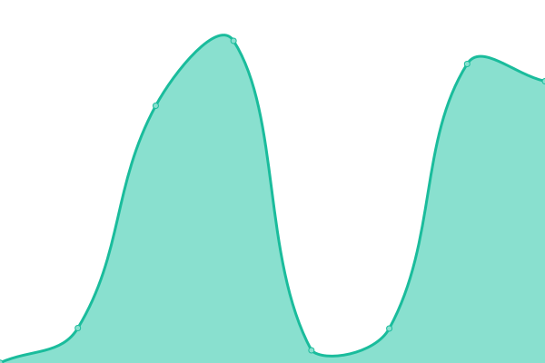 980ms
     
 | 

<a href="https://PatLittle.github.io/Consultations-Tracker/history/let-s-talk-transportation-public-interest-assessment-of-bunge-s-proposed-acquisition-of-viterra">100.00%</a>
    

|  [Updates to Canada's Vehicle Cyber Security Guidance](https://N/A) | 🟥 Down | [updates-to-canada-s-vehicle-cyber-security-guidance.yml](https://github.com/PatLittle/Consultations-Tracker/commits/HEAD/history/updates-to-canada-s-vehicle-cyber-security-guidance.yml) | 

 0ms
     
 | 

<a href="https://PatLittle.github.io/Consultations-Tracker/history/updates-to-canada-s-vehicle-cyber-security-guidance">100.00%</a>
    

|  [TBD: Updating Technical Standard Documents to accommodate new Standard Reference Test Tire](https://N/A) | 🟥 Down | [tbd-updating-technical-standard-documents-to-accommodate-new-standard-reference-test-tire.yml](https://github.com/PatLittle/Consultations-Tracker/commits/HEAD/history/tbd-updating-technical-standard-documents-to-accommodate-new-standard-reference-test-tire.yml) | 

 0ms
     
 | 

<a href="https://PatLittle.github.io/Consultations-Tracker/history/tbd-updating-technical-standard-documents-to-accommodate-new-standard-reference-test-tire">100.00%</a>
    

|  [TBD: Adopting Global Technical Regulations 13 and 20 for Zero Emission Vehicle Safety (Electric Battery and Hydrogen)](https://N/A) | 🟥 Down | [tbd-adopting-global-technical-regulations-13-and-20-for-zero-emission-vehicle-safety-electric-battery-and-hydrogen.yml](https://github.com/PatLittle/Consultations-Tracker/commits/HEAD/history/tbd-adopting-global-technical-regulations-13-and-20-for-zero-emission-vehicle-safety-electric-battery-and-hydrogen.yml) | 

 0ms
     
 | 

<a href="https://PatLittle.github.io/Consultations-Tracker/history/tbd-adopting-global-technical-regulations-13-and-20-for-zero-emission-vehicle-safety-electric-battery-and-hydrogen">100.00%</a>
    

|  [TBD: Requirements for Automatic Emergency Braking Systems](https://N/A) | 🟥 Down | [tbd-requirements-for-automatic-emergency-braking-systems.yml](https://github.com/PatLittle/Consultations-Tracker/commits/HEAD/history/tbd-requirements-for-automatic-emergency-braking-systems.yml) | 

 0ms
     
 | 

<a href="https://PatLittle.github.io/Consultations-Tracker/history/tbd-requirements-for-automatic-emergency-braking-systems">100.00%</a>
    

|  [TBD: Requirements for Advanced Driver Assistance Systems](https://N/A) | 🟥 Down | [tbd-requirements-for-advanced-driver-assistance-systems.yml](https://github.com/PatLittle/Consultations-Tracker/commits/HEAD/history/tbd-requirements-for-advanced-driver-assistance-systems.yml) | 

 0ms
     
 | 

<a href="https://PatLittle.github.io/Consultations-Tracker/history/tbd-requirements-for-advanced-driver-assistance-systems">100.00%</a>
    

|  [Fee Modernisation Initiative for Transport Canada's Owned and Operated Ports](https://TBD) | 🟥 Down | [fee-modernisation-initiative-for-transport-canada-s-owned-and-operated-ports.yml](https://github.com/PatLittle/Consultations-Tracker/commits/HEAD/history/fee-modernisation-initiative-for-transport-canada-s-owned-and-operated-ports.yml) | 

 0ms
     
 | 

<a href="https://PatLittle.github.io/Consultations-Tracker/history/fee-modernisation-initiative-for-transport-canada-s-owned-and-operated-ports">100.00%</a>
    

|  [Proposed amendments to the Environmental Response Regulations](TBD) | 🟥 Down | [proposed-amendments-to-the-environmental-response-regulations.yml](https://github.com/PatLittle/Consultations-Tracker/commits/HEAD/history/proposed-amendments-to-the-environmental-response-regulations.yml) | 

 0ms
     
 | 

<a href="https://PatLittle.github.io/Consultations-Tracker/history/proposed-amendments-to-the-environmental-response-regulations">100.00%</a>
    

|  [Fall 2023 OPP Pacific Dialogue Forum](https://whova.com/portal/registration/foppd_202311/) | 🟩 Up | [fall-2023-opp-pacific-dialogue-forum.yml](https://github.com/PatLittle/Consultations-Tracker/commits/HEAD/history/fall-2023-opp-pacific-dialogue-forum.yml) | 

 292ms
     
 | 

<a href="https://PatLittle.github.io/Consultations-Tracker/history/fall-2023-opp-pacific-dialogue-forum">100.00%</a>
    

|  [Salish Sea Summit – As part of the Salish Sea Strategy](https://tc.canada.ca/en/campaigns/protecting-our-coasts-oceans-protection-plan/stronger-partnerships-indigenous-coastal-communities/what-salish-sea-strategy) | 🟩 Up | [salish-sea-summit-as-part-of-the-salish-sea-strategy.yml](https://github.com/PatLittle/Consultations-Tracker/commits/HEAD/history/salish-sea-summit-as-part-of-the-salish-sea-strategy.yml) | 

 1740ms
     
 | 

<a href="https://PatLittle.github.io/Consultations-Tracker/history/salish-sea-summit-as-part-of-the-salish-sea-strategy">100.00%</a>
    

|  [EMSA Workshop](https://N/A) | 🟥 Down | [emsa-workshop.yml](https://github.com/PatLittle/Consultations-Tracker/commits/HEAD/history/emsa-workshop.yml) | 

 0ms
     
 | 

<a href="https://PatLittle.github.io/Consultations-Tracker/history/emsa-workshop">100.00%</a>
    

|  [The Vessel Operation Restriction Regulations: Providing provinces and municipalities with a greater role in managing their waterways](https://tc.canada.ca/en/corporate-services/consultations/vessel-operation-restriction-regulations-providing-provinces-municipalities-greater-role-managing-their-waterways-0) | 🟩 Up | [the-vessel-operation-restriction-regulations-providing-provinces-and-municipalities-with-a-greater-role-in-managing-their-waterways.yml](https://github.com/PatLittle/Consultations-Tracker/commits/HEAD/history/the-vessel-operation-restriction-regulations-providing-provinces-and-municipalities-with-a-greater-role-in-managing-their-waterways.yml) | 

 0ms
     
 | 

<a href="https://PatLittle.github.io/Consultations-Tracker/history/the-vessel-operation-restriction-regulations-providing-provinces-and-municipalities-with-a-greater-role-in-managing-their-waterways">100.00%</a>
    

|  [Updating Regulations for Response Organizations and Oil Handling Facilities](https://NA) | 🟥 Down | [updating-regulations-for-response-organizations-and-oil-handling-facilities.yml](https://github.com/PatLittle/Consultations-Tracker/commits/HEAD/history/updating-regulations-for-response-organizations-and-oil-handling-facilities.yml) | 

 0ms
     
 | 

<a href="https://PatLittle.github.io/Consultations-Tracker/history/updating-regulations-for-response-organizations-and-oil-handling-facilities">100.00%</a>
    

|  [Long-Term Anchoring](https://letstalktransportation.ca/long-term-anchoring) | 🟩 Up | [long-term-anchoring.yml](https://github.com/PatLittle/Consultations-Tracker/commits/HEAD/history/long-term-anchoring.yml) | 

 590ms
     
 | 

<a href="https://PatLittle.github.io/Consultations-Tracker/history/long-term-anchoring">100.00%</a>
    

|  [Creating Canada’s 6th  National Action Plan on Open Government](http://letstalkopengov.ca) | 🟥 Down | [creating-canada-s-6th-national-action-plan-on-open-government.yml](https://github.com/PatLittle/Consultations-Tracker/commits/HEAD/history/creating-canada-s-6th-national-action-plan-on-open-government.yml) | 

 994ms
     
 | 

<a href="https://PatLittle.github.io/Consultations-Tracker/history/creating-canada-s-6th-national-action-plan-on-open-government">100.00%</a>
    

|  [Creating Canada’s 6th  National Action Plan on Open Government](TBC) | 🟥 Down | [creating-canada-s-6th-national-action-plan-on-open-government.yml](https://github.com/PatLittle/Consultations-Tracker/commits/HEAD/history/creating-canada-s-6th-national-action-plan-on-open-government.yml) | 

 994ms
     
 | 

<a href="https://PatLittle.github.io/Consultations-Tracker/history/creating-canada-s-6th-national-action-plan-on-open-government">100.00%</a>
    

|  [Supply Chain Regulatory Review - *New closing date*](https://letstalkfederalregulations.ca/) | 🟩 Up | [supply-chain-regulatory-review-new-closing-date.yml](https://github.com/PatLittle/Consultations-Tracker/commits/HEAD/history/supply-chain-regulatory-review-new-closing-date.yml) | 

 825ms
     
 | 

<a href="https://PatLittle.github.io/Consultations-Tracker/history/supply-chain-regulatory-review-new-closing-date">100.00%</a>
    

|  [Veterans’ health and well-being assessment](https://www.veterans.gc.ca/eng/about-vac/what-we-do/public-engagement/veterans-health-well-being-assessment ) | 🟥 Down | [veterans-health-and-well-being-assessment.yml](https://github.com/PatLittle/Consultations-Tracker/commits/HEAD/history/veterans-health-and-well-being-assessment.yml) | 

 0ms
     
 | 

<a href="https://PatLittle.github.io/Consultations-Tracker/history/veterans-health-and-well-being-assessment">100.00%</a>
    

|  [Bilateral funding agreements with Provinces and Territories on the implementation of the National Action Plan to End Gender-Based Violence](Not yet available) | 🟥 Down | [bilateral-funding-agreements-with-provinces-and-territories-on-the-implementation-of-the-national-action-plan-to-end-gender-based-violence.yml](https://github.com/PatLittle/Consultations-Tracker/commits/HEAD/history/bilateral-funding-agreements-with-provinces-and-territories-on-the-implementation-of-the-national-action-plan-to-end-gender-based-violence.yml) | 

 0ms
     
 | 

<a href="https://PatLittle.github.io/Consultations-Tracker/history/bilateral-funding-agreements-with-provinces-and-territories-on-the-implementation-of-the-national-action-plan-to-end-gender-based-violence">100.00%</a>
    

<!--end: status pages-->

[**Visit our status website →**](https://demo.upptime.js.org)

## 📄 License

- Powered by: [Upptime](https://github.com/upptime/upptime)
- Code: [MIT](./LICENSE) © [Patrick Little](Open.Canada.ca)
- Data in the `./history` directory: [Open Database License](https://opendatacommons.org/licenses/odbl/1-0/)
