# [📈 Live Status](https://demo.upptime.js.org): <!--live status--> **🟧 Partial outage**

This repository contains the open-source uptime monitor and status page for [Patrick Little](Open.Canada.ca), powered by [Upptime](https://github.com/upptime/upptime).

With [Upptime](https://upptime.js.org), you can get your own unlimited and free uptime monitor and status page, powered entirely by a GitHub repository. We use [Issues](https://github.com/PatLittle/Consultations-Tracker/issues) as incident reports, [Actions](https://github.com/PatLittle/Consultations-Tracker/actions) as uptime monitors, and [Pages](https://demo.upptime.js.org) for the status page.

<!--start: status pages-->
<!-- This summary is generated by Upptime (https://github.com/upptime/upptime) -->
<!-- Do not edit this manually, your changes will be overwritten -->
<!-- prettier-ignore -->
| URL | Status | History | Response Time | Uptime |
| --- | ------ | ------- | ------------- | ------ |
|  [CBSA Assessment and Revenue Management (CARM) Information sessions on implementation](https://www.cbsa-asfc.gc.ca/prog/carm-gcra/menu-eng.html) | 🟥 Down | [cbsa-assessment-and-revenue-management-carm-information-sessions-on-implementation.yml](https://github.com/PatLittle/Consultations-Tracker/commits/HEAD/history/cbsa-assessment-and-revenue-management-carm-information-sessions-on-implementation.yml) | 

 227ms
     
 | 

<a href="https://PatLittle.github.io/Consultations-Tracker/history/cbsa-assessment-and-revenue-management-carm-information-sessions-on-implementation">100.00%</a>
    

|  [White River First Nations](https://www.rcaanc-cirnac.gc.ca/eng/1511969222951/1529103469169) | 🟥 Down | [white-river-first-nations.yml](https://github.com/PatLittle/Consultations-Tracker/commits/HEAD/history/white-river-first-nations.yml) | 

 179ms
     
 | 

<a href="https://PatLittle.github.io/Consultations-Tracker/history/white-river-first-nations">0.00%</a>
    

|  [Use of digital tools at the border](https://www.cbsa-asfc.gc.ca/services/border-tech-frontiere/modern-eng.html) | 🟩 Up | [use-of-digital-tools-at-the-border.yml](https://github.com/PatLittle/Consultations-Tracker/commits/HEAD/history/use-of-digital-tools-at-the-border.yml) | 

 65ms
     
 | 

<a href="https://PatLittle.github.io/Consultations-Tracker/history/use-of-digital-tools-at-the-border">100.00%</a>
    

|  [Filing Manual Updates](https://www.cer-rec.gc.ca/en/applications-hearings/submit-applications-documents/filing-manuals/filing-manual/filing-manual-updates/index.html) | 🟩 Up | [filing-manual-updates.yml](https://github.com/PatLittle/Consultations-Tracker/commits/HEAD/history/filing-manual-updates.yml) | 

 491ms
     
 | 

<a href="https://PatLittle.github.io/Consultations-Tracker/history/filing-manual-updates">100.00%</a>
    

|  [Regulatory Framework Plan](https://can01.safelinks.protection.outlook.com/?url=https%3A%2F%2Fwww.cer-rec.gc.ca%2Fen%2Fabout%2Fhow-we-regulate%2Fplans-for-regulatory-framework%2F&data=05%7C02%7CMichelle.Shabits%40cer-rec.gc.ca%7Cec1c386ebea64452821d08dc41ebb1b9%7C56e9b8d38a3549abbdfc27de59608f01%7C0%7C0%7C638457728797041411%7CUnknown%7CTWFpbGZsb3d8eyJWIjoiMC4wLjAwMDAiLCJQIjoiV2luMzIiLCJBTiI6Ik1haWwiLCJXVCI6Mn0%3D%7C0%7C%7C%7C&sdata=tKxvqtPetzkvcXlETiyyf51rWnRpUftsM2o2U5IySO4%3D&reserved=0) | 🟩 Up | [regulatory-framework-plan.yml](https://github.com/PatLittle/Consultations-Tracker/commits/HEAD/history/regulatory-framework-plan.yml) | 

 775ms
     
 | 

<a href="https://PatLittle.github.io/Consultations-Tracker/history/regulatory-framework-plan">100.00%</a>
    

|  [Regulated Industry Engagement](https://www.cer-rec.gc.ca/en/consultation-engagement/stakeholder-engagement/regulated-industry-engagement/index.html) | 🟩 Up | [regulated-industry-engagement.yml](https://github.com/PatLittle/Consultations-Tracker/commits/HEAD/history/regulated-industry-engagement.yml) | 

 218ms
     
 | 

<a href="https://PatLittle.github.io/Consultations-Tracker/history/regulated-industry-engagement">100.00%</a>
    

|  [Revised Event Reporting Guidelines](https://www.cerdialogue.ca/event-reporting-guidelines) | 🟩 Up | [revised-event-reporting-guidelines.yml](https://github.com/PatLittle/Consultations-Tracker/commits/HEAD/history/revised-event-reporting-guidelines.yml) | 

 545ms
     
 | 

<a href="https://PatLittle.github.io/Consultations-Tracker/history/revised-event-reporting-guidelines">100.00%</a>
    

|  [IPPC Member consultation on draft International Standards for Phytosanitary Measures and Implementation and Capacity Development Documents.](https://inspection.canada.ca/importing-food-plants-or-animals/plant-and-plant-product-imports/international-plant-protection/eng/1307387838940/1307388165125#a3) | 🟩 Up | [ippc-member-consultation-on-draft-international-standards-for-phytosanitary-measures-and-implementation-and-capacity-development-documents.yml](https://github.com/PatLittle/Consultations-Tracker/commits/HEAD/history/ippc-member-consultation-on-draft-international-standards-for-phytosanitary-measures-and-implementation-and-capacity-development-documents.yml) | 

 784ms
     
 | 

<a href="https://PatLittle.github.io/Consultations-Tracker/history/ippc-member-consultation-on-draft-international-standards-for-phytosanitary-measures-and-implementation-and-capacity-development-documents">100.00%</a>
    

|  [Implementation of an interim standard for Per- and polyfluoroalkyl substances (PFAS) in municipal biosolids](https://inspection.canada.ca/about-cfia/transparency/consultations-and-engagement/interim-standards-for-pfas/eng/1702575266741/1702575267417) | 🟩 Up | [implementation-of-an-interim-standard-for-per-and-polyfluoroalkyl-substances-pfas-in-municipal-biosolids.yml](https://github.com/PatLittle/Consultations-Tracker/commits/HEAD/history/implementation-of-an-interim-standard-for-per-and-polyfluoroalkyl-substances-pfas-in-municipal-biosolids.yml) | 

 0ms
     
 | 

<a href="https://PatLittle.github.io/Consultations-Tracker/history/implementation-of-an-interim-standard-for-per-and-polyfluoroalkyl-substances-pfas-in-municipal-biosolids">100.00%</a>
    

|  [Share your thoughts: Pest risk management options to expand the regulated area for box tree moth in Canada](https://inspection.canada.ca/about-cfia/transparency/consultations-and-engagement/expanding-regulated-areas-for-box-tree-moth/eng/1704730654533/1704730655236) | 🟩 Up | [share-your-thoughts-pest-risk-management-options-to-expand-the-regulated-area-for-box-tree-moth-in-canada.yml](https://github.com/PatLittle/Consultations-Tracker/commits/HEAD/history/share-your-thoughts-pest-risk-management-options-to-expand-the-regulated-area-for-box-tree-moth-in-canada.yml) | 

 0ms
     
 | 

<a href="https://PatLittle.github.io/Consultations-Tracker/history/share-your-thoughts-pest-risk-management-options-to-expand-the-regulated-area-for-box-tree-moth-in-canada">100.00%</a>
    

|  [Share your thoughts: Implementation of the interim standard on per- and polyfluoroalkyl substances in biosolids](https://inspection.canada.ca/about-cfia/transparency/consultations-and-engagement/interim-standards-for-pfas/eng/1702575266741/1702575267417) | 🟩 Up | [share-your-thoughts-implementation-of-the-interim-standard-on-per-and-polyfluoroalkyl-substances-in-biosolids.yml](https://github.com/PatLittle/Consultations-Tracker/commits/HEAD/history/share-your-thoughts-implementation-of-the-interim-standard-on-per-and-polyfluoroalkyl-substances-in-biosolids.yml) | 

 0ms
     
 | 

<a href="https://PatLittle.github.io/Consultations-Tracker/history/share-your-thoughts-implementation-of-the-interim-standard-on-per-and-polyfluoroalkyl-substances-in-biosolids">100.00%</a>
    

|  [Share your thoughts: Winter 2024 Seed Regulatory Modernization Consultation (excluding seed potatoes)](https://inspection.canada.ca/about-the-cfia/transparency/consultations-and-engagement/seed-rm-winter-2024/eng/1706917169480/1706917170089) | 🟩 Up | [share-your-thoughts-winter-2024-seed-regulatory-modernization-consultation-excluding-seed-potatoes.yml](https://github.com/PatLittle/Consultations-Tracker/commits/HEAD/history/share-your-thoughts-winter-2024-seed-regulatory-modernization-consultation-excluding-seed-potatoes.yml) | 

 750ms
     
 | 

<a href="https://PatLittle.github.io/Consultations-Tracker/history/share-your-thoughts-winter-2024-seed-regulatory-modernization-consultation-excluding-seed-potatoes">100.00%</a>
    

|  [Public consultation on the proposed modernization of Part B of the Food and Drug Regulations (Regulations Amending Certain Regulations Concerning Food Additives and Compositional Standards, Microbiological Criteria, and Methods of Analysis for Food)](https://www.canada.ca/en/health-canada/programs/consultation-proposed-regulations-amending-certain-regulations-concerning-food-additives-compositional-standards-microbiological-criteria-methods-analysis-food.html) | 🟩 Up | [public-consultation-on-the-proposed-modernization-of-part-b-of-the-food-and-drug-regulations-regulations-amending-certain-regulations-concerning-food-additives-and-compositional-standards-microbiological-criteria-and-methods-of-analysis-for-food.yml](https://github.com/PatLittle/Consultations-Tracker/commits/HEAD/history/public-consultation-on-the-proposed-modernization-of-part-b-of-the-food-and-drug-regulations-regulations-amending-certain-regulations-concerning-food-additives-and-compositional-standards-microbiological-criteria-and-methods-of-analysis-for-food.yml) | 

 1912ms
     
 | 

<a href="https://PatLittle.github.io/Consultations-Tracker/history/public-consultation-on-the-proposed-modernization-of-part-b-of-the-food-and-drug-regulations-regulations-amending-certain-regulations-concerning-food-additives-and-compositional-standards-microbiological-criteria-and-methods-of-analysis-for-food">100.00%</a>
    

|  [Public consultation on the proposed Regulations Amending the Safe Food for Canadians Regulations (city of Lloydminster)](N) | 🟥 Down | [public-consultation-on-the-proposed-regulations-amending-the-safe-food-for-canadians-regulations-city-of-lloydminster.yml](https://github.com/PatLittle/Consultations-Tracker/commits/HEAD/history/public-consultation-on-the-proposed-regulations-amending-the-safe-food-for-canadians-regulations-city-of-lloydminster.yml) | 

 0ms
     
 | 

<a href="https://PatLittle.github.io/Consultations-Tracker/history/public-consultation-on-the-proposed-regulations-amending-the-safe-food-for-canadians-regulations-city-of-lloydminster">100.00%</a>
    

|  [Share your thoughts: Draft National Potato Wart Response Plan](https://inspection.canada.ca/en/about-cfia/transparency/consultations-and-engagement/share-your-thoughts-draft-national-potato-wart-response-plan) | 🟩 Up | [share-your-thoughts-draft-national-potato-wart-response-plan.yml](https://github.com/PatLittle/Consultations-Tracker/commits/HEAD/history/share-your-thoughts-draft-national-potato-wart-response-plan.yml) | 

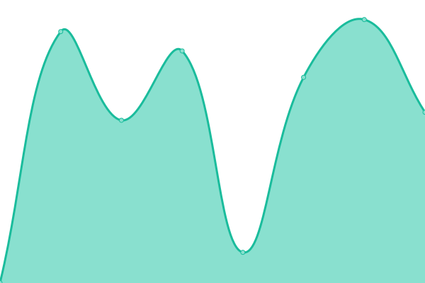 239ms
     
 | 

<a href="https://PatLittle.github.io/Consultations-Tracker/history/share-your-thoughts-draft-national-potato-wart-response-plan">100.00%</a>
    

|  [Share your thoughts: Proposed amendments to fish import inspection fees in the CFIA Fees Notice](https://inspection.canada.ca/about-the-cfia/transparency/consultations-and-engagement/fish-import-inspection-fees/eng/1715198066149/1715198066290) | 🟩 Up | [share-your-thoughts-proposed-amendments-to-fish-import-inspection-fees-in-the-cfia-fees-notice.yml](https://github.com/PatLittle/Consultations-Tracker/commits/HEAD/history/share-your-thoughts-proposed-amendments-to-fish-import-inspection-fees-in-the-cfia-fees-notice.yml) | 

 0ms
     
 | 

<a href="https://PatLittle.github.io/Consultations-Tracker/history/share-your-thoughts-proposed-amendments-to-fish-import-inspection-fees-in-the-cfia-fees-notice">100.00%</a>
    

|  [Share your thoughts: Proposed changes to the Units of Measurement for the Net Quantity Declaration of Certain Foods for fresh fruits or vegetables packaged in non-retail containers](https://inspection.canada.ca/en/about-cfia/transparency/consultations-and-engagement/units-measurement) | 🟩 Up | [share-your-thoughts-proposed-changes-to-the-units-of-measurement-for-the-net-quantity-declaration-of-certain-foods-for-fresh-fruits-or-vegetables-packaged-in-non-retail-containers.yml](https://github.com/PatLittle/Consultations-Tracker/commits/HEAD/history/share-your-thoughts-proposed-changes-to-the-units-of-measurement-for-the-net-quantity-declaration-of-certain-foods-for-fresh-fruits-or-vegetables-packaged-in-non-retail-containers.yml) | 

 0ms
     
 | 

<a href="https://PatLittle.github.io/Consultations-Tracker/history/share-your-thoughts-proposed-changes-to-the-units-of-measurement-for-the-net-quantity-declaration-of-certain-foods-for-fresh-fruits-or-vegetables-packaged-in-non-retail-containers">100.00%</a>
    

|  [Share your thoughts: Proposed amended livestock feed ingredients – Waxy Leaf Nightshade](N) | 🟥 Down | [share-your-thoughts-proposed-amended-livestock-feed-ingredients-waxy-leaf-nightshade.yml](https://github.com/PatLittle/Consultations-Tracker/commits/HEAD/history/share-your-thoughts-proposed-amended-livestock-feed-ingredients-waxy-leaf-nightshade.yml) | 

 0ms
     
 | 

<a href="https://PatLittle.github.io/Consultations-Tracker/history/share-your-thoughts-proposed-amended-livestock-feed-ingredients-waxy-leaf-nightshade">100.00%</a>
    

|  [Changing Narrative Fund](https://www.canada.ca/en/canadian-heritage/campaigns/changing-narratives-fund.html) | 🟩 Up | [changing-narrative-fund.yml](https://github.com/PatLittle/Consultations-Tracker/commits/HEAD/history/changing-narrative-fund.yml) | 

 2159ms
     
 | 

<a href="https://PatLittle.github.io/Consultations-Tracker/history/changing-narrative-fund">100.00%</a>
    

|  [2022-23 Consultations on renewal of the Museum Policy](https://www.canada.ca/en/canadian-heritage/campaigns/renewal-museum-policy.html) | 🟩 Up | [2022-23-consultations-on-renewal-of-the-museum-policy.yml](https://github.com/PatLittle/Consultations-Tracker/commits/HEAD/history/2022-23-consultations-on-renewal-of-the-museum-policy.yml) | 

 1825ms
     
 | 

<a href="https://PatLittle.github.io/Consultations-Tracker/history/2022-23-consultations-on-renewal-of-the-museum-policy">100.00%</a>
    

|  [Refreshing Canada's Strategy for Patient-Oriented Research](https://cihr-irsc.gc.ca/e/53699.html) | 🟩 Up | [refreshing-canada-s-strategy-for-patient-oriented-research.yml](https://github.com/PatLittle/Consultations-Tracker/commits/HEAD/history/refreshing-canada-s-strategy-for-patient-oriented-research.yml) | 

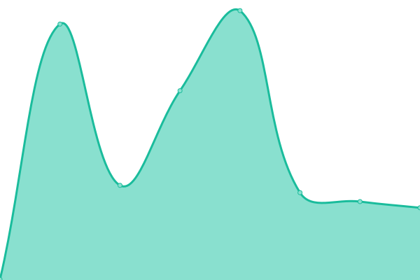 123ms
     
 | 

<a href="https://PatLittle.github.io/Consultations-Tracker/history/refreshing-canada-s-strategy-for-patient-oriented-research">100.00%</a>
    

|  [Discussion Paper DIS-24-01 - Proposals to Amend the Packaging and Transport of Nuclear Substances Regulations, 2015 and the Nuclear Substances and Radiation Devices Regulations](https://letstalknuclearsafety.ca/discussion-paper-dis-24-01-proposals-amend-packaging-and-transport-nuclear-substances-regulations-0) | 🟩 Up | [discussion-paper-dis-24-01-proposals-to-amend-the-packaging-and-transport-of-nuclear-substances-regulations-2015-and-the-nuclear-substances-and-radiation-devices-regulations.yml](https://github.com/PatLittle/Consultations-Tracker/commits/HEAD/history/discussion-paper-dis-24-01-proposals-to-amend-the-packaging-and-transport-of-nuclear-substances-regulations-2015-and-the-nuclear-substances-and-radiation-devices-regulations.yml) | 

 193ms
     
 | 

<a href="https://PatLittle.github.io/Consultations-Tracker/history/discussion-paper-dis-24-01-proposals-to-amend-the-packaging-and-transport-of-nuclear-substances-regulations-2015-and-the-nuclear-substances-and-radiation-devices-regulations">100.00%</a>
    

|  [Discussion Paper DIS-24-02, Proposal to amend REGDOC-2.13.2, Import and Export](https://letstalknuclearsafety.ca/discussion-paper-dis-24-02-proposal-amend-regdoc-2132-import-and-export) | 🟩 Up | [discussion-paper-dis-24-02-proposal-to-amend-regdoc-2-13-2-import-and-export.yml](https://github.com/PatLittle/Consultations-Tracker/commits/HEAD/history/discussion-paper-dis-24-02-proposal-to-amend-regdoc-2-13-2-import-and-export.yml) | 

 87ms
     
 | 

<a href="https://PatLittle.github.io/Consultations-Tracker/history/discussion-paper-dis-24-02-proposal-to-amend-regdoc-2-13-2-import-and-export">100.00%</a>
    

|  [Discussion Paper DIS-24-03, Proposal to amend REGDOC-2.13.1, Safeguards and Nuclear Material Accountancy](https://letstalknuclearsafety.ca/discussion-paper-dis-24-03-proposal-amend-regdoc-2131-safeguards-and-nuclear-material-accountancy-0) | 🟩 Up | [discussion-paper-dis-24-03-proposal-to-amend-regdoc-2-13-1-safeguards-and-nuclear-material-accountancy.yml](https://github.com/PatLittle/Consultations-Tracker/commits/HEAD/history/discussion-paper-dis-24-03-proposal-to-amend-regdoc-2-13-1-safeguards-and-nuclear-material-accountancy.yml) | 

 69ms
     
 | 

<a href="https://PatLittle.github.io/Consultations-Tracker/history/discussion-paper-dis-24-03-proposal-to-amend-regdoc-2-13-1-safeguards-and-nuclear-material-accountancy">100.00%</a>
    

|  [Discussion Paper DIS-24-04, Future Amendments the Nuclear Security Regulations: Granting Peace Officer Powers, Initiating a Complaints Investigation Mechanism, and Transferring of Firearm Ownership to Licensees](https://letstalknuclearsafety.ca/dis-24-04-landing-page) | 🟩 Up | [discussion-paper-dis-24-04-future-amendments-the-nuclear-security-regulations-granting-peace-officer-powers-initiating-a-complaints-investigation-mechanism-and-transferring-of-firearm-ownership-to-licensees.yml](https://github.com/PatLittle/Consultations-Tracker/commits/HEAD/history/discussion-paper-dis-24-04-future-amendments-the-nuclear-security-regulations-granting-peace-officer-powers-initiating-a-complaints-investigation-mechanism-and-transferring-of-firearm-ownership-to-licensees.yml) | 

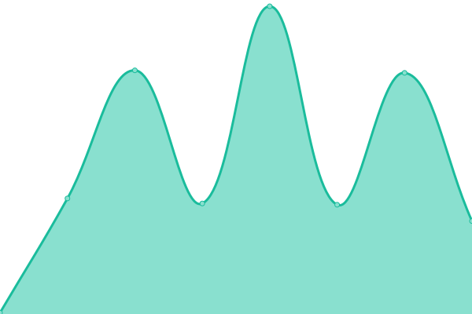 97ms
     
 | 

<a href="https://PatLittle.github.io/Consultations-Tracker/history/discussion-paper-dis-24-04-future-amendments-the-nuclear-security-regulations-granting-peace-officer-powers-initiating-a-complaints-investigation-mechanism-and-transferring-of-firearm-ownership-to-licensees">100.00%</a>
    

|  [Co-development of a new Indigenous Broadcasting Policy](https://crtc.gc.ca/eng/archive/2019/2019-217.htm) | 🟩 Up | [co-development-of-a-new-indigenous-broadcasting-policy.yml](https://github.com/PatLittle/Consultations-Tracker/commits/HEAD/history/co-development-of-a-new-indigenous-broadcasting-policy.yml) | 

 214ms
     
 | 

<a href="https://PatLittle.github.io/Consultations-Tracker/history/co-development-of-a-new-indigenous-broadcasting-policy">100.00%</a>
    

|  [Share your thoughts about the regulatory framework for the Online News Act](https://crtc.gc.ca/eng/consultation/news-nouvelles.htm) | 🟩 Up | [share-your-thoughts-about-the-regulatory-framework-for-the-online-news-act.yml](https://github.com/PatLittle/Consultations-Tracker/commits/HEAD/history/share-your-thoughts-about-the-regulatory-framework-for-the-online-news-act.yml) | 

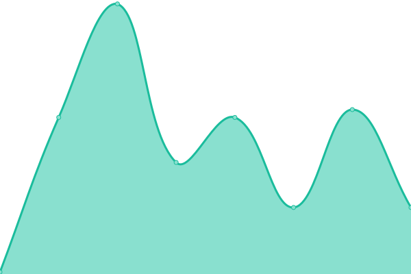 34ms
     
 | 

<a href="https://PatLittle.github.io/Consultations-Tracker/history/share-your-thoughts-about-the-regulatory-framework-for-the-online-news-act">100.00%</a>
    

|  [Share your thoughts about Indigenous programming in Canada](https://crtc.gc.ca/eng/consultation/ibp-pra.htm) | 🟩 Up | [share-your-thoughts-about-indigenous-programming-in-canada.yml](https://github.com/PatLittle/Consultations-Tracker/commits/HEAD/history/share-your-thoughts-about-indigenous-programming-in-canada.yml) | 

 0ms
     
 | 

<a href="https://PatLittle.github.io/Consultations-Tracker/history/share-your-thoughts-about-indigenous-programming-in-canada">100.00%</a>
    

|  [Consultation on requests for Conditional Exemptions from the tactile requirement related to signage in terminals in the Accessible Transportation for Persons with Disabilities Regulations](https://otc-cta.gc.ca/eng/consultation/consultation-requests-conditional-exemptions-catsa-cbsa-atpdr) | 🟩 Up | [consultation-on-requests-for-conditional-exemptions-from-the-tactile-requirement-related-to-signage-in-terminals-in-the-accessible-transportation-for-persons-with-disabilities-regulations.yml](https://github.com/PatLittle/Consultations-Tracker/commits/HEAD/history/consultation-on-requests-for-conditional-exemptions-from-the-tactile-requirement-related-to-signage-in-terminals-in-the-accessible-transportation-for-persons-with-disabilities-regulations.yml) | 

 0ms
     
 | 

<a href="https://PatLittle.github.io/Consultations-Tracker/history/consultation-on-requests-for-conditional-exemptions-from-the-tactile-requirement-related-to-signage-in-terminals-in-the-accessible-transportation-for-persons-with-disabilities-regulations">100.00%</a>
    

|  [Clean Growth Investment Tax Credits](https://www.canada.ca/en/department-finance/news/2023/06/government-consults-canadians-to-advance-key-budget-2023-priorities.html) | 🟩 Up | [clean-growth-investment-tax-credits.yml](https://github.com/PatLittle/Consultations-Tracker/commits/HEAD/history/clean-growth-investment-tax-credits.yml) | 

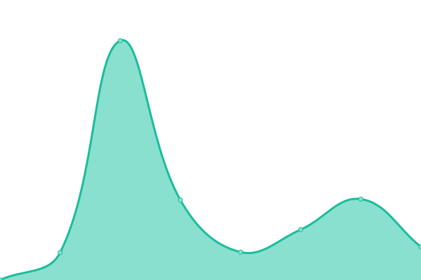 2227ms
     
 | 

<a href="https://PatLittle.github.io/Consultations-Tracker/history/clean-growth-investment-tax-credits">100.00%</a>
    

|  [Exempting Indigenous Settlement and Community Trusts from Alternative Minimum Tax](https://www.canada.ca/en/department-finance/programs/consultations/2024/consultation-exempting-indigenous-settlement-community-trusts-alternative-minimum-tax.html) | 🟩 Up | [exempting-indigenous-settlement-and-community-trusts-from-alternative-minimum-tax.yml](https://github.com/PatLittle/Consultations-Tracker/commits/HEAD/history/exempting-indigenous-settlement-and-community-trusts-from-alternative-minimum-tax.yml) | 

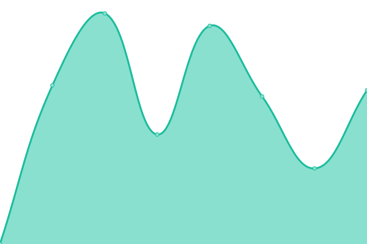 2470ms
     
 | 

<a href="https://PatLittle.github.io/Consultations-Tracker/history/exempting-indigenous-settlement-and-community-trusts-from-alternative-minimum-tax">100.00%</a>
    

|  [Consultation on Qualified Investments for Tax-Advantaged Savings Plans](https://www.canada.ca/en/department-finance/programs/consultations/2024/consultation-on-qualified-investments-for-tax-advantaged-savings-plans.html) | 🟩 Up | [consultation-on-qualified-investments-for-tax-advantaged-savings-plans.yml](https://github.com/PatLittle/Consultations-Tracker/commits/HEAD/history/consultation-on-qualified-investments-for-tax-advantaged-savings-plans.yml) | 

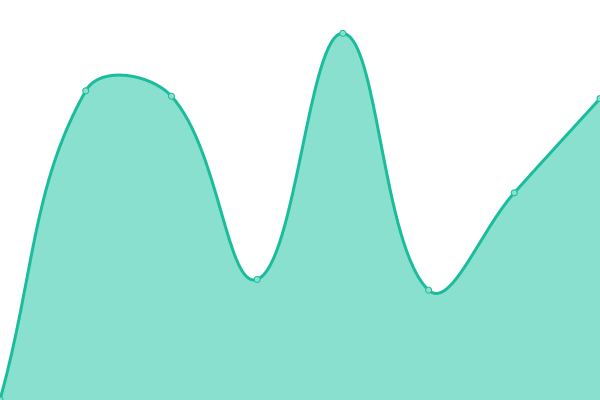 1479ms
     
 | 

<a href="https://PatLittle.github.io/Consultations-Tracker/history/consultation-on-qualified-investments-for-tax-advantaged-savings-plans">100.00%</a>
    

|  [Council of Europe Second Additional Protocol to the Convention on Cybercrime on Enhanced Cooperation and Disclosure of Electronic EvidenceConsultations, 2023](https://www.justice.gc.ca/eng/cj-jp/cyber/id-di/index.html) | 🟩 Up | [council-of-europe-second-additional-protocol-to-the-convention-on-cybercrime-on-enhanced-cooperation-and-disclosure-of-electronic-evidence-consultations-2023.yml](https://github.com/PatLittle/Consultations-Tracker/commits/HEAD/history/council-of-europe-second-additional-protocol-to-the-convention-on-cybercrime-on-enhanced-cooperation-and-disclosure-of-electronic-evidence-consultations-2023.yml) | 

 244ms
     
 | 

<a href="https://PatLittle.github.io/Consultations-Tracker/history/council-of-europe-second-additional-protocol-to-the-convention-on-cybercrime-on-enhanced-cooperation-and-disclosure-of-electronic-evidence-consultations-2023">100.00%</a>
    

|  [Amending the Nuclear Exclusions Regulations](https://gazette.gc.ca/rp-pr/p1/2024/2024-04-27/html/index-eng.html) | 🟩 Up | [amending-the-nuclear-exclusions-regulations.yml](https://github.com/PatLittle/Consultations-Tracker/commits/HEAD/history/amending-the-nuclear-exclusions-regulations.yml) | 

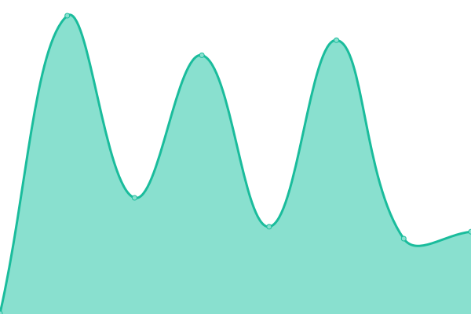 178ms
     
 | 

<a href="https://PatLittle.github.io/Consultations-Tracker/history/amending-the-nuclear-exclusions-regulations">100.00%</a>
    

|  [Modernization of the Employment Equity Act](https://www.canada.ca/en/employment-social-development/corporate/portfolio/labour/programs/employment-equity/consultation-act-modernization.html) | 🟩 Up | [modernization-of-the-employment-equity-act.yml](https://github.com/PatLittle/Consultations-Tracker/commits/HEAD/history/modernization-of-the-employment-equity-act.yml) | 

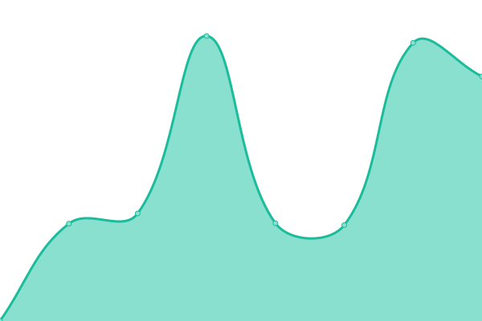 2745ms
     
 | 

<a href="https://PatLittle.github.io/Consultations-Tracker/history/modernization-of-the-employment-equity-act">100.00%</a>
    

|  [Share your thoughts: Helping 2SLGBTQI+ Older Adults to Age in Place](https://www.canada.ca/en/employment-social-development/corporate/reports/seniors-aging/consultation-enabling-2slgbtqi.html) | 🟩 Up | [share-your-thoughts-helping-2-slgbtqi-older-adults-to-age-in-place.yml](https://github.com/PatLittle/Consultations-Tracker/commits/HEAD/history/share-your-thoughts-helping-2-slgbtqi-older-adults-to-age-in-place.yml) | 

 0ms
     
 | 

<a href="https://PatLittle.github.io/Consultations-Tracker/history/share-your-thoughts-helping-2-slgbtqi-older-adults-to-age-in-place">100.00%</a>
    

|  [Clean Fuel Standard](https://www.canada.ca/en/environment-climate-change/services/managing-pollution/energy-production/fuel-regulations/clean-fuel-standard.html) | 🟩 Up | [clean-fuel-standard.yml](https://github.com/PatLittle/Consultations-Tracker/commits/HEAD/history/clean-fuel-standard.yml) | 

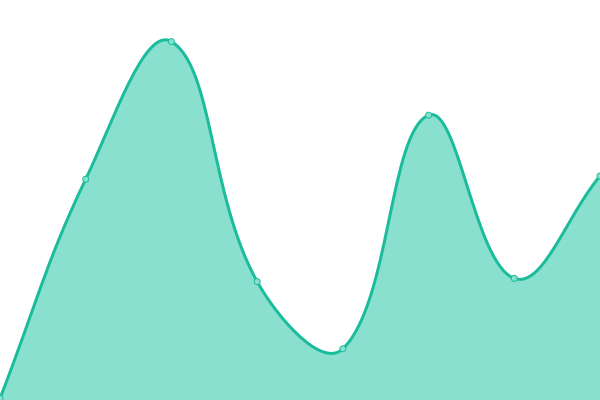 4499ms
     
 | 

<a href="https://PatLittle.github.io/Consultations-Tracker/history/clean-fuel-standard">100.00%</a>
    

|  [Share and view ideas: Renewal of the Federal Agenda for Volatile Organic Compounds in Consumer and Commercial Product](https://www.canada.ca/en/environment-climate-change/services/managing-pollution/sources-industry/volatile-organic-compounds-consumer-commercial/renewal-federal-agenda-volatile-organic-compound-consumer-commercial-product.html) | 🟩 Up | [share-and-view-ideas-renewal-of-the-federal-agenda-for-volatile-organic-compounds-in-consumer-and-commercial-product.yml](https://github.com/PatLittle/Consultations-Tracker/commits/HEAD/history/share-and-view-ideas-renewal-of-the-federal-agenda-for-volatile-organic-compounds-in-consumer-and-commercial-product.yml) | 

 0ms
     
 | 

<a href="https://PatLittle.github.io/Consultations-Tracker/history/share-and-view-ideas-renewal-of-the-federal-agenda-for-volatile-organic-compounds-in-consumer-and-commercial-product">100.00%</a>
    

|  [Share your ideas: Blackwater Project](https://www.canada.ca/en/environment-climate-change/services/managing-pollution/sources-industry/mining/metal-diamond-mining-effluent-regulation/blackwater-consultation.html) | 🟥 Down | [share-your-ideas-blackwater-project.yml](https://github.com/PatLittle/Consultations-Tracker/commits/HEAD/history/share-your-ideas-blackwater-project.yml) | 

 2350ms
     
 | 

<a href="https://PatLittle.github.io/Consultations-Tracker/history/share-your-ideas-blackwater-project">100.00%</a>
    

|  [Share ideas: Mont-Wright Mining Project (Dyno Basin)](https://canada.ca/en/environment-climate-change/services/managing-pollution/sources-industry/mining/metal-diamond-mining-effluent-regulation/basin-dyno-consultation.html) | 🟥 Down | [share-ideas-mont-wright-mining-project-dyno-basin.yml](https://github.com/PatLittle/Consultations-Tracker/commits/HEAD/history/share-ideas-mont-wright-mining-project-dyno-basin.yml) | 

 2369ms
     
 | 

<a href="https://PatLittle.github.io/Consultations-Tracker/history/share-ideas-mont-wright-mining-project-dyno-basin">100.00%</a>
    

|  [Recovery Strategy (Amended) and Action Plan for the Piping Plover melodus subspecies (Charadrius melodus melodus) in Canada [Proposed]](https://registre-especes.canada.ca/index-fr.html#/documents/923) | 🟩 Up | [recovery-strategy-amended-and-action-plan-for-the-piping-plover-melodus-subspecies-charadrius-melodus-melodus-in-canada-proposed.yml](https://github.com/PatLittle/Consultations-Tracker/commits/HEAD/history/recovery-strategy-amended-and-action-plan-for-the-piping-plover-melodus-subspecies-charadrius-melodus-melodus-in-canada-proposed.yml) | 

 0ms
     
 | 

<a href="https://PatLittle.github.io/Consultations-Tracker/history/recovery-strategy-amended-and-action-plan-for-the-piping-plover-melodus-subspecies-charadrius-melodus-melodus-in-canada-proposed">100.00%</a>
    

|  [Consultation on the Proposed Recovery Strategy for the Gypsy Cuckoo Bumble Bee](https://species-registry.canada.ca/index-en.html#/documents/268) | 🟩 Up | [consultation-on-the-proposed-recovery-strategy-for-the-gypsy-cuckoo-bumble-bee.yml](https://github.com/PatLittle/Consultations-Tracker/commits/HEAD/history/consultation-on-the-proposed-recovery-strategy-for-the-gypsy-cuckoo-bumble-bee.yml) | 

 128ms
     
 | 

<a href="https://PatLittle.github.io/Consultations-Tracker/history/consultation-on-the-proposed-recovery-strategy-for-the-gypsy-cuckoo-bumble-bee">100.00%</a>
    

|  [Offsetting Policy for Biodiversity](https://www.canada.ca/en/environment-climate-change/services/biodiversity/share-view-ideas-offsetting-policy-biodiversity.html) | 🟩 Up | [offsetting-policy-for-biodiversity.yml](https://github.com/PatLittle/Consultations-Tracker/commits/HEAD/history/offsetting-policy-for-biodiversity.yml) | 

 2576ms
     
 | 

<a href="https://PatLittle.github.io/Consultations-Tracker/history/offsetting-policy-for-biodiversity">100.00%</a>
    

|  [Consultations on Canada's 2030 Biodiversity Strategy](https://www.canada.ca/en/services/environment/wildlife-plants-species/biodiversity.html) | 🟩 Up | [consultations-on-canada-s-2030-biodiversity-strategy.yml](https://github.com/PatLittle/Consultations-Tracker/commits/HEAD/history/consultations-on-canada-s-2030-biodiversity-strategy.yml) | 

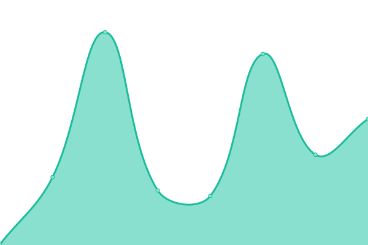 2133ms
     
 | 

<a href="https://PatLittle.github.io/Consultations-Tracker/history/consultations-on-canada-s-2030-biodiversity-strategy">100.00%</a>
    

|  [Draft Canada-US Lake Huron Lakewide Action & Management Plan](https://binational.net/2023/03/13/2022-2026-lake-huron-lakewide-action-and-management-plan-available-for-public-review-and-comment/) | 🟥 Down | [draft-canada-us-lake-huron-lakewide-action-and-management-plan.yml](https://github.com/PatLittle/Consultations-Tracker/commits/HEAD/history/draft-canada-us-lake-huron-lakewide-action-and-management-plan.yml) | 

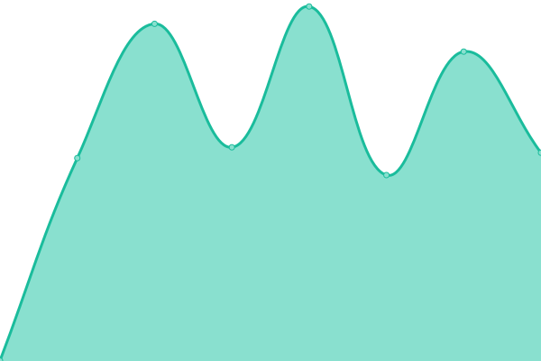 0ms
     
 | 

<a href="https://PatLittle.github.io/Consultations-Tracker/history/draft-canada-us-lake-huron-lakewide-action-and-management-plan">100.00%</a>
    

|  [Share your ideas: Assessing phosphorus targets for Lake Ontario](https://www.canada.ca/en/environment-climate-change/corporate/transparency/consultations/consultation-phosphorus-lake-ontario.html) | 🟩 Up | [share-your-ideas-assessing-phosphorus-targets-for-lake-ontario.yml](https://github.com/PatLittle/Consultations-Tracker/commits/HEAD/history/share-your-ideas-assessing-phosphorus-targets-for-lake-ontario.yml) | 

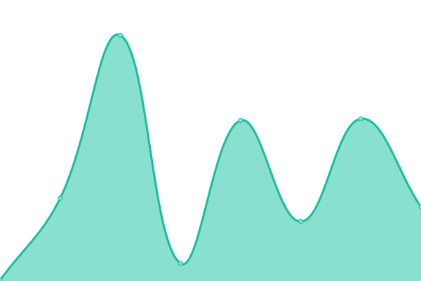 2552ms
     
 | 

<a href="https://PatLittle.github.io/Consultations-Tracker/history/share-your-ideas-assessing-phosphorus-targets-for-lake-ontario">100.00%</a>
    

|  [Share and view ideas: Publication of a Notice of intent for the Federal Plastics Registry](https://canada.ca/en/environment-climate-change/services/managing-reducing-waste/consultations/technical-paper-registry.html) | 🟥 Down | [share-and-view-ideas-publication-of-a-notice-of-intent-for-the-federal-plastics-registry.yml](https://github.com/PatLittle/Consultations-Tracker/commits/HEAD/history/share-and-view-ideas-publication-of-a-notice-of-intent-for-the-federal-plastics-registry.yml) | 

 1765ms
     
 | 

<a href="https://PatLittle.github.io/Consultations-Tracker/history/share-and-view-ideas-publication-of-a-notice-of-intent-for-the-federal-plastics-registry">100.00%</a>
    

|  [Share your ideas: consultation on the modernization of the Pulp and Paper Effluent Regulations](https://canada.ca/en/environment-climate-change/services/managing-pollution/fisheries-act-registry/consultation-modernization-pulp-paper-effluent-regulations.html) | 🟥 Down | [share-your-ideas-consultation-on-the-modernization-of-the-pulp-and-paper-effluent-regulations.yml](https://github.com/PatLittle/Consultations-Tracker/commits/HEAD/history/share-your-ideas-consultation-on-the-modernization-of-the-pulp-and-paper-effluent-regulations.yml) | 

 2140ms
     
 | 

<a href="https://PatLittle.github.io/Consultations-Tracker/history/share-your-ideas-consultation-on-the-modernization-of-the-pulp-and-paper-effluent-regulations">100.00%</a>
    

|  [Consultation on Amending the List of Species under the Species at Risk Act: Terrestrial Species December 2023](https://species-registry.canada.ca/index-en.html#/documents/1171) | 🟩 Up | [consultation-on-amending-the-list-of-species-under-the-species-at-risk-act-terrestrial-species-december-2023.yml](https://github.com/PatLittle/Consultations-Tracker/commits/HEAD/history/consultation-on-amending-the-list-of-species-under-the-species-at-risk-act-terrestrial-species-december-2023.yml) | 

 5ms
     
 | 

<a href="https://PatLittle.github.io/Consultations-Tracker/history/consultation-on-amending-the-list-of-species-under-the-species-at-risk-act-terrestrial-species-december-2023">100.00%</a>
    

|  [Share your thoughts: Implementation Framework for a Right to a Healthy Environment in the Canadian Environmental Protection Act, 1999](https://www.canada.ca/en/environment-climate-change/corporate/transparency/consultations/right-healthy-environment.html) | 🟩 Up | [share-your-thoughts-implementation-framework-for-a-right-to-a-healthy-environment-in-the-canadian-environmental-protection-act-1999.yml](https://github.com/PatLittle/Consultations-Tracker/commits/HEAD/history/share-your-thoughts-implementation-framework-for-a-right-to-a-healthy-environment-in-the-canadian-environmental-protection-act-1999.yml) | 

 0ms
     
 | 

<a href="https://PatLittle.github.io/Consultations-Tracker/history/share-your-thoughts-implementation-framework-for-a-right-to-a-healthy-environment-in-the-canadian-environmental-protection-act-1999">100.00%</a>
    

|  [Share your ideas: Amendments to the Metal and Diamond Mining Effluent Regulations for the Red Lake Mine](https://www.canada.ca/en/environment-climate-change/corporate/transparency/consultations/red-lake-mine-project.html) | 🟩 Up | [share-your-ideas-amendments-to-the-metal-and-diamond-mining-effluent-regulations-for-the-red-lake-mine.yml](https://github.com/PatLittle/Consultations-Tracker/commits/HEAD/history/share-your-ideas-amendments-to-the-metal-and-diamond-mining-effluent-regulations-for-the-red-lake-mine.yml) | 

 2418ms
     
 | 

<a href="https://PatLittle.github.io/Consultations-Tracker/history/share-your-ideas-amendments-to-the-metal-and-diamond-mining-effluent-regulations-for-the-red-lake-mine">100.00%</a>
    

|  [Share your thoughts: Toward a National Framework for Environmental Learning Consultation](https://www.canada.ca/en/environment-climate-change/corporate/transparency/consultations/national-framework-environmental-learning.html) | 🟩 Up | [share-your-thoughts-toward-a-national-framework-for-environmental-learning-consultation.yml](https://github.com/PatLittle/Consultations-Tracker/commits/HEAD/history/share-your-thoughts-toward-a-national-framework-for-environmental-learning-consultation.yml) | 

 2185ms
     
 | 

<a href="https://PatLittle.github.io/Consultations-Tracker/history/share-your-thoughts-toward-a-national-framework-for-environmental-learning-consultation">100.00%</a>
    

|  [Dolphin and Union Caribou pre-listing consultations](https://www.canada.ca/en/environment-climate-change/corporate/transparency/consultations/review-environmental-violations-administrative-monetary-penalties-regulations.html) | 🟩 Up | [dolphin-and-union-caribou-pre-listing-consultations.yml](https://github.com/PatLittle/Consultations-Tracker/commits/HEAD/history/dolphin-and-union-caribou-pre-listing-consultations.yml) | 

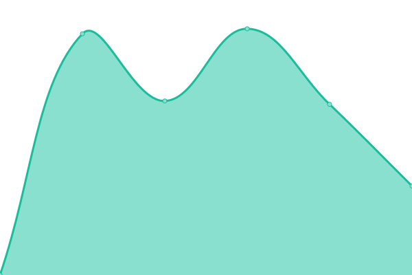 2013ms
     
 | 

<a href="https://PatLittle.github.io/Consultations-Tracker/history/dolphin-and-union-caribou-pre-listing-consultations">100.00%</a>
    

|  [Share your ideas: Review of the Environmental Violations Administrative Monetary Penalties Regulations](https://www.canada.ca/en/environment-climate-change/corporate/transparency/consultations/review-environmental-violations-administrative-monetary-penalties-regulations.html) | 🟩 Up | [share-your-ideas-review-of-the-environmental-violations-administrative-monetary-penalties-regulations.yml](https://github.com/PatLittle/Consultations-Tracker/commits/HEAD/history/share-your-ideas-review-of-the-environmental-violations-administrative-monetary-penalties-regulations.yml) | 

 2296ms
     
 | 

<a href="https://PatLittle.github.io/Consultations-Tracker/history/share-your-ideas-review-of-the-environmental-violations-administrative-monetary-penalties-regulations">100.00%</a>
    

|  [Share your ideas: Amendments to the Metal and Diamond Mining Effluent Regulations for the Goldboro Gold Project](https://www.canada.ca/en/environment-climate-change/corporate/transparency/consultations/goldboro-mine-project.html) | 🟩 Up | [share-your-ideas-amendments-to-the-metal-and-diamond-mining-effluent-regulations-for-the-goldboro-gold-project.yml](https://github.com/PatLittle/Consultations-Tracker/commits/HEAD/history/share-your-ideas-amendments-to-the-metal-and-diamond-mining-effluent-regulations-for-the-goldboro-gold-project.yml) | 

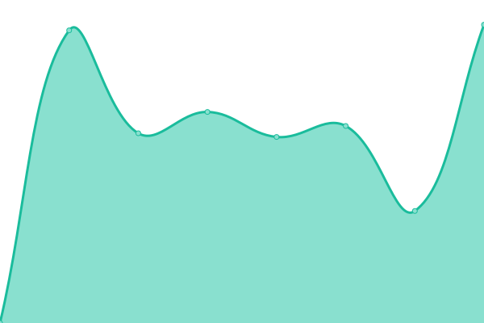 2519ms
     
 | 

<a href="https://PatLittle.github.io/Consultations-Tracker/history/share-your-ideas-amendments-to-the-metal-and-diamond-mining-effluent-regulations-for-the-goldboro-gold-project">100.00%</a>
    

|  [Eastern Shore Islands Area of Interest Consultations](http://www.dfo-mpo.gc.ca/oceans/consultations/easternshore-ilescoteest/index-eng.html) | 🟩 Up | [eastern-shore-islands-area-of-interest-consultations.yml](https://github.com/PatLittle/Consultations-Tracker/commits/HEAD/history/eastern-shore-islands-area-of-interest-consultations.yml) | 

 355ms
     
 | 

<a href="https://PatLittle.github.io/Consultations-Tracker/history/eastern-shore-islands-area-of-interest-consultations">100.00%</a>
    

|  [Fundian Channel- Browns Bank Area of Interest](https://www.dfo-mpo.gc.ca/oceans/aoi-si/fundian-fundy-browns-eng.html) | 🟩 Up | [fundian-channel-browns-bank-area-of-interest.yml](https://github.com/PatLittle/Consultations-Tracker/commits/HEAD/history/fundian-channel-browns-bank-area-of-interest.yml) | 

 229ms
     
 | 

<a href="https://PatLittle.github.io/Consultations-Tracker/history/fundian-channel-browns-bank-area-of-interest">100.00%</a>
    

|  [Aquaculture Activities Regulations (AAR)](https://www.dfo-mpo.gc.ca/aquaculture/management-gestion/aar-raa-eng.htm) | 🟩 Up | [aquaculture-activities-regulations-aar.yml](https://github.com/PatLittle/Consultations-Tracker/commits/HEAD/history/aquaculture-activities-regulations-aar.yml) | 

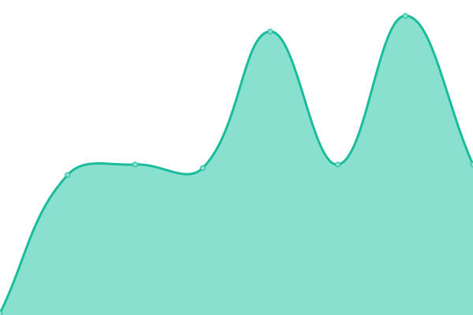 54ms
     
 | 

<a href="https://PatLittle.github.io/Consultations-Tracker/history/aquaculture-activities-regulations-aar">100.00%</a>
    

|  [Let's talk Pacific Salmon](https://letstalkpacificsalmon.ca/) | 🟩 Up | [let-s-talk-pacific-salmon.yml](https://github.com/PatLittle/Consultations-Tracker/commits/HEAD/history/let-s-talk-pacific-salmon.yml) | 

 632ms
     
 | 

<a href="https://PatLittle.github.io/Consultations-Tracker/history/let-s-talk-pacific-salmon">98.30%</a>
    

|  [Proposed ticketing for the enforcement of a fisheries offence under the Fisheries Act](TBD) | 🟥 Down | [proposed-ticketing-for-the-enforcement-of-a-fisheries-offence-under-the-fisheries-act.yml](https://github.com/PatLittle/Consultations-Tracker/commits/HEAD/history/proposed-ticketing-for-the-enforcement-of-a-fisheries-offence-under-the-fisheries-act.yml) | 

 0ms
     
 | 

<a href="https://PatLittle.github.io/Consultations-Tracker/history/proposed-ticketing-for-the-enforcement-of-a-fisheries-offence-under-the-fisheries-act">100.00%</a>
    

|  [Whitby Harbour Remediation Project](Whitby Harbour Remediation Project (dfo-mpo.gc.ca)) | 🟥 Down | [whitby-harbour-remediation-project.yml](https://github.com/PatLittle/Consultations-Tracker/commits/HEAD/history/whitby-harbour-remediation-project.yml) | 

 0ms
     
 | 

<a href="https://PatLittle.github.io/Consultations-Tracker/history/whitby-harbour-remediation-project">0.00%</a>
    

|  [Revision of the management plan for Banc-des-Américains Marine Protected Area (MPA)](https://www.dfo-mpo.gc.ca/oceans/mpa-zpm/american-americains/index-eng.html) | 🟩 Up | [revision-of-the-management-plan-for-banc-des-americains-marine-protected-area-mpa.yml](https://github.com/PatLittle/Consultations-Tracker/commits/HEAD/history/revision-of-the-management-plan-for-banc-des-americains-marine-protected-area-mpa.yml) | 

 100ms
     
 | 

<a href="https://PatLittle.github.io/Consultations-Tracker/history/revision-of-the-management-plan-for-banc-des-americains-marine-protected-area-mpa">100.00%</a>
    

|  [Management Plan for the Mapleleaf (Quadrula quadrula) Great Lakes – Upper St. Lawrence Population, and Rainbow (Villosa iris) in Canada](https://wildlife-species.canada.ca/species-risk-registry/involved/consultation/default_e.cfm) | 🟩 Up | [management-plan-for-the-mapleleaf-quadrula-quadrula-great-lakes-upper-st-lawrence-population-and-rainbow-villosa-iris-in-canada.yml](https://github.com/PatLittle/Consultations-Tracker/commits/HEAD/history/management-plan-for-the-mapleleaf-quadrula-quadrula-great-lakes-upper-st-lawrence-population-and-rainbow-villosa-iris-in-canada.yml) | 

 0ms
     
 | 

<a href="https://PatLittle.github.io/Consultations-Tracker/history/management-plan-for-the-mapleleaf-quadrula-quadrula-great-lakes-upper-st-lawrence-population-and-rainbow-villosa-iris-in-canada">100.00%</a>
    

|  [Marine Conservation Network Plan for the Scotian Shelf-Bay of Fundy Bioregion](https://www.dfo-mpo.gc.ca/oceans/consultations/scotian-shelf-plateau-neo-ecossais-bay-baie-fundy/index-eng.html) | 🟩 Up | [marine-conservation-network-plan-for-the-scotian-shelf-bay-of-fundy-bioregion.yml](https://github.com/PatLittle/Consultations-Tracker/commits/HEAD/history/marine-conservation-network-plan-for-the-scotian-shelf-bay-of-fundy-bioregion.yml) | 

 55ms
     
 | 

<a href="https://PatLittle.github.io/Consultations-Tracker/history/marine-conservation-network-plan-for-the-scotian-shelf-bay-of-fundy-bioregion">100.00%</a>
    

|  [Proposed Amendments to the Marine Mammal Regulations: Pacific Killer Whale approach distance and other amendments](https://www.dfo-mpo.gc.ca/about-notre-sujet/engagement/2024/marine-mammal-mammiferes-marins-eng.html) | 🟩 Up | [proposed-amendments-to-the-marine-mammal-regulations-pacific-killer-whale-approach-distance-and-other-amendments.yml](https://github.com/PatLittle/Consultations-Tracker/commits/HEAD/history/proposed-amendments-to-the-marine-mammal-regulations-pacific-killer-whale-approach-distance-and-other-amendments.yml) | 

 39ms
     
 | 

<a href="https://PatLittle.github.io/Consultations-Tracker/history/proposed-amendments-to-the-marine-mammal-regulations-pacific-killer-whale-approach-distance-and-other-amendments">100.00%</a>
    

|  [Multi-species Action Plan for the Richelieu River Watershed in Canada [Proposed]](Multi-species Action Plan for the Richelieu River Watershed in Canada - Document search - Species at risk registry) | 🟥 Down | [multi-species-action-plan-for-the-richelieu-river-watershed-in-canada-proposed.yml](https://github.com/PatLittle/Consultations-Tracker/commits/HEAD/history/multi-species-action-plan-for-the-richelieu-river-watershed-in-canada-proposed.yml) | 

 0ms
     
 | 

<a href="https://PatLittle.github.io/Consultations-Tracker/history/multi-species-action-plan-for-the-richelieu-river-watershed-in-canada-proposed">100.00%</a>
    

|  [Survey to assess Fisheries and Oceans Canada’s aquatic species at risk public outreach activities](Survey to Assess Fisheries and Oceans Canada’s (DFO) Aquatic Species at Risk Public Outreach Activities | 1/2 (simplesurvey.com)) | 🟥 Down | [survey-to-assess-fisheries-and-oceans-canada-s-aquatic-species-at-risk-public-outreach-activities.yml](https://github.com/PatLittle/Consultations-Tracker/commits/HEAD/history/survey-to-assess-fisheries-and-oceans-canada-s-aquatic-species-at-risk-public-outreach-activities.yml) | 

 0ms
     
 | 

<a href="https://PatLittle.github.io/Consultations-Tracker/history/survey-to-assess-fisheries-and-oceans-canada-s-aquatic-species-at-risk-public-outreach-activities">100.00%</a>
    

|  [Multi-species Action Plan for the Richelieu River Watershed in Canada](https://species-registry.canada.ca/index-en.html#/consultations/2965) | 🟩 Up | [multi-species-action-plan-for-the-richelieu-river-watershed-in-canada.yml](https://github.com/PatLittle/Consultations-Tracker/commits/HEAD/history/multi-species-action-plan-for-the-richelieu-river-watershed-in-canada.yml) | 

 0ms
     
 | 

<a href="https://PatLittle.github.io/Consultations-Tracker/history/multi-species-action-plan-for-the-richelieu-river-watershed-in-canada">100.00%</a>
    

|  [Proposed Amendments to the Export Permits Regulations](https://www.international.gc.ca/trade-commerce/controls-controles/expor/backgrounder-amendments-epr-information-modification-rle.aspx?lang=eng) | 🟩 Up | [proposed-amendments-to-the-export-permits-regulations.yml](https://github.com/PatLittle/Consultations-Tracker/commits/HEAD/history/proposed-amendments-to-the-export-permits-regulations.yml) | 

 295ms
     
 | 

<a href="https://PatLittle.github.io/Consultations-Tracker/history/proposed-amendments-to-the-export-permits-regulations">100.00%</a>
    

|  [Canada’s post-2025–26 international climate and nature finance commitment](https://www.international.gc.ca/consultation/climate-finance-financement-climatique/climate-nature-changement-climatique.aspx?lang=eng) | 🟩 Up | [canada-s-post-2025-26-international-climate-and-nature-finance-commitment.yml](https://github.com/PatLittle/Consultations-Tracker/commits/HEAD/history/canada-s-post-2025-26-international-climate-and-nature-finance-commitment.yml) | 

 135ms
     
 | 

<a href="https://PatLittle.github.io/Consultations-Tracker/history/canada-s-post-2025-26-international-climate-and-nature-finance-commitment">100.00%</a>
    

|  [Public consultations on the potential collection and publication of country of smelt and cast information for aluminum imports under Canada's Aluminum Import Monitoring Program](https://www.international.gc.ca/consultation/aluminum-imports-importations-aluminium/index.aspx?lang=eng) | 🟩 Up | [public-consultations-on-the-potential-collection-and-publication-of-country-of-smelt-and-cast-information-for-aluminum-imports-under-canada-s-aluminum-import-monitoring-program.yml](https://github.com/PatLittle/Consultations-Tracker/commits/HEAD/history/public-consultations-on-the-potential-collection-and-publication-of-country-of-smelt-and-cast-information-for-aluminum-imports-under-canada-s-aluminum-import-monitoring-program.yml) | 

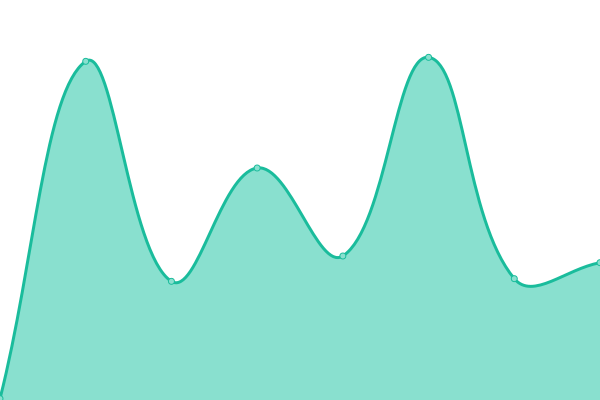 109ms
     
 | 

<a href="https://PatLittle.github.io/Consultations-Tracker/history/public-consultations-on-the-potential-collection-and-publication-of-country-of-smelt-and-cast-information-for-aluminum-imports-under-canada-s-aluminum-import-monitoring-program">100.00%</a>
    

|  [Join the discussion: The General Review of the Comprehensive and Progressive Agreement for Trans-Pacific Partnership (CPTPP)](https://www.international.gc.ca/trade-commerce/consultations/TRQ-CT/transpacific-cptpp-transpacifique-ptpgp.aspx?lang=eng) | 🟥 Down | [join-the-discussion-the-general-review-of-the-comprehensive-and-progressive-agreement-for-trans-pacific-partnership-cptpp.yml](https://github.com/PatLittle/Consultations-Tracker/commits/HEAD/history/join-the-discussion-the-general-review-of-the-comprehensive-and-progressive-agreement-for-trans-pacific-partnership-cptpp.yml) | 

 55ms
     
 | 

<a href="https://PatLittle.github.io/Consultations-Tracker/history/join-the-discussion-the-general-review-of-the-comprehensive-and-progressive-agreement-for-trans-pacific-partnership-cptpp">100.00%</a>
    

|  [Engagement on Indigenous Perspectives on Medical Assistance in Dying](https://www.canada.ca/en/health-canada/programs/engagement-indigenous-perspectives-medical-assistance-dying.html) | 🟩 Up | [engagement-on-indigenous-perspectives-on-medical-assistance-in-dying.yml](https://github.com/PatLittle/Consultations-Tracker/commits/HEAD/history/engagement-on-indigenous-perspectives-on-medical-assistance-in-dying.yml) | 

 0ms
     
 | 

<a href="https://PatLittle.github.io/Consultations-Tracker/history/engagement-on-indigenous-perspectives-on-medical-assistance-in-dying">100.00%</a>
    

|  [Consultation on natamycin and its associated end-use products, Proposed Re-evaluation Decision PRVD2024-02](https://www.canada.ca/en/health-canada/services/consumer-product-safety/pesticides-pest-management/public/consultations/proposed-re-evaluation-decisions/2024/natamycin.html) | 🟩 Up | [consultation-on-natamycin-and-its-associated-end-use-products-proposed-re-evaluation-decision-prvd-2024-02.yml](https://github.com/PatLittle/Consultations-Tracker/commits/HEAD/history/consultation-on-natamycin-and-its-associated-end-use-products-proposed-re-evaluation-decision-prvd-2024-02.yml) | 

 2308ms
     
 | 

<a href="https://PatLittle.github.io/Consultations-Tracker/history/consultation-on-natamycin-and-its-associated-end-use-products-proposed-re-evaluation-decision-prvd-2024-02">100.00%</a>
    

|  [Consultation: Guidelines for Canadian drinking water quality: Operational parameters](https://www.canada.ca/en/health-canada/programs/consultation-guidelines-canadian-drinking-water-quality-operational-parameters.html) | 🟩 Up | [consultation-guidelines-for-canadian-drinking-water-quality-operational-parameters.yml](https://github.com/PatLittle/Consultations-Tracker/commits/HEAD/history/consultation-guidelines-for-canadian-drinking-water-quality-operational-parameters.yml) | 

 1837ms
     
 | 

<a href="https://PatLittle.github.io/Consultations-Tracker/history/consultation-guidelines-for-canadian-drinking-water-quality-operational-parameters">100.00%</a>
    

|  [Consultation on methyl bromide and its associated end-use products, Proposed Re-evaluation Decision PRVD2024-03](https://www.canada.ca/en/health-canada/services/consumer-product-safety/pesticides-pest-management/public/consultations/proposed-re-evaluation-decisions/2024/methyl-bromide.html) | 🟩 Up | [consultation-on-methyl-bromide-and-its-associated-end-use-products-proposed-re-evaluation-decision-prvd-2024-03.yml](https://github.com/PatLittle/Consultations-Tracker/commits/HEAD/history/consultation-on-methyl-bromide-and-its-associated-end-use-products-proposed-re-evaluation-decision-prvd-2024-03.yml) | 

 1417ms
     
 | 

<a href="https://PatLittle.github.io/Consultations-Tracker/history/consultation-on-methyl-bromide-and-its-associated-end-use-products-proposed-re-evaluation-decision-prvd-2024-03">100.00%</a>
    

|  [Consultation on the proposed special review decision of methyl bromide and its associated end-use products, PSRD2024-01](https://www.canada.ca/en/health-canada/services/consumer-product-safety/pesticides-pest-management/public/consultations/proposed-special-review-decision/2024/methyl-bromide.html) | 🟩 Up | [consultation-on-the-proposed-special-review-decision-of-methyl-bromide-and-its-associated-end-use-products-psrd-2024-01.yml](https://github.com/PatLittle/Consultations-Tracker/commits/HEAD/history/consultation-on-the-proposed-special-review-decision-of-methyl-bromide-and-its-associated-end-use-products-psrd-2024-01.yml) | 

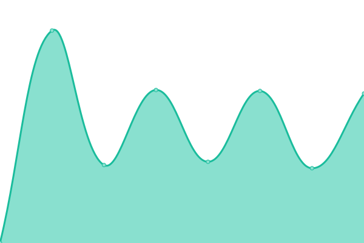 2133ms
     
 | 

<a href="https://PatLittle.github.io/Consultations-Tracker/history/consultation-on-the-proposed-special-review-decision-of-methyl-bromide-and-its-associated-end-use-products-psrd-2024-01">100.00%</a>
    

|  [Consultation on foramsulfuron and its associated end-use products, Proposed Re-evaluation Decision PRVD2024-04](https://www.canada.ca/en/health-canada/services/consumer-product-safety/pesticides-pest-management/public/consultations/proposed-re-evaluation-decisions/2024/foramsulfuron.html) | 🟩 Up | [consultation-on-foramsulfuron-and-its-associated-end-use-products-proposed-re-evaluation-decision-prvd-2024-04.yml](https://github.com/PatLittle/Consultations-Tracker/commits/HEAD/history/consultation-on-foramsulfuron-and-its-associated-end-use-products-proposed-re-evaluation-decision-prvd-2024-04.yml) | 

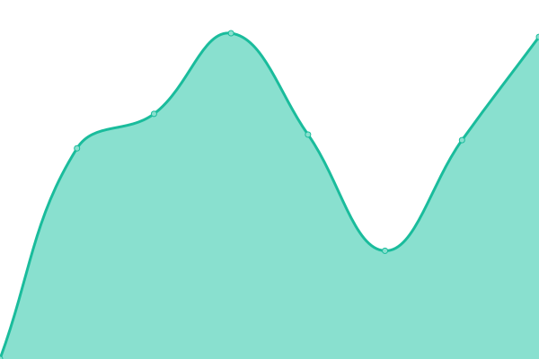 2036ms
     
 | 

<a href="https://PatLittle.github.io/Consultations-Tracker/history/consultation-on-foramsulfuron-and-its-associated-end-use-products-proposed-re-evaluation-decision-prvd-2024-04">100.00%</a>
    

|  [Consultation on Lymantria dispar multicapsid nucleopolyhedrovirus strain LDP-67 and BoVir, Proposed Registration Decision PRD2024-05](https://www.canada.ca/en/health-canada/services/consumer-product-safety/pesticides-pest-management/public/consultations/proposed-registration-decisions/2024/lymantria-dispar-multicapsid-nucleopolyhedrovirus.html) | 🟩 Up | [consultation-on-lymantria-dispar-multicapsid-nucleopolyhedrovirus-strain-ldp-67-and-bo-vir-proposed-registration-decision-prd-2024-05.yml](https://github.com/PatLittle/Consultations-Tracker/commits/HEAD/history/consultation-on-lymantria-dispar-multicapsid-nucleopolyhedrovirus-strain-ldp-67-and-bo-vir-proposed-registration-decision-prd-2024-05.yml) | 

 2870ms
     
 | 

<a href="https://PatLittle.github.io/Consultations-Tracker/history/consultation-on-lymantria-dispar-multicapsid-nucleopolyhedrovirus-strain-ldp-67-and-bo-vir-proposed-registration-decision-prd-2024-05">100.00%</a>
    

|  [Consultation on fluopyram, Proposed Maximum Residue Limit PMRL2024-04](https://www.canada.ca/en/health-canada/services/consumer-product-safety/pesticides-pest-management/public/consultations/proposed-maximum-residue-limit/2024/fluopyram.html) | 🟩 Up | [consultation-on-fluopyram-proposed-maximum-residue-limit-pmrl-2024-04.yml](https://github.com/PatLittle/Consultations-Tracker/commits/HEAD/history/consultation-on-fluopyram-proposed-maximum-residue-limit-pmrl-2024-04.yml) | 

 2213ms
     
 | 

<a href="https://PatLittle.github.io/Consultations-Tracker/history/consultation-on-fluopyram-proposed-maximum-residue-limit-pmrl-2024-04">100.00%</a>
    

|  [Consultation on trifloxystrobin, Proposed Maximum Residue Limit PMRL2024-05](https://www.canada.ca/en/health-canada/services/consumer-product-safety/pesticides-pest-management/public/consultations/proposed-maximum-residue-limit/2024/trifloxystrobin.html) | 🟩 Up | [consultation-on-trifloxystrobin-proposed-maximum-residue-limit-pmrl-2024-05.yml](https://github.com/PatLittle/Consultations-Tracker/commits/HEAD/history/consultation-on-trifloxystrobin-proposed-maximum-residue-limit-pmrl-2024-05.yml) | 

 2922ms
     
 | 

<a href="https://PatLittle.github.io/Consultations-Tracker/history/consultation-on-trifloxystrobin-proposed-maximum-residue-limit-pmrl-2024-05">100.00%</a>
    

|  [Share your thoughts: Public Health Agency of Canada Science Strategy](https://www.canada.ca/en/public-health/programs/consultation-public-health-agency-science-strategy.html) | 🟩 Up | [share-your-thoughts-public-health-agency-of-canada-science-strategy.yml](https://github.com/PatLittle/Consultations-Tracker/commits/HEAD/history/share-your-thoughts-public-health-agency-of-canada-science-strategy.yml) | 

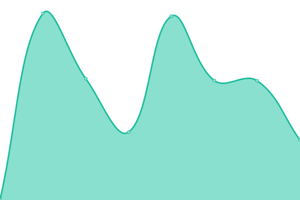 1590ms
     
 | 

<a href="https://PatLittle.github.io/Consultations-Tracker/history/share-your-thoughts-public-health-agency-of-canada-science-strategy">100.00%</a>
    

|  [Consultation on picarbutrazox, Proposed Maximum Residue Limit PMRL2024-06](https://www.canada.ca/en/health-canada/services/consumer-product-safety/pesticides-pest-management/public/consultations/proposed-maximum-residue-limit/2024/picarbutrazox.html) | 🟩 Up | [consultation-on-picarbutrazox-proposed-maximum-residue-limit-pmrl-2024-06.yml](https://github.com/PatLittle/Consultations-Tracker/commits/HEAD/history/consultation-on-picarbutrazox-proposed-maximum-residue-limit-pmrl-2024-06.yml) | 

 2180ms
     
 | 

<a href="https://PatLittle.github.io/Consultations-Tracker/history/consultation-on-picarbutrazox-proposed-maximum-residue-limit-pmrl-2024-06">100.00%</a>
    

|  [Consultation on dichlorprop, Proposed Maximum Residue Limit PMRL2024-07](https://www.canada.ca/en/health-canada/services/consumer-product-safety/pesticides-pest-management/public/consultations/proposed-maximum-residue-limit/2024/dichlorprop.html) | 🟩 Up | [consultation-on-dichlorprop-proposed-maximum-residue-limit-pmrl-2024-07.yml](https://github.com/PatLittle/Consultations-Tracker/commits/HEAD/history/consultation-on-dichlorprop-proposed-maximum-residue-limit-pmrl-2024-07.yml) | 

 1834ms
     
 | 

<a href="https://PatLittle.github.io/Consultations-Tracker/history/consultation-on-dichlorprop-proposed-maximum-residue-limit-pmrl-2024-07">100.00%</a>
    

|  [Proposal to remove brominated vegetable oil from the List of permitted food additives with other accepted uses](https://www.canada.ca/en/health-canada/services/food-nutrition/public-involvement-partnerships/proposal-remove-brominated-vegetable-oil-list-permitted-food-additives-other-accepted-uses.html) | 🟩 Up | [proposal-to-remove-brominated-vegetable-oil-from-the-list-of-permitted-food-additives-with-other-accepted-uses.yml](https://github.com/PatLittle/Consultations-Tracker/commits/HEAD/history/proposal-to-remove-brominated-vegetable-oil-from-the-list-of-permitted-food-additives-with-other-accepted-uses.yml) | 

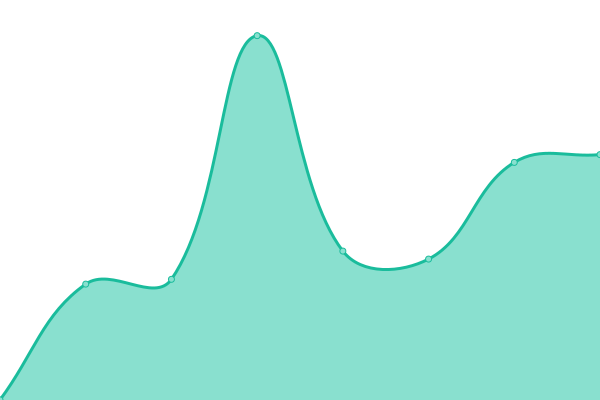 2209ms
     
 | 

<a href="https://PatLittle.github.io/Consultations-Tracker/history/proposal-to-remove-brominated-vegetable-oil-from-the-list-of-permitted-food-additives-with-other-accepted-uses">100.00%</a>
    

|  [Health Canada and United States Food and Drug Administration Joint Public Consultation on the International Council for Harmonisation of Technical Requirements for Pharmaceuticals for Human Use (ICH) Guidelines](https://www.canada.ca/en/health-canada/services/drugs-health-products/drug-products/applications-submissions/guidance-documents/international-council-harmonisation/consultations-notices.html) | 🟩 Up | [health-canada-and-united-states-food-and-drug-administration-joint-public-consultation-on-the-international-council-for-harmonisation-of-technical-requirements-for-pharmaceuticals-for-human-use-ich-guidelines.yml](https://github.com/PatLittle/Consultations-Tracker/commits/HEAD/history/health-canada-and-united-states-food-and-drug-administration-joint-public-consultation-on-the-international-council-for-harmonisation-of-technical-requirements-for-pharmaceuticals-for-human-use-ich-guidelines.yml) | 

 1580ms
     
 | 

<a href="https://PatLittle.github.io/Consultations-Tracker/history/health-canada-and-united-states-food-and-drug-administration-joint-public-consultation-on-the-international-council-for-harmonisation-of-technical-requirements-for-pharmaceuticals-for-human-use-ich-guidelines">100.00%</a>
    

|  [Regulations Amending the Immigration and Refugee Protection Regulations (Temporary Foreign Workers)](https://gazette.gc.ca/rp-pr/p1/2021/2021-07-10/html/reg2-eng.html) | 🟩 Up | [regulations-amending-the-immigration-and-refugee-protection-regulations-temporary-foreign-workers.yml](https://github.com/PatLittle/Consultations-Tracker/commits/HEAD/history/regulations-amending-the-immigration-and-refugee-protection-regulations-temporary-foreign-workers.yml) | 

 229ms
     
 | 

<a href="https://PatLittle.github.io/Consultations-Tracker/history/regulations-amending-the-immigration-and-refugee-protection-regulations-temporary-foreign-workers">100.00%</a>
    

|  [Public noticeGreat Bear Gold ProjectPublic Comments Invited on the Draft Tailored Impact Statement Guidelines and Public Participation Plan](https://iaac-aeic.gc.ca/050/evaluations/document/157305?culture=en-CA) | 🟩 Up | [public-notice-great-bear-gold-project-public-comments-invited-on-the-draft-tailored-impact-statement-guidelines-and-public-participation-plan.yml](https://github.com/PatLittle/Consultations-Tracker/commits/HEAD/history/public-notice-great-bear-gold-project-public-comments-invited-on-the-draft-tailored-impact-statement-guidelines-and-public-participation-plan.yml) | 

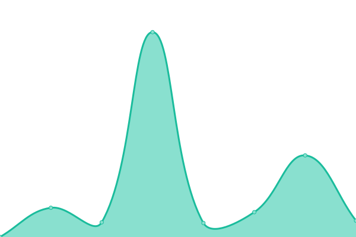 806ms
     
 | 

<a href="https://PatLittle.github.io/Consultations-Tracker/history/public-notice-great-bear-gold-project-public-comments-invited-on-the-draft-tailored-impact-statement-guidelines-and-public-participation-plan">100.00%</a>
    

|  [Indian Oil and Gas Regulations - Phase II](http://www.pgic-iogc.gc.ca/eng/1471964522302/1471964567990) | 🟩 Up | [indian-oil-and-gas-regulations-phase-ii.yml](https://github.com/PatLittle/Consultations-Tracker/commits/HEAD/history/indian-oil-and-gas-regulations-phase-ii.yml) | 

 595ms
     
 | 

<a href="https://PatLittle.github.io/Consultations-Tracker/history/indian-oil-and-gas-regulations-phase-ii">100.00%</a>
    

|  [Indigenous Procurement Modernization (including Procurement Strategy for Aboriginal Business)](https://www.aadnc-aandc.gc.ca/eng/1554218527634/1554218554486) | 🟩 Up | [indigenous-procurement-modernization-including-procurement-strategy-for-aboriginal-business.yml](https://github.com/PatLittle/Consultations-Tracker/commits/HEAD/history/indigenous-procurement-modernization-including-procurement-strategy-for-aboriginal-business.yml) | 

 2705ms
     
 | 

<a href="https://PatLittle.github.io/Consultations-Tracker/history/indigenous-procurement-modernization-including-procurement-strategy-for-aboriginal-business">100.00%</a>
    

|  [Developing laws and regulations for First Nations drinking water and wastewater: engagement 2022/2023](Developing laws and regulations for First Nations drinking water and wastewaterengagement 2022/2023 (sac-isc.gc.ca)) | 🟥 Down | [developing-laws-and-regulations-for-first-nations-drinking-water-and-wastewater-engagement-2022-2023.yml](https://github.com/PatLittle/Consultations-Tracker/commits/HEAD/history/developing-laws-and-regulations-for-first-nations-drinking-water-and-wastewater-engagement-2022-2023.yml) | 

 0ms
     
 | 

<a href="https://PatLittle.github.io/Consultations-Tracker/history/developing-laws-and-regulations-for-first-nations-drinking-water-and-wastewater-engagement-2022-2023">100.00%</a>
    

|  [Engagement 2023: Updating the Protocol For Centralised Drinking Water Systems in First Nations communities](https://www.sac-isc.gc.ca/eng/1689939603075/1689939693020) | 🟩 Up | [engagement-2023-updating-the-protocol-for-centralised-drinking-water-systems-in-first-nations-communities.yml](https://github.com/PatLittle/Consultations-Tracker/commits/HEAD/history/engagement-2023-updating-the-protocol-for-centralised-drinking-water-systems-in-first-nations-communities.yml) | 

 0ms
     
 | 

<a href="https://PatLittle.github.io/Consultations-Tracker/history/engagement-2023-updating-the-protocol-for-centralised-drinking-water-systems-in-first-nations-communities">100.00%</a>
    

|  [National Infrastructure Assessment](https://www.infrastructure.gc.ca/nia-eni/index-eng.html) | 🟩 Up | [national-infrastructure-assessment.yml](https://github.com/PatLittle/Consultations-Tracker/commits/HEAD/history/national-infrastructure-assessment.yml) | 

 214ms
     
 | 

<a href="https://PatLittle.github.io/Consultations-Tracker/history/national-infrastructure-assessment">100.00%</a>
    

|  [Competition Bureau invites feedback on changes to the Textile Labelling and Advertising Regulations](https://www.ic.gc.ca/eic/site/cb-bc.nsf/eng/h_00142.html) | 🟩 Up | [competition-bureau-invites-feedback-on-changes-to-the-textile-labelling-and-advertising-regulations.yml](https://github.com/PatLittle/Consultations-Tracker/commits/HEAD/history/competition-bureau-invites-feedback-on-changes-to-the-textile-labelling-and-advertising-regulations.yml) | 

 1574ms
     
 | 

<a href="https://PatLittle.github.io/Consultations-Tracker/history/competition-bureau-invites-feedback-on-changes-to-the-textile-labelling-and-advertising-regulations">100.00%</a>
    

|  [Canada Gazette, Part I: Public Consultations on proposed changes to the Patent Rules and Trademark Regulations in regards to the creation of the College of Patent Agents and Trademark Agents , as part of Budget Implementation Act, 2018, No. 2.](Not yet available) | 🟥 Down | [canada-gazette-part-i-public-consultations-on-proposed-changes-to-the-patent-rules-and-trademark-regulations-in-regards-to-the-creation-of-the-college-of-patent-agents-and-trademark-agents-as-part-of-budget-implementation-act-2018-no-2.yml](https://github.com/PatLittle/Consultations-Tracker/commits/HEAD/history/canada-gazette-part-i-public-consultations-on-proposed-changes-to-the-patent-rules-and-trademark-regulations-in-regards-to-the-creation-of-the-college-of-patent-agents-and-trademark-agents-as-part-of-budget-implementation-act-2018-no-2.yml) | 

 0ms
     
 | 

<a href="https://PatLittle.github.io/Consultations-Tracker/history/canada-gazette-part-i-public-consultations-on-proposed-changes-to-the-patent-rules-and-trademark-regulations-in-regards-to-the-creation-of-the-college-of-patent-agents-and-trademark-agents-as-part-of-budget-implementation-act-2018-no-2">100.00%</a>
    

|  [Notice No. TIPB-001-2024 — Petition to the Governor in Council concerning Telecom Decision CRTC 2023-358](https://canadagazette.gc.ca/rp-pr/p1/2024/2024-04-27/pdf/g1-15817.pdf) | 🟩 Up | [notice-no-tipb-001-2024-petition-to-the-governor-in-council-concerning-telecom-decision-crtc-2023-358.yml](https://github.com/PatLittle/Consultations-Tracker/commits/HEAD/history/notice-no-tipb-001-2024-petition-to-the-governor-in-council-concerning-telecom-decision-crtc-2023-358.yml) | 

 470ms
     
 | 

<a href="https://PatLittle.github.io/Consultations-Tracker/history/notice-no-tipb-001-2024-petition-to-the-governor-in-council-concerning-telecom-decision-crtc-2023-358">100.00%</a>
    

|  [Amendments to Directive No 11R3, Surplus Income Directive](https://ised-isde.canada.ca/site/office-superintendent-bankruptcy/en/public-consultations) | 🟩 Up | [amendments-to-directive-no-11-r3-surplus-income-directive.yml](https://github.com/PatLittle/Consultations-Tracker/commits/HEAD/history/amendments-to-directive-no-11-r3-surplus-income-directive.yml) | 

 72ms
     
 | 

<a href="https://PatLittle.github.io/Consultations-Tracker/history/amendments-to-directive-no-11-r3-surplus-income-directive">100.00%</a>
    

|  [Proposed Amendments to Directive No 23, Publication in Local Newspaper](https://ised-isde.canada.ca/site/office-superintendent-bankruptcy/en/public-consultations) | 🟩 Up | [proposed-amendments-to-directive-no-23-publication-in-local-newspaper.yml](https://github.com/PatLittle/Consultations-Tracker/commits/HEAD/history/proposed-amendments-to-directive-no-23-publication-in-local-newspaper.yml) | 

 0ms
     
 | 

<a href="https://PatLittle.github.io/Consultations-Tracker/history/proposed-amendments-to-directive-no-23-publication-in-local-newspaper">100.00%</a>
    

|  [Consultation Relating to the Use of Radiocommunication Devices in Auto Theft](https://ised-isde.canada.ca/site/spectrum-management-telecommunications/en/node/2103) | 🟩 Up | [consultation-relating-to-the-use-of-radiocommunication-devices-in-auto-theft.yml](https://github.com/PatLittle/Consultations-Tracker/commits/HEAD/history/consultation-relating-to-the-use-of-radiocommunication-devices-in-auto-theft.yml) | 

 0ms
     
 | 

<a href="https://PatLittle.github.io/Consultations-Tracker/history/consultation-relating-to-the-use-of-radiocommunication-devices-in-auto-theft">100.00%</a>
    

|  [Indigenous Advisory Circle](https://library-archives.canada.ca/eng/corporate/about-us/our-partners/Pages/indigenous-advisory-circle.aspx) | 🟩 Up | [indigenous-advisory-circle.yml](https://github.com/PatLittle/Consultations-Tracker/commits/HEAD/history/indigenous-advisory-circle.yml) | 

 447ms
     
 | 

<a href="https://PatLittle.github.io/Consultations-Tracker/history/indigenous-advisory-circle">100.00%</a>
    

|  [Stakeholders' Forum](https://library-archives.canada.ca/eng/corporate/about-us/our-partners/pages/stakeholders-forum.aspx) | 🟩 Up | [stakeholders-forum.yml](https://github.com/PatLittle/Consultations-Tracker/commits/HEAD/history/stakeholders-forum.yml) | 

 289ms
     
 | 

<a href="https://PatLittle.github.io/Consultations-Tracker/history/stakeholders-forum">100.00%</a>
    

|  [Services Consultation Committee](https://library-archives.canada.ca/eng/corporate/about-us/our-partners/Pages/services-consultation-group.aspx) | 🟩 Up | [services-consultation-committee.yml](https://github.com/PatLittle/Consultations-Tracker/commits/HEAD/history/services-consultation-committee.yml) | 

 367ms
     
 | 

<a href="https://PatLittle.github.io/Consultations-Tracker/history/services-consultation-committee">100.00%</a>
    

|  [Youth Advisory Council](https://library-archives.canada.ca/eng/corporate/about-us/our-partners/Pages/youth-advisory-council.aspx) | 🟩 Up | [youth-advisory-council.yml](https://github.com/PatLittle/Consultations-Tracker/commits/HEAD/history/youth-advisory-council.yml) | 

 329ms
     
 | 

<a href="https://PatLittle.github.io/Consultations-Tracker/history/youth-advisory-council">100.00%</a>
    

|  [Consultation to inform the regulatory development to support the implementation of An Act to amend the National Defence Act and to make related and consequential amendments to other Acts](https://www.canada.ca/en/department-national-defence/services/benefits-military/legal-services/victim-service-offence.html) | 🟩 Up | [consultation-to-inform-the-regulatory-development-to-support-the-implementation-of-an-act-to-amend-the-national-defence-act-and-to-make-related-and-consequential-amendments-to-other-acts.yml](https://github.com/PatLittle/Consultations-Tracker/commits/HEAD/history/consultation-to-inform-the-regulatory-development-to-support-the-implementation-of-an-act-to-amend-the-national-defence-act-and-to-make-related-and-consequential-amendments-to-other-acts.yml) | 

 2256ms
     
 | 

<a href="https://PatLittle.github.io/Consultations-Tracker/history/consultation-to-inform-the-regulatory-development-to-support-the-implementation-of-an-act-to-amend-the-national-defence-act-and-to-make-related-and-consequential-amendments-to-other-acts">100.00%</a>
    

|  [Consultation to inform the regulatory development to support the implementation of An Act to amend the National Defence Act and to make related and consequential amendments to other Acts](https://www.canada.ca/en/department-national-defence/services/benefits-military/legal-services/victim-service-offence.html) | 🟩 Up | [consultation-to-inform-the-regulatory-development-to-support-the-implementation-of-an-act-to-amend-the-national-defence-act-and-to-make-related-and-consequential-amendments-to-other-acts.yml](https://github.com/PatLittle/Consultations-Tracker/commits/HEAD/history/consultation-to-inform-the-regulatory-development-to-support-the-implementation-of-an-act-to-amend-the-national-defence-act-and-to-make-related-and-consequential-amendments-to-other-acts.yml) | 

 2256ms
     
 | 

<a href="https://PatLittle.github.io/Consultations-Tracker/history/consultation-to-inform-the-regulatory-development-to-support-the-implementation-of-an-act-to-amend-the-national-defence-act-and-to-make-related-and-consequential-amendments-to-other-acts">100.00%</a>
    

|  [Social systems professional services](www.marsdd.com) | 🟩 Up | [social-systems-professional-services.yml](https://github.com/PatLittle/Consultations-Tracker/commits/HEAD/history/social-systems-professional-services.yml) | 

 277ms
     
 | 

<a href="https://PatLittle.github.io/Consultations-Tracker/history/social-systems-professional-services">100.00%</a>
    

|  [Pedestrian pathway - NRC Uplands campus](https://iaac-aeic.gc.ca/050/evaluations/proj/88478?culture=en-CA) | 🟩 Up | [pedestrian-pathway-nrc-uplands-campus.yml](https://github.com/PatLittle/Consultations-Tracker/commits/HEAD/history/pedestrian-pathway-nrc-uplands-campus.yml) | 

 3550ms
     
 | 

<a href="https://PatLittle.github.io/Consultations-Tracker/history/pedestrian-pathway-nrc-uplands-campus">98.29%</a>
    

|  [The Offshore Renewable Energy Regulations Initiative](https://www.rncanengagenrcan.ca/en/collections/offshore-renewable-energy-regulations-initiative) | 🟩 Up | [the-offshore-renewable-energy-regulations-initiative.yml](https://github.com/PatLittle/Consultations-Tracker/commits/HEAD/history/the-offshore-renewable-energy-regulations-initiative.yml) | 

 355ms
     
 | 

<a href="https://PatLittle.github.io/Consultations-Tracker/history/the-offshore-renewable-energy-regulations-initiative">100.00%</a>
    

|  [Indigenous Ministerial Arrangements Regulations](https://www.rncanengagenrcan.ca/en/content/development-new-indigenous-ministerial-arrangements-regulations) | 🟩 Up | [indigenous-ministerial-arrangements-regulations.yml](https://github.com/PatLittle/Consultations-Tracker/commits/HEAD/history/indigenous-ministerial-arrangements-regulations.yml) | 

 94ms
     
 | 

<a href="https://PatLittle.github.io/Consultations-Tracker/history/indigenous-ministerial-arrangements-regulations">100.00%</a>
    

|  [General Regulations under the Canada National Marine Conservation Areas Act](https://www.letstalknmcas.ca/) | 🟩 Up | [general-regulations-under-the-canada-national-marine-conservation-areas-act.yml](https://github.com/PatLittle/Consultations-Tracker/commits/HEAD/history/general-regulations-under-the-canada-national-marine-conservation-areas-act.yml) | 

 1574ms
     
 | 

<a href="https://PatLittle.github.io/Consultations-Tracker/history/general-regulations-under-the-canada-national-marine-conservation-areas-act">100.00%</a>
    

|  [Notice of Mooring Restrictions – Ontario Waterways - Trent-Severn Waterway National Historic Site](https://parks.canada.ca/lhn-nhs/on/trentsevern/info/avis-restrictions-amarrage-notice-mooring-restrictions/) | 🟩 Up | [notice-of-mooring-restrictions-ontario-waterways-trent-severn-waterway-national-historic-site.yml](https://github.com/PatLittle/Consultations-Tracker/commits/HEAD/history/notice-of-mooring-restrictions-ontario-waterways-trent-severn-waterway-national-historic-site.yml) | 

 816ms
     
 | 

<a href="https://PatLittle.github.io/Consultations-Tracker/history/notice-of-mooring-restrictions-ontario-waterways-trent-severn-waterway-national-historic-site">100.00%</a>
    

|  [Notice of Mooring Restrictions – Ontario Waterways - Rideau Canal National Historic Site](https://parks.canada.ca/lhn-nhs/on/rideau/info/avis-restrictions-amarrage-notice-mooring-restrictions/) | 🟩 Up | [notice-of-mooring-restrictions-ontario-waterways-rideau-canal-national-historic-site.yml](https://github.com/PatLittle/Consultations-Tracker/commits/HEAD/history/notice-of-mooring-restrictions-ontario-waterways-rideau-canal-national-historic-site.yml) | 

 585ms
     
 | 

<a href="https://PatLittle.github.io/Consultations-Tracker/history/notice-of-mooring-restrictions-ontario-waterways-rideau-canal-national-historic-site">100.00%</a>
    

|  [Fortress of Louisbourg National Historic Site Management Plan](https://www.pc.gc.ca/en/lhn-nhs/ns/louisbourg/info/plan) | 🟩 Up | [fortress-of-louisbourg-national-historic-site-management-plan.yml](https://github.com/PatLittle/Consultations-Tracker/commits/HEAD/history/fortress-of-louisbourg-national-historic-site-management-plan.yml) | 

 699ms
     
 | 

<a href="https://PatLittle.github.io/Consultations-Tracker/history/fortress-of-louisbourg-national-historic-site-management-plan">100.00%</a>
    

|  [Consultations on Foreign Interference](https://www.canada.ca/en/services/defence/nationalsecurity/consulting-canadians-countering-foreign-interference.html) | 🟩 Up | [consultations-on-foreign-interference.yml](https://github.com/PatLittle/Consultations-Tracker/commits/HEAD/history/consultations-on-foreign-interference.yml) | 

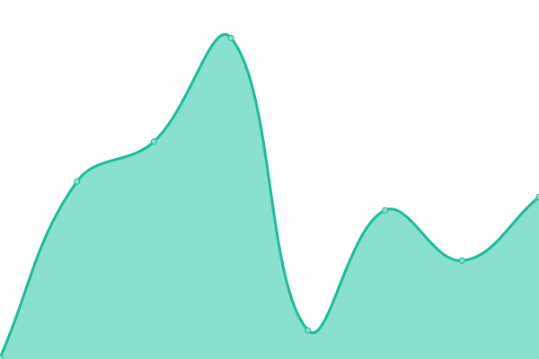 2060ms
     
 | 

<a href="https://PatLittle.github.io/Consultations-Tracker/history/consultations-on-foreign-interference">100.00%</a>
    

|  [PSPC Controlled Goods Program’s Industry Engagement Committee (IEC)](https://www.tpsgc-pwgsc.gc.ca/pmc-cgp/pipmc-secgp-eng.html) | 🟩 Up | [pspc-controlled-goods-program-s-industry-engagement-committee-iec.yml](https://github.com/PatLittle/Consultations-Tracker/commits/HEAD/history/pspc-controlled-goods-program-s-industry-engagement-committee-iec.yml) | 

 235ms
     
 | 

<a href="https://PatLittle.github.io/Consultations-Tracker/history/pspc-controlled-goods-program-s-industry-engagement-committee-iec">100.00%</a>
    

|  [Providing green energy services to buildings in the National Capital Region (NCR) beyond the Federal Government Portfolio](https://www.tpsgc-pwgsc.gc.ca/trans/documentinfo-briefingmaterial/proc/2020_02_27/p15-eng.html#a3) | 🟩 Up | [providing-green-energy-services-to-buildings-in-the-national-capital-region-ncr-beyond-the-federal-government-portfolio.yml](https://github.com/PatLittle/Consultations-Tracker/commits/HEAD/history/providing-green-energy-services-to-buildings-in-the-national-capital-region-ncr-beyond-the-federal-government-portfolio.yml) | 

 0ms
     
 | 

<a href="https://PatLittle.github.io/Consultations-Tracker/history/providing-green-energy-services-to-buildings-in-the-national-capital-region-ncr-beyond-the-federal-government-portfolio">100.00%</a>
    

|  [Three-year Departmental Accessibility Plan](na) | 🟥 Down | [three-year-departmental-accessibility-plan.yml](https://github.com/PatLittle/Consultations-Tracker/commits/HEAD/history/three-year-departmental-accessibility-plan.yml) | 

 0ms
     
 | 

<a href="https://PatLittle.github.io/Consultations-Tracker/history/three-year-departmental-accessibility-plan">100.00%</a>
    

|  [Alexandra Bridge Replacement Project](https://ncc-ccn.gc.ca/projects/alexandra-bridge-replacement#) | 🟩 Up | [alexandra-bridge-replacement-project.yml](https://github.com/PatLittle/Consultations-Tracker/commits/HEAD/history/alexandra-bridge-replacement-project.yml) | 

 321ms
     
 | 

<a href="https://PatLittle.github.io/Consultations-Tracker/history/alexandra-bridge-replacement-project">100.00%</a>
    

|  [Multifactor Productivity Application](https://www.statcan.gc.ca/eng/consultation/2019/mpa) | 🟩 Up | [multifactor-productivity-application.yml](https://github.com/PatLittle/Consultations-Tracker/commits/HEAD/history/multifactor-productivity-application.yml) | 

 372ms
     
 | 

<a href="https://PatLittle.github.io/Consultations-Tracker/history/multifactor-productivity-application">100.00%</a>
    

|  [Statistics Canada Client Survey 2022](https://www.statcan.gc.ca/en/consultation/2022/sccs2022) | 🟩 Up | [statistics-canada-client-survey-2022.yml](https://github.com/PatLittle/Consultations-Tracker/commits/HEAD/history/statistics-canada-client-survey-2022.yml) | 

 202ms
     
 | 

<a href="https://PatLittle.github.io/Consultations-Tracker/history/statistics-canada-client-survey-2022">100.00%</a>
    

|  [Census of the Environment Program](https://www.statcan.gc.ca/en/consultation/2022/coep) | 🟩 Up | [census-of-the-environment-program.yml](https://github.com/PatLittle/Consultations-Tracker/commits/HEAD/history/census-of-the-environment-program.yml) | 

 110ms
     
 | 

<a href="https://PatLittle.github.io/Consultations-Tracker/history/census-of-the-environment-program">100.00%</a>
    

|  [Missing persons data standards consultative engagement](https://www.statcan.gc.ca/en/consultation/2023/missing-persons-data-standards) | 🟩 Up | [missing-persons-data-standards-consultative-engagement.yml](https://github.com/PatLittle/Consultations-Tracker/commits/HEAD/history/missing-persons-data-standards-consultative-engagement.yml) | 

 66ms
     
 | 

<a href="https://PatLittle.github.io/Consultations-Tracker/history/missing-persons-data-standards-consultative-engagement">100.00%</a>
    

|  [Statistics Canada's data products consultative engagement](https://www.statcan.gc.ca/en/consultation/2023/stdp) | 🟩 Up | [statistics-canada-s-data-products-consultative-engagement.yml](https://github.com/PatLittle/Consultations-Tracker/commits/HEAD/history/statistics-canada-s-data-products-consultative-engagement.yml) | 

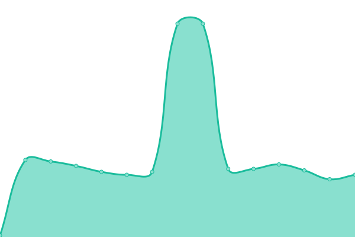 71ms
     
 | 

<a href="https://PatLittle.github.io/Consultations-Tracker/history/statistics-canada-s-data-products-consultative-engagement">100.00%</a>
    

|  [Census Data on Demand (CDOD) program consultative engagement](https://www.statcan.gc.ca/en/consultation/2023/census-data-on-demand) | 🟩 Up | [census-data-on-demand-cdod-program-consultative-engagement.yml](https://github.com/PatLittle/Consultations-Tracker/commits/HEAD/history/census-data-on-demand-cdod-program-consultative-engagement.yml) | 

 111ms
     
 | 

<a href="https://PatLittle.github.io/Consultations-Tracker/history/census-data-on-demand-cdod-program-consultative-engagement">100.00%</a>
    

|  [Invitation to participate in the revision of the North American Industry Classification System (NAICS) Canada](https://www.statcan.gc.ca/en/consultation/2023/naics) | 🟩 Up | [invitation-to-participate-in-the-revision-of-the-north-american-industry-classification-system-naics-canada.yml](https://github.com/PatLittle/Consultations-Tracker/commits/HEAD/history/invitation-to-participate-in-the-revision-of-the-north-american-industry-classification-system-naics-canada.yml) | 

 0ms
     
 | 

<a href="https://PatLittle.github.io/Consultations-Tracker/history/invitation-to-participate-in-the-revision-of-the-north-american-industry-classification-system-naics-canada">100.00%</a>
    

|  [Invitation to participate in the revision of the North American Product Classification System (NAPCS) Canada](https://www.statcan.gc.ca/en/consultation/2023/napcs) | 🟩 Up | [invitation-to-participate-in-the-revision-of-the-north-american-product-classification-system-napcs-canada.yml](https://github.com/PatLittle/Consultations-Tracker/commits/HEAD/history/invitation-to-participate-in-the-revision-of-the-north-american-product-classification-system-napcs-canada.yml) | 

 0ms
     
 | 

<a href="https://PatLittle.github.io/Consultations-Tracker/history/invitation-to-participate-in-the-revision-of-the-north-american-product-classification-system-napcs-canada">100.00%</a>
    

|  [Market Basket Measure of poverty (2023-base) consultative engagement](https://www.statcan.gc.ca/en/consultation/2023/mbm-poverty) | 🟩 Up | [market-basket-measure-of-poverty-2023-base-consultative-engagement.yml](https://github.com/PatLittle/Consultations-Tracker/commits/HEAD/history/market-basket-measure-of-poverty-2023-base-consultative-engagement.yml) | 

 470ms
     
 | 

<a href="https://PatLittle.github.io/Consultations-Tracker/history/market-basket-measure-of-poverty-2023-base-consultative-engagement">100.00%</a>
    

|  [Statistics Canada's data products consultative engagement](https://www.statcan.gc.ca/en/consultation/2023/stdp) | 🟩 Up | [statistics-canada-s-data-products-consultative-engagement.yml](https://github.com/PatLittle/Consultations-Tracker/commits/HEAD/history/statistics-canada-s-data-products-consultative-engagement.yml) | 

 71ms
     
 | 

<a href="https://PatLittle.github.io/Consultations-Tracker/history/statistics-canada-s-data-products-consultative-engagement">100.00%</a>
    

|  [Share your input on Canada’s Oral Health Statistics Program](https://www.statcan.gc.ca/en/consultation/2023/oral-health) | 🟩 Up | [share-your-input-on-canada-s-oral-health-statistics-program.yml](https://github.com/PatLittle/Consultations-Tracker/commits/HEAD/history/share-your-input-on-canada-s-oral-health-statistics-program.yml) | 

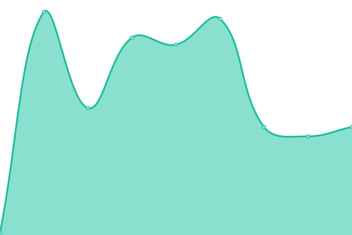 58ms
     
 | 

<a href="https://PatLittle.github.io/Consultations-Tracker/history/share-your-input-on-canada-s-oral-health-statistics-program">100.00%</a>
    

|  [2026 Census of Population dissemination consultative engagement](https://www.statcan.gc.ca/en/consultation/2023/census-of-population2026) | 🟥 Down | [2026-census-of-population-dissemination-consultative-engagement.yml](https://github.com/PatLittle/Consultations-Tracker/commits/HEAD/history/2026-census-of-population-dissemination-consultative-engagement.yml) | 

 109ms
     
 | 

<a href="https://PatLittle.github.io/Consultations-Tracker/history/2026-census-of-population-dissemination-consultative-engagement">100.00%</a>
    

|  [Invitation to participate in a flood awareness consultative engagement](https://www.statcan.gc.ca/en/consultation/2024/flood-awareness) | 🟩 Up | [invitation-to-participate-in-a-flood-awareness-consultative-engagement.yml](https://github.com/PatLittle/Consultations-Tracker/commits/HEAD/history/invitation-to-participate-in-a-flood-awareness-consultative-engagement.yml) | 

 0ms
     
 | 

<a href="https://PatLittle.github.io/Consultations-Tracker/history/invitation-to-participate-in-a-flood-awareness-consultative-engagement">100.00%</a>
    

|  [Watchlist 2020 mid-cycle consultation with industry](https://www.tsb.gc.ca/eng/qui-about/relation.html) | 🟩 Up | [watchlist-2020-mid-cycle-consultation-with-industry.yml](https://github.com/PatLittle/Consultations-Tracker/commits/HEAD/history/watchlist-2020-mid-cycle-consultation-with-industry.yml) | 

 193ms
     
 | 

<a href="https://PatLittle.github.io/Consultations-Tracker/history/watchlist-2020-mid-cycle-consultation-with-industry">100.00%</a>
    

|  [Oceans Protection Plan](https://www.letstalktransportation.ca/OPP) | 🟩 Up | [oceans-protection-plan.yml](https://github.com/PatLittle/Consultations-Tracker/commits/HEAD/history/oceans-protection-plan.yml) | 

 775ms
     
 | 

<a href="https://PatLittle.github.io/Consultations-Tracker/history/oceans-protection-plan">100.00%</a>
    

|  [OPP - Understanding the Cumulative Effects of Marine Vessel Activity on Coastal and Marine Environments](https://letstalktransportation.ca/understanding-the-effects-of-marine-vessel-activity-on-coastal-environments) | 🟩 Up | [opp-understanding-the-cumulative-effects-of-marine-vessel-activity-on-coastal-and-marine-environments.yml](https://github.com/PatLittle/Consultations-Tracker/commits/HEAD/history/opp-understanding-the-cumulative-effects-of-marine-vessel-activity-on-coastal-and-marine-environments.yml) | 

 460ms
     
 | 

<a href="https://PatLittle.github.io/Consultations-Tracker/history/opp-understanding-the-cumulative-effects-of-marine-vessel-activity-on-coastal-and-marine-environments">100.00%</a>
    

|  [OPP: Northern Low-Impact Shipping Corridors](https://www.dfo-mpo.gc.ca/about-notre-sujet/engagement/2021/shipping-corridors-navigation-eng.html) | 🟩 Up | [opp-northern-low-impact-shipping-corridors.yml](https://github.com/PatLittle/Consultations-Tracker/commits/HEAD/history/opp-northern-low-impact-shipping-corridors.yml) | 

 159ms
     
 | 

<a href="https://PatLittle.github.io/Consultations-Tracker/history/opp-northern-low-impact-shipping-corridors">100.00%</a>
    

|  [Let’s Talk: Amendments to the Railway Safety Act in Bill C-33](https://tc.canada.ca/en/corporate-services/consultations/let-s-talk-amendments-railway-safety-act-bill-c-33) | 🟩 Up | [let-s-talk-amendments-to-the-railway-safety-act-in-bill-c-33.yml](https://github.com/PatLittle/Consultations-Tracker/commits/HEAD/history/let-s-talk-amendments-to-the-railway-safety-act-in-bill-c-33.yml) | 

 0ms
     
 | 

<a href="https://PatLittle.github.io/Consultations-Tracker/history/let-s-talk-amendments-to-the-railway-safety-act-in-bill-c-33">100.00%</a>
    

|  [TBD: Updating Technical Standard Documents to accommodate new Standard Reference Test Tire](https://N/A) | 🟥 Down | [tbd-updating-technical-standard-documents-to-accommodate-new-standard-reference-test-tire.yml](https://github.com/PatLittle/Consultations-Tracker/commits/HEAD/history/tbd-updating-technical-standard-documents-to-accommodate-new-standard-reference-test-tire.yml) | 

 0ms
     
 | 

<a href="https://PatLittle.github.io/Consultations-Tracker/history/tbd-updating-technical-standard-documents-to-accommodate-new-standard-reference-test-tire">100.00%</a>
    

|  [TBD: Adopting Global Technical Regulations 13 and 20 for Zero Emission Vehicle Safety (Electric Battery and Hydrogen)](https://N/A) | 🟥 Down | [tbd-adopting-global-technical-regulations-13-and-20-for-zero-emission-vehicle-safety-electric-battery-and-hydrogen.yml](https://github.com/PatLittle/Consultations-Tracker/commits/HEAD/history/tbd-adopting-global-technical-regulations-13-and-20-for-zero-emission-vehicle-safety-electric-battery-and-hydrogen.yml) | 

 0ms
     
 | 

<a href="https://PatLittle.github.io/Consultations-Tracker/history/tbd-adopting-global-technical-regulations-13-and-20-for-zero-emission-vehicle-safety-electric-battery-and-hydrogen">100.00%</a>
    

|  [TBD: Requirements for Automatic Emergency Braking Systems](https://N/A) | 🟥 Down | [tbd-requirements-for-automatic-emergency-braking-systems.yml](https://github.com/PatLittle/Consultations-Tracker/commits/HEAD/history/tbd-requirements-for-automatic-emergency-braking-systems.yml) | 

 0ms
     
 | 

<a href="https://PatLittle.github.io/Consultations-Tracker/history/tbd-requirements-for-automatic-emergency-braking-systems">100.00%</a>
    

|  [TBD: Requirements for Advanced Driver Assistance Systems](https://N/A) | 🟥 Down | [tbd-requirements-for-advanced-driver-assistance-systems.yml](https://github.com/PatLittle/Consultations-Tracker/commits/HEAD/history/tbd-requirements-for-advanced-driver-assistance-systems.yml) | 

 0ms
     
 | 

<a href="https://PatLittle.github.io/Consultations-Tracker/history/tbd-requirements-for-advanced-driver-assistance-systems">100.00%</a>
    

|  [Fee Modernisation Initiative for Transport Canada's Owned and Operated Ports](https://TBD) | 🟥 Down | [fee-modernisation-initiative-for-transport-canada-s-owned-and-operated-ports.yml](https://github.com/PatLittle/Consultations-Tracker/commits/HEAD/history/fee-modernisation-initiative-for-transport-canada-s-owned-and-operated-ports.yml) | 

 0ms
     
 | 

<a href="https://PatLittle.github.io/Consultations-Tracker/history/fee-modernisation-initiative-for-transport-canada-s-owned-and-operated-ports">100.00%</a>
    

|  [Proposed amendments to the Environmental Response Regulations](TBD) | 🟥 Down | [proposed-amendments-to-the-environmental-response-regulations.yml](https://github.com/PatLittle/Consultations-Tracker/commits/HEAD/history/proposed-amendments-to-the-environmental-response-regulations.yml) | 

 0ms
     
 | 

<a href="https://PatLittle.github.io/Consultations-Tracker/history/proposed-amendments-to-the-environmental-response-regulations">100.00%</a>
    

|  [Updated guidelines for passenger vessels operating in the Canadian Arctic](https://NA) | 🟥 Down | [updated-guidelines-for-passenger-vessels-operating-in-the-canadian-arctic.yml](https://github.com/PatLittle/Consultations-Tracker/commits/HEAD/history/updated-guidelines-for-passenger-vessels-operating-in-the-canadian-arctic.yml) | 

 0ms
     
 | 

<a href="https://PatLittle.github.io/Consultations-Tracker/history/updated-guidelines-for-passenger-vessels-operating-in-the-canadian-arctic">100.00%</a>
    

|  [Regulations Amending the Transportation of Dangerous Goods Regulations](https://canadagazette.gc.ca/rp-pr/p1/2023/2023-12-09/html/reg3-eng.html) | 🟩 Up | [regulations-amending-the-transportation-of-dangerous-goods-regulations.yml](https://github.com/PatLittle/Consultations-Tracker/commits/HEAD/history/regulations-amending-the-transportation-of-dangerous-goods-regulations.yml) | 

 253ms
     
 | 

<a href="https://PatLittle.github.io/Consultations-Tracker/history/regulations-amending-the-transportation-of-dangerous-goods-regulations">100.00%</a>
    

|  [Safety Management Systems - Proposed Amendments to Canadian Aviation Regulations](https://wwwapps.tc.gc.ca/Saf-Sec-Sur/2/NPA-APM/npaapmr.aspx?id=3046&GoCTemplateCulture=en-CA) | 🟩 Up | [safety-management-systems-proposed-amendments-to-canadian-aviation-regulations.yml](https://github.com/PatLittle/Consultations-Tracker/commits/HEAD/history/safety-management-systems-proposed-amendments-to-canadian-aviation-regulations.yml) | 

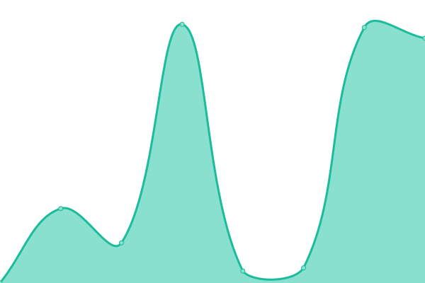 3977ms
     
 | 

<a href="https://PatLittle.github.io/Consultations-Tracker/history/safety-management-systems-proposed-amendments-to-canadian-aviation-regulations">100.00%</a>
    

|  [Canadian Marine Advisory Council - Fall 2024](https://tc.canada.ca/en/marine/canadian-marine-advisory-council-cmac-engagement-opportunity-marine-safety-security-regulations#canada_gazette_1) | 🟩 Up | [canadian-marine-advisory-council-fall-2024.yml](https://github.com/PatLittle/Consultations-Tracker/commits/HEAD/history/canadian-marine-advisory-council-fall-2024.yml) | 

 517ms
     
 | 

<a href="https://PatLittle.github.io/Consultations-Tracker/history/canadian-marine-advisory-council-fall-2024">100.00%</a>
    

|  [Canadian Marine Advisory Council - Fall 2025](https://tc.canada.ca/en/marine/canadian-marine-advisory-council-cmac-engagement-opportunity-marine-safety-security-regulations#canada_gazette_1) | 🟩 Up | [canadian-marine-advisory-council-fall-2025.yml](https://github.com/PatLittle/Consultations-Tracker/commits/HEAD/history/canadian-marine-advisory-council-fall-2025.yml) | 

 59ms
     
 | 

<a href="https://PatLittle.github.io/Consultations-Tracker/history/canadian-marine-advisory-council-fall-2025">100.00%</a>
    

|  [Improving the safety of Pilot Transfer Arrangement](https://tc.canada.ca/en/corporate-services/consultations/improving-safety-pilot-transfer-arrangements) | 🟩 Up | [improving-the-safety-of-pilot-transfer-arrangement.yml](https://github.com/PatLittle/Consultations-Tracker/commits/HEAD/history/improving-the-safety-of-pilot-transfer-arrangement.yml) | 

 477ms
     
 | 

<a href="https://PatLittle.github.io/Consultations-Tracker/history/improving-the-safety-of-pilot-transfer-arrangement">100.00%</a>
    

|  [https://tc.canada.ca/en/corporate-services/consultations/canadian-navigable-waters-act-legislative-review](https://tc.canada.ca/en/corporate-services/consultations/canadian-navigable-waters-act-legislative-review) | 🟩 Up | [https-tc-canada-ca-en-corporate-services-consultations-canadian-navigable-waters-act-legislative-review.yml](https://github.com/PatLittle/Consultations-Tracker/commits/HEAD/history/https-tc-canada-ca-en-corporate-services-consultations-canadian-navigable-waters-act-legislative-review.yml) | 

 713ms
     
 | 

<a href="https://PatLittle.github.io/Consultations-Tracker/history/https-tc-canada-ca-en-corporate-services-consultations-canadian-navigable-waters-act-legislative-review">100.00%</a>
    

|  [Creating Canada’s 6th  National Action Plan on Open Government](http://letstalkopengov.ca) | 🟩 Up | [creating-canada-s-6th-national-action-plan-on-open-government.yml](https://github.com/PatLittle/Consultations-Tracker/commits/HEAD/history/creating-canada-s-6th-national-action-plan-on-open-government.yml) | 

 727ms
     
 | 

<a href="https://PatLittle.github.io/Consultations-Tracker/history/creating-canada-s-6th-national-action-plan-on-open-government">100.00%</a>
    

|  [Creating Canada’s 6th  National Action Plan on Open Government](https://letstalkopengovernment.ca.engagementhq.com/nap-engagement-project) | 🟩 Up | [creating-canada-s-6th-national-action-plan-on-open-government.yml](https://github.com/PatLittle/Consultations-Tracker/commits/HEAD/history/creating-canada-s-6th-national-action-plan-on-open-government.yml) | 

 727ms
     
 | 

<a href="https://PatLittle.github.io/Consultations-Tracker/history/creating-canada-s-6th-national-action-plan-on-open-government">100.00%</a>
    

|  [Supply Chain Regulatory Review - *New closing date*](https://letstalkfederalregulations.ca/) | 🟩 Up | [supply-chain-regulatory-review-new-closing-date.yml](https://github.com/PatLittle/Consultations-Tracker/commits/HEAD/history/supply-chain-regulatory-review-new-closing-date.yml) | 

 1136ms
     
 | 

<a href="https://PatLittle.github.io/Consultations-Tracker/history/supply-chain-regulatory-review-new-closing-date">98.34%</a>
    

<!--end: status pages-->

[**Visit our status website →**](https://demo.upptime.js.org)

## 📄 License

- Powered by: [Upptime](https://github.com/upptime/upptime)
- Code: [MIT](./LICENSE) © [Patrick Little](Open.Canada.ca)
- Data in the `./history` directory: [Open Database License](https://opendatacommons.org/licenses/odbl/1-0/)
