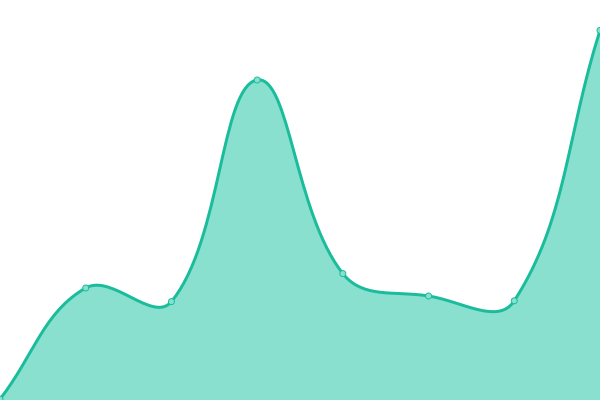
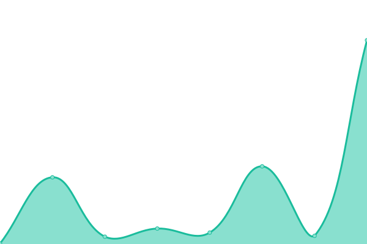
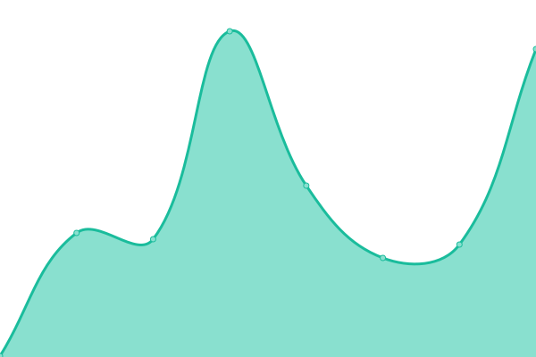
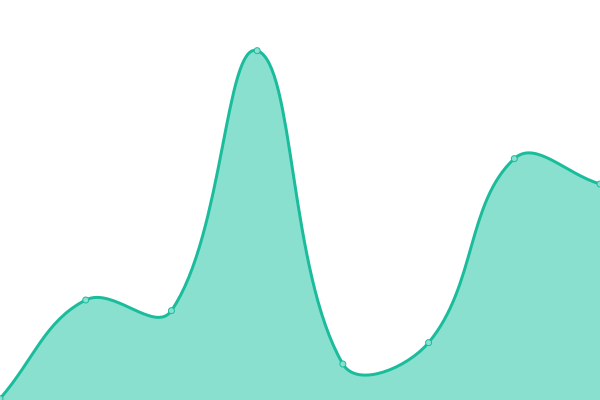
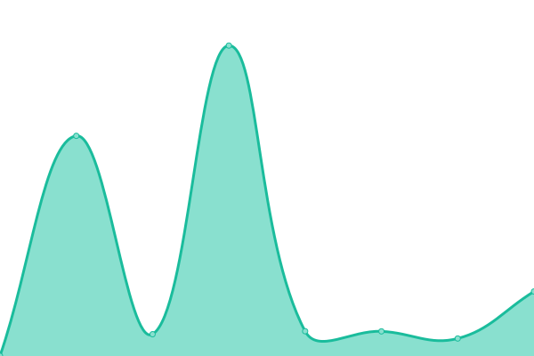
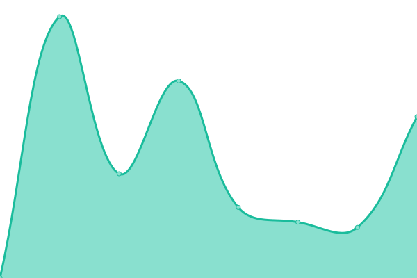
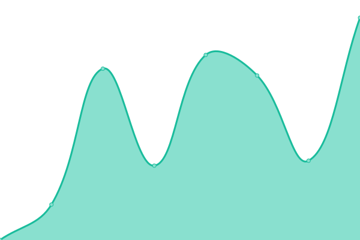

# [📈 Live Status](https://demo.upptime.js.org): <!--live status--> **🟧 Partial outage**

This repository contains the open-source uptime monitor and status page for [Patrick Little](Open.Canada.ca), powered by [Upptime](https://github.com/upptime/upptime).

With [Upptime](https://upptime.js.org), you can get your own unlimited and free uptime monitor and status page, powered entirely by a GitHub repository. We use [Issues](https://github.com/PatLittle/Consultations-Tracker/issues) as incident reports, [Actions](https://github.com/PatLittle/Consultations-Tracker/actions) as uptime monitors, and [Pages](https://demo.upptime.js.org) for the status page.

<!--start: status pages-->
<!-- This summary is generated by Upptime (https://github.com/upptime/upptime) -->
<!-- Do not edit this manually, your changes will be overwritten -->
<!-- prettier-ignore -->
| URL | Status | History | Response Time | Uptime |
| --- | ------ | ------- | ------------- | ------ |
|  [Consultations on the Next Agricultural Policy Framework](https://agriculture.canada.ca/en/department/transparency/public-opinion-research-consultations/share-ideas-next-agricultural-policy-framework-0) | 🟩 Up | [consultations-on-the-next-agricultural-policy-framework.yml](https://github.com/PatLittle/Consultations-Tracker/commits/HEAD/history/consultations-on-the-next-agricultural-policy-framework.yml) | 

 291ms
     
 | 

<a href="https://PatLittle.github.io/Consultations-Tracker/history/consultations-on-the-next-agricultural-policy-framework">100.00%</a>
    

|  [White River First Nations](https://www.rcaanc-cirnac.gc.ca/eng/1511969222951/1529103469169) | 🟩 Up | [white-river-first-nations.yml](https://github.com/PatLittle/Consultations-Tracker/commits/HEAD/history/white-river-first-nations.yml) | 

 1216ms
     
 | 

<a href="https://PatLittle.github.io/Consultations-Tracker/history/white-river-first-nations">96.14%</a>
    

|  [Administrative Monetary Penalty System Review](https://www.cbsa-asfc.gc.ca/trade-commerce/amps/menu-eng.html) | 🟩 Up | [administrative-monetary-penalty-system-review.yml](https://github.com/PatLittle/Consultations-Tracker/commits/HEAD/history/administrative-monetary-penalty-system-review.yml) | 

 202ms
     
 | 

<a href="https://PatLittle.github.io/Consultations-Tracker/history/administrative-monetary-penalty-system-review">96.15%</a>
    

|  [Telephone Reporting Sites in areas formerly covered by the Remote Area Border Crossing permit program](https://www.cbsa-asfc.gc.ca/agency-agence/consult/consultations/rabc-pfre-tel-eng.html) | 🟩 Up | [telephone-reporting-sites-in-areas-formerly-covered-by-the-remote-area-border-crossing-permit-program.yml](https://github.com/PatLittle/Consultations-Tracker/commits/HEAD/history/telephone-reporting-sites-in-areas-formerly-covered-by-the-remote-area-border-crossing-permit-program.yml) | 

 0ms
     
 | 

<a href="https://PatLittle.github.io/Consultations-Tracker/history/telephone-reporting-sites-in-areas-formerly-covered-by-the-remote-area-border-crossing-permit-program">100.00%</a>
    

|  [Regulatory Framework Plan](https://can01.safelinks.protection.outlook.com/?url=https%3A%2F%2Fwww.cer-rec.gc.ca%2Fen%2Fabout%2Fhow-we-regulate%2Fplans-for-regulatory-framework%2F&data=05%7C02%7CMichelle.Shabits%40cer-rec.gc.ca%7Cec1c386ebea64452821d08dc41ebb1b9%7C56e9b8d38a3549abbdfc27de59608f01%7C0%7C0%7C638457728797041411%7CUnknown%7CTWFpbGZsb3d8eyJWIjoiMC4wLjAwMDAiLCJQIjoiV2luMzIiLCJBTiI6Ik1haWwiLCJXVCI6Mn0%3D%7C0%7C%7C%7C&sdata=tKxvqtPetzkvcXlETiyyf51rWnRpUftsM2o2U5IySO4%3D&reserved=0) | 🟩 Up | [regulatory-framework-plan.yml](https://github.com/PatLittle/Consultations-Tracker/commits/HEAD/history/regulatory-framework-plan.yml) | 

 1534ms
     
 | 

<a href="https://PatLittle.github.io/Consultations-Tracker/history/regulatory-framework-plan">93.85%</a>
    

|  [Regulated Industry Engagement](https://www.cer-rec.gc.ca/en/consultation-engagement/stakeholder-engagement/regulated-industry-engagement/index.html) | 🟩 Up | [regulated-industry-engagement.yml](https://github.com/PatLittle/Consultations-Tracker/commits/HEAD/history/regulated-industry-engagement.yml) | 

 221ms
     
 | 

<a href="https://PatLittle.github.io/Consultations-Tracker/history/regulated-industry-engagement">93.86%</a>
    

|  [Canada's Energy Future 2026](https://www.cerdialogue.ca/canada-s-energy-future) | 🟩 Up | [canada-s-energy-future-2026.yml](https://github.com/PatLittle/Consultations-Tracker/commits/HEAD/history/canada-s-energy-future-2026.yml) | 

 698ms
     
 | 

<a href="https://PatLittle.github.io/Consultations-Tracker/history/canada-s-energy-future-2026">100.00%</a>
    

|  [Proposed amendments to the Susceptible species of aquatic animals list](https://inspection.canada.ca/en/about-cfia/transparency/consultations-and-engagement/aquatic-animal-list-amendment) | 🟩 Up | [proposed-amendments-to-the-susceptible-species-of-aquatic-animals-list.yml](https://github.com/PatLittle/Consultations-Tracker/commits/HEAD/history/proposed-amendments-to-the-susceptible-species-of-aquatic-animals-list.yml) | 

 223ms
     
 | 

<a href="https://PatLittle.github.io/Consultations-Tracker/history/proposed-amendments-to-the-susceptible-species-of-aquatic-animals-list">100.00%</a>
    

|  [Share your thoughts: Proposed changes to the list of pests regulated by Canada](https://inspection.canada.ca/en/about-cfia/transparency/consultations-and-engagement/changes-list-pests) | 🟩 Up | [share-your-thoughts-proposed-changes-to-the-list-of-pests-regulated-by-canada.yml](https://github.com/PatLittle/Consultations-Tracker/commits/HEAD/history/share-your-thoughts-proposed-changes-to-the-list-of-pests-regulated-by-canada.yml) | 

 68ms
     
 | 

<a href="https://PatLittle.github.io/Consultations-Tracker/history/share-your-thoughts-proposed-changes-to-the-list-of-pests-regulated-by-canada">100.00%</a>
    

|  [Changing Narrative Fund](https://www.canada.ca/en/canadian-heritage/campaigns/changing-narratives-fund.html) | 🟩 Up | [changing-narrative-fund.yml](https://github.com/PatLittle/Consultations-Tracker/commits/HEAD/history/changing-narrative-fund.yml) | 

 238ms
     
 | 

<a href="https://PatLittle.github.io/Consultations-Tracker/history/changing-narrative-fund">100.00%</a>
    

|  [2022-23 Consultations on renewal of the Museum Policy](https://www.canada.ca/en/canadian-heritage/campaigns/renewal-museum-policy.html) | 🟩 Up | [2022-23-consultations-on-renewal-of-the-museum-policy.yml](https://github.com/PatLittle/Consultations-Tracker/commits/HEAD/history/2022-23-consultations-on-renewal-of-the-museum-policy.yml) | 

 301ms
     
 | 

<a href="https://PatLittle.github.io/Consultations-Tracker/history/2022-23-consultations-on-renewal-of-the-museum-policy">100.00%</a>
    

|  [REGDOC-3.2.2, Indigenous Engagement](https://www.cnsc-ccsn.gc.ca/eng/acts-and-regulations/regulatory-documents/history/regdoc3-2-2/) | 🟩 Up | [regdoc-3-2-2-indigenous-engagement.yml](https://github.com/PatLittle/Consultations-Tracker/commits/HEAD/history/regdoc-3-2-2-indigenous-engagement.yml) | 

 223ms
     
 | 

<a href="https://PatLittle.github.io/Consultations-Tracker/history/regdoc-3-2-2-indigenous-engagement">100.00%</a>
    

|  [DIS-26-01, Proposed Amendments to the Uranium Mines and Mills Regulations](https://www.cnsc-ccsn.gc.ca/eng/acts-and-regulations/consultation/) | 🟩 Up | [dis-26-01-proposed-amendments-to-the-uranium-mines-and-mills-regulations.yml](https://github.com/PatLittle/Consultations-Tracker/commits/HEAD/history/dis-26-01-proposed-amendments-to-the-uranium-mines-and-mills-regulations.yml) | 

 141ms
     
 | 

<a href="https://PatLittle.github.io/Consultations-Tracker/history/dis-26-01-proposed-amendments-to-the-uranium-mines-and-mills-regulations">100.00%</a>
    

|  [Co-development of a new Indigenous Broadcasting Policy](https://crtc.gc.ca/eng/archive/2019/2019-217.htm) | 🟩 Up | [co-development-of-a-new-indigenous-broadcasting-policy.yml](https://github.com/PatLittle/Consultations-Tracker/commits/HEAD/history/co-development-of-a-new-indigenous-broadcasting-policy.yml) | 

 220ms
     
 | 

<a href="https://PatLittle.github.io/Consultations-Tracker/history/co-development-of-a-new-indigenous-broadcasting-policy">100.00%</a>
    

|  [Share your thoughts about closed captioning of programming from online streaming services](https://crtc.gc.ca/eng/consultation/cc.htm) | 🟩 Up | [share-your-thoughts-about-closed-captioning-of-programming-from-online-streaming-services.yml](https://github.com/PatLittle/Consultations-Tracker/commits/HEAD/history/share-your-thoughts-about-closed-captioning-of-programming-from-online-streaming-services.yml) | 

 55ms
     
 | 

<a href="https://PatLittle.github.io/Consultations-Tracker/history/share-your-thoughts-about-closed-captioning-of-programming-from-online-streaming-services">100.00%</a>
    

|  [Call for applications – Indigenous radio stations to serve Ottawa and Toronto](https://crtc.gc.ca/eng/archive/2026/2026-33.htm) | 🟩 Up | [call-for-applications-indigenous-radio-stations-to-serve-ottawa-and-toronto.yml](https://github.com/PatLittle/Consultations-Tracker/commits/HEAD/history/call-for-applications-indigenous-radio-stations-to-serve-ottawa-and-toronto.yml) | 

 117ms
     
 | 

<a href="https://PatLittle.github.io/Consultations-Tracker/history/call-for-applications-indigenous-radio-stations-to-serve-ottawa-and-toronto">100.00%</a>
    

|  [Share your thoughts about developing an Indigenous stream of the Broadband Fund](https://crtc.gc.ca/eng/consultation/indg-atch.htm) | 🟩 Up | [share-your-thoughts-about-developing-an-indigenous-stream-of-the-broadband-fund.yml](https://github.com/PatLittle/Consultations-Tracker/commits/HEAD/history/share-your-thoughts-about-developing-an-indigenous-stream-of-the-broadband-fund.yml) | 

 54ms
     
 | 

<a href="https://PatLittle.github.io/Consultations-Tracker/history/share-your-thoughts-about-developing-an-indigenous-stream-of-the-broadband-fund">100.00%</a>
    

|  [Consultation on commercial market factors to be considered in determining fair and reasonable interswitching rates](https://otc-cta.gc.ca/eng/consultation/consultation-on-commercial-market-factors-to-be-considered-in-determining-fair-and-reasonable-interswitching-rates) | 🟩 Up | [consultation-on-commercial-market-factors-to-be-considered-in-determining-fair-and-reasonable-interswitching-rates.yml](https://github.com/PatLittle/Consultations-Tracker/commits/HEAD/history/consultation-on-commercial-market-factors-to-be-considered-in-determining-fair-and-reasonable-interswitching-rates.yml) | 

 0ms
     
 | 

<a href="https://PatLittle.github.io/Consultations-Tracker/history/consultation-on-commercial-market-factors-to-be-considered-in-determining-fair-and-reasonable-interswitching-rates">100.00%</a>
    

|  [Consultation on the possibility of introducing a domestic content requirement as part of the Clean Electricity investment tax credit and the Clean Technology investment tax credit](https://www.canada.ca/en/department-finance/programs/consultations/2026/consultation-on-possibility-introducing-domestic-content-requirement-part-clean-electricity-investment-tax-credit-clean-technology-investment-tax-credit.html) | 🟩 Up | [consultation-on-the-possibility-of-introducing-a-domestic-content-requirement-as-part-of-the-clean-electricity-investment-tax-credit-and-the-clean-technology-investment-tax-credit.yml](https://github.com/PatLittle/Consultations-Tracker/commits/HEAD/history/consultation-on-the-possibility-of-introducing-a-domestic-content-requirement-as-part-of-the-clean-electricity-investment-tax-credit-and-the-clean-technology-investment-tax-credit.yml) | 

 110ms
     
 | 

<a href="https://PatLittle.github.io/Consultations-Tracker/history/consultation-on-the-possibility-of-introducing-a-domestic-content-requirement-as-part-of-the-clean-electricity-investment-tax-credit-and-the-clean-technology-investment-tax-credit">100.00%</a>
    

|  [Consultations on Canada’s Automotive Remission Framework](https://www.canada.ca/en/department-finance/programs/consultations/2026/consultations-on-canadas-automotive-remission-framework.html) | 🟩 Up | [consultations-on-canada-s-automotive-remission-framework.yml](https://github.com/PatLittle/Consultations-Tracker/commits/HEAD/history/consultations-on-canada-s-automotive-remission-framework.yml) | 

 117ms
     
 | 

<a href="https://PatLittle.github.io/Consultations-Tracker/history/consultations-on-canada-s-automotive-remission-framework">100.00%</a>
    

|  [National Infrastructure Assessment](https://www.infrastructure.gc.ca/nia-eni/index-eng.html) | 🟩 Up | [national-infrastructure-assessment.yml](https://github.com/PatLittle/Consultations-Tracker/commits/HEAD/history/national-infrastructure-assessment.yml) | 

 563ms
     
 | 

<a href="https://PatLittle.github.io/Consultations-Tracker/history/national-infrastructure-assessment">100.00%</a>
    

|  [National Capital (NCR) Residency for judges of the Federal Court and Tax Court of Canada](TBC) | 🟥 Down | [national-capital-ncr-residency-for-judges-of-the-federal-court-and-tax-court-of-canada.yml](https://github.com/PatLittle/Consultations-Tracker/commits/HEAD/history/national-capital-ncr-residency-for-judges-of-the-federal-court-and-tax-court-of-canada.yml) | 

 0ms
     
 | 

<a href="https://PatLittle.github.io/Consultations-Tracker/history/national-capital-ncr-residency-for-judges-of-the-federal-court-and-tax-court-of-canada">100.00%</a>
    

|  [''Building Canada Strong Powered by Canada's Workers'' Consultations - Modernizing the federal labour relations framework and supporting workers](https://www.canada.ca/en/employment-social-development/corporate/portfolio/labour/programs/labour-standards/building-canada-strong.html) | 🟩 Up | [building-canada-strong-powered-by-canada-s-workers-consultations-modernizing-the-federal-labour-relations-framework-and-supporting-workers.yml](https://github.com/PatLittle/Consultations-Tracker/commits/HEAD/history/building-canada-strong-powered-by-canada-s-workers-consultations-modernizing-the-federal-labour-relations-framework-and-supporting-workers.yml) | 

 232ms
     
 | 

<a href="https://PatLittle.github.io/Consultations-Tracker/history/building-canada-strong-powered-by-canada-s-workers-consultations-modernizing-the-federal-labour-relations-framework-and-supporting-workers">100.00%</a>
    

|  [Share your ideas: Blackwater Project](https://www.canada.ca/en/environment-climate-change/services/managing-pollution/sources-industry/mining/metal-diamond-mining-effluent-regulation/blackwater-consultation.html) | 🟥 Down | [share-your-ideas-blackwater-project.yml](https://github.com/PatLittle/Consultations-Tracker/commits/HEAD/history/share-your-ideas-blackwater-project.yml) | 

 124ms
     
 | 

<a href="https://PatLittle.github.io/Consultations-Tracker/history/share-your-ideas-blackwater-project">100.00%</a>
    

|  [Consultation on Amending the List of Species under the Species at Risk Act: Terrestrial Species January 2025](https://canada.ca/en/environment-climate-change/services/species-risk-public-registry/consultation-documents/part-3-consultation-amending-terrestrial-species-list-sara-summary-jan-2025.html) | 🟩 Up | [consultation-on-amending-the-list-of-species-under-the-species-at-risk-act-terrestrial-species-january-2025.yml](https://github.com/PatLittle/Consultations-Tracker/commits/HEAD/history/consultation-on-amending-the-list-of-species-under-the-species-at-risk-act-terrestrial-species-january-2025.yml) | 

 767ms
     
 | 

<a href="https://PatLittle.github.io/Consultations-Tracker/history/consultation-on-amending-the-list-of-species-under-the-species-at-risk-act-terrestrial-species-january-2025">100.00%</a>
    

|  [Share your views and ideas: Review of the Environmental Emergency Regulations, 2019](https://www.canada.ca/en/environment-climate-change/corporate/transparency/consultations/environmental-emergencies-regulations-consultation.html) | 🟩 Up | [share-your-views-and-ideas-review-of-the-environmental-emergency-regulations-2019.yml](https://github.com/PatLittle/Consultations-Tracker/commits/HEAD/history/share-your-views-and-ideas-review-of-the-environmental-emergency-regulations-2019.yml) | 

 281ms
     
 | 

<a href="https://PatLittle.github.io/Consultations-Tracker/history/share-your-views-and-ideas-review-of-the-environmental-emergency-regulations-2019">100.00%</a>
    

|  [Consultation on Amending the List of Species under the Species at Risk Act: Terrestrial Species January 2026](https://species-registry.canada.ca/index-en.html#/documents/wldyX0JgFdbCyk7E48LxX) | 🟩 Up | [consultation-on-amending-the-list-of-species-under-the-species-at-risk-act-terrestrial-species-january-2026.yml](https://github.com/PatLittle/Consultations-Tracker/commits/HEAD/history/consultation-on-amending-the-list-of-species-under-the-species-at-risk-act-terrestrial-species-january-2026.yml) | 

 211ms
     
 | 

<a href="https://PatLittle.github.io/Consultations-Tracker/history/consultation-on-amending-the-list-of-species-under-the-species-at-risk-act-terrestrial-species-january-2026">100.00%</a>
    

|  [2026-2029 Federal Sustainable Development Strategy](https://www.canada.ca/en/environment-climate-change/corporate/transparency/consultations/share-your-throughts-draft-2026-2029-federal-sustainable-development-strategy.html) | 🟩 Up | [2026-2029-federal-sustainable-development-strategy.yml](https://github.com/PatLittle/Consultations-Tracker/commits/HEAD/history/2026-2029-federal-sustainable-development-strategy.yml) | 

 174ms
     
 | 

<a href="https://PatLittle.github.io/Consultations-Tracker/history/2026-2029-federal-sustainable-development-strategy">100.00%</a>
    

|  [Evaluation by Environment and Climate Change Canada of the ongoing need for the Emergency Order for the Protection of the Western Chorus Frog (Longueuil)](https://www.canada.ca/en/environment-climate-change/services/species-risk-public-registry/consultation-documents/western-chorus-frog-longueuil-2025.html) | 🟩 Up | [evaluation-by-environment-and-climate-change-canada-of-the-ongoing-need-for-the-emergency-order-for-the-protection-of-the-western-chorus-frog-longueuil.yml](https://github.com/PatLittle/Consultations-Tracker/commits/HEAD/history/evaluation-by-environment-and-climate-change-canada-of-the-ongoing-need-for-the-emergency-order-for-the-protection-of-the-western-chorus-frog-longueuil.yml) | 

 118ms
     
 | 

<a href="https://PatLittle.github.io/Consultations-Tracker/history/evaluation-by-environment-and-climate-change-canada-of-the-ongoing-need-for-the-emergency-order-for-the-protection-of-the-western-chorus-frog-longueuil">100.00%</a>
    

|  [Draft Assessment for Manganese and its Compounds, and the Risk Management Scope](https://gazette.gc.ca/rp-pr/p1/2025/2025-10-25/html/notice-avis-eng.html#ne3) | 🟩 Up | [draft-assessment-for-manganese-and-its-compounds-and-the-risk-management-scope.yml](https://github.com/PatLittle/Consultations-Tracker/commits/HEAD/history/draft-assessment-for-manganese-and-its-compounds-and-the-risk-management-scope.yml) | 

 361ms
     
 | 

<a href="https://PatLittle.github.io/Consultations-Tracker/history/draft-assessment-for-manganese-and-its-compounds-and-the-risk-management-scope">100.00%</a>
    

|  [Science approach document on the prioritization of chemicals in plastics](https://gazette.gc.ca/rp-pr/p1/2025/2025-12-06/html/notice-avis-eng.html#na2) | 🟩 Up | [science-approach-document-on-the-prioritization-of-chemicals-in-plastics.yml](https://github.com/PatLittle/Consultations-Tracker/commits/HEAD/history/science-approach-document-on-the-prioritization-of-chemicals-in-plastics.yml) | 

 0ms
     
 | 

<a href="https://PatLittle.github.io/Consultations-Tracker/history/science-approach-document-on-the-prioritization-of-chemicals-in-plastics">100.00%</a>
    

|  [Driving Effective Carbon Markets in Canada](https://www.canada.ca/en/environment-climate-change/corporate/transparency/consultations/comment-driving-effective-carbon-markets.html) | 🟩 Up | [driving-effective-carbon-markets-in-canada.yml](https://github.com/PatLittle/Consultations-Tracker/commits/HEAD/history/driving-effective-carbon-markets-in-canada.yml) | 

 0ms
     
 | 

<a href="https://PatLittle.github.io/Consultations-Tracker/history/driving-effective-carbon-markets-in-canada">100.00%</a>
    

|  [Share your comments on the Recovery Strategy for the Lake Huron Grasshopper (Trimerotropis huroniana) in Canada [Proposed]](https://species-registry.canada.ca/index-en.html#/consultations/jiLwwQeaGMwg7QiZd2bHy) | 🟩 Up | [share-your-comments-on-the-recovery-strategy-for-the-lake-huron-grasshopper-trimerotropis-huroniana-in-canada-proposed.yml](https://github.com/PatLittle/Consultations-Tracker/commits/HEAD/history/share-your-comments-on-the-recovery-strategy-for-the-lake-huron-grasshopper-trimerotropis-huroniana-in-canada-proposed.yml) | 

 0ms
     
 | 

<a href="https://PatLittle.github.io/Consultations-Tracker/history/share-your-comments-on-the-recovery-strategy-for-the-lake-huron-grasshopper-trimerotropis-huroniana-in-canada-proposed">100.00%</a>
    

|  [Risk Management Approach for the Alkyl Halides Group](https://gazette.gc.ca/rp-pr/p1/2026/2026-04-25/html/notice-avis-eng.html#na2) | 🟩 Up | [risk-management-approach-for-the-alkyl-halides-group.yml](https://github.com/PatLittle/Consultations-Tracker/commits/HEAD/history/risk-management-approach-for-the-alkyl-halides-group.yml) | 

 114ms
     
 | 

<a href="https://PatLittle.github.io/Consultations-Tracker/history/risk-management-approach-for-the-alkyl-halides-group">100.00%</a>
    

|  [Engagement on renewing Canada’s National Financial Literacy Strategy](https://www.canada.ca/en/financial-consumer-agency/corporate/transparency/consultations/engagement-renewing-national-financial-literacy-strategy.html) | 🟩 Up | [engagement-on-renewing-canada-s-national-financial-literacy-strategy.yml](https://github.com/PatLittle/Consultations-Tracker/commits/HEAD/history/engagement-on-renewing-canada-s-national-financial-literacy-strategy.yml) | 

 120ms
     
 | 

<a href="https://PatLittle.github.io/Consultations-Tracker/history/engagement-on-renewing-canada-s-national-financial-literacy-strategy">100.00%</a>
    

|  [Let's talk Pacific Salmon](https://letstalkpacificsalmon.ca/) | 🟩 Up | [let-s-talk-pacific-salmon.yml](https://github.com/PatLittle/Consultations-Tracker/commits/HEAD/history/let-s-talk-pacific-salmon.yml) | 

 1462ms
     
 | 

<a href="https://PatLittle.github.io/Consultations-Tracker/history/let-s-talk-pacific-salmon">100.00%</a>
    

|  [Whitby Harbour Remediation Project](https://www.dfo-mpo.gc.ca/sch-ppb/whitby/index-eng.html) | 🟩 Up | [whitby-harbour-remediation-project.yml](https://github.com/PatLittle/Consultations-Tracker/commits/HEAD/history/whitby-harbour-remediation-project.yml) | 

 353ms
     
 | 

<a href="https://PatLittle.github.io/Consultations-Tracker/history/whitby-harbour-remediation-project">96.25%</a>
    

|  [Stakeholder engagement on potential marine conservation areas in Newfoundland and Labrador Region](https://www.dfo-mpo.gc.ca/oceans/conservation/plan/index-eng.html) | 🟩 Up | [stakeholder-engagement-on-potential-marine-conservation-areas-in-newfoundland-and-labrador-region.yml](https://github.com/PatLittle/Consultations-Tracker/commits/HEAD/history/stakeholder-engagement-on-potential-marine-conservation-areas-in-newfoundland-and-labrador-region.yml) | 

 0ms
     
 | 

<a href="https://PatLittle.github.io/Consultations-Tracker/history/stakeholder-engagement-on-potential-marine-conservation-areas-in-newfoundland-and-labrador-region">100.00%</a>
    

|  [Fish and Fish Habitat Restoration Priorities for Lake Ontario](https://www.talkfishhabitat.ca/wave-2/news_feed/announcing-ffhpp-framework-to-identify-fish-habitat-restoration-priorities) | 🟩 Up | [fish-and-fish-habitat-restoration-priorities-for-lake-ontario.yml](https://github.com/PatLittle/Consultations-Tracker/commits/HEAD/history/fish-and-fish-habitat-restoration-priorities-for-lake-ontario.yml) | 

 1482ms
     
 | 

<a href="https://PatLittle.github.io/Consultations-Tracker/history/fish-and-fish-habitat-restoration-priorities-for-lake-ontario">100.00%</a>
    

|  [Fish and Fish Habitat Restoration Priorities for Manitoba Phase 2](https://www.talkfishhabitat.ca/wave-2/news_feed/announcing-ffhpp-framework-to-identify-fish-habitat-restoration-priorities) | 🟩 Up | [fish-and-fish-habitat-restoration-priorities-for-manitoba-phase-2.yml](https://github.com/PatLittle/Consultations-Tracker/commits/HEAD/history/fish-and-fish-habitat-restoration-priorities-for-manitoba-phase-2.yml) | 

 971ms
     
 | 

<a href="https://PatLittle.github.io/Consultations-Tracker/history/fish-and-fish-habitat-restoration-priorities-for-manitoba-phase-2">100.00%</a>
    

|  [Development of the Canadian Ghost Gear Action Plan](https://www.dfo-mpo.gc.ca/fisheries-peches/management-gestion/ghostgear-equipementfantome/program-programme/program-programme-eng.html) | 🟩 Up | [development-of-the-canadian-ghost-gear-action-plan.yml](https://github.com/PatLittle/Consultations-Tracker/commits/HEAD/history/development-of-the-canadian-ghost-gear-action-plan.yml) | 

 65ms
     
 | 

<a href="https://PatLittle.github.io/Consultations-Tracker/history/development-of-the-canadian-ghost-gear-action-plan">96.27%</a>
    

|  [Proposed Amendments to the Export Permits Regulations](https://webarchiveweb.wayback.bac-lac.canada.ca/1/https://www.international.gc.ca/trade-commerce/controls-controles/expor/backgrounder-amendments-epr-information-modification-rle.aspx?lang=eng) | 🟩 Up | [proposed-amendments-to-the-export-permits-regulations.yml](https://github.com/PatLittle/Consultations-Tracker/commits/HEAD/history/proposed-amendments-to-the-export-permits-regulations.yml) | 

 631ms
     
 | 

<a href="https://PatLittle.github.io/Consultations-Tracker/history/proposed-amendments-to-the-export-permits-regulations">100.00%</a>
    

|  [Consultation on fluazaindolizine, Proposed Maximum Residue Limit PMRL2026-04](https://www.canada.ca/en/health-canada/services/consumer-product-safety/pesticides-pest-management/public/consultations/proposed-maximum-residue-limit/2026/fluazaindolizine.html) | 🟩 Up | [consultation-on-fluazaindolizine-proposed-maximum-residue-limit-pmrl-2026-04.yml](https://github.com/PatLittle/Consultations-Tracker/commits/HEAD/history/consultation-on-fluazaindolizine-proposed-maximum-residue-limit-pmrl-2026-04.yml) | 

 191ms
     
 | 

<a href="https://PatLittle.github.io/Consultations-Tracker/history/consultation-on-fluazaindolizine-proposed-maximum-residue-limit-pmrl-2026-04">100.00%</a>
    

|  [Consultation on acynonapyr, Proposed Maximum Residue Limit PMRL2026-05](https://www.canada.ca/en/health-canada/services/consumer-product-safety/pesticides-pest-management/public/consultations/proposed-maximum-residue-limit/2026/acynonapyr.html) | 🟩 Up | [consultation-on-acynonapyr-proposed-maximum-residue-limit-pmrl-2026-05.yml](https://github.com/PatLittle/Consultations-Tracker/commits/HEAD/history/consultation-on-acynonapyr-proposed-maximum-residue-limit-pmrl-2026-05.yml) | 

 128ms
     
 | 

<a href="https://PatLittle.github.io/Consultations-Tracker/history/consultation-on-acynonapyr-proposed-maximum-residue-limit-pmrl-2026-05">100.00%</a>
    

|  [Consultation on ethylene bisdithiocarbamate fungicides, Proposed Maximum Residue Limit PMRL2026-06](https://www.canada.ca/en/health-canada/services/consumer-product-safety/pesticides-pest-management/public/consultations/proposed-maximum-residue-limit/2026/ethylene-bisdithiocarbamate-fungicides.html) | 🟩 Up | [consultation-on-ethylene-bisdithiocarbamate-fungicides-proposed-maximum-residue-limit-pmrl-2026-06.yml](https://github.com/PatLittle/Consultations-Tracker/commits/HEAD/history/consultation-on-ethylene-bisdithiocarbamate-fungicides-proposed-maximum-residue-limit-pmrl-2026-06.yml) | 

 137ms
     
 | 

<a href="https://PatLittle.github.io/Consultations-Tracker/history/consultation-on-ethylene-bisdithiocarbamate-fungicides-proposed-maximum-residue-limit-pmrl-2026-06">100.00%</a>
    

|  [Consultation on famoxadone and its associated end-use product, Proposed Re-evaluation Decision PRVD2026-02](https://www.canada.ca/en/health-canada/services/consumer-product-safety/pesticides-pest-management/public/consultations/proposed-re-evaluation-decisions/2026/famoxadone.html) | 🟩 Up | [consultation-on-famoxadone-and-its-associated-end-use-product-proposed-re-evaluation-decision-prvd-2026-02.yml](https://github.com/PatLittle/Consultations-Tracker/commits/HEAD/history/consultation-on-famoxadone-and-its-associated-end-use-product-proposed-re-evaluation-decision-prvd-2026-02.yml) | 

 179ms
     
 | 

<a href="https://PatLittle.github.io/Consultations-Tracker/history/consultation-on-famoxadone-and-its-associated-end-use-product-proposed-re-evaluation-decision-prvd-2026-02">100.00%</a>
    

|  [Consultation: Canadian Access, Watch, Reserve classification of antimicrobial drugs for human use](https://www.canada.ca/en/health-canada/programs/consultation-canadian-access-watch-reserve-classification-antimicrobial-drugs-human-use.html) | 🟩 Up | [consultation-canadian-access-watch-reserve-classification-of-antimicrobial-drugs-for-human-use.yml](https://github.com/PatLittle/Consultations-Tracker/commits/HEAD/history/consultation-canadian-access-watch-reserve-classification-of-antimicrobial-drugs-for-human-use.yml) | 

 110ms
     
 | 

<a href="https://PatLittle.github.io/Consultations-Tracker/history/consultation-canadian-access-watch-reserve-classification-of-antimicrobial-drugs-for-human-use">100.00%</a>
    

|  [Consultation on AQUABAC II XT Biological Larvicide, containing Bacillus thuringiensis subsp. Israelensis serotype H-14, strain BMP-144, Proposed Registration Decision PRD2026-07](https://www.canada.ca/en/health-canada/services/consumer-product-safety/pesticides-pest-management/public/consultations/proposed-registration-decisions/2026/aquabac-ii-xt-biological-larvicide-containing-bacillus-thuringiensis-subsp-israelensis-serotype-h-14-strain-bmp-144.html) | 🟩 Up | [consultation-on-aquabac-ii-xt-biological-larvicide-containing-bacillus-thuringiensis-subsp-israelensis-serotype-h-14-strain-bmp-144-proposed-registration-decision-prd-2026-07.yml](https://github.com/PatLittle/Consultations-Tracker/commits/HEAD/history/consultation-on-aquabac-ii-xt-biological-larvicide-containing-bacillus-thuringiensis-subsp-israelensis-serotype-h-14-strain-bmp-144-proposed-registration-decision-prd-2026-07.yml) | 

 143ms
     
 | 

<a href="https://PatLittle.github.io/Consultations-Tracker/history/consultation-on-aquabac-ii-xt-biological-larvicide-containing-bacillus-thuringiensis-subsp-israelensis-serotype-h-14-strain-bmp-144-proposed-registration-decision-prd-2026-07">100.00%</a>
    

|  [Consultation on AGRI-MEK SC, containing abamectin, Proposed Registration Decision PRD2026-05](https://www.canada.ca/en/health-canada/services/consumer-product-safety/pesticides-pest-management/public/consultations/proposed-registration-decisions/2026/agri-mek-sc-containing-abamectin.html) | 🟩 Up | [consultation-on-agri-mek-sc-containing-abamectin-proposed-registration-decision-prd-2026-05.yml](https://github.com/PatLittle/Consultations-Tracker/commits/HEAD/history/consultation-on-agri-mek-sc-containing-abamectin-proposed-registration-decision-prd-2026-05.yml) | 

 176ms
     
 | 

<a href="https://PatLittle.github.io/Consultations-Tracker/history/consultation-on-agri-mek-sc-containing-abamectin-proposed-registration-decision-prd-2026-05">100.00%</a>
    

|  [Men and Boys' Health Strategy](https://www.canada.ca/en/health-canada/services/healthy-living/improving-health-men-canada.html) | 🟩 Up | [men-and-boys-health-strategy.yml](https://github.com/PatLittle/Consultations-Tracker/commits/HEAD/history/men-and-boys-health-strategy.yml) | 

 87ms
     
 | 

<a href="https://PatLittle.github.io/Consultations-Tracker/history/men-and-boys-health-strategy">100.00%</a>
    

|  [Consultation on GATTEN Fungicide, containing flutianil, Proposed Registration Decision PRD2026-08](https://www.canada.ca/en/health-canada/services/consumer-product-safety/pesticides-pest-management/public/consultations/proposed-registration-decisions/2026/gattent-fungicide-containing-flutianil.html) | 🟩 Up | [consultation-on-gatten-fungicide-containing-flutianil-proposed-registration-decision-prd-2026-08.yml](https://github.com/PatLittle/Consultations-Tracker/commits/HEAD/history/consultation-on-gatten-fungicide-containing-flutianil-proposed-registration-decision-prd-2026-08.yml) | 

 121ms
     
 | 

<a href="https://PatLittle.github.io/Consultations-Tracker/history/consultation-on-gatten-fungicide-containing-flutianil-proposed-registration-decision-prd-2026-08">100.00%</a>
    

|  [Regulations Amending the Immigration and Refugee Protection Regulations (Temporary Foreign Workers)](https://gazette.gc.ca/rp-pr/p1/2021/2021-07-10/html/reg2-eng.html) | 🟩 Up | [regulations-amending-the-immigration-and-refugee-protection-regulations-temporary-foreign-workers.yml](https://github.com/PatLittle/Consultations-Tracker/commits/HEAD/history/regulations-amending-the-immigration-and-refugee-protection-regulations-temporary-foreign-workers.yml) | 

 440ms
     
 | 

<a href="https://PatLittle.github.io/Consultations-Tracker/history/regulations-amending-the-immigration-and-refugee-protection-regulations-temporary-foreign-workers">100.00%</a>
    

|  [2025 online survey of newcomers to Canada](https://www.canada.ca/en/immigration-refugees-citizenship/services/client-surveys.html) | 🟩 Up | [2025-online-survey-of-newcomers-to-canada.yml](https://github.com/PatLittle/Consultations-Tracker/commits/HEAD/history/2025-online-survey-of-newcomers-to-canada.yml) | 

 79ms
     
 | 

<a href="https://PatLittle.github.io/Consultations-Tracker/history/2025-online-survey-of-newcomers-to-canada">100.00%</a>
    

|  [Deep Geological Repository (DGR) for Canada's Used Nuclear Fuel Project](https://iaac-aeic.gc.ca/050/evaluations/proj/88774?culture=en-CA) | 🟩 Up | [deep-geological-repository-dgr-for-canada-s-used-nuclear-fuel-project.yml](https://github.com/PatLittle/Consultations-Tracker/commits/HEAD/history/deep-geological-repository-dgr-for-canada-s-used-nuclear-fuel-project.yml) | 

 1544ms
     
 | 

<a href="https://PatLittle.github.io/Consultations-Tracker/history/deep-geological-repository-dgr-for-canada-s-used-nuclear-fuel-project">100.00%</a>
    

|  [Valentine Gold ProjectPublic noticePublic Comments Invited on Proposed Amendments to the Decision Statement](https://iaac-aeic.gc.ca/050/evaluations/document/164493?culture=en-CA) | 🟩 Up | [valentine-gold-project-public-notice-public-comments-invited-on-proposed-amendments-to-the-decision-statement.yml](https://github.com/PatLittle/Consultations-Tracker/commits/HEAD/history/valentine-gold-project-public-notice-public-comments-invited-on-proposed-amendments-to-the-decision-statement.yml) | 

 441ms
     
 | 

<a href="https://PatLittle.github.io/Consultations-Tracker/history/valentine-gold-project-public-notice-public-comments-invited-on-proposed-amendments-to-the-decision-statement">100.00%</a>
    

|  [New Nuclear at Wesleyville Project](https://iaac-aeic.gc.ca/050/evaluations/proj/89802?culture=en-CA) | 🟩 Up | [new-nuclear-at-wesleyville-project.yml](https://github.com/PatLittle/Consultations-Tracker/commits/HEAD/history/new-nuclear-at-wesleyville-project.yml) | 

 1735ms
     
 | 

<a href="https://PatLittle.github.io/Consultations-Tracker/history/new-nuclear-at-wesleyville-project">96.32%</a>
    

|  [Lawyers-Ranch ProjectPublic NoticePublic Comments Invited and Funding Available](https://iaac-aeic.gc.ca/050/evaluations/document/164494?culture=en-CA) | 🟩 Up | [lawyers-ranch-project-public-notice-public-comments-invited-and-funding-available.yml](https://github.com/PatLittle/Consultations-Tracker/commits/HEAD/history/lawyers-ranch-project-public-notice-public-comments-invited-and-funding-available.yml) | 

 503ms
     
 | 

<a href="https://PatLittle.github.io/Consultations-Tracker/history/lawyers-ranch-project-public-notice-public-comments-invited-and-funding-available">100.00%</a>
    

|  [Fording River Extension ProjectPublic noticePublic comments invited on the draft guidelines and plans](https://iaac-aeic.gc.ca/050/evaluations/document/164558?culture=en-CA) | 🟩 Up | [fording-river-extension-project-public-notice-public-comments-invited-on-the-draft-guidelines-and-plans.yml](https://github.com/PatLittle/Consultations-Tracker/commits/HEAD/history/fording-river-extension-project-public-notice-public-comments-invited-on-the-draft-guidelines-and-plans.yml) | 

 482ms
     
 | 

<a href="https://PatLittle.github.io/Consultations-Tracker/history/fording-river-extension-project-public-notice-public-comments-invited-on-the-draft-guidelines-and-plans">100.00%</a>
    

|  [Shaakichiuwaanaan Mining ProjectPublic NoticeParticipant Funding Available](https://iaac-aeic.gc.ca/050/evaluations/document/164570?&culture=en-CA) | 🟩 Up | [shaakichiuwaanaan-mining-project-public-notice-participant-funding-available.yml](https://github.com/PatLittle/Consultations-Tracker/commits/HEAD/history/shaakichiuwaanaan-mining-project-public-notice-participant-funding-available.yml) | 

 477ms
     
 | 

<a href="https://PatLittle.github.io/Consultations-Tracker/history/shaakichiuwaanaan-mining-project-public-notice-participant-funding-available">100.00%</a>
    

|  [Great Bear Gold ProjectPublic noticeParticipant funding available](https://iaac-aeic.gc.ca/050/evaluations/document/164613?culture=en-CA) | 🟩 Up | [great-bear-gold-project-public-notice-participant-funding-available.yml](https://github.com/PatLittle/Consultations-Tracker/commits/HEAD/history/great-bear-gold-project-public-notice-participant-funding-available.yml) | 

 445ms
     
 | 

<a href="https://PatLittle.github.io/Consultations-Tracker/history/great-bear-gold-project-public-notice-participant-funding-available">100.00%</a>
    

|  [Indian Oil and Gas Regulations - Phase II](http://www.pgic-iogc.gc.ca/eng/1471964522302/1471964567990) | 🟩 Up | [indian-oil-and-gas-regulations-phase-ii.yml](https://github.com/PatLittle/Consultations-Tracker/commits/HEAD/history/indian-oil-and-gas-regulations-phase-ii.yml) | 

 733ms
     
 | 

<a href="https://PatLittle.github.io/Consultations-Tracker/history/indian-oil-and-gas-regulations-phase-ii">96.37%</a>
    

|  [Indigenous Procurement Modernization (including Procurement Strategy for Aboriginal Business)](https://www.aadnc-aandc.gc.ca/eng/1554218527634/1554218554486) | 🟩 Up | [indigenous-procurement-modernization-including-procurement-strategy-for-aboriginal-business.yml](https://github.com/PatLittle/Consultations-Tracker/commits/HEAD/history/indigenous-procurement-modernization-including-procurement-strategy-for-aboriginal-business.yml) | 

 239ms
     
 | 

<a href="https://PatLittle.github.io/Consultations-Tracker/history/indigenous-procurement-modernization-including-procurement-strategy-for-aboriginal-business">100.00%</a>
    

|  [Developing laws and regulations for First Nations drinking water and wastewater: engagement 2022/2023](Developing laws and regulations for First Nations drinking water and wastewaterengagement 2022/2023 (sac-isc.gc.ca)) | 🟥 Down | [developing-laws-and-regulations-for-first-nations-drinking-water-and-wastewater-engagement-2022-2023.yml](https://github.com/PatLittle/Consultations-Tracker/commits/HEAD/history/developing-laws-and-regulations-for-first-nations-drinking-water-and-wastewater-engagement-2022-2023.yml) | 

 0ms
     
 | 

<a href="https://PatLittle.github.io/Consultations-Tracker/history/developing-laws-and-regulations-for-first-nations-drinking-water-and-wastewater-engagement-2022-2023">100.00%</a>
    

|  [Competition Bureau invites feedback on changes to the Textile Labelling and Advertising Regulations](https://www.ic.gc.ca/eic/site/cb-bc.nsf/eng/h_00142.html) | 🟩 Up | [competition-bureau-invites-feedback-on-changes-to-the-textile-labelling-and-advertising-regulations.yml](https://github.com/PatLittle/Consultations-Tracker/commits/HEAD/history/competition-bureau-invites-feedback-on-changes-to-the-textile-labelling-and-advertising-regulations.yml) | 

 1445ms
     
 | 

<a href="https://PatLittle.github.io/Consultations-Tracker/history/competition-bureau-invites-feedback-on-changes-to-the-textile-labelling-and-advertising-regulations">100.00%</a>
    

|  [Canada Gazette, Part I: Public Consultations on proposed changes to the Patent Rules and Trademark Regulations in regards to the creation of the College of Patent Agents and Trademark Agents , as part of Budget Implementation Act, 2018, No. 2.](Not yet available) | 🟥 Down | [canada-gazette-part-i-public-consultations-on-proposed-changes-to-the-patent-rules-and-trademark-regulations-in-regards-to-the-creation-of-the-college-of-patent-agents-and-trademark-agents-as-part-of-budget-implementation-act-2018-no-2.yml](https://github.com/PatLittle/Consultations-Tracker/commits/HEAD/history/canada-gazette-part-i-public-consultations-on-proposed-changes-to-the-patent-rules-and-trademark-regulations-in-regards-to-the-creation-of-the-college-of-patent-agents-and-trademark-agents-as-part-of-budget-implementation-act-2018-no-2.yml) | 

 0ms
     
 | 

<a href="https://PatLittle.github.io/Consultations-Tracker/history/canada-gazette-part-i-public-consultations-on-proposed-changes-to-the-patent-rules-and-trademark-regulations-in-regards-to-the-creation-of-the-college-of-patent-agents-and-trademark-agents-as-part-of-budget-implementation-act-2018-no-2">100.00%</a>
    

|  [Notice No. TIPB-001-2024 — Petition to the Governor in Council concerning Telecom Decision CRTC 2023-358](https://canadagazette.gc.ca/rp-pr/p1/2024/2024-04-27/pdf/g1-15817.pdf) | 🟩 Up | [notice-no-tipb-001-2024-petition-to-the-governor-in-council-concerning-telecom-decision-crtc-2023-358.yml](https://github.com/PatLittle/Consultations-Tracker/commits/HEAD/history/notice-no-tipb-001-2024-petition-to-the-governor-in-council-concerning-telecom-decision-crtc-2023-358.yml) | 

 2280ms
     
 | 

<a href="https://PatLittle.github.io/Consultations-Tracker/history/notice-no-tipb-001-2024-petition-to-the-governor-in-council-concerning-telecom-decision-crtc-2023-358">100.00%</a>
    

|  [Amendments to Directive No 11R3, Surplus Income Directive](https://ised-isde.canada.ca/site/office-superintendent-bankruptcy/en/public-consultations) | 🟩 Up | [amendments-to-directive-no-11-r3-surplus-income-directive.yml](https://github.com/PatLittle/Consultations-Tracker/commits/HEAD/history/amendments-to-directive-no-11-r3-surplus-income-directive.yml) | 

 626ms
     
 | 

<a href="https://PatLittle.github.io/Consultations-Tracker/history/amendments-to-directive-no-11-r3-surplus-income-directive">100.00%</a>
    

|  [Consultation on a Policy, and Licensing, and Technical Framework for Supplemental Mobile Coverage by Satellite](https://ised-isde.canada.ca/site/spectrum-management-telecommunications/en/learn-more/key-documents/consultations/consultation-policy-licensing-and-technical-framework-supplemental-mobile-coverage-satellite) | 🟩 Up | [consultation-on-a-policy-and-licensing-and-technical-framework-for-supplemental-mobile-coverage-by-satellite.yml](https://github.com/PatLittle/Consultations-Tracker/commits/HEAD/history/consultation-on-a-policy-and-licensing-and-technical-framework-for-supplemental-mobile-coverage-by-satellite.yml) | 

 100ms
     
 | 

<a href="https://PatLittle.github.io/Consultations-Tracker/history/consultation-on-a-policy-and-licensing-and-technical-framework-for-supplemental-mobile-coverage-by-satellite">100.00%</a>
    

|  [Amendments to Directive No 2R2, Joint Filing, and to various forms](https://ised-isde.canada.ca/site/office-superintendent-bankruptcy/en/public-consultations) | 🟩 Up | [amendments-to-directive-no-2-r2-joint-filing-and-to-various-forms.yml](https://github.com/PatLittle/Consultations-Tracker/commits/HEAD/history/amendments-to-directive-no-2-r2-joint-filing-and-to-various-forms.yml) | 

 56ms
     
 | 

<a href="https://PatLittle.github.io/Consultations-Tracker/history/amendments-to-directive-no-2-r2-joint-filing-and-to-various-forms">100.00%</a>
    

|  [Amendments to Superintendent's directives relating to cybersecurity guidelines, minimum requirements and measures for the Licensed Insolvency Trustee community](https://ised-isde.canada.ca/site/office-superintendent-bankruptcy/en/public-consultations) | 🟩 Up | [amendments-to-superintendent-s-directives-relating-to-cybersecurity-guidelines-minimum-requirements-and-measures-for-the-licensed-insolvency-trustee-community.yml](https://github.com/PatLittle/Consultations-Tracker/commits/HEAD/history/amendments-to-superintendent-s-directives-relating-to-cybersecurity-guidelines-minimum-requirements-and-measures-for-the-licensed-insolvency-trustee-community.yml) | 

 56ms
     
 | 

<a href="https://PatLittle.github.io/Consultations-Tracker/history/amendments-to-superintendent-s-directives-relating-to-cybersecurity-guidelines-minimum-requirements-and-measures-for-the-licensed-insolvency-trustee-community">100.00%</a>
    

|  [Indigenous Advisory Circle](https://library-archives.canada.ca/eng/corporate/about-us/our-partners/Pages/indigenous-advisory-circle.aspx) | 🟩 Up | [indigenous-advisory-circle.yml](https://github.com/PatLittle/Consultations-Tracker/commits/HEAD/history/indigenous-advisory-circle.yml) | 

 992ms
     
 | 

<a href="https://PatLittle.github.io/Consultations-Tracker/history/indigenous-advisory-circle">96.44%</a>
    

|  [Stakeholders' Forum](https://library-archives.canada.ca/eng/corporate/about-us/our-partners/pages/stakeholders-forum.aspx) | 🟩 Up | [stakeholders-forum.yml](https://github.com/PatLittle/Consultations-Tracker/commits/HEAD/history/stakeholders-forum.yml) | 

 153ms
     
 | 

<a href="https://PatLittle.github.io/Consultations-Tracker/history/stakeholders-forum">96.45%</a>
    

|  [Services Consultation Committee](https://library-archives.canada.ca/eng/corporate/about-us/our-partners/Pages/services-consultation-group.aspx) | 🟩 Up | [services-consultation-committee.yml](https://github.com/PatLittle/Consultations-Tracker/commits/HEAD/history/services-consultation-committee.yml) | 

 194ms
     
 | 

<a href="https://PatLittle.github.io/Consultations-Tracker/history/services-consultation-committee">96.46%</a>
    

|  [Youth Advisory Council](https://library-archives.canada.ca/eng/corporate/about-us/our-partners/Pages/youth-advisory-council.aspx) | 🟩 Up | [youth-advisory-council.yml](https://github.com/PatLittle/Consultations-Tracker/commits/HEAD/history/youth-advisory-council.yml) | 

 156ms
     
 | 

<a href="https://PatLittle.github.io/Consultations-Tracker/history/youth-advisory-council">96.47%</a>
    

|  [Consultation to inform the regulatory development to support the implementation of An Act to amend the National Defence Act and to make related and consequential amendments to other Acts](https://www.canada.ca/en/department-national-defence/services/benefits-military/legal-services/victim-service-offence.html) | 🟩 Up | [consultation-to-inform-the-regulatory-development-to-support-the-implementation-of-an-act-to-amend-the-national-defence-act-and-to-make-related-and-consequential-amendments-to-other-acts.yml](https://github.com/PatLittle/Consultations-Tracker/commits/HEAD/history/consultation-to-inform-the-regulatory-development-to-support-the-implementation-of-an-act-to-amend-the-national-defence-act-and-to-make-related-and-consequential-amendments-to-other-acts.yml) | 

 103ms
     
 | 

<a href="https://PatLittle.github.io/Consultations-Tracker/history/consultation-to-inform-the-regulatory-development-to-support-the-implementation-of-an-act-to-amend-the-national-defence-act-and-to-make-related-and-consequential-amendments-to-other-acts">100.00%</a>
    

|  [Consultation to inform the regulatory development to support the implementation of An Act to amend the National Defence Act and to make related and consequential amendments to other Acts](https://www.canada.ca/en/department-national-defence/services/benefits-military/legal-services/victim-service-offence.html) | 🟩 Up | [consultation-to-inform-the-regulatory-development-to-support-the-implementation-of-an-act-to-amend-the-national-defence-act-and-to-make-related-and-consequential-amendments-to-other-acts.yml](https://github.com/PatLittle/Consultations-Tracker/commits/HEAD/history/consultation-to-inform-the-regulatory-development-to-support-the-implementation-of-an-act-to-amend-the-national-defence-act-and-to-make-related-and-consequential-amendments-to-other-acts.yml) | 

 103ms
     
 | 

<a href="https://PatLittle.github.io/Consultations-Tracker/history/consultation-to-inform-the-regulatory-development-to-support-the-implementation-of-an-act-to-amend-the-national-defence-act-and-to-make-related-and-consequential-amendments-to-other-acts">100.00%</a>
    

|  [Social systems professional services](www.marsdd.com) | 🟩 Up | [social-systems-professional-services.yml](https://github.com/PatLittle/Consultations-Tracker/commits/HEAD/history/social-systems-professional-services.yml) | 

 362ms
     
 | 

<a href="https://PatLittle.github.io/Consultations-Tracker/history/social-systems-professional-services">100.00%</a>
    

|  [Fuel tank removal at the NRC Dominion Radio Astrophysical Observatory](https://iaac-aeic.gc.ca/050/evaluations/proj/90391?version=26357) | 🟩 Up | [fuel-tank-removal-at-the-nrc-dominion-radio-astrophysical-observatory.yml](https://github.com/PatLittle/Consultations-Tracker/commits/HEAD/history/fuel-tank-removal-at-the-nrc-dominion-radio-astrophysical-observatory.yml) | 

 1582ms
     
 | 

<a href="https://PatLittle.github.io/Consultations-Tracker/history/fuel-tank-removal-at-the-nrc-dominion-radio-astrophysical-observatory">100.00%</a>
    

|  [Canada in a Changing Climate](https://natural-resources.canada.ca/climate-change/canada-changing-climate/canada-changing-climate-national-assessment-process) | 🟩 Up | [canada-in-a-changing-climate.yml](https://github.com/PatLittle/Consultations-Tracker/commits/HEAD/history/canada-in-a-changing-climate.yml) | 

 0ms
     
 | 

<a href="https://PatLittle.github.io/Consultations-Tracker/history/canada-in-a-changing-climate">97.81%</a>
    

|  [Indigenous Ministerial Arrangements Regulations](https://www.rncanengagenrcan.ca/en/content/development-new-indigenous-ministerial-arrangements-regulations) | 🟥 Down | [indigenous-ministerial-arrangements-regulations.yml](https://github.com/PatLittle/Consultations-Tracker/commits/HEAD/history/indigenous-ministerial-arrangements-regulations.yml) | 

 0ms
     
 | 

<a href="https://PatLittle.github.io/Consultations-Tracker/history/indigenous-ministerial-arrangements-regulations">0.00%</a>
    

|  [Modernization of the Explosives Regulations, 2013](https://natural-resources.canada.ca/minerals-mining/explosives-fireworks-ammunition/explosives/amendments-explosives-regulations-2013) | 🟩 Up | [modernization-of-the-explosives-regulations-2013.yml](https://github.com/PatLittle/Consultations-Tracker/commits/HEAD/history/modernization-of-the-explosives-regulations-2013.yml) | 

 200ms
     
 | 

<a href="https://PatLittle.github.io/Consultations-Tracker/history/modernization-of-the-explosives-regulations-2013">100.00%</a>
    

|  [Canada-NS and Canada-NL Offshore Renewable Energy Regulations](The Offshore Renewable Energy Regulations Initiative - Natural Resources Canada) | 🟥 Down | [canada-ns-and-canada-nl-offshore-renewable-energy-regulations.yml](https://github.com/PatLittle/Consultations-Tracker/commits/HEAD/history/canada-ns-and-canada-nl-offshore-renewable-energy-regulations.yml) | 

 169ms
     
 | 

<a href="https://PatLittle.github.io/Consultations-Tracker/history/canada-ns-and-canada-nl-offshore-renewable-energy-regulations">100.00%</a>
    

|  [Amending the Nuclear Liability and Compensation Regulations, pre-publication in CG Part I]([To be updated in fall]) | 🟥 Down | [amending-the-nuclear-liability-and-compensation-regulations-pre-publication-in-cg-part-i.yml](https://github.com/PatLittle/Consultations-Tracker/commits/HEAD/history/amending-the-nuclear-liability-and-compensation-regulations-pre-publication-in-cg-part-i.yml) | 

 0ms
     
 | 

<a href="https://PatLittle.github.io/Consultations-Tracker/history/amending-the-nuclear-liability-and-compensation-regulations-pre-publication-in-cg-part-i">100.00%</a>
    

|  [Consultative document on Credit Risk Management](https://www.osfi-bsif.gc.ca/en/guidance/guidance-library/consultative-document-credit-risk-management) | 🟩 Up | [consultative-document-on-credit-risk-management.yml](https://github.com/PatLittle/Consultations-Tracker/commits/HEAD/history/consultative-document-on-credit-risk-management.yml) | 

 351ms
     
 | 

<a href="https://PatLittle.github.io/Consultations-Tracker/history/consultative-document-on-credit-risk-management">100.00%</a>
    

|  [Consultative document on Senior Leader Accountability](https://www.osfi-bsif.gc.ca/en/guidance/guidance-library/consultative-document-proposed-senior-leader-regime) | 🟩 Up | [consultative-document-on-senior-leader-accountability.yml](https://github.com/PatLittle/Consultations-Tracker/commits/HEAD/history/consultative-document-on-senior-leader-accountability.yml) | 

 247ms
     
 | 

<a href="https://PatLittle.github.io/Consultations-Tracker/history/consultative-document-on-senior-leader-accountability">100.00%</a>
    

|  [General Regulations under the Canada National Marine Conservation Areas Act](https://www.letstalknmcas.ca/) | 🟩 Up | [general-regulations-under-the-canada-national-marine-conservation-areas-act.yml](https://github.com/PatLittle/Consultations-Tracker/commits/HEAD/history/general-regulations-under-the-canada-national-marine-conservation-areas-act.yml) | 

 1631ms
     
 | 

<a href="https://PatLittle.github.io/Consultations-Tracker/history/general-regulations-under-the-canada-national-marine-conservation-areas-act">100.00%</a>
    

|  [Notice of Mooring Restrictions – Ontario Waterways - Trent-Severn Waterway National Historic Site](https://parks.canada.ca/lhn-nhs/on/trentsevern/info/avis-restrictions-amarrage-notice-mooring-restrictions/) | 🟩 Up | [notice-of-mooring-restrictions-ontario-waterways-trent-severn-waterway-national-historic-site.yml](https://github.com/PatLittle/Consultations-Tracker/commits/HEAD/history/notice-of-mooring-restrictions-ontario-waterways-trent-severn-waterway-national-historic-site.yml) | 

 771ms
     
 | 

<a href="https://PatLittle.github.io/Consultations-Tracker/history/notice-of-mooring-restrictions-ontario-waterways-trent-severn-waterway-national-historic-site">100.00%</a>
    

|  [Notice of Mooring Restrictions – Ontario Waterways - Rideau Canal National Historic Site](https://parks.canada.ca/lhn-nhs/on/rideau/info/avis-restrictions-amarrage-notice-mooring-restrictions/) | 🟩 Up | [notice-of-mooring-restrictions-ontario-waterways-rideau-canal-national-historic-site.yml](https://github.com/PatLittle/Consultations-Tracker/commits/HEAD/history/notice-of-mooring-restrictions-ontario-waterways-rideau-canal-national-historic-site.yml) | 

 479ms
     
 | 

<a href="https://PatLittle.github.io/Consultations-Tracker/history/notice-of-mooring-restrictions-ontario-waterways-rideau-canal-national-historic-site">100.00%</a>
    

|  [Fortress of Louisbourg National Historic Site Management Plan](https://www.pc.gc.ca/en/lhn-nhs/ns/louisbourg/info/plan) | 🟩 Up | [fortress-of-louisbourg-national-historic-site-management-plan.yml](https://github.com/PatLittle/Consultations-Tracker/commits/HEAD/history/fortress-of-louisbourg-national-historic-site-management-plan.yml) | 

 504ms
     
 | 

<a href="https://PatLittle.github.io/Consultations-Tracker/history/fortress-of-louisbourg-national-historic-site-management-plan">100.00%</a>
    

|  [Visitor Use Management - Jasper National Park](https://www.letstalkmountainparks.ca/visitor-use-management-jasper) | 🟩 Up | [visitor-use-management-jasper-national-park.yml](https://github.com/PatLittle/Consultations-Tracker/commits/HEAD/history/visitor-use-management-jasper-national-park.yml) | 

 548ms
     
 | 

<a href="https://PatLittle.github.io/Consultations-Tracker/history/visitor-use-management-jasper-national-park">100.00%</a>
    

|  [Public Engagement on the Strategic Environmental Assessment for the Town of Banff railway lands area redevelopment plan](www.letstalkmountainparks.ca/town-of-banff-area-redevelopment-plan-strategic-environmental-assessment) | 🟩 Up | [public-engagement-on-the-strategic-environmental-assessment-for-the-town-of-banff-railway-lands-area-redevelopment-plan.yml](https://github.com/PatLittle/Consultations-Tracker/commits/HEAD/history/public-engagement-on-the-strategic-environmental-assessment-for-the-town-of-banff-railway-lands-area-redevelopment-plan.yml) | 

 462ms
     
 | 

<a href="https://PatLittle.github.io/Consultations-Tracker/history/public-engagement-on-the-strategic-environmental-assessment-for-the-town-of-banff-railway-lands-area-redevelopment-plan">100.00%</a>
    

|  [Town of Banff Railways Lands Area Redevelopment Plan - Term of Reference for Strategic Environmental Assessment](https://www.letstalkmountainparks.ca/town-of-banff-area-redevelopment-plan-strategic-environmental-assessment/widgets/194782/documents) | 🟩 Up | [town-of-banff-railways-lands-area-redevelopment-plan-term-of-reference-for-strategic-environmental-assessment.yml](https://github.com/PatLittle/Consultations-Tracker/commits/HEAD/history/town-of-banff-railways-lands-area-redevelopment-plan-term-of-reference-for-strategic-environmental-assessment.yml) | 

 183ms
     
 | 

<a href="https://PatLittle.github.io/Consultations-Tracker/history/town-of-banff-railways-lands-area-redevelopment-plan-term-of-reference-for-strategic-environmental-assessment">100.00%</a>
    

|  [Alexander Graham Bell National Historic Site Management Plan](https://parks.canada.ca/lhn-nhs/ns/grahambell/info/plan) | 🟩 Up | [alexander-graham-bell-national-historic-site-management-plan.yml](https://github.com/PatLittle/Consultations-Tracker/commits/HEAD/history/alexander-graham-bell-national-historic-site-management-plan.yml) | 

 257ms
     
 | 

<a href="https://PatLittle.github.io/Consultations-Tracker/history/alexander-graham-bell-national-historic-site-management-plan">100.00%</a>
    

|  [A Reimagined Visitor Centre and Community Space in the Heart of Banff](www.letstalkmountainparks.ca/200-block-banff-avenue-redevelopment-2026) | 🟩 Up | [a-reimagined-visitor-centre-and-community-space-in-the-heart-of-banff.yml](https://github.com/PatLittle/Consultations-Tracker/commits/HEAD/history/a-reimagined-visitor-centre-and-community-space-in-the-heart-of-banff.yml) | 

 0ms
     
 | 

<a href="https://PatLittle.github.io/Consultations-Tracker/history/a-reimagined-visitor-centre-and-community-space-in-the-heart-of-banff">100.00%</a>
    

|  [Independent Review of the Preclearance Act, 2016](https://www.canada.ca/en/public-safety-canada/consultations/public-consultation-towards-independent-review-preclearance-act-2016.html) | 🟩 Up | [independent-review-of-the-preclearance-act-2016.yml](https://github.com/PatLittle/Consultations-Tracker/commits/HEAD/history/independent-review-of-the-preclearance-act-2016.yml) | 

 130ms
     
 | 

<a href="https://PatLittle.github.io/Consultations-Tracker/history/independent-review-of-the-preclearance-act-2016">100.00%</a>
    

|  [Proposed Regulations Amending the Firearms Licences Regulations - licence ineligibility and revocation - protection orders](https://www.canada.ca/en/public-safety-canada/consultations/proposed-regulations-amending-firearms-licences-regulations-licence-ineligibility-revocation-protection-orders.html) | 🟩 Up | [proposed-regulations-amending-the-firearms-licences-regulations-licence-ineligibility-and-revocation-protection-orders.yml](https://github.com/PatLittle/Consultations-Tracker/commits/HEAD/history/proposed-regulations-amending-the-firearms-licences-regulations-licence-ineligibility-and-revocation-protection-orders.yml) | 

 76ms
     
 | 

<a href="https://PatLittle.github.io/Consultations-Tracker/history/proposed-regulations-amending-the-firearms-licences-regulations-licence-ineligibility-and-revocation-protection-orders">100.00%</a>
    

|  [PSPC Controlled Goods Program’s Industry Engagement Committee (IEC)](https://www.tpsgc-pwgsc.gc.ca/pmc-cgp/pipmc-secgp-eng.html) | 🟥 Down | [pspc-controlled-goods-program-s-industry-engagement-committee-iec.yml](https://github.com/PatLittle/Consultations-Tracker/commits/HEAD/history/pspc-controlled-goods-program-s-industry-engagement-committee-iec.yml) | 

 0ms
     
 | 

<a href="https://PatLittle.github.io/Consultations-Tracker/history/pspc-controlled-goods-program-s-industry-engagement-committee-iec">100.00%</a>
    

|  [Three-year Departmental Accessibility Plan](https://www.canada.ca/en/public-services-procurement/corporate/accessibility.html) | 🟩 Up | [three-year-departmental-accessibility-plan.yml](https://github.com/PatLittle/Consultations-Tracker/commits/HEAD/history/three-year-departmental-accessibility-plan.yml) | 

 163ms
     
 | 

<a href="https://PatLittle.github.io/Consultations-Tracker/history/three-year-departmental-accessibility-plan">100.00%</a>
    

|  [Domestic Assessment of Product Category Filters for the Green Public Procurement Tool (GPPT)](https://circularinnovation.ca/pspc-consultation-sessions-and-registration/) | 🟩 Up | [domestic-assessment-of-product-category-filters-for-the-green-public-procurement-tool-gppt.yml](https://github.com/PatLittle/Consultations-Tracker/commits/HEAD/history/domestic-assessment-of-product-category-filters-for-the-green-public-procurement-tool-gppt.yml) | 

 389ms
     
 | 

<a href="https://PatLittle.github.io/Consultations-Tracker/history/domestic-assessment-of-product-category-filters-for-the-green-public-procurement-tool-gppt">100.00%</a>
    

|  [Multifactor Productivity Application](https://www.statcan.gc.ca/eng/consultation/2019/mpa) | 🟩 Up | [multifactor-productivity-application.yml](https://github.com/PatLittle/Consultations-Tracker/commits/HEAD/history/multifactor-productivity-application.yml) | 

 301ms
     
 | 

<a href="https://PatLittle.github.io/Consultations-Tracker/history/multifactor-productivity-application">100.00%</a>
    

|  [Statistics Canada Client Survey 2022](https://www.statcan.gc.ca/en/consultation/2022/sccs2022) | 🟩 Up | [statistics-canada-client-survey-2022.yml](https://github.com/PatLittle/Consultations-Tracker/commits/HEAD/history/statistics-canada-client-survey-2022.yml) | 

 90ms
     
 | 

<a href="https://PatLittle.github.io/Consultations-Tracker/history/statistics-canada-client-survey-2022">100.00%</a>
    

|  [Census of the Environment Program](https://www.statcan.gc.ca/en/consultation/2022/coep) | 🟩 Up | [census-of-the-environment-program.yml](https://github.com/PatLittle/Consultations-Tracker/commits/HEAD/history/census-of-the-environment-program.yml) | 

 81ms
     
 | 

<a href="https://PatLittle.github.io/Consultations-Tracker/history/census-of-the-environment-program">100.00%</a>
    

|  [Missing persons data standards consultative engagement](https://www.statcan.gc.ca/en/consultation/2023/missing-persons-data-standards) | 🟩 Up | [missing-persons-data-standards-consultative-engagement.yml](https://github.com/PatLittle/Consultations-Tracker/commits/HEAD/history/missing-persons-data-standards-consultative-engagement.yml) | 

 78ms
     
 | 

<a href="https://PatLittle.github.io/Consultations-Tracker/history/missing-persons-data-standards-consultative-engagement">100.00%</a>
    

|  [Invitation to participate in the revision of the North American Industry Classification System (NAICS) Canada](https://www.statcan.gc.ca/en/consultation/2023/naics) | 🟩 Up | [invitation-to-participate-in-the-revision-of-the-north-american-industry-classification-system-naics-canada.yml](https://github.com/PatLittle/Consultations-Tracker/commits/HEAD/history/invitation-to-participate-in-the-revision-of-the-north-american-industry-classification-system-naics-canada.yml) | 

 0ms
     
 | 

<a href="https://PatLittle.github.io/Consultations-Tracker/history/invitation-to-participate-in-the-revision-of-the-north-american-industry-classification-system-naics-canada">100.00%</a>
    

|  [Invitation to participate in the revision of the North American Product Classification System (NAPCS) Canada](https://www.statcan.gc.ca/en/consultation/2023/napcs) | 🟩 Up | [invitation-to-participate-in-the-revision-of-the-north-american-product-classification-system-napcs-canada.yml](https://github.com/PatLittle/Consultations-Tracker/commits/HEAD/history/invitation-to-participate-in-the-revision-of-the-north-american-product-classification-system-napcs-canada.yml) | 

 0ms
     
 | 

<a href="https://PatLittle.github.io/Consultations-Tracker/history/invitation-to-participate-in-the-revision-of-the-north-american-product-classification-system-napcs-canada">100.00%</a>
    

|  [Invitation to participate in the revision of the Classification of Instructional Programs (CIP) Canada](https://www.statcan.gc.ca/en/consultation/2024/cip) | 🟩 Up | [invitation-to-participate-in-the-revision-of-the-classification-of-instructional-programs-cip-canada.yml](https://github.com/PatLittle/Consultations-Tracker/commits/HEAD/history/invitation-to-participate-in-the-revision-of-the-classification-of-instructional-programs-cip-canada.yml) | 

 0ms
     
 | 

<a href="https://PatLittle.github.io/Consultations-Tracker/history/invitation-to-participate-in-the-revision-of-the-classification-of-instructional-programs-cip-canada">100.00%</a>
    

|  [Invitation to participate in the revision of the National Occupational Classification (NOC)](https://www.statcan.gc.ca/en/consultation/2024/noc) | 🟩 Up | [invitation-to-participate-in-the-revision-of-the-national-occupational-classification-noc.yml](https://github.com/PatLittle/Consultations-Tracker/commits/HEAD/history/invitation-to-participate-in-the-revision-of-the-national-occupational-classification-noc.yml) | 

 0ms
     
 | 

<a href="https://PatLittle.github.io/Consultations-Tracker/history/invitation-to-participate-in-the-revision-of-the-national-occupational-classification-noc">100.00%</a>
    

|  [Participate in the permanent consultation for the revision of the Canadian Research and Development Classification (CRDC)](https://www.statcan.gc.ca/en/consultation/2025/crdc) | 🟩 Up | [participate-in-the-permanent-consultation-for-the-revision-of-the-canadian-research-and-development-classification-crdc.yml](https://github.com/PatLittle/Consultations-Tracker/commits/HEAD/history/participate-in-the-permanent-consultation-for-the-revision-of-the-canadian-research-and-development-classification-crdc.yml) | 

 0ms
     
 | 

<a href="https://PatLittle.github.io/Consultations-Tracker/history/participate-in-the-permanent-consultation-for-the-revision-of-the-canadian-research-and-development-classification-crdc">100.00%</a>
    

|  [Contribute to Statistics Canada's Web modernization Journey](https://www.statcan.gc.ca/en/consultation/2025/web-modernization-journey) | 🟩 Up | [contribute-to-statistics-canada-s-web-modernization-journey.yml](https://github.com/PatLittle/Consultations-Tracker/commits/HEAD/history/contribute-to-statistics-canada-s-web-modernization-journey.yml) | 

 54ms
     
 | 

<a href="https://PatLittle.github.io/Consultations-Tracker/history/contribute-to-statistics-canada-s-web-modernization-journey">100.00%</a>
    

|  [Enhancing the ability to search for Statistics Canada data - Consultative engagement](https://www.statcan.gc.ca/en/enhancing-ability-search) | 🟩 Up | [enhancing-the-ability-to-search-for-statistics-canada-data-consultative-engagement.yml](https://github.com/PatLittle/Consultations-Tracker/commits/HEAD/history/enhancing-the-ability-to-search-for-statistics-canada-data-consultative-engagement.yml) | 

 51ms
     
 | 

<a href="https://PatLittle.github.io/Consultations-Tracker/history/enhancing-the-ability-to-search-for-statistics-canada-data-consultative-engagement">100.00%</a>
    

|  [Share your feedback on the General Social Survey](https://www.statcan.gc.ca/en/consultation/2026/general-social-survey) | 🟩 Up | [share-your-feedback-on-the-general-social-survey.yml](https://github.com/PatLittle/Consultations-Tracker/commits/HEAD/history/share-your-feedback-on-the-general-social-survey.yml) | 

 65ms
     
 | 

<a href="https://PatLittle.github.io/Consultations-Tracker/history/share-your-feedback-on-the-general-social-survey">100.00%</a>
    

|  [Watchlist 2020 mid-cycle consultation with industry](https://www.tsb.gc.ca/eng/qui-about/relation.html) | 🟥 Down | [watchlist-2020-mid-cycle-consultation-with-industry.yml](https://github.com/PatLittle/Consultations-Tracker/commits/HEAD/history/watchlist-2020-mid-cycle-consultation-with-industry.yml) | 

 4000ms
     
 | 

<a href="https://PatLittle.github.io/Consultations-Tracker/history/watchlist-2020-mid-cycle-consultation-with-industry">100.00%</a>
    

|  [Watchlist 2025 mid-cycle consultations with industry](https://www.tsb.gc.ca/eng/surveillance-watchlist/2022.html) | 🟩 Up | [watchlist-2025-mid-cycle-consultations-with-industry.yml](https://github.com/PatLittle/Consultations-Tracker/commits/HEAD/history/watchlist-2025-mid-cycle-consultations-with-industry.yml) | 

 3109ms
     
 | 

<a href="https://PatLittle.github.io/Consultations-Tracker/history/watchlist-2025-mid-cycle-consultations-with-industry">100.00%</a>
    

|  [Oceans Protection Plan](https://consultations.tc.canada.ca/en/consultation/let-s-talk-oceans-protection-plan) | 🟩 Up | [oceans-protection-plan.yml](https://github.com/PatLittle/Consultations-Tracker/commits/HEAD/history/oceans-protection-plan.yml) | 

 403ms
     
 | 

<a href="https://PatLittle.github.io/Consultations-Tracker/history/oceans-protection-plan">96.55%</a>
    

|  [Electric Vehicle Safety](https://tc.canada.ca/en/corporate-services/consultations) | 🟩 Up | [electric-vehicle-safety.yml](https://github.com/PatLittle/Consultations-Tracker/commits/HEAD/history/electric-vehicle-safety.yml) | 

 486ms
     
 | 

<a href="https://PatLittle.github.io/Consultations-Tracker/history/electric-vehicle-safety">97.83%</a>
    

|  [Potential regulations to increase access to marine emergency services and improve response to pollution incidents](https://tc.canada.ca/en/corporate-services/consultations/potential-regulations-increase-access-marine-emergency-services-improve-response-pollution-incidents-second-consultation) | 🟩 Up | [potential-regulations-to-increase-access-to-marine-emergency-services-and-improve-response-to-pollution-incidents.yml](https://github.com/PatLittle/Consultations-Tracker/commits/HEAD/history/potential-regulations-to-increase-access-to-marine-emergency-services-and-improve-response-to-pollution-incidents.yml) | 

 461ms
     
 | 

<a href="https://PatLittle.github.io/Consultations-Tracker/history/potential-regulations-to-increase-access-to-marine-emergency-services-and-improve-response-to-pollution-incidents">100.00%</a>
    

|  [PICA-2026-001: Operational Evaluations (OE)](https://wwwapps.tc.gc.ca/Saf-Sec-Sur/2/NPA-APM/actr.aspx?id=132&aType=1&GoCTemplateCulture=en-CA) | 🟩 Up | [pica-2026-001-operational-evaluations-oe.yml](https://github.com/PatLittle/Consultations-Tracker/commits/HEAD/history/pica-2026-001-operational-evaluations-oe.yml) | 

 1929ms
     
 | 

<a href="https://PatLittle.github.io/Consultations-Tracker/history/pica-2026-001-operational-evaluations-oe">94.54%</a>
    

|  [Miscellaneous Low Impact Standards Amendment](https://wwwapps.tc.gc.ca/Saf-Sec-Sur/2/NPA-APM/npaapmr.aspx?id=3070&GoCTemplateCulture=en-CA) | 🟩 Up | [miscellaneous-low-impact-standards-amendment.yml](https://github.com/PatLittle/Consultations-Tracker/commits/HEAD/history/miscellaneous-low-impact-standards-amendment.yml) | 

 2180ms
     
 | 

<a href="https://PatLittle.github.io/Consultations-Tracker/history/miscellaneous-low-impact-standards-amendment">94.55%</a>
    

|  [Personnel Licensing and Training Standard  Amendment Package](https://wwwapps.tc.gc.ca/Saf-Sec-Sur/2/NPA-APM/npaapmr.aspx?id=3072&GoCTemplateCulture=en-CA) | 🟩 Up | [personnel-licensing-and-training-standard-amendment-package.yml](https://github.com/PatLittle/Consultations-Tracker/commits/HEAD/history/personnel-licensing-and-training-standard-amendment-package.yml) | 

 2219ms
     
 | 

<a href="https://PatLittle.github.io/Consultations-Tracker/history/personnel-licensing-and-training-standard-amendment-package">100.00%</a>
    

|  [Horizontal Red Tape Reviews](https://www.canada.ca/en/government/system/laws/developing-improving-federal-regulations/red-tape-reduction-office/horizontal-red-tape-reviews.html) | 🟩 Up | [horizontal-red-tape-reviews.yml](https://github.com/PatLittle/Consultations-Tracker/commits/HEAD/history/horizontal-red-tape-reviews.yml) | 

 169ms
     
 | 

<a href="https://PatLittle.github.io/Consultations-Tracker/history/horizontal-red-tape-reviews">100.00%</a>
    

|  [Have your say! Help shape the future of access to information in Canada.](https://www.canada.ca/en/treasury-board-secretariat/services/access-information-privacy/modernizing-access-information/reviewing-access-information-act/2025-review-access-information-act/2025-review-access-information-act-policy-approaches.html) | 🟩 Up | [have-your-say-help-shape-the-future-of-access-to-information-in-canada.yml](https://github.com/PatLittle/Consultations-Tracker/commits/HEAD/history/have-your-say-help-shape-the-future-of-access-to-information-in-canada.yml) | 

 0ms
     
 | 

<a href="https://PatLittle.github.io/Consultations-Tracker/history/have-your-say-help-shape-the-future-of-access-to-information-in-canada">100.00%</a>
    

|  [Privacy Act Modernization](https://canada.ca/en/treasury-board-secretariat/services/access-information-privacy/access-information/privacy-act-modernization-policy-approaches.html) | 🟩 Up | [privacy-act-modernization.yml](https://github.com/PatLittle/Consultations-Tracker/commits/HEAD/history/privacy-act-modernization.yml) | 

 314ms
     
 | 

<a href="https://PatLittle.github.io/Consultations-Tracker/history/privacy-act-modernization">96.62%</a>
    

|  [Ministerial Advisory Groups • Recognition  •  Families  • Care and Support • Policy •  Health and Well-being • Service Excellence and Transition](https://www.veterans.gc.ca/en/about-vac/public-engagement/ministerial-advisory-groups) | 🟩 Up | [ministerial-advisory-groups-recognition-families-care-and-support-policy-health-and-well-being-service-excellence-and-transition.yml](https://github.com/PatLittle/Consultations-Tracker/commits/HEAD/history/ministerial-advisory-groups-recognition-families-care-and-support-policy-health-and-well-being-service-excellence-and-transition.yml) | 

 1268ms
     
 | 

<a href="https://PatLittle.github.io/Consultations-Tracker/history/ministerial-advisory-groups-recognition-families-care-and-support-policy-health-and-well-being-service-excellence-and-transition">100.00%</a>
    

<!--end: status pages-->

[**Visit our status website →**](https://demo.upptime.js.org)

## 📄 License

- Powered by: [Upptime](https://github.com/upptime/upptime)
- Code: [MIT](./LICENSE) © [Patrick Little](Open.Canada.ca)
- Data in the `./history` directory: [Open Database License](https://opendatacommons.org/licenses/odbl/1-0/)
