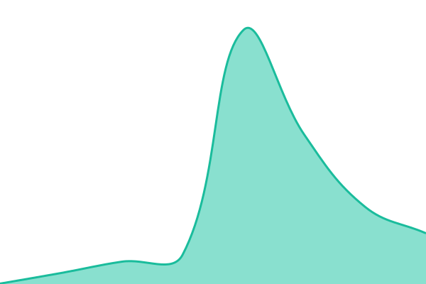
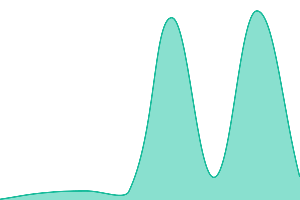
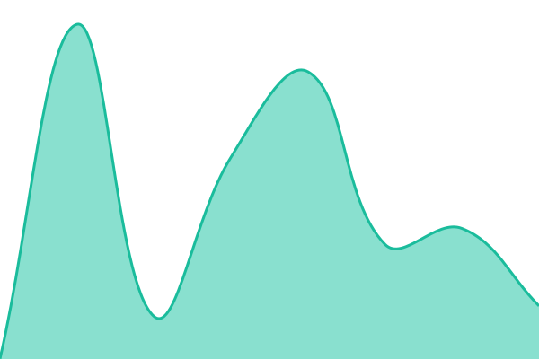

# [📈 Live Status](https://demo.upptime.js.org): <!--live status--> **🟧 Partial outage**

This repository contains the open-source uptime monitor and status page for [Patrick Little](Open.Canada.ca), powered by [Upptime](https://github.com/upptime/upptime).

With [Upptime](https://upptime.js.org), you can get your own unlimited and free uptime monitor and status page, powered entirely by a GitHub repository. We use [Issues](https://github.com/PatLittle/Consultations-Tracker/issues) as incident reports, [Actions](https://github.com/PatLittle/Consultations-Tracker/actions) as uptime monitors, and [Pages](https://demo.upptime.js.org) for the status page.

<!--start: status pages-->
<!-- This summary is generated by Upptime (https://github.com/upptime/upptime) -->
<!-- Do not edit this manually, your changes will be overwritten -->
<!-- prettier-ignore -->
| URL | Status | History | Response Time | Uptime |
| --- | ------ | ------- | ------------- | ------ |
|  [White River First Nations](https://www.rcaanc-cirnac.gc.ca/eng/1511969222951/1529103469169) | 🟩 Up | [white-river-first-nations.yml](https://github.com/PatLittle/Consultations-Tracker/commits/HEAD/history/white-river-first-nations.yml) | 

 1420ms
     
 | 

<a href="https://PatLittle.github.io/Consultations-Tracker/history/white-river-first-nations">0.00%</a>
    

|  [Administrative Monetary Penalty System Review](https://www.cbsa-asfc.gc.ca/trade-commerce/amps/menu-eng.html) | 🟩 Up | [administrative-monetary-penalty-system-review.yml](https://github.com/PatLittle/Consultations-Tracker/commits/HEAD/history/administrative-monetary-penalty-system-review.yml) | 

 227ms
     
 | 

<a href="https://PatLittle.github.io/Consultations-Tracker/history/administrative-monetary-penalty-system-review">0.00%</a>
    

|  [Regulated Industry Engagement](https://www.cer-rec.gc.ca/en/consultation-engagement/stakeholder-engagement/regulated-industry-engagement/index.html) | 🟩 Up | [regulated-industry-engagement.yml](https://github.com/PatLittle/Consultations-Tracker/commits/HEAD/history/regulated-industry-engagement.yml) | 

 549ms
     
 | 

<a href="https://PatLittle.github.io/Consultations-Tracker/history/regulated-industry-engagement">0.00%</a>
    

|  [Canada's Energy Future 2026](https://www.cerdialogue.ca/canada-s-energy-future) | 🟩 Up | [canada-s-energy-future-2026.yml](https://github.com/PatLittle/Consultations-Tracker/commits/HEAD/history/canada-s-energy-future-2026.yml) | 

 636ms
     
 | 

<a href="https://PatLittle.github.io/Consultations-Tracker/history/canada-s-energy-future-2026">0.00%</a>
    

|  [Draft 2026 Remediation Process Guide](https://www.cerdialogue.ca/remediation-process-guide-review) | 🟩 Up | [draft-2026-remediation-process-guide.yml](https://github.com/PatLittle/Consultations-Tracker/commits/HEAD/history/draft-2026-remediation-process-guide.yml) | 

 505ms
     
 | 

<a href="https://PatLittle.github.io/Consultations-Tracker/history/draft-2026-remediation-process-guide">0.00%</a>
    

|  [Proposed changes to Canada’s Enhanced Feed Ban](https://inspection.canada.ca/en/about-cfia/transparency/consultations-and-engagement/enhanced-feed-ban) | 🟩 Up | [proposed-changes-to-canada-s-enhanced-feed-ban.yml](https://github.com/PatLittle/Consultations-Tracker/commits/HEAD/history/proposed-changes-to-canada-s-enhanced-feed-ban.yml) | 

 254ms
     
 | 

<a href="https://PatLittle.github.io/Consultations-Tracker/history/proposed-changes-to-canada-s-enhanced-feed-ban">100.00%</a>
    

|  [Share your thoughts: Proposed new livestock feed ingredient –  Quillaja saponaria wood powder](https://inspection.canada.ca/en/about-cfia/transparency/consultations-and-engagement/quillaja-saponaria) | 🟩 Up | [share-your-thoughts-proposed-new-livestock-feed-ingredient-quillaja-saponaria-wood-powder.yml](https://github.com/PatLittle/Consultations-Tracker/commits/HEAD/history/share-your-thoughts-proposed-new-livestock-feed-ingredient-quillaja-saponaria-wood-powder.yml) | 

 216ms
     
 | 

<a href="https://PatLittle.github.io/Consultations-Tracker/history/share-your-thoughts-proposed-new-livestock-feed-ingredient-quillaja-saponaria-wood-powder">100.00%</a>
    

|  [Share your thoughts: Proposed amended livestock feed ingredients –  Carotenoid based pigments](https://inspection.canada.ca/en/about-cfia/transparency/consultations-and-engagement/carotenoid-related-ingredients) | 🟩 Up | [share-your-thoughts-proposed-amended-livestock-feed-ingredients-carotenoid-based-pigments.yml](https://github.com/PatLittle/Consultations-Tracker/commits/HEAD/history/share-your-thoughts-proposed-amended-livestock-feed-ingredients-carotenoid-based-pigments.yml) | 

 217ms
     
 | 

<a href="https://PatLittle.github.io/Consultations-Tracker/history/share-your-thoughts-proposed-amended-livestock-feed-ingredients-carotenoid-based-pigments">100.00%</a>
    

|  [Regulations Amending the Safe Food for Canadians Regulations (Unmet Slaughter Capacity)](https://gazette.gc.ca/rp-pr/p1/2026/2026-06-27/html/reg1-eng.html) | 🟩 Up | [regulations-amending-the-safe-food-for-canadians-regulations-unmet-slaughter-capacity.yml](https://github.com/PatLittle/Consultations-Tracker/commits/HEAD/history/regulations-amending-the-safe-food-for-canadians-regulations-unmet-slaughter-capacity.yml) | 

 469ms
     
 | 

<a href="https://PatLittle.github.io/Consultations-Tracker/history/regulations-amending-the-safe-food-for-canadians-regulations-unmet-slaughter-capacity">100.00%</a>
    

|  [Changing Narrative Fund](https://www.canada.ca/en/canadian-heritage/campaigns/changing-narratives-fund.html) | 🟩 Up | [changing-narrative-fund.yml](https://github.com/PatLittle/Consultations-Tracker/commits/HEAD/history/changing-narrative-fund.yml) | 

 210ms
     
 | 

<a href="https://PatLittle.github.io/Consultations-Tracker/history/changing-narrative-fund">100.00%</a>
    

|  [2026 Cross-Canada Official Languages Consultations](https://www.canada.ca/en/canadian-heritage/corporate/public-consultations/official-languages-consultations-2026.html) | 🟩 Up | [2026-cross-canada-official-languages-consultations.yml](https://github.com/PatLittle/Consultations-Tracker/commits/HEAD/history/2026-cross-canada-official-languages-consultations.yml) | 

 157ms
     
 | 

<a href="https://PatLittle.github.io/Consultations-Tracker/history/2026-cross-canada-official-languages-consultations">100.00%</a>
    

|  [2022-23 Consultations on renewal of the Museum Policy](https://www.canada.ca/en/canadian-heritage/campaigns/renewal-museum-policy.html) | 🟩 Up | [2022-23-consultations-on-renewal-of-the-museum-policy.yml](https://github.com/PatLittle/Consultations-Tracker/commits/HEAD/history/2022-23-consultations-on-renewal-of-the-museum-policy.yml) | 

 152ms
     
 | 

<a href="https://PatLittle.github.io/Consultations-Tracker/history/2022-23-consultations-on-renewal-of-the-museum-policy">100.00%</a>
    

|  [REGDOC-3.2.2, Indigenous Engagement](https://www.cnsc-ccsn.gc.ca/eng/acts-and-regulations/regulatory-documents/history/regdoc3-2-2/) | 🟩 Up | [regdoc-3-2-2-indigenous-engagement.yml](https://github.com/PatLittle/Consultations-Tracker/commits/HEAD/history/regdoc-3-2-2-indigenous-engagement.yml) | 

 348ms
     
 | 

<a href="https://PatLittle.github.io/Consultations-Tracker/history/regdoc-3-2-2-indigenous-engagement">100.00%</a>
    

|  [REGDOC-3.1.1, Reporting Requirements for Nuclear Power Plants](https://www.cnsc-ccsn.gc.ca/eng/acts-and-regulations/regulatory-documents/history/regdoc3-1-1/) | 🟩 Up | [regdoc-3-1-1-reporting-requirements-for-nuclear-power-plants.yml](https://github.com/PatLittle/Consultations-Tracker/commits/HEAD/history/regdoc-3-1-1-reporting-requirements-for-nuclear-power-plants.yml) | 

 306ms
     
 | 

<a href="https://PatLittle.github.io/Consultations-Tracker/history/regdoc-3-1-1-reporting-requirements-for-nuclear-power-plants">100.00%</a>
    

|  [REGDOC-3.1.2, Reporting Requirements, Volume I: Non-Power Reactor Class I Nuclear Facilities and Uranium Mines and Mills](https://www.cnsc-ccsn.gc.ca/eng/acts-and-regulations/regulatory-documents/published/html/regdoc3-1-2-v1-1/) | 🟩 Up | [regdoc-3-1-2-reporting-requirements-volume-i-non-power-reactor-class-i-nuclear-facilities-and-uranium-mines-and-mills.yml](https://github.com/PatLittle/Consultations-Tracker/commits/HEAD/history/regdoc-3-1-2-reporting-requirements-volume-i-non-power-reactor-class-i-nuclear-facilities-and-uranium-mines-and-mills.yml) | 

 236ms
     
 | 

<a href="https://PatLittle.github.io/Consultations-Tracker/history/regdoc-3-1-2-reporting-requirements-volume-i-non-power-reactor-class-i-nuclear-facilities-and-uranium-mines-and-mills">100.00%</a>
    

|  [REGDOC-2.12.1, High Security Facilities, Volume I: Nuclear Response Force](https://www.cnsc-ccsn.gc.ca/eng/acts-and-regulations/regulatory-documents/history/regdoc2-12-1/) | 🟩 Up | [regdoc-2-12-1-high-security-facilities-volume-i-nuclear-response-force.yml](https://github.com/PatLittle/Consultations-Tracker/commits/HEAD/history/regdoc-2-12-1-high-security-facilities-volume-i-nuclear-response-force.yml) | 

 239ms
     
 | 

<a href="https://PatLittle.github.io/Consultations-Tracker/history/regdoc-2-12-1-high-security-facilities-volume-i-nuclear-response-force">100.00%</a>
    

|  [REGDOC-2.12.2, Site Access Security Clearance](https://www.cnsc-ccsn.gc.ca/eng/acts-and-regulations/regulatory-documents/history/regdoc2-12-2/) | 🟩 Up | [regdoc-2-12-2-site-access-security-clearance.yml](https://github.com/PatLittle/Consultations-Tracker/commits/HEAD/history/regdoc-2-12-2-site-access-security-clearance.yml) | 

 214ms
     
 | 

<a href="https://PatLittle.github.io/Consultations-Tracker/history/regdoc-2-12-2-site-access-security-clearance">100.00%</a>
    

|  [REGDOC-2.12.3, Nuclear Security for Sealed Sources, Version 1.0](https://www.cnsc-ccsn.gc.ca/eng/acts-and-regulations/regulatory-documents/history/regdoc2-12-3/) | 🟩 Up | [regdoc-2-12-3-nuclear-security-for-sealed-sources-version-1-0.yml](https://github.com/PatLittle/Consultations-Tracker/commits/HEAD/history/regdoc-2-12-3-nuclear-security-for-sealed-sources-version-1-0.yml) | 

 244ms
     
 | 

<a href="https://PatLittle.github.io/Consultations-Tracker/history/regdoc-2-12-3-nuclear-security-for-sealed-sources-version-1-0">100.00%</a>
    

|  [Co-development of a new Indigenous Broadcasting Policy](https://crtc.gc.ca/eng/archive/2019/2019-217.htm) | 🟥 Down | [co-development-of-a-new-indigenous-broadcasting-policy.yml](https://github.com/PatLittle/Consultations-Tracker/commits/HEAD/history/co-development-of-a-new-indigenous-broadcasting-policy.yml) | 

 1142ms
     
 | 

<a href="https://PatLittle.github.io/Consultations-Tracker/history/co-development-of-a-new-indigenous-broadcasting-policy">100.00%</a>
    

|  [Share your thoughts about closed captioning of programming from online streaming services](https://crtc.gc.ca/eng/consultation/cc.htm) | 🟥 Down | [share-your-thoughts-about-closed-captioning-of-programming-from-online-streaming-services.yml](https://github.com/PatLittle/Consultations-Tracker/commits/HEAD/history/share-your-thoughts-about-closed-captioning-of-programming-from-online-streaming-services.yml) | 

 1615ms
     
 | 

<a href="https://PatLittle.github.io/Consultations-Tracker/history/share-your-thoughts-about-closed-captioning-of-programming-from-online-streaming-services">100.00%</a>
    

|  [Share your thoughts about developing an Indigenous stream of the Broadband Fund](https://crtc.gc.ca/eng/consultation/indg-atch.htm) | 🟥 Down | [share-your-thoughts-about-developing-an-indigenous-stream-of-the-broadband-fund.yml](https://github.com/PatLittle/Consultations-Tracker/commits/HEAD/history/share-your-thoughts-about-developing-an-indigenous-stream-of-the-broadband-fund.yml) | 

 1541ms
     
 | 

<a href="https://PatLittle.github.io/Consultations-Tracker/history/share-your-thoughts-about-developing-an-indigenous-stream-of-the-broadband-fund">100.00%</a>
    

|  [Share your thoughts about making consumer protections clearer for Canadians](https://crtc.gc.ca/eng/consultation/harmoni.htm) | 🟥 Down | [share-your-thoughts-about-making-consumer-protections-clearer-for-canadians.yml](https://github.com/PatLittle/Consultations-Tracker/commits/HEAD/history/share-your-thoughts-about-making-consumer-protections-clearer-for-canadians.yml) | 

 3522ms
     
 | 

<a href="https://PatLittle.github.io/Consultations-Tracker/history/share-your-thoughts-about-making-consumer-protections-clearer-for-canadians">100.00%</a>
    

|  [VRCPI Forecast Models Consultation](https://otc-cta.gc.ca/eng/consultation/extended-consultation-vrcpi-forecast-models) | 🟩 Up | [vrcpi-forecast-models-consultation.yml](https://github.com/PatLittle/Consultations-Tracker/commits/HEAD/history/vrcpi-forecast-models-consultation.yml) | 

 433ms
     
 | 

<a href="https://PatLittle.github.io/Consultations-Tracker/history/vrcpi-forecast-models-consultation">39.98%</a>
    

|  [Consultations on Extending the Canadian Journalism Labour Tax Credit to Audio and Audiovisual News Organizations](https://www.canada.ca/en/department-finance/programs/consultations/2026/consultations-on-extending-canadian-journalism-labour-tax-credit-audio-audiovisual-news-organizations.html) | 🟩 Up | [consultations-on-extending-the-canadian-journalism-labour-tax-credit-to-audio-and-audiovisual-news-organizations.yml](https://github.com/PatLittle/Consultations-Tracker/commits/HEAD/history/consultations-on-extending-the-canadian-journalism-labour-tax-credit-to-audio-and-audiovisual-news-organizations.yml) | 

 154ms
     
 | 

<a href="https://PatLittle.github.io/Consultations-Tracker/history/consultations-on-extending-the-canadian-journalism-labour-tax-credit-to-audio-and-audiovisual-news-organizations">100.00%</a>
    

|  [2026 Pre-Budget Consultations](https://www.canada.ca/en/department-finance/programs/consultations/2026/pre-budget-consultations-2026.html) | 🟩 Up | [2026-pre-budget-consultations.yml](https://github.com/PatLittle/Consultations-Tracker/commits/HEAD/history/2026-pre-budget-consultations.yml) | 

 95ms
     
 | 

<a href="https://PatLittle.github.io/Consultations-Tracker/history/2026-pre-budget-consultations">100.00%</a>
    

|  [National Infrastructure Assessment](https://www.infrastructure.gc.ca/nia-eni/index-eng.html) | 🟥 Down | [national-infrastructure-assessment.yml](https://github.com/PatLittle/Consultations-Tracker/commits/HEAD/history/national-infrastructure-assessment.yml) | 

 801ms
     
 | 

<a href="https://PatLittle.github.io/Consultations-Tracker/history/national-infrastructure-assessment">0.00%</a>
    

|  [Invitation to participate in the revision of the National Occupational Classification (NOC)](https://noc.esdc.gc.ca/Home/ParticipateInNOCConsultations) | 🟩 Up | [invitation-to-participate-in-the-revision-of-the-national-occupational-classification-noc.yml](https://github.com/PatLittle/Consultations-Tracker/commits/HEAD/history/invitation-to-participate-in-the-revision-of-the-national-occupational-classification-noc.yml) | 

 0ms
     
 | 

<a href="https://PatLittle.github.io/Consultations-Tracker/history/invitation-to-participate-in-the-revision-of-the-national-occupational-classification-noc">100.00%</a>
    

|  [Consultation on Amending the List of Species under the Species at Risk Act: Terrestrial Species January 2026](https://species-registry.canada.ca/index-en.html#/documents/wldyX0JgFdbCyk7E48LxX) | 🟩 Up | [consultation-on-amending-the-list-of-species-under-the-species-at-risk-act-terrestrial-species-january-2026.yml](https://github.com/PatLittle/Consultations-Tracker/commits/HEAD/history/consultation-on-amending-the-list-of-species-under-the-species-at-risk-act-terrestrial-species-january-2026.yml) | 

 191ms
     
 | 

<a href="https://PatLittle.github.io/Consultations-Tracker/history/consultation-on-amending-the-list-of-species-under-the-species-at-risk-act-terrestrial-species-january-2026">100.00%</a>
    

|  [Consultation on Amending the List of Species under the Species at Risk Act: Terrestrial Species January 2025](https://canada.ca/en/environment-climate-change/services/species-risk-public-registry/consultation-documents/part-3-consultation-amending-terrestrial-species-list-sara-summary-jan-2025.html) | 🟩 Up | [consultation-on-amending-the-list-of-species-under-the-species-at-risk-act-terrestrial-species-january-2025.yml](https://github.com/PatLittle/Consultations-Tracker/commits/HEAD/history/consultation-on-amending-the-list-of-species-under-the-species-at-risk-act-terrestrial-species-january-2025.yml) | 

 686ms
     
 | 

<a href="https://PatLittle.github.io/Consultations-Tracker/history/consultation-on-amending-the-list-of-species-under-the-species-at-risk-act-terrestrial-species-january-2025">100.00%</a>
    

|  [Share your views and ideas: Review of the Environmental Emergency Regulations, 2019](https://www.canada.ca/en/environment-climate-change/corporate/transparency/consultations/environmental-emergencies-regulations-consultation.html) | 🟩 Up | [share-your-views-and-ideas-review-of-the-environmental-emergency-regulations-2019.yml](https://github.com/PatLittle/Consultations-Tracker/commits/HEAD/history/share-your-views-and-ideas-review-of-the-environmental-emergency-regulations-2019.yml) | 

 175ms
     
 | 

<a href="https://PatLittle.github.io/Consultations-Tracker/history/share-your-views-and-ideas-review-of-the-environmental-emergency-regulations-2019">100.00%</a>
    

|  [Draft Assessment for Manganese and its Compounds, and the Risk Management Scope](https://gazette.gc.ca/rp-pr/p1/2025/2025-10-25/html/notice-avis-eng.html#ne3) | 🟩 Up | [draft-assessment-for-manganese-and-its-compounds-and-the-risk-management-scope.yml](https://github.com/PatLittle/Consultations-Tracker/commits/HEAD/history/draft-assessment-for-manganese-and-its-compounds-and-the-risk-management-scope.yml) | 

 400ms
     
 | 

<a href="https://PatLittle.github.io/Consultations-Tracker/history/draft-assessment-for-manganese-and-its-compounds-and-the-risk-management-scope">100.00%</a>
    

|  [Science approach document on the prioritization of chemicals in plastics](https://gazette.gc.ca/rp-pr/p1/2025/2025-12-06/html/notice-avis-eng.html#na2) | 🟩 Up | [science-approach-document-on-the-prioritization-of-chemicals-in-plastics.yml](https://github.com/PatLittle/Consultations-Tracker/commits/HEAD/history/science-approach-document-on-the-prioritization-of-chemicals-in-plastics.yml) | 

 0ms
     
 | 

<a href="https://PatLittle.github.io/Consultations-Tracker/history/science-approach-document-on-the-prioritization-of-chemicals-in-plastics">100.00%</a>
    

|  [Share your ideas: National Strategy Respecting Environmental Racism and Environmental Justice](https://www.canada.ca/en/environment-climate-change/corporate/transparency/consultations/environmental-justice-draft-national-strategy.html) | 🟩 Up | [share-your-ideas-national-strategy-respecting-environmental-racism-and-environmental-justice.yml](https://github.com/PatLittle/Consultations-Tracker/commits/HEAD/history/share-your-ideas-national-strategy-respecting-environmental-racism-and-environmental-justice.yml) | 

 106ms
     
 | 

<a href="https://PatLittle.github.io/Consultations-Tracker/history/share-your-ideas-national-strategy-respecting-environmental-racism-and-environmental-justice">100.00%</a>
    

|  [Fuel Quality Regulations Discussion Document](https://www.canada.ca/en/environment-climate-change/corporate/transparency/priorities-management/policies-guidelines/red-tape-reduction-report.html#toc30) | 🟩 Up | [fuel-quality-regulations-discussion-document.yml](https://github.com/PatLittle/Consultations-Tracker/commits/HEAD/history/fuel-quality-regulations-discussion-document.yml) | 

 162ms
     
 | 

<a href="https://PatLittle.github.io/Consultations-Tracker/history/fuel-quality-regulations-discussion-document">100.00%</a>
    

|  [Consultation by Environment and Climate Change Canada on a proposal to develop a new regulation for the protection of critical habitat on applicable federal lands](https://species-registry.canada.ca/index-en.html#/documents/fV5FjjDxziF1i5irKeeVZ) | 🟩 Up | [consultation-by-environment-and-climate-change-canada-on-a-proposal-to-develop-a-new-regulation-for-the-protection-of-critical-habitat-on-applicable-federal-lands.yml](https://github.com/PatLittle/Consultations-Tracker/commits/HEAD/history/consultation-by-environment-and-climate-change-canada-on-a-proposal-to-develop-a-new-regulation-for-the-protection-of-critical-habitat-on-applicable-federal-lands.yml) | 

 176ms
     
 | 

<a href="https://PatLittle.github.io/Consultations-Tracker/history/consultation-by-environment-and-climate-change-canada-on-a-proposal-to-develop-a-new-regulation-for-the-protection-of-critical-habitat-on-applicable-federal-lands">100.00%</a>
    

|  [Share your ideas: Amendments to the Metal and Diamond Mining Effluent Regulations for the Great Bear Gold Project](https://www.canada.ca/en/environment-climate-change/corporate/transparency/consultations/amendments-metal-diamond-mining-effluent-regulations-great-bear-gold-project.html) | 🟩 Up | [share-your-ideas-amendments-to-the-metal-and-diamond-mining-effluent-regulations-for-the-great-bear-gold-project.yml](https://github.com/PatLittle/Consultations-Tracker/commits/HEAD/history/share-your-ideas-amendments-to-the-metal-and-diamond-mining-effluent-regulations-for-the-great-bear-gold-project.yml) | 

 133ms
     
 | 

<a href="https://PatLittle.github.io/Consultations-Tracker/history/share-your-ideas-amendments-to-the-metal-and-diamond-mining-effluent-regulations-for-the-great-bear-gold-project">100.00%</a>
    

|  [Whitby Harbour Remediation Project](https://www.dfo-mpo.gc.ca/sch-ppb/whitby/index-eng.html) | 🟩 Up | [whitby-harbour-remediation-project.yml](https://github.com/PatLittle/Consultations-Tracker/commits/HEAD/history/whitby-harbour-remediation-project.yml) | 

 401ms
     
 | 

<a href="https://PatLittle.github.io/Consultations-Tracker/history/whitby-harbour-remediation-project">0.00%</a>
    

|  [Multi-species Action Plan for the Alberta at-risk Native Trout in Canada](https://species-registry.canada.ca/index-en.html#/consultations/zCu4Ax1dmSlEtpQnOaOnG) | 🟩 Up | [multi-species-action-plan-for-the-alberta-at-risk-native-trout-in-canada.yml](https://github.com/PatLittle/Consultations-Tracker/commits/HEAD/history/multi-species-action-plan-for-the-alberta-at-risk-native-trout-in-canada.yml) | 

 0ms
     
 | 

<a href="https://PatLittle.github.io/Consultations-Tracker/history/multi-species-action-plan-for-the-alberta-at-risk-native-trout-in-canada">100.00%</a>
    

|  [Stakeholder engagement on potential marine conservation areas in Newfoundland and Labrador Region](https://www.dfo-mpo.gc.ca/oceans/conservation/plan/index-eng.html) | 🟩 Up | [stakeholder-engagement-on-potential-marine-conservation-areas-in-newfoundland-and-labrador-region.yml](https://github.com/PatLittle/Consultations-Tracker/commits/HEAD/history/stakeholder-engagement-on-potential-marine-conservation-areas-in-newfoundland-and-labrador-region.yml) | 

 0ms
     
 | 

<a href="https://PatLittle.github.io/Consultations-Tracker/history/stakeholder-engagement-on-potential-marine-conservation-areas-in-newfoundland-and-labrador-region">100.00%</a>
    

|  [Great Slave Lake Integrated Fisheries Management Plan](https://www.dfo-mpo.gc.ca/about-notre-sujet/engagement/2025/great-slave-lake-grand-lac-esclaves-eng.html) | 🟩 Up | [great-slave-lake-integrated-fisheries-management-plan.yml](https://github.com/PatLittle/Consultations-Tracker/commits/HEAD/history/great-slave-lake-integrated-fisheries-management-plan.yml) | 

 298ms
     
 | 

<a href="https://PatLittle.github.io/Consultations-Tracker/history/great-slave-lake-integrated-fisheries-management-plan">100.00%</a>
    

|  [Wharf 401 Reconstruction - Millerand Harbour - Magdalen Islands](https://www.iaac-aeic.gc.ca/050/evaluations/proj/90306?culture=en-CA) | 🟩 Up | [wharf-401-reconstruction-millerand-harbour-magdalen-islands.yml](https://github.com/PatLittle/Consultations-Tracker/commits/HEAD/history/wharf-401-reconstruction-millerand-harbour-magdalen-islands.yml) | 

 1351ms
     
 | 

<a href="https://PatLittle.github.io/Consultations-Tracker/history/wharf-401-reconstruction-millerand-harbour-magdalen-islands">100.00%</a>
    

|  [Wharf 403 Reconstruction - Newport Harbour - Gaspésie](https://www.iaac-aeic.gc.ca/050/evaluations/proj/90308?culture=en-CA) | 🟩 Up | [wharf-403-reconstruction-newport-harbour-gaspesie.yml](https://github.com/PatLittle/Consultations-Tracker/commits/HEAD/history/wharf-403-reconstruction-newport-harbour-gaspesie.yml) | 

 1171ms
     
 | 

<a href="https://PatLittle.github.io/Consultations-Tracker/history/wharf-403-reconstruction-newport-harbour-gaspesie">72.30%</a>
    

|  [Proposed Amendments to the Export Permits Regulations](https://webarchiveweb.wayback.bac-lac.canada.ca/1/https://www.international.gc.ca/trade-commerce/controls-controles/expor/backgrounder-amendments-epr-information-modification-rle.aspx?lang=eng) | 🟩 Up | [proposed-amendments-to-the-export-permits-regulations.yml](https://github.com/PatLittle/Consultations-Tracker/commits/HEAD/history/proposed-amendments-to-the-export-permits-regulations.yml) | 

 414ms
     
 | 

<a href="https://PatLittle.github.io/Consultations-Tracker/history/proposed-amendments-to-the-export-permits-regulations">100.00%</a>
    

|  [Public consultations on the Government of Canada's administration of the tariff-rate quotas for certain steel goods listed in item 82 of the Import Control List](https://international.canada.ca/en/global-affairs/consultations/trade/2026-07-09-steel-goods) | 🟩 Up | [public-consultations-on-the-government-of-canada-s-administration-of-the-tariff-rate-quotas-for-certain-steel-goods-listed-in-item-82-of-the-import-control-list.yml](https://github.com/PatLittle/Consultations-Tracker/commits/HEAD/history/public-consultations-on-the-government-of-canada-s-administration-of-the-tariff-rate-quotas-for-certain-steel-goods-listed-in-item-82-of-the-import-control-list.yml) | 

 0ms
     
 | 

<a href="https://PatLittle.github.io/Consultations-Tracker/history/public-consultations-on-the-government-of-canada-s-administration-of-the-tariff-rate-quotas-for-certain-steel-goods-listed-in-item-82-of-the-import-control-list">100.00%</a>
    

|  [Share your views: Measures to address forced labour and labour exploitation in global supply chains](https://international.canada.ca/en/global-affairs/consultations/trade/2026-07-27-forced-labour) | 🟩 Up | [share-your-views-measures-to-address-forced-labour-and-labour-exploitation-in-global-supply-chains.yml](https://github.com/PatLittle/Consultations-Tracker/commits/HEAD/history/share-your-views-measures-to-address-forced-labour-and-labour-exploitation-in-global-supply-chains.yml) | 

 0ms
     
 | 

<a href="https://PatLittle.github.io/Consultations-Tracker/history/share-your-views-measures-to-address-forced-labour-and-labour-exploitation-in-global-supply-chains">100.00%</a>
    

|  [Share your views: Consulting Canadians on a potential free trade agreement with Türkiye](https://international.canada.ca/en/global-affairs/consultations/trade/2026-07-29-turkiye) | 🟩 Up | [share-your-views-consulting-canadians-on-a-potential-free-trade-agreement-with-tuerkiye.yml](https://github.com/PatLittle/Consultations-Tracker/commits/HEAD/history/share-your-views-consulting-canadians-on-a-potential-free-trade-agreement-with-tuerkiye.yml) | 

 629ms
     
 | 

<a href="https://PatLittle.github.io/Consultations-Tracker/history/share-your-views-consulting-canadians-on-a-potential-free-trade-agreement-with-tuerkiye">100.00%</a>
    

|  [Consultation: Proposed change to the veterinary omeprazole listing on the Prescription Drug List (PDL)](https://www.canada.ca/en/health-canada/programs/consultation-proposed-change-veterinary-omeprazole-listing-prescription-drug-list.html) | 🟩 Up | [consultation-proposed-change-to-the-veterinary-omeprazole-listing-on-the-prescription-drug-list-pdl.yml](https://github.com/PatLittle/Consultations-Tracker/commits/HEAD/history/consultation-proposed-change-to-the-veterinary-omeprazole-listing-on-the-prescription-drug-list-pdl.yml) | 

 183ms
     
 | 

<a href="https://PatLittle.github.io/Consultations-Tracker/history/consultation-proposed-change-to-the-veterinary-omeprazole-listing-on-the-prescription-drug-list-pdl">100.00%</a>
    

|  [Proposal to modify the List of Permitted Food Colours (Jagua (genipin-glycine) blue)](https://www.canada.ca/en/health-canada/services/food-nutrition/legislation-guidelines/acts-regulations/notices-proposal-notices-modification/list-permitted-food-colours-jagua-genipin-glycine-blue.html) | 🟩 Up | [proposal-to-modify-the-list-of-permitted-food-colours-jagua-genipin-glycine-blue.yml](https://github.com/PatLittle/Consultations-Tracker/commits/HEAD/history/proposal-to-modify-the-list-of-permitted-food-colours-jagua-genipin-glycine-blue.yml) | 

 202ms
     
 | 

<a href="https://PatLittle.github.io/Consultations-Tracker/history/proposal-to-modify-the-list-of-permitted-food-colours-jagua-genipin-glycine-blue">100.00%</a>
    

|  [Consultation: Proposed health-based air quality objectives for arsenic](https://www.canada.ca/en/health-canada/programs/consultation-proposed-health-based-air-quality-objectives-arsenic.html) | 🟩 Up | [consultation-proposed-health-based-air-quality-objectives-for-arsenic.yml](https://github.com/PatLittle/Consultations-Tracker/commits/HEAD/history/consultation-proposed-health-based-air-quality-objectives-for-arsenic.yml) | 

 155ms
     
 | 

<a href="https://PatLittle.github.io/Consultations-Tracker/history/consultation-proposed-health-based-air-quality-objectives-for-arsenic">100.00%</a>
    

|  [Consultation on the proposed special review decision of 4-Chloro-2-methylphenoxyacetic acid and its associated end-use products, PSRD2026-01](https://www.canada.ca/en/health-canada/services/consumer-product-safety/pesticides-pest-management/public/consultations/proposed-special-review-decision/2026/4-chloro-2-methylphenoxyacetic-acid.html) | 🟩 Up | [consultation-on-the-proposed-special-review-decision-of-4-chloro-2-methylphenoxyacetic-acid-and-its-associated-end-use-products-psrd-2026-01.yml](https://github.com/PatLittle/Consultations-Tracker/commits/HEAD/history/consultation-on-the-proposed-special-review-decision-of-4-chloro-2-methylphenoxyacetic-acid-and-its-associated-end-use-products-psrd-2026-01.yml) | 

 133ms
     
 | 

<a href="https://PatLittle.github.io/Consultations-Tracker/history/consultation-on-the-proposed-special-review-decision-of-4-chloro-2-methylphenoxyacetic-acid-and-its-associated-end-use-products-psrd-2026-01">100.00%</a>
    

|  [Regulations Amending the Pest Control Products Regulations (Exemptions and Product Authorizations)](https://www.canada.ca/en/health-canada/services/consumer-product-safety/pesticides-pest-management/public/consultations/canada-gazette-regulations-amending-pest-control-products-regulations-exemptions-authorizations.html) | 🟩 Up | [regulations-amending-the-pest-control-products-regulations-exemptions-and-product-authorizations.yml](https://github.com/PatLittle/Consultations-Tracker/commits/HEAD/history/regulations-amending-the-pest-control-products-regulations-exemptions-and-product-authorizations.yml) | 

 96ms
     
 | 

<a href="https://PatLittle.github.io/Consultations-Tracker/history/regulations-amending-the-pest-control-products-regulations-exemptions-and-product-authorizations">100.00%</a>
    

|  [Consultation on ammonium bromide and its associated end-use products, Proposed Re-evaluation Decision PRVD2026-03](https://www.canada.ca/en/health-canada/services/consumer-product-safety/pesticides-pest-management/public/consultations/proposed-re-evaluation-decisions/2026/ammonium-bromide.html) | 🟩 Up | [consultation-on-ammonium-bromide-and-its-associated-end-use-products-proposed-re-evaluation-decision-prvd-2026-03.yml](https://github.com/PatLittle/Consultations-Tracker/commits/HEAD/history/consultation-on-ammonium-bromide-and-its-associated-end-use-products-proposed-re-evaluation-decision-prvd-2026-03.yml) | 

 130ms
     
 | 

<a href="https://PatLittle.github.io/Consultations-Tracker/history/consultation-on-ammonium-bromide-and-its-associated-end-use-products-proposed-re-evaluation-decision-prvd-2026-03">100.00%</a>
    

|  [Consultation on spiropidion, Proposed Maximum Residue Limit PMRL2026-07](https://www.canada.ca/en/health-canada/services/consumer-product-safety/pesticides-pest-management/public/consultations/proposed-maximum-residue-limit/2026/spiropidion.html) | 🟩 Up | [consultation-on-spiropidion-proposed-maximum-residue-limit-pmrl-2026-07.yml](https://github.com/PatLittle/Consultations-Tracker/commits/HEAD/history/consultation-on-spiropidion-proposed-maximum-residue-limit-pmrl-2026-07.yml) | 

 155ms
     
 | 

<a href="https://PatLittle.github.io/Consultations-Tracker/history/consultation-on-spiropidion-proposed-maximum-residue-limit-pmrl-2026-07">100.00%</a>
    

|  [Consultation on the Revised Environmental Data Requirements, Regulatory Proposal PRO2026-02](https://www.canada.ca/en/health-canada/services/consumer-product-safety/pesticides-pest-management/public/consultations/regulatory-proposals/2026/revised-environmental-data-requirements.html) | 🟩 Up | [consultation-on-the-revised-environmental-data-requirements-regulatory-proposal-pro-2026-02.yml](https://github.com/PatLittle/Consultations-Tracker/commits/HEAD/history/consultation-on-the-revised-environmental-data-requirements-regulatory-proposal-pro-2026-02.yml) | 

 110ms
     
 | 

<a href="https://PatLittle.github.io/Consultations-Tracker/history/consultation-on-the-revised-environmental-data-requirements-regulatory-proposal-pro-2026-02">100.00%</a>
    

|  [Consultation: Proposal to amend the Children’s Sleepwear Regulations under the Canada Consumer Product Safety Act](https://www.canada.ca/en/health-canada/programs/consultation-proposal-amend-childrens-sleepwear-regulations.html) | 🟩 Up | [consultation-proposal-to-amend-the-children-s-sleepwear-regulations-under-the-canada-consumer-product-safety-act.yml](https://github.com/PatLittle/Consultations-Tracker/commits/HEAD/history/consultation-proposal-to-amend-the-children-s-sleepwear-regulations-under-the-canada-consumer-product-safety-act.yml) | 

 119ms
     
 | 

<a href="https://PatLittle.github.io/Consultations-Tracker/history/consultation-proposal-to-amend-the-children-s-sleepwear-regulations-under-the-canada-consumer-product-safety-act">100.00%</a>
    

|  [Consultation: Recommendations for nuclear emergency protection strategies in Canada](https://www.canada.ca/en/health-canada/programs/consultation-recommendations-nuclear-emergency-protection-strategies.html) | 🟩 Up | [consultation-recommendations-for-nuclear-emergency-protection-strategies-in-canada.yml](https://github.com/PatLittle/Consultations-Tracker/commits/HEAD/history/consultation-recommendations-for-nuclear-emergency-protection-strategies-in-canada.yml) | 

 0ms
     
 | 

<a href="https://PatLittle.github.io/Consultations-Tracker/history/consultation-recommendations-for-nuclear-emergency-protection-strategies-in-canada">100.00%</a>
    

|  [Consultation: Draft revised Quality of natural health products guide](https://www.canada.ca/en/health-canada/programs/draft-consultation-quality-natural-health-products-guide.html) | 🟩 Up | [consultation-draft-revised-quality-of-natural-health-products-guide.yml](https://github.com/PatLittle/Consultations-Tracker/commits/HEAD/history/consultation-draft-revised-quality-of-natural-health-products-guide.yml) | 

 174ms
     
 | 

<a href="https://PatLittle.github.io/Consultations-Tracker/history/consultation-draft-revised-quality-of-natural-health-products-guide">100.00%</a>
    

|  [Consultation on Deltamethrin, Ultratec 5SC MUP and Raid Bug Defense, Proposed Registration Decision PRD2026-12](https://www.canada.ca/en/health-canada/services/consumer-product-safety/pesticides-pest-management/public/consultations/proposed-registration-decisions/2026/deltamethrin-ultratec-5sc-mup-raid-bug-defense.html) | 🟩 Up | [consultation-on-deltamethrin-ultratec-5-sc-mup-and-raid-bug-defense-proposed-registration-decision-prd-2026-12.yml](https://github.com/PatLittle/Consultations-Tracker/commits/HEAD/history/consultation-on-deltamethrin-ultratec-5-sc-mup-and-raid-bug-defense-proposed-registration-decision-prd-2026-12.yml) | 

 105ms
     
 | 

<a href="https://PatLittle.github.io/Consultations-Tracker/history/consultation-on-deltamethrin-ultratec-5-sc-mup-and-raid-bug-defense-proposed-registration-decision-prd-2026-12">100.00%</a>
    

|  [Regulations Amending the Immigration and Refugee Protection Regulations (Temporary Foreign Workers)](https://gazette.gc.ca/rp-pr/p1/2021/2021-07-10/html/reg2-eng.html) | 🟩 Up | [regulations-amending-the-immigration-and-refugee-protection-regulations-temporary-foreign-workers.yml](https://github.com/PatLittle/Consultations-Tracker/commits/HEAD/history/regulations-amending-the-immigration-and-refugee-protection-regulations-temporary-foreign-workers.yml) | 

 602ms
     
 | 

<a href="https://PatLittle.github.io/Consultations-Tracker/history/regulations-amending-the-immigration-and-refugee-protection-regulations-temporary-foreign-workers">100.00%</a>
    

|  [2025 online survey of newcomers to Canada](https://www.canada.ca/en/immigration-refugees-citizenship/services/client-surveys.html) | 🟩 Up | [2025-online-survey-of-newcomers-to-canada.yml](https://github.com/PatLittle/Consultations-Tracker/commits/HEAD/history/2025-online-survey-of-newcomers-to-canada.yml) | 

 98ms
     
 | 

<a href="https://PatLittle.github.io/Consultations-Tracker/history/2025-online-survey-of-newcomers-to-canada">100.00%</a>
    

|  [Deep Geological Repository (DGR) for Canada's Used Nuclear Fuel Project](https://iaac-aeic.gc.ca/050/evaluations/proj/88774?culture=en-CA) | 🟩 Up | [deep-geological-repository-dgr-for-canada-s-used-nuclear-fuel-project.yml](https://github.com/PatLittle/Consultations-Tracker/commits/HEAD/history/deep-geological-repository-dgr-for-canada-s-used-nuclear-fuel-project.yml) | 

 842ms
     
 | 

<a href="https://PatLittle.github.io/Consultations-Tracker/history/deep-geological-repository-dgr-for-canada-s-used-nuclear-fuel-project">100.00%</a>
    

|  [Upper Beaver Gold ProjectPublic noticeParticipant funding available](https://iaac-aeic.gc.ca/050/evaluations/document/167025?culture=en-CA) | 🟩 Up | [upper-beaver-gold-project-public-notice-participant-funding-available.yml](https://github.com/PatLittle/Consultations-Tracker/commits/HEAD/history/upper-beaver-gold-project-public-notice-participant-funding-available.yml) | 

 537ms
     
 | 

<a href="https://PatLittle.github.io/Consultations-Tracker/history/upper-beaver-gold-project-public-notice-participant-funding-available">100.00%</a>
    

|  [Regional Assessment of Oil and Gas Exploratory Drilling in the Canada-Nova Scotia Offshore AreaPublic noticeParticipant funding available](https://iaac-aeic.gc.ca/050/evaluations/document/167072?culture=en-CA) | 🟩 Up | [regional-assessment-of-oil-and-gas-exploratory-drilling-in-the-canada-nova-scotia-offshore-area-public-notice-participant-funding-available.yml](https://github.com/PatLittle/Consultations-Tracker/commits/HEAD/history/regional-assessment-of-oil-and-gas-exploratory-drilling-in-the-canada-nova-scotia-offshore-area-public-notice-participant-funding-available.yml) | 

 0ms
     
 | 

<a href="https://PatLittle.github.io/Consultations-Tracker/history/regional-assessment-of-oil-and-gas-exploratory-drilling-in-the-canada-nova-scotia-offshore-area-public-notice-participant-funding-available">100.00%</a>
    

|  [Indian Oil and Gas Regulations - Phase II](http://www.pgic-iogc.gc.ca/eng/1471964522302/1471964567990) | 🟩 Up | [indian-oil-and-gas-regulations-phase-ii.yml](https://github.com/PatLittle/Consultations-Tracker/commits/HEAD/history/indian-oil-and-gas-regulations-phase-ii.yml) | 

 839ms
     
 | 

<a href="https://PatLittle.github.io/Consultations-Tracker/history/indian-oil-and-gas-regulations-phase-ii">0.00%</a>
    

|  [Indigenous Procurement Modernization (including Procurement Strategy for Aboriginal Business)](https://www.aadnc-aandc.gc.ca/eng/1554218527634/1554218554486) | 🟩 Up | [indigenous-procurement-modernization-including-procurement-strategy-for-aboriginal-business.yml](https://github.com/PatLittle/Consultations-Tracker/commits/HEAD/history/indigenous-procurement-modernization-including-procurement-strategy-for-aboriginal-business.yml) | 

 332ms
     
 | 

<a href="https://PatLittle.github.io/Consultations-Tracker/history/indigenous-procurement-modernization-including-procurement-strategy-for-aboriginal-business">100.00%</a>
    

|  [Competition Bureau invites feedback on changes to the Textile Labelling and Advertising Regulations](https://www.ic.gc.ca/eic/site/cb-bc.nsf/eng/h_00142.html) | 🟩 Up | [competition-bureau-invites-feedback-on-changes-to-the-textile-labelling-and-advertising-regulations.yml](https://github.com/PatLittle/Consultations-Tracker/commits/HEAD/history/competition-bureau-invites-feedback-on-changes-to-the-textile-labelling-and-advertising-regulations.yml) | 

 1554ms
     
 | 

<a href="https://PatLittle.github.io/Consultations-Tracker/history/competition-bureau-invites-feedback-on-changes-to-the-textile-labelling-and-advertising-regulations">100.00%</a>
    

|  [Notice No. TIPB-001-2024 — Petition to the Governor in Council concerning Telecom Decision CRTC 2023-358](https://canadagazette.gc.ca/rp-pr/p1/2024/2024-04-27/pdf/g1-15817.pdf) | 🟩 Up | [notice-no-tipb-001-2024-petition-to-the-governor-in-council-concerning-telecom-decision-crtc-2023-358.yml](https://github.com/PatLittle/Consultations-Tracker/commits/HEAD/history/notice-no-tipb-001-2024-petition-to-the-governor-in-council-concerning-telecom-decision-crtc-2023-358.yml) | 

 1880ms
     
 | 

<a href="https://PatLittle.github.io/Consultations-Tracker/history/notice-no-tipb-001-2024-petition-to-the-governor-in-council-concerning-telecom-decision-crtc-2023-358">100.00%</a>
    

|  [Amendments to Directive No 11R3, Surplus Income Directive](https://ised-isde.canada.ca/site/office-superintendent-bankruptcy/en/public-consultations) | 🟩 Up | [amendments-to-directive-no-11-r3-surplus-income-directive.yml](https://github.com/PatLittle/Consultations-Tracker/commits/HEAD/history/amendments-to-directive-no-11-r3-surplus-income-directive.yml) | 

 292ms
     
 | 

<a href="https://PatLittle.github.io/Consultations-Tracker/history/amendments-to-directive-no-11-r3-surplus-income-directive">100.00%</a>
    

|  [Consultation on Alternate Service Delivery Programs, Part II](https://ised-isde.canada.ca/site/measurement-canada/en/consultations/consultation-measurement-canadas-alternative-service-delivery-programs) | 🟩 Up | [consultation-on-alternate-service-delivery-programs-part-ii.yml](https://github.com/PatLittle/Consultations-Tracker/commits/HEAD/history/consultation-on-alternate-service-delivery-programs-part-ii.yml) | 

 258ms
     
 | 

<a href="https://PatLittle.github.io/Consultations-Tracker/history/consultation-on-alternate-service-delivery-programs-part-ii">100.00%</a>
    

|  [Consultation on a Policy, and Licensing, and Technical Framework for Supplemental Mobile Coverage by Satellite](https://ised-isde.canada.ca/site/spectrum-management-telecommunications/en/learn-more/key-documents/consultations/consultation-policy-licensing-and-technical-framework-supplemental-mobile-coverage-satellite) | 🟩 Up | [consultation-on-a-policy-and-licensing-and-technical-framework-for-supplemental-mobile-coverage-by-satellite.yml](https://github.com/PatLittle/Consultations-Tracker/commits/HEAD/history/consultation-on-a-policy-and-licensing-and-technical-framework-for-supplemental-mobile-coverage-by-satellite.yml) | 

 309ms
     
 | 

<a href="https://PatLittle.github.io/Consultations-Tracker/history/consultation-on-a-policy-and-licensing-and-technical-framework-for-supplemental-mobile-coverage-by-satellite">100.00%</a>
    

|  [Consultation on the implementation of the Global Cross-Border Privacy Rules (CBPR) Forum certifications in Canada](https://ised-isde.canada.ca/site/ised/en/public-consultations/consultation-implementation-global-cross-border-privacy-rules-cbpr-forum-certifications-canada) | 🟩 Up | [consultation-on-the-implementation-of-the-global-cross-border-privacy-rules-cbpr-forum-certifications-in-canada.yml](https://github.com/PatLittle/Consultations-Tracker/commits/HEAD/history/consultation-on-the-implementation-of-the-global-cross-border-privacy-rules-cbpr-forum-certifications-in-canada.yml) | 

 0ms
     
 | 

<a href="https://PatLittle.github.io/Consultations-Tracker/history/consultation-on-the-implementation-of-the-global-cross-border-privacy-rules-cbpr-forum-certifications-in-canada">100.00%</a>
    

|  [Amendments to Directive No 2R2, Joint Filing, and to various forms](https://ised-isde.canada.ca/site/office-superintendent-bankruptcy/en/public-consultations) | 🟩 Up | [amendments-to-directive-no-2-r2-joint-filing-and-to-various-forms.yml](https://github.com/PatLittle/Consultations-Tracker/commits/HEAD/history/amendments-to-directive-no-2-r2-joint-filing-and-to-various-forms.yml) | 

 289ms
     
 | 

<a href="https://PatLittle.github.io/Consultations-Tracker/history/amendments-to-directive-no-2-r2-joint-filing-and-to-various-forms">100.00%</a>
    

|  [Amendments to Superintendent's directives relating to cybersecurity guidelines, minimum requirements and measures for the Licensed Insolvency Trustee community](https://ised-isde.canada.ca/site/office-superintendent-bankruptcy/en/public-consultations) | 🟩 Up | [amendments-to-superintendent-s-directives-relating-to-cybersecurity-guidelines-minimum-requirements-and-measures-for-the-licensed-insolvency-trustee-community.yml](https://github.com/PatLittle/Consultations-Tracker/commits/HEAD/history/amendments-to-superintendent-s-directives-relating-to-cybersecurity-guidelines-minimum-requirements-and-measures-for-the-licensed-insolvency-trustee-community.yml) | 

 301ms
     
 | 

<a href="https://PatLittle.github.io/Consultations-Tracker/history/amendments-to-superintendent-s-directives-relating-to-cybersecurity-guidelines-minimum-requirements-and-measures-for-the-licensed-insolvency-trustee-community">100.00%</a>
    

|  [Consultation on Amendments to the Tower Siting Process and Decision on Roaming, Tower sharing and Annual Reporting Requirements for Terrestrial Licences](https://ised-isde.canada.ca/site/spectrum-management-telecommunications/en/learn-more/key-documents/consultations/consultation-amendments-tower-siting-process-and-decision-roaming-tower-sharing-and-annual-reporting) | 🟩 Up | [consultation-on-amendments-to-the-tower-siting-process-and-decision-on-roaming-tower-sharing-and-annual-reporting-requirements-for-terrestrial-licences.yml](https://github.com/PatLittle/Consultations-Tracker/commits/HEAD/history/consultation-on-amendments-to-the-tower-siting-process-and-decision-on-roaming-tower-sharing-and-annual-reporting-requirements-for-terrestrial-licences.yml) | 

 275ms
     
 | 

<a href="https://PatLittle.github.io/Consultations-Tracker/history/consultation-on-amendments-to-the-tower-siting-process-and-decision-on-roaming-tower-sharing-and-annual-reporting-requirements-for-terrestrial-licences">100.00%</a>
    

|  [Review of Canada's Geographical Indication Regime](https://conversations.ised-isde.canada.ca/geographical-indications-gi-regime-in-canada) | 🟩 Up | [review-of-canada-s-geographical-indication-regime.yml](https://github.com/PatLittle/Consultations-Tracker/commits/HEAD/history/review-of-canada-s-geographical-indication-regime.yml) | 

 617ms
     
 | 

<a href="https://PatLittle.github.io/Consultations-Tracker/history/review-of-canada-s-geographical-indication-regime">0.00%</a>
    

|  [Consultation on a Policy, Licensing and Technical Framework for Remotely Piloted Aircraft Systems (RPAS) in the 5030-5091 MHz Band and Certain Bands Used to Provide Commercial Mobile Services](https://ised-isde.canada.ca/site/spectrum-management-telecommunications/en/learn-more/key-documents/consultations/consultation-policy-licensing-and-technical-framework-remotely-piloted-aircraft-systems-rpas-5030) | 🟩 Up | [consultation-on-a-policy-licensing-and-technical-framework-for-remotely-piloted-aircraft-systems-rpas-in-the-5030-5091-m-hz-band-and-certain-bands-used-to-provide-commercial-mobile-services.yml](https://github.com/PatLittle/Consultations-Tracker/commits/HEAD/history/consultation-on-a-policy-licensing-and-technical-framework-for-remotely-piloted-aircraft-systems-rpas-in-the-5030-5091-m-hz-band-and-certain-bands-used-to-provide-commercial-mobile-services.yml) | 

 0ms
     
 | 

<a href="https://PatLittle.github.io/Consultations-Tracker/history/consultation-on-a-policy-licensing-and-technical-framework-for-remotely-piloted-aircraft-systems-rpas-in-the-5030-5091-m-hz-band-and-certain-bands-used-to-provide-commercial-mobile-services">100.00%</a>
    

|  [Proposed Revisions to the Canadian Table of Frequency Allocations 2026 Edition](https://ised-isde.canada.ca/site/spectrum-management-telecommunications/en/learn-more/key-documents/consultations/proposed-revisions-canadian-table-frequency-allocations-2026-edition) | 🟩 Up | [proposed-revisions-to-the-canadian-table-of-frequency-allocations-2026-edition.yml](https://github.com/PatLittle/Consultations-Tracker/commits/HEAD/history/proposed-revisions-to-the-canadian-table-of-frequency-allocations-2026-edition.yml) | 

 358ms
     
 | 

<a href="https://PatLittle.github.io/Consultations-Tracker/history/proposed-revisions-to-the-canadian-table-of-frequency-allocations-2026-edition">100.00%</a>
    

|  [Consultation on enhancing trust in artificial intelligence through increased transparency](https://ised-isde.canada.ca/site/ised/en/have-your-say-advancing-ai-transparency-canada) | 🟩 Up | [consultation-on-enhancing-trust-in-artificial-intelligence-through-increased-transparency.yml](https://github.com/PatLittle/Consultations-Tracker/commits/HEAD/history/consultation-on-enhancing-trust-in-artificial-intelligence-through-increased-transparency.yml) | 

 0ms
     
 | 

<a href="https://PatLittle.github.io/Consultations-Tracker/history/consultation-on-enhancing-trust-in-artificial-intelligence-through-increased-transparency">100.00%</a>
    

|  [Public consultation on new Cartel Enforcement Guidelines](https://competition-bureau.canada.ca/en/how-we-foster-competition/consultations/public-consultation-new-cartel-enforcement-guidelines) | 🟩 Up | [public-consultation-on-new-cartel-enforcement-guidelines.yml](https://github.com/PatLittle/Consultations-Tracker/commits/HEAD/history/public-consultation-on-new-cartel-enforcement-guidelines.yml) | 

 940ms
     
 | 

<a href="https://PatLittle.github.io/Consultations-Tracker/history/public-consultation-on-new-cartel-enforcement-guidelines">100.00%</a>
    

|  [Indigenous Advisory Circle](https://library-archives.canada.ca/eng/corporate/about-us/our-partners/Pages/indigenous-advisory-circle.aspx) | 🟩 Up | [indigenous-advisory-circle.yml](https://github.com/PatLittle/Consultations-Tracker/commits/HEAD/history/indigenous-advisory-circle.yml) | 

 325ms
     
 | 

<a href="https://PatLittle.github.io/Consultations-Tracker/history/indigenous-advisory-circle">0.00%</a>
    

|  [Stakeholders' Forum](https://library-archives.canada.ca/eng/corporate/about-us/our-partners/pages/stakeholders-forum.aspx) | 🟩 Up | [stakeholders-forum.yml](https://github.com/PatLittle/Consultations-Tracker/commits/HEAD/history/stakeholders-forum.yml) | 

 214ms
     
 | 

<a href="https://PatLittle.github.io/Consultations-Tracker/history/stakeholders-forum">0.00%</a>
    

|  [Services Consultation Committee](https://library-archives.canada.ca/eng/corporate/about-us/our-partners/Pages/services-consultation-group.aspx) | 🟩 Up | [services-consultation-committee.yml](https://github.com/PatLittle/Consultations-Tracker/commits/HEAD/history/services-consultation-committee.yml) | 

 202ms
     
 | 

<a href="https://PatLittle.github.io/Consultations-Tracker/history/services-consultation-committee">0.00%</a>
    

|  [Youth Advisory Council](https://library-archives.canada.ca/eng/corporate/about-us/our-partners/Pages/youth-advisory-council.aspx) | 🟩 Up | [youth-advisory-council.yml](https://github.com/PatLittle/Consultations-Tracker/commits/HEAD/history/youth-advisory-council.yml) | 

 218ms
     
 | 

<a href="https://PatLittle.github.io/Consultations-Tracker/history/youth-advisory-council">0.00%</a>
    

|  [Consultation to inform the regulatory development to support the implementation of An Act to amend the National Defence Act and to make related and consequential amendments to other Acts](https://www.canada.ca/en/department-national-defence/services/benefits-military/legal-services/victim-service-offence.html) | 🟩 Up | [consultation-to-inform-the-regulatory-development-to-support-the-implementation-of-an-act-to-amend-the-national-defence-act-and-to-make-related-and-consequential-amendments-to-other-acts.yml](https://github.com/PatLittle/Consultations-Tracker/commits/HEAD/history/consultation-to-inform-the-regulatory-development-to-support-the-implementation-of-an-act-to-amend-the-national-defence-act-and-to-make-related-and-consequential-amendments-to-other-acts.yml) | 

 83ms
     
 | 

<a href="https://PatLittle.github.io/Consultations-Tracker/history/consultation-to-inform-the-regulatory-development-to-support-the-implementation-of-an-act-to-amend-the-national-defence-act-and-to-make-related-and-consequential-amendments-to-other-acts">100.00%</a>
    

|  [Consultation to inform the regulatory development to support the implementation of An Act to amend the National Defence Act and to make related and consequential amendments to other Acts](https://www.canada.ca/en/department-national-defence/services/benefits-military/legal-services/victim-service-offence.html) | 🟩 Up | [consultation-to-inform-the-regulatory-development-to-support-the-implementation-of-an-act-to-amend-the-national-defence-act-and-to-make-related-and-consequential-amendments-to-other-acts.yml](https://github.com/PatLittle/Consultations-Tracker/commits/HEAD/history/consultation-to-inform-the-regulatory-development-to-support-the-implementation-of-an-act-to-amend-the-national-defence-act-and-to-make-related-and-consequential-amendments-to-other-acts.yml) | 

 83ms
     
 | 

<a href="https://PatLittle.github.io/Consultations-Tracker/history/consultation-to-inform-the-regulatory-development-to-support-the-implementation-of-an-act-to-amend-the-national-defence-act-and-to-make-related-and-consequential-amendments-to-other-acts">100.00%</a>
    

|  [Fuel tank removal at the NRC Dominion Radio Astrophysical Observatory](https://iaac-aeic.gc.ca/050/evaluations/proj/90391?version=26357) | 🟩 Up | [fuel-tank-removal-at-the-nrc-dominion-radio-astrophysical-observatory.yml](https://github.com/PatLittle/Consultations-Tracker/commits/HEAD/history/fuel-tank-removal-at-the-nrc-dominion-radio-astrophysical-observatory.yml) | 

 1682ms
     
 | 

<a href="https://PatLittle.github.io/Consultations-Tracker/history/fuel-tank-removal-at-the-nrc-dominion-radio-astrophysical-observatory">100.00%</a>
    

|  [Canada in a Changing Climate](https://natural-resources.canada.ca/climate-change/canada-changing-climate/canada-changing-climate-national-assessment-process) | 🟩 Up | [canada-in-a-changing-climate.yml](https://github.com/PatLittle/Consultations-Tracker/commits/HEAD/history/canada-in-a-changing-climate.yml) | 

 0ms
     
 | 

<a href="https://PatLittle.github.io/Consultations-Tracker/history/canada-in-a-changing-climate">100.00%</a>
    

|  [Indigenous Ministerial Arrangements Regulations](https://www.rncanengagenrcan.ca/en/content/development-new-indigenous-ministerial-arrangements-regulations) | 🟩 Up | [indigenous-ministerial-arrangements-regulations.yml](https://github.com/PatLittle/Consultations-Tracker/commits/HEAD/history/indigenous-ministerial-arrangements-regulations.yml) | 

 181ms
     
 | 

<a href="https://PatLittle.github.io/Consultations-Tracker/history/indigenous-ministerial-arrangements-regulations">100.00%</a>
    

|  [Canada-NS and Canada-NL Offshore Renewable Energy Regulations](https://natural-resources.canada.ca/energy-sources/renewable-energy/offshore-renewable-energy-regulations-initiative) | 🟩 Up | [canada-ns-and-canada-nl-offshore-renewable-energy-regulations.yml](https://github.com/PatLittle/Consultations-Tracker/commits/HEAD/history/canada-ns-and-canada-nl-offshore-renewable-energy-regulations.yml) | 

 73ms
     
 | 

<a href="https://PatLittle.github.io/Consultations-Tracker/history/canada-ns-and-canada-nl-offshore-renewable-energy-regulations">100.00%</a>
    

|  [Consultative document on Senior Leader Accountability](https://www.osfi-bsif.gc.ca/en/guidance/guidance-library/consultative-document-proposed-senior-leader-regime) | 🟩 Up | [consultative-document-on-senior-leader-accountability.yml](https://github.com/PatLittle/Consultations-Tracker/commits/HEAD/history/consultative-document-on-senior-leader-accountability.yml) | 

 403ms
     
 | 

<a href="https://PatLittle.github.io/Consultations-Tracker/history/consultative-document-on-senior-leader-accountability">100.00%</a>
    

|  [Internal Liquidity Adequacy Assessment Process (ILAAP) for Deposit-Taking Institutions – Guideline (2027)](https://www.osfi-bsif.gc.ca/en/guidance/guidance-library/internal-liquidity-adequacy-assessment-process-ilaap-deposit-taking-institutions-guideline-2027) | 🟩 Up | [internal-liquidity-adequacy-assessment-process-ilaap-for-deposit-taking-institutions-guideline-2027.yml](https://github.com/PatLittle/Consultations-Tracker/commits/HEAD/history/internal-liquidity-adequacy-assessment-process-ilaap-for-deposit-taking-institutions-guideline-2027.yml) | 

 366ms
     
 | 

<a href="https://PatLittle.github.io/Consultations-Tracker/history/internal-liquidity-adequacy-assessment-process-ilaap-for-deposit-taking-institutions-guideline-2027">100.00%</a>
    

|  [Guideline B-2 – Large Exposure Limits (2028)](https://www.osfi-bsif.gc.ca/en/guidance/guidance-library/large-exposure-limits-guideline-2028) | 🟩 Up | [guideline-b-2-large-exposure-limits-2028.yml](https://github.com/PatLittle/Consultations-Tracker/commits/HEAD/history/guideline-b-2-large-exposure-limits-2028.yml) | 

 577ms
     
 | 

<a href="https://PatLittle.github.io/Consultations-Tracker/history/guideline-b-2-large-exposure-limits-2028">100.00%</a>
    

|  [General Regulations under the Canada National Marine Conservation Areas Act](https://www.letstalknmcas.ca/) | 🟩 Up | [general-regulations-under-the-canada-national-marine-conservation-areas-act.yml](https://github.com/PatLittle/Consultations-Tracker/commits/HEAD/history/general-regulations-under-the-canada-national-marine-conservation-areas-act.yml) | 

 1333ms
     
 | 

<a href="https://PatLittle.github.io/Consultations-Tracker/history/general-regulations-under-the-canada-national-marine-conservation-areas-act">100.00%</a>
    

|  [Notice of Mooring Restrictions – Ontario Waterways - Trent-Severn Waterway National Historic Site](https://parks.canada.ca/lhn-nhs/on/trentsevern/info/avis-restrictions-amarrage-notice-mooring-restrictions/) | 🟩 Up | [notice-of-mooring-restrictions-ontario-waterways-trent-severn-waterway-national-historic-site.yml](https://github.com/PatLittle/Consultations-Tracker/commits/HEAD/history/notice-of-mooring-restrictions-ontario-waterways-trent-severn-waterway-national-historic-site.yml) | 

 895ms
     
 | 

<a href="https://PatLittle.github.io/Consultations-Tracker/history/notice-of-mooring-restrictions-ontario-waterways-trent-severn-waterway-national-historic-site">100.00%</a>
    

|  [Notice of Mooring Restrictions – Ontario Waterways - Rideau Canal National Historic Site](https://parks.canada.ca/lhn-nhs/on/rideau/info/avis-restrictions-amarrage-notice-mooring-restrictions/) | 🟩 Up | [notice-of-mooring-restrictions-ontario-waterways-rideau-canal-national-historic-site.yml](https://github.com/PatLittle/Consultations-Tracker/commits/HEAD/history/notice-of-mooring-restrictions-ontario-waterways-rideau-canal-national-historic-site.yml) | 

 992ms
     
 | 

<a href="https://PatLittle.github.io/Consultations-Tracker/history/notice-of-mooring-restrictions-ontario-waterways-rideau-canal-national-historic-site">100.00%</a>
    

|  [Fortress of Louisbourg National Historic Site Management Plan](https://www.pc.gc.ca/en/lhn-nhs/ns/louisbourg/info/plan) | 🟩 Up | [fortress-of-louisbourg-national-historic-site-management-plan.yml](https://github.com/PatLittle/Consultations-Tracker/commits/HEAD/history/fortress-of-louisbourg-national-historic-site-management-plan.yml) | 

 1046ms
     
 | 

<a href="https://PatLittle.github.io/Consultations-Tracker/history/fortress-of-louisbourg-national-historic-site-management-plan">100.00%</a>
    

|  [Visitor Use Management - Jasper National Park](https://www.letstalkmountainparks.ca/visitor-use-management-jasper) | 🟩 Up | [visitor-use-management-jasper-national-park.yml](https://github.com/PatLittle/Consultations-Tracker/commits/HEAD/history/visitor-use-management-jasper-national-park.yml) | 

 513ms
     
 | 

<a href="https://PatLittle.github.io/Consultations-Tracker/history/visitor-use-management-jasper-national-park">0.00%</a>
    

|  [Town of Banff Railways Lands Area Redevelopment Plan - Term of Reference for Strategic Environmental Assessment](https://www.letstalkmountainparks.ca/town-of-banff-area-redevelopment-plan-strategic-environmental-assessment/widgets/194782/documents) | 🟩 Up | [town-of-banff-railways-lands-area-redevelopment-plan-term-of-reference-for-strategic-environmental-assessment.yml](https://github.com/PatLittle/Consultations-Tracker/commits/HEAD/history/town-of-banff-railways-lands-area-redevelopment-plan-term-of-reference-for-strategic-environmental-assessment.yml) | 

 368ms
     
 | 

<a href="https://PatLittle.github.io/Consultations-Tracker/history/town-of-banff-railways-lands-area-redevelopment-plan-term-of-reference-for-strategic-environmental-assessment">100.00%</a>
    

|  [Alexander Graham Bell National Historic Site Management Plan](https://parks.canada.ca/lhn-nhs/ns/grahambell/info/plan) | 🟩 Up | [alexander-graham-bell-national-historic-site-management-plan.yml](https://github.com/PatLittle/Consultations-Tracker/commits/HEAD/history/alexander-graham-bell-national-historic-site-management-plan.yml) | 

 511ms
     
 | 

<a href="https://PatLittle.github.io/Consultations-Tracker/history/alexander-graham-bell-national-historic-site-management-plan">100.00%</a>
    

|  [Draft management plan for Auyuittuq National Park](https://parks.canada.ca/pn-np/nu/auyuittuq/info/plan/ebauche-plan-draft-plan-2026) | 🟩 Up | [draft-management-plan-for-auyuittuq-national-park.yml](https://github.com/PatLittle/Consultations-Tracker/commits/HEAD/history/draft-management-plan-for-auyuittuq-national-park.yml) | 

 1062ms
     
 | 

<a href="https://PatLittle.github.io/Consultations-Tracker/history/draft-management-plan-for-auyuittuq-national-park">0.09%</a>
    

|  [PSPC Controlled Goods Program’s Industry Engagement Committee (IEC)](https://www.tpsgc-pwgsc.gc.ca/pmc-cgp/pipmc-secgp-eng.html) | 🟥 Down | [pspc-controlled-goods-program-s-industry-engagement-committee-iec.yml](https://github.com/PatLittle/Consultations-Tracker/commits/HEAD/history/pspc-controlled-goods-program-s-industry-engagement-committee-iec.yml) | 

 0ms
     
 | 

<a href="https://PatLittle.github.io/Consultations-Tracker/history/pspc-controlled-goods-program-s-industry-engagement-committee-iec">100.00%</a>
    

|  [Three-year Departmental Accessibility Plan](https://www.canada.ca/en/public-services-procurement/corporate/accessibility.html) | 🟩 Up | [three-year-departmental-accessibility-plan.yml](https://github.com/PatLittle/Consultations-Tracker/commits/HEAD/history/three-year-departmental-accessibility-plan.yml) | 

 204ms
     
 | 

<a href="https://PatLittle.github.io/Consultations-Tracker/history/three-year-departmental-accessibility-plan">100.00%</a>
    

|  [Domestic Assessment of Product Category Filters for the Green Public Procurement Tool (GPPT)](https://circularinnovation.ca/pspc-consultation-sessions-and-registration/) | 🟩 Up | [domestic-assessment-of-product-category-filters-for-the-green-public-procurement-tool-gppt.yml](https://github.com/PatLittle/Consultations-Tracker/commits/HEAD/history/domestic-assessment-of-product-category-filters-for-the-green-public-procurement-tool-gppt.yml) | 

 437ms
     
 | 

<a href="https://PatLittle.github.io/Consultations-Tracker/history/domestic-assessment-of-product-category-filters-for-the-green-public-procurement-tool-gppt">100.00%</a>
    

|  [Multifactor Productivity Application](https://www.statcan.gc.ca/eng/consultation/2019/mpa) | 🟩 Up | [multifactor-productivity-application.yml](https://github.com/PatLittle/Consultations-Tracker/commits/HEAD/history/multifactor-productivity-application.yml) | 

 854ms
     
 | 

<a href="https://PatLittle.github.io/Consultations-Tracker/history/multifactor-productivity-application">100.00%</a>
    

|  [Statistics Canada Client Survey 2022](https://www.statcan.gc.ca/en/consultation/2022/sccs2022) | 🟩 Up | [statistics-canada-client-survey-2022.yml](https://github.com/PatLittle/Consultations-Tracker/commits/HEAD/history/statistics-canada-client-survey-2022.yml) | 

 252ms
     
 | 

<a href="https://PatLittle.github.io/Consultations-Tracker/history/statistics-canada-client-survey-2022">100.00%</a>
    

|  [Census of the Environment Program](https://www.statcan.gc.ca/en/consultation/2022/coep) | 🟩 Up | [census-of-the-environment-program.yml](https://github.com/PatLittle/Consultations-Tracker/commits/HEAD/history/census-of-the-environment-program.yml) | 

 543ms
     
 | 

<a href="https://PatLittle.github.io/Consultations-Tracker/history/census-of-the-environment-program">100.00%</a>
    

|  [Missing persons data standards consultative engagement](https://www.statcan.gc.ca/en/consultation/2023/missing-persons-data-standards) | 🟩 Up | [missing-persons-data-standards-consultative-engagement.yml](https://github.com/PatLittle/Consultations-Tracker/commits/HEAD/history/missing-persons-data-standards-consultative-engagement.yml) | 

 233ms
     
 | 

<a href="https://PatLittle.github.io/Consultations-Tracker/history/missing-persons-data-standards-consultative-engagement">100.00%</a>
    

|  [Invitation to participate in the revision of the North American Industry Classification System (NAICS) Canada](https://www.statcan.gc.ca/en/consultation/2023/naics) | 🟩 Up | [invitation-to-participate-in-the-revision-of-the-north-american-industry-classification-system-naics-canada.yml](https://github.com/PatLittle/Consultations-Tracker/commits/HEAD/history/invitation-to-participate-in-the-revision-of-the-north-american-industry-classification-system-naics-canada.yml) | 

 0ms
     
 | 

<a href="https://PatLittle.github.io/Consultations-Tracker/history/invitation-to-participate-in-the-revision-of-the-north-american-industry-classification-system-naics-canada">100.00%</a>
    

|  [Invitation to participate in the revision of the North American Product Classification System (NAPCS) Canada](https://www.statcan.gc.ca/en/consultation/2023/napcs) | 🟩 Up | [invitation-to-participate-in-the-revision-of-the-north-american-product-classification-system-napcs-canada.yml](https://github.com/PatLittle/Consultations-Tracker/commits/HEAD/history/invitation-to-participate-in-the-revision-of-the-north-american-product-classification-system-napcs-canada.yml) | 

 0ms
     
 | 

<a href="https://PatLittle.github.io/Consultations-Tracker/history/invitation-to-participate-in-the-revision-of-the-north-american-product-classification-system-napcs-canada">100.00%</a>
    

|  [Invitation to participate in the revision of the Classification of Instructional Programs (CIP) Canada](https://www.statcan.gc.ca/en/consultation/2024/cip) | 🟩 Up | [invitation-to-participate-in-the-revision-of-the-classification-of-instructional-programs-cip-canada.yml](https://github.com/PatLittle/Consultations-Tracker/commits/HEAD/history/invitation-to-participate-in-the-revision-of-the-classification-of-instructional-programs-cip-canada.yml) | 

 0ms
     
 | 

<a href="https://PatLittle.github.io/Consultations-Tracker/history/invitation-to-participate-in-the-revision-of-the-classification-of-instructional-programs-cip-canada">100.00%</a>
    

|  [Invitation to participate in the revision of the National Occupational Classification (NOC)](https://www.statcan.gc.ca/en/consultation/2024/noc) | 🟩 Up | [invitation-to-participate-in-the-revision-of-the-national-occupational-classification-noc.yml](https://github.com/PatLittle/Consultations-Tracker/commits/HEAD/history/invitation-to-participate-in-the-revision-of-the-national-occupational-classification-noc.yml) | 

 0ms
     
 | 

<a href="https://PatLittle.github.io/Consultations-Tracker/history/invitation-to-participate-in-the-revision-of-the-national-occupational-classification-noc">100.00%</a>
    

|  [Participate in the permanent consultation for the revision of the Canadian Research and Development Classification (CRDC)](https://www.statcan.gc.ca/en/consultation/2025/crdc) | 🟩 Up | [participate-in-the-permanent-consultation-for-the-revision-of-the-canadian-research-and-development-classification-crdc.yml](https://github.com/PatLittle/Consultations-Tracker/commits/HEAD/history/participate-in-the-permanent-consultation-for-the-revision-of-the-canadian-research-and-development-classification-crdc.yml) | 

 0ms
     
 | 

<a href="https://PatLittle.github.io/Consultations-Tracker/history/participate-in-the-permanent-consultation-for-the-revision-of-the-canadian-research-and-development-classification-crdc">100.00%</a>
    

|  [Enhancing the ability to search for Statistics Canada data - Consultative engagement](https://www.statcan.gc.ca/en/enhancing-ability-search) | 🟩 Up | [enhancing-the-ability-to-search-for-statistics-canada-data-consultative-engagement.yml](https://github.com/PatLittle/Consultations-Tracker/commits/HEAD/history/enhancing-the-ability-to-search-for-statistics-canada-data-consultative-engagement.yml) | 

 313ms
     
 | 

<a href="https://PatLittle.github.io/Consultations-Tracker/history/enhancing-the-ability-to-search-for-statistics-canada-data-consultative-engagement">100.00%</a>
    

|  [Watchlist 2020 mid-cycle consultation with industry](https://www.tsb.gc.ca/eng/qui-about/relation.html) | 🟥 Down | [watchlist-2020-mid-cycle-consultation-with-industry.yml](https://github.com/PatLittle/Consultations-Tracker/commits/HEAD/history/watchlist-2020-mid-cycle-consultation-with-industry.yml) | 

 797ms
     
 | 

<a href="https://PatLittle.github.io/Consultations-Tracker/history/watchlist-2020-mid-cycle-consultation-with-industry">100.00%</a>
    

|  [Watchlist 2025 mid-cycle consultations with industry](https://www.tsb.gc.ca/eng/surveillance-watchlist/2022.html) | 🟩 Up | [watchlist-2025-mid-cycle-consultations-with-industry.yml](https://github.com/PatLittle/Consultations-Tracker/commits/HEAD/history/watchlist-2025-mid-cycle-consultations-with-industry.yml) | 

 4361ms
     
 | 

<a href="https://PatLittle.github.io/Consultations-Tracker/history/watchlist-2025-mid-cycle-consultations-with-industry">100.00%</a>
    

|  [Oceans Protection Plan](https://consultations.tc.canada.ca/en/consultation/let-s-talk-oceans-protection-plan) | 🟩 Up | [oceans-protection-plan.yml](https://github.com/PatLittle/Consultations-Tracker/commits/HEAD/history/oceans-protection-plan.yml) | 

 337ms
     
 | 

<a href="https://PatLittle.github.io/Consultations-Tracker/history/oceans-protection-plan">0.00%</a>
    

|  [Amendments to the Aircraft Marking and Registration Standard](https://wwwapps.tc.gc.ca/Saf-Sec-Sur/2/NPA-APM/npaapmr.aspx?id=3074&GoCTemplateCulture=en-CA) | 🟩 Up | [amendments-to-the-aircraft-marking-and-registration-standard.yml](https://github.com/PatLittle/Consultations-Tracker/commits/HEAD/history/amendments-to-the-aircraft-marking-and-registration-standard.yml) | 

 6450ms
     
 | 

<a href="https://PatLittle.github.io/Consultations-Tracker/history/amendments-to-the-aircraft-marking-and-registration-standard">100.00%</a>
    

|  [RPAS: Remote Identification, Community-Based  Organizations, and Designated Airspace](https://wwwapps.tc.gc.ca/Saf-Sec-Sur/2/NPA-APM/npaapmr.aspx?id=3073&GoCTemplateCulture=en-CA) | 🟩 Up | [rpas-remote-identification-community-based-organizations-and-designated-airspace.yml](https://github.com/PatLittle/Consultations-Tracker/commits/HEAD/history/rpas-remote-identification-community-based-organizations-and-designated-airspace.yml) | 

 2620ms
     
 | 

<a href="https://PatLittle.github.io/Consultations-Tracker/history/rpas-remote-identification-community-based-organizations-and-designated-airspace">100.00%</a>
    

|  [Updating the Vancouver International Airport Zoning Regulations](https://tc.canada.ca/en/corporate-services/consultations/updating-vancouver-international-airport-zoning-regulations) | 🟩 Up | [updating-the-vancouver-international-airport-zoning-regulations.yml](https://github.com/PatLittle/Consultations-Tracker/commits/HEAD/history/updating-the-vancouver-international-airport-zoning-regulations.yml) | 

 773ms
     
 | 

<a href="https://PatLittle.github.io/Consultations-Tracker/history/updating-the-vancouver-international-airport-zoning-regulations">100.00%</a>
    

|  [Strengthening transportation security clearances for One Canadian Economy](https://tc.canada.ca/en/corporate-services/consultations/strengthening-one-canadian-economy-through-trade-transportation/discussion-paper-strengthening-transportation-security-clearances-one-canadian-economy) | 🟩 Up | [strengthening-transportation-security-clearances-for-one-canadian-economy.yml](https://github.com/PatLittle/Consultations-Tracker/commits/HEAD/history/strengthening-transportation-security-clearances-for-one-canadian-economy.yml) | 

 501ms
     
 | 

<a href="https://PatLittle.github.io/Consultations-Tracker/history/strengthening-transportation-security-clearances-for-one-canadian-economy">100.00%</a>
    

|  [Assistance to Aircraft Accident Victims and their Families](https://tc.canada.ca/en/corporate-services/consultations/assistance-aircraft-accident-victims-their-families) | 🟩 Up | [assistance-to-aircraft-accident-victims-and-their-families.yml](https://github.com/PatLittle/Consultations-Tracker/commits/HEAD/history/assistance-to-aircraft-accident-victims-and-their-families.yml) | 

 613ms
     
 | 

<a href="https://PatLittle.github.io/Consultations-Tracker/history/assistance-to-aircraft-accident-victims-and-their-families">100.00%</a>
    

|  [Ministerial Advisory Groups • Recognition  •  Families  • Care and Support • Policy •  Health and Well-being • Service Excellence and Transition](https://www.veterans.gc.ca/en/about-vac/public-engagement/ministerial-advisory-groups) | 🟩 Up | [ministerial-advisory-groups-recognition-families-care-and-support-policy-health-and-well-being-service-excellence-and-transition.yml](https://github.com/PatLittle/Consultations-Tracker/commits/HEAD/history/ministerial-advisory-groups-recognition-families-care-and-support-policy-health-and-well-being-service-excellence-and-transition.yml) | 

 1018ms
     
 | 

<a href="https://PatLittle.github.io/Consultations-Tracker/history/ministerial-advisory-groups-recognition-families-care-and-support-policy-health-and-well-being-service-excellence-and-transition">100.00%</a>
    

|  [2SLGBTQI+ community needs](https://www.canada.ca/en/women-gender-equality/free-to-be-me/2slgbtqi-plus-sharing-ideas.html) | 🟩 Up | [2-slgbtqi-community-needs.yml](https://github.com/PatLittle/Consultations-Tracker/commits/HEAD/history/2-slgbtqi-community-needs.yml) | 

 189ms
     
 | 

<a href="https://PatLittle.github.io/Consultations-Tracker/history/2-slgbtqi-community-needs">100.00%</a>
    

<!--end: status pages-->

[**Visit our status website →**](https://demo.upptime.js.org)

## 📄 License

- Powered by: [Upptime](https://github.com/upptime/upptime)
- Code: [MIT](./LICENSE) © [Patrick Little](Open.Canada.ca)
- Data in the `./history` directory: [Open Database License](https://opendatacommons.org/licenses/odbl/1-0/)
