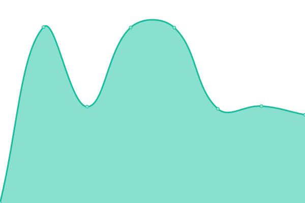

# [📈 Live Status](https://demo.upptime.js.org): <!--live status--> **🟧 Partial outage**

This repository contains the open-source uptime monitor and status page for [Patrick Little](Open.Canada.ca), powered by [Upptime](https://github.com/upptime/upptime).

With [Upptime](https://upptime.js.org), you can get your own unlimited and free uptime monitor and status page, powered entirely by a GitHub repository. We use [Issues](https://github.com/PatLittle/Consultations-Tracker/issues) as incident reports, [Actions](https://github.com/PatLittle/Consultations-Tracker/actions) as uptime monitors, and [Pages](https://demo.upptime.js.org) for the status page.

<!--start: status pages-->
<!-- This summary is generated by Upptime (https://github.com/upptime/upptime) -->
<!-- Do not edit this manually, your changes will be overwritten -->
<!-- prettier-ignore -->
| URL | Status | History | Response Time | Uptime |
| --- | ------ | ------- | ------------- | ------ |
|  [White River First Nations](https://www.rcaanc-cirnac.gc.ca/eng/1511969222951/1529103469169) | 🟩 Up | [white-river-first-nations.yml](https://github.com/PatLittle/Consultations-Tracker/commits/HEAD/history/white-river-first-nations.yml) | 

 1339ms
     
 | 

<a href="https://PatLittle.github.io/Consultations-Tracker/history/white-river-first-nations">100.00%</a>
    

|  [Administrative Monetary Penalty System Review](https://www.cbsa-asfc.gc.ca/trade-commerce/amps/menu-eng.html) | 🟥 Down | [administrative-monetary-penalty-system-review.yml](https://github.com/PatLittle/Consultations-Tracker/commits/HEAD/history/administrative-monetary-penalty-system-review.yml) | 

 360ms
     
 | 

<a href="https://PatLittle.github.io/Consultations-Tracker/history/administrative-monetary-penalty-system-review">99.75%</a>
    

|  [Acessibility External Questionnaire](https://www.cbsa-asfc.gc.ca/accessibility-accessibilite/menu-eng.html) | 🟥 Down | [acessibility-external-questionnaire.yml](https://github.com/PatLittle/Consultations-Tracker/commits/HEAD/history/acessibility-external-questionnaire.yml) | 

 65ms
     
 | 

<a href="https://PatLittle.github.io/Consultations-Tracker/history/acessibility-external-questionnaire">99.75%</a>
    

|  [Accesibility Internal Questionnaire](http://atlas/hrb-dgrh/res/eed/accessibility_accessibilite_eng.asp) | 🟥 Down | [accesibility-internal-questionnaire.yml](https://github.com/PatLittle/Consultations-Tracker/commits/HEAD/history/accesibility-internal-questionnaire.yml) | 

 0ms
     
 | 

<a href="https://PatLittle.github.io/Consultations-Tracker/history/accesibility-internal-questionnaire">0.00%</a>
    

|  [Regulatory Framework Plan](https://can01.safelinks.protection.outlook.com/?url=https%3A%2F%2Fwww.cer-rec.gc.ca%2Fen%2Fabout%2Fhow-we-regulate%2Fplans-for-regulatory-framework%2F&data=05%7C02%7CMichelle.Shabits%40cer-rec.gc.ca%7Cec1c386ebea64452821d08dc41ebb1b9%7C56e9b8d38a3549abbdfc27de59608f01%7C0%7C0%7C638457728797041411%7CUnknown%7CTWFpbGZsb3d8eyJWIjoiMC4wLjAwMDAiLCJQIjoiV2luMzIiLCJBTiI6Ik1haWwiLCJXVCI6Mn0%3D%7C0%7C%7C%7C&sdata=tKxvqtPetzkvcXlETiyyf51rWnRpUftsM2o2U5IySO4%3D&reserved=0) | 🟥 Down | [regulatory-framework-plan.yml](https://github.com/PatLittle/Consultations-Tracker/commits/HEAD/history/regulatory-framework-plan.yml) | 

 1124ms
     
 | 

<a href="https://PatLittle.github.io/Consultations-Tracker/history/regulatory-framework-plan">99.76%</a>
    

|  [Regulated Industry Engagement](https://www.cer-rec.gc.ca/en/consultation-engagement/stakeholder-engagement/regulated-industry-engagement/index.html) | 🟥 Down | [regulated-industry-engagement.yml](https://github.com/PatLittle/Consultations-Tracker/commits/HEAD/history/regulated-industry-engagement.yml) | 

 221ms
     
 | 

<a href="https://PatLittle.github.io/Consultations-Tracker/history/regulated-industry-engagement">99.76%</a>
    

|  [Share your thoughts: Proposed changes to the Tables of Nutrient Guarantees and Conditions for Feed Labels](https://inspection.canada.ca/en/about-cfia/transparency/consultations-and-engagement/changes-tables-nutrient-guarantees-and-conditions-feed-labels) | 🟩 Up | [share-your-thoughts-proposed-changes-to-the-tables-of-nutrient-guarantees-and-conditions-for-feed-labels.yml](https://github.com/PatLittle/Consultations-Tracker/commits/HEAD/history/share-your-thoughts-proposed-changes-to-the-tables-of-nutrient-guarantees-and-conditions-for-feed-labels.yml) | 

 304ms
     
 | 

<a href="https://PatLittle.github.io/Consultations-Tracker/history/share-your-thoughts-proposed-changes-to-the-tables-of-nutrient-guarantees-and-conditions-for-feed-labels">100.00%</a>
    

|  [Public consultation on proposed regulatory changes in Canada Gazette Part I amending the Plant Breeders' Rights Regulations](https://gazette.gc.ca/rp-pr/p1/2025/2025-08-09/html/reg1-eng.html) | 🟥 Down | [public-consultation-on-proposed-regulatory-changes-in-canada-gazette-part-i-amending-the-plant-breeders-rights-regulations.yml](https://github.com/PatLittle/Consultations-Tracker/commits/HEAD/history/public-consultation-on-proposed-regulatory-changes-in-canada-gazette-part-i-amending-the-plant-breeders-rights-regulations.yml) | 

 0ms
     
 | 

<a href="https://PatLittle.github.io/Consultations-Tracker/history/public-consultation-on-proposed-regulatory-changes-in-canada-gazette-part-i-amending-the-plant-breeders-rights-regulations">100.00%</a>
    

|  [IPPC Member consultation on draft International Standards for Phytosanitary Measures and specifications](Canada's role in international plant protection - inspection.canada.ca) | 🟥 Down | [ippc-member-consultation-on-draft-international-standards-for-phytosanitary-measures-and-specifications.yml](https://github.com/PatLittle/Consultations-Tracker/commits/HEAD/history/ippc-member-consultation-on-draft-international-standards-for-phytosanitary-measures-and-specifications.yml) | 

 0ms
     
 | 

<a href="https://PatLittle.github.io/Consultations-Tracker/history/ippc-member-consultation-on-draft-international-standards-for-phytosanitary-measures-and-specifications">100.00%</a>
    

|  [Share your thoughts: Proposed new livestock feed ingredients – Pea processing residues dehydrated and pea processing residues wet](https://inspection.canada.ca/en/about-cfia/transparency/consultations-and-engagement/pea-processing-residues) | 🟩 Up | [share-your-thoughts-proposed-new-livestock-feed-ingredients-pea-processing-residues-dehydrated-and-pea-processing-residues-wet.yml](https://github.com/PatLittle/Consultations-Tracker/commits/HEAD/history/share-your-thoughts-proposed-new-livestock-feed-ingredients-pea-processing-residues-dehydrated-and-pea-processing-residues-wet.yml) | 

 224ms
     
 | 

<a href="https://PatLittle.github.io/Consultations-Tracker/history/share-your-thoughts-proposed-new-livestock-feed-ingredients-pea-processing-residues-dehydrated-and-pea-processing-residues-wet">100.00%</a>
    

|  [Share your thoughts: Proposed changes to the Common Names for Ingredients and Components Document for milk ingredients and modified milk ingredients](https://inspection.canada.ca/en/about-cfia/transparency/consultations-and-engagement/milk-ingredients) | 🟩 Up | [share-your-thoughts-proposed-changes-to-the-common-names-for-ingredients-and-components-document-for-milk-ingredients-and-modified-milk-ingredients.yml](https://github.com/PatLittle/Consultations-Tracker/commits/HEAD/history/share-your-thoughts-proposed-changes-to-the-common-names-for-ingredients-and-components-document-for-milk-ingredients-and-modified-milk-ingredients.yml) | 

 71ms
     
 | 

<a href="https://PatLittle.github.io/Consultations-Tracker/history/share-your-thoughts-proposed-changes-to-the-common-names-for-ingredients-and-components-document-for-milk-ingredients-and-modified-milk-ingredients">100.00%</a>
    

|  [Share your thoughts: Proposed new livestock feed ingredient – Pea solubles](https://inspection.canada.ca/en/about-cfia/transparency/consultations-and-engagement/pea-solubles) | 🟩 Up | [share-your-thoughts-proposed-new-livestock-feed-ingredient-pea-solubles.yml](https://github.com/PatLittle/Consultations-Tracker/commits/HEAD/history/share-your-thoughts-proposed-new-livestock-feed-ingredient-pea-solubles.yml) | 

 53ms
     
 | 

<a href="https://PatLittle.github.io/Consultations-Tracker/history/share-your-thoughts-proposed-new-livestock-feed-ingredient-pea-solubles">100.00%</a>
    

|  [Share your thoughts: Canadian Food Inspection Agency's 2026 to 2028 Accessibility Plan](https://inspection.canada.ca/en/about-cfia/transparency/consultations-and-engagement/2026-2028-accessibility-plan) | 🟩 Up | [share-your-thoughts-canadian-food-inspection-agency-s-2026-to-2028-accessibility-plan.yml](https://github.com/PatLittle/Consultations-Tracker/commits/HEAD/history/share-your-thoughts-canadian-food-inspection-agency-s-2026-to-2028-accessibility-plan.yml) | 

 82ms
     
 | 

<a href="https://PatLittle.github.io/Consultations-Tracker/history/share-your-thoughts-canadian-food-inspection-agency-s-2026-to-2028-accessibility-plan">100.00%</a>
    

|  [Share your thoughts: Future-proofing Canada’s Seeds Regulations for a stronger tomorrow: Proposals to modernize Canada's seed regulatory framework](https://inspection.canada.ca/en/about-cfia/transparency/consultations-and-engagement/share-your-thoughts-seed-proposals) | 🟩 Up | [share-your-thoughts-future-proofing-canada-s-seeds-regulations-for-a-stronger-tomorrow-proposals-to-modernize-canada-s-seed-regulatory-framework.yml](https://github.com/PatLittle/Consultations-Tracker/commits/HEAD/history/share-your-thoughts-future-proofing-canada-s-seeds-regulations-for-a-stronger-tomorrow-proposals-to-modernize-canada-s-seed-regulatory-framework.yml) | 

 53ms
     
 | 

<a href="https://PatLittle.github.io/Consultations-Tracker/history/share-your-thoughts-future-proofing-canada-s-seeds-regulations-for-a-stronger-tomorrow-proposals-to-modernize-canada-s-seed-regulatory-framework">100.00%</a>
    

|  [Changing Narrative Fund](https://www.canada.ca/en/canadian-heritage/campaigns/changing-narratives-fund.html) | 🟩 Up | [changing-narrative-fund.yml](https://github.com/PatLittle/Consultations-Tracker/commits/HEAD/history/changing-narrative-fund.yml) | 

 2609ms
     
 | 

<a href="https://PatLittle.github.io/Consultations-Tracker/history/changing-narrative-fund">100.00%</a>
    

|  [2022-23 Consultations on renewal of the Museum Policy](https://www.canada.ca/en/canadian-heritage/campaigns/renewal-museum-policy.html) | 🟩 Up | [2022-23-consultations-on-renewal-of-the-museum-policy.yml](https://github.com/PatLittle/Consultations-Tracker/commits/HEAD/history/2022-23-consultations-on-renewal-of-the-museum-policy.yml) | 

 1954ms
     
 | 

<a href="https://PatLittle.github.io/Consultations-Tracker/history/2022-23-consultations-on-renewal-of-the-museum-policy">100.00%</a>
    

|  [Co-development of a new Indigenous Broadcasting Policy](https://crtc.gc.ca/eng/archive/2019/2019-217.htm) | 🟥 Down | [co-development-of-a-new-indigenous-broadcasting-policy.yml](https://github.com/PatLittle/Consultations-Tracker/commits/HEAD/history/co-development-of-a-new-indigenous-broadcasting-policy.yml) | 

 296ms
     
 | 

<a href="https://PatLittle.github.io/Consultations-Tracker/history/co-development-of-a-new-indigenous-broadcasting-policy">100.00%</a>
    

|  [Share your thoughts about closed captioning of programming from online streaming services](https://crtc.gc.ca/eng/consultation/cc.htm) | 🟥 Down | [share-your-thoughts-about-closed-captioning-of-programming-from-online-streaming-services.yml](https://github.com/PatLittle/Consultations-Tracker/commits/HEAD/history/share-your-thoughts-about-closed-captioning-of-programming-from-online-streaming-services.yml) | 

 61ms
     
 | 

<a href="https://PatLittle.github.io/Consultations-Tracker/history/share-your-thoughts-about-closed-captioning-of-programming-from-online-streaming-services">100.00%</a>
    

|  [Share your thoughts on improving public interest participation](https://crtc.gc.ca/eng/consultation/public.htm) | 🟥 Down | [share-your-thoughts-on-improving-public-interest-participation.yml](https://github.com/PatLittle/Consultations-Tracker/commits/HEAD/history/share-your-thoughts-on-improving-public-interest-participation.yml) | 

 60ms
     
 | 

<a href="https://PatLittle.github.io/Consultations-Tracker/history/share-your-thoughts-on-improving-public-interest-participation">100.00%</a>
    

|  [Share your thoughts about improving the National Public Alerting System](https://crtc.gc.ca/eng/consultation/pubalert.htm) | 🟥 Down | [share-your-thoughts-about-improving-the-national-public-alerting-system.yml](https://github.com/PatLittle/Consultations-Tracker/commits/HEAD/history/share-your-thoughts-about-improving-the-national-public-alerting-system.yml) | 

 61ms
     
 | 

<a href="https://PatLittle.github.io/Consultations-Tracker/history/share-your-thoughts-about-improving-the-national-public-alerting-system">100.00%</a>
    

|  [Baffinland Steensby Railway Consultation](https://otc-cta.gc.ca/eng/consultation/baffinland-steensby-railway-consultation) | 🟥 Down | [baffinland-steensby-railway-consultation.yml](https://github.com/PatLittle/Consultations-Tracker/commits/HEAD/history/baffinland-steensby-railway-consultation.yml) | 

 803ms
     
 | 

<a href="https://PatLittle.github.io/Consultations-Tracker/history/baffinland-steensby-railway-consultation">99.79%</a>
    

|  [TRC Call to Action 66: Moving from Pilot Project to Long-Term Implementation](Not available) | 🟥 Down | [trc-call-to-action-66-moving-from-pilot-project-to-long-term-implementation.yml](https://github.com/PatLittle/Consultations-Tracker/commits/HEAD/history/trc-call-to-action-66-moving-from-pilot-project-to-long-term-implementation.yml) | 

 0ms
     
 | 

<a href="https://PatLittle.github.io/Consultations-Tracker/history/trc-call-to-action-66-moving-from-pilot-project-to-long-term-implementation">100.00%</a>
    

|  [Pre-Budget Consultations 2025](https://www.canada.ca/en/department-finance/programs/consultations/2025/pre-budget-consultations-2025.html) | 🟩 Up | [pre-budget-consultations-2025.yml](https://github.com/PatLittle/Consultations-Tracker/commits/HEAD/history/pre-budget-consultations-2025.yml) | 

 1771ms
     
 | 

<a href="https://PatLittle.github.io/Consultations-Tracker/history/pre-budget-consultations-2025">100.00%</a>
    

|  [National Infrastructure Assessment](https://www.infrastructure.gc.ca/nia-eni/index-eng.html) | 🟥 Down | [national-infrastructure-assessment.yml](https://github.com/PatLittle/Consultations-Tracker/commits/HEAD/history/national-infrastructure-assessment.yml) | 

 1001ms
     
 | 

<a href="https://PatLittle.github.io/Consultations-Tracker/history/national-infrastructure-assessment">99.79%</a>
    

|  [Share your ideas: Blackwater Project](https://www.canada.ca/en/environment-climate-change/services/managing-pollution/sources-industry/mining/metal-diamond-mining-effluent-regulation/blackwater-consultation.html) | 🟥 Down | [share-your-ideas-blackwater-project.yml](https://github.com/PatLittle/Consultations-Tracker/commits/HEAD/history/share-your-ideas-blackwater-project.yml) | 

 2094ms
     
 | 

<a href="https://PatLittle.github.io/Consultations-Tracker/history/share-your-ideas-blackwater-project">100.00%</a>
    

|  [Consultation on Amending the List of Species under the Species at Risk Act: Terrestrial Species January 2025](https://canada-preview.adobecqms.net/en/environment-climate-change/services/species-risk-public-registry/consultation-documents/part-3-consultation-amending-terrestrial-species-list-sara-summary-jan-2025.html) | 🟩 Up | [consultation-on-amending-the-list-of-species-under-the-species-at-risk-act-terrestrial-species-january-2025.yml](https://github.com/PatLittle/Consultations-Tracker/commits/HEAD/history/consultation-on-amending-the-list-of-species-under-the-species-at-risk-act-terrestrial-species-january-2025.yml) | 

 1985ms
     
 | 

<a href="https://PatLittle.github.io/Consultations-Tracker/history/consultation-on-amending-the-list-of-species-under-the-species-at-risk-act-terrestrial-species-january-2025">100.00%</a>
    

|  [Evaluation by Environment and Climate Change Canada of the ongoing need for the Emergency Order for the Protection of the Western Chorus Frog (La Prairie, Candiac, Saint-Philippe)](https://species-registry.az.ec.gc.ca/index-en.html#/documents/EkpiDbbRUxK4Yjlw7IcLi) | 🟥 Down | [evaluation-by-environment-and-climate-change-canada-of-the-ongoing-need-for-the-emergency-order-for-the-protection-of-the-western-chorus-frog-la-prairie-candiac-saint-philippe.yml](https://github.com/PatLittle/Consultations-Tracker/commits/HEAD/history/evaluation-by-environment-and-climate-change-canada-of-the-ongoing-need-for-the-emergency-order-for-the-protection-of-the-western-chorus-frog-la-prairie-candiac-saint-philippe.yml) | 

 277ms
     
 | 

<a href="https://PatLittle.github.io/Consultations-Tracker/history/evaluation-by-environment-and-climate-change-canada-of-the-ongoing-need-for-the-emergency-order-for-the-protection-of-the-western-chorus-frog-la-prairie-candiac-saint-philippe">100.00%</a>
    

|  [20th Conference of the Parties to the Convention on International Trade in Endangered Species](https://www.canada.ca/en/environment-climate-change/services/convention-international-trade-endangered-species/consultation/share-view-ideas-20-cop-cites.html) | 🟩 Up | [20th-conference-of-the-parties-to-the-convention-on-international-trade-in-endangered-species.yml](https://github.com/PatLittle/Consultations-Tracker/commits/HEAD/history/20th-conference-of-the-parties-to-the-convention-on-international-trade-in-endangered-species.yml) | 

 0ms
     
 | 

<a href="https://PatLittle.github.io/Consultations-Tracker/history/20th-conference-of-the-parties-to-the-convention-on-international-trade-in-endangered-species">100.00%</a>
    

|  [Canada-Alberta equivalency agreement respecting the release of methane from the upstream oil and gas sector](https://canada.ca/en/environment-climate-change/corporate/transparency/consultations/share-your-thoughts-draft-alberta-equivalency-agreement-federal-methane-regulations.html) | 🟥 Down | [canada-alberta-equivalency-agreement-respecting-the-release-of-methane-from-the-upstream-oil-and-gas-sector.yml](https://github.com/PatLittle/Consultations-Tracker/commits/HEAD/history/canada-alberta-equivalency-agreement-respecting-the-release-of-methane-from-the-upstream-oil-and-gas-sector.yml) | 

 2425ms
     
 | 

<a href="https://PatLittle.github.io/Consultations-Tracker/history/canada-alberta-equivalency-agreement-respecting-the-release-of-methane-from-the-upstream-oil-and-gas-sector">100.00%</a>
    

|  [Consultation on the proposed proposed Management plan for the Magdalen Islands Grasshopper (Melanoplus madeleineae)](https://species-registry.canada.ca/index-en.html#/consultations/aXVJCY1wymWZZgEDAXuEN) | 🟥 Down | [consultation-on-the-proposed-proposed-management-plan-for-the-magdalen-islands-grasshopper-melanoplus-madeleineae.yml](https://github.com/PatLittle/Consultations-Tracker/commits/HEAD/history/consultation-on-the-proposed-proposed-management-plan-for-the-magdalen-islands-grasshopper-melanoplus-madeleineae.yml) | 

 264ms
     
 | 

<a href="https://PatLittle.github.io/Consultations-Tracker/history/consultation-on-the-proposed-proposed-management-plan-for-the-magdalen-islands-grasshopper-melanoplus-madeleineae">100.00%</a>
    

|  [Let's talk Pacific Salmon](https://letstalkpacificsalmon.ca/) | 🟩 Up | [let-s-talk-pacific-salmon.yml](https://github.com/PatLittle/Consultations-Tracker/commits/HEAD/history/let-s-talk-pacific-salmon.yml) | 

 1063ms
     
 | 

<a href="https://PatLittle.github.io/Consultations-Tracker/history/let-s-talk-pacific-salmon">100.00%</a>
    

|  [Proposed ticketing for the enforcement of a fisheries offence under the Fisheries Act](TBD) | 🟥 Down | [proposed-ticketing-for-the-enforcement-of-a-fisheries-offence-under-the-fisheries-act.yml](https://github.com/PatLittle/Consultations-Tracker/commits/HEAD/history/proposed-ticketing-for-the-enforcement-of-a-fisheries-offence-under-the-fisheries-act.yml) | 

 0ms
     
 | 

<a href="https://PatLittle.github.io/Consultations-Tracker/history/proposed-ticketing-for-the-enforcement-of-a-fisheries-offence-under-the-fisheries-act">100.00%</a>
    

|  [Whitby Harbour Remediation Project](https://www.dfo-mpo.gc.ca/sch-ppb/whitby/index-eng.html) | 🟥 Down | [whitby-harbour-remediation-project.yml](https://github.com/PatLittle/Consultations-Tracker/commits/HEAD/history/whitby-harbour-remediation-project.yml) | 

 428ms
     
 | 

<a href="https://PatLittle.github.io/Consultations-Tracker/history/whitby-harbour-remediation-project">99.81%</a>
    

|  [Management Plan for the Cutlip Minnow (Exoglossum maxillingua) in Canada](https://species-registry.canada.ca/index-en.html#/consultations/Uv43OsZfTxYQdlWWYGVVz) | 🟥 Down | [management-plan-for-the-cutlip-minnow-exoglossum-maxillingua-in-canada.yml](https://github.com/PatLittle/Consultations-Tracker/commits/HEAD/history/management-plan-for-the-cutlip-minnow-exoglossum-maxillingua-in-canada.yml) | 

 0ms
     
 | 

<a href="https://PatLittle.github.io/Consultations-Tracker/history/management-plan-for-the-cutlip-minnow-exoglossum-maxillingua-in-canada">100.00%</a>
    

|  [Stakeholder engagement on potential marine conservation areas in Newfoundland and Labrador Region](https://www.dfo-mpo.gc.ca/oceans/conservation/plan/index-eng.html) | 🟥 Down | [stakeholder-engagement-on-potential-marine-conservation-areas-in-newfoundland-and-labrador-region.yml](https://github.com/PatLittle/Consultations-Tracker/commits/HEAD/history/stakeholder-engagement-on-potential-marine-conservation-areas-in-newfoundland-and-labrador-region.yml) | 

 0ms
     
 | 

<a href="https://PatLittle.github.io/Consultations-Tracker/history/stakeholder-engagement-on-potential-marine-conservation-areas-in-newfoundland-and-labrador-region">100.00%</a>
    

|  [Proposed Amendments to the Export Permits Regulations](https://webarchiveweb.wayback.bac-lac.canada.ca/1/https://www.international.gc.ca/trade-commerce/controls-controles/expor/backgrounder-amendments-epr-information-modification-rle.aspx?lang=eng) | 🟩 Up | [proposed-amendments-to-the-export-permits-regulations.yml](https://github.com/PatLittle/Consultations-Tracker/commits/HEAD/history/proposed-amendments-to-the-export-permits-regulations.yml) | 

 604ms
     
 | 

<a href="https://PatLittle.github.io/Consultations-Tracker/history/proposed-amendments-to-the-export-permits-regulations">100.00%</a>
    

|  [Consultation on Guidance Document: Information and Submission Requirements for Biosimilar Biologic Drugs](https://www.canada.ca/en/health-canada/programs/consultation-information-submission-requirements-biosimilar-biologic-drugs.html) | 🟩 Up | [consultation-on-guidance-document-information-and-submission-requirements-for-biosimilar-biologic-drugs.yml](https://github.com/PatLittle/Consultations-Tracker/commits/HEAD/history/consultation-on-guidance-document-information-and-submission-requirements-for-biosimilar-biologic-drugs.yml) | 

 2378ms
     
 | 

<a href="https://PatLittle.github.io/Consultations-Tracker/history/consultation-on-guidance-document-information-and-submission-requirements-for-biosimilar-biologic-drugs">100.00%</a>
    

|  [Consultation on potassium bicarbonate and its associated end-use products, Proposed Re-evaluation Decision PRVD2025-06](https://www.canada.ca/en/health-canada/services/consumer-product-safety/pesticides-pest-management/public/consultations/proposed-re-evaluation-decisions/2025/potassium-bicarbonate.html) | 🟩 Up | [consultation-on-potassium-bicarbonate-and-its-associated-end-use-products-proposed-re-evaluation-decision-prvd-2025-06.yml](https://github.com/PatLittle/Consultations-Tracker/commits/HEAD/history/consultation-on-potassium-bicarbonate-and-its-associated-end-use-products-proposed-re-evaluation-decision-prvd-2025-06.yml) | 

 2551ms
     
 | 

<a href="https://PatLittle.github.io/Consultations-Tracker/history/consultation-on-potassium-bicarbonate-and-its-associated-end-use-products-proposed-re-evaluation-decision-prvd-2025-06">100.00%</a>
    

|  [Consultation on Sulphur and its associated end-use products, Proposed Re-evaluation Decision PRVD2025-07](https://www.canada.ca/en/health-canada/services/consumer-product-safety/pesticides-pest-management/public/consultations/proposed-re-evaluation-decisions/2025/sulphur.html) | 🟩 Up | [consultation-on-sulphur-and-its-associated-end-use-products-proposed-re-evaluation-decision-prvd-2025-07.yml](https://github.com/PatLittle/Consultations-Tracker/commits/HEAD/history/consultation-on-sulphur-and-its-associated-end-use-products-proposed-re-evaluation-decision-prvd-2025-07.yml) | 

 2258ms
     
 | 

<a href="https://PatLittle.github.io/Consultations-Tracker/history/consultation-on-sulphur-and-its-associated-end-use-products-proposed-re-evaluation-decision-prvd-2025-07">100.00%</a>
    

|  [Release of draft (Step 2) ICH Guideline E21: Inclusion of Pregnant and Breastfeeding Individuals in Clinical Trials](https://www.canada.ca/en/health-canada/services/drugs-health-products/drug-products/applications-submissions/guidance-documents/international-council-harmonisation/consultations-notices.html) | 🟩 Up | [release-of-draft-step-2-ich-guideline-e21-inclusion-of-pregnant-and-breastfeeding-individuals-in-clinical-trials.yml](https://github.com/PatLittle/Consultations-Tracker/commits/HEAD/history/release-of-draft-step-2-ich-guideline-e21-inclusion-of-pregnant-and-breastfeeding-individuals-in-clinical-trials.yml) | 

 0ms
     
 | 

<a href="https://PatLittle.github.io/Consultations-Tracker/history/release-of-draft-step-2-ich-guideline-e21-inclusion-of-pregnant-and-breastfeeding-individuals-in-clinical-trials">100.00%</a>
    

|  [Release of draft (Step 2) ICH Guideline E20: Adaptive Clinical Trials](https://www.canada.ca/en/health-canada/services/drugs-health-products/drug-products/applications-submissions/guidance-documents/international-council-harmonisation/consultations-notices.html) | 🟩 Up | [release-of-draft-step-2-ich-guideline-e20-adaptive-clinical-trials.yml](https://github.com/PatLittle/Consultations-Tracker/commits/HEAD/history/release-of-draft-step-2-ich-guideline-e20-adaptive-clinical-trials.yml) | 

 1732ms
     
 | 

<a href="https://PatLittle.github.io/Consultations-Tracker/history/release-of-draft-step-2-ich-guideline-e20-adaptive-clinical-trials">100.00%</a>
    

|  [Release of draft (Step 2) ICH Guideline M4Q(R2): Common Technical Document (CTD)-Quality](https://www.canada.ca/en/health-canada/services/drugs-health-products/drug-products/applications-submissions/guidance-documents/international-council-harmonisation/consultations-notices.html) | 🟩 Up | [release-of-draft-step-2-ich-guideline-m4-q-r2-common-technical-document-ctd-quality.yml](https://github.com/PatLittle/Consultations-Tracker/commits/HEAD/history/release-of-draft-step-2-ich-guideline-m4-q-r2-common-technical-document-ctd-quality.yml) | 

 1449ms
     
 | 

<a href="https://PatLittle.github.io/Consultations-Tracker/history/release-of-draft-step-2-ich-guideline-m4-q-r2-common-technical-document-ctd-quality">100.00%</a>
    

|  [Consultation on the third legislative review of the Tobacco and Vaping Products Act](https://www.canada.ca/en/health-canada/programs/consultation-third-legislative-review-tobacco-vaping-products-act.html) | 🟩 Up | [consultation-on-the-third-legislative-review-of-the-tobacco-and-vaping-products-act.yml](https://github.com/PatLittle/Consultations-Tracker/commits/HEAD/history/consultation-on-the-third-legislative-review-of-the-tobacco-and-vaping-products-act.yml) | 

 2085ms
     
 | 

<a href="https://PatLittle.github.io/Consultations-Tracker/history/consultation-on-the-third-legislative-review-of-the-tobacco-and-vaping-products-act">100.00%</a>
    

|  [Consultation on revised procedures for the registration of pesticides for emergency use, Regulatory Proposal PRO2025-03](https://www.canada.ca/en/health-canada/services/consumer-product-safety/pesticides-pest-management/public/consultations/regulatory-proposals/2025/revised-procedures-registration-pesticides-emergency-use.html) | 🟩 Up | [consultation-on-revised-procedures-for-the-registration-of-pesticides-for-emergency-use-regulatory-proposal-pro-2025-03.yml](https://github.com/PatLittle/Consultations-Tracker/commits/HEAD/history/consultation-on-revised-procedures-for-the-registration-of-pesticides-for-emergency-use-regulatory-proposal-pro-2025-03.yml) | 

 2397ms
     
 | 

<a href="https://PatLittle.github.io/Consultations-Tracker/history/consultation-on-revised-procedures-for-the-registration-of-pesticides-for-emergency-use-regulatory-proposal-pro-2025-03">100.00%</a>
    

|  [Consultation on chlorantraniliprole, Proposed Maximum Residue Limit PMRL2025-11](https://www.canada.ca/en/health-canada/services/consumer-product-safety/pesticides-pest-management/public/consultations/proposed-maximum-residue-limit/2025/chlorantraniliprole.html) | 🟩 Up | [consultation-on-chlorantraniliprole-proposed-maximum-residue-limit-pmrl-2025-11.yml](https://github.com/PatLittle/Consultations-Tracker/commits/HEAD/history/consultation-on-chlorantraniliprole-proposed-maximum-residue-limit-pmrl-2025-11.yml) | 

 1557ms
     
 | 

<a href="https://PatLittle.github.io/Consultations-Tracker/history/consultation-on-chlorantraniliprole-proposed-maximum-residue-limit-pmrl-2025-11">100.00%</a>
    

|  [Consultation on fenazaquin, Proposed Maximum Residue Limit PMRL2025-10](https://www.canada.ca/en/health-canada/services/consumer-product-safety/pesticides-pest-management/public/consultations/proposed-maximum-residue-limit/2025/fenazaquin.html) | 🟩 Up | [consultation-on-fenazaquin-proposed-maximum-residue-limit-pmrl-2025-10.yml](https://github.com/PatLittle/Consultations-Tracker/commits/HEAD/history/consultation-on-fenazaquin-proposed-maximum-residue-limit-pmrl-2025-10.yml) | 

 2118ms
     
 | 

<a href="https://PatLittle.github.io/Consultations-Tracker/history/consultation-on-fenazaquin-proposed-maximum-residue-limit-pmrl-2025-10">100.00%</a>
    

|  [Consultation on cyantraniliprole, Proposed Maximum Residue Limit PMRL2025-09](https://www.canada.ca/en/health-canada/services/consumer-product-safety/pesticides-pest-management/public/consultations/proposed-maximum-residue-limit/2025/cyantraniliprole.html) | 🟩 Up | [consultation-on-cyantraniliprole-proposed-maximum-residue-limit-pmrl-2025-09.yml](https://github.com/PatLittle/Consultations-Tracker/commits/HEAD/history/consultation-on-cyantraniliprole-proposed-maximum-residue-limit-pmrl-2025-09.yml) | 

 1969ms
     
 | 

<a href="https://PatLittle.github.io/Consultations-Tracker/history/consultation-on-cyantraniliprole-proposed-maximum-residue-limit-pmrl-2025-09">100.00%</a>
    

|  [Consultation on Putrescent Whole Egg Solids, Indole, Sucrose, Trimethylamine, Saccharomyces cerevisiae strain Y243, and related end-use products, Proposed Registration Decision PRD2025-04](https://www.canada.ca/en/health-canada/services/consumer-product-safety/pesticides-pest-management/public/consultations/proposed-registration-decisions/2025/putrescent-whole-egg-solids-indole-sucrose-trimethylamine-saccharomyces-cerevisiae-strain-y243.html) | 🟩 Up | [consultation-on-putrescent-whole-egg-solids-indole-sucrose-trimethylamine-saccharomyces-cerevisiae-strain-y243-and-related-end-use-products-proposed-registration-decision-prd-2025-04.yml](https://github.com/PatLittle/Consultations-Tracker/commits/HEAD/history/consultation-on-putrescent-whole-egg-solids-indole-sucrose-trimethylamine-saccharomyces-cerevisiae-strain-y243-and-related-end-use-products-proposed-registration-decision-prd-2025-04.yml) | 

 2246ms
     
 | 

<a href="https://PatLittle.github.io/Consultations-Tracker/history/consultation-on-putrescent-whole-egg-solids-indole-sucrose-trimethylamine-saccharomyces-cerevisiae-strain-y243-and-related-end-use-products-proposed-registration-decision-prd-2025-04">100.00%</a>
    

|  [Consultation on pyriofenone, Proposed Maximum Residue Limit PMRL2025-12](https://www.canada.ca/en/health-canada/services/consumer-product-safety/pesticides-pest-management/public/consultations/proposed-maximum-residue-limit/2025/pyriofenone.html) | 🟩 Up | [consultation-on-pyriofenone-proposed-maximum-residue-limit-pmrl-2025-12.yml](https://github.com/PatLittle/Consultations-Tracker/commits/HEAD/history/consultation-on-pyriofenone-proposed-maximum-residue-limit-pmrl-2025-12.yml) | 

 2247ms
     
 | 

<a href="https://PatLittle.github.io/Consultations-Tracker/history/consultation-on-pyriofenone-proposed-maximum-residue-limit-pmrl-2025-12">100.00%</a>
    

|  [Consultation on dimethenamid, Proposed Maximum Residue Limit PMRL2025-13](https://www.canada.ca/en/health-canada/services/consumer-product-safety/pesticides-pest-management/public/consultations/proposed-maximum-residue-limit/2025/dimethenamid.html) | 🟩 Up | [consultation-on-dimethenamid-proposed-maximum-residue-limit-pmrl-2025-13.yml](https://github.com/PatLittle/Consultations-Tracker/commits/HEAD/history/consultation-on-dimethenamid-proposed-maximum-residue-limit-pmrl-2025-13.yml) | 

 1539ms
     
 | 

<a href="https://PatLittle.github.io/Consultations-Tracker/history/consultation-on-dimethenamid-proposed-maximum-residue-limit-pmrl-2025-13">100.00%</a>
    

|  [Consultation on trinexapac-ethyl, Proposed Maximum Residue Limit PMRL2025-14](https://www.canada.ca/en/health-canada/services/consumer-product-safety/pesticides-pest-management/public/consultations/proposed-maximum-residue-limit/2025/trinexapac-ethyl.html) | 🟩 Up | [consultation-on-trinexapac-ethyl-proposed-maximum-residue-limit-pmrl-2025-14.yml](https://github.com/PatLittle/Consultations-Tracker/commits/HEAD/history/consultation-on-trinexapac-ethyl-proposed-maximum-residue-limit-pmrl-2025-14.yml) | 

 1378ms
     
 | 

<a href="https://PatLittle.github.io/Consultations-Tracker/history/consultation-on-trinexapac-ethyl-proposed-maximum-residue-limit-pmrl-2025-14">100.00%</a>
    

|  [Proposal to modify the List of Permitted Supplemental Ingredients to permit 30% juice in certain caffeinated beverages](https://www.canada.ca/en/health-canada/services/food-nutrition/legislation-guidelines/acts-regulations/notices-proposal-notices-modification/list-permitted-supplemental-ingredients-30-percent-juice-caffeinated-beverages.html) | 🟩 Up | [proposal-to-modify-the-list-of-permitted-supplemental-ingredients-to-permit-30-juice-in-certain-caffeinated-beverages.yml](https://github.com/PatLittle/Consultations-Tracker/commits/HEAD/history/proposal-to-modify-the-list-of-permitted-supplemental-ingredients-to-permit-30-juice-in-certain-caffeinated-beverages.yml) | 

 0ms
     
 | 

<a href="https://PatLittle.github.io/Consultations-Tracker/history/proposal-to-modify-the-list-of-permitted-supplemental-ingredients-to-permit-30-juice-in-certain-caffeinated-beverages">100.00%</a>
    

|  [Consultation on metamitron, Brevis 150 SC, and Brevis 15 SG, Proposed Registration Decision PRD2025-05](https://www.canada.ca/en/health-canada/services/consumer-product-safety/pesticides-pest-management/public/consultations/proposed-registration-decisions/2025/metamitron-brevis-150-sc-15-sg.html) | 🟩 Up | [consultation-on-metamitron-brevis-150-sc-and-brevis-15-sg-proposed-registration-decision-prd-2025-05.yml](https://github.com/PatLittle/Consultations-Tracker/commits/HEAD/history/consultation-on-metamitron-brevis-150-sc-and-brevis-15-sg-proposed-registration-decision-prd-2025-05.yml) | 

 1956ms
     
 | 

<a href="https://PatLittle.github.io/Consultations-Tracker/history/consultation-on-metamitron-brevis-150-sc-and-brevis-15-sg-proposed-registration-decision-prd-2025-05">100.00%</a>
    

|  [Consultation: Classification of topical products containing human-derived exosomes, human extracellular vesicles, and/or human cell-conditioned media](https://www.canada.ca/en/health-canada/programs/consultation-classification-topical-products-containing-human-derived-exosomes-extracellular-vesicles-cell-conditioned-media.html) | 🟩 Up | [consultation-classification-of-topical-products-containing-human-derived-exosomes-human-extracellular-vesicles-and-or-human-cell-conditioned-media.yml](https://github.com/PatLittle/Consultations-Tracker/commits/HEAD/history/consultation-classification-of-topical-products-containing-human-derived-exosomes-human-extracellular-vesicles-and-or-human-cell-conditioned-media.yml) | 

 2537ms
     
 | 

<a href="https://PatLittle.github.io/Consultations-Tracker/history/consultation-classification-of-topical-products-containing-human-derived-exosomes-human-extracellular-vesicles-and-or-human-cell-conditioned-media">100.00%</a>
    

|  [Consultation on metamitron, Proposed Maximum Residue Limit PMRL2025-15](https://www.canada.ca/en/health-canada/services/consumer-product-safety/pesticides-pest-management/public/consultations/proposed-maximum-residue-limit/2025/metamitron.html) | 🟩 Up | [consultation-on-metamitron-proposed-maximum-residue-limit-pmrl-2025-15.yml](https://github.com/PatLittle/Consultations-Tracker/commits/HEAD/history/consultation-on-metamitron-proposed-maximum-residue-limit-pmrl-2025-15.yml) | 

 2413ms
     
 | 

<a href="https://PatLittle.github.io/Consultations-Tracker/history/consultation-on-metamitron-proposed-maximum-residue-limit-pmrl-2025-15">100.00%</a>
    

|  [Consultation: Draft Nutrition for Healthy Term Infants (0 to 6 months) guidelines](https://www.canada.ca/en/health-canada/programs/consultation-draft-nutrition-healthy-term-infants-0-6-months-guidelines.html) | 🟩 Up | [consultation-draft-nutrition-for-healthy-term-infants-0-to-6-months-guidelines.yml](https://github.com/PatLittle/Consultations-Tracker/commits/HEAD/history/consultation-draft-nutrition-for-healthy-term-infants-0-to-6-months-guidelines.yml) | 

 1813ms
     
 | 

<a href="https://PatLittle.github.io/Consultations-Tracker/history/consultation-draft-nutrition-for-healthy-term-infants-0-to-6-months-guidelines">100.00%</a>
    

|  [Consultation on inpyrfluxam, Proposed Maximum Residue Limit PMRL2025-16](https://www.canada.ca/en/health-canada/services/consumer-product-safety/pesticides-pest-management/public/consultations/proposed-maximum-residue-limit/2025/inpyrfluxam.html) | 🟩 Up | [consultation-on-inpyrfluxam-proposed-maximum-residue-limit-pmrl-2025-16.yml](https://github.com/PatLittle/Consultations-Tracker/commits/HEAD/history/consultation-on-inpyrfluxam-proposed-maximum-residue-limit-pmrl-2025-16.yml) | 

 1966ms
     
 | 

<a href="https://PatLittle.github.io/Consultations-Tracker/history/consultation-on-inpyrfluxam-proposed-maximum-residue-limit-pmrl-2025-16">100.00%</a>
    

|  [Consultation on picarbutrazox, Proposed Maximum Residue Limit PMRL2025-17](https://www.canada.ca/en/health-canada/services/consumer-product-safety/pesticides-pest-management/public/consultations/proposed-maximum-residue-limit/2025/picarbutrazox.html) | 🟩 Up | [consultation-on-picarbutrazox-proposed-maximum-residue-limit-pmrl-2025-17.yml](https://github.com/PatLittle/Consultations-Tracker/commits/HEAD/history/consultation-on-picarbutrazox-proposed-maximum-residue-limit-pmrl-2025-17.yml) | 

 1996ms
     
 | 

<a href="https://PatLittle.github.io/Consultations-Tracker/history/consultation-on-picarbutrazox-proposed-maximum-residue-limit-pmrl-2025-17">100.00%</a>
    

|  [Consultation on triallate, Proposed Maximum Residue Limit PMRL2025-18](https://www.canada.ca/en/health-canada/services/consumer-product-safety/pesticides-pest-management/public/consultations/proposed-maximum-residue-limit/2025/triallate.html) | 🟩 Up | [consultation-on-triallate-proposed-maximum-residue-limit-pmrl-2025-18.yml](https://github.com/PatLittle/Consultations-Tracker/commits/HEAD/history/consultation-on-triallate-proposed-maximum-residue-limit-pmrl-2025-18.yml) | 

 2297ms
     
 | 

<a href="https://PatLittle.github.io/Consultations-Tracker/history/consultation-on-triallate-proposed-maximum-residue-limit-pmrl-2025-18">100.00%</a>
    

|  [Consultation on potential amendments to the Cannabis Tracking System Order](https://www.canada.ca/en/health-canada/programs/consultation-potential-amendments-cannabis-tracking-system-order.html) | 🟩 Up | [consultation-on-potential-amendments-to-the-cannabis-tracking-system-order.yml](https://github.com/PatLittle/Consultations-Tracker/commits/HEAD/history/consultation-on-potential-amendments-to-the-cannabis-tracking-system-order.yml) | 

 2108ms
     
 | 

<a href="https://PatLittle.github.io/Consultations-Tracker/history/consultation-on-potential-amendments-to-the-cannabis-tracking-system-order">100.00%</a>
    

|  [Regulations Amending the Immigration and Refugee Protection Regulations (Temporary Foreign Workers)](https://gazette.gc.ca/rp-pr/p1/2021/2021-07-10/html/reg2-eng.html) | 🟥 Down | [regulations-amending-the-immigration-and-refugee-protection-regulations-temporary-foreign-workers.yml](https://github.com/PatLittle/Consultations-Tracker/commits/HEAD/history/regulations-amending-the-immigration-and-refugee-protection-regulations-temporary-foreign-workers.yml) | 

 628ms
     
 | 

<a href="https://PatLittle.github.io/Consultations-Tracker/history/regulations-amending-the-immigration-and-refugee-protection-regulations-temporary-foreign-workers">100.00%</a>
    

|  [2025 consultations on immigration levels](https://www.canada.ca/en/immigration-refugees-citizenship/corporate/transparency/consultations/2025-consultations-immigration-levels.html) | 🟩 Up | [2025-consultations-on-immigration-levels.yml](https://github.com/PatLittle/Consultations-Tracker/commits/HEAD/history/2025-consultations-on-immigration-levels.yml) | 

 1643ms
     
 | 

<a href="https://PatLittle.github.io/Consultations-Tracker/history/2025-consultations-on-immigration-levels">100.00%</a>
    

|  [Centre Village Renewables Integration and Grid Security Project - Public Notice - Public comments invited and info sessions on the summary of the IPD](https://iaac-aeic.gc.ca/050/evaluations/document/162373?utm_campaign=iaac-aeic-centrevillage-25-26&utm_medium=smo&utm_source=x&utm_content=cp-en-250715&culture=en-CA) | 🟥 Down | [centre-village-renewables-integration-and-grid-security-project-public-notice-public-comments-invited-and-info-sessions-on-the-summary-of-the-ipd.yml](https://github.com/PatLittle/Consultations-Tracker/commits/HEAD/history/centre-village-renewables-integration-and-grid-security-project-public-notice-public-comments-invited-and-info-sessions-on-the-summary-of-the-ipd.yml) | 

 801ms
     
 | 

<a href="https://PatLittle.github.io/Consultations-Tracker/history/centre-village-renewables-integration-and-grid-security-project-public-notice-public-comments-invited-and-info-sessions-on-the-summary-of-the-ipd">100.00%</a>
    

|  [Troilus Mining ProjectPublic NoticeComments Invited on the Summary of the Impact Statement](https://iaac-aeic.gc.ca/050/evaluations/document/162107?culture=en-CA) | 🟥 Down | [troilus-mining-project-public-notice-comments-invited-on-the-summary-of-the-impact-statement.yml](https://github.com/PatLittle/Consultations-Tracker/commits/HEAD/history/troilus-mining-project-public-notice-comments-invited-on-the-summary-of-the-impact-statement.yml) | 

 593ms
     
 | 

<a href="https://PatLittle.github.io/Consultations-Tracker/history/troilus-mining-project-public-notice-comments-invited-on-the-summary-of-the-impact-statement">100.00%</a>
    

|  [Centre Village Renewables Integration and Grid Security ProjectPublic NoticeParticipant Funding Available](https://iaac-aeic.gc.ca/050/evaluations/document/162391?culture=en-CA) | 🟥 Down | [centre-village-renewables-integration-and-grid-security-project-public-notice-participant-funding-available.yml](https://github.com/PatLittle/Consultations-Tracker/commits/HEAD/history/centre-village-renewables-integration-and-grid-security-project-public-notice-participant-funding-available.yml) | 

 519ms
     
 | 

<a href="https://PatLittle.github.io/Consultations-Tracker/history/centre-village-renewables-integration-and-grid-security-project-public-notice-participant-funding-available">100.00%</a>
    

|  [Josephburg Condensate Fractionation Project - Public comments and information sessions on the summary of the initial project description](http://iaac-aeic.gc.ca/050/evaluations/proj/89634?culture=en-CA) | 🟥 Down | [josephburg-condensate-fractionation-project-public-comments-and-information-sessions-on-the-summary-of-the-initial-project-description.yml](https://github.com/PatLittle/Consultations-Tracker/commits/HEAD/history/josephburg-condensate-fractionation-project-public-comments-and-information-sessions-on-the-summary-of-the-initial-project-description.yml) | 

 0ms
     
 | 

<a href="https://PatLittle.github.io/Consultations-Tracker/history/josephburg-condensate-fractionation-project-public-comments-and-information-sessions-on-the-summary-of-the-initial-project-description">100.00%</a>
    

|  [Josephburg Condensate Fractionation ProjectPublic NoticeParticipant Funding Available](https://iaac-aeic.gc.ca/050/evaluations/document/162443?culture=en-CA) | 🟥 Down | [josephburg-condensate-fractionation-project-public-notice-participant-funding-available.yml](https://github.com/PatLittle/Consultations-Tracker/commits/HEAD/history/josephburg-condensate-fractionation-project-public-notice-participant-funding-available.yml) | 

 548ms
     
 | 

<a href="https://PatLittle.github.io/Consultations-Tracker/history/josephburg-condensate-fractionation-project-public-notice-participant-funding-available">100.00%</a>
    

|  [Mont Sorcier Mining ProjectPublic NoticeComments Invited on the Draft Tailored Impact Statement Guidelines and Draft Public Participation Plan](https://iaac-aeic.gc.ca/050/evaluations/document/162389?culture=en-CA) | 🟥 Down | [mont-sorcier-mining-project-public-notice-comments-invited-on-the-draft-tailored-impact-statement-guidelines-and-draft-public-participation-plan.yml](https://github.com/PatLittle/Consultations-Tracker/commits/HEAD/history/mont-sorcier-mining-project-public-notice-comments-invited-on-the-draft-tailored-impact-statement-guidelines-and-draft-public-participation-plan.yml) | 

 652ms
     
 | 

<a href="https://PatLittle.github.io/Consultations-Tracker/history/mont-sorcier-mining-project-public-notice-comments-invited-on-the-draft-tailored-impact-statement-guidelines-and-draft-public-participation-plan">100.00%</a>
    

|  [Indian Oil and Gas Regulations - Phase II](http://www.pgic-iogc.gc.ca/eng/1471964522302/1471964567990) | 🟩 Up | [indian-oil-and-gas-regulations-phase-ii.yml](https://github.com/PatLittle/Consultations-Tracker/commits/HEAD/history/indian-oil-and-gas-regulations-phase-ii.yml) | 

 938ms
     
 | 

<a href="https://PatLittle.github.io/Consultations-Tracker/history/indian-oil-and-gas-regulations-phase-ii">100.00%</a>
    

|  [Indigenous Procurement Modernization (including Procurement Strategy for Aboriginal Business)](https://www.aadnc-aandc.gc.ca/eng/1554218527634/1554218554486) | 🟥 Down | [indigenous-procurement-modernization-including-procurement-strategy-for-aboriginal-business.yml](https://github.com/PatLittle/Consultations-Tracker/commits/HEAD/history/indigenous-procurement-modernization-including-procurement-strategy-for-aboriginal-business.yml) | 

 1960ms
     
 | 

<a href="https://PatLittle.github.io/Consultations-Tracker/history/indigenous-procurement-modernization-including-procurement-strategy-for-aboriginal-business">100.00%</a>
    

|  [Developing laws and regulations for First Nations drinking water and wastewater: engagement 2022/2023](Developing laws and regulations for First Nations drinking water and wastewaterengagement 2022/2023 (sac-isc.gc.ca)) | 🟥 Down | [developing-laws-and-regulations-for-first-nations-drinking-water-and-wastewater-engagement-2022-2023.yml](https://github.com/PatLittle/Consultations-Tracker/commits/HEAD/history/developing-laws-and-regulations-for-first-nations-drinking-water-and-wastewater-engagement-2022-2023.yml) | 

 0ms
     
 | 

<a href="https://PatLittle.github.io/Consultations-Tracker/history/developing-laws-and-regulations-for-first-nations-drinking-water-and-wastewater-engagement-2022-2023">100.00%</a>
    

|  [Competition Bureau invites feedback on changes to the Textile Labelling and Advertising Regulations](https://www.ic.gc.ca/eic/site/cb-bc.nsf/eng/h_00142.html) | 🟥 Down | [competition-bureau-invites-feedback-on-changes-to-the-textile-labelling-and-advertising-regulations.yml](https://github.com/PatLittle/Consultations-Tracker/commits/HEAD/history/competition-bureau-invites-feedback-on-changes-to-the-textile-labelling-and-advertising-regulations.yml) | 

 2123ms
     
 | 

<a href="https://PatLittle.github.io/Consultations-Tracker/history/competition-bureau-invites-feedback-on-changes-to-the-textile-labelling-and-advertising-regulations">100.00%</a>
    

|  [Canada Gazette, Part I: Public Consultations on proposed changes to the Patent Rules and Trademark Regulations in regards to the creation of the College of Patent Agents and Trademark Agents , as part of Budget Implementation Act, 2018, No. 2.](Not yet available) | 🟥 Down | [canada-gazette-part-i-public-consultations-on-proposed-changes-to-the-patent-rules-and-trademark-regulations-in-regards-to-the-creation-of-the-college-of-patent-agents-and-trademark-agents-as-part-of-budget-implementation-act-2018-no-2.yml](https://github.com/PatLittle/Consultations-Tracker/commits/HEAD/history/canada-gazette-part-i-public-consultations-on-proposed-changes-to-the-patent-rules-and-trademark-regulations-in-regards-to-the-creation-of-the-college-of-patent-agents-and-trademark-agents-as-part-of-budget-implementation-act-2018-no-2.yml) | 

 0ms
     
 | 

<a href="https://PatLittle.github.io/Consultations-Tracker/history/canada-gazette-part-i-public-consultations-on-proposed-changes-to-the-patent-rules-and-trademark-regulations-in-regards-to-the-creation-of-the-college-of-patent-agents-and-trademark-agents-as-part-of-budget-implementation-act-2018-no-2">100.00%</a>
    

|  [Notice No. TIPB-001-2024 — Petition to the Governor in Council concerning Telecom Decision CRTC 2023-358](https://canadagazette.gc.ca/rp-pr/p1/2024/2024-04-27/pdf/g1-15817.pdf) | 🟥 Down | [notice-no-tipb-001-2024-petition-to-the-governor-in-council-concerning-telecom-decision-crtc-2023-358.yml](https://github.com/PatLittle/Consultations-Tracker/commits/HEAD/history/notice-no-tipb-001-2024-petition-to-the-governor-in-council-concerning-telecom-decision-crtc-2023-358.yml) | 

 2794ms
     
 | 

<a href="https://PatLittle.github.io/Consultations-Tracker/history/notice-no-tipb-001-2024-petition-to-the-governor-in-council-concerning-telecom-decision-crtc-2023-358">100.00%</a>
    

|  [Amendments to Directive No 11R3, Surplus Income Directive](https://ised-isde.canada.ca/site/office-superintendent-bankruptcy/en/public-consultations) | 🟥 Down | [amendments-to-directive-no-11-r3-surplus-income-directive.yml](https://github.com/PatLittle/Consultations-Tracker/commits/HEAD/history/amendments-to-directive-no-11-r3-surplus-income-directive.yml) | 

 535ms
     
 | 

<a href="https://PatLittle.github.io/Consultations-Tracker/history/amendments-to-directive-no-11-r3-surplus-income-directive">100.00%</a>
    

|  [Consultation on a Policy, and Licensing, and Technical Framework for Supplemental Mobile Coverage by Satellite](https://ised-isde.canada.ca/site/spectrum-management-telecommunications/en/learn-more/key-documents/consultations/consultation-policy-licensing-and-technical-framework-supplemental-mobile-coverage-satellite) | 🟥 Down | [consultation-on-a-policy-and-licensing-and-technical-framework-for-supplemental-mobile-coverage-by-satellite.yml](https://github.com/PatLittle/Consultations-Tracker/commits/HEAD/history/consultation-on-a-policy-and-licensing-and-technical-framework-for-supplemental-mobile-coverage-by-satellite.yml) | 

 148ms
     
 | 

<a href="https://PatLittle.github.io/Consultations-Tracker/history/consultation-on-a-policy-and-licensing-and-technical-framework-for-supplemental-mobile-coverage-by-satellite">100.00%</a>
    

|  [Salmon aquaculture transition in British Columbia](https://ised-isde.canada.ca/site/ised/en/salmon-aquaculture-transition-british-columbia) | 🟥 Down | [salmon-aquaculture-transition-in-british-columbia.yml](https://github.com/PatLittle/Consultations-Tracker/commits/HEAD/history/salmon-aquaculture-transition-in-british-columbia.yml) | 

 0ms
     
 | 

<a href="https://PatLittle.github.io/Consultations-Tracker/history/salmon-aquaculture-transition-in-british-columbia">99.87%</a>
    

|  [Amendments to Directive No 2R2, Joint Filing, and to various forms](https://ised-isde.canada.ca/site/office-superintendent-bankruptcy/en/public-consultations) | 🟥 Down | [amendments-to-directive-no-2-r2-joint-filing-and-to-various-forms.yml](https://github.com/PatLittle/Consultations-Tracker/commits/HEAD/history/amendments-to-directive-no-2-r2-joint-filing-and-to-various-forms.yml) | 

 130ms
     
 | 

<a href="https://PatLittle.github.io/Consultations-Tracker/history/amendments-to-directive-no-2-r2-joint-filing-and-to-various-forms">100.00%</a>
    

|  [Amendments to Superintendent's directives relating to cybersecurity guidelines, minimum requirements and measures for the Licensed Insolvency Trustee community](https://ised-isde.canada.ca/site/office-superintendent-bankruptcy/en/public-consultations) | 🟥 Down | [amendments-to-superintendent-s-directives-relating-to-cybersecurity-guidelines-minimum-requirements-and-measures-for-the-licensed-insolvency-trustee-community.yml](https://github.com/PatLittle/Consultations-Tracker/commits/HEAD/history/amendments-to-superintendent-s-directives-relating-to-cybersecurity-guidelines-minimum-requirements-and-measures-for-the-licensed-insolvency-trustee-community.yml) | 

 105ms
     
 | 

<a href="https://PatLittle.github.io/Consultations-Tracker/history/amendments-to-superintendent-s-directives-relating-to-cybersecurity-guidelines-minimum-requirements-and-measures-for-the-licensed-insolvency-trustee-community">100.00%</a>
    

|  [Public consultation on the principle of dependency under the Madrid System](Public consultation on the principle of dependency under the Madrid System) | 🟥 Down | [public-consultation-on-the-principle-of-dependency-under-the-madrid-system.yml](https://github.com/PatLittle/Consultations-Tracker/commits/HEAD/history/public-consultation-on-the-principle-of-dependency-under-the-madrid-system.yml) | 

 0ms
     
 | 

<a href="https://PatLittle.github.io/Consultations-Tracker/history/public-consultation-on-the-principle-of-dependency-under-the-madrid-system">100.00%</a>
    

|  [Bulletin on Private Access to the Competition Tribunal](https://competition-bureau.canada.ca/en/how-we-foster-competition/consultations/bulletin-private-access-competition-tribunal) | 🟥 Down | [bulletin-on-private-access-to-the-competition-tribunal.yml](https://github.com/PatLittle/Consultations-Tracker/commits/HEAD/history/bulletin-on-private-access-to-the-competition-tribunal.yml) | 

 808ms
     
 | 

<a href="https://PatLittle.github.io/Consultations-Tracker/history/bulletin-on-private-access-to-the-competition-tribunal">100.00%</a>
    

|  [Indigenous Advisory Circle](https://library-archives.canada.ca/eng/corporate/about-us/our-partners/Pages/indigenous-advisory-circle.aspx) | 🟥 Down | [indigenous-advisory-circle.yml](https://github.com/PatLittle/Consultations-Tracker/commits/HEAD/history/indigenous-advisory-circle.yml) | 

 2989ms
     
 | 

<a href="https://PatLittle.github.io/Consultations-Tracker/history/indigenous-advisory-circle">99.89%</a>
    

|  [Stakeholders' Forum](https://library-archives.canada.ca/eng/corporate/about-us/our-partners/pages/stakeholders-forum.aspx) | 🟥 Down | [stakeholders-forum.yml](https://github.com/PatLittle/Consultations-Tracker/commits/HEAD/history/stakeholders-forum.yml) | 

 2322ms
     
 | 

<a href="https://PatLittle.github.io/Consultations-Tracker/history/stakeholders-forum">99.89%</a>
    

|  [Services Consultation Committee](https://library-archives.canada.ca/eng/corporate/about-us/our-partners/Pages/services-consultation-group.aspx) | 🟥 Down | [services-consultation-committee.yml](https://github.com/PatLittle/Consultations-Tracker/commits/HEAD/history/services-consultation-committee.yml) | 

 2176ms
     
 | 

<a href="https://PatLittle.github.io/Consultations-Tracker/history/services-consultation-committee">99.90%</a>
    

|  [Youth Advisory Council](https://library-archives.canada.ca/eng/corporate/about-us/our-partners/Pages/youth-advisory-council.aspx) | 🟥 Down | [youth-advisory-council.yml](https://github.com/PatLittle/Consultations-Tracker/commits/HEAD/history/youth-advisory-council.yml) | 

 1941ms
     
 | 

<a href="https://PatLittle.github.io/Consultations-Tracker/history/youth-advisory-council">99.90%</a>
    

|  [Consultation to inform the regulatory development to support the implementation of An Act to amend the National Defence Act and to make related and consequential amendments to other Acts](https://www.canada.ca/en/department-national-defence/services/benefits-military/legal-services/victim-service-offence.html) | 🟩 Up | [consultation-to-inform-the-regulatory-development-to-support-the-implementation-of-an-act-to-amend-the-national-defence-act-and-to-make-related-and-consequential-amendments-to-other-acts.yml](https://github.com/PatLittle/Consultations-Tracker/commits/HEAD/history/consultation-to-inform-the-regulatory-development-to-support-the-implementation-of-an-act-to-amend-the-national-defence-act-and-to-make-related-and-consequential-amendments-to-other-acts.yml) | 

 1958ms
     
 | 

<a href="https://PatLittle.github.io/Consultations-Tracker/history/consultation-to-inform-the-regulatory-development-to-support-the-implementation-of-an-act-to-amend-the-national-defence-act-and-to-make-related-and-consequential-amendments-to-other-acts">100.00%</a>
    

|  [Consultation to inform the regulatory development to support the implementation of An Act to amend the National Defence Act and to make related and consequential amendments to other Acts](https://www.canada.ca/en/department-national-defence/services/benefits-military/legal-services/victim-service-offence.html) | 🟩 Up | [consultation-to-inform-the-regulatory-development-to-support-the-implementation-of-an-act-to-amend-the-national-defence-act-and-to-make-related-and-consequential-amendments-to-other-acts.yml](https://github.com/PatLittle/Consultations-Tracker/commits/HEAD/history/consultation-to-inform-the-regulatory-development-to-support-the-implementation-of-an-act-to-amend-the-national-defence-act-and-to-make-related-and-consequential-amendments-to-other-acts.yml) | 

 1958ms
     
 | 

<a href="https://PatLittle.github.io/Consultations-Tracker/history/consultation-to-inform-the-regulatory-development-to-support-the-implementation-of-an-act-to-amend-the-national-defence-act-and-to-make-related-and-consequential-amendments-to-other-acts">100.00%</a>
    

|  [Social systems professional services](www.marsdd.com) | 🟩 Up | [social-systems-professional-services.yml](https://github.com/PatLittle/Consultations-Tracker/commits/HEAD/history/social-systems-professional-services.yml) | 

 447ms
     
 | 

<a href="https://PatLittle.github.io/Consultations-Tracker/history/social-systems-professional-services">100.00%</a>
    

|  [Canada in a Changing Climate](https://natural-resources.canada.ca/climate-change/canada-changing-climate/canada-changing-climate-national-assessment-process) | 🟩 Up | [canada-in-a-changing-climate.yml](https://github.com/PatLittle/Consultations-Tracker/commits/HEAD/history/canada-in-a-changing-climate.yml) | 

 0ms
     
 | 

<a href="https://PatLittle.github.io/Consultations-Tracker/history/canada-in-a-changing-climate">100.00%</a>
    

|  [Indigenous Ministerial Arrangements Regulations](https://www.rncanengagenrcan.ca/en/content/development-new-indigenous-ministerial-arrangements-regulations) | 🟥 Down | [indigenous-ministerial-arrangements-regulations.yml](https://github.com/PatLittle/Consultations-Tracker/commits/HEAD/history/indigenous-ministerial-arrangements-regulations.yml) | 

 2521ms
     
 | 

<a href="https://PatLittle.github.io/Consultations-Tracker/history/indigenous-ministerial-arrangements-regulations">97.56%</a>
    

|  [Modernization of the Explosives Regulations, 2013](https://natural-resources.canada.ca/minerals-mining/explosives-fireworks-ammunition/explosives/amendments-explosives-regulations-2013) | 🟩 Up | [modernization-of-the-explosives-regulations-2013.yml](https://github.com/PatLittle/Consultations-Tracker/commits/HEAD/history/modernization-of-the-explosives-regulations-2013.yml) | 

 40ms
     
 | 

<a href="https://PatLittle.github.io/Consultations-Tracker/history/modernization-of-the-explosives-regulations-2013">100.00%</a>
    

|  [Canada-NS and Canada-NL Offshore Renewable Energy Regulations](https://natural-resources.canada.ca/energy-sources/renewable-energy/offshore-renewable-energy-regulations-initiative) | 🟩 Up | [canada-ns-and-canada-nl-offshore-renewable-energy-regulations.yml](https://github.com/PatLittle/Consultations-Tracker/commits/HEAD/history/canada-ns-and-canada-nl-offshore-renewable-energy-regulations.yml) | 

 120ms
     
 | 

<a href="https://PatLittle.github.io/Consultations-Tracker/history/canada-ns-and-canada-nl-offshore-renewable-energy-regulations">100.00%</a>
    

|  [Amending the Nuclear Liability and Compensation Regulations, pre-publication in CG Part I]([To be updated in fall]) | 🟥 Down | [amending-the-nuclear-liability-and-compensation-regulations-pre-publication-in-cg-part-i.yml](https://github.com/PatLittle/Consultations-Tracker/commits/HEAD/history/amending-the-nuclear-liability-and-compensation-regulations-pre-publication-in-cg-part-i.yml) | 

 0ms
     
 | 

<a href="https://PatLittle.github.io/Consultations-Tracker/history/amending-the-nuclear-liability-and-compensation-regulations-pre-publication-in-cg-part-i">100.00%</a>
    

|  [Internal Liquidity Adequacy Assessment Process (ILAAP) discussion paper](https://www.osfi-bsif.gc.ca/en/guidance/guidance-library/pillar-2-liquidity-funding-risks-designing-internal-liquidity-adequacy-assessment-process-canadian?utm_source=web&utm_medium=email&utm_campaign=qr&utm_term=2025-05) | 🟩 Up | [internal-liquidity-adequacy-assessment-process-ilaap-discussion-paper.yml](https://github.com/PatLittle/Consultations-Tracker/commits/HEAD/history/internal-liquidity-adequacy-assessment-process-ilaap-discussion-paper.yml) | 

 488ms
     
 | 

<a href="https://PatLittle.github.io/Consultations-Tracker/history/internal-liquidity-adequacy-assessment-process-ilaap-discussion-paper">100.00%</a>
    

|  [Draft Liquidity Adequacy Requirements (LAR) Guideline](https://www.osfi-bsif.gc.ca/en/guidance/guidance-library/liquidity-adequacy-requirements-lar-guideline-2026?utm_source=web&utm_medium=email&utm_campaign=qr&utm_term=2025-05) | 🟩 Up | [draft-liquidity-adequacy-requirements-lar-guideline.yml](https://github.com/PatLittle/Consultations-Tracker/commits/HEAD/history/draft-liquidity-adequacy-requirements-lar-guideline.yml) | 

 374ms
     
 | 

<a href="https://PatLittle.github.io/Consultations-Tracker/history/draft-liquidity-adequacy-requirements-lar-guideline">100.00%</a>
    

|  [Draft Minimum Capital Test (MCT) Guideline](https://www.osfi-bsif.gc.ca/en/guidance/guidance-library/minimum-capital-test-guideline-2026?utm_source=web&utm_medium=email&utm_campaign=qr&utm_term=2025-05) | 🟩 Up | [draft-minimum-capital-test-mct-guideline.yml](https://github.com/PatLittle/Consultations-Tracker/commits/HEAD/history/draft-minimum-capital-test-mct-guideline.yml) | 

 464ms
     
 | 

<a href="https://PatLittle.github.io/Consultations-Tracker/history/draft-minimum-capital-test-mct-guideline">100.00%</a>
    

|  [General Regulations under the Canada National Marine Conservation Areas Act](https://www.letstalknmcas.ca/) | 🟩 Up | [general-regulations-under-the-canada-national-marine-conservation-areas-act.yml](https://github.com/PatLittle/Consultations-Tracker/commits/HEAD/history/general-regulations-under-the-canada-national-marine-conservation-areas-act.yml) | 

 1258ms
     
 | 

<a href="https://PatLittle.github.io/Consultations-Tracker/history/general-regulations-under-the-canada-national-marine-conservation-areas-act">100.00%</a>
    

|  [Notice of Mooring Restrictions – Ontario Waterways - Trent-Severn Waterway National Historic Site](https://parks.canada.ca/lhn-nhs/on/trentsevern/info/avis-restrictions-amarrage-notice-mooring-restrictions/) | 🟥 Down | [notice-of-mooring-restrictions-ontario-waterways-trent-severn-waterway-national-historic-site.yml](https://github.com/PatLittle/Consultations-Tracker/commits/HEAD/history/notice-of-mooring-restrictions-ontario-waterways-trent-severn-waterway-national-historic-site.yml) | 

 696ms
     
 | 

<a href="https://PatLittle.github.io/Consultations-Tracker/history/notice-of-mooring-restrictions-ontario-waterways-trent-severn-waterway-national-historic-site">100.00%</a>
    

|  [Notice of Mooring Restrictions – Ontario Waterways - Rideau Canal National Historic Site](https://parks.canada.ca/lhn-nhs/on/rideau/info/avis-restrictions-amarrage-notice-mooring-restrictions/) | 🟥 Down | [notice-of-mooring-restrictions-ontario-waterways-rideau-canal-national-historic-site.yml](https://github.com/PatLittle/Consultations-Tracker/commits/HEAD/history/notice-of-mooring-restrictions-ontario-waterways-rideau-canal-national-historic-site.yml) | 

 357ms
     
 | 

<a href="https://PatLittle.github.io/Consultations-Tracker/history/notice-of-mooring-restrictions-ontario-waterways-rideau-canal-national-historic-site">100.00%</a>
    

|  [Fortress of Louisbourg National Historic Site Management Plan](https://www.pc.gc.ca/en/lhn-nhs/ns/louisbourg/info/plan) | 🟥 Down | [fortress-of-louisbourg-national-historic-site-management-plan.yml](https://github.com/PatLittle/Consultations-Tracker/commits/HEAD/history/fortress-of-louisbourg-national-historic-site-management-plan.yml) | 

 573ms
     
 | 

<a href="https://PatLittle.github.io/Consultations-Tracker/history/fortress-of-louisbourg-national-historic-site-management-plan">100.00%</a>
    

|  [Visitor Use Management - Jasper National Park](https://www.letstalkmountainparks.ca/visitor-use-management-jasper) | 🟩 Up | [visitor-use-management-jasper-national-park.yml](https://github.com/PatLittle/Consultations-Tracker/commits/HEAD/history/visitor-use-management-jasper-national-park.yml) | 

 711ms
     
 | 

<a href="https://PatLittle.github.io/Consultations-Tracker/history/visitor-use-management-jasper-national-park">100.00%</a>
    

|  [Visitor Use Management - Lake Louise Area](https://www.letstalkmountainparks.ca/lakelouisevum) | 🟩 Up | [visitor-use-management-lake-louise-area.yml](https://github.com/PatLittle/Consultations-Tracker/commits/HEAD/history/visitor-use-management-lake-louise-area.yml) | 

 580ms
     
 | 

<a href="https://PatLittle.github.io/Consultations-Tracker/history/visitor-use-management-lake-louise-area">100.00%</a>
    

|  [Updating the Community Plans for Field, B.C. and Lake Louise, Alberta](https://www.letstalkmountainparks.ca/communityplanupdates) | 🟩 Up | [updating-the-community-plans-for-field-b-c-and-lake-louise-alberta.yml](https://github.com/PatLittle/Consultations-Tracker/commits/HEAD/history/updating-the-community-plans-for-field-b-c-and-lake-louise-alberta.yml) | 

 529ms
     
 | 

<a href="https://PatLittle.github.io/Consultations-Tracker/history/updating-the-community-plans-for-field-b-c-and-lake-louise-alberta">100.00%</a>
    

|  [Saguenay-St. Lawrence Marine Park expansion project](https://parcmarin.qc.ca/consultations/home/) | 🟩 Up | [saguenay-st-lawrence-marine-park-expansion-project.yml](https://github.com/PatLittle/Consultations-Tracker/commits/HEAD/history/saguenay-st-lawrence-marine-park-expansion-project.yml) | 

 1412ms
     
 | 

<a href="https://PatLittle.github.io/Consultations-Tracker/history/saguenay-st-lawrence-marine-park-expansion-project">97.78%</a>
    

|  [Public Engagement on the Strategic Environmental Assessment for the Town of Banff railway lands area redevelopment plan](www.letstalkmountainparks.ca/town-of-banff-area-redevelopment-plan-strategic-environmental-assessment) | 🟩 Up | [public-engagement-on-the-strategic-environmental-assessment-for-the-town-of-banff-railway-lands-area-redevelopment-plan.yml](https://github.com/PatLittle/Consultations-Tracker/commits/HEAD/history/public-engagement-on-the-strategic-environmental-assessment-for-the-town-of-banff-railway-lands-area-redevelopment-plan.yml) | 

 672ms
     
 | 

<a href="https://PatLittle.github.io/Consultations-Tracker/history/public-engagement-on-the-strategic-environmental-assessment-for-the-town-of-banff-railway-lands-area-redevelopment-plan">100.00%</a>
    

|  [Town of Banff Railways Lands Area Redevelopment Plan - Term of Reference for Strategic Environmental Assessment](https://www.letstalkmountainparks.ca/town-of-banff-area-redevelopment-plan-strategic-environmental-assessment/widgets/194782/documents) | 🟩 Up | [town-of-banff-railways-lands-area-redevelopment-plan-term-of-reference-for-strategic-environmental-assessment.yml](https://github.com/PatLittle/Consultations-Tracker/commits/HEAD/history/town-of-banff-railways-lands-area-redevelopment-plan-term-of-reference-for-strategic-environmental-assessment.yml) | 

 259ms
     
 | 

<a href="https://PatLittle.github.io/Consultations-Tracker/history/town-of-banff-railways-lands-area-redevelopment-plan-term-of-reference-for-strategic-environmental-assessment">100.00%</a>
    

|  [Consultation of the Interim Management Plan for Tallurutiup Imanga National Marine Conservation Area](https://parks.canada.ca/amnc-nmca/cnamnc-cnnmca/tallurutiup-imanga/ebauche-draft) | 🟥 Down | [consultation-of-the-interim-management-plan-for-tallurutiup-imanga-national-marine-conservation-area.yml](https://github.com/PatLittle/Consultations-Tracker/commits/HEAD/history/consultation-of-the-interim-management-plan-for-tallurutiup-imanga-national-marine-conservation-area.yml) | 

 2278ms
     
 | 

<a href="https://PatLittle.github.io/Consultations-Tracker/history/consultation-of-the-interim-management-plan-for-tallurutiup-imanga-national-marine-conservation-area">100.00%</a>
    

|  [Alexander Graham Bell National Historic Site Management Plan](https://parks.canada.ca/lhn-nhs/ns/grahambell/info/plan) | 🟥 Down | [alexander-graham-bell-national-historic-site-management-plan.yml](https://github.com/PatLittle/Consultations-Tracker/commits/HEAD/history/alexander-graham-bell-national-historic-site-management-plan.yml) | 

 457ms
     
 | 

<a href="https://PatLittle.github.io/Consultations-Tracker/history/alexander-graham-bell-national-historic-site-management-plan">100.00%</a>
    

|  [National Strategy to Combat Human Trafficking (HT) Targeted Engagement Annual Engagement](https://www.canada.ca/en/services/policing/police/crime-and-crime-prevention/human-trafficking-smuggling/nggmnt-rnwd-hmntrffckng.html) | 🟩 Up | [national-strategy-to-combat-human-trafficking-ht-targeted-engagement-annual-engagement.yml](https://github.com/PatLittle/Consultations-Tracker/commits/HEAD/history/national-strategy-to-combat-human-trafficking-ht-targeted-engagement-annual-engagement.yml) | 

 2450ms
     
 | 

<a href="https://PatLittle.github.io/Consultations-Tracker/history/national-strategy-to-combat-human-trafficking-ht-targeted-engagement-annual-engagement">100.00%</a>
    

|  [Targeted Stakeholder Engagement to Inform Canada’s Public Safety Broadband Network (PSBN)](https://www.canada.ca/en/services/policing/emergencies/consultation-governance-framework-psbn.html) | 🟩 Up | [targeted-stakeholder-engagement-to-inform-canada-s-public-safety-broadband-network-psbn.yml](https://github.com/PatLittle/Consultations-Tracker/commits/HEAD/history/targeted-stakeholder-engagement-to-inform-canada-s-public-safety-broadband-network-psbn.yml) | 

 2002ms
     
 | 

<a href="https://PatLittle.github.io/Consultations-Tracker/history/targeted-stakeholder-engagement-to-inform-canada-s-public-safety-broadband-network-psbn">100.00%</a>
    

|  [PSPC Controlled Goods Program’s Industry Engagement Committee (IEC)](https://www.tpsgc-pwgsc.gc.ca/pmc-cgp/pipmc-secgp-eng.html) | 🟥 Down | [pspc-controlled-goods-program-s-industry-engagement-committee-iec.yml](https://github.com/PatLittle/Consultations-Tracker/commits/HEAD/history/pspc-controlled-goods-program-s-industry-engagement-committee-iec.yml) | 

 622ms
     
 | 

<a href="https://PatLittle.github.io/Consultations-Tracker/history/pspc-controlled-goods-program-s-industry-engagement-committee-iec">100.00%</a>
    

|  [Three-year Departmental Accessibility Plan](https://www.canada.ca/en/public-services-procurement/corporate/accessibility.html) | 🟩 Up | [three-year-departmental-accessibility-plan.yml](https://github.com/PatLittle/Consultations-Tracker/commits/HEAD/history/three-year-departmental-accessibility-plan.yml) | 

 2097ms
     
 | 

<a href="https://PatLittle.github.io/Consultations-Tracker/history/three-year-departmental-accessibility-plan">100.00%</a>
    

|  [Multifactor Productivity Application](https://www.statcan.gc.ca/eng/consultation/2019/mpa) | 🟩 Up | [multifactor-productivity-application.yml](https://github.com/PatLittle/Consultations-Tracker/commits/HEAD/history/multifactor-productivity-application.yml) | 

 3722ms
     
 | 

<a href="https://PatLittle.github.io/Consultations-Tracker/history/multifactor-productivity-application">100.00%</a>
    

|  [Statistics Canada Client Survey 2022](https://www.statcan.gc.ca/en/consultation/2022/sccs2022) | 🟩 Up | [statistics-canada-client-survey-2022.yml](https://github.com/PatLittle/Consultations-Tracker/commits/HEAD/history/statistics-canada-client-survey-2022.yml) | 

 127ms
     
 | 

<a href="https://PatLittle.github.io/Consultations-Tracker/history/statistics-canada-client-survey-2022">100.00%</a>
    

|  [Census of the Environment Program](https://www.statcan.gc.ca/en/consultation/2022/coep) | 🟩 Up | [census-of-the-environment-program.yml](https://github.com/PatLittle/Consultations-Tracker/commits/HEAD/history/census-of-the-environment-program.yml) | 

 105ms
     
 | 

<a href="https://PatLittle.github.io/Consultations-Tracker/history/census-of-the-environment-program">100.00%</a>
    

|  [Missing persons data standards consultative engagement](https://www.statcan.gc.ca/en/consultation/2023/missing-persons-data-standards) | 🟩 Up | [missing-persons-data-standards-consultative-engagement.yml](https://github.com/PatLittle/Consultations-Tracker/commits/HEAD/history/missing-persons-data-standards-consultative-engagement.yml) | 

 1399ms
     
 | 

<a href="https://PatLittle.github.io/Consultations-Tracker/history/missing-persons-data-standards-consultative-engagement">100.00%</a>
    

|  [Invitation to participate in the revision of the North American Industry Classification System (NAICS) Canada](https://www.statcan.gc.ca/en/consultation/2023/naics) | 🟩 Up | [invitation-to-participate-in-the-revision-of-the-north-american-industry-classification-system-naics-canada.yml](https://github.com/PatLittle/Consultations-Tracker/commits/HEAD/history/invitation-to-participate-in-the-revision-of-the-north-american-industry-classification-system-naics-canada.yml) | 

 0ms
     
 | 

<a href="https://PatLittle.github.io/Consultations-Tracker/history/invitation-to-participate-in-the-revision-of-the-north-american-industry-classification-system-naics-canada">100.00%</a>
    

|  [Invitation to participate in the revision of the North American Product Classification System (NAPCS) Canada](https://www.statcan.gc.ca/en/consultation/2023/napcs) | 🟩 Up | [invitation-to-participate-in-the-revision-of-the-north-american-product-classification-system-napcs-canada.yml](https://github.com/PatLittle/Consultations-Tracker/commits/HEAD/history/invitation-to-participate-in-the-revision-of-the-north-american-product-classification-system-napcs-canada.yml) | 

 0ms
     
 | 

<a href="https://PatLittle.github.io/Consultations-Tracker/history/invitation-to-participate-in-the-revision-of-the-north-american-product-classification-system-napcs-canada">100.00%</a>
    

|  [Invitation to participate in the revision of the Classification of Instructional Programs (CIP) Canada](https://www.statcan.gc.ca/en/consultation/2024/cip) | 🟩 Up | [invitation-to-participate-in-the-revision-of-the-classification-of-instructional-programs-cip-canada.yml](https://github.com/PatLittle/Consultations-Tracker/commits/HEAD/history/invitation-to-participate-in-the-revision-of-the-classification-of-instructional-programs-cip-canada.yml) | 

 0ms
     
 | 

<a href="https://PatLittle.github.io/Consultations-Tracker/history/invitation-to-participate-in-the-revision-of-the-classification-of-instructional-programs-cip-canada">100.00%</a>
    

|  [Invitation to participate in the revision of the National Occupational Classification (NOC)](https://www.statcan.gc.ca/en/consultation/2024/noc) | 🟩 Up | [invitation-to-participate-in-the-revision-of-the-national-occupational-classification-noc.yml](https://github.com/PatLittle/Consultations-Tracker/commits/HEAD/history/invitation-to-participate-in-the-revision-of-the-national-occupational-classification-noc.yml) | 

 0ms
     
 | 

<a href="https://PatLittle.github.io/Consultations-Tracker/history/invitation-to-participate-in-the-revision-of-the-national-occupational-classification-noc">100.00%</a>
    

|  [Participate in the permanent consultation for the revision of the Canadian Research and Development Classification (CRDC)](https://www.statcan.gc.ca/en/consultation/2025/crdc) | 🟩 Up | [participate-in-the-permanent-consultation-for-the-revision-of-the-canadian-research-and-development-classification-crdc.yml](https://github.com/PatLittle/Consultations-Tracker/commits/HEAD/history/participate-in-the-permanent-consultation-for-the-revision-of-the-canadian-research-and-development-classification-crdc.yml) | 

 0ms
     
 | 

<a href="https://PatLittle.github.io/Consultations-Tracker/history/participate-in-the-permanent-consultation-for-the-revision-of-the-canadian-research-and-development-classification-crdc">100.00%</a>
    

|  [Contribute to Statistics Canada's Web modernization Journey](https://www.statcan.gc.ca/en/consultation/2025/web-modernization-journey) | 🟩 Up | [contribute-to-statistics-canada-s-web-modernization-journey.yml](https://github.com/PatLittle/Consultations-Tracker/commits/HEAD/history/contribute-to-statistics-canada-s-web-modernization-journey.yml) | 

 78ms
     
 | 

<a href="https://PatLittle.github.io/Consultations-Tracker/history/contribute-to-statistics-canada-s-web-modernization-journey">100.00%</a>
    

|  [Watchlist 2020 mid-cycle consultation with industry](https://www.tsb.gc.ca/eng/qui-about/relation.html) | 🟥 Down | [watchlist-2020-mid-cycle-consultation-with-industry.yml](https://github.com/PatLittle/Consultations-Tracker/commits/HEAD/history/watchlist-2020-mid-cycle-consultation-with-industry.yml) | 

 2258ms
     
 | 

<a href="https://PatLittle.github.io/Consultations-Tracker/history/watchlist-2020-mid-cycle-consultation-with-industry">100.00%</a>
    

|  [Watchlist 2025 mid-cycle consultations with industry](https://www.tsb.gc.ca/eng/surveillance-watchlist/2022.html) | 🟩 Up | [watchlist-2025-mid-cycle-consultations-with-industry.yml](https://github.com/PatLittle/Consultations-Tracker/commits/HEAD/history/watchlist-2025-mid-cycle-consultations-with-industry.yml) | 

 1573ms
     
 | 

<a href="https://PatLittle.github.io/Consultations-Tracker/history/watchlist-2025-mid-cycle-consultations-with-industry">100.00%</a>
    

|  [Oceans Protection Plan](https://www.letstalktransportation.ca/OPP) | 🟥 Down | [oceans-protection-plan.yml](https://github.com/PatLittle/Consultations-Tracker/commits/HEAD/history/oceans-protection-plan.yml) | 

 698ms
     
 | 

<a href="https://PatLittle.github.io/Consultations-Tracker/history/oceans-protection-plan">99.93%</a>
    

|  [OPP - Understanding the Cumulative Effects of Marine Vessel Activity on Coastal and Marine Environments](https://letstalktransportation.ca/understanding-the-effects-of-marine-vessel-activity-on-coastal-environments) | 🟥 Down | [opp-understanding-the-cumulative-effects-of-marine-vessel-activity-on-coastal-and-marine-environments.yml](https://github.com/PatLittle/Consultations-Tracker/commits/HEAD/history/opp-understanding-the-cumulative-effects-of-marine-vessel-activity-on-coastal-and-marine-environments.yml) | 

 375ms
     
 | 

<a href="https://PatLittle.github.io/Consultations-Tracker/history/opp-understanding-the-cumulative-effects-of-marine-vessel-activity-on-coastal-and-marine-environments">100.00%</a>
    

|  [OPP: Northern Low-Impact Shipping Corridors](https://www.dfo-mpo.gc.ca/about-notre-sujet/engagement/2021/shipping-corridors-navigation-eng.html) | 🟥 Down | [opp-northern-low-impact-shipping-corridors.yml](https://github.com/PatLittle/Consultations-Tracker/commits/HEAD/history/opp-northern-low-impact-shipping-corridors.yml) | 

 252ms
     
 | 

<a href="https://PatLittle.github.io/Consultations-Tracker/history/opp-northern-low-impact-shipping-corridors">99.94%</a>
    

|  [TBD: Zero Emission Vehicle Safety (Electric Battery and Hydrogen)](https://N/A) | 🟥 Down | [tbd-zero-emission-vehicle-safety-electric-battery-and-hydrogen.yml](https://github.com/PatLittle/Consultations-Tracker/commits/HEAD/history/tbd-zero-emission-vehicle-safety-electric-battery-and-hydrogen.yml) | 

 0ms
     
 | 

<a href="https://PatLittle.github.io/Consultations-Tracker/history/tbd-zero-emission-vehicle-safety-electric-battery-and-hydrogen">100.00%</a>
    

|  [Fee Modernization Initiative for Transport Canada's Owned and Operated Ports](https://NA) | 🟥 Down | [fee-modernization-initiative-for-transport-canada-s-owned-and-operated-ports.yml](https://github.com/PatLittle/Consultations-Tracker/commits/HEAD/history/fee-modernization-initiative-for-transport-canada-s-owned-and-operated-ports.yml) | 

 0ms
     
 | 

<a href="https://PatLittle.github.io/Consultations-Tracker/history/fee-modernization-initiative-for-transport-canada-s-owned-and-operated-ports">100.00%</a>
    

|  [Proposed amendments to the Environmental Response Regulations](TBD) | 🟥 Down | [proposed-amendments-to-the-environmental-response-regulations.yml](https://github.com/PatLittle/Consultations-Tracker/commits/HEAD/history/proposed-amendments-to-the-environmental-response-regulations.yml) | 

 0ms
     
 | 

<a href="https://PatLittle.github.io/Consultations-Tracker/history/proposed-amendments-to-the-environmental-response-regulations">100.00%</a>
    

|  [Canadian Marine Advisory Council - Fall 2025](https://tc.canada.ca/en/marine/canadian-marine-advisory-council-cmac-engagement-opportunity-marine-safety-security-regulations#canada_gazette_1) | 🟥 Down | [canadian-marine-advisory-council-fall-2025.yml](https://github.com/PatLittle/Consultations-Tracker/commits/HEAD/history/canadian-marine-advisory-council-fall-2025.yml) | 

 613ms
     
 | 

<a href="https://PatLittle.github.io/Consultations-Tracker/history/canadian-marine-advisory-council-fall-2025">99.94%</a>
    

|  [Changing the Saskatoon International Airport Zoning Regulations](https://tc.canada.ca/en/corporate-services/consultations/changing-saskatoon-international-airport-zoning-regulations) | 🟥 Down | [changing-the-saskatoon-international-airport-zoning-regulations.yml](https://github.com/PatLittle/Consultations-Tracker/commits/HEAD/history/changing-the-saskatoon-international-airport-zoning-regulations.yml) | 

 420ms
     
 | 

<a href="https://PatLittle.github.io/Consultations-Tracker/history/changing-the-saskatoon-international-airport-zoning-regulations">100.00%</a>
    

|  [Commercial Air Services Standards Omnibus Package](https://NA) | 🟥 Down | [commercial-air-services-standards-omnibus-package.yml](https://github.com/PatLittle/Consultations-Tracker/commits/HEAD/history/commercial-air-services-standards-omnibus-package.yml) | 

 0ms
     
 | 

<a href="https://PatLittle.github.io/Consultations-Tracker/history/commercial-air-services-standards-omnibus-package">0.00%</a>
    

|  [Creating Canada’s 6th  National Action Plan on Open Government](https://letstalkopengovernment.ca/) | 🟩 Up | [creating-canada-s-6th-national-action-plan-on-open-government.yml](https://github.com/PatLittle/Consultations-Tracker/commits/HEAD/history/creating-canada-s-6th-national-action-plan-on-open-government.yml) | 

 545ms
     
 | 

<a href="https://PatLittle.github.io/Consultations-Tracker/history/creating-canada-s-6th-national-action-plan-on-open-government">100.00%</a>
    

|  [Ministerial Advisory Groups • Recognition  •  Families  • Care and Support • Policy •  Health and Well-being • Service Excellence and Transition](https://www.veterans.gc.ca/en/about-vac/public-engagement/ministerial-advisory-groups) | 🟩 Up | [ministerial-advisory-groups-recognition-families-care-and-support-policy-health-and-well-being-service-excellence-and-transition.yml](https://github.com/PatLittle/Consultations-Tracker/commits/HEAD/history/ministerial-advisory-groups-recognition-families-care-and-support-policy-health-and-well-being-service-excellence-and-transition.yml) | 

 632ms
     
 | 

<a href="https://PatLittle.github.io/Consultations-Tracker/history/ministerial-advisory-groups-recognition-families-care-and-support-policy-health-and-well-being-service-excellence-and-transition">100.00%</a>
    

<!--end: status pages-->

[**Visit our status website →**](https://demo.upptime.js.org)

## 📄 License

- Powered by: [Upptime](https://github.com/upptime/upptime)
- Code: [MIT](./LICENSE) © [Patrick Little](Open.Canada.ca)
- Data in the `./history` directory: [Open Database License](https://opendatacommons.org/licenses/odbl/1-0/)
