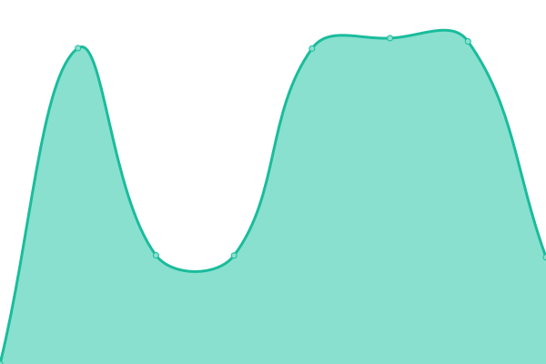
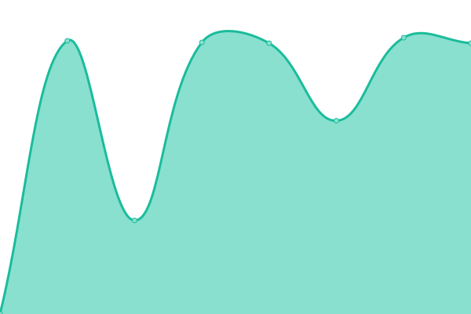
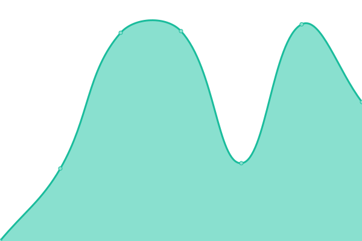

# [📈 Live Status](https://demo.upptime.js.org): <!--live status--> **🟧 Partial outage**

This repository contains the open-source uptime monitor and status page for [Patrick Little](Open.Canada.ca), powered by [Upptime](https://github.com/upptime/upptime).

With [Upptime](https://upptime.js.org), you can get your own unlimited and free uptime monitor and status page, powered entirely by a GitHub repository. We use [Issues](https://github.com/PatLittle/Consultations-Tracker/issues) as incident reports, [Actions](https://github.com/PatLittle/Consultations-Tracker/actions) as uptime monitors, and [Pages](https://demo.upptime.js.org) for the status page.

<!--start: status pages-->
<!-- This summary is generated by Upptime (https://github.com/upptime/upptime) -->
<!-- Do not edit this manually, your changes will be overwritten -->
<!-- prettier-ignore -->
| URL | Status | History | Response Time | Uptime |
| --- | ------ | ------- | ------------- | ------ |
|  [White River First Nations](https://www.rcaanc-cirnac.gc.ca/eng/1511969222951/1529103469169) | 🟩 Up | [white-river-first-nations.yml](https://github.com/PatLittle/Consultations-Tracker/commits/HEAD/history/white-river-first-nations.yml) | 

 1152ms
     
 | 

<a href="https://PatLittle.github.io/Consultations-Tracker/history/white-river-first-nations">98.38%</a>
    

|  [Administrative Monetary Penalty System Review](https://www.cbsa-asfc.gc.ca/trade-commerce/amps/menu-eng.html) | 🟩 Up | [administrative-monetary-penalty-system-review.yml](https://github.com/PatLittle/Consultations-Tracker/commits/HEAD/history/administrative-monetary-penalty-system-review.yml) | 

 209ms
     
 | 

<a href="https://PatLittle.github.io/Consultations-Tracker/history/administrative-monetary-penalty-system-review">100.00%</a>
    

|  [Regulatory Framework Plan](https://can01.safelinks.protection.outlook.com/?url=https%3A%2F%2Fwww.cer-rec.gc.ca%2Fen%2Fabout%2Fhow-we-regulate%2Fplans-for-regulatory-framework%2F&data=05%7C02%7CMichelle.Shabits%40cer-rec.gc.ca%7Cec1c386ebea64452821d08dc41ebb1b9%7C56e9b8d38a3549abbdfc27de59608f01%7C0%7C0%7C638457728797041411%7CUnknown%7CTWFpbGZsb3d8eyJWIjoiMC4wLjAwMDAiLCJQIjoiV2luMzIiLCJBTiI6Ik1haWwiLCJXVCI6Mn0%3D%7C0%7C%7C%7C&sdata=tKxvqtPetzkvcXlETiyyf51rWnRpUftsM2o2U5IySO4%3D&reserved=0) | 🟩 Up | [regulatory-framework-plan.yml](https://github.com/PatLittle/Consultations-Tracker/commits/HEAD/history/regulatory-framework-plan.yml) | 

 809ms
     
 | 

<a href="https://PatLittle.github.io/Consultations-Tracker/history/regulatory-framework-plan">100.00%</a>
    

|  [Regulated Industry Engagement](https://www.cer-rec.gc.ca/en/consultation-engagement/stakeholder-engagement/regulated-industry-engagement/index.html) | 🟩 Up | [regulated-industry-engagement.yml](https://github.com/PatLittle/Consultations-Tracker/commits/HEAD/history/regulated-industry-engagement.yml) | 

 236ms
     
 | 

<a href="https://PatLittle.github.io/Consultations-Tracker/history/regulated-industry-engagement">100.00%</a>
    

|  [Draft Contractor Oversight Guidance](https://www.cerdialogue.ca/contractor-oversight-guidance) | 🟩 Up | [draft-contractor-oversight-guidance.yml](https://github.com/PatLittle/Consultations-Tracker/commits/HEAD/history/draft-contractor-oversight-guidance.yml) | 

 911ms
     
 | 

<a href="https://PatLittle.github.io/Consultations-Tracker/history/draft-contractor-oversight-guidance">100.00%</a>
    

|  [Consultation on Automatic tax filing](https://www.canada.ca/en/revenue-agency/corporate/about-canada-revenue-agency-cra/transparency-proactive-disclosure-canada-revenue-agency/consultations-engagement-canada-revenue-agency/automatic-tax-filing-consultation.html) | 🟩 Up | [consultation-on-automatic-tax-filing.yml](https://github.com/PatLittle/Consultations-Tracker/commits/HEAD/history/consultation-on-automatic-tax-filing.yml) | 

 1372ms
     
 | 

<a href="https://PatLittle.github.io/Consultations-Tracker/history/consultation-on-automatic-tax-filing">100.00%</a>
    

|  [Share your thoughts: Proposed changes to the Chronic Wasting Disease Control Program](https://inspection.canada.ca/en/about-cfia/transparency/consultations-and-engagement/proposed-changes-chronic-wasting-disease-control-program) | 🟩 Up | [share-your-thoughts-proposed-changes-to-the-chronic-wasting-disease-control-program.yml](https://github.com/PatLittle/Consultations-Tracker/commits/HEAD/history/share-your-thoughts-proposed-changes-to-the-chronic-wasting-disease-control-program.yml) | 

 200ms
     
 | 

<a href="https://PatLittle.github.io/Consultations-Tracker/history/share-your-thoughts-proposed-changes-to-the-chronic-wasting-disease-control-program">100.00%</a>
    

|  [Share your thoughts: Proposed amended livestock feed ingredients – Yeast-based ingredients](https://inspection.canada.ca/en/about-cfia/transparency/consultations-and-engagement/yeast-based-ingredients) | 🟩 Up | [share-your-thoughts-proposed-amended-livestock-feed-ingredients-yeast-based-ingredients.yml](https://github.com/PatLittle/Consultations-Tracker/commits/HEAD/history/share-your-thoughts-proposed-amended-livestock-feed-ingredients-yeast-based-ingredients.yml) | 

 67ms
     
 | 

<a href="https://PatLittle.github.io/Consultations-Tracker/history/share-your-thoughts-proposed-amended-livestock-feed-ingredients-yeast-based-ingredients">100.00%</a>
    

|  [Public consultation on proposed regulatory changes in Canada Gazette Part I amending the Plant Breeders' Rights Regulations](https://gazette.gc.ca/rp-pr/p1/2025/2025-08-09/html/reg1-eng.html) | 🟩 Up | [public-consultation-on-proposed-regulatory-changes-in-canada-gazette-part-i-amending-the-plant-breeders-rights-regulations.yml](https://github.com/PatLittle/Consultations-Tracker/commits/HEAD/history/public-consultation-on-proposed-regulatory-changes-in-canada-gazette-part-i-amending-the-plant-breeders-rights-regulations.yml) | 

 0ms
     
 | 

<a href="https://PatLittle.github.io/Consultations-Tracker/history/public-consultation-on-proposed-regulatory-changes-in-canada-gazette-part-i-amending-the-plant-breeders-rights-regulations">100.00%</a>
    

|  [Share your thoughts: Proposal to deregulate Phytophthora abietivora in Canada](Share your thoughtsProposal to deregulate Phytophthora abietivora in Canada - inspection.canada.ca) | 🟥 Down | [share-your-thoughts-proposal-to-deregulate-phytophthora-abietivora-in-canada.yml](https://github.com/PatLittle/Consultations-Tracker/commits/HEAD/history/share-your-thoughts-proposal-to-deregulate-phytophthora-abietivora-in-canada.yml) | 

 0ms
     
 | 

<a href="https://PatLittle.github.io/Consultations-Tracker/history/share-your-thoughts-proposal-to-deregulate-phytophthora-abietivora-in-canada">100.00%</a>
    

|  [IPPC Member consultation on draft International Standards for Phytosanitary Measures and specifications](Canada's role in international plant protection - inspection.canada.ca) | 🟥 Down | [ippc-member-consultation-on-draft-international-standards-for-phytosanitary-measures-and-specifications.yml](https://github.com/PatLittle/Consultations-Tracker/commits/HEAD/history/ippc-member-consultation-on-draft-international-standards-for-phytosanitary-measures-and-specifications.yml) | 

 0ms
     
 | 

<a href="https://PatLittle.github.io/Consultations-Tracker/history/ippc-member-consultation-on-draft-international-standards-for-phytosanitary-measures-and-specifications">100.00%</a>
    

|  [Share your thoughts: Proposed amendments to the Susceptible species of aquatic animals list - Perkinsus olseni and Perkinsus marinus](https://inspection.canada.ca/en/about-cfia/transparency/consultations-and-engagement/susceptible-species-aquatic-animals-list) | 🟩 Up | [share-your-thoughts-proposed-amendments-to-the-susceptible-species-of-aquatic-animals-list-perkinsus-olseni-and-perkinsus-marinus.yml](https://github.com/PatLittle/Consultations-Tracker/commits/HEAD/history/share-your-thoughts-proposed-amendments-to-the-susceptible-species-of-aquatic-animals-list-perkinsus-olseni-and-perkinsus-marinus.yml) | 

 60ms
     
 | 

<a href="https://PatLittle.github.io/Consultations-Tracker/history/share-your-thoughts-proposed-amendments-to-the-susceptible-species-of-aquatic-animals-list-perkinsus-olseni-and-perkinsus-marinus">100.00%</a>
    

|  [Share your thoughts: Proposed amended livestock feed ingredient – 25-Hydroxyvitamin D3 monohydrate from fermentation process](Share your thoughtsProposed amended livestock feed ingredient – 25-Hydroxyvitamin D3 monohydrate from fermentation process - inspection.canada.ca) | 🟥 Down | [share-your-thoughts-proposed-amended-livestock-feed-ingredient-25-hydroxyvitamin-d3-monohydrate-from-fermentation-process.yml](https://github.com/PatLittle/Consultations-Tracker/commits/HEAD/history/share-your-thoughts-proposed-amended-livestock-feed-ingredient-25-hydroxyvitamin-d3-monohydrate-from-fermentation-process.yml) | 

 0ms
     
 | 

<a href="https://PatLittle.github.io/Consultations-Tracker/history/share-your-thoughts-proposed-amended-livestock-feed-ingredient-25-hydroxyvitamin-d3-monohydrate-from-fermentation-process">100.00%</a>
    

|  [Share your thoughts: Proposed changes to the Common Names for Ingredients and Components Document for milk ingredients and modified milk ingredients](N) | 🟥 Down | [share-your-thoughts-proposed-changes-to-the-common-names-for-ingredients-and-components-document-for-milk-ingredients-and-modified-milk-ingredients.yml](https://github.com/PatLittle/Consultations-Tracker/commits/HEAD/history/share-your-thoughts-proposed-changes-to-the-common-names-for-ingredients-and-components-document-for-milk-ingredients-and-modified-milk-ingredients.yml) | 

 0ms
     
 | 

<a href="https://PatLittle.github.io/Consultations-Tracker/history/share-your-thoughts-proposed-changes-to-the-common-names-for-ingredients-and-components-document-for-milk-ingredients-and-modified-milk-ingredients">100.00%</a>
    

|  [Share your thoughts: Canadian Food Inspection Agency's 2026 to 2028 Accessibility Plan](https://inspection.canada.ca/en/about-cfia/transparency/consultations-and-engagement/2026-2028-accessibility-plan) | 🟩 Up | [share-your-thoughts-canadian-food-inspection-agency-s-2026-to-2028-accessibility-plan.yml](https://github.com/PatLittle/Consultations-Tracker/commits/HEAD/history/share-your-thoughts-canadian-food-inspection-agency-s-2026-to-2028-accessibility-plan.yml) | 

 80ms
     
 | 

<a href="https://PatLittle.github.io/Consultations-Tracker/history/share-your-thoughts-canadian-food-inspection-agency-s-2026-to-2028-accessibility-plan">100.00%</a>
    

|  [Share your thoughts: Proposed new livestock feed ingredient – Lactobacillus crispatus culture dehydrated](Share your thoughtsProposed new livestock feed ingredient – Lactobacillus crispatus culture dehydrated) | 🟥 Down | [share-your-thoughts-proposed-new-livestock-feed-ingredient-lactobacillus-crispatus-culture-dehydrated.yml](https://github.com/PatLittle/Consultations-Tracker/commits/HEAD/history/share-your-thoughts-proposed-new-livestock-feed-ingredient-lactobacillus-crispatus-culture-dehydrated.yml) | 

 0ms
     
 | 

<a href="https://PatLittle.github.io/Consultations-Tracker/history/share-your-thoughts-proposed-new-livestock-feed-ingredient-lactobacillus-crispatus-culture-dehydrated">100.00%</a>
    

|  [Share your thoughts: Proposed new livestock feed ingredient – Lentilactobacillus buchneri culture dehydrated](Share your thoughtsProposed new livestock feed ingredient – Lentilactobacillus buchneri culture dehydrated - inspection.canada.ca) | 🟥 Down | [share-your-thoughts-proposed-new-livestock-feed-ingredient-lentilactobacillus-buchneri-culture-dehydrated.yml](https://github.com/PatLittle/Consultations-Tracker/commits/HEAD/history/share-your-thoughts-proposed-new-livestock-feed-ingredient-lentilactobacillus-buchneri-culture-dehydrated.yml) | 

 0ms
     
 | 

<a href="https://PatLittle.github.io/Consultations-Tracker/history/share-your-thoughts-proposed-new-livestock-feed-ingredient-lentilactobacillus-buchneri-culture-dehydrated">100.00%</a>
    

|  [Share your thoughts: Options for emerald ash borer management in Canada](https://inspection.canada.ca/en/about-cfia/transparency/consultations-and-engagement/risk-management-emerald-ash-borer) | 🟩 Up | [share-your-thoughts-options-for-emerald-ash-borer-management-in-canada.yml](https://github.com/PatLittle/Consultations-Tracker/commits/HEAD/history/share-your-thoughts-options-for-emerald-ash-borer-management-in-canada.yml) | 

 0ms
     
 | 

<a href="https://PatLittle.github.io/Consultations-Tracker/history/share-your-thoughts-options-for-emerald-ash-borer-management-in-canada">100.00%</a>
    

|  [Changing Narrative Fund](https://www.canada.ca/en/canadian-heritage/campaigns/changing-narratives-fund.html) | 🟩 Up | [changing-narrative-fund.yml](https://github.com/PatLittle/Consultations-Tracker/commits/HEAD/history/changing-narrative-fund.yml) | 

 2126ms
     
 | 

<a href="https://PatLittle.github.io/Consultations-Tracker/history/changing-narrative-fund">100.00%</a>
    

|  [2022-23 Consultations on renewal of the Museum Policy](https://www.canada.ca/en/canadian-heritage/campaigns/renewal-museum-policy.html) | 🟩 Up | [2022-23-consultations-on-renewal-of-the-museum-policy.yml](https://github.com/PatLittle/Consultations-Tracker/commits/HEAD/history/2022-23-consultations-on-renewal-of-the-museum-policy.yml) | 

 1794ms
     
 | 

<a href="https://PatLittle.github.io/Consultations-Tracker/history/2022-23-consultations-on-renewal-of-the-museum-policy">100.00%</a>
    

|  [REGDOC-3.2.2, Indigenous Engagement](https://www.cnsc-ccsn.gc.ca/eng/acts-and-regulations/regulatory-documents/history/regdoc3-2-2/) | 🟩 Up | [regdoc-3-2-2-indigenous-engagement.yml](https://github.com/PatLittle/Consultations-Tracker/commits/HEAD/history/regdoc-3-2-2-indigenous-engagement.yml) | 

 181ms
     
 | 

<a href="https://PatLittle.github.io/Consultations-Tracker/history/regdoc-3-2-2-indigenous-engagement">100.00%</a>
    

|  [REGDOC-2.13.2, Import and Export](https://www.cnsc-ccsn.gc.ca/eng/acts-and-regulations/regulatory-documents/history/regdoc2-13-2/) | 🟩 Up | [regdoc-2-13-2-import-and-export.yml](https://github.com/PatLittle/Consultations-Tracker/commits/HEAD/history/regdoc-2-13-2-import-and-export.yml) | 

 112ms
     
 | 

<a href="https://PatLittle.github.io/Consultations-Tracker/history/regdoc-2-13-2-import-and-export">100.00%</a>
    

|  [Co-development of a new Indigenous Broadcasting Policy](https://crtc.gc.ca/eng/archive/2019/2019-217.htm) | 🟥 Down | [co-development-of-a-new-indigenous-broadcasting-policy.yml](https://github.com/PatLittle/Consultations-Tracker/commits/HEAD/history/co-development-of-a-new-indigenous-broadcasting-policy.yml) | 

 0ms
     
 | 

<a href="https://PatLittle.github.io/Consultations-Tracker/history/co-development-of-a-new-indigenous-broadcasting-policy">100.00%</a>
    

|  [Share your thoughts about closed captioning of programming from online streaming services](https://crtc.gc.ca/eng/consultation/cc.htm) | 🟥 Down | [share-your-thoughts-about-closed-captioning-of-programming-from-online-streaming-services.yml](https://github.com/PatLittle/Consultations-Tracker/commits/HEAD/history/share-your-thoughts-about-closed-captioning-of-programming-from-online-streaming-services.yml) | 

 0ms
     
 | 

<a href="https://PatLittle.github.io/Consultations-Tracker/history/share-your-thoughts-about-closed-captioning-of-programming-from-online-streaming-services">100.00%</a>
    

|  [Share your thoughts about improving the National Public Alerting System](https://crtc.gc.ca/eng/consultation/pubalert.htm) | 🟥 Down | [share-your-thoughts-about-improving-the-national-public-alerting-system.yml](https://github.com/PatLittle/Consultations-Tracker/commits/HEAD/history/share-your-thoughts-about-improving-the-national-public-alerting-system.yml) | 

 0ms
     
 | 

<a href="https://PatLittle.github.io/Consultations-Tracker/history/share-your-thoughts-about-improving-the-national-public-alerting-system">100.00%</a>
    

|  [Share your thoughts about improving the resiliency of telecommunications networks and reliability of telecommunications services](https://crtc.gc.ca/eng/consultation/resilienctele.htm) | 🟥 Down | [share-your-thoughts-about-improving-the-resiliency-of-telecommunications-networks-and-reliability-of-telecommunications-services.yml](https://github.com/PatLittle/Consultations-Tracker/commits/HEAD/history/share-your-thoughts-about-improving-the-resiliency-of-telecommunications-networks-and-reliability-of-telecommunications-services.yml) | 

 0ms
     
 | 

<a href="https://PatLittle.github.io/Consultations-Tracker/history/share-your-thoughts-about-improving-the-resiliency-of-telecommunications-networks-and-reliability-of-telecommunications-services">100.00%</a>
    

|  [Consultation on the Application for Authorization of the Lac-Mégantic Rail Bypass Project](https://formulaires-forms.otc-cta.gc.ca/en/lac-megantic-bypass-railway-consultation) | 🟩 Up | [consultation-on-the-application-for-authorization-of-the-lac-megantic-rail-bypass-project.yml](https://github.com/PatLittle/Consultations-Tracker/commits/HEAD/history/consultation-on-the-application-for-authorization-of-the-lac-megantic-rail-bypass-project.yml) | 

 421ms
     
 | 

<a href="https://PatLittle.github.io/Consultations-Tracker/history/consultation-on-the-application-for-authorization-of-the-lac-megantic-rail-bypass-project">100.00%</a>
    

|  [National Infrastructure Assessment](https://www.infrastructure.gc.ca/nia-eni/index-eng.html) | 🟩 Up | [national-infrastructure-assessment.yml](https://github.com/PatLittle/Consultations-Tracker/commits/HEAD/history/national-infrastructure-assessment.yml) | 

 747ms
     
 | 

<a href="https://PatLittle.github.io/Consultations-Tracker/history/national-infrastructure-assessment">100.00%</a>
    

|  [National Capital (NCR) Residency for judges of the Federal Court and Tax Court of Canada](TBC) | 🟥 Down | [national-capital-ncr-residency-for-judges-of-the-federal-court-and-tax-court-of-canada.yml](https://github.com/PatLittle/Consultations-Tracker/commits/HEAD/history/national-capital-ncr-residency-for-judges-of-the-federal-court-and-tax-court-of-canada.yml) | 

 0ms
     
 | 

<a href="https://PatLittle.github.io/Consultations-Tracker/history/national-capital-ncr-residency-for-judges-of-the-federal-court-and-tax-court-of-canada">100.00%</a>
    

|  [Consultations for the 2026 Annual Report on the 2030 Agenda and the Sustainable Development Goals](https://www.canada.ca/en/employment-social-development/programs/sustainable-development-goals/2025-consultation.html) | 🟩 Up | [consultations-for-the-2026-annual-report-on-the-2030-agenda-and-the-sustainable-development-goals.yml](https://github.com/PatLittle/Consultations-Tracker/commits/HEAD/history/consultations-for-the-2026-annual-report-on-the-2030-agenda-and-the-sustainable-development-goals.yml) | 

 2575ms
     
 | 

<a href="https://PatLittle.github.io/Consultations-Tracker/history/consultations-for-the-2026-annual-report-on-the-2030-agenda-and-the-sustainable-development-goals">100.00%</a>
    

|  [Share your ideas: Blackwater Project](https://www.canada.ca/en/environment-climate-change/services/managing-pollution/sources-industry/mining/metal-diamond-mining-effluent-regulation/blackwater-consultation.html) | 🟥 Down | [share-your-ideas-blackwater-project.yml](https://github.com/PatLittle/Consultations-Tracker/commits/HEAD/history/share-your-ideas-blackwater-project.yml) | 

 2278ms
     
 | 

<a href="https://PatLittle.github.io/Consultations-Tracker/history/share-your-ideas-blackwater-project">100.00%</a>
    

|  [Consultation on Amending the List of Species under the Species at Risk Act: Terrestrial Species January 2025](https://canada-preview.adobecqms.net/en/environment-climate-change/services/species-risk-public-registry/consultation-documents/part-3-consultation-amending-terrestrial-species-list-sara-summary-jan-2025.html) | 🟩 Up | [consultation-on-amending-the-list-of-species-under-the-species-at-risk-act-terrestrial-species-january-2025.yml](https://github.com/PatLittle/Consultations-Tracker/commits/HEAD/history/consultation-on-amending-the-list-of-species-under-the-species-at-risk-act-terrestrial-species-january-2025.yml) | 

 1889ms
     
 | 

<a href="https://PatLittle.github.io/Consultations-Tracker/history/consultation-on-amending-the-list-of-species-under-the-species-at-risk-act-terrestrial-species-january-2025">100.00%</a>
    

|  [Consultation document on Phase 1 PFAS prohibition: Risk management of PFAS, excluding fluoropolymers, not currently regulated in firefighting foams](https://www.canada.ca/en/environment-climate-change/corporate/transparency/consultations/pfas-firefighting-foams-afff-phase1-prohibition.html) | 🟩 Up | [consultation-document-on-phase-1-pfas-prohibition-risk-management-of-pfas-excluding-fluoropolymers-not-currently-regulated-in-firefighting-foams.yml](https://github.com/PatLittle/Consultations-Tracker/commits/HEAD/history/consultation-document-on-phase-1-pfas-prohibition-risk-management-of-pfas-excluding-fluoropolymers-not-currently-regulated-in-firefighting-foams.yml) | 

 0ms
     
 | 

<a href="https://PatLittle.github.io/Consultations-Tracker/history/consultation-document-on-phase-1-pfas-prohibition-risk-management-of-pfas-excluding-fluoropolymers-not-currently-regulated-in-firefighting-foams">100.00%</a>
    

|  [20th Conference of the Parties to the Convention on International Trade in Endangered Species](https://www.canada.ca/en/environment-climate-change/services/convention-international-trade-endangered-species/consultation/share-view-ideas-20-cop-cites.html) | 🟩 Up | [20th-conference-of-the-parties-to-the-convention-on-international-trade-in-endangered-species.yml](https://github.com/PatLittle/Consultations-Tracker/commits/HEAD/history/20th-conference-of-the-parties-to-the-convention-on-international-trade-in-endangered-species.yml) | 

 0ms
     
 | 

<a href="https://PatLittle.github.io/Consultations-Tracker/history/20th-conference-of-the-parties-to-the-convention-on-international-trade-in-endangered-species">100.00%</a>
    

|  [Consultation on proposed amendments to the Volatile Organic Compound (VOC) concentration limits for automotive refinishing products regulations](https://www.canada.ca/en/environment-climate-change/services/canadian-environmental-protection-act-registry/publications/share-your-thoughts-amendments-volatile-organic-compound.html) | 🟩 Up | [consultation-on-proposed-amendments-to-the-volatile-organic-compound-voc-concentration-limits-for-automotive-refinishing-products-regulations.yml](https://github.com/PatLittle/Consultations-Tracker/commits/HEAD/history/consultation-on-proposed-amendments-to-the-volatile-organic-compound-voc-concentration-limits-for-automotive-refinishing-products-regulations.yml) | 

 3050ms
     
 | 

<a href="https://PatLittle.github.io/Consultations-Tracker/history/consultation-on-proposed-amendments-to-the-volatile-organic-compound-voc-concentration-limits-for-automotive-refinishing-products-regulations">100.00%</a>
    

|  [Amendments to the Volatile Organic Compound (VOC) Concentration Limits for Automotive Refinishing Regulations- Consultation Document](https://www.canada.ca/en/environment-climate-change/services/canadian-environmental-protection-act-registry/publications/share-your-thoughts-amendments-volatile-organic-compound.html) | 🟩 Up | [amendments-to-the-volatile-organic-compound-voc-concentration-limits-for-automotive-refinishing-regulations-consultation-document.yml](https://github.com/PatLittle/Consultations-Tracker/commits/HEAD/history/amendments-to-the-volatile-organic-compound-voc-concentration-limits-for-automotive-refinishing-regulations-consultation-document.yml) | 

 2062ms
     
 | 

<a href="https://PatLittle.github.io/Consultations-Tracker/history/amendments-to-the-volatile-organic-compound-voc-concentration-limits-for-automotive-refinishing-regulations-consultation-document">100.00%</a>
    

|  [Consultation Document on Phase 1 of the Risk Management of Per- and Polyfluoroalkyl Substances (PFAS), Excluding Fluoropolymers: Prohibition of the Use of PFAS, not Currently Regulated, in Firefighting Foams](https://canada.ca/en/environment-climate-change/corporate/transparency/consultations/pfas-firefighting-foams-afff-phase1-prohibition.html) | 🟩 Up | [consultation-document-on-phase-1-of-the-risk-management-of-per-and-polyfluoroalkyl-substances-pfas-excluding-fluoropolymers-prohibition-of-the-use-of-pfas-not-currently-regulated-in-firefighting-foams.yml](https://github.com/PatLittle/Consultations-Tracker/commits/HEAD/history/consultation-document-on-phase-1-of-the-risk-management-of-per-and-polyfluoroalkyl-substances-pfas-excluding-fluoropolymers-prohibition-of-the-use-of-pfas-not-currently-regulated-in-firefighting-foams.yml) | 

 0ms
     
 | 

<a href="https://PatLittle.github.io/Consultations-Tracker/history/consultation-document-on-phase-1-of-the-risk-management-of-per-and-polyfluoroalkyl-substances-pfas-excluding-fluoropolymers-prohibition-of-the-use-of-pfas-not-currently-regulated-in-firefighting-foams">100.00%</a>
    

|  [Evaluation by Environment and Climate Change Canada of the ongoing need for the Emergency Order for the Protection of the Western Chorus Frog (Longueuil)](https://www.canada.ca/en/environment-climate-change/services/species-risk-public-registry/consultation-documents/western-chorus-frog-longueuil-2025.html) | 🟩 Up | [evaluation-by-environment-and-climate-change-canada-of-the-ongoing-need-for-the-emergency-order-for-the-protection-of-the-western-chorus-frog-longueuil.yml](https://github.com/PatLittle/Consultations-Tracker/commits/HEAD/history/evaluation-by-environment-and-climate-change-canada-of-the-ongoing-need-for-the-emergency-order-for-the-protection-of-the-western-chorus-frog-longueuil.yml) | 

 1947ms
     
 | 

<a href="https://PatLittle.github.io/Consultations-Tracker/history/evaluation-by-environment-and-climate-change-canada-of-the-ongoing-need-for-the-emergency-order-for-the-protection-of-the-western-chorus-frog-longueuil">100.00%</a>
    

|  [Notice with respect to the availability of the proposed environmental occurrences notification agreements between Canada and Alberta, Canada and British Columbia, Canada and Manitoba, Canada and Ontario, Canada and Saskatchewan, and Canada and Yukon](https://www.canada.ca/en/environment-climate-change/services/canadian-environmental-protection-act-registry/agreements/occurrences-notification.html) | 🟩 Up | [notice-with-respect-to-the-availability-of-the-proposed-environmental-occurrences-notification-agreements-between-canada-and-alberta-canada-and-british-columbia-canada-and-manitoba-canada-and-ontario-canada-and-saskatchewan-and-canada-and-yukon.yml](https://github.com/PatLittle/Consultations-Tracker/commits/HEAD/history/notice-with-respect-to-the-availability-of-the-proposed-environmental-occurrences-notification-agreements-between-canada-and-alberta-canada-and-british-columbia-canada-and-manitoba-canada-and-ontario-canada-and-saskatchewan-and-canada-and-yukon.yml) | 

 2120ms
     
 | 

<a href="https://PatLittle.github.io/Consultations-Tracker/history/notice-with-respect-to-the-availability-of-the-proposed-environmental-occurrences-notification-agreements-between-canada-and-alberta-canada-and-british-columbia-canada-and-manitoba-canada-and-ontario-canada-and-saskatchewan-and-canada-and-yukon">100.00%</a>
    

|  [Draft Assessment for Manganese and its Compounds, and the Risk Management Scope](https://gazette.gc.ca/rp-pr/p1/2025/2025-10-25/html/notice-avis-eng.html#ne3) | 🟩 Up | [draft-assessment-for-manganese-and-its-compounds-and-the-risk-management-scope.yml](https://github.com/PatLittle/Consultations-Tracker/commits/HEAD/history/draft-assessment-for-manganese-and-its-compounds-and-the-risk-management-scope.yml) | 

 234ms
     
 | 

<a href="https://PatLittle.github.io/Consultations-Tracker/history/draft-assessment-for-manganese-and-its-compounds-and-the-risk-management-scope">100.00%</a>
    

|  [Notice with respect to the availability of the proposed environmental occurrences notification agreements between Canada and Alberta, Canada and British Columbia, Canada and Manitoba, Canada and Ontario, Canada and Saskatchewan, and Canada and Yukon](https://www.canada.ca/en/environment-climate-change/services/canadian-environmental-protection-act-registry/agreements/occurrences-notification.html) | 🟩 Up | [notice-with-respect-to-the-availability-of-the-proposed-environmental-occurrences-notification-agreements-between-canada-and-alberta-canada-and-british-columbia-canada-and-manitoba-canada-and-ontario-canada-and-saskatchewan-and-canada-and-yukon.yml](https://github.com/PatLittle/Consultations-Tracker/commits/HEAD/history/notice-with-respect-to-the-availability-of-the-proposed-environmental-occurrences-notification-agreements-between-canada-and-alberta-canada-and-british-columbia-canada-and-manitoba-canada-and-ontario-canada-and-saskatchewan-and-canada-and-yukon.yml) | 

 2120ms
     
 | 

<a href="https://PatLittle.github.io/Consultations-Tracker/history/notice-with-respect-to-the-availability-of-the-proposed-environmental-occurrences-notification-agreements-between-canada-and-alberta-canada-and-british-columbia-canada-and-manitoba-canada-and-ontario-canada-and-saskatchewan-and-canada-and-yukon">100.00%</a>
    

|  [Draft Assessment for Manganese and its Compounds, and the Risk Management Scope](https://gazette.gc.ca/rp-pr/p1/2025/2025-10-25/html/notice-avis-eng.html#ne3) | 🟩 Up | [draft-assessment-for-manganese-and-its-compounds-and-the-risk-management-scope.yml](https://github.com/PatLittle/Consultations-Tracker/commits/HEAD/history/draft-assessment-for-manganese-and-its-compounds-and-the-risk-management-scope.yml) | 

 234ms
     
 | 

<a href="https://PatLittle.github.io/Consultations-Tracker/history/draft-assessment-for-manganese-and-its-compounds-and-the-risk-management-scope">100.00%</a>
    

|  [Notice with respect to the availability of the proposed environmental occurrences notification agreements between Canada and Alberta, Canada and British Columbia, Canada and Manitoba, Canada and Ontario, Canada and Saskatchewan, and Canada and Yukon](https://www.canada.ca/en/environment-climate-change/services/canadian-environmental-protection-act-registry/agreements/occurrences-notification.html) | 🟩 Up | [notice-with-respect-to-the-availability-of-the-proposed-environmental-occurrences-notification-agreements-between-canada-and-alberta-canada-and-british-columbia-canada-and-manitoba-canada-and-ontario-canada-and-saskatchewan-and-canada-and-yukon.yml](https://github.com/PatLittle/Consultations-Tracker/commits/HEAD/history/notice-with-respect-to-the-availability-of-the-proposed-environmental-occurrences-notification-agreements-between-canada-and-alberta-canada-and-british-columbia-canada-and-manitoba-canada-and-ontario-canada-and-saskatchewan-and-canada-and-yukon.yml) | 

 2120ms
     
 | 

<a href="https://PatLittle.github.io/Consultations-Tracker/history/notice-with-respect-to-the-availability-of-the-proposed-environmental-occurrences-notification-agreements-between-canada-and-alberta-canada-and-british-columbia-canada-and-manitoba-canada-and-ontario-canada-and-saskatchewan-and-canada-and-yukon">100.00%</a>
    

|  [Engagement on renewing Canada’s National Financial Literacy Strategy](https://www.canada.ca/en/financial-consumer-agency/corporate/transparency/consultations/engagement-renewing-national-financial-literacy-strategy.html) | 🟩 Up | [engagement-on-renewing-canada-s-national-financial-literacy-strategy.yml](https://github.com/PatLittle/Consultations-Tracker/commits/HEAD/history/engagement-on-renewing-canada-s-national-financial-literacy-strategy.yml) | 

 1963ms
     
 | 

<a href="https://PatLittle.github.io/Consultations-Tracker/history/engagement-on-renewing-canada-s-national-financial-literacy-strategy">100.00%</a>
    

|  [Let's talk Pacific Salmon](https://letstalkpacificsalmon.ca/) | 🟩 Up | [let-s-talk-pacific-salmon.yml](https://github.com/PatLittle/Consultations-Tracker/commits/HEAD/history/let-s-talk-pacific-salmon.yml) | 

 1271ms
     
 | 

<a href="https://PatLittle.github.io/Consultations-Tracker/history/let-s-talk-pacific-salmon">100.00%</a>
    

|  [Proposed ticketing for the enforcement of a fisheries offence under the Fisheries Act](TBD) | 🟥 Down | [proposed-ticketing-for-the-enforcement-of-a-fisheries-offence-under-the-fisheries-act.yml](https://github.com/PatLittle/Consultations-Tracker/commits/HEAD/history/proposed-ticketing-for-the-enforcement-of-a-fisheries-offence-under-the-fisheries-act.yml) | 

 0ms
     
 | 

<a href="https://PatLittle.github.io/Consultations-Tracker/history/proposed-ticketing-for-the-enforcement-of-a-fisheries-offence-under-the-fisheries-act">100.00%</a>
    

|  [Whitby Harbour Remediation Project](https://www.dfo-mpo.gc.ca/sch-ppb/whitby/index-eng.html) | 🟩 Up | [whitby-harbour-remediation-project.yml](https://github.com/PatLittle/Consultations-Tracker/commits/HEAD/history/whitby-harbour-remediation-project.yml) | 

 338ms
     
 | 

<a href="https://PatLittle.github.io/Consultations-Tracker/history/whitby-harbour-remediation-project">100.00%</a>
    

|  [Public engagement on management measures in the Newfoundland and Labrador (NL) Recreational Groundfish Fishery](https://www.dfo-mpo.gc.ca/about-notre-sujet/engagement/2025/recreational-groundfish-fishery-peche-recreative-poisson-fond-eng.html) | 🟩 Up | [public-engagement-on-management-measures-in-the-newfoundland-and-labrador-nl-recreational-groundfish-fishery.yml](https://github.com/PatLittle/Consultations-Tracker/commits/HEAD/history/public-engagement-on-management-measures-in-the-newfoundland-and-labrador-nl-recreational-groundfish-fishery.yml) | 

 0ms
     
 | 

<a href="https://PatLittle.github.io/Consultations-Tracker/history/public-engagement-on-management-measures-in-the-newfoundland-and-labrador-nl-recreational-groundfish-fishery">100.00%</a>
    

|  [Stakeholder engagement on potential marine conservation areas in Newfoundland and Labrador Region](https://www.dfo-mpo.gc.ca/oceans/conservation/plan/index-eng.html) | 🟩 Up | [stakeholder-engagement-on-potential-marine-conservation-areas-in-newfoundland-and-labrador-region.yml](https://github.com/PatLittle/Consultations-Tracker/commits/HEAD/history/stakeholder-engagement-on-potential-marine-conservation-areas-in-newfoundland-and-labrador-region.yml) | 

 0ms
     
 | 

<a href="https://PatLittle.github.io/Consultations-Tracker/history/stakeholder-engagement-on-potential-marine-conservation-areas-in-newfoundland-and-labrador-region">100.00%</a>
    

|  [Great Slave Lake Integrated Fisheries Management Plan](https://www.dfo-mpo.gc.ca/about-notre-sujet/engagement/2025/great-slave-lake-grand-lac-esclaves-eng.html) | 🟩 Up | [great-slave-lake-integrated-fisheries-management-plan.yml](https://github.com/PatLittle/Consultations-Tracker/commits/HEAD/history/great-slave-lake-integrated-fisheries-management-plan.yml) | 

 56ms
     
 | 

<a href="https://PatLittle.github.io/Consultations-Tracker/history/great-slave-lake-integrated-fisheries-management-plan">100.00%</a>
    

|  [Proposed Amendments to the Export Permits Regulations](https://webarchiveweb.wayback.bac-lac.canada.ca/1/https://www.international.gc.ca/trade-commerce/controls-controles/expor/backgrounder-amendments-epr-information-modification-rle.aspx?lang=eng) | 🟩 Up | [proposed-amendments-to-the-export-permits-regulations.yml](https://github.com/PatLittle/Consultations-Tracker/commits/HEAD/history/proposed-amendments-to-the-export-permits-regulations.yml) | 

 500ms
     
 | 

<a href="https://PatLittle.github.io/Consultations-Tracker/history/proposed-amendments-to-the-export-permits-regulations">100.00%</a>
    

|  [Consultation on cyclobutrifluram, Proposed Maximum Residue Limit PMRL2025-19](https://www.canada.ca/en/health-canada/services/consumer-product-safety/pesticides-pest-management/public/consultations/proposed-maximum-residue-limit/2025/cyclobutrifluram.html) | 🟩 Up | [consultation-on-cyclobutrifluram-proposed-maximum-residue-limit-pmrl-2025-19.yml](https://github.com/PatLittle/Consultations-Tracker/commits/HEAD/history/consultation-on-cyclobutrifluram-proposed-maximum-residue-limit-pmrl-2025-19.yml) | 

 1660ms
     
 | 

<a href="https://PatLittle.github.io/Consultations-Tracker/history/consultation-on-cyclobutrifluram-proposed-maximum-residue-limit-pmrl-2025-19">100.00%</a>
    

|  [Consultation on fluoxapiprolin, Proposed Maximum Residue Limit PMRL2025-20](https://www.canada.ca/en/health-canada/services/consumer-product-safety/pesticides-pest-management/public/consultations/proposed-maximum-residue-limit/2025/fluoxapiprolin.html) | 🟩 Up | [consultation-on-fluoxapiprolin-proposed-maximum-residue-limit-pmrl-2025-20.yml](https://github.com/PatLittle/Consultations-Tracker/commits/HEAD/history/consultation-on-fluoxapiprolin-proposed-maximum-residue-limit-pmrl-2025-20.yml) | 

 2291ms
     
 | 

<a href="https://PatLittle.github.io/Consultations-Tracker/history/consultation-on-fluoxapiprolin-proposed-maximum-residue-limit-pmrl-2025-20">100.00%</a>
    

|  [Consultation: Adding melatonin for sleep-related use in the pediatric population to the Prescription Drug List](https://www.canada.ca/en/health-canada/programs/consultation-adding-melatonin-sleep-related-use-pediatric-population-prescription-drug-list.html) | 🟩 Up | [consultation-adding-melatonin-for-sleep-related-use-in-the-pediatric-population-to-the-prescription-drug-list.yml](https://github.com/PatLittle/Consultations-Tracker/commits/HEAD/history/consultation-adding-melatonin-for-sleep-related-use-in-the-pediatric-population-to-the-prescription-drug-list.yml) | 

 0ms
     
 | 

<a href="https://PatLittle.github.io/Consultations-Tracker/history/consultation-adding-melatonin-for-sleep-related-use-in-the-pediatric-population-to-the-prescription-drug-list">100.00%</a>
    

|  [Consultation for guidance on notifying Health Canada of foreign actions](https://www.canada.ca/en/health-canada/programs/consultation-draft-guidance-notifying-foreign-actions.html) | 🟩 Up | [consultation-for-guidance-on-notifying-health-canada-of-foreign-actions.yml](https://github.com/PatLittle/Consultations-Tracker/commits/HEAD/history/consultation-for-guidance-on-notifying-health-canada-of-foreign-actions.yml) | 

 2243ms
     
 | 

<a href="https://PatLittle.github.io/Consultations-Tracker/history/consultation-for-guidance-on-notifying-health-canada-of-foreign-actions">100.00%</a>
    

|  [Consultation on iron (present as Ferric Sodium EDTA Trihydrate) and associated end-use products, Proposed Re-evaluation Decision PRVD2025-08](https://www.canada.ca/en/health-canada/services/consumer-product-safety/pesticides-pest-management/public/consultations/proposed-re-evaluation-decisions/2025/iron-present-ferric-sodium-edta-trihydrate.html) | 🟩 Up | [consultation-on-iron-present-as-ferric-sodium-edta-trihydrate-and-associated-end-use-products-proposed-re-evaluation-decision-prvd-2025-08.yml](https://github.com/PatLittle/Consultations-Tracker/commits/HEAD/history/consultation-on-iron-present-as-ferric-sodium-edta-trihydrate-and-associated-end-use-products-proposed-re-evaluation-decision-prvd-2025-08.yml) | 

 1931ms
     
 | 

<a href="https://PatLittle.github.io/Consultations-Tracker/history/consultation-on-iron-present-as-ferric-sodium-edta-trihydrate-and-associated-end-use-products-proposed-re-evaluation-decision-prvd-2025-08">100.00%</a>
    

|  [Consultation on isocycloseram, Proposed Maximum Residue Limit PMRL2025-21](https://www.canada.ca/en/health-canada/services/consumer-product-safety/pesticides-pest-management/public/consultations/proposed-maximum-residue-limit/2025/isocycloseram.html) | 🟩 Up | [consultation-on-isocycloseram-proposed-maximum-residue-limit-pmrl-2025-21.yml](https://github.com/PatLittle/Consultations-Tracker/commits/HEAD/history/consultation-on-isocycloseram-proposed-maximum-residue-limit-pmrl-2025-21.yml) | 

 1950ms
     
 | 

<a href="https://PatLittle.github.io/Consultations-Tracker/history/consultation-on-isocycloseram-proposed-maximum-residue-limit-pmrl-2025-21">100.00%</a>
    

|  [Release of draft (step 2) ICH Guideline Q3E: Impurities: Guideline for Extractables and Leachables](https://www.canada.ca/en/health-canada/services/drugs-health-products/drug-products/applications-submissions/guidance-documents/international-council-harmonisation/consultations-notices.html) | 🟩 Up | [release-of-draft-step-2-ich-guideline-q3-e-impurities-guideline-for-extractables-and-leachables.yml](https://github.com/PatLittle/Consultations-Tracker/commits/HEAD/history/release-of-draft-step-2-ich-guideline-q3-e-impurities-guideline-for-extractables-and-leachables.yml) | 

 1939ms
     
 | 

<a href="https://PatLittle.github.io/Consultations-Tracker/history/release-of-draft-step-2-ich-guideline-q3-e-impurities-guideline-for-extractables-and-leachables">100.00%</a>
    

|  [Consultation on DEET plus related active toluamides and its associated end-use products, Proposed Re-evaluation Decision PRVD2025-09](https://www.canada.ca/en/health-canada/services/consumer-product-safety/pesticides-pest-management/public/consultations/proposed-re-evaluation-decisions/2025/deet-plus-related-active-toluamides.html) | 🟩 Up | [consultation-on-deet-plus-related-active-toluamides-and-its-associated-end-use-products-proposed-re-evaluation-decision-prvd-2025-09.yml](https://github.com/PatLittle/Consultations-Tracker/commits/HEAD/history/consultation-on-deet-plus-related-active-toluamides-and-its-associated-end-use-products-proposed-re-evaluation-decision-prvd-2025-09.yml) | 

 2121ms
     
 | 

<a href="https://PatLittle.github.io/Consultations-Tracker/history/consultation-on-deet-plus-related-active-toluamides-and-its-associated-end-use-products-proposed-re-evaluation-decision-prvd-2025-09">100.00%</a>
    

|  [Consultation: Draft guidance on preparing and submitting summary reports for marketed drugs and natural health products](https://www.canada.ca/en/health-canada/programs/consultation-draft-guidance-preparing-submitting-summary-reports-marketed-drugs-natural-health-products.html) | 🟩 Up | [consultation-draft-guidance-on-preparing-and-submitting-summary-reports-for-marketed-drugs-and-natural-health-products.yml](https://github.com/PatLittle/Consultations-Tracker/commits/HEAD/history/consultation-draft-guidance-on-preparing-and-submitting-summary-reports-for-marketed-drugs-and-natural-health-products.yml) | 

 2941ms
     
 | 

<a href="https://PatLittle.github.io/Consultations-Tracker/history/consultation-draft-guidance-on-preparing-and-submitting-summary-reports-for-marketed-drugs-and-natural-health-products">100.00%</a>
    

|  [Consultation on rectified clove leaf oil and DECCO 070 EC, Proposed Registration Decision PRD2025-13](https://www.canada.ca/en/health-canada/services/consumer-product-safety/pesticides-pest-management/public/consultations/proposed-registration-decisions/2025/rectified-clove-leaf-oil-decco-070-ec.html) | 🟩 Up | [consultation-on-rectified-clove-leaf-oil-and-decco-070-ec-proposed-registration-decision-prd-2025-13.yml](https://github.com/PatLittle/Consultations-Tracker/commits/HEAD/history/consultation-on-rectified-clove-leaf-oil-and-decco-070-ec-proposed-registration-decision-prd-2025-13.yml) | 

 2629ms
     
 | 

<a href="https://PatLittle.github.io/Consultations-Tracker/history/consultation-on-rectified-clove-leaf-oil-and-decco-070-ec-proposed-registration-decision-prd-2025-13">100.00%</a>
    

|  [Consultation on iodosulfuron-methyl-sodium and its associated end-use product, Proposed Re-evaluation Decision PRVD2025-10](https://www.canada.ca/en/health-canada/services/consumer-product-safety/pesticides-pest-management/public/consultations/proposed-re-evaluation-decisions/2025/iodosulfuron-methyl-sodium.html) | 🟩 Up | [consultation-on-iodosulfuron-methyl-sodium-and-its-associated-end-use-product-proposed-re-evaluation-decision-prvd-2025-10.yml](https://github.com/PatLittle/Consultations-Tracker/commits/HEAD/history/consultation-on-iodosulfuron-methyl-sodium-and-its-associated-end-use-product-proposed-re-evaluation-decision-prvd-2025-10.yml) | 

 1760ms
     
 | 

<a href="https://PatLittle.github.io/Consultations-Tracker/history/consultation-on-iodosulfuron-methyl-sodium-and-its-associated-end-use-product-proposed-re-evaluation-decision-prvd-2025-10">100.00%</a>
    

|  [Canada Gazette, Part I, Volume 159, Number 45: Regulations Amending the Medical Devices Regulations (Establishment Licences)](https://gazette.gc.ca/rp-pr/p1/2025/2025-11-08/html/reg1-eng.html) | 🟩 Up | [canada-gazette-part-i-volume-159-number-45-regulations-amending-the-medical-devices-regulations-establishment-licences.yml](https://github.com/PatLittle/Consultations-Tracker/commits/HEAD/history/canada-gazette-part-i-volume-159-number-45-regulations-amending-the-medical-devices-regulations-establishment-licences.yml) | 

 460ms
     
 | 

<a href="https://PatLittle.github.io/Consultations-Tracker/history/canada-gazette-part-i-volume-159-number-45-regulations-amending-the-medical-devices-regulations-establishment-licences">100.00%</a>
    

|  [Consultation on ethiprole, Proposed Maximum Residue Limit PMRL2025-23](https://www.canada.ca/en/health-canada/services/consumer-product-safety/pesticides-pest-management/public/consultations/proposed-maximum-residue-limit/2025/ethiprole.html) | 🟩 Up | [consultation-on-ethiprole-proposed-maximum-residue-limit-pmrl-2025-23.yml](https://github.com/PatLittle/Consultations-Tracker/commits/HEAD/history/consultation-on-ethiprole-proposed-maximum-residue-limit-pmrl-2025-23.yml) | 

 2301ms
     
 | 

<a href="https://PatLittle.github.io/Consultations-Tracker/history/consultation-on-ethiprole-proposed-maximum-residue-limit-pmrl-2025-23">100.00%</a>
    

|  [Consultation on quizalofop-ethyl, Proposed Maximum Residue Limit PMRL2025-24](https://www.canada.ca/en/health-canada/services/consumer-product-safety/pesticides-pest-management/public/consultations/proposed-maximum-residue-limit/2025/quizalofop-ethyl.html) | 🟩 Up | [consultation-on-quizalofop-ethyl-proposed-maximum-residue-limit-pmrl-2025-24.yml](https://github.com/PatLittle/Consultations-Tracker/commits/HEAD/history/consultation-on-quizalofop-ethyl-proposed-maximum-residue-limit-pmrl-2025-24.yml) | 

 2100ms
     
 | 

<a href="https://PatLittle.github.io/Consultations-Tracker/history/consultation-on-quizalofop-ethyl-proposed-maximum-residue-limit-pmrl-2025-24">100.00%</a>
    

|  [Consultation for pyrethrins, Proposed Maximum Residue Limit PMRL2025-25](https://www.canada.ca/en/health-canada/services/consumer-product-safety/pesticides-pest-management/public/consultations/proposed-maximum-residue-limit/2025/pyrethrins.html) | 🟩 Up | [consultation-for-pyrethrins-proposed-maximum-residue-limit-pmrl-2025-25.yml](https://github.com/PatLittle/Consultations-Tracker/commits/HEAD/history/consultation-for-pyrethrins-proposed-maximum-residue-limit-pmrl-2025-25.yml) | 

 1791ms
     
 | 

<a href="https://PatLittle.github.io/Consultations-Tracker/history/consultation-for-pyrethrins-proposed-maximum-residue-limit-pmrl-2025-25">100.00%</a>
    

|  [Consultation on penthiopyrad, Proposed Maximum Residue Limit PMRL2025-26](https://www.canada.ca/en/health-canada/services/consumer-product-safety/pesticides-pest-management/public/consultations/proposed-maximum-residue-limit/2025/penthiopyrad.html) | 🟩 Up | [consultation-on-penthiopyrad-proposed-maximum-residue-limit-pmrl-2025-26.yml](https://github.com/PatLittle/Consultations-Tracker/commits/HEAD/history/consultation-on-penthiopyrad-proposed-maximum-residue-limit-pmrl-2025-26.yml) | 

 1967ms
     
 | 

<a href="https://PatLittle.github.io/Consultations-Tracker/history/consultation-on-penthiopyrad-proposed-maximum-residue-limit-pmrl-2025-26">100.00%</a>
    

|  [Consultation on spidoxamat, Velancor, Plenexos Smart, Plenexos Care, Proposed Registration Decision PRD2025-15](https://www.canada.ca/en/health-canada/services/consumer-product-safety/pesticides-pest-management/public/consultations/proposed-registration-decisions/2025/spidoxamat-velancor-plenexos-smart-care.html) | 🟩 Up | [consultation-on-spidoxamat-velancor-plenexos-smart-plenexos-care-proposed-registration-decision-prd-2025-15.yml](https://github.com/PatLittle/Consultations-Tracker/commits/HEAD/history/consultation-on-spidoxamat-velancor-plenexos-smart-plenexos-care-proposed-registration-decision-prd-2025-15.yml) | 

 2071ms
     
 | 

<a href="https://PatLittle.github.io/Consultations-Tracker/history/consultation-on-spidoxamat-velancor-plenexos-smart-plenexos-care-proposed-registration-decision-prd-2025-15">100.00%</a>
    

|  [Consultation on spidoxamat, Proposed Maximum Residue Limit PMRL2025-27](https://www.canada.ca/en/health-canada/services/consumer-product-safety/pesticides-pest-management/public/consultations/proposed-maximum-residue-limit/2025/spidoxamat.html) | 🟩 Up | [consultation-on-spidoxamat-proposed-maximum-residue-limit-pmrl-2025-27.yml](https://github.com/PatLittle/Consultations-Tracker/commits/HEAD/history/consultation-on-spidoxamat-proposed-maximum-residue-limit-pmrl-2025-27.yml) | 

 1717ms
     
 | 

<a href="https://PatLittle.github.io/Consultations-Tracker/history/consultation-on-spidoxamat-proposed-maximum-residue-limit-pmrl-2025-27">100.00%</a>
    

|  [Consultation on proposed updates to the Cosmetic Ingredient Hotlist: Prohibited and restricted ingredients](https://www.canada.ca/en/health-canada/programs/consultation-proposed-updates-cosmetic-ingredients-hotlist.html) | 🟩 Up | [consultation-on-proposed-updates-to-the-cosmetic-ingredient-hotlist-prohibited-and-restricted-ingredients.yml](https://github.com/PatLittle/Consultations-Tracker/commits/HEAD/history/consultation-on-proposed-updates-to-the-cosmetic-ingredient-hotlist-prohibited-and-restricted-ingredients.yml) | 

 1039ms
     
 | 

<a href="https://PatLittle.github.io/Consultations-Tracker/history/consultation-on-proposed-updates-to-the-cosmetic-ingredient-hotlist-prohibited-and-restricted-ingredients">100.00%</a>
    

|  [Proposal to modify the List of Permitted Food Enzymes to authorize the use of exo-inulinase](https://www.canada.ca/en/health-canada/services/food-nutrition/legislation-guidelines/acts-regulations/notices-proposal-notices-modification/permitted-food-enzymes-authorize-exo-inulinase.html) | 🟩 Up | [proposal-to-modify-the-list-of-permitted-food-enzymes-to-authorize-the-use-of-exo-inulinase.yml](https://github.com/PatLittle/Consultations-Tracker/commits/HEAD/history/proposal-to-modify-the-list-of-permitted-food-enzymes-to-authorize-the-use-of-exo-inulinase.yml) | 

 1029ms
     
 | 

<a href="https://PatLittle.github.io/Consultations-Tracker/history/proposal-to-modify-the-list-of-permitted-food-enzymes-to-authorize-the-use-of-exo-inulinase">100.00%</a>
    

|  [Regulations Amending the Immigration and Refugee Protection Regulations (Temporary Foreign Workers)](https://gazette.gc.ca/rp-pr/p1/2021/2021-07-10/html/reg2-eng.html) | 🟩 Up | [regulations-amending-the-immigration-and-refugee-protection-regulations-temporary-foreign-workers.yml](https://github.com/PatLittle/Consultations-Tracker/commits/HEAD/history/regulations-amending-the-immigration-and-refugee-protection-regulations-temporary-foreign-workers.yml) | 

 200ms
     
 | 

<a href="https://PatLittle.github.io/Consultations-Tracker/history/regulations-amending-the-immigration-and-refugee-protection-regulations-temporary-foreign-workers">100.00%</a>
    

|  [Indian Oil and Gas Regulations - Phase II](http://www.pgic-iogc.gc.ca/eng/1471964522302/1471964567990) | 🟩 Up | [indian-oil-and-gas-regulations-phase-ii.yml](https://github.com/PatLittle/Consultations-Tracker/commits/HEAD/history/indian-oil-and-gas-regulations-phase-ii.yml) | 

 777ms
     
 | 

<a href="https://PatLittle.github.io/Consultations-Tracker/history/indian-oil-and-gas-regulations-phase-ii">100.00%</a>
    

|  [Indigenous Procurement Modernization (including Procurement Strategy for Aboriginal Business)](https://www.aadnc-aandc.gc.ca/eng/1554218527634/1554218554486) | 🟩 Up | [indigenous-procurement-modernization-including-procurement-strategy-for-aboriginal-business.yml](https://github.com/PatLittle/Consultations-Tracker/commits/HEAD/history/indigenous-procurement-modernization-including-procurement-strategy-for-aboriginal-business.yml) | 

 2244ms
     
 | 

<a href="https://PatLittle.github.io/Consultations-Tracker/history/indigenous-procurement-modernization-including-procurement-strategy-for-aboriginal-business">100.00%</a>
    

|  [Developing laws and regulations for First Nations drinking water and wastewater: engagement 2022/2023](Developing laws and regulations for First Nations drinking water and wastewaterengagement 2022/2023 (sac-isc.gc.ca)) | 🟥 Down | [developing-laws-and-regulations-for-first-nations-drinking-water-and-wastewater-engagement-2022-2023.yml](https://github.com/PatLittle/Consultations-Tracker/commits/HEAD/history/developing-laws-and-regulations-for-first-nations-drinking-water-and-wastewater-engagement-2022-2023.yml) | 

 0ms
     
 | 

<a href="https://PatLittle.github.io/Consultations-Tracker/history/developing-laws-and-regulations-for-first-nations-drinking-water-and-wastewater-engagement-2022-2023">100.00%</a>
    

|  [Competition Bureau invites feedback on changes to the Textile Labelling and Advertising Regulations](https://www.ic.gc.ca/eic/site/cb-bc.nsf/eng/h_00142.html) | 🟩 Up | [competition-bureau-invites-feedback-on-changes-to-the-textile-labelling-and-advertising-regulations.yml](https://github.com/PatLittle/Consultations-Tracker/commits/HEAD/history/competition-bureau-invites-feedback-on-changes-to-the-textile-labelling-and-advertising-regulations.yml) | 

 1546ms
     
 | 

<a href="https://PatLittle.github.io/Consultations-Tracker/history/competition-bureau-invites-feedback-on-changes-to-the-textile-labelling-and-advertising-regulations">100.00%</a>
    

|  [Canada Gazette, Part I: Public Consultations on proposed changes to the Patent Rules and Trademark Regulations in regards to the creation of the College of Patent Agents and Trademark Agents , as part of Budget Implementation Act, 2018, No. 2.](Not yet available) | 🟥 Down | [canada-gazette-part-i-public-consultations-on-proposed-changes-to-the-patent-rules-and-trademark-regulations-in-regards-to-the-creation-of-the-college-of-patent-agents-and-trademark-agents-as-part-of-budget-implementation-act-2018-no-2.yml](https://github.com/PatLittle/Consultations-Tracker/commits/HEAD/history/canada-gazette-part-i-public-consultations-on-proposed-changes-to-the-patent-rules-and-trademark-regulations-in-regards-to-the-creation-of-the-college-of-patent-agents-and-trademark-agents-as-part-of-budget-implementation-act-2018-no-2.yml) | 

 0ms
     
 | 

<a href="https://PatLittle.github.io/Consultations-Tracker/history/canada-gazette-part-i-public-consultations-on-proposed-changes-to-the-patent-rules-and-trademark-regulations-in-regards-to-the-creation-of-the-college-of-patent-agents-and-trademark-agents-as-part-of-budget-implementation-act-2018-no-2">100.00%</a>
    

|  [Notice No. TIPB-001-2024 — Petition to the Governor in Council concerning Telecom Decision CRTC 2023-358](https://canadagazette.gc.ca/rp-pr/p1/2024/2024-04-27/pdf/g1-15817.pdf) | 🟩 Up | [notice-no-tipb-001-2024-petition-to-the-governor-in-council-concerning-telecom-decision-crtc-2023-358.yml](https://github.com/PatLittle/Consultations-Tracker/commits/HEAD/history/notice-no-tipb-001-2024-petition-to-the-governor-in-council-concerning-telecom-decision-crtc-2023-358.yml) | 

 1845ms
     
 | 

<a href="https://PatLittle.github.io/Consultations-Tracker/history/notice-no-tipb-001-2024-petition-to-the-governor-in-council-concerning-telecom-decision-crtc-2023-358">100.00%</a>
    

|  [Amendments to Directive No 11R3, Surplus Income Directive](https://ised-isde.canada.ca/site/office-superintendent-bankruptcy/en/public-consultations) | 🟩 Up | [amendments-to-directive-no-11-r3-surplus-income-directive.yml](https://github.com/PatLittle/Consultations-Tracker/commits/HEAD/history/amendments-to-directive-no-11-r3-surplus-income-directive.yml) | 

 103ms
     
 | 

<a href="https://PatLittle.github.io/Consultations-Tracker/history/amendments-to-directive-no-11-r3-surplus-income-directive">100.00%</a>
    

|  [Consultation on a Policy, and Licensing, and Technical Framework for Supplemental Mobile Coverage by Satellite](https://ised-isde.canada.ca/site/spectrum-management-telecommunications/en/learn-more/key-documents/consultations/consultation-policy-licensing-and-technical-framework-supplemental-mobile-coverage-satellite) | 🟩 Up | [consultation-on-a-policy-and-licensing-and-technical-framework-for-supplemental-mobile-coverage-by-satellite.yml](https://github.com/PatLittle/Consultations-Tracker/commits/HEAD/history/consultation-on-a-policy-and-licensing-and-technical-framework-for-supplemental-mobile-coverage-by-satellite.yml) | 

 272ms
     
 | 

<a href="https://PatLittle.github.io/Consultations-Tracker/history/consultation-on-a-policy-and-licensing-and-technical-framework-for-supplemental-mobile-coverage-by-satellite">100.00%</a>
    

|  [Amendments to Directive No 2R2, Joint Filing, and to various forms](https://ised-isde.canada.ca/site/office-superintendent-bankruptcy/en/public-consultations) | 🟩 Up | [amendments-to-directive-no-2-r2-joint-filing-and-to-various-forms.yml](https://github.com/PatLittle/Consultations-Tracker/commits/HEAD/history/amendments-to-directive-no-2-r2-joint-filing-and-to-various-forms.yml) | 

 50ms
     
 | 

<a href="https://PatLittle.github.io/Consultations-Tracker/history/amendments-to-directive-no-2-r2-joint-filing-and-to-various-forms">100.00%</a>
    

|  [Amendments to Superintendent's directives relating to cybersecurity guidelines, minimum requirements and measures for the Licensed Insolvency Trustee community](https://ised-isde.canada.ca/site/office-superintendent-bankruptcy/en/public-consultations) | 🟩 Up | [amendments-to-superintendent-s-directives-relating-to-cybersecurity-guidelines-minimum-requirements-and-measures-for-the-licensed-insolvency-trustee-community.yml](https://github.com/PatLittle/Consultations-Tracker/commits/HEAD/history/amendments-to-superintendent-s-directives-relating-to-cybersecurity-guidelines-minimum-requirements-and-measures-for-the-licensed-insolvency-trustee-community.yml) | 

 49ms
     
 | 

<a href="https://PatLittle.github.io/Consultations-Tracker/history/amendments-to-superintendent-s-directives-relating-to-cybersecurity-guidelines-minimum-requirements-and-measures-for-the-licensed-insolvency-trustee-community">100.00%</a>
    

|  [Consultation on proposed harmonized requirements for the evaluation of software in software-controlled measuring devices](https://ised-isde.canada.ca/site/measurement-canada/en/consultations/consultation-proposed-harmonized-requirements-evaluation-software-software-controlled-measuring?auHash=eLMDgV8gUm3VSwLpDbcfAMkLCLJhXhGFYiZTkFfMeTA) | 🟩 Up | [consultation-on-proposed-harmonized-requirements-for-the-evaluation-of-software-in-software-controlled-measuring-devices.yml](https://github.com/PatLittle/Consultations-Tracker/commits/HEAD/history/consultation-on-proposed-harmonized-requirements-for-the-evaluation-of-software-in-software-controlled-measuring-devices.yml) | 

 0ms
     
 | 

<a href="https://PatLittle.github.io/Consultations-Tracker/history/consultation-on-proposed-harmonized-requirements-for-the-evaluation-of-software-in-software-controlled-measuring-devices">100.00%</a>
    

|  [Indigenous Advisory Circle](https://library-archives.canada.ca/eng/corporate/about-us/our-partners/Pages/indigenous-advisory-circle.aspx) | 🟩 Up | [indigenous-advisory-circle.yml](https://github.com/PatLittle/Consultations-Tracker/commits/HEAD/history/indigenous-advisory-circle.yml) | 

 2468ms
     
 | 

<a href="https://PatLittle.github.io/Consultations-Tracker/history/indigenous-advisory-circle">100.00%</a>
    

|  [Stakeholders' Forum](https://library-archives.canada.ca/eng/corporate/about-us/our-partners/pages/stakeholders-forum.aspx) | 🟩 Up | [stakeholders-forum.yml](https://github.com/PatLittle/Consultations-Tracker/commits/HEAD/history/stakeholders-forum.yml) | 

 2724ms
     
 | 

<a href="https://PatLittle.github.io/Consultations-Tracker/history/stakeholders-forum">100.00%</a>
    

|  [Services Consultation Committee](https://library-archives.canada.ca/eng/corporate/about-us/our-partners/Pages/services-consultation-group.aspx) | 🟩 Up | [services-consultation-committee.yml](https://github.com/PatLittle/Consultations-Tracker/commits/HEAD/history/services-consultation-committee.yml) | 

 2197ms
     
 | 

<a href="https://PatLittle.github.io/Consultations-Tracker/history/services-consultation-committee">100.00%</a>
    

|  [Youth Advisory Council](https://library-archives.canada.ca/eng/corporate/about-us/our-partners/Pages/youth-advisory-council.aspx) | 🟩 Up | [youth-advisory-council.yml](https://github.com/PatLittle/Consultations-Tracker/commits/HEAD/history/youth-advisory-council.yml) | 

 1834ms
     
 | 

<a href="https://PatLittle.github.io/Consultations-Tracker/history/youth-advisory-council">100.00%</a>
    

|  [Consultation to inform the regulatory development to support the implementation of An Act to amend the National Defence Act and to make related and consequential amendments to other Acts](https://www.canada.ca/en/department-national-defence/services/benefits-military/legal-services/victim-service-offence.html) | 🟩 Up | [consultation-to-inform-the-regulatory-development-to-support-the-implementation-of-an-act-to-amend-the-national-defence-act-and-to-make-related-and-consequential-amendments-to-other-acts.yml](https://github.com/PatLittle/Consultations-Tracker/commits/HEAD/history/consultation-to-inform-the-regulatory-development-to-support-the-implementation-of-an-act-to-amend-the-national-defence-act-and-to-make-related-and-consequential-amendments-to-other-acts.yml) | 

 2131ms
     
 | 

<a href="https://PatLittle.github.io/Consultations-Tracker/history/consultation-to-inform-the-regulatory-development-to-support-the-implementation-of-an-act-to-amend-the-national-defence-act-and-to-make-related-and-consequential-amendments-to-other-acts">100.00%</a>
    

|  [Consultation to inform the regulatory development to support the implementation of An Act to amend the National Defence Act and to make related and consequential amendments to other Acts](https://www.canada.ca/en/department-national-defence/services/benefits-military/legal-services/victim-service-offence.html) | 🟩 Up | [consultation-to-inform-the-regulatory-development-to-support-the-implementation-of-an-act-to-amend-the-national-defence-act-and-to-make-related-and-consequential-amendments-to-other-acts.yml](https://github.com/PatLittle/Consultations-Tracker/commits/HEAD/history/consultation-to-inform-the-regulatory-development-to-support-the-implementation-of-an-act-to-amend-the-national-defence-act-and-to-make-related-and-consequential-amendments-to-other-acts.yml) | 

 2131ms
     
 | 

<a href="https://PatLittle.github.io/Consultations-Tracker/history/consultation-to-inform-the-regulatory-development-to-support-the-implementation-of-an-act-to-amend-the-national-defence-act-and-to-make-related-and-consequential-amendments-to-other-acts">100.00%</a>
    

|  [Social systems professional services](www.marsdd.com) | 🟩 Up | [social-systems-professional-services.yml](https://github.com/PatLittle/Consultations-Tracker/commits/HEAD/history/social-systems-professional-services.yml) | 

 428ms
     
 | 

<a href="https://PatLittle.github.io/Consultations-Tracker/history/social-systems-professional-services">100.00%</a>
    

|  [Canada in a Changing Climate](https://natural-resources.canada.ca/climate-change/canada-changing-climate/canada-changing-climate-national-assessment-process) | 🟩 Up | [canada-in-a-changing-climate.yml](https://github.com/PatLittle/Consultations-Tracker/commits/HEAD/history/canada-in-a-changing-climate.yml) | 

 0ms
     
 | 

<a href="https://PatLittle.github.io/Consultations-Tracker/history/canada-in-a-changing-climate">100.00%</a>
    

|  [Indigenous Ministerial Arrangements Regulations](https://www.rncanengagenrcan.ca/en/content/development-new-indigenous-ministerial-arrangements-regulations) | 🟩 Up | [indigenous-ministerial-arrangements-regulations.yml](https://github.com/PatLittle/Consultations-Tracker/commits/HEAD/history/indigenous-ministerial-arrangements-regulations.yml) | 

 2082ms
     
 | 

<a href="https://PatLittle.github.io/Consultations-Tracker/history/indigenous-ministerial-arrangements-regulations">100.00%</a>
    

|  [Modernization of the Explosives Regulations, 2013](https://natural-resources.canada.ca/minerals-mining/explosives-fireworks-ammunition/explosives/amendments-explosives-regulations-2013) | 🟩 Up | [modernization-of-the-explosives-regulations-2013.yml](https://github.com/PatLittle/Consultations-Tracker/commits/HEAD/history/modernization-of-the-explosives-regulations-2013.yml) | 

 65ms
     
 | 

<a href="https://PatLittle.github.io/Consultations-Tracker/history/modernization-of-the-explosives-regulations-2013">100.00%</a>
    

|  [Canada-NS and Canada-NL Offshore Renewable Energy Regulations](https://natural-resources.canada.ca/energy-sources/renewable-energy/offshore-renewable-energy-regulations-initiative) | 🟩 Up | [canada-ns-and-canada-nl-offshore-renewable-energy-regulations.yml](https://github.com/PatLittle/Consultations-Tracker/commits/HEAD/history/canada-ns-and-canada-nl-offshore-renewable-energy-regulations.yml) | 

 41ms
     
 | 

<a href="https://PatLittle.github.io/Consultations-Tracker/history/canada-ns-and-canada-nl-offshore-renewable-energy-regulations">100.00%</a>
    

|  [Amending the Nuclear Liability and Compensation Regulations, pre-publication in CG Part I]([To be updated in fall]) | 🟥 Down | [amending-the-nuclear-liability-and-compensation-regulations-pre-publication-in-cg-part-i.yml](https://github.com/PatLittle/Consultations-Tracker/commits/HEAD/history/amending-the-nuclear-liability-and-compensation-regulations-pre-publication-in-cg-part-i.yml) | 

 0ms
     
 | 

<a href="https://PatLittle.github.io/Consultations-Tracker/history/amending-the-nuclear-liability-and-compensation-regulations-pre-publication-in-cg-part-i">100.00%</a>
    

|  [General Regulations under the Canada National Marine Conservation Areas Act](https://www.letstalknmcas.ca/) | 🟩 Up | [general-regulations-under-the-canada-national-marine-conservation-areas-act.yml](https://github.com/PatLittle/Consultations-Tracker/commits/HEAD/history/general-regulations-under-the-canada-national-marine-conservation-areas-act.yml) | 

 1302ms
     
 | 

<a href="https://PatLittle.github.io/Consultations-Tracker/history/general-regulations-under-the-canada-national-marine-conservation-areas-act">100.00%</a>
    

|  [Notice of Mooring Restrictions – Ontario Waterways - Trent-Severn Waterway National Historic Site](https://parks.canada.ca/lhn-nhs/on/trentsevern/info/avis-restrictions-amarrage-notice-mooring-restrictions/) | 🟩 Up | [notice-of-mooring-restrictions-ontario-waterways-trent-severn-waterway-national-historic-site.yml](https://github.com/PatLittle/Consultations-Tracker/commits/HEAD/history/notice-of-mooring-restrictions-ontario-waterways-trent-severn-waterway-national-historic-site.yml) | 

 605ms
     
 | 

<a href="https://PatLittle.github.io/Consultations-Tracker/history/notice-of-mooring-restrictions-ontario-waterways-trent-severn-waterway-national-historic-site">100.00%</a>
    

|  [Notice of Mooring Restrictions – Ontario Waterways - Rideau Canal National Historic Site](https://parks.canada.ca/lhn-nhs/on/rideau/info/avis-restrictions-amarrage-notice-mooring-restrictions/) | 🟩 Up | [notice-of-mooring-restrictions-ontario-waterways-rideau-canal-national-historic-site.yml](https://github.com/PatLittle/Consultations-Tracker/commits/HEAD/history/notice-of-mooring-restrictions-ontario-waterways-rideau-canal-national-historic-site.yml) | 

 355ms
     
 | 

<a href="https://PatLittle.github.io/Consultations-Tracker/history/notice-of-mooring-restrictions-ontario-waterways-rideau-canal-national-historic-site">100.00%</a>
    

|  [Fortress of Louisbourg National Historic Site Management Plan](https://www.pc.gc.ca/en/lhn-nhs/ns/louisbourg/info/plan) | 🟩 Up | [fortress-of-louisbourg-national-historic-site-management-plan.yml](https://github.com/PatLittle/Consultations-Tracker/commits/HEAD/history/fortress-of-louisbourg-national-historic-site-management-plan.yml) | 

 479ms
     
 | 

<a href="https://PatLittle.github.io/Consultations-Tracker/history/fortress-of-louisbourg-national-historic-site-management-plan">100.00%</a>
    

|  [Visitor Use Management - Jasper National Park](https://www.letstalkmountainparks.ca/visitor-use-management-jasper) | 🟩 Up | [visitor-use-management-jasper-national-park.yml](https://github.com/PatLittle/Consultations-Tracker/commits/HEAD/history/visitor-use-management-jasper-national-park.yml) | 

 692ms
     
 | 

<a href="https://PatLittle.github.io/Consultations-Tracker/history/visitor-use-management-jasper-national-park">100.00%</a>
    

|  [Visitor Use Management - Lake Louise Area](https://www.letstalkmountainparks.ca/lakelouisevum) | 🟩 Up | [visitor-use-management-lake-louise-area.yml](https://github.com/PatLittle/Consultations-Tracker/commits/HEAD/history/visitor-use-management-lake-louise-area.yml) | 

 635ms
     
 | 

<a href="https://PatLittle.github.io/Consultations-Tracker/history/visitor-use-management-lake-louise-area">100.00%</a>
    

|  [Updating the Community Plans for Field, B.C. and Lake Louise, Alberta](https://www.letstalkmountainparks.ca/communityplanupdates) | 🟩 Up | [updating-the-community-plans-for-field-b-c-and-lake-louise-alberta.yml](https://github.com/PatLittle/Consultations-Tracker/commits/HEAD/history/updating-the-community-plans-for-field-b-c-and-lake-louise-alberta.yml) | 

 568ms
     
 | 

<a href="https://PatLittle.github.io/Consultations-Tracker/history/updating-the-community-plans-for-field-b-c-and-lake-louise-alberta">100.00%</a>
    

|  [Saguenay-St. Lawrence Marine Park expansion project](https://parcmarin.qc.ca/consultations/home/) | 🟩 Up | [saguenay-st-lawrence-marine-park-expansion-project.yml](https://github.com/PatLittle/Consultations-Tracker/commits/HEAD/history/saguenay-st-lawrence-marine-park-expansion-project.yml) | 

 1652ms
     
 | 

<a href="https://PatLittle.github.io/Consultations-Tracker/history/saguenay-st-lawrence-marine-park-expansion-project">100.00%</a>
    

|  [Public Engagement on the Strategic Environmental Assessment for the Town of Banff railway lands area redevelopment plan](www.letstalkmountainparks.ca/town-of-banff-area-redevelopment-plan-strategic-environmental-assessment) | 🟩 Up | [public-engagement-on-the-strategic-environmental-assessment-for-the-town-of-banff-railway-lands-area-redevelopment-plan.yml](https://github.com/PatLittle/Consultations-Tracker/commits/HEAD/history/public-engagement-on-the-strategic-environmental-assessment-for-the-town-of-banff-railway-lands-area-redevelopment-plan.yml) | 

 775ms
     
 | 

<a href="https://PatLittle.github.io/Consultations-Tracker/history/public-engagement-on-the-strategic-environmental-assessment-for-the-town-of-banff-railway-lands-area-redevelopment-plan">100.00%</a>
    

|  [Town of Banff Railways Lands Area Redevelopment Plan - Term of Reference for Strategic Environmental Assessment](https://www.letstalkmountainparks.ca/town-of-banff-area-redevelopment-plan-strategic-environmental-assessment/widgets/194782/documents) | 🟩 Up | [town-of-banff-railways-lands-area-redevelopment-plan-term-of-reference-for-strategic-environmental-assessment.yml](https://github.com/PatLittle/Consultations-Tracker/commits/HEAD/history/town-of-banff-railways-lands-area-redevelopment-plan-term-of-reference-for-strategic-environmental-assessment.yml) | 

 315ms
     
 | 

<a href="https://PatLittle.github.io/Consultations-Tracker/history/town-of-banff-railways-lands-area-redevelopment-plan-term-of-reference-for-strategic-environmental-assessment">100.00%</a>
    

|  [Alexander Graham Bell National Historic Site Management Plan](https://parks.canada.ca/lhn-nhs/ns/grahambell/info/plan) | 🟩 Up | [alexander-graham-bell-national-historic-site-management-plan.yml](https://github.com/PatLittle/Consultations-Tracker/commits/HEAD/history/alexander-graham-bell-national-historic-site-management-plan.yml) | 

 190ms
     
 | 

<a href="https://PatLittle.github.io/Consultations-Tracker/history/alexander-graham-bell-national-historic-site-management-plan">100.00%</a>
    

|  [Consultation: Renewal of the Canadian Task Force on Preventive Health Care](https://www.canada.ca/en/public-health/programs/consultation-renewal-canadian-task-force-preventative-health-care.html) | 🟩 Up | [consultation-renewal-of-the-canadian-task-force-on-preventive-health-care.yml](https://github.com/PatLittle/Consultations-Tracker/commits/HEAD/history/consultation-renewal-of-the-canadian-task-force-on-preventive-health-care.yml) | 

 2132ms
     
 | 

<a href="https://PatLittle.github.io/Consultations-Tracker/history/consultation-renewal-of-the-canadian-task-force-on-preventive-health-care">100.00%</a>
    

|  [National Strategy to Combat Human Trafficking (HT) Targeted Engagement Annual Engagement](https://www.canada.ca/en/services/policing/police/crime-and-crime-prevention/human-trafficking-smuggling/nggmnt-rnwd-hmntrffckng.html) | 🟩 Up | [national-strategy-to-combat-human-trafficking-ht-targeted-engagement-annual-engagement.yml](https://github.com/PatLittle/Consultations-Tracker/commits/HEAD/history/national-strategy-to-combat-human-trafficking-ht-targeted-engagement-annual-engagement.yml) | 

 2424ms
     
 | 

<a href="https://PatLittle.github.io/Consultations-Tracker/history/national-strategy-to-combat-human-trafficking-ht-targeted-engagement-annual-engagement">100.00%</a>
    

|  [Targeted Stakeholder Engagement to Inform Canada’s Public Safety Broadband Network (PSBN)](https://www.canada.ca/en/services/policing/emergencies/consultation-governance-framework-psbn.html) | 🟩 Up | [targeted-stakeholder-engagement-to-inform-canada-s-public-safety-broadband-network-psbn.yml](https://github.com/PatLittle/Consultations-Tracker/commits/HEAD/history/targeted-stakeholder-engagement-to-inform-canada-s-public-safety-broadband-network-psbn.yml) | 

 1398ms
     
 | 

<a href="https://PatLittle.github.io/Consultations-Tracker/history/targeted-stakeholder-engagement-to-inform-canada-s-public-safety-broadband-network-psbn">100.00%</a>
    

|  [PSPC Controlled Goods Program’s Industry Engagement Committee (IEC)](https://www.tpsgc-pwgsc.gc.ca/pmc-cgp/pipmc-secgp-eng.html) | 🟥 Down | [pspc-controlled-goods-program-s-industry-engagement-committee-iec.yml](https://github.com/PatLittle/Consultations-Tracker/commits/HEAD/history/pspc-controlled-goods-program-s-industry-engagement-committee-iec.yml) | 

 0ms
     
 | 

<a href="https://PatLittle.github.io/Consultations-Tracker/history/pspc-controlled-goods-program-s-industry-engagement-committee-iec">100.00%</a>
    

|  [Three-year Departmental Accessibility Plan](https://www.canada.ca/en/public-services-procurement/corporate/accessibility.html) | 🟩 Up | [three-year-departmental-accessibility-plan.yml](https://github.com/PatLittle/Consultations-Tracker/commits/HEAD/history/three-year-departmental-accessibility-plan.yml) | 

 2257ms
     
 | 

<a href="https://PatLittle.github.io/Consultations-Tracker/history/three-year-departmental-accessibility-plan">100.00%</a>
    

|  [Domestic Assessment of Product Category Filters for the Green Public Procurement Tool (GPPT)](https://circularinnovation.ca/pspc-consultation-sessions-and-registration/) | 🟩 Up | [domestic-assessment-of-product-category-filters-for-the-green-public-procurement-tool-gppt.yml](https://github.com/PatLittle/Consultations-Tracker/commits/HEAD/history/domestic-assessment-of-product-category-filters-for-the-green-public-procurement-tool-gppt.yml) | 

 924ms
     
 | 

<a href="https://PatLittle.github.io/Consultations-Tracker/history/domestic-assessment-of-product-category-filters-for-the-green-public-procurement-tool-gppt">100.00%</a>
    

|  [Multifactor Productivity Application](https://www.statcan.gc.ca/eng/consultation/2019/mpa) | 🟩 Up | [multifactor-productivity-application.yml](https://github.com/PatLittle/Consultations-Tracker/commits/HEAD/history/multifactor-productivity-application.yml) | 

 834ms
     
 | 

<a href="https://PatLittle.github.io/Consultations-Tracker/history/multifactor-productivity-application">100.00%</a>
    

|  [Statistics Canada Client Survey 2022](https://www.statcan.gc.ca/en/consultation/2022/sccs2022) | 🟩 Up | [statistics-canada-client-survey-2022.yml](https://github.com/PatLittle/Consultations-Tracker/commits/HEAD/history/statistics-canada-client-survey-2022.yml) | 

 516ms
     
 | 

<a href="https://PatLittle.github.io/Consultations-Tracker/history/statistics-canada-client-survey-2022">100.00%</a>
    

|  [Census of the Environment Program](https://www.statcan.gc.ca/en/consultation/2022/coep) | 🟩 Up | [census-of-the-environment-program.yml](https://github.com/PatLittle/Consultations-Tracker/commits/HEAD/history/census-of-the-environment-program.yml) | 

 453ms
     
 | 

<a href="https://PatLittle.github.io/Consultations-Tracker/history/census-of-the-environment-program">100.00%</a>
    

|  [Missing persons data standards consultative engagement](https://www.statcan.gc.ca/en/consultation/2023/missing-persons-data-standards) | 🟩 Up | [missing-persons-data-standards-consultative-engagement.yml](https://github.com/PatLittle/Consultations-Tracker/commits/HEAD/history/missing-persons-data-standards-consultative-engagement.yml) | 

 87ms
     
 | 

<a href="https://PatLittle.github.io/Consultations-Tracker/history/missing-persons-data-standards-consultative-engagement">100.00%</a>
    

|  [Invitation to participate in the revision of the North American Industry Classification System (NAICS) Canada](https://www.statcan.gc.ca/en/consultation/2023/naics) | 🟩 Up | [invitation-to-participate-in-the-revision-of-the-north-american-industry-classification-system-naics-canada.yml](https://github.com/PatLittle/Consultations-Tracker/commits/HEAD/history/invitation-to-participate-in-the-revision-of-the-north-american-industry-classification-system-naics-canada.yml) | 

 0ms
     
 | 

<a href="https://PatLittle.github.io/Consultations-Tracker/history/invitation-to-participate-in-the-revision-of-the-north-american-industry-classification-system-naics-canada">100.00%</a>
    

|  [Invitation to participate in the revision of the North American Product Classification System (NAPCS) Canada](https://www.statcan.gc.ca/en/consultation/2023/napcs) | 🟩 Up | [invitation-to-participate-in-the-revision-of-the-north-american-product-classification-system-napcs-canada.yml](https://github.com/PatLittle/Consultations-Tracker/commits/HEAD/history/invitation-to-participate-in-the-revision-of-the-north-american-product-classification-system-napcs-canada.yml) | 

 0ms
     
 | 

<a href="https://PatLittle.github.io/Consultations-Tracker/history/invitation-to-participate-in-the-revision-of-the-north-american-product-classification-system-napcs-canada">100.00%</a>
    

|  [Invitation to participate in the revision of the Classification of Instructional Programs (CIP) Canada](https://www.statcan.gc.ca/en/consultation/2024/cip) | 🟩 Up | [invitation-to-participate-in-the-revision-of-the-classification-of-instructional-programs-cip-canada.yml](https://github.com/PatLittle/Consultations-Tracker/commits/HEAD/history/invitation-to-participate-in-the-revision-of-the-classification-of-instructional-programs-cip-canada.yml) | 

 0ms
     
 | 

<a href="https://PatLittle.github.io/Consultations-Tracker/history/invitation-to-participate-in-the-revision-of-the-classification-of-instructional-programs-cip-canada">100.00%</a>
    

|  [Invitation to participate in the revision of the National Occupational Classification (NOC)](https://www.statcan.gc.ca/en/consultation/2024/noc) | 🟩 Up | [invitation-to-participate-in-the-revision-of-the-national-occupational-classification-noc.yml](https://github.com/PatLittle/Consultations-Tracker/commits/HEAD/history/invitation-to-participate-in-the-revision-of-the-national-occupational-classification-noc.yml) | 

 0ms
     
 | 

<a href="https://PatLittle.github.io/Consultations-Tracker/history/invitation-to-participate-in-the-revision-of-the-national-occupational-classification-noc">100.00%</a>
    

|  [Participate in the permanent consultation for the revision of the Canadian Research and Development Classification (CRDC)](https://www.statcan.gc.ca/en/consultation/2025/crdc) | 🟩 Up | [participate-in-the-permanent-consultation-for-the-revision-of-the-canadian-research-and-development-classification-crdc.yml](https://github.com/PatLittle/Consultations-Tracker/commits/HEAD/history/participate-in-the-permanent-consultation-for-the-revision-of-the-canadian-research-and-development-classification-crdc.yml) | 

 0ms
     
 | 

<a href="https://PatLittle.github.io/Consultations-Tracker/history/participate-in-the-permanent-consultation-for-the-revision-of-the-canadian-research-and-development-classification-crdc">100.00%</a>
    

|  [Contribute to Statistics Canada's Web modernization Journey](https://www.statcan.gc.ca/en/consultation/2025/web-modernization-journey) | 🟩 Up | [contribute-to-statistics-canada-s-web-modernization-journey.yml](https://github.com/PatLittle/Consultations-Tracker/commits/HEAD/history/contribute-to-statistics-canada-s-web-modernization-journey.yml) | 

 46ms
     
 | 

<a href="https://PatLittle.github.io/Consultations-Tracker/history/contribute-to-statistics-canada-s-web-modernization-journey">100.00%</a>
    

|  [Share your feedback on Census of Environment products](https://www.statcan.gc.ca/en/consultation/2025/census-environment-products) | 🟩 Up | [share-your-feedback-on-census-of-environment-products.yml](https://github.com/PatLittle/Consultations-Tracker/commits/HEAD/history/share-your-feedback-on-census-of-environment-products.yml) | 

 148ms
     
 | 

<a href="https://PatLittle.github.io/Consultations-Tracker/history/share-your-feedback-on-census-of-environment-products">100.00%</a>
    

|  [Share your experiences with the Labour Force Survey](https://www.statcan.gc.ca/en/consultation/2025/labour-force-survey) | 🟩 Up | [share-your-experiences-with-the-labour-force-survey.yml](https://github.com/PatLittle/Consultations-Tracker/commits/HEAD/history/share-your-experiences-with-the-labour-force-survey.yml) | 

 341ms
     
 | 

<a href="https://PatLittle.github.io/Consultations-Tracker/history/share-your-experiences-with-the-labour-force-survey">100.00%</a>
    

|  [Contribute to Statistics Canada’s consultative engagement on the Residential Building Occupancy Project](https://www.statcan.gc.ca/en/consultation/2025/rbo) | 🟩 Up | [contribute-to-statistics-canada-s-consultative-engagement-on-the-residential-building-occupancy-project.yml](https://github.com/PatLittle/Consultations-Tracker/commits/HEAD/history/contribute-to-statistics-canada-s-consultative-engagement-on-the-residential-building-occupancy-project.yml) | 

 208ms
     
 | 

<a href="https://PatLittle.github.io/Consultations-Tracker/history/contribute-to-statistics-canada-s-consultative-engagement-on-the-residential-building-occupancy-project">100.00%</a>
    

|  [Watchlist 2020 mid-cycle consultation with industry](https://www.tsb.gc.ca/eng/qui-about/relation.html) | 🟥 Down | [watchlist-2020-mid-cycle-consultation-with-industry.yml](https://github.com/PatLittle/Consultations-Tracker/commits/HEAD/history/watchlist-2020-mid-cycle-consultation-with-industry.yml) | 

 543ms
     
 | 

<a href="https://PatLittle.github.io/Consultations-Tracker/history/watchlist-2020-mid-cycle-consultation-with-industry">100.00%</a>
    

|  [Watchlist 2025 mid-cycle consultations with industry](https://www.tsb.gc.ca/eng/surveillance-watchlist/2022.html) | 🟩 Up | [watchlist-2025-mid-cycle-consultations-with-industry.yml](https://github.com/PatLittle/Consultations-Tracker/commits/HEAD/history/watchlist-2025-mid-cycle-consultations-with-industry.yml) | 

 1160ms
     
 | 

<a href="https://PatLittle.github.io/Consultations-Tracker/history/watchlist-2025-mid-cycle-consultations-with-industry">100.00%</a>
    

|  [Oceans Protection Plan](https://www.letstalktransportation.ca/OPP) | 🟩 Up | [oceans-protection-plan.yml](https://github.com/PatLittle/Consultations-Tracker/commits/HEAD/history/oceans-protection-plan.yml) | 

 798ms
     
 | 

<a href="https://PatLittle.github.io/Consultations-Tracker/history/oceans-protection-plan">100.00%</a>
    

|  [OPP - Understanding the Cumulative Effects of Marine Vessel Activity on Coastal and Marine Environments](https://letstalktransportation.ca/understanding-the-effects-of-marine-vessel-activity-on-coastal-environments) | 🟩 Up | [opp-understanding-the-cumulative-effects-of-marine-vessel-activity-on-coastal-and-marine-environments.yml](https://github.com/PatLittle/Consultations-Tracker/commits/HEAD/history/opp-understanding-the-cumulative-effects-of-marine-vessel-activity-on-coastal-and-marine-environments.yml) | 

 424ms
     
 | 

<a href="https://PatLittle.github.io/Consultations-Tracker/history/opp-understanding-the-cumulative-effects-of-marine-vessel-activity-on-coastal-and-marine-environments">100.00%</a>
    

|  [OPP: Northern Low-Impact Shipping Corridors](https://www.dfo-mpo.gc.ca/about-notre-sujet/engagement/2021/shipping-corridors-navigation-eng.html) | 🟩 Up | [opp-northern-low-impact-shipping-corridors.yml](https://github.com/PatLittle/Consultations-Tracker/commits/HEAD/history/opp-northern-low-impact-shipping-corridors.yml) | 

 206ms
     
 | 

<a href="https://PatLittle.github.io/Consultations-Tracker/history/opp-northern-low-impact-shipping-corridors">100.00%</a>
    

|  [TBD: Zero Emission Vehicle Safety (Electric Battery and Hydrogen)](https://N/A) | 🟥 Down | [tbd-zero-emission-vehicle-safety-electric-battery-and-hydrogen.yml](https://github.com/PatLittle/Consultations-Tracker/commits/HEAD/history/tbd-zero-emission-vehicle-safety-electric-battery-and-hydrogen.yml) | 

 0ms
     
 | 

<a href="https://PatLittle.github.io/Consultations-Tracker/history/tbd-zero-emission-vehicle-safety-electric-battery-and-hydrogen">100.00%</a>
    

|  [Fee Modernization Initiative for Transport Canada's Owned and Operated Ports](https://NA) | 🟥 Down | [fee-modernization-initiative-for-transport-canada-s-owned-and-operated-ports.yml](https://github.com/PatLittle/Consultations-Tracker/commits/HEAD/history/fee-modernization-initiative-for-transport-canada-s-owned-and-operated-ports.yml) | 

 0ms
     
 | 

<a href="https://PatLittle.github.io/Consultations-Tracker/history/fee-modernization-initiative-for-transport-canada-s-owned-and-operated-ports">100.00%</a>
    

|  [Proposed amendments to the Environmental Response Regulations](TBD) | 🟥 Down | [proposed-amendments-to-the-environmental-response-regulations.yml](https://github.com/PatLittle/Consultations-Tracker/commits/HEAD/history/proposed-amendments-to-the-environmental-response-regulations.yml) | 

 0ms
     
 | 

<a href="https://PatLittle.github.io/Consultations-Tracker/history/proposed-amendments-to-the-environmental-response-regulations">100.00%</a>
    

|  [Canadian Marine Advisory Council - Fall 2025](https://tc.canada.ca/en/marine/canadian-marine-advisory-council-cmac-engagement-opportunity-marine-safety-security-regulations#canada_gazette_1) | 🟩 Up | [canadian-marine-advisory-council-fall-2025.yml](https://github.com/PatLittle/Consultations-Tracker/commits/HEAD/history/canadian-marine-advisory-council-fall-2025.yml) | 

 547ms
     
 | 

<a href="https://PatLittle.github.io/Consultations-Tracker/history/canadian-marine-advisory-council-fall-2025">100.00%</a>
    

|  [Commercial Air Services Standards Omnibus Package](https://NA) | 🟥 Down | [commercial-air-services-standards-omnibus-package.yml](https://github.com/PatLittle/Consultations-Tracker/commits/HEAD/history/commercial-air-services-standards-omnibus-package.yml) | 

 0ms
     
 | 

<a href="https://PatLittle.github.io/Consultations-Tracker/history/commercial-air-services-standards-omnibus-package">0.00%</a>
    

|  [Consultation to fuel Transport Canada’s Accessibility plan 2026-2028](https://NA) | 🟥 Down | [consultation-to-fuel-transport-canada-s-accessibility-plan-2026-2028.yml](https://github.com/PatLittle/Consultations-Tracker/commits/HEAD/history/consultation-to-fuel-transport-canada-s-accessibility-plan-2026-2028.yml) | 

 0ms
     
 | 

<a href="https://PatLittle.github.io/Consultations-Tracker/history/consultation-to-fuel-transport-canada-s-accessibility-plan-2026-2028">100.00%</a>
    

|  [PICA 2025-001: Use of Foreign Ex-Military Aircraft in Canadian Commercial Aviation](https://wwwapps.tc.gc.ca/Saf-Sec-Sur/2/NPA-APM/npaapmr.aspx?id=3064&GoCTemplateCulture=en-CA) | 🟩 Up | [pica-2025-001-use-of-foreign-ex-military-aircraft-in-canadian-commercial-aviation.yml](https://github.com/PatLittle/Consultations-Tracker/commits/HEAD/history/pica-2025-001-use-of-foreign-ex-military-aircraft-in-canadian-commercial-aviation.yml) | 

 0ms
     
 | 

<a href="https://PatLittle.github.io/Consultations-Tracker/history/pica-2025-001-use-of-foreign-ex-military-aircraft-in-canadian-commercial-aviation">100.00%</a>
    

|  [NPA 2025-005 - Simultaneous Independent Parallel Instrument Approaches – Closely Spaced Parallel Operations (CSPO) / Precision Runway Monitor (PRM)](https://wwwapps.tc.gc.ca/Saf-Sec-Sur/2/NPA-APM/npaapmr.aspx?id=3062&GoCTemplateCulture=en-CA) | 🟩 Up | [npa-2025-005-simultaneous-independent-parallel-instrument-approaches-closely-spaced-parallel-operations-cspo-precision-runway-monitor-prm.yml](https://github.com/PatLittle/Consultations-Tracker/commits/HEAD/history/npa-2025-005-simultaneous-independent-parallel-instrument-approaches-closely-spaced-parallel-operations-cspo-precision-runway-monitor-prm.yml) | 

 127ms
     
 | 

<a href="https://PatLittle.github.io/Consultations-Tracker/history/npa-2025-005-simultaneous-independent-parallel-instrument-approaches-closely-spaced-parallel-operations-cspo-precision-runway-monitor-prm">100.00%</a>
    

|  [Canadian experience with vehicle headlights and glare during night-time driving](https://NA) | 🟥 Down | [canadian-experience-with-vehicle-headlights-and-glare-during-night-time-driving.yml](https://github.com/PatLittle/Consultations-Tracker/commits/HEAD/history/canadian-experience-with-vehicle-headlights-and-glare-during-night-time-driving.yml) | 

 0ms
     
 | 

<a href="https://PatLittle.github.io/Consultations-Tracker/history/canadian-experience-with-vehicle-headlights-and-glare-during-night-time-driving">100.00%</a>
    

|  [Creating Canada’s 6th  National Action Plan on Open Government](https://letstalkopengovernment.ca/) | 🟥 Down | [creating-canada-s-6th-national-action-plan-on-open-government.yml](https://github.com/PatLittle/Consultations-Tracker/commits/HEAD/history/creating-canada-s-6th-national-action-plan-on-open-government.yml) | 

 148ms
     
 | 

<a href="https://PatLittle.github.io/Consultations-Tracker/history/creating-canada-s-6th-national-action-plan-on-open-government">100.00%</a>
    

|  [Ministerial Advisory Groups • Recognition  •  Families  • Care and Support • Policy •  Health and Well-being • Service Excellence and Transition](https://www.veterans.gc.ca/en/about-vac/public-engagement/ministerial-advisory-groups) | 🟩 Up | [ministerial-advisory-groups-recognition-families-care-and-support-policy-health-and-well-being-service-excellence-and-transition.yml](https://github.com/PatLittle/Consultations-Tracker/commits/HEAD/history/ministerial-advisory-groups-recognition-families-care-and-support-policy-health-and-well-being-service-excellence-and-transition.yml) | 

 272ms
     
 | 

<a href="https://PatLittle.github.io/Consultations-Tracker/history/ministerial-advisory-groups-recognition-families-care-and-support-policy-health-and-well-being-service-excellence-and-transition">100.00%</a>
    

<!--end: status pages-->

[**Visit our status website →**](https://demo.upptime.js.org)

## 📄 License

- Powered by: [Upptime](https://github.com/upptime/upptime)
- Code: [MIT](./LICENSE) © [Patrick Little](Open.Canada.ca)
- Data in the `./history` directory: [Open Database License](https://opendatacommons.org/licenses/odbl/1-0/)
