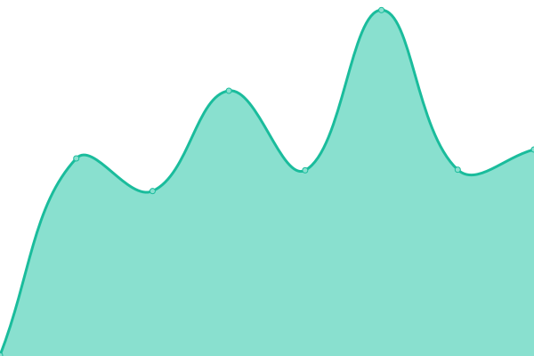

# [📈 Live Status](https://demo.upptime.js.org): <!--live status--> **🟧 Partial outage**

This repository contains the open-source uptime monitor and status page for [Patrick Little](Open.Canada.ca), powered by [Upptime](https://github.com/upptime/upptime).

With [Upptime](https://upptime.js.org), you can get your own unlimited and free uptime monitor and status page, powered entirely by a GitHub repository. We use [Issues](https://github.com/PatLittle/Consultations-Tracker/issues) as incident reports, [Actions](https://github.com/PatLittle/Consultations-Tracker/actions) as uptime monitors, and [Pages](https://demo.upptime.js.org) for the status page.

<!--start: status pages-->
<!-- This summary is generated by Upptime (https://github.com/upptime/upptime) -->
<!-- Do not edit this manually, your changes will be overwritten -->
<!-- prettier-ignore -->
| URL | Status | History | Response Time | Uptime |
| --- | ------ | ------- | ------------- | ------ |
|  [Co-development of a new Indigenous Broadcasting Policy](https://crtc.gc.ca/eng/archive/2019/2019-217.htm) | 🟩 Up | [co-development-of-a-new-indigenous-broadcasting-policy.yml](https://github.com/PatLittle/Consultations-Tracker/commits/HEAD/history/co-development-of-a-new-indigenous-broadcasting-policy.yml) | 

 293ms
     
 | 

<a href="https://PatLittle.github.io/Consultations-Tracker/history/co-development-of-a-new-indigenous-broadcasting-policy">100.00%</a>
    

|  [Share your thoughts about closed captioning of programming from online streaming services](https://crtc.gc.ca/eng/consultation/cc.htm) | 🟩 Up | [share-your-thoughts-about-closed-captioning-of-programming-from-online-streaming-services.yml](https://github.com/PatLittle/Consultations-Tracker/commits/HEAD/history/share-your-thoughts-about-closed-captioning-of-programming-from-online-streaming-services.yml) | 

 54ms
     
 | 

<a href="https://PatLittle.github.io/Consultations-Tracker/history/share-your-thoughts-about-closed-captioning-of-programming-from-online-streaming-services">100.00%</a>
    

|  [Share your thoughts on Canadian content for audio services](https://crtc.gc.ca/eng/consultation/audio.htm) | 🟩 Up | [share-your-thoughts-on-canadian-content-for-audio-services.yml](https://github.com/PatLittle/Consultations-Tracker/commits/HEAD/history/share-your-thoughts-on-canadian-content-for-audio-services.yml) | 

 48ms
     
 | 

<a href="https://PatLittle.github.io/Consultations-Tracker/history/share-your-thoughts-on-canadian-content-for-audio-services">100.00%</a>
    

|  [Proposed Amendments to the Export Permits Regulations](https://www.international.gc.ca/trade-commerce/controls-controles/expor/backgrounder-amendments-epr-information-modification-rle.aspx?lang=eng) | 🟩 Up | [proposed-amendments-to-the-export-permits-regulations.yml](https://github.com/PatLittle/Consultations-Tracker/commits/HEAD/history/proposed-amendments-to-the-export-permits-regulations.yml) | 

 462ms
     
 | 

<a href="https://PatLittle.github.io/Consultations-Tracker/history/proposed-amendments-to-the-export-permits-regulations">100.00%</a>
    

|  [Consultation to inform the regulatory development to support the implementation of An Act to amend the National Defence Act and to make related and consequential amendments to other Acts](https://www.canada.ca/en/department-national-defence/services/benefits-military/legal-services/victim-service-offence.html) | 🟩 Up | [consultation-to-inform-the-regulatory-development-to-support-the-implementation-of-an-act-to-amend-the-national-defence-act-and-to-make-related-and-consequential-amendments-to-other-acts.yml](https://github.com/PatLittle/Consultations-Tracker/commits/HEAD/history/consultation-to-inform-the-regulatory-development-to-support-the-implementation-of-an-act-to-amend-the-national-defence-act-and-to-make-related-and-consequential-amendments-to-other-acts.yml) | 

 2306ms
     
 | 

<a href="https://PatLittle.github.io/Consultations-Tracker/history/consultation-to-inform-the-regulatory-development-to-support-the-implementation-of-an-act-to-amend-the-national-defence-act-and-to-make-related-and-consequential-amendments-to-other-acts">100.00%</a>
    

|  [Consultation to inform the regulatory development to support the implementation of An Act to amend the National Defence Act and to make related and consequential amendments to other Acts](https://www.canada.ca/en/department-national-defence/services/benefits-military/legal-services/victim-service-offence.html) | 🟩 Up | [consultation-to-inform-the-regulatory-development-to-support-the-implementation-of-an-act-to-amend-the-national-defence-act-and-to-make-related-and-consequential-amendments-to-other-acts.yml](https://github.com/PatLittle/Consultations-Tracker/commits/HEAD/history/consultation-to-inform-the-regulatory-development-to-support-the-implementation-of-an-act-to-amend-the-national-defence-act-and-to-make-related-and-consequential-amendments-to-other-acts.yml) | 

 2306ms
     
 | 

<a href="https://PatLittle.github.io/Consultations-Tracker/history/consultation-to-inform-the-regulatory-development-to-support-the-implementation-of-an-act-to-amend-the-national-defence-act-and-to-make-related-and-consequential-amendments-to-other-acts">100.00%</a>
    

|  [Social systems professional services](www.marsdd.com) | 🟩 Up | [social-systems-professional-services.yml](https://github.com/PatLittle/Consultations-Tracker/commits/HEAD/history/social-systems-professional-services.yml) | 

 313ms
     
 | 

<a href="https://PatLittle.github.io/Consultations-Tracker/history/social-systems-professional-services">100.00%</a>
    

|  [Draft Capital Adequacy Requirements (CAR) Guideline](https://www.osfi-bsif.gc.ca/en/guidance/guidance-library/consultation-draft-capital-adequacy-requirements-car-guideline?utm_medium=email&utm_source=web&utm_campaign=qr&utm_term=2025-02) | 🟩 Up | [draft-capital-adequacy-requirements-car-guideline.yml](https://github.com/PatLittle/Consultations-Tracker/commits/HEAD/history/draft-capital-adequacy-requirements-car-guideline.yml) | 

 326ms
     
 | 

<a href="https://PatLittle.github.io/Consultations-Tracker/history/draft-capital-adequacy-requirements-car-guideline">100.00%</a>
    

|  [National Strategy to Combat Human Trafficking (HT) Targeted Engagement Annual Engagement](https://www.canada.ca/en/services/policing/police/crime-and-crime-prevention/human-trafficking-smuggling/nggmnt-rnwd-hmntrffckng.html) | 🟩 Up | [national-strategy-to-combat-human-trafficking-ht-targeted-engagement-annual-engagement.yml](https://github.com/PatLittle/Consultations-Tracker/commits/HEAD/history/national-strategy-to-combat-human-trafficking-ht-targeted-engagement-annual-engagement.yml) | 

 2373ms
     
 | 

<a href="https://PatLittle.github.io/Consultations-Tracker/history/national-strategy-to-combat-human-trafficking-ht-targeted-engagement-annual-engagement">100.00%</a>
    

|  [Targeted Stakeholder Engagement to Inform Canada뗩 Public Safety Broadband Network (PSBN)](https://www.canada.ca/en/services/policing/emergencies/consultation-governance-framework-psbn.html) | 🟩 Up | [targeted-stakeholder-engagement-to-inform-canada-s-public-safety-broadband-network-psbn.yml](https://github.com/PatLittle/Consultations-Tracker/commits/HEAD/history/targeted-stakeholder-engagement-to-inform-canada-s-public-safety-broadband-network-psbn.yml) | 

 1903ms
     
 | 

<a href="https://PatLittle.github.io/Consultations-Tracker/history/targeted-stakeholder-engagement-to-inform-canada-s-public-safety-broadband-network-psbn">100.00%</a>
    

|  [Oceans Protection Plan](https://www.letstalktransportation.ca/OPP) | 🟩 Up | [oceans-protection-plan.yml](https://github.com/PatLittle/Consultations-Tracker/commits/HEAD/history/oceans-protection-plan.yml) | 

 961ms
     
 | 

<a href="https://PatLittle.github.io/Consultations-Tracker/history/oceans-protection-plan">100.00%</a>
    

|  [OPP - Understanding the Cumulative Effects of Marine Vessel Activity on Coastal and Marine Environments](https://letstalktransportation.ca/understanding-the-effects-of-marine-vessel-activity-on-coastal-environments) | 🟩 Up | [opp-understanding-the-cumulative-effects-of-marine-vessel-activity-on-coastal-and-marine-environments.yml](https://github.com/PatLittle/Consultations-Tracker/commits/HEAD/history/opp-understanding-the-cumulative-effects-of-marine-vessel-activity-on-coastal-and-marine-environments.yml) | 

 502ms
     
 | 

<a href="https://PatLittle.github.io/Consultations-Tracker/history/opp-understanding-the-cumulative-effects-of-marine-vessel-activity-on-coastal-and-marine-environments">100.00%</a>
    

|  [OPP: Northern Low-Impact Shipping Corridors](https://www.dfo-mpo.gc.ca/about-notre-sujet/engagement/2021/shipping-corridors-navigation-eng.html) | 🟩 Up | [opp-northern-low-impact-shipping-corridors.yml](https://github.com/PatLittle/Consultations-Tracker/commits/HEAD/history/opp-northern-low-impact-shipping-corridors.yml) | 

 266ms
     
 | 

<a href="https://PatLittle.github.io/Consultations-Tracker/history/opp-northern-low-impact-shipping-corridors">42.87%</a>
    

|  [Adopting Global Technical Regulations 13 and 20 for Zero Emission Vehicle Safety (Electric Battery and Hydrogen)](https://N/A) | 🟥 Down | [adopting-global-technical-regulations-13-and-20-for-zero-emission-vehicle-safety-electric-battery-and-hydrogen.yml](https://github.com/PatLittle/Consultations-Tracker/commits/HEAD/history/adopting-global-technical-regulations-13-and-20-for-zero-emission-vehicle-safety-electric-battery-and-hydrogen.yml) | 

 0ms
     
 | 

<a href="https://PatLittle.github.io/Consultations-Tracker/history/adopting-global-technical-regulations-13-and-20-for-zero-emission-vehicle-safety-electric-battery-and-hydrogen">100.00%</a>
    

|  [Fee Modernisation Initiative for Transport Canada's Owned and Operated Ports](https://N/A) | 🟥 Down | [fee-modernisation-initiative-for-transport-canada-s-owned-and-operated-ports.yml](https://github.com/PatLittle/Consultations-Tracker/commits/HEAD/history/fee-modernisation-initiative-for-transport-canada-s-owned-and-operated-ports.yml) | 

 0ms
     
 | 

<a href="https://PatLittle.github.io/Consultations-Tracker/history/fee-modernisation-initiative-for-transport-canada-s-owned-and-operated-ports">100.00%</a>
    

|  [Proposed amendments to the Environmental Response Regulations](TBD) | 🟥 Down | [proposed-amendments-to-the-environmental-response-regulations.yml](https://github.com/PatLittle/Consultations-Tracker/commits/HEAD/history/proposed-amendments-to-the-environmental-response-regulations.yml) | 

 0ms
     
 | 

<a href="https://PatLittle.github.io/Consultations-Tracker/history/proposed-amendments-to-the-environmental-response-regulations">100.00%</a>
    

|  [Canadian Marine Advisory Council - Fall 2025](https://tc.canada.ca/en/marine/canadian-marine-advisory-council-cmac-engagement-opportunity-marine-safety-security-regulations#canada_gazette_1) | 🟩 Up | [canadian-marine-advisory-council-fall-2025.yml](https://github.com/PatLittle/Consultations-Tracker/commits/HEAD/history/canadian-marine-advisory-council-fall-2025.yml) | 

 838ms
     
 | 

<a href="https://PatLittle.github.io/Consultations-Tracker/history/canadian-marine-advisory-council-fall-2025">100.00%</a>
    

|  [Discussion Paper: Potential regulations to increase access to marine emergency services and to improve response to pollution incidents](https://tc.canada.ca/en/corporate-services/consultations/discussion-paper-potential-regulations-increase-access-marine-emergency-services-improve-response-pollution-incidents) | 🟩 Up | [discussion-paper-potential-regulations-to-increase-access-to-marine-emergency-services-and-to-improve-response-to-pollution-incidents.yml](https://github.com/PatLittle/Consultations-Tracker/commits/HEAD/history/discussion-paper-potential-regulations-to-increase-access-to-marine-emergency-services-and-to-improve-response-to-pollution-incidents.yml) | 

 715ms
     
 | 

<a href="https://PatLittle.github.io/Consultations-Tracker/history/discussion-paper-potential-regulations-to-increase-access-to-marine-emergency-services-and-to-improve-response-to-pollution-incidents">100.00%</a>
    

|  [Proposed regulatory project on administrative monetary penalties under the Marine Liability Act and parts of the Wrecked, Abandoned or Hazardous Vessels Act](https://tc.canada.ca/en/corporate-services/consultations/proposed-regulatory-project-administrative-monetary-penalties-under-marine-liability-act-parts-wrecked-abandoned-hazardous-vessels-act) | 🟩 Up | [proposed-regulatory-project-on-administrative-monetary-penalties-under-the-marine-liability-act-and-parts-of-the-wrecked-abandoned-or-hazardous-vessels-act.yml](https://github.com/PatLittle/Consultations-Tracker/commits/HEAD/history/proposed-regulatory-project-on-administrative-monetary-penalties-under-the-marine-liability-act-and-parts-of-the-wrecked-abandoned-or-hazardous-vessels-act.yml) | 

 706ms
     
 | 

<a href="https://PatLittle.github.io/Consultations-Tracker/history/proposed-regulatory-project-on-administrative-monetary-penalties-under-the-marine-liability-act-and-parts-of-the-wrecked-abandoned-or-hazardous-vessels-act">100.00%</a>
    

|  [Updating the Saskatoon John G Diefenbaker International Airport Zoning Regulations](https://N/A) | 🟥 Down | [updating-the-saskatoon-john-g-diefenbaker-international-airport-zoning-regulations.yml](https://github.com/PatLittle/Consultations-Tracker/commits/HEAD/history/updating-the-saskatoon-john-g-diefenbaker-international-airport-zoning-regulations.yml) | 

 0ms
     
 | 

<a href="https://PatLittle.github.io/Consultations-Tracker/history/updating-the-saskatoon-john-g-diefenbaker-international-airport-zoning-regulations">100.00%</a>
    

<!--end: status pages-->

[**Visit our status website →**](https://demo.upptime.js.org)

## 📄 License

- Powered by: [Upptime](https://github.com/upptime/upptime)
- Code: [MIT](./LICENSE) © [Patrick Little](Open.Canada.ca)
- Data in the `./history` directory: [Open Database License](https://opendatacommons.org/licenses/odbl/1-0/)
