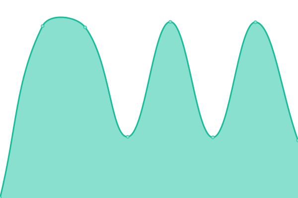

# [📈 Live Status](https://demo.upptime.js.org): <!--live status--> **🟧 Partial outage**

This repository contains the open-source uptime monitor and status page for [Patrick Little](Open.Canada.ca), powered by [Upptime](https://github.com/upptime/upptime).

With [Upptime](https://upptime.js.org), you can get your own unlimited and free uptime monitor and status page, powered entirely by a GitHub repository. We use [Issues](https://github.com/PatLittle/Consultations-Tracker/issues) as incident reports, [Actions](https://github.com/PatLittle/Consultations-Tracker/actions) as uptime monitors, and [Pages](https://demo.upptime.js.org) for the status page.

<!--start: status pages-->
<!-- This summary is generated by Upptime (https://github.com/upptime/upptime) -->
<!-- Do not edit this manually, your changes will be overwritten -->
<!-- prettier-ignore -->
| URL | Status | History | Response Time | Uptime |
| --- | ------ | ------- | ------------- | ------ |
|  [White River First Nations](https://www.rcaanc-cirnac.gc.ca/eng/1511969222951/1529103469169) | 🟩 Up | [white-river-first-nations.yml](https://github.com/PatLittle/Consultations-Tracker/commits/HEAD/history/white-river-first-nations.yml) | 

 1369ms
     
 | 

<a href="https://PatLittle.github.io/Consultations-Tracker/history/white-river-first-nations">100.00%</a>
    

|  [Use of digital tools at the border](https://www.cbsa-asfc.gc.ca/services/border-tech-frontiere/modern-eng.html) | 🟩 Up | [use-of-digital-tools-at-the-border.yml](https://github.com/PatLittle/Consultations-Tracker/commits/HEAD/history/use-of-digital-tools-at-the-border.yml) | 

 435ms
     
 | 

<a href="https://PatLittle.github.io/Consultations-Tracker/history/use-of-digital-tools-at-the-border">100.00%</a>
    

|  [Administrative Monetary Penalty System Review](TBD) | 🟥 Down | [administrative-monetary-penalty-system-review.yml](https://github.com/PatLittle/Consultations-Tracker/commits/HEAD/history/administrative-monetary-penalty-system-review.yml) | 

 0ms
     
 | 

<a href="https://PatLittle.github.io/Consultations-Tracker/history/administrative-monetary-penalty-system-review">0.00%</a>
    

|  [Onshore Pipeline Regulations and Filing Manuals Review Project](https://www.cerdialogue.ca/opr) | 🟩 Up | [onshore-pipeline-regulations-and-filing-manuals-review-project.yml](https://github.com/PatLittle/Consultations-Tracker/commits/HEAD/history/onshore-pipeline-regulations-and-filing-manuals-review-project.yml) | 

 964ms
     
 | 

<a href="https://PatLittle.github.io/Consultations-Tracker/history/onshore-pipeline-regulations-and-filing-manuals-review-project">100.00%</a>
    

|  [Regulatory Framework Plan](https://can01.safelinks.protection.outlook.com/?url=https%3A%2F%2Fwww.cer-rec.gc.ca%2Fen%2Fabout%2Fhow-we-regulate%2Fplans-for-regulatory-framework%2F&data=05%7C02%7CMichelle.Shabits%40cer-rec.gc.ca%7Cec1c386ebea64452821d08dc41ebb1b9%7C56e9b8d38a3549abbdfc27de59608f01%7C0%7C0%7C638457728797041411%7CUnknown%7CTWFpbGZsb3d8eyJWIjoiMC4wLjAwMDAiLCJQIjoiV2luMzIiLCJBTiI6Ik1haWwiLCJXVCI6Mn0%3D%7C0%7C%7C%7C&sdata=tKxvqtPetzkvcXlETiyyf51rWnRpUftsM2o2U5IySO4%3D&reserved=0) | 🟥 Down | [regulatory-framework-plan.yml](https://github.com/PatLittle/Consultations-Tracker/commits/HEAD/history/regulatory-framework-plan.yml) | 

 982ms
     
 | 

<a href="https://PatLittle.github.io/Consultations-Tracker/history/regulatory-framework-plan">99.97%</a>
    

|  [Regulated Industry Engagement](https://www.cer-rec.gc.ca/en/consultation-engagement/stakeholder-engagement/regulated-industry-engagement/index.html) | 🟥 Down | [regulated-industry-engagement.yml](https://github.com/PatLittle/Consultations-Tracker/commits/HEAD/history/regulated-industry-engagement.yml) | 

 242ms
     
 | 

<a href="https://PatLittle.github.io/Consultations-Tracker/history/regulated-industry-engagement">99.98%</a>
    

|  [Share your thoughts: Risk mitigation options for the importation of honey bee packages from the United States](https://inspection.canada.ca/en/about-cfia/transparency/consultations-and-engagement/honey-bee-packages-united-states) | 🟩 Up | [share-your-thoughts-risk-mitigation-options-for-the-importation-of-honey-bee-packages-from-the-united-states.yml](https://github.com/PatLittle/Consultations-Tracker/commits/HEAD/history/share-your-thoughts-risk-mitigation-options-for-the-importation-of-honey-bee-packages-from-the-united-states.yml) | 

 393ms
     
 | 

<a href="https://PatLittle.github.io/Consultations-Tracker/history/share-your-thoughts-risk-mitigation-options-for-the-importation-of-honey-bee-packages-from-the-united-states">100.00%</a>
    

|  [Share your thoughts: Proposed new livestock feed ingredient –Propionibacterium freudenreichii culture dehydrated](N) | 🟥 Down | [share-your-thoughts-proposed-new-livestock-feed-ingredient-propionibacterium-freudenreichii-culture-dehydrated.yml](https://github.com/PatLittle/Consultations-Tracker/commits/HEAD/history/share-your-thoughts-proposed-new-livestock-feed-ingredient-propionibacterium-freudenreichii-culture-dehydrated.yml) | 

 0ms
     
 | 

<a href="https://PatLittle.github.io/Consultations-Tracker/history/share-your-thoughts-proposed-new-livestock-feed-ingredient-propionibacterium-freudenreichii-culture-dehydrated">100.00%</a>
    

|  [Share your thoughts: Proposed amendments to the Tables of Permissible Claims for Feed Labels](N) | 🟥 Down | [share-your-thoughts-proposed-amendments-to-the-tables-of-permissible-claims-for-feed-labels.yml](https://github.com/PatLittle/Consultations-Tracker/commits/HEAD/history/share-your-thoughts-proposed-amendments-to-the-tables-of-permissible-claims-for-feed-labels.yml) | 

 0ms
     
 | 

<a href="https://PatLittle.github.io/Consultations-Tracker/history/share-your-thoughts-proposed-amendments-to-the-tables-of-permissible-claims-for-feed-labels">100.00%</a>
    

|  [Public consultation on proposed regulatory changes in Canada Gazette Part I amending the Plant Breeders' Rights Regulations](N) | 🟥 Down | [public-consultation-on-proposed-regulatory-changes-in-canada-gazette-part-i-amending-the-plant-breeders-rights-regulations.yml](https://github.com/PatLittle/Consultations-Tracker/commits/HEAD/history/public-consultation-on-proposed-regulatory-changes-in-canada-gazette-part-i-amending-the-plant-breeders-rights-regulations.yml) | 

 0ms
     
 | 

<a href="https://PatLittle.github.io/Consultations-Tracker/history/public-consultation-on-proposed-regulatory-changes-in-canada-gazette-part-i-amending-the-plant-breeders-rights-regulations">100.00%</a>
    

|  [Changing Narrative Fund](https://www.canada.ca/en/canadian-heritage/campaigns/changing-narratives-fund.html) | 🟩 Up | [changing-narrative-fund.yml](https://github.com/PatLittle/Consultations-Tracker/commits/HEAD/history/changing-narrative-fund.yml) | 

 2404ms
     
 | 

<a href="https://PatLittle.github.io/Consultations-Tracker/history/changing-narrative-fund">100.00%</a>
    

|  [2022-23 Consultations on renewal of the Museum Policy](https://www.canada.ca/en/canadian-heritage/campaigns/renewal-museum-policy.html) | 🟩 Up | [2022-23-consultations-on-renewal-of-the-museum-policy.yml](https://github.com/PatLittle/Consultations-Tracker/commits/HEAD/history/2022-23-consultations-on-renewal-of-the-museum-policy.yml) | 

 2019ms
     
 | 

<a href="https://PatLittle.github.io/Consultations-Tracker/history/2022-23-consultations-on-renewal-of-the-museum-policy">100.00%</a>
    

|  [REGDOC-2.10.1, Nuclear Emergency Preparedness and Response, Version 3](https://www.cnsc-ccsn.gc.ca/eng/acts-and-regulations/regulatory-documents/history/regdoc2-10-1/) | 🟩 Up | [regdoc-2-10-1-nuclear-emergency-preparedness-and-response-version-3.yml](https://github.com/PatLittle/Consultations-Tracker/commits/HEAD/history/regdoc-2-10-1-nuclear-emergency-preparedness-and-response-version-3.yml) | 

 348ms
     
 | 

<a href="https://PatLittle.github.io/Consultations-Tracker/history/regdoc-2-10-1-nuclear-emergency-preparedness-and-response-version-3">100.00%</a>
    

|  [REGDOC-2.6.4, Chemistry Control for Reactor Facilities](https://www.cnsc-ccsn.gc.ca/eng/acts-and-regulations/consultation/profile/2-6-4-2025/) | 🟩 Up | [regdoc-2-6-4-chemistry-control-for-reactor-facilities.yml](https://github.com/PatLittle/Consultations-Tracker/commits/HEAD/history/regdoc-2-6-4-chemistry-control-for-reactor-facilities.yml) | 

 219ms
     
 | 

<a href="https://PatLittle.github.io/Consultations-Tracker/history/regdoc-2-6-4-chemistry-control-for-reactor-facilities">100.00%</a>
    

|  [Co-development of a new Indigenous Broadcasting Policy](https://crtc.gc.ca/eng/archive/2019/2019-217.htm) | 🟩 Up | [co-development-of-a-new-indigenous-broadcasting-policy.yml](https://github.com/PatLittle/Consultations-Tracker/commits/HEAD/history/co-development-of-a-new-indigenous-broadcasting-policy.yml) | 

 310ms
     
 | 

<a href="https://PatLittle.github.io/Consultations-Tracker/history/co-development-of-a-new-indigenous-broadcasting-policy">100.00%</a>
    

|  [Share your thoughts about closed captioning of programming from online streaming services](https://crtc.gc.ca/eng/consultation/cc.htm) | 🟩 Up | [share-your-thoughts-about-closed-captioning-of-programming-from-online-streaming-services.yml](https://github.com/PatLittle/Consultations-Tracker/commits/HEAD/history/share-your-thoughts-about-closed-captioning-of-programming-from-online-streaming-services.yml) | 

 61ms
     
 | 

<a href="https://PatLittle.github.io/Consultations-Tracker/history/share-your-thoughts-about-closed-captioning-of-programming-from-online-streaming-services">100.00%</a>
    

|  [Share your thoughts on Canadian content for audio services](https://crtc.gc.ca/eng/consultation/audio.htm) | 🟩 Up | [share-your-thoughts-on-canadian-content-for-audio-services.yml](https://github.com/PatLittle/Consultations-Tracker/commits/HEAD/history/share-your-thoughts-on-canadian-content-for-audio-services.yml) | 

 55ms
     
 | 

<a href="https://PatLittle.github.io/Consultations-Tracker/history/share-your-thoughts-on-canadian-content-for-audio-services">100.00%</a>
    

|  [2024 Interswitching consultation](https://otc-cta.gc.ca/eng/consultation/2024-interswitching-consultation) | 🟩 Up | [2024-interswitching-consultation.yml](https://github.com/PatLittle/Consultations-Tracker/commits/HEAD/history/2024-interswitching-consultation.yml) | 

 781ms
     
 | 

<a href="https://PatLittle.github.io/Consultations-Tracker/history/2024-interswitching-consultation">100.00%</a>
    

|  [Consultation on proposed amendments to the Air Passenger Protection Regulations (APPR)](https://otc-cta.gc.ca/eng/consultation/consultation-proposed-amendments-air-passenger-protection-regulations-appr) | 🟩 Up | [consultation-on-proposed-amendments-to-the-air-passenger-protection-regulations-appr.yml](https://github.com/PatLittle/Consultations-Tracker/commits/HEAD/history/consultation-on-proposed-amendments-to-the-air-passenger-protection-regulations-appr.yml) | 

 366ms
     
 | 

<a href="https://PatLittle.github.io/Consultations-Tracker/history/consultation-on-proposed-amendments-to-the-air-passenger-protection-regulations-appr">100.00%</a>
    

|  [TRC Call to Action 66: Moving from Pilot Project to Long-Term Implementation](Not available) | 🟥 Down | [trc-call-to-action-66-moving-from-pilot-project-to-long-term-implementation.yml](https://github.com/PatLittle/Consultations-Tracker/commits/HEAD/history/trc-call-to-action-66-moving-from-pilot-project-to-long-term-implementation.yml) | 

 0ms
     
 | 

<a href="https://PatLittle.github.io/Consultations-Tracker/history/trc-call-to-action-66-moving-from-pilot-project-to-long-term-implementation">100.00%</a>
    

|  [National Infrastructure Assessment](https://www.infrastructure.gc.ca/nia-eni/index-eng.html) | 🟩 Up | [national-infrastructure-assessment.yml](https://github.com/PatLittle/Consultations-Tracker/commits/HEAD/history/national-infrastructure-assessment.yml) | 

 585ms
     
 | 

<a href="https://PatLittle.github.io/Consultations-Tracker/history/national-infrastructure-assessment">100.00%</a>
    

|  [Consultations for the 2025 Annual Report on the 2030 Agenda and the Sustainable Development Goals](https://srv217.services.gc.ca/ihst4/Intro.aspx?cid=2cd15f32-a51c-467a-8f45-18098c4f7cf7&lc=eng) | 🟩 Up | [consultations-for-the-2025-annual-report-on-the-2030-agenda-and-the-sustainable-development-goals.yml](https://github.com/PatLittle/Consultations-Tracker/commits/HEAD/history/consultations-for-the-2025-annual-report-on-the-2030-agenda-and-the-sustainable-development-goals.yml) | 

 571ms
     
 | 

<a href="https://PatLittle.github.io/Consultations-Tracker/history/consultations-for-the-2025-annual-report-on-the-2030-agenda-and-the-sustainable-development-goals">100.00%</a>
    

|  [Share your ideas: Blackwater Project](https://www.canada.ca/en/environment-climate-change/services/managing-pollution/sources-industry/mining/metal-diamond-mining-effluent-regulation/blackwater-consultation.html) | 🟥 Down | [share-your-ideas-blackwater-project.yml](https://github.com/PatLittle/Consultations-Tracker/commits/HEAD/history/share-your-ideas-blackwater-project.yml) | 

 2674ms
     
 | 

<a href="https://PatLittle.github.io/Consultations-Tracker/history/share-your-ideas-blackwater-project">100.00%</a>
    

|  [Comment on: Draft Canada-Saskatchewan Equivalency Agreement on coal-fired electricity regulations (2025-2026)](https://www.canada.ca/en/environment-climate-change/services/canadian-environmental-protection-act-registry/agreements/equivalency/canada-saskatchewan-greenhouse-gas-electricity-producers-2025.html) | 🟩 Up | [comment-on-draft-canada-saskatchewan-equivalency-agreement-on-coal-fired-electricity-regulations-2025-2026.yml](https://github.com/PatLittle/Consultations-Tracker/commits/HEAD/history/comment-on-draft-canada-saskatchewan-equivalency-agreement-on-coal-fired-electricity-regulations-2025-2026.yml) | 

 1865ms
     
 | 

<a href="https://PatLittle.github.io/Consultations-Tracker/history/comment-on-draft-canada-saskatchewan-equivalency-agreement-on-coal-fired-electricity-regulations-2025-2026">100.00%</a>
    

|  [Consultation Document on the Risk Management of Short-chain, Medium-chain and Long-chain chlorinated alkanes](https://canada.ca/en/environment-climate-change/corporate/transparency/consultations/risk-management-chlorinated-alkanes.html) | 🟩 Up | [consultation-document-on-the-risk-management-of-short-chain-medium-chain-and-long-chain-chlorinated-alkanes.yml](https://github.com/PatLittle/Consultations-Tracker/commits/HEAD/history/consultation-document-on-the-risk-management-of-short-chain-medium-chain-and-long-chain-chlorinated-alkanes.yml) | 

 2046ms
     
 | 

<a href="https://PatLittle.github.io/Consultations-Tracker/history/consultation-document-on-the-risk-management-of-short-chain-medium-chain-and-long-chain-chlorinated-alkanes">100.00%</a>
    

|  [Consultation on Proposed Amendments to the Export of Substances on the Export Control List Regulations](https://www.canada.ca/en/environment-climate-change/corporate/transparency/consultations/export-control-list-amendments.html) | 🟩 Up | [consultation-on-proposed-amendments-to-the-export-of-substances-on-the-export-control-list-regulations.yml](https://github.com/PatLittle/Consultations-Tracker/commits/HEAD/history/consultation-on-proposed-amendments-to-the-export-of-substances-on-the-export-control-list-regulations.yml) | 

 2362ms
     
 | 

<a href="https://PatLittle.github.io/Consultations-Tracker/history/consultation-on-proposed-amendments-to-the-export-of-substances-on-the-export-control-list-regulations">100.00%</a>
    

|  [Proposed Coal Mining Effluent Regulations](https://www.canada.ca/en/environment-climate-change/services/managing-pollution/sources-industry/mining-effluent/proposed-coal-mining-effluent-regulations.html) | 🟩 Up | [proposed-coal-mining-effluent-regulations.yml](https://github.com/PatLittle/Consultations-Tracker/commits/HEAD/history/proposed-coal-mining-effluent-regulations.yml) | 

 2262ms
     
 | 

<a href="https://PatLittle.github.io/Consultations-Tracker/history/proposed-coal-mining-effluent-regulations">100.00%</a>
    

|  [Consultation on Amending the List of Species under the Species at Risk Act: Terrestrial Species January 2025](https://canada-preview.adobecqms.net/en/environment-climate-change/services/species-risk-public-registry/consultation-documents/part-3-consultation-amending-terrestrial-species-list-sara-summary-jan-2025.html) | 🟩 Up | [consultation-on-amending-the-list-of-species-under-the-species-at-risk-act-terrestrial-species-january-2025.yml](https://github.com/PatLittle/Consultations-Tracker/commits/HEAD/history/consultation-on-amending-the-list-of-species-under-the-species-at-risk-act-terrestrial-species-january-2025.yml) | 

 2587ms
     
 | 

<a href="https://PatLittle.github.io/Consultations-Tracker/history/consultation-on-amending-the-list-of-species-under-the-species-at-risk-act-terrestrial-species-january-2025">100.00%</a>
    

|  [Draft Assessment for the Fourteen Terpene and Terpenoid Substances Group and the Risk Management Scope](https://canadagazette.gc.ca/rp-pr/p1/2025/2025-01-25/html/notice-avis-eng.html#nl3) | 🟩 Up | [draft-assessment-for-the-fourteen-terpene-and-terpenoid-substances-group-and-the-risk-management-scope.yml](https://github.com/PatLittle/Consultations-Tracker/commits/HEAD/history/draft-assessment-for-the-fourteen-terpene-and-terpenoid-substances-group-and-the-risk-management-scope.yml) | 

 762ms
     
 | 

<a href="https://PatLittle.github.io/Consultations-Tracker/history/draft-assessment-for-the-fourteen-terpene-and-terpenoid-substances-group-and-the-risk-management-scope">100.00%</a>
    

|  [The Additional Risk Characterization Document for human health and the Risk Management Scope for melamine](https://gazette.gc.ca/rp-pr/p1/2025/2025-01-25/html/notice-avis-eng.html#nl4) | 🟩 Up | [the-additional-risk-characterization-document-for-human-health-and-the-risk-management-scope-for-melamine.yml](https://github.com/PatLittle/Consultations-Tracker/commits/HEAD/history/the-additional-risk-characterization-document-for-human-health-and-the-risk-management-scope-for-melamine.yml) | 

 123ms
     
 | 

<a href="https://PatLittle.github.io/Consultations-Tracker/history/the-additional-risk-characterization-document-for-human-health-and-the-risk-management-scope-for-melamine">100.00%</a>
    

|  [Proposed Amendments to the Antarctic Environmental Protection Regulations](https://canadagazette.gc.ca/rp-pr/p1/2025/2025-02-08/html/reg1-eng.html) | 🟩 Up | [proposed-amendments-to-the-antarctic-environmental-protection-regulations.yml](https://github.com/PatLittle/Consultations-Tracker/commits/HEAD/history/proposed-amendments-to-the-antarctic-environmental-protection-regulations.yml) | 

 157ms
     
 | 

<a href="https://PatLittle.github.io/Consultations-Tracker/history/proposed-amendments-to-the-antarctic-environmental-protection-regulations">100.00%</a>
    

|  [Draft Assessment of 14 substances in the Tricylcic Sesquiterpenes and Triterpeniods Group and the Risk Management Scope](https://canadagazette.gc.ca/rp-pr/p1/2025/2025-03-01/html/notice-avis-eng.html#nb1) | 🟩 Up | [draft-assessment-of-14-substances-in-the-tricylcic-sesquiterpenes-and-triterpeniods-group-and-the-risk-management-scope.yml](https://github.com/PatLittle/Consultations-Tracker/commits/HEAD/history/draft-assessment-of-14-substances-in-the-tricylcic-sesquiterpenes-and-triterpeniods-group-and-the-risk-management-scope.yml) | 

 0ms
     
 | 

<a href="https://PatLittle.github.io/Consultations-Tracker/history/draft-assessment-of-14-substances-in-the-tricylcic-sesquiterpenes-and-triterpeniods-group-and-the-risk-management-scope">100.00%</a>
    

|  [Updated Draft Assessment of Boric Acid, its salts and its precursors and the Revised Risk Management Scope.](https://canadagazette.gc.ca/rp-pr/p1/2025/2025-03-08/html/notice-avis-eng.html#nl1) | 🟩 Up | [updated-draft-assessment-of-boric-acid-its-salts-and-its-precursors-and-the-revised-risk-management-scope.yml](https://github.com/PatLittle/Consultations-Tracker/commits/HEAD/history/updated-draft-assessment-of-boric-acid-its-salts-and-its-precursors-and-the-revised-risk-management-scope.yml) | 

 225ms
     
 | 

<a href="https://PatLittle.github.io/Consultations-Tracker/history/updated-draft-assessment-of-boric-acid-its-salts-and-its-precursors-and-the-revised-risk-management-scope">100.00%</a>
    

|  [Risk Management Approach for the Benzotriazoles and Benzothiazoles Group](https://canadagazette.gc.ca/rp-pr/p1/2025/2025-03-08/html/notice-avis-eng.html#nl2) | 🟩 Up | [risk-management-approach-for-the-benzotriazoles-and-benzothiazoles-group.yml](https://github.com/PatLittle/Consultations-Tracker/commits/HEAD/history/risk-management-approach-for-the-benzotriazoles-and-benzothiazoles-group.yml) | 

 205ms
     
 | 

<a href="https://PatLittle.github.io/Consultations-Tracker/history/risk-management-approach-for-the-benzotriazoles-and-benzothiazoles-group">100.00%</a>
    

|  [Risk Management Approach for PFAS, excluding fluoropolymers](https://canadagazette.gc.ca/rp-pr/p1/2025/2025-03-08/html/notice-avis-eng.html#nl3) | 🟩 Up | [risk-management-approach-for-pfas-excluding-fluoropolymers.yml](https://github.com/PatLittle/Consultations-Tracker/commits/HEAD/history/risk-management-approach-for-pfas-excluding-fluoropolymers.yml) | 

 196ms
     
 | 

<a href="https://PatLittle.github.io/Consultations-Tracker/history/risk-management-approach-for-pfas-excluding-fluoropolymers">100.00%</a>
    

|  [Share your thoughts: Participate in the risk assessment process for GloFish® Corydoras](https://www.canada.ca/en/environment-climate-change/corporate/transparency/consultations/risk-assessment-process-glofish-corydoras.html) | 🟩 Up | [share-your-thoughts-participate-in-the-risk-assessment-process-for-glo-fish-corydoras.yml](https://github.com/PatLittle/Consultations-Tracker/commits/HEAD/history/share-your-thoughts-participate-in-the-risk-assessment-process-for-glo-fish-corydoras.yml) | 

 0ms
     
 | 

<a href="https://PatLittle.github.io/Consultations-Tracker/history/share-your-thoughts-participate-in-the-risk-assessment-process-for-glo-fish-corydoras">100.00%</a>
    

|  [Path forward for evaluating policy options for managing the accumulation of oil sands mine water in tailings ponds](https://www.canada.ca/en/environment-climate-change/corporate/transparency/consultations/discussion-paper-crown-indigenous-working-group-2025.html) | 🟩 Up | [path-forward-for-evaluating-policy-options-for-managing-the-accumulation-of-oil-sands-mine-water-in-tailings-ponds.yml](https://github.com/PatLittle/Consultations-Tracker/commits/HEAD/history/path-forward-for-evaluating-policy-options-for-managing-the-accumulation-of-oil-sands-mine-water-in-tailings-ponds.yml) | 

 0ms
     
 | 

<a href="https://PatLittle.github.io/Consultations-Tracker/history/path-forward-for-evaluating-policy-options-for-managing-the-accumulation-of-oil-sands-mine-water-in-tailings-ponds">100.00%</a>
    

|  [Eastern Shore Islands Area of Interest Consultations](http://www.dfo-mpo.gc.ca/oceans/consultations/easternshore-ilescoteest/index-eng.html) | 🟩 Up | [eastern-shore-islands-area-of-interest-consultations.yml](https://github.com/PatLittle/Consultations-Tracker/commits/HEAD/history/eastern-shore-islands-area-of-interest-consultations.yml) | 

 559ms
     
 | 

<a href="https://PatLittle.github.io/Consultations-Tracker/history/eastern-shore-islands-area-of-interest-consultations">100.00%</a>
    

|  [Northern Gulf of St. Lawrence Study Area](https://www.dfo-mpo.gc.ca/oceans/canada-quebec-agreement-entente/index-eng.html) | 🟩 Up | [northern-gulf-of-st-lawrence-study-area.yml](https://github.com/PatLittle/Consultations-Tracker/commits/HEAD/history/northern-gulf-of-st-lawrence-study-area.yml) | 

 348ms
     
 | 

<a href="https://PatLittle.github.io/Consultations-Tracker/history/northern-gulf-of-st-lawrence-study-area">69.13%</a>
    

|  [Fundian Channel- Browns Bank Area of Interest](https://www.dfo-mpo.gc.ca/oceans/aoi-si/fundian-fundy-browns-eng.html) | 🟩 Up | [fundian-channel-browns-bank-area-of-interest.yml](https://github.com/PatLittle/Consultations-Tracker/commits/HEAD/history/fundian-channel-browns-bank-area-of-interest.yml) | 

 173ms
     
 | 

<a href="https://PatLittle.github.io/Consultations-Tracker/history/fundian-channel-browns-bank-area-of-interest">69.13%</a>
    

|  [Proposed ticketing for the enforcement of a fisheries offence under the Fisheries Act](TBD) | 🟥 Down | [proposed-ticketing-for-the-enforcement-of-a-fisheries-offence-under-the-fisheries-act.yml](https://github.com/PatLittle/Consultations-Tracker/commits/HEAD/history/proposed-ticketing-for-the-enforcement-of-a-fisheries-offence-under-the-fisheries-act.yml) | 

 0ms
     
 | 

<a href="https://PatLittle.github.io/Consultations-Tracker/history/proposed-ticketing-for-the-enforcement-of-a-fisheries-offence-under-the-fisheries-act">100.00%</a>
    

|  [Whitby Harbour Remediation Project](https://www.dfo-mpo.gc.ca/sch-ppb/whitby/index-eng.html) | 🟩 Up | [whitby-harbour-remediation-project.yml](https://github.com/PatLittle/Consultations-Tracker/commits/HEAD/history/whitby-harbour-remediation-project.yml) | 

 165ms
     
 | 

<a href="https://PatLittle.github.io/Consultations-Tracker/history/whitby-harbour-remediation-project">69.13%</a>
    

|  [Construction  of a sediment storage area at the Millerand fishing harbour in the Magdalen Islands](https://www.iaac-aeic.gc.ca/050/evaluations/proj/89048?culture=en-CA) | 🟩 Up | [construction-of-a-sediment-storage-area-at-the-millerand-fishing-harbour-in-the-magdalen-islands.yml](https://github.com/PatLittle/Consultations-Tracker/commits/HEAD/history/construction-of-a-sediment-storage-area-at-the-millerand-fishing-harbour-in-the-magdalen-islands.yml) | 

 0ms
     
 | 

<a href="https://PatLittle.github.io/Consultations-Tracker/history/construction-of-a-sediment-storage-area-at-the-millerand-fishing-harbour-in-the-magdalen-islands">100.00%</a>
    

|  [Proposed Amendments to the Export Permits Regulations](https://www.international.gc.ca/trade-commerce/controls-controles/expor/backgrounder-amendments-epr-information-modification-rle.aspx?lang=eng) | 🟩 Up | [proposed-amendments-to-the-export-permits-regulations.yml](https://github.com/PatLittle/Consultations-Tracker/commits/HEAD/history/proposed-amendments-to-the-export-permits-regulations.yml) | 

 561ms
     
 | 

<a href="https://PatLittle.github.io/Consultations-Tracker/history/proposed-amendments-to-the-export-permits-regulations">100.00%</a>
    

|  [Consultation: Draft Guidelines for Canadian Drinking Water Quality, Trihalomethanes](https://www.canada.ca/en/health-canada/programs/consultation-draft-guidelines-canadian-drinking-water-quality-trihalomethanes.html) | 🟩 Up | [consultation-draft-guidelines-for-canadian-drinking-water-quality-trihalomethanes.yml](https://github.com/PatLittle/Consultations-Tracker/commits/HEAD/history/consultation-draft-guidelines-for-canadian-drinking-water-quality-trihalomethanes.yml) | 

 1909ms
     
 | 

<a href="https://PatLittle.github.io/Consultations-Tracker/history/consultation-draft-guidelines-for-canadian-drinking-water-quality-trihalomethanes">100.00%</a>
    

|  [Consultation on benzovindiflupyr, Proposed Maximum Residue Limit PMRL2025-01](https://www.canada.ca/en/health-canada/services/consumer-product-safety/pesticides-pest-management/public/consultations/proposed-maximum-residue-limit/2025/benzovindiflupyr.html) | 🟩 Up | [consultation-on-benzovindiflupyr-proposed-maximum-residue-limit-pmrl-2025-01.yml](https://github.com/PatLittle/Consultations-Tracker/commits/HEAD/history/consultation-on-benzovindiflupyr-proposed-maximum-residue-limit-pmrl-2025-01.yml) | 

 2450ms
     
 | 

<a href="https://PatLittle.github.io/Consultations-Tracker/history/consultation-on-benzovindiflupyr-proposed-maximum-residue-limit-pmrl-2025-01">100.00%</a>
    

|  [Proposal to modify the Table of Permitted Nutrient Content Statements and Claims (free of sugars)](https://www.canada.ca/en/health-canada/services/food-nutrition/legislation-guidelines/acts-regulations/notices-proposal-notices-modification/table-permitted-nutrient-content-statements-claims-free-of-sugars.html) | 🟩 Up | [proposal-to-modify-the-table-of-permitted-nutrient-content-statements-and-claims-free-of-sugars.yml](https://github.com/PatLittle/Consultations-Tracker/commits/HEAD/history/proposal-to-modify-the-table-of-permitted-nutrient-content-statements-and-claims-free-of-sugars.yml) | 

 1574ms
     
 | 

<a href="https://PatLittle.github.io/Consultations-Tracker/history/proposal-to-modify-the-table-of-permitted-nutrient-content-statements-and-claims-free-of-sugars">100.00%</a>
    

|  [Consultation on tebuconazole, Proposed Maximum Residue Limit PMRL2025-02](https://www.canada.ca/en/health-canada/services/consumer-product-safety/pesticides-pest-management/public/consultations/proposed-maximum-residue-limit/2025/tebuconazole.html) | 🟩 Up | [consultation-on-tebuconazole-proposed-maximum-residue-limit-pmrl-2025-02.yml](https://github.com/PatLittle/Consultations-Tracker/commits/HEAD/history/consultation-on-tebuconazole-proposed-maximum-residue-limit-pmrl-2025-02.yml) | 

 2460ms
     
 | 

<a href="https://PatLittle.github.io/Consultations-Tracker/history/consultation-on-tebuconazole-proposed-maximum-residue-limit-pmrl-2025-02">100.00%</a>
    

|  [Consultation on Streptomyces lydicus Strain WYEC 108 and its associated end-use products, Proposed Re-evaluation Decision PRVD2025-01](https://www.canada.ca/en/health-canada/services/consumer-product-safety/pesticides-pest-management/public/consultations/proposed-re-evaluation-decisions/2025/streptomyces-lydicus-strain-wyec-108.html) | 🟩 Up | [consultation-on-streptomyces-lydicus-strain-wyec-108-and-its-associated-end-use-products-proposed-re-evaluation-decision-prvd-2025-01.yml](https://github.com/PatLittle/Consultations-Tracker/commits/HEAD/history/consultation-on-streptomyces-lydicus-strain-wyec-108-and-its-associated-end-use-products-proposed-re-evaluation-decision-prvd-2025-01.yml) | 

 1998ms
     
 | 

<a href="https://PatLittle.github.io/Consultations-Tracker/history/consultation-on-streptomyces-lydicus-strain-wyec-108-and-its-associated-end-use-products-proposed-re-evaluation-decision-prvd-2025-01">100.00%</a>
    

|  [Consultation on lambda-cyhalothrin, Proposed Maximum Residue Limit PMRL2025-03](https://www.canada.ca/en/health-canada/services/consumer-product-safety/pesticides-pest-management/public/consultations/proposed-maximum-residue-limit/2025/lambda-cyhalothrin.html) | 🟩 Up | [consultation-on-lambda-cyhalothrin-proposed-maximum-residue-limit-pmrl-2025-03.yml](https://github.com/PatLittle/Consultations-Tracker/commits/HEAD/history/consultation-on-lambda-cyhalothrin-proposed-maximum-residue-limit-pmrl-2025-03.yml) | 

 2437ms
     
 | 

<a href="https://PatLittle.github.io/Consultations-Tracker/history/consultation-on-lambda-cyhalothrin-proposed-maximum-residue-limit-pmrl-2025-03">100.00%</a>
    

|  [Consultation: Proposal to amend the list of maximum residue limits for veterinary drugs in foods - Proposed MRL 2025-1](https://www.canada.ca/en/health-canada/programs/consultation-proposal-amend-list-maximum-residue-limits-veterinary-drugs-foods-mrl-2025-1.html) | 🟩 Up | [consultation-proposal-to-amend-the-list-of-maximum-residue-limits-for-veterinary-drugs-in-foods-proposed-mrl-2025-1.yml](https://github.com/PatLittle/Consultations-Tracker/commits/HEAD/history/consultation-proposal-to-amend-the-list-of-maximum-residue-limits-for-veterinary-drugs-in-foods-proposed-mrl-2025-1.yml) | 

 0ms
     
 | 

<a href="https://PatLittle.github.io/Consultations-Tracker/history/consultation-proposal-to-amend-the-list-of-maximum-residue-limits-for-veterinary-drugs-in-foods-proposed-mrl-2025-1">100.00%</a>
    

|  [Proposed Registration Decision PRD2025-01, Flg22-Bt Peptide, Vismax Seed Treatment, and Vismax Row Crop](https://www.canada.ca/en/health-canada/services/consumer-product-safety/pesticides-pest-management/public/consultations/proposed-registration-decisions/2025/flg22-bt-peptide-vismax-seed-treatment-row-crop.html) | 🟩 Up | [proposed-registration-decision-prd-2025-01-flg22-bt-peptide-vismax-seed-treatment-and-vismax-row-crop.yml](https://github.com/PatLittle/Consultations-Tracker/commits/HEAD/history/proposed-registration-decision-prd-2025-01-flg22-bt-peptide-vismax-seed-treatment-and-vismax-row-crop.yml) | 

 2852ms
     
 | 

<a href="https://PatLittle.github.io/Consultations-Tracker/history/proposed-registration-decision-prd-2025-01-flg22-bt-peptide-vismax-seed-treatment-and-vismax-row-crop">100.00%</a>
    

|  [Notice of Consultation on the Prescription Drug List (PDL): Nicotine Tablets](https://www.canada.ca/en/health-canada/services/drugs-health-products/drug-products/prescription-drug-list/notices-changes/consultation-nicotine-tablets.html) | 🟩 Up | [notice-of-consultation-on-the-prescription-drug-list-pdl-nicotine-tablets.yml](https://github.com/PatLittle/Consultations-Tracker/commits/HEAD/history/notice-of-consultation-on-the-prescription-drug-list-pdl-nicotine-tablets.yml) | 

 2106ms
     
 | 

<a href="https://PatLittle.github.io/Consultations-Tracker/history/notice-of-consultation-on-the-prescription-drug-list-pdl-nicotine-tablets">100.00%</a>
    

|  [Notice of Consultation on the Prescription Drug List (PDL): Nicotine Buccal Pouches](https://www.canada.ca/en/health-canada/services/drugs-health-products/drug-products/prescription-drug-list/notices-changes/consultation-nicotine-buccal-pouches.html) | 🟩 Up | [notice-of-consultation-on-the-prescription-drug-list-pdl-nicotine-buccal-pouches.yml](https://github.com/PatLittle/Consultations-Tracker/commits/HEAD/history/notice-of-consultation-on-the-prescription-drug-list-pdl-nicotine-buccal-pouches.yml) | 

 2331ms
     
 | 

<a href="https://PatLittle.github.io/Consultations-Tracker/history/notice-of-consultation-on-the-prescription-drug-list-pdl-nicotine-buccal-pouches">100.00%</a>
    

|  [Consultation on German Cockroach Extract and its associated end-use products, Proposed Re-evaluation Decision PRVD2025-02](https://www.canada.ca/en/health-canada/services/consumer-product-safety/pesticides-pest-management/public/consultations/proposed-re-evaluation-decisions/2025/german-cockroach-extract.html) | 🟩 Up | [consultation-on-german-cockroach-extract-and-its-associated-end-use-products-proposed-re-evaluation-decision-prvd-2025-02.yml](https://github.com/PatLittle/Consultations-Tracker/commits/HEAD/history/consultation-on-german-cockroach-extract-and-its-associated-end-use-products-proposed-re-evaluation-decision-prvd-2025-02.yml) | 

 2418ms
     
 | 

<a href="https://PatLittle.github.io/Consultations-Tracker/history/consultation-on-german-cockroach-extract-and-its-associated-end-use-products-proposed-re-evaluation-decision-prvd-2025-02">100.00%</a>
    

|  [Share your views: Consultation on the draft guidance on managing applications for medical device licences](https://www.canada.ca/en/health-canada/programs/consultation-draft-guidance-managing-applications-medical-device-licences.html) | 🟩 Up | [share-your-views-consultation-on-the-draft-guidance-on-managing-applications-for-medical-device-licences.yml](https://github.com/PatLittle/Consultations-Tracker/commits/HEAD/history/share-your-views-consultation-on-the-draft-guidance-on-managing-applications-for-medical-device-licences.yml) | 

 1999ms
     
 | 

<a href="https://PatLittle.github.io/Consultations-Tracker/history/share-your-views-consultation-on-the-draft-guidance-on-managing-applications-for-medical-device-licences">100.00%</a>
    

|  [Proposal to transfer the maximum levels for ethyl carbamate in alcoholic beverages to the List of Contaminants and Other Adulterating Substances in Foods](https://www.canada.ca/en/health-canada/services/food-nutrition/legislation-guidelines/acts-regulations/notices-proposal-notices-modification/maximum-levels-ethyl-carbamate-alcoholic-beverages-list-contaminants-other-adulterating-substances.html) | 🟩 Up | [proposal-to-transfer-the-maximum-levels-for-ethyl-carbamate-in-alcoholic-beverages-to-the-list-of-contaminants-and-other-adulterating-substances-in-foods.yml](https://github.com/PatLittle/Consultations-Tracker/commits/HEAD/history/proposal-to-transfer-the-maximum-levels-for-ethyl-carbamate-in-alcoholic-beverages-to-the-list-of-contaminants-and-other-adulterating-substances-in-foods.yml) | 

 0ms
     
 | 

<a href="https://PatLittle.github.io/Consultations-Tracker/history/proposal-to-transfer-the-maximum-levels-for-ethyl-carbamate-in-alcoholic-beverages-to-the-list-of-contaminants-and-other-adulterating-substances-in-foods">100.00%</a>
    

|  [Consultation on ethalfluralin, Proposed Maximum Residue Limit PMRL2025-04](https://www.canada.ca/en/health-canada/services/consumer-product-safety/pesticides-pest-management/public/consultations/proposed-maximum-residue-limit/2025/ethalfluralin.html) | 🟩 Up | [consultation-on-ethalfluralin-proposed-maximum-residue-limit-pmrl-2025-04.yml](https://github.com/PatLittle/Consultations-Tracker/commits/HEAD/history/consultation-on-ethalfluralin-proposed-maximum-residue-limit-pmrl-2025-04.yml) | 

 2163ms
     
 | 

<a href="https://PatLittle.github.io/Consultations-Tracker/history/consultation-on-ethalfluralin-proposed-maximum-residue-limit-pmrl-2025-04">100.00%</a>
    

|  [Consultation on pendimethalin, Proposed Maximum Residue Limit PMRL2025-05](https://www.canada.ca/en/health-canada/services/consumer-product-safety/pesticides-pest-management/public/consultations/proposed-maximum-residue-limit/2025/pendimethalin.html) | 🟩 Up | [consultation-on-pendimethalin-proposed-maximum-residue-limit-pmrl-2025-05.yml](https://github.com/PatLittle/Consultations-Tracker/commits/HEAD/history/consultation-on-pendimethalin-proposed-maximum-residue-limit-pmrl-2025-05.yml) | 

 2151ms
     
 | 

<a href="https://PatLittle.github.io/Consultations-Tracker/history/consultation-on-pendimethalin-proposed-maximum-residue-limit-pmrl-2025-05">100.00%</a>
    

|  [Notice of intent to make a Ministerial Exemption Order to permit continued supply of naloxone kits on the Canadian market](https://gazette.gc.ca/rp-pr/p1/2025/2025-03-01/html/notice-avis-eng.html#nb3) | 🟩 Up | [notice-of-intent-to-make-a-ministerial-exemption-order-to-permit-continued-supply-of-naloxone-kits-on-the-canadian-market.yml](https://github.com/PatLittle/Consultations-Tracker/commits/HEAD/history/notice-of-intent-to-make-a-ministerial-exemption-order-to-permit-continued-supply-of-naloxone-kits-on-the-canadian-market.yml) | 

 628ms
     
 | 

<a href="https://PatLittle.github.io/Consultations-Tracker/history/notice-of-intent-to-make-a-ministerial-exemption-order-to-permit-continued-supply-of-naloxone-kits-on-the-canadian-market">100.00%</a>
    

|  [Consultation on Carbon Dioxide and its associated end-use products, Proposed Re-evaluation Decision PRVD2025-03](https://www.canada.ca/en/health-canada/services/consumer-product-safety/pesticides-pest-management/public/consultations/proposed-re-evaluation-decisions/2025/carbon-dioxide.html) | 🟩 Up | [consultation-on-carbon-dioxide-and-its-associated-end-use-products-proposed-re-evaluation-decision-prvd-2025-03.yml](https://github.com/PatLittle/Consultations-Tracker/commits/HEAD/history/consultation-on-carbon-dioxide-and-its-associated-end-use-products-proposed-re-evaluation-decision-prvd-2025-03.yml) | 

 1730ms
     
 | 

<a href="https://PatLittle.github.io/Consultations-Tracker/history/consultation-on-carbon-dioxide-and-its-associated-end-use-products-proposed-re-evaluation-decision-prvd-2025-03">100.00%</a>
    

|  [Consultation: Health Canada and the Public Health Agency of Canada Accessibility Plans](https://www.canada.ca/en/health-canada/programs/consultation-health-canada-public-health-agency-canada-accessibility-plans.html) | 🟩 Up | [consultation-health-canada-and-the-public-health-agency-of-canada-accessibility-plans.yml](https://github.com/PatLittle/Consultations-Tracker/commits/HEAD/history/consultation-health-canada-and-the-public-health-agency-of-canada-accessibility-plans.yml) | 

 2432ms
     
 | 

<a href="https://PatLittle.github.io/Consultations-Tracker/history/consultation-health-canada-and-the-public-health-agency-of-canada-accessibility-plans">100.00%</a>
    

|  [Consultation on pelargonic acid and Beloukha Herbicide, Proposed Registration Decision PRD2025-02](https://www.canada.ca/en/health-canada/services/consumer-product-safety/pesticides-pest-management/public/consultations/proposed-registration-decisions/2025/pelargonic-acid-beloukha-herbicide.html) | 🟩 Up | [consultation-on-pelargonic-acid-and-beloukha-herbicide-proposed-registration-decision-prd-2025-02.yml](https://github.com/PatLittle/Consultations-Tracker/commits/HEAD/history/consultation-on-pelargonic-acid-and-beloukha-herbicide-proposed-registration-decision-prd-2025-02.yml) | 

 2021ms
     
 | 

<a href="https://PatLittle.github.io/Consultations-Tracker/history/consultation-on-pelargonic-acid-and-beloukha-herbicide-proposed-registration-decision-prd-2025-02">100.00%</a>
    

|  [Consultation on Cellulose (from powdered corn cobs) and its associated end-use products, Proposed Re-evaluation Decision PRVD2025-04](https://www.canada.ca/en/health-canada/services/consumer-product-safety/pesticides-pest-management/public/consultations/proposed-re-evaluation-decisions/2025/cellulose-powdered-corn-cobs.html) | 🟩 Up | [consultation-on-cellulose-from-powdered-corn-cobs-and-its-associated-end-use-products-proposed-re-evaluation-decision-prvd-2025-04.yml](https://github.com/PatLittle/Consultations-Tracker/commits/HEAD/history/consultation-on-cellulose-from-powdered-corn-cobs-and-its-associated-end-use-products-proposed-re-evaluation-decision-prvd-2025-04.yml) | 

 2346ms
     
 | 

<a href="https://PatLittle.github.io/Consultations-Tracker/history/consultation-on-cellulose-from-powdered-corn-cobs-and-its-associated-end-use-products-proposed-re-evaluation-decision-prvd-2025-04">100.00%</a>
    

|  [Consultation on proposed amendments to the Pest Control Products Regulations (Product Exemptions) - Pre-consultation, PRO2025-01](https://www.canada.ca/en/health-canada/services/consumer-product-safety/pesticides-pest-management/public/consultations/regulatory-proposals/2025/proposed-amendments-pest-control-products-regulations-product-exemptions.html) | 🟩 Up | [consultation-on-proposed-amendments-to-the-pest-control-products-regulations-product-exemptions-pre-consultation-pro-2025-01.yml](https://github.com/PatLittle/Consultations-Tracker/commits/HEAD/history/consultation-on-proposed-amendments-to-the-pest-control-products-regulations-product-exemptions-pre-consultation-pro-2025-01.yml) | 

 2288ms
     
 | 

<a href="https://PatLittle.github.io/Consultations-Tracker/history/consultation-on-proposed-amendments-to-the-pest-control-products-regulations-product-exemptions-pre-consultation-pro-2025-01">100.00%</a>
    

|  [Consultation: Towards a pathway for health products containing cannabidiol](https://www.canada.ca/en/health-canada/programs/consultation-towards-pathway-products-containing-cannabidiol.html) | 🟩 Up | [consultation-towards-a-pathway-for-health-products-containing-cannabidiol.yml](https://github.com/PatLittle/Consultations-Tracker/commits/HEAD/history/consultation-towards-a-pathway-for-health-products-containing-cannabidiol.yml) | 

 1791ms
     
 | 

<a href="https://PatLittle.github.io/Consultations-Tracker/history/consultation-towards-a-pathway-for-health-products-containing-cannabidiol">100.00%</a>
    

|  [Consultation: Draft Guidelines for Canadian Drinking Water Quality, Arsenic](https://www.canada.ca/en/health-canada/programs/consultation-draft-guidelines-canadian-drinking-water-quality-arsenic.html) | 🟩 Up | [consultation-draft-guidelines-for-canadian-drinking-water-quality-arsenic.yml](https://github.com/PatLittle/Consultations-Tracker/commits/HEAD/history/consultation-draft-guidelines-for-canadian-drinking-water-quality-arsenic.yml) | 

 1698ms
     
 | 

<a href="https://PatLittle.github.io/Consultations-Tracker/history/consultation-draft-guidelines-for-canadian-drinking-water-quality-arsenic">100.00%</a>
    

|  [Consultation on fatty acid cluster and its associated end-use products, Proposed Re-evaluation Decision PRVD2025-05](https://www.canada.ca/en/health-canada/services/consumer-product-safety/pesticides-pest-management/public/consultations/proposed-re-evaluation-decisions/2025/fatty-acid-cluster.html) | 🟩 Up | [consultation-on-fatty-acid-cluster-and-its-associated-end-use-products-proposed-re-evaluation-decision-prvd-2025-05.yml](https://github.com/PatLittle/Consultations-Tracker/commits/HEAD/history/consultation-on-fatty-acid-cluster-and-its-associated-end-use-products-proposed-re-evaluation-decision-prvd-2025-05.yml) | 

 2606ms
     
 | 

<a href="https://PatLittle.github.io/Consultations-Tracker/history/consultation-on-fatty-acid-cluster-and-its-associated-end-use-products-proposed-re-evaluation-decision-prvd-2025-05">100.00%</a>
    

|  [Consultation on Proposed Amendments to the Pest Control Products Regulations (Pest Control Product Devices) - Pre-consultation, PRO2025-02](https://www.canada.ca/en/health-canada/services/consumer-product-safety/pesticides-pest-management/public/consultations/regulatory-proposals/2025/proposed-amendments-pest-control-products-regulations-pest-control-product-devices.html) | 🟩 Up | [consultation-on-proposed-amendments-to-the-pest-control-products-regulations-pest-control-product-devices-pre-consultation-pro-2025-02.yml](https://github.com/PatLittle/Consultations-Tracker/commits/HEAD/history/consultation-on-proposed-amendments-to-the-pest-control-products-regulations-pest-control-product-devices-pre-consultation-pro-2025-02.yml) | 

 1886ms
     
 | 

<a href="https://PatLittle.github.io/Consultations-Tracker/history/consultation-on-proposed-amendments-to-the-pest-control-products-regulations-pest-control-product-devices-pre-consultation-pro-2025-02">100.00%</a>
    

|  [Proposal to modify the use of caffeine as a supplemental ingredient](https://www.canada.ca/en/health-canada/services/food-nutrition/legislation-guidelines/acts-regulations/notices-proposal-notices-modification/proposal-modify-use-caffeine-supplemental-ingredient.html) | 🟩 Up | [proposal-to-modify-the-use-of-caffeine-as-a-supplemental-ingredient.yml](https://github.com/PatLittle/Consultations-Tracker/commits/HEAD/history/proposal-to-modify-the-use-of-caffeine-as-a-supplemental-ingredient.yml) | 

 2128ms
     
 | 

<a href="https://PatLittle.github.io/Consultations-Tracker/history/proposal-to-modify-the-use-of-caffeine-as-a-supplemental-ingredient">100.00%</a>
    

|  [Consultation on draft guidance on co-packaged drug products](https://www.canada.ca/en/health-canada/programs/consultation-draft-guidance-co-packaged-drug-products.html) | 🟩 Up | [consultation-on-draft-guidance-on-co-packaged-drug-products.yml](https://github.com/PatLittle/Consultations-Tracker/commits/HEAD/history/consultation-on-draft-guidance-on-co-packaged-drug-products.yml) | 

 1779ms
     
 | 

<a href="https://PatLittle.github.io/Consultations-Tracker/history/consultation-on-draft-guidance-on-co-packaged-drug-products">100.00%</a>
    

|  [Consultation on metaldehyde, Proposed Maximum Residue Limit PMRL2025-06](https://www.canada.ca/en/health-canada/services/consumer-product-safety/pesticides-pest-management/public/consultations/proposed-maximum-residue-limit/2025/metaldehyde.html) | 🟩 Up | [consultation-on-metaldehyde-proposed-maximum-residue-limit-pmrl-2025-06.yml](https://github.com/PatLittle/Consultations-Tracker/commits/HEAD/history/consultation-on-metaldehyde-proposed-maximum-residue-limit-pmrl-2025-06.yml) | 

 3194ms
     
 | 

<a href="https://PatLittle.github.io/Consultations-Tracker/history/consultation-on-metaldehyde-proposed-maximum-residue-limit-pmrl-2025-06">100.00%</a>
    

|  [Regulations Amending the Immigration and Refugee Protection Regulations (Temporary Foreign Workers)](https://gazette.gc.ca/rp-pr/p1/2021/2021-07-10/html/reg2-eng.html) | 🟩 Up | [regulations-amending-the-immigration-and-refugee-protection-regulations-temporary-foreign-workers.yml](https://github.com/PatLittle/Consultations-Tracker/commits/HEAD/history/regulations-amending-the-immigration-and-refugee-protection-regulations-temporary-foreign-workers.yml) | 

 456ms
     
 | 

<a href="https://PatLittle.github.io/Consultations-Tracker/history/regulations-amending-the-immigration-and-refugee-protection-regulations-temporary-foreign-workers">100.00%</a>
    

|  [Crawford Nickel ProjectPublic NoticeComments Invited on the Summary of the Impact Statement](https://iaac-aeic.gc.ca/050/evaluations/document/159905?culture=en-CA) | 🟩 Up | [crawford-nickel-project-public-notice-comments-invited-on-the-summary-of-the-impact-statement.yml](https://github.com/PatLittle/Consultations-Tracker/commits/HEAD/history/crawford-nickel-project-public-notice-comments-invited-on-the-summary-of-the-impact-statement.yml) | 

 980ms
     
 | 

<a href="https://PatLittle.github.io/Consultations-Tracker/history/crawford-nickel-project-public-notice-comments-invited-on-the-summary-of-the-impact-statement">100.00%</a>
    

|  [Sussex Region Flood Diversion ProjectPublic NoticeComments Invited on the Summary of the Initial Project Description](https://iaac-aeic.gc.ca/050/evaluations/document/160494?culture=en-CA) | 🟩 Up | [sussex-region-flood-diversion-project-public-notice-comments-invited-on-the-summary-of-the-initial-project-description.yml](https://github.com/PatLittle/Consultations-Tracker/commits/HEAD/history/sussex-region-flood-diversion-project-public-notice-comments-invited-on-the-summary-of-the-initial-project-description.yml) | 

 325ms
     
 | 

<a href="https://PatLittle.github.io/Consultations-Tracker/history/sussex-region-flood-diversion-project-public-notice-comments-invited-on-the-summary-of-the-initial-project-description">100.00%</a>
    

|  [Sussex Region Flood Diversion ProjectPublic NoticeParticipant Funding Available](https://iaac-aeic.gc.ca/050/evaluations/document/160558?culture=en-CA) | 🟩 Up | [sussex-region-flood-diversion-project-public-notice-participant-funding-available.yml](https://github.com/PatLittle/Consultations-Tracker/commits/HEAD/history/sussex-region-flood-diversion-project-public-notice-participant-funding-available.yml) | 

 323ms
     
 | 

<a href="https://PatLittle.github.io/Consultations-Tracker/history/sussex-region-flood-diversion-project-public-notice-participant-funding-available">100.00%</a>
    

|  [Rose Lithium-Tantalum Mining ProjectPublic NoticePublic Comments Invited on Proposed Amendments to the Decision Statement](https://iaac-aeic.gc.ca/050/evaluations/document/160584?culture=en-CA) | 🟩 Up | [rose-lithium-tantalum-mining-project-public-notice-public-comments-invited-on-proposed-amendments-to-the-decision-statement.yml](https://github.com/PatLittle/Consultations-Tracker/commits/HEAD/history/rose-lithium-tantalum-mining-project-public-notice-public-comments-invited-on-proposed-amendments-to-the-decision-statement.yml) | 

 272ms
     
 | 

<a href="https://PatLittle.github.io/Consultations-Tracker/history/rose-lithium-tantalum-mining-project-public-notice-public-comments-invited-on-proposed-amendments-to-the-decision-statement">100.00%</a>
    

|  [Indian Oil and Gas Regulations - Phase II](http://www.pgic-iogc.gc.ca/eng/1471964522302/1471964567990) | 🟩 Up | [indian-oil-and-gas-regulations-phase-ii.yml](https://github.com/PatLittle/Consultations-Tracker/commits/HEAD/history/indian-oil-and-gas-regulations-phase-ii.yml) | 

 816ms
     
 | 

<a href="https://PatLittle.github.io/Consultations-Tracker/history/indian-oil-and-gas-regulations-phase-ii">100.00%</a>
    

|  [Indigenous Procurement Modernization (including Procurement Strategy for Aboriginal Business)](https://www.aadnc-aandc.gc.ca/eng/1554218527634/1554218554486) | 🟩 Up | [indigenous-procurement-modernization-including-procurement-strategy-for-aboriginal-business.yml](https://github.com/PatLittle/Consultations-Tracker/commits/HEAD/history/indigenous-procurement-modernization-including-procurement-strategy-for-aboriginal-business.yml) | 

 2020ms
     
 | 

<a href="https://PatLittle.github.io/Consultations-Tracker/history/indigenous-procurement-modernization-including-procurement-strategy-for-aboriginal-business">100.00%</a>
    

|  [Developing laws and regulations for First Nations drinking water and wastewater: engagement 2022/2023](Developing laws and regulations for First Nations drinking water and wastewaterengagement 2022/2023 (sac-isc.gc.ca)) | 🟥 Down | [developing-laws-and-regulations-for-first-nations-drinking-water-and-wastewater-engagement-2022-2023.yml](https://github.com/PatLittle/Consultations-Tracker/commits/HEAD/history/developing-laws-and-regulations-for-first-nations-drinking-water-and-wastewater-engagement-2022-2023.yml) | 

 0ms
     
 | 

<a href="https://PatLittle.github.io/Consultations-Tracker/history/developing-laws-and-regulations-for-first-nations-drinking-water-and-wastewater-engagement-2022-2023">100.00%</a>
    

|  [Engagement 2023: Updating the Protocol For Centralised Drinking Water Systems in First Nations communities](https://www.sac-isc.gc.ca/eng/1689939603075/1689939693020) | 🟩 Up | [engagement-2023-updating-the-protocol-for-centralised-drinking-water-systems-in-first-nations-communities.yml](https://github.com/PatLittle/Consultations-Tracker/commits/HEAD/history/engagement-2023-updating-the-protocol-for-centralised-drinking-water-systems-in-first-nations-communities.yml) | 

 0ms
     
 | 

<a href="https://PatLittle.github.io/Consultations-Tracker/history/engagement-2023-updating-the-protocol-for-centralised-drinking-water-systems-in-first-nations-communities">100.00%</a>
    

|  [Competition Bureau invites feedback on changes to the Textile Labelling and Advertising Regulations](https://www.ic.gc.ca/eic/site/cb-bc.nsf/eng/h_00142.html) | 🟩 Up | [competition-bureau-invites-feedback-on-changes-to-the-textile-labelling-and-advertising-regulations.yml](https://github.com/PatLittle/Consultations-Tracker/commits/HEAD/history/competition-bureau-invites-feedback-on-changes-to-the-textile-labelling-and-advertising-regulations.yml) | 

 2167ms
     
 | 

<a href="https://PatLittle.github.io/Consultations-Tracker/history/competition-bureau-invites-feedback-on-changes-to-the-textile-labelling-and-advertising-regulations">100.00%</a>
    

|  [Canada Gazette, Part I: Public Consultations on proposed changes to the Patent Rules and Trademark Regulations in regards to the creation of the College of Patent Agents and Trademark Agents , as part of Budget Implementation Act, 2018, No. 2.](Not yet available) | 🟥 Down | [canada-gazette-part-i-public-consultations-on-proposed-changes-to-the-patent-rules-and-trademark-regulations-in-regards-to-the-creation-of-the-college-of-patent-agents-and-trademark-agents-as-part-of-budget-implementation-act-2018-no-2.yml](https://github.com/PatLittle/Consultations-Tracker/commits/HEAD/history/canada-gazette-part-i-public-consultations-on-proposed-changes-to-the-patent-rules-and-trademark-regulations-in-regards-to-the-creation-of-the-college-of-patent-agents-and-trademark-agents-as-part-of-budget-implementation-act-2018-no-2.yml) | 

 0ms
     
 | 

<a href="https://PatLittle.github.io/Consultations-Tracker/history/canada-gazette-part-i-public-consultations-on-proposed-changes-to-the-patent-rules-and-trademark-regulations-in-regards-to-the-creation-of-the-college-of-patent-agents-and-trademark-agents-as-part-of-budget-implementation-act-2018-no-2">100.00%</a>
    

|  [Notice No. TIPB-001-2024 — Petition to the Governor in Council concerning Telecom Decision CRTC 2023-358](https://canadagazette.gc.ca/rp-pr/p1/2024/2024-04-27/pdf/g1-15817.pdf) | 🟩 Up | [notice-no-tipb-001-2024-petition-to-the-governor-in-council-concerning-telecom-decision-crtc-2023-358.yml](https://github.com/PatLittle/Consultations-Tracker/commits/HEAD/history/notice-no-tipb-001-2024-petition-to-the-governor-in-council-concerning-telecom-decision-crtc-2023-358.yml) | 

 913ms
     
 | 

<a href="https://PatLittle.github.io/Consultations-Tracker/history/notice-no-tipb-001-2024-petition-to-the-governor-in-council-concerning-telecom-decision-crtc-2023-358">100.00%</a>
    

|  [Amendments to Directive No 11R3, Surplus Income Directive](https://ised-isde.canada.ca/site/office-superintendent-bankruptcy/en/public-consultations) | 🟩 Up | [amendments-to-directive-no-11-r3-surplus-income-directive.yml](https://github.com/PatLittle/Consultations-Tracker/commits/HEAD/history/amendments-to-directive-no-11-r3-surplus-income-directive.yml) | 

 147ms
     
 | 

<a href="https://PatLittle.github.io/Consultations-Tracker/history/amendments-to-directive-no-11-r3-surplus-income-directive">100.00%</a>
    

|  [Consultation on a Policy, and Licensing, and Technical Framework for Supplemental Mobile Coverage by Satellite](https://ised-isde.canada.ca/site/spectrum-management-telecommunications/en/learn-more/key-documents/consultations/consultation-policy-licensing-and-technical-framework-supplemental-mobile-coverage-satellite) | 🟩 Up | [consultation-on-a-policy-and-licensing-and-technical-framework-for-supplemental-mobile-coverage-by-satellite.yml](https://github.com/PatLittle/Consultations-Tracker/commits/HEAD/history/consultation-on-a-policy-and-licensing-and-technical-framework-for-supplemental-mobile-coverage-by-satellite.yml) | 

 130ms
     
 | 

<a href="https://PatLittle.github.io/Consultations-Tracker/history/consultation-on-a-policy-and-licensing-and-technical-framework-for-supplemental-mobile-coverage-by-satellite">100.00%</a>
    

|  [Salmon aquaculture transition in British Columbia](https://ised-isde.canada.ca/site/ised/en/salmon-aquaculture-transition-british-columbia) | 🟩 Up | [salmon-aquaculture-transition-in-british-columbia.yml](https://github.com/PatLittle/Consultations-Tracker/commits/HEAD/history/salmon-aquaculture-transition-in-british-columbia.yml) | 

 0ms
     
 | 

<a href="https://PatLittle.github.io/Consultations-Tracker/history/salmon-aquaculture-transition-in-british-columbia">100.00%</a>
    

|  [Consultation on the implementation of the Global Cross-Border Privacy Rules (CBPR) Forum certifications in Canada](https://ised-isde.canada.ca/site/ised/en/public-consultations/consultation-implementation-global-cross-border-privacy-rules-cbpr-forum-certifications-canada) | 🟩 Up | [consultation-on-the-implementation-of-the-global-cross-border-privacy-rules-cbpr-forum-certifications-in-canada.yml](https://github.com/PatLittle/Consultations-Tracker/commits/HEAD/history/consultation-on-the-implementation-of-the-global-cross-border-privacy-rules-cbpr-forum-certifications-in-canada.yml) | 

 0ms
     
 | 

<a href="https://PatLittle.github.io/Consultations-Tracker/history/consultation-on-the-implementation-of-the-global-cross-border-privacy-rules-cbpr-forum-certifications-in-canada">100.00%</a>
    

|  [Indigenous Advisory Circle](https://library-archives.canada.ca/eng/corporate/about-us/our-partners/Pages/indigenous-advisory-circle.aspx) | 🟩 Up | [indigenous-advisory-circle.yml](https://github.com/PatLittle/Consultations-Tracker/commits/HEAD/history/indigenous-advisory-circle.yml) | 

 600ms
     
 | 

<a href="https://PatLittle.github.io/Consultations-Tracker/history/indigenous-advisory-circle">100.00%</a>
    

|  [Stakeholders' Forum](https://library-archives.canada.ca/eng/corporate/about-us/our-partners/pages/stakeholders-forum.aspx) | 🟩 Up | [stakeholders-forum.yml](https://github.com/PatLittle/Consultations-Tracker/commits/HEAD/history/stakeholders-forum.yml) | 

 345ms
     
 | 

<a href="https://PatLittle.github.io/Consultations-Tracker/history/stakeholders-forum">100.00%</a>
    

|  [Services Consultation Committee](https://library-archives.canada.ca/eng/corporate/about-us/our-partners/Pages/services-consultation-group.aspx) | 🟩 Up | [services-consultation-committee.yml](https://github.com/PatLittle/Consultations-Tracker/commits/HEAD/history/services-consultation-committee.yml) | 

 416ms
     
 | 

<a href="https://PatLittle.github.io/Consultations-Tracker/history/services-consultation-committee">100.00%</a>
    

|  [Youth Advisory Council](https://library-archives.canada.ca/eng/corporate/about-us/our-partners/Pages/youth-advisory-council.aspx) | 🟩 Up | [youth-advisory-council.yml](https://github.com/PatLittle/Consultations-Tracker/commits/HEAD/history/youth-advisory-council.yml) | 

 345ms
     
 | 

<a href="https://PatLittle.github.io/Consultations-Tracker/history/youth-advisory-council">100.00%</a>
    

|  [Consultation to inform the regulatory development to support the implementation of An Act to amend the National Defence Act and to make related and consequential amendments to other Acts](https://www.canada.ca/en/department-national-defence/services/benefits-military/legal-services/victim-service-offence.html) | 🟩 Up | [consultation-to-inform-the-regulatory-development-to-support-the-implementation-of-an-act-to-amend-the-national-defence-act-and-to-make-related-and-consequential-amendments-to-other-acts.yml](https://github.com/PatLittle/Consultations-Tracker/commits/HEAD/history/consultation-to-inform-the-regulatory-development-to-support-the-implementation-of-an-act-to-amend-the-national-defence-act-and-to-make-related-and-consequential-amendments-to-other-acts.yml) | 

 2130ms
     
 | 

<a href="https://PatLittle.github.io/Consultations-Tracker/history/consultation-to-inform-the-regulatory-development-to-support-the-implementation-of-an-act-to-amend-the-national-defence-act-and-to-make-related-and-consequential-amendments-to-other-acts">100.00%</a>
    

|  [Consultation to inform the regulatory development to support the implementation of An Act to amend the National Defence Act and to make related and consequential amendments to other Acts](https://www.canada.ca/en/department-national-defence/services/benefits-military/legal-services/victim-service-offence.html) | 🟩 Up | [consultation-to-inform-the-regulatory-development-to-support-the-implementation-of-an-act-to-amend-the-national-defence-act-and-to-make-related-and-consequential-amendments-to-other-acts.yml](https://github.com/PatLittle/Consultations-Tracker/commits/HEAD/history/consultation-to-inform-the-regulatory-development-to-support-the-implementation-of-an-act-to-amend-the-national-defence-act-and-to-make-related-and-consequential-amendments-to-other-acts.yml) | 

 2130ms
     
 | 

<a href="https://PatLittle.github.io/Consultations-Tracker/history/consultation-to-inform-the-regulatory-development-to-support-the-implementation-of-an-act-to-amend-the-national-defence-act-and-to-make-related-and-consequential-amendments-to-other-acts">100.00%</a>
    

|  [Social systems professional services](www.marsdd.com) | 🟩 Up | [social-systems-professional-services.yml](https://github.com/PatLittle/Consultations-Tracker/commits/HEAD/history/social-systems-professional-services.yml) | 

 378ms
     
 | 

<a href="https://PatLittle.github.io/Consultations-Tracker/history/social-systems-professional-services">100.00%</a>
    

|  [Indigenous Ministerial Arrangements Regulations](https://www.rncanengagenrcan.ca/en/content/development-new-indigenous-ministerial-arrangements-regulations) | 🟥 Down | [indigenous-ministerial-arrangements-regulations.yml](https://github.com/PatLittle/Consultations-Tracker/commits/HEAD/history/indigenous-ministerial-arrangements-regulations.yml) | 

 1214ms
     
 | 

<a href="https://PatLittle.github.io/Consultations-Tracker/history/indigenous-ministerial-arrangements-regulations">92.08%</a>
    

|  [Draft Capital Adequacy Requirements (CAR) Guideline](https://www.osfi-bsif.gc.ca/en/guidance/guidance-library/consultation-draft-capital-adequacy-requirements-car-guideline?utm_medium=email&utm_source=web&utm_campaign=qr&utm_term=2025-02) | 🟩 Up | [draft-capital-adequacy-requirements-car-guideline.yml](https://github.com/PatLittle/Consultations-Tracker/commits/HEAD/history/draft-capital-adequacy-requirements-car-guideline.yml) | 

 361ms
     
 | 

<a href="https://PatLittle.github.io/Consultations-Tracker/history/draft-capital-adequacy-requirements-car-guideline">100.00%</a>
    

|  [General Regulations under the Canada National Marine Conservation Areas Act](https://www.letstalknmcas.ca/) | 🟩 Up | [general-regulations-under-the-canada-national-marine-conservation-areas-act.yml](https://github.com/PatLittle/Consultations-Tracker/commits/HEAD/history/general-regulations-under-the-canada-national-marine-conservation-areas-act.yml) | 

 1589ms
     
 | 

<a href="https://PatLittle.github.io/Consultations-Tracker/history/general-regulations-under-the-canada-national-marine-conservation-areas-act">100.00%</a>
    

|  [Notice of Mooring Restrictions – Ontario Waterways - Trent-Severn Waterway National Historic Site](https://parks.canada.ca/lhn-nhs/on/trentsevern/info/avis-restrictions-amarrage-notice-mooring-restrictions/) | 🟩 Up | [notice-of-mooring-restrictions-ontario-waterways-trent-severn-waterway-national-historic-site.yml](https://github.com/PatLittle/Consultations-Tracker/commits/HEAD/history/notice-of-mooring-restrictions-ontario-waterways-trent-severn-waterway-national-historic-site.yml) | 

 831ms
     
 | 

<a href="https://PatLittle.github.io/Consultations-Tracker/history/notice-of-mooring-restrictions-ontario-waterways-trent-severn-waterway-national-historic-site">100.00%</a>
    

|  [Notice of Mooring Restrictions – Ontario Waterways - Rideau Canal National Historic Site](https://parks.canada.ca/lhn-nhs/on/rideau/info/avis-restrictions-amarrage-notice-mooring-restrictions/) | 🟩 Up | [notice-of-mooring-restrictions-ontario-waterways-rideau-canal-national-historic-site.yml](https://github.com/PatLittle/Consultations-Tracker/commits/HEAD/history/notice-of-mooring-restrictions-ontario-waterways-rideau-canal-national-historic-site.yml) | 

 385ms
     
 | 

<a href="https://PatLittle.github.io/Consultations-Tracker/history/notice-of-mooring-restrictions-ontario-waterways-rideau-canal-national-historic-site">100.00%</a>
    

|  [Fortress of Louisbourg National Historic Site Management Plan](https://www.pc.gc.ca/en/lhn-nhs/ns/louisbourg/info/plan) | 🟩 Up | [fortress-of-louisbourg-national-historic-site-management-plan.yml](https://github.com/PatLittle/Consultations-Tracker/commits/HEAD/history/fortress-of-louisbourg-national-historic-site-management-plan.yml) | 

 682ms
     
 | 

<a href="https://PatLittle.github.io/Consultations-Tracker/history/fortress-of-louisbourg-national-historic-site-management-plan">100.00%</a>
    

|  [Visitor Use Management - Jasper National Park](https://www.letstalkmountainparks.ca/visitor-use-management-jasper) | 🟩 Up | [visitor-use-management-jasper-national-park.yml](https://github.com/PatLittle/Consultations-Tracker/commits/HEAD/history/visitor-use-management-jasper-national-park.yml) | 

 674ms
     
 | 

<a href="https://PatLittle.github.io/Consultations-Tracker/history/visitor-use-management-jasper-national-park">100.00%</a>
    

|  [Visitor Use Management - Lake Louise Area](https://www.letstalkmountainparks.ca/lakelouisevum) | 🟩 Up | [visitor-use-management-lake-louise-area.yml](https://github.com/PatLittle/Consultations-Tracker/commits/HEAD/history/visitor-use-management-lake-louise-area.yml) | 

 546ms
     
 | 

<a href="https://PatLittle.github.io/Consultations-Tracker/history/visitor-use-management-lake-louise-area">100.00%</a>
    

|  [Updating the Community Plans for Field, B.C. and Lake Louise, Alberta](https://www.letstalkmountainparks.ca/communityplanupdates) | 🟩 Up | [updating-the-community-plans-for-field-b-c-and-lake-louise-alberta.yml](https://github.com/PatLittle/Consultations-Tracker/commits/HEAD/history/updating-the-community-plans-for-field-b-c-and-lake-louise-alberta.yml) | 

 612ms
     
 | 

<a href="https://PatLittle.github.io/Consultations-Tracker/history/updating-the-community-plans-for-field-b-c-and-lake-louise-alberta">100.00%</a>
    

|  [Saguenay-St. Lawrence Marine Park expansion project](https://parcmarin.qc.ca/consultations/home/) | 🟩 Up | [saguenay-st-lawrence-marine-park-expansion-project.yml](https://github.com/PatLittle/Consultations-Tracker/commits/HEAD/history/saguenay-st-lawrence-marine-park-expansion-project.yml) | 

 2743ms
     
 | 

<a href="https://PatLittle.github.io/Consultations-Tracker/history/saguenay-st-lawrence-marine-park-expansion-project">100.00%</a>
    

|  [Public Engagement on the Strategic Environmental Assessment for the Town of Banff railway lands area redevelopment plan](www.letstalkmountainparks.ca/town-of-banff-area-redevelopment-plan-strategic-environmental-assessment) | 🟩 Up | [public-engagement-on-the-strategic-environmental-assessment-for-the-town-of-banff-railway-lands-area-redevelopment-plan.yml](https://github.com/PatLittle/Consultations-Tracker/commits/HEAD/history/public-engagement-on-the-strategic-environmental-assessment-for-the-town-of-banff-railway-lands-area-redevelopment-plan.yml) | 

 646ms
     
 | 

<a href="https://PatLittle.github.io/Consultations-Tracker/history/public-engagement-on-the-strategic-environmental-assessment-for-the-town-of-banff-railway-lands-area-redevelopment-plan">100.00%</a>
    

|  [Town of Banff Railways Lands Area Redevelopment Plan - Term of Reference for Strategic Environmental Assessment](https://www.letstalkmountainparks.ca/town-of-banff-area-redevelopment-plan-strategic-environmental-assessment/widgets/194782/documents) | 🟩 Up | [town-of-banff-railways-lands-area-redevelopment-plan-term-of-reference-for-strategic-environmental-assessment.yml](https://github.com/PatLittle/Consultations-Tracker/commits/HEAD/history/town-of-banff-railways-lands-area-redevelopment-plan-term-of-reference-for-strategic-environmental-assessment.yml) | 

 387ms
     
 | 

<a href="https://PatLittle.github.io/Consultations-Tracker/history/town-of-banff-railways-lands-area-redevelopment-plan-term-of-reference-for-strategic-environmental-assessment">100.00%</a>
    

|  [Consultation – Proposed national park in the Teetł’it Gwinjik (Peel River) Watershed](https://parks.canada.ca/pn-np/cnpn-cnnp/teetlit-gwinjik-peel) | 🟩 Up | [consultation-proposed-national-park-in-the-teetl-it-gwinjik-peel-river-watershed.yml](https://github.com/PatLittle/Consultations-Tracker/commits/HEAD/history/consultation-proposed-national-park-in-the-teetl-it-gwinjik-peel-river-watershed.yml) | 

 0ms
     
 | 

<a href="https://PatLittle.github.io/Consultations-Tracker/history/consultation-proposed-national-park-in-the-teetl-it-gwinjik-peel-river-watershed">100.00%</a>
    

|  [National Strategy to Combat Human Trafficking (HT) Targeted Engagement Annual Engagement](https://www.canada.ca/en/services/policing/police/crime-and-crime-prevention/human-trafficking-smuggling/nggmnt-rnwd-hmntrffckng.html) | 🟩 Up | [national-strategy-to-combat-human-trafficking-ht-targeted-engagement-annual-engagement.yml](https://github.com/PatLittle/Consultations-Tracker/commits/HEAD/history/national-strategy-to-combat-human-trafficking-ht-targeted-engagement-annual-engagement.yml) | 

 2485ms
     
 | 

<a href="https://PatLittle.github.io/Consultations-Tracker/history/national-strategy-to-combat-human-trafficking-ht-targeted-engagement-annual-engagement">100.00%</a>
    

|  [Targeted Stakeholder Engagement to Inform Canada’s Public Safety Broadband Network (PSBN)](https://www.canada.ca/en/services/policing/emergencies/consultation-governance-framework-psbn.html) | 🟩 Up | [targeted-stakeholder-engagement-to-inform-canada-s-public-safety-broadband-network-psbn.yml](https://github.com/PatLittle/Consultations-Tracker/commits/HEAD/history/targeted-stakeholder-engagement-to-inform-canada-s-public-safety-broadband-network-psbn.yml) | 

 2535ms
     
 | 

<a href="https://PatLittle.github.io/Consultations-Tracker/history/targeted-stakeholder-engagement-to-inform-canada-s-public-safety-broadband-network-psbn">100.00%</a>
    

|  [PSPC Controlled Goods Program’s Industry Engagement Committee (IEC)](https://www.tpsgc-pwgsc.gc.ca/pmc-cgp/pipmc-secgp-eng.html) | 🟥 Down | [pspc-controlled-goods-program-s-industry-engagement-committee-iec.yml](https://github.com/PatLittle/Consultations-Tracker/commits/HEAD/history/pspc-controlled-goods-program-s-industry-engagement-committee-iec.yml) | 

 374ms
     
 | 

<a href="https://PatLittle.github.io/Consultations-Tracker/history/pspc-controlled-goods-program-s-industry-engagement-committee-iec">100.00%</a>
    

|  [Three-year Departmental Accessibility Plan](https://www.canada.ca/en/public-services-procurement/corporate/accessibility.html) | 🟩 Up | [three-year-departmental-accessibility-plan.yml](https://github.com/PatLittle/Consultations-Tracker/commits/HEAD/history/three-year-departmental-accessibility-plan.yml) | 

 2128ms
     
 | 

<a href="https://PatLittle.github.io/Consultations-Tracker/history/three-year-departmental-accessibility-plan">100.00%</a>
    

|  [Public Lands for Homes](https://www.canada.ca/en/public-services-procurement/services/infrastructure-buildings/public-lands-homes.html) | 🟩 Up | [public-lands-for-homes.yml](https://github.com/PatLittle/Consultations-Tracker/commits/HEAD/history/public-lands-for-homes.yml) | 

 1940ms
     
 | 

<a href="https://PatLittle.github.io/Consultations-Tracker/history/public-lands-for-homes">100.00%</a>
    

|  [Multifactor Productivity Application](https://www.statcan.gc.ca/eng/consultation/2019/mpa) | 🟩 Up | [multifactor-productivity-application.yml](https://github.com/PatLittle/Consultations-Tracker/commits/HEAD/history/multifactor-productivity-application.yml) | 

 473ms
     
 | 

<a href="https://PatLittle.github.io/Consultations-Tracker/history/multifactor-productivity-application">100.00%</a>
    

|  [Statistics Canada Client Survey 2022](https://www.statcan.gc.ca/en/consultation/2022/sccs2022) | 🟩 Up | [statistics-canada-client-survey-2022.yml](https://github.com/PatLittle/Consultations-Tracker/commits/HEAD/history/statistics-canada-client-survey-2022.yml) | 

 158ms
     
 | 

<a href="https://PatLittle.github.io/Consultations-Tracker/history/statistics-canada-client-survey-2022">100.00%</a>
    

|  [Census of the Environment Program](https://www.statcan.gc.ca/en/consultation/2022/coep) | 🟩 Up | [census-of-the-environment-program.yml](https://github.com/PatLittle/Consultations-Tracker/commits/HEAD/history/census-of-the-environment-program.yml) | 

 110ms
     
 | 

<a href="https://PatLittle.github.io/Consultations-Tracker/history/census-of-the-environment-program">100.00%</a>
    

|  [Missing persons data standards consultative engagement](https://www.statcan.gc.ca/en/consultation/2023/missing-persons-data-standards) | 🟩 Up | [missing-persons-data-standards-consultative-engagement.yml](https://github.com/PatLittle/Consultations-Tracker/commits/HEAD/history/missing-persons-data-standards-consultative-engagement.yml) | 

 172ms
     
 | 

<a href="https://PatLittle.github.io/Consultations-Tracker/history/missing-persons-data-standards-consultative-engagement">100.00%</a>
    

|  [Census Data on Demand (CDOD) program consultative engagement](https://www.statcan.gc.ca/en/consultation/2023/census-data-on-demand) | 🟩 Up | [census-data-on-demand-cdod-program-consultative-engagement.yml](https://github.com/PatLittle/Consultations-Tracker/commits/HEAD/history/census-data-on-demand-cdod-program-consultative-engagement.yml) | 

 197ms
     
 | 

<a href="https://PatLittle.github.io/Consultations-Tracker/history/census-data-on-demand-cdod-program-consultative-engagement">100.00%</a>
    

|  [Invitation to participate in the revision of the North American Industry Classification System (NAICS) Canada](https://www.statcan.gc.ca/en/consultation/2023/naics) | 🟩 Up | [invitation-to-participate-in-the-revision-of-the-north-american-industry-classification-system-naics-canada.yml](https://github.com/PatLittle/Consultations-Tracker/commits/HEAD/history/invitation-to-participate-in-the-revision-of-the-north-american-industry-classification-system-naics-canada.yml) | 

 0ms
     
 | 

<a href="https://PatLittle.github.io/Consultations-Tracker/history/invitation-to-participate-in-the-revision-of-the-north-american-industry-classification-system-naics-canada">100.00%</a>
    

|  [Invitation to participate in the revision of the North American Product Classification System (NAPCS) Canada](https://www.statcan.gc.ca/en/consultation/2023/napcs) | 🟩 Up | [invitation-to-participate-in-the-revision-of-the-north-american-product-classification-system-napcs-canada.yml](https://github.com/PatLittle/Consultations-Tracker/commits/HEAD/history/invitation-to-participate-in-the-revision-of-the-north-american-product-classification-system-napcs-canada.yml) | 

 0ms
     
 | 

<a href="https://PatLittle.github.io/Consultations-Tracker/history/invitation-to-participate-in-the-revision-of-the-north-american-product-classification-system-napcs-canada">100.00%</a>
    

|  [Invitation to participate in a flood awareness consultative engagement](https://www.statcan.gc.ca/en/consultation/2024/flood-awareness) | 🟩 Up | [invitation-to-participate-in-a-flood-awareness-consultative-engagement.yml](https://github.com/PatLittle/Consultations-Tracker/commits/HEAD/history/invitation-to-participate-in-a-flood-awareness-consultative-engagement.yml) | 

 0ms
     
 | 

<a href="https://PatLittle.github.io/Consultations-Tracker/history/invitation-to-participate-in-a-flood-awareness-consultative-engagement">100.00%</a>
    

|  [Invitation to participate in the revision of the Classification of Instructional Programs (CIP) Canada](https://www.statcan.gc.ca/en/consultation/2024/cip) | 🟩 Up | [invitation-to-participate-in-the-revision-of-the-classification-of-instructional-programs-cip-canada.yml](https://github.com/PatLittle/Consultations-Tracker/commits/HEAD/history/invitation-to-participate-in-the-revision-of-the-classification-of-instructional-programs-cip-canada.yml) | 

 0ms
     
 | 

<a href="https://PatLittle.github.io/Consultations-Tracker/history/invitation-to-participate-in-the-revision-of-the-classification-of-instructional-programs-cip-canada">100.00%</a>
    

|  [Invitation to participate in the revision of the National Occupational Classification (NOC)](https://www.statcan.gc.ca/en/consultation/2024/noc) | 🟩 Up | [invitation-to-participate-in-the-revision-of-the-national-occupational-classification-noc.yml](https://github.com/PatLittle/Consultations-Tracker/commits/HEAD/history/invitation-to-participate-in-the-revision-of-the-national-occupational-classification-noc.yml) | 

 0ms
     
 | 

<a href="https://PatLittle.github.io/Consultations-Tracker/history/invitation-to-participate-in-the-revision-of-the-national-occupational-classification-noc">100.00%</a>
    

|  [Share your input on Statistics Canada’s service to the accessibility and disability community](https://www.statcan.gc.ca/en/consultation/2024/accessibility-disability) | 🟩 Up | [share-your-input-on-statistics-canada-s-service-to-the-accessibility-and-disability-community.yml](https://github.com/PatLittle/Consultations-Tracker/commits/HEAD/history/share-your-input-on-statistics-canada-s-service-to-the-accessibility-and-disability-community.yml) | 

 71ms
     
 | 

<a href="https://PatLittle.github.io/Consultations-Tracker/history/share-your-input-on-statistics-canada-s-service-to-the-accessibility-and-disability-community">100.00%</a>
    

|  [Participate in the permanent consultation for the revision of the Canadian Research and Development Classification (CRDC)](https://www.statcan.gc.ca/en/consultation/2025/crdc) | 🟩 Up | [participate-in-the-permanent-consultation-for-the-revision-of-the-canadian-research-and-development-classification-crdc.yml](https://github.com/PatLittle/Consultations-Tracker/commits/HEAD/history/participate-in-the-permanent-consultation-for-the-revision-of-the-canadian-research-and-development-classification-crdc.yml) | 

 0ms
     
 | 

<a href="https://PatLittle.github.io/Consultations-Tracker/history/participate-in-the-permanent-consultation-for-the-revision-of-the-canadian-research-and-development-classification-crdc">100.00%</a>
    

|  [Share your input on Statistics Canada’s Direct Health Measures Programs](https://www.statcan.gc.ca/en/consultation/2025/direct-health-measures) | 🟩 Up | [share-your-input-on-statistics-canada-s-direct-health-measures-programs.yml](https://github.com/PatLittle/Consultations-Tracker/commits/HEAD/history/share-your-input-on-statistics-canada-s-direct-health-measures-programs.yml) | 

 136ms
     
 | 

<a href="https://PatLittle.github.io/Consultations-Tracker/history/share-your-input-on-statistics-canada-s-direct-health-measures-programs">100.00%</a>
    

|  [Share your input on Measures to Collect Health Information with the Centre for Direct Health Measures](https://www.statcan.gc.ca/en/consultation/2025/measures-collect-health-information) | 🟩 Up | [share-your-input-on-measures-to-collect-health-information-with-the-centre-for-direct-health-measures.yml](https://github.com/PatLittle/Consultations-Tracker/commits/HEAD/history/share-your-input-on-measures-to-collect-health-information-with-the-centre-for-direct-health-measures.yml) | 

 76ms
     
 | 

<a href="https://PatLittle.github.io/Consultations-Tracker/history/share-your-input-on-measures-to-collect-health-information-with-the-centre-for-direct-health-measures">100.00%</a>
    

|  [Watchlist 2020 mid-cycle consultation with industry](https://www.tsb.gc.ca/eng/qui-about/relation.html) | 🟥 Down | [watchlist-2020-mid-cycle-consultation-with-industry.yml](https://github.com/PatLittle/Consultations-Tracker/commits/HEAD/history/watchlist-2020-mid-cycle-consultation-with-industry.yml) | 

 703ms
     
 | 

<a href="https://PatLittle.github.io/Consultations-Tracker/history/watchlist-2020-mid-cycle-consultation-with-industry">100.00%</a>
    

|  [Watchlist 2025 mid-cycle consultations with industry](https://www.tsb.gc.ca/eng/surveillance-watchlist/2022.html) | 🟩 Up | [watchlist-2025-mid-cycle-consultations-with-industry.yml](https://github.com/PatLittle/Consultations-Tracker/commits/HEAD/history/watchlist-2025-mid-cycle-consultations-with-industry.yml) | 

 422ms
     
 | 

<a href="https://PatLittle.github.io/Consultations-Tracker/history/watchlist-2025-mid-cycle-consultations-with-industry">100.00%</a>
    

|  [Oceans Protection Plan](https://www.letstalktransportation.ca/OPP) | 🟩 Up | [oceans-protection-plan.yml](https://github.com/PatLittle/Consultations-Tracker/commits/HEAD/history/oceans-protection-plan.yml) | 

 1064ms
     
 | 

<a href="https://PatLittle.github.io/Consultations-Tracker/history/oceans-protection-plan">100.00%</a>
    

|  [OPP - Understanding the Cumulative Effects of Marine Vessel Activity on Coastal and Marine Environments](https://letstalktransportation.ca/understanding-the-effects-of-marine-vessel-activity-on-coastal-environments) | 🟩 Up | [opp-understanding-the-cumulative-effects-of-marine-vessel-activity-on-coastal-and-marine-environments.yml](https://github.com/PatLittle/Consultations-Tracker/commits/HEAD/history/opp-understanding-the-cumulative-effects-of-marine-vessel-activity-on-coastal-and-marine-environments.yml) | 

 487ms
     
 | 

<a href="https://PatLittle.github.io/Consultations-Tracker/history/opp-understanding-the-cumulative-effects-of-marine-vessel-activity-on-coastal-and-marine-environments">100.00%</a>
    

|  [OPP: Northern Low-Impact Shipping Corridors](https://www.dfo-mpo.gc.ca/about-notre-sujet/engagement/2021/shipping-corridors-navigation-eng.html) | 🟩 Up | [opp-northern-low-impact-shipping-corridors.yml](https://github.com/PatLittle/Consultations-Tracker/commits/HEAD/history/opp-northern-low-impact-shipping-corridors.yml) | 

 280ms
     
 | 

<a href="https://PatLittle.github.io/Consultations-Tracker/history/opp-northern-low-impact-shipping-corridors">71.46%</a>
    

|  [Adopting Global Technical Regulations 13 and 20 for Zero Emission Vehicle Safety (Electric Battery and Hydrogen)](https://N/A) | 🟥 Down | [adopting-global-technical-regulations-13-and-20-for-zero-emission-vehicle-safety-electric-battery-and-hydrogen.yml](https://github.com/PatLittle/Consultations-Tracker/commits/HEAD/history/adopting-global-technical-regulations-13-and-20-for-zero-emission-vehicle-safety-electric-battery-and-hydrogen.yml) | 

 0ms
     
 | 

<a href="https://PatLittle.github.io/Consultations-Tracker/history/adopting-global-technical-regulations-13-and-20-for-zero-emission-vehicle-safety-electric-battery-and-hydrogen">100.00%</a>
    

|  [Fee Modernisation Initiative for Transport Canada's Owned and Operated Ports](https://N/A) | 🟥 Down | [fee-modernisation-initiative-for-transport-canada-s-owned-and-operated-ports.yml](https://github.com/PatLittle/Consultations-Tracker/commits/HEAD/history/fee-modernisation-initiative-for-transport-canada-s-owned-and-operated-ports.yml) | 

 0ms
     
 | 

<a href="https://PatLittle.github.io/Consultations-Tracker/history/fee-modernisation-initiative-for-transport-canada-s-owned-and-operated-ports">100.00%</a>
    

|  [Proposed amendments to the Environmental Response Regulations](TBD) | 🟥 Down | [proposed-amendments-to-the-environmental-response-regulations.yml](https://github.com/PatLittle/Consultations-Tracker/commits/HEAD/history/proposed-amendments-to-the-environmental-response-regulations.yml) | 

 0ms
     
 | 

<a href="https://PatLittle.github.io/Consultations-Tracker/history/proposed-amendments-to-the-environmental-response-regulations">100.00%</a>
    

|  [Canadian Marine Advisory Council - Fall 2025](https://tc.canada.ca/en/marine/canadian-marine-advisory-council-cmac-engagement-opportunity-marine-safety-security-regulations#canada_gazette_1) | 🟩 Up | [canadian-marine-advisory-council-fall-2025.yml](https://github.com/PatLittle/Consultations-Tracker/commits/HEAD/history/canadian-marine-advisory-council-fall-2025.yml) | 

 924ms
     
 | 

<a href="https://PatLittle.github.io/Consultations-Tracker/history/canadian-marine-advisory-council-fall-2025">100.00%</a>
    

|  [Discussion Paper: Potential regulations to increase access to marine emergency services and to improve response to pollution incidents](https://tc.canada.ca/en/corporate-services/consultations/discussion-paper-potential-regulations-increase-access-marine-emergency-services-improve-response-pollution-incidents) | 🟩 Up | [discussion-paper-potential-regulations-to-increase-access-to-marine-emergency-services-and-to-improve-response-to-pollution-incidents.yml](https://github.com/PatLittle/Consultations-Tracker/commits/HEAD/history/discussion-paper-potential-regulations-to-increase-access-to-marine-emergency-services-and-to-improve-response-to-pollution-incidents.yml) | 

 815ms
     
 | 

<a href="https://PatLittle.github.io/Consultations-Tracker/history/discussion-paper-potential-regulations-to-increase-access-to-marine-emergency-services-and-to-improve-response-to-pollution-incidents">100.00%</a>
    

|  [Proposed regulatory project on administrative monetary penalties under the Marine Liability Act and parts of the Wrecked, Abandoned or Hazardous Vessels Act](https://tc.canada.ca/en/corporate-services/consultations/proposed-regulatory-project-administrative-monetary-penalties-under-marine-liability-act-parts-wrecked-abandoned-hazardous-vessels-act) | 🟩 Up | [proposed-regulatory-project-on-administrative-monetary-penalties-under-the-marine-liability-act-and-parts-of-the-wrecked-abandoned-or-hazardous-vessels-act.yml](https://github.com/PatLittle/Consultations-Tracker/commits/HEAD/history/proposed-regulatory-project-on-administrative-monetary-penalties-under-the-marine-liability-act-and-parts-of-the-wrecked-abandoned-or-hazardous-vessels-act.yml) | 

 749ms
     
 | 

<a href="https://PatLittle.github.io/Consultations-Tracker/history/proposed-regulatory-project-on-administrative-monetary-penalties-under-the-marine-liability-act-and-parts-of-the-wrecked-abandoned-or-hazardous-vessels-act">100.00%</a>
    

|  [Updating the Saskatoon John G Diefenbaker International Airport Zoning Regulations](https://N/A) | 🟥 Down | [updating-the-saskatoon-john-g-diefenbaker-international-airport-zoning-regulations.yml](https://github.com/PatLittle/Consultations-Tracker/commits/HEAD/history/updating-the-saskatoon-john-g-diefenbaker-international-airport-zoning-regulations.yml) | 

 0ms
     
 | 

<a href="https://PatLittle.github.io/Consultations-Tracker/history/updating-the-saskatoon-john-g-diefenbaker-international-airport-zoning-regulations">100.00%</a>
    

|  [Creating Canada’s 6th  National Action Plan on Open Government](https://letstalkopengovernment.ca/) | 🟩 Up | [creating-canada-s-6th-national-action-plan-on-open-government.yml](https://github.com/PatLittle/Consultations-Tracker/commits/HEAD/history/creating-canada-s-6th-national-action-plan-on-open-government.yml) | 

 765ms
     
 | 

<a href="https://PatLittle.github.io/Consultations-Tracker/history/creating-canada-s-6th-national-action-plan-on-open-government">100.00%</a>
    

|  [Artificial Intelligence Strategy for the Government of Canada](https://forms.office.com/r/4FqMrh8U43) | 🟩 Up | [artificial-intelligence-strategy-for-the-government-of-canada.yml](https://github.com/PatLittle/Consultations-Tracker/commits/HEAD/history/artificial-intelligence-strategy-for-the-government-of-canada.yml) | 

 192ms
     
 | 

<a href="https://PatLittle.github.io/Consultations-Tracker/history/artificial-intelligence-strategy-for-the-government-of-canada">100.00%</a>
    

|  [Ministerial Advisory Groups • Recognition  •  Families  • Care and Support • Policy •  Health and Well-being • Service Excellence and Transition](https://www.veterans.gc.ca/en/about-vac/public-engagement/ministerial-advisory-groups) | 🟩 Up | [ministerial-advisory-groups-recognition-families-care-and-support-policy-health-and-well-being-service-excellence-and-transition.yml](https://github.com/PatLittle/Consultations-Tracker/commits/HEAD/history/ministerial-advisory-groups-recognition-families-care-and-support-policy-health-and-well-being-service-excellence-and-transition.yml) | 

 617ms
     
 | 

<a href="https://PatLittle.github.io/Consultations-Tracker/history/ministerial-advisory-groups-recognition-families-care-and-support-policy-health-and-well-being-service-excellence-and-transition">100.00%</a>
    

<!--end: status pages-->

[**Visit our status website →**](https://demo.upptime.js.org)

## 📄 License

- Powered by: [Upptime](https://github.com/upptime/upptime)
- Code: [MIT](./LICENSE) © [Patrick Little](Open.Canada.ca)
- Data in the `./history` directory: [Open Database License](https://opendatacommons.org/licenses/odbl/1-0/)
