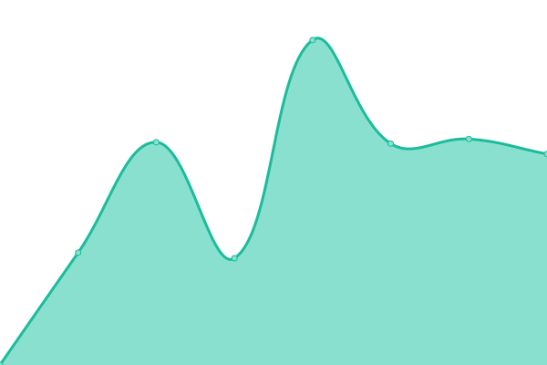

# [📈 Live Status](https://demo.upptime.js.org): <!--live status--> **🟧 Partial outage**

This repository contains the open-source uptime monitor and status page for [Patrick Little](Open.Canada.ca), powered by [Upptime](https://github.com/upptime/upptime).

With [Upptime](https://upptime.js.org), you can get your own unlimited and free uptime monitor and status page, powered entirely by a GitHub repository. We use [Issues](https://github.com/PatLittle/Consultations-Tracker/issues) as incident reports, [Actions](https://github.com/PatLittle/Consultations-Tracker/actions) as uptime monitors, and [Pages](https://demo.upptime.js.org) for the status page.

<!--start: status pages-->
<!-- This summary is generated by Upptime (https://github.com/upptime/upptime) -->
<!-- Do not edit this manually, your changes will be overwritten -->
<!-- prettier-ignore -->
| URL | Status | History | Response Time | Uptime |
| --- | ------ | ------- | ------------- | ------ |
|  [CBSA Assessment and Revenue Management (CARM) Information sessions on implementation](https://www.cbsa-asfc.gc.ca/prog/carm-gcra/menu-eng.html) | 🟥 Down | [cbsa-assessment-and-revenue-management-carm-information-sessions-on-implementation.yml](https://github.com/PatLittle/Consultations-Tracker/commits/HEAD/history/cbsa-assessment-and-revenue-management-carm-information-sessions-on-implementation.yml) | 

 245ms
     
 | 

<a href="https://PatLittle.github.io/Consultations-Tracker/history/cbsa-assessment-and-revenue-management-carm-information-sessions-on-implementation">100.00%</a>
    

|  [White River First Nations](https://www.rcaanc-cirnac.gc.ca/eng/1511969222951/1529103469169) | 🟩 Up | [white-river-first-nations.yml](https://github.com/PatLittle/Consultations-Tracker/commits/HEAD/history/white-river-first-nations.yml) | 

 944ms
     
 | 

<a href="https://PatLittle.github.io/Consultations-Tracker/history/white-river-first-nations">100.00%</a>
    

|  [Use of digital tools at the border](https://www.cbsa-asfc.gc.ca/services/border-tech-frontiere/modern-eng.html) | 🟩 Up | [use-of-digital-tools-at-the-border.yml](https://github.com/PatLittle/Consultations-Tracker/commits/HEAD/history/use-of-digital-tools-at-the-border.yml) | 

 75ms
     
 | 

<a href="https://PatLittle.github.io/Consultations-Tracker/history/use-of-digital-tools-at-the-border">100.00%</a>
    

|  [Onshore Pipeline Regulations and Filing Manuals Review Project](https://www.cerdialogue.ca/opr) | 🟩 Up | [onshore-pipeline-regulations-and-filing-manuals-review-project.yml](https://github.com/PatLittle/Consultations-Tracker/commits/HEAD/history/onshore-pipeline-regulations-and-filing-manuals-review-project.yml) | 

 1917ms
     
 | 

<a href="https://PatLittle.github.io/Consultations-Tracker/history/onshore-pipeline-regulations-and-filing-manuals-review-project">100.00%</a>
    

|  [Regulatory Framework Plan](https://can01.safelinks.protection.outlook.com/?url=https%3A%2F%2Fwww.cer-rec.gc.ca%2Fen%2Fabout%2Fhow-we-regulate%2Fplans-for-regulatory-framework%2F&data=05%7C02%7CMichelle.Shabits%40cer-rec.gc.ca%7Cec1c386ebea64452821d08dc41ebb1b9%7C56e9b8d38a3549abbdfc27de59608f01%7C0%7C0%7C638457728797041411%7CUnknown%7CTWFpbGZsb3d8eyJWIjoiMC4wLjAwMDAiLCJQIjoiV2luMzIiLCJBTiI6Ik1haWwiLCJXVCI6Mn0%3D%7C0%7C%7C%7C&sdata=tKxvqtPetzkvcXlETiyyf51rWnRpUftsM2o2U5IySO4%3D&reserved=0) | 🟩 Up | [regulatory-framework-plan.yml](https://github.com/PatLittle/Consultations-Tracker/commits/HEAD/history/regulatory-framework-plan.yml) | 

 932ms
     
 | 

<a href="https://PatLittle.github.io/Consultations-Tracker/history/regulatory-framework-plan">100.00%</a>
    

|  [Regulated Industry Engagement](https://www.cer-rec.gc.ca/en/consultation-engagement/stakeholder-engagement/regulated-industry-engagement/index.html) | 🟩 Up | [regulated-industry-engagement.yml](https://github.com/PatLittle/Consultations-Tracker/commits/HEAD/history/regulated-industry-engagement.yml) | 

 252ms
     
 | 

<a href="https://PatLittle.github.io/Consultations-Tracker/history/regulated-industry-engagement">100.00%</a>
    

|  [Revised Event Reporting Guidelines](https://www.cerdialogue.ca/event-reporting-guidelines) | 🟩 Up | [revised-event-reporting-guidelines.yml](https://github.com/PatLittle/Consultations-Tracker/commits/HEAD/history/revised-event-reporting-guidelines.yml) | 

 368ms
     
 | 

<a href="https://PatLittle.github.io/Consultations-Tracker/history/revised-event-reporting-guidelines">100.00%</a>
    

|  [Predictable and Efficient Processing and Assessment of Negligible-Risk and Low-Risk Activities](https://www.cerdialogue.ca/efficiency-project) | 🟩 Up | [predictable-and-efficient-processing-and-assessment-of-negligible-risk-and-low-risk-activities.yml](https://github.com/PatLittle/Consultations-Tracker/commits/HEAD/history/predictable-and-efficient-processing-and-assessment-of-negligible-risk-and-low-risk-activities.yml) | 

 326ms
     
 | 

<a href="https://PatLittle.github.io/Consultations-Tracker/history/predictable-and-efficient-processing-and-assessment-of-negligible-risk-and-low-risk-activities">100.00%</a>
    

|  [Canada's Energy Future](Canada's Energy Future / Avenir énergétique du Canada | CER Dialogue- Canada.ca) | 🟥 Down | [canada-s-energy-future.yml](https://github.com/PatLittle/Consultations-Tracker/commits/HEAD/history/canada-s-energy-future.yml) | 

 0ms
     
 | 

<a href="https://PatLittle.github.io/Consultations-Tracker/history/canada-s-energy-future">0.00%</a>
    

|  [Reporting Fees for Service (RFS)](https://www.canada.ca/en/revenue-agency/programs/about-canada-revenue-agency-cra/compliance/reporting-fees-for-service.html) | 🟩 Up | [reporting-fees-for-service-rfs.yml](https://github.com/PatLittle/Consultations-Tracker/commits/HEAD/history/reporting-fees-for-service-rfs.yml) | 

 2356ms
     
 | 

<a href="https://PatLittle.github.io/Consultations-Tracker/history/reporting-fees-for-service-rfs">100.00%</a>
    

|  [Share your thoughts: Proposed guidance on how to label and represent plant-based alternatives to egg products](https://inspection.canada.ca/en/about-cfia/transparency/consultations-and-engagement/how-label-and-represent-plant-based-alternatives) | 🟩 Up | [share-your-thoughts-proposed-guidance-on-how-to-label-and-represent-plant-based-alternatives-to-egg-products.yml](https://github.com/PatLittle/Consultations-Tracker/commits/HEAD/history/share-your-thoughts-proposed-guidance-on-how-to-label-and-represent-plant-based-alternatives-to-egg-products.yml) | 

 1792ms
     
 | 

<a href="https://PatLittle.github.io/Consultations-Tracker/history/share-your-thoughts-proposed-guidance-on-how-to-label-and-represent-plant-based-alternatives-to-egg-products">100.00%</a>
    

|  [Share your thoughts: Identifying a new approach for developing and maintaining Canadian fresh fruit and vegetable grade standards](https://inspection.canada.ca/en/about-cfia/transparency/consultations-and-engagement/share-your-thoughts-canadian-fresh-fruit-and-vegetable-grade-standards) | 🟩 Up | [share-your-thoughts-identifying-a-new-approach-for-developing-and-maintaining-canadian-fresh-fruit-and-vegetable-grade-standards.yml](https://github.com/PatLittle/Consultations-Tracker/commits/HEAD/history/share-your-thoughts-identifying-a-new-approach-for-developing-and-maintaining-canadian-fresh-fruit-and-vegetable-grade-standards.yml) | 

 4527ms
     
 | 

<a href="https://PatLittle.github.io/Consultations-Tracker/history/share-your-thoughts-identifying-a-new-approach-for-developing-and-maintaining-canadian-fresh-fruit-and-vegetable-grade-standards">100.00%</a>
    

|  [Share your thoughts: Proposed new livestock feed ingredient - Waxy-leaf nightshade leaf powder](https://inspection.canada.ca/en/about-cfia/transparency/consultations-and-engagement/waxy-leaf-nightshade) | 🟩 Up | [share-your-thoughts-proposed-new-livestock-feed-ingredient-waxy-leaf-nightshade-leaf-powder.yml](https://github.com/PatLittle/Consultations-Tracker/commits/HEAD/history/share-your-thoughts-proposed-new-livestock-feed-ingredient-waxy-leaf-nightshade-leaf-powder.yml) | 

 906ms
     
 | 

<a href="https://PatLittle.github.io/Consultations-Tracker/history/share-your-thoughts-proposed-new-livestock-feed-ingredient-waxy-leaf-nightshade-leaf-powder">100.00%</a>
    

|  [International Plant Protection Convention (IPPC) Member consultation on draft International Standards for Phytosanitary Measures and Implementation and Capacity Development Documents](https://inspection.canada.ca/importing-food-plants-or-animals/plant-and-plant-product-imports/international-plant-protection/eng/1307387838940/1307388165125#a3) | 🟩 Up | [international-plant-protection-convention-ippc-member-consultation-on-draft-international-standards-for-phytosanitary-measures-and-implementation-and-capacity-development-documents.yml](https://github.com/PatLittle/Consultations-Tracker/commits/HEAD/history/international-plant-protection-convention-ippc-member-consultation-on-draft-international-standards-for-phytosanitary-measures-and-implementation-and-capacity-development-documents.yml) | 

 918ms
     
 | 

<a href="https://PatLittle.github.io/Consultations-Tracker/history/international-plant-protection-convention-ippc-member-consultation-on-draft-international-standards-for-phytosanitary-measures-and-implementation-and-capacity-development-documents">100.00%</a>
    

|  [IPPC Member consultation on draft International Standards for Phytosanitary Measures and specifications](https://inspection.canada.ca/en/exporting-food-plants-animals/exports/international-plant-protection) | 🟩 Up | [ippc-member-consultation-on-draft-international-standards-for-phytosanitary-measures-and-specifications.yml](https://github.com/PatLittle/Consultations-Tracker/commits/HEAD/history/ippc-member-consultation-on-draft-international-standards-for-phytosanitary-measures-and-specifications.yml) | 

 43ms
     
 | 

<a href="https://PatLittle.github.io/Consultations-Tracker/history/ippc-member-consultation-on-draft-international-standards-for-phytosanitary-measures-and-specifications">100.00%</a>
    

|  [Share your thoughts:  Introduction of potato wart 랐iability confirmation status and 랁ield of concern classification](https://inspection.canada.ca/en/about-cfia/transparency/consultations-and-engagement/potato-wart-viability-status) | 🟩 Up | [share-your-thoughts-introduction-of-potato-wart-viability-confirmation-status-and-field-of-concern-classification.yml](https://github.com/PatLittle/Consultations-Tracker/commits/HEAD/history/share-your-thoughts-introduction-of-potato-wart-viability-confirmation-status-and-field-of-concern-classification.yml) | 

 959ms
     
 | 

<a href="https://PatLittle.github.io/Consultations-Tracker/history/share-your-thoughts-introduction-of-potato-wart-viability-confirmation-status-and-field-of-concern-classification">100.00%</a>
    

|  [Share your thoughts: Proposed amended livestock feed ingredient - Kluyveromyces marxianus culture dehydrated](https://inspection.canada.ca/en/about-cfia/transparency/consultations-and-engagement/kluyveromyces-marxianus) | 🟩 Up | [share-your-thoughts-proposed-amended-livestock-feed-ingredient-kluyveromyces-marxianus-culture-dehydrated.yml](https://github.com/PatLittle/Consultations-Tracker/commits/HEAD/history/share-your-thoughts-proposed-amended-livestock-feed-ingredient-kluyveromyces-marxianus-culture-dehydrated.yml) | 

 995ms
     
 | 

<a href="https://PatLittle.github.io/Consultations-Tracker/history/share-your-thoughts-proposed-amended-livestock-feed-ingredient-kluyveromyces-marxianus-culture-dehydrated">100.00%</a>
    

|  [Share your thoughts: Proposed new livestock feed ingredient - Lactobacillus acidophilus culture dehydrated](https://inspection.canada.ca/en/about-cfia/transparency/consultations-and-engagement/lactobacillus-acidophilus) | 🟩 Up | [share-your-thoughts-proposed-new-livestock-feed-ingredient-lactobacillus-acidophilus-culture-dehydrated.yml](https://github.com/PatLittle/Consultations-Tracker/commits/HEAD/history/share-your-thoughts-proposed-new-livestock-feed-ingredient-lactobacillus-acidophilus-culture-dehydrated.yml) | 

 980ms
     
 | 

<a href="https://PatLittle.github.io/Consultations-Tracker/history/share-your-thoughts-proposed-new-livestock-feed-ingredient-lactobacillus-acidophilus-culture-dehydrated">100.00%</a>
    

|  [Changing Narrative Fund](https://www.canada.ca/en/canadian-heritage/campaigns/changing-narratives-fund.html) | 🟩 Up | [changing-narrative-fund.yml](https://github.com/PatLittle/Consultations-Tracker/commits/HEAD/history/changing-narrative-fund.yml) | 

 3686ms
     
 | 

<a href="https://PatLittle.github.io/Consultations-Tracker/history/changing-narrative-fund">100.00%</a>
    

|  [2022-23 Consultations on renewal of the Museum Policy](https://www.canada.ca/en/canadian-heritage/campaigns/renewal-museum-policy.html) | 🟩 Up | [2022-23-consultations-on-renewal-of-the-museum-policy.yml](https://github.com/PatLittle/Consultations-Tracker/commits/HEAD/history/2022-23-consultations-on-renewal-of-the-museum-policy.yml) | 

 2561ms
     
 | 

<a href="https://PatLittle.github.io/Consultations-Tracker/history/2022-23-consultations-on-renewal-of-the-museum-policy">100.00%</a>
    

|  [Discussion Paper DIS-24-04, Future Amendments the Nuclear Security Regulations: Granting Peace Officer Powers, Initiating a Complaints Investigation Mechanism, and Transferring of Firearm Ownership to Licensees](https://letstalknuclearsafety.ca/dis-24-04-landing-page) | 🟩 Up | [discussion-paper-dis-24-04-future-amendments-the-nuclear-security-regulations-granting-peace-officer-powers-initiating-a-complaints-investigation-mechanism-and-transferring-of-firearm-ownership-to-licensees.yml](https://github.com/PatLittle/Consultations-Tracker/commits/HEAD/history/discussion-paper-dis-24-04-future-amendments-the-nuclear-security-regulations-granting-peace-officer-powers-initiating-a-complaints-investigation-mechanism-and-transferring-of-firearm-ownership-to-licensees.yml) | 

 299ms
     
 | 

<a href="https://PatLittle.github.io/Consultations-Tracker/history/discussion-paper-dis-24-04-future-amendments-the-nuclear-security-regulations-granting-peace-officer-powers-initiating-a-complaints-investigation-mechanism-and-transferring-of-firearm-ownership-to-licensees">100.00%</a>
    

|  [Co-development of a new Indigenous Broadcasting Policy](https://crtc.gc.ca/eng/archive/2019/2019-217.htm) | 🟩 Up | [co-development-of-a-new-indigenous-broadcasting-policy.yml](https://github.com/PatLittle/Consultations-Tracker/commits/HEAD/history/co-development-of-a-new-indigenous-broadcasting-policy.yml) | 

 243ms
     
 | 

<a href="https://PatLittle.github.io/Consultations-Tracker/history/co-development-of-a-new-indigenous-broadcasting-policy">100.00%</a>
    

|  [Share your thoughts about closed captioning of programming from online streaming services](https://crtc.gc.ca/eng/consultation/cc.htm) | 🟩 Up | [share-your-thoughts-about-closed-captioning-of-programming-from-online-streaming-services.yml](https://github.com/PatLittle/Consultations-Tracker/commits/HEAD/history/share-your-thoughts-about-closed-captioning-of-programming-from-online-streaming-services.yml) | 

 40ms
     
 | 

<a href="https://PatLittle.github.io/Consultations-Tracker/history/share-your-thoughts-about-closed-captioning-of-programming-from-online-streaming-services">100.00%</a>
    

|  [Share your thoughts about described video and audio description](https://crtc.gc.ca/eng/consultation/descri.htm) | 🟩 Up | [share-your-thoughts-about-described-video-and-audio-description.yml](https://github.com/PatLittle/Consultations-Tracker/commits/HEAD/history/share-your-thoughts-about-described-video-and-audio-description.yml) | 

 41ms
     
 | 

<a href="https://PatLittle.github.io/Consultations-Tracker/history/share-your-thoughts-about-described-video-and-audio-description">100.00%</a>
    

|  [Share your thoughts about the Independent Local News Fund](https://crtc.gc.ca/eng/consultation/independ.htm) | 🟩 Up | [share-your-thoughts-about-the-independent-local-news-fund.yml](https://github.com/PatLittle/Consultations-Tracker/commits/HEAD/history/share-your-thoughts-about-the-independent-local-news-fund.yml) | 

 43ms
     
 | 

<a href="https://PatLittle.github.io/Consultations-Tracker/history/share-your-thoughts-about-the-independent-local-news-fund">100.00%</a>
    

|  [Government consults on Budget 2024 commitment to expand opt-in tax jurisdiction for Indigenous governments](https://can01.safelinks.protection.outlook.com/?url=https%3A%2F%2Fwww.canada.ca%2Fen%2Fdepartment-finance%2Fnews%2F2024%2F07%2Fgovernment-consults-on-budget-2024-commitment-to-expand-opt-in-tax-jurisdiction-for-indigenous-governments.html&data=05%7C02%7CHeather.Mustoe%40fin.gc.ca%7C9a8b6b9ea2b14ed9ff2a08dcab386aaf%7Cc8d186b6faab43fb98c018a0dfa65ac1%7C0%7C0%7C638573505991724649%7CUnknown%7CTWFpbGZsb3d8eyJWIjoiMC4wLjAwMDAiLCJQIjoiV2luMzIiLCJBTiI6Ik1haWwiLCJXVCI6Mn0%3D%7C0%7C%7C%7C&sdata=ep1m739RAa2qXTeK14PB%2B2%2Bdk21AvWUcdFGDbFKJ5h4%3D&reserved=0) | 🟩 Up | [government-consults-on-budget-2024-commitment-to-expand-opt-in-tax-jurisdiction-for-indigenous-governments.yml](https://github.com/PatLittle/Consultations-Tracker/commits/HEAD/history/government-consults-on-budget-2024-commitment-to-expand-opt-in-tax-jurisdiction-for-indigenous-governments.yml) | 

 4101ms
     
 | 

<a href="https://PatLittle.github.io/Consultations-Tracker/history/government-consults-on-budget-2024-commitment-to-expand-opt-in-tax-jurisdiction-for-indigenous-governments">100.00%</a>
    

|  [Council of Europe Second Additional Protocol to the Convention on Cybercrime on Enhanced Cooperation and Disclosure of Electronic EvidenceConsultations, 2023](https://www.justice.gc.ca/eng/cj-jp/cyber/id-di/index.html) | 🟩 Up | [council-of-europe-second-additional-protocol-to-the-convention-on-cybercrime-on-enhanced-cooperation-and-disclosure-of-electronic-evidence-consultations-2023.yml](https://github.com/PatLittle/Consultations-Tracker/commits/HEAD/history/council-of-europe-second-additional-protocol-to-the-convention-on-cybercrime-on-enhanced-cooperation-and-disclosure-of-electronic-evidence-consultations-2023.yml) | 

 297ms
     
 | 

<a href="https://PatLittle.github.io/Consultations-Tracker/history/council-of-europe-second-additional-protocol-to-the-convention-on-cybercrime-on-enhanced-cooperation-and-disclosure-of-electronic-evidence-consultations-2023">100.00%</a>
    

|  [Modernization of the Employment Equity Act](https://www.canada.ca/en/employment-social-development/corporate/portfolio/labour/programs/employment-equity/consultation-act-modernization.html) | 🟩 Up | [modernization-of-the-employment-equity-act.yml](https://github.com/PatLittle/Consultations-Tracker/commits/HEAD/history/modernization-of-the-employment-equity-act.yml) | 

 2152ms
     
 | 

<a href="https://PatLittle.github.io/Consultations-Tracker/history/modernization-of-the-employment-equity-act">100.00%</a>
    

|  [Building a Modern 21st Century Workforce](https://www.canada.ca/en/employment-social-development/programs/training-agreements/workforce-summit.html) | 🟩 Up | [building-a-modern-21st-century-workforce.yml](https://github.com/PatLittle/Consultations-Tracker/commits/HEAD/history/building-a-modern-21st-century-workforce.yml) | 

 2228ms
     
 | 

<a href="https://PatLittle.github.io/Consultations-Tracker/history/building-a-modern-21st-century-workforce">100.00%</a>
    

|  [Consultation on the proposed Canada Disability Benefit Regulations](https://canadagazette.gc.ca/rp-pr/p1/2024/2024-06-29/html/reg2-eng.html) | 🟩 Up | [consultation-on-the-proposed-canada-disability-benefit-regulations.yml](https://github.com/PatLittle/Consultations-Tracker/commits/HEAD/history/consultation-on-the-proposed-canada-disability-benefit-regulations.yml) | 

 320ms
     
 | 

<a href="https://PatLittle.github.io/Consultations-Tracker/history/consultation-on-the-proposed-canada-disability-benefit-regulations">100.00%</a>
    

|  [Share your ideas: Blackwater Project](https://www.canada.ca/en/environment-climate-change/services/managing-pollution/sources-industry/mining/metal-diamond-mining-effluent-regulation/blackwater-consultation.html) | 🟥 Down | [share-your-ideas-blackwater-project.yml](https://github.com/PatLittle/Consultations-Tracker/commits/HEAD/history/share-your-ideas-blackwater-project.yml) | 

 2060ms
     
 | 

<a href="https://PatLittle.github.io/Consultations-Tracker/history/share-your-ideas-blackwater-project">100.00%</a>
    

|  [Consultation on Amending the List of Species under the Species at Risk Act: Terrestrial Species December 2023](https://species-registry.canada.ca/index-en.html#/documents/1171) | 🟩 Up | [consultation-on-amending-the-list-of-species-under-the-species-at-risk-act-terrestrial-species-december-2023.yml](https://github.com/PatLittle/Consultations-Tracker/commits/HEAD/history/consultation-on-amending-the-list-of-species-under-the-species-at-risk-act-terrestrial-species-december-2023.yml) | 

 293ms
     
 | 

<a href="https://PatLittle.github.io/Consultations-Tracker/history/consultation-on-amending-the-list-of-species-under-the-species-at-risk-act-terrestrial-species-december-2023">100.00%</a>
    

|  [Dolphin and Union Caribou pre-listing consultations](https://www.canada.ca/en/environment-climate-change/corporate/transparency/consultations/review-environmental-violations-administrative-monetary-penalties-regulations.html) | 🟩 Up | [dolphin-and-union-caribou-pre-listing-consultations.yml](https://github.com/PatLittle/Consultations-Tracker/commits/HEAD/history/dolphin-and-union-caribou-pre-listing-consultations.yml) | 

 2720ms
     
 | 

<a href="https://PatLittle.github.io/Consultations-Tracker/history/dolphin-and-union-caribou-pre-listing-consultations">100.00%</a>
    

|  [Share your ideas: Amendments to the Metal and Diamond Mining Effluent Regulations for the Goldboro Gold Project](https://www.canada.ca/en/environment-climate-change/corporate/transparency/consultations/goldboro-mine-project.html) | 🟩 Up | [share-your-ideas-amendments-to-the-metal-and-diamond-mining-effluent-regulations-for-the-goldboro-gold-project.yml](https://github.com/PatLittle/Consultations-Tracker/commits/HEAD/history/share-your-ideas-amendments-to-the-metal-and-diamond-mining-effluent-regulations-for-the-goldboro-gold-project.yml) | 

 2432ms
     
 | 

<a href="https://PatLittle.github.io/Consultations-Tracker/history/share-your-ideas-amendments-to-the-metal-and-diamond-mining-effluent-regulations-for-the-goldboro-gold-project">100.00%</a>
    

|  [Proposed Regulations Amending the Wildlife Area Regulations  Delisting of 19 Units of the Prairie National Wildlife Area (NWA) and Designation of Five New NWAs](https://www.canada.ca/en/environment-climate-change/corporate/transparency/consultations/consultation-regulations-five-new-national-wildlife-areas.html) | 🟩 Up | [proposed-regulations-amending-the-wildlife-area-regulations-delisting-of-19-units-of-the-prairie-national-wildlife-area-nwa-and-designation-of-five-new-nw-as.yml](https://github.com/PatLittle/Consultations-Tracker/commits/HEAD/history/proposed-regulations-amending-the-wildlife-area-regulations-delisting-of-19-units-of-the-prairie-national-wildlife-area-nwa-and-designation-of-five-new-nw-as.yml) | 

 2694ms
     
 | 

<a href="https://PatLittle.github.io/Consultations-Tracker/history/proposed-regulations-amending-the-wildlife-area-regulations-delisting-of-19-units-of-the-prairie-national-wildlife-area-nwa-and-designation-of-five-new-nw-as">100.00%</a>
    

|  [Consultation on the proposed Emergency Order to protect boreal caribou in the provice of Quebec](https://species-registry.canada.ca/index-en.html#/documents/980) | 🟩 Up | [consultation-on-the-proposed-emergency-order-to-protect-boreal-caribou-in-the-provice-of-quebec.yml](https://github.com/PatLittle/Consultations-Tracker/commits/HEAD/history/consultation-on-the-proposed-emergency-order-to-protect-boreal-caribou-in-the-provice-of-quebec.yml) | 

 0ms
     
 | 

<a href="https://PatLittle.github.io/Consultations-Tracker/history/consultation-on-the-proposed-emergency-order-to-protect-boreal-caribou-in-the-provice-of-quebec">100.00%</a>
    

|  [Comment on: Draft Canada-Saskatchewan Equivalency Agreement on coal-fired electricity regulations (2025-2026)](https://www.canada.ca/en/environment-climate-change/services/canadian-environmental-protection-act-registry/agreements/equivalency/canada-saskatchewan-greenhouse-gas-electricity-producers-2025.html) | 🟩 Up | [comment-on-draft-canada-saskatchewan-equivalency-agreement-on-coal-fired-electricity-regulations-2025-2026.yml](https://github.com/PatLittle/Consultations-Tracker/commits/HEAD/history/comment-on-draft-canada-saskatchewan-equivalency-agreement-on-coal-fired-electricity-regulations-2025-2026.yml) | 

 3211ms
     
 | 

<a href="https://PatLittle.github.io/Consultations-Tracker/history/comment-on-draft-canada-saskatchewan-equivalency-agreement-on-coal-fired-electricity-regulations-2025-2026">100.00%</a>
    

|  [Share your thoughts: Proposed Regulations Respecting the Reduction in the Release of Methane (Waste Sector)](https://www.canada.ca/en/environment-climate-change/corporate/transparency/consultations/proposed-regulations-respecting-reduction-release-methane-waste-sector.html) | 🟩 Up | [share-your-thoughts-proposed-regulations-respecting-the-reduction-in-the-release-of-methane-waste-sector.yml](https://github.com/PatLittle/Consultations-Tracker/commits/HEAD/history/share-your-thoughts-proposed-regulations-respecting-the-reduction-in-the-release-of-methane-waste-sector.yml) | 

 0ms
     
 | 

<a href="https://PatLittle.github.io/Consultations-Tracker/history/share-your-thoughts-proposed-regulations-respecting-the-reduction-in-the-release-of-methane-waste-sector">100.00%</a>
    

|  [Share your thoughts: Regulatory Review of the Ozone-depleting Substances and Halocarbon Alternatives Regulations](https://www.canada.ca/en/environment-climate-change/corporate/transparency/consultations/regulatory-review-ozone-depleting-substances-halocarbon-alternatives-regulations.html) | 🟩 Up | [share-your-thoughts-regulatory-review-of-the-ozone-depleting-substances-and-halocarbon-alternatives-regulations.yml](https://github.com/PatLittle/Consultations-Tracker/commits/HEAD/history/share-your-thoughts-regulatory-review-of-the-ozone-depleting-substances-and-halocarbon-alternatives-regulations.yml) | 

 2259ms
     
 | 

<a href="https://PatLittle.github.io/Consultations-Tracker/history/share-your-thoughts-regulatory-review-of-the-ozone-depleting-substances-and-halocarbon-alternatives-regulations">100.00%</a>
    

|  [Share and view ideas: Consultation addressing plastic waste and pollution from the textile and apparel sector](https://canada.ca/en/environment-climate-change/services/managing-reducing-waste/consultations/roadmap-plastic-waste-pollution-textile-apparel-sector.html) | 🟩 Up | [share-and-view-ideas-consultation-addressing-plastic-waste-and-pollution-from-the-textile-and-apparel-sector.yml](https://github.com/PatLittle/Consultations-Tracker/commits/HEAD/history/share-and-view-ideas-consultation-addressing-plastic-waste-and-pollution-from-the-textile-and-apparel-sector.yml) | 

 2304ms
     
 | 

<a href="https://PatLittle.github.io/Consultations-Tracker/history/share-and-view-ideas-consultation-addressing-plastic-waste-and-pollution-from-the-textile-and-apparel-sector">100.00%</a>
    

|  [Share your thoughts: Updated Draft State of Per- and Polyfluoroalkyl Substances (PFAS) Report and Revised Risk Management Scope](https://www.canada.ca/en/environment-climate-change/corporate/transparency/updated-draft-state-pfas-report-consultation.html) | 🟩 Up | [share-your-thoughts-updated-draft-state-of-per-and-polyfluoroalkyl-substances-pfas-report-and-revised-risk-management-scope.yml](https://github.com/PatLittle/Consultations-Tracker/commits/HEAD/history/share-your-thoughts-updated-draft-state-of-per-and-polyfluoroalkyl-substances-pfas-report-and-revised-risk-management-scope.yml) | 

 2304ms
     
 | 

<a href="https://PatLittle.github.io/Consultations-Tracker/history/share-your-thoughts-updated-draft-state-of-per-and-polyfluoroalkyl-substances-pfas-report-and-revised-risk-management-scope">100.00%</a>
    

|  [National Freshwater Data Strategy](https://www.canada.ca/en/environment-climate-change/corporate/transparency/consultations/national-freshwater-data-strategy.html) | 🟩 Up | [national-freshwater-data-strategy.yml](https://github.com/PatLittle/Consultations-Tracker/commits/HEAD/history/national-freshwater-data-strategy.yml) | 

 2132ms
     
 | 

<a href="https://PatLittle.github.io/Consultations-Tracker/history/national-freshwater-data-strategy">100.00%</a>
    

|  [Draft roadmap for addressing plastic waste and pollution from the textile and apparel sector: consultation document](https://canada-preview.adobecqms.net/en/environment-climate-change/services/managing-reducing-waste/consultations/roadmap-plastic-waste-pollution-textile-apparel-sector.html) | 🟩 Up | [draft-roadmap-for-addressing-plastic-waste-and-pollution-from-the-textile-and-apparel-sector-consultation-document.yml](https://github.com/PatLittle/Consultations-Tracker/commits/HEAD/history/draft-roadmap-for-addressing-plastic-waste-and-pollution-from-the-textile-and-apparel-sector-consultation-document.yml) | 

 2770ms
     
 | 

<a href="https://PatLittle.github.io/Consultations-Tracker/history/draft-roadmap-for-addressing-plastic-waste-and-pollution-from-the-textile-and-apparel-sector-consultation-document">100.00%</a>
    

|  [Proposed Coal Mining Effluent Regulations](Proposed Coal Mining Effluent Regulationsoverview - Canada.ca) | 🟥 Down | [proposed-coal-mining-effluent-regulations.yml](https://github.com/PatLittle/Consultations-Tracker/commits/HEAD/history/proposed-coal-mining-effluent-regulations.yml) | 

 0ms
     
 | 

<a href="https://PatLittle.github.io/Consultations-Tracker/history/proposed-coal-mining-effluent-regulations">0.00%</a>
    

|  [Share and view ideas: Consultation addressing plastic waste and pollution from the textile and apparel sector](https://canada.ca/en/environment-climate-change/services/managing-reducing-waste/consultations/roadmap-plastic-waste-pollution-textile-apparel-sector.html) | 🟩 Up | [share-and-view-ideas-consultation-addressing-plastic-waste-and-pollution-from-the-textile-and-apparel-sector.yml](https://github.com/PatLittle/Consultations-Tracker/commits/HEAD/history/share-and-view-ideas-consultation-addressing-plastic-waste-and-pollution-from-the-textile-and-apparel-sector.yml) | 

 2304ms
     
 | 

<a href="https://PatLittle.github.io/Consultations-Tracker/history/share-and-view-ideas-consultation-addressing-plastic-waste-and-pollution-from-the-textile-and-apparel-sector">100.00%</a>
    

|  [Share your thoughts: Regulatory Review of the Ozone-depleting Substances and Halocarbon Alternatives Regulations](https://www.canada.ca/en/environment-climate-change/corporate/transparency/consultations/regulatory-review-ozone-depleting-substances-halocarbon-alternatives-regulations.html) | 🟩 Up | [share-your-thoughts-regulatory-review-of-the-ozone-depleting-substances-and-halocarbon-alternatives-regulations.yml](https://github.com/PatLittle/Consultations-Tracker/commits/HEAD/history/share-your-thoughts-regulatory-review-of-the-ozone-depleting-substances-and-halocarbon-alternatives-regulations.yml) | 

 2259ms
     
 | 

<a href="https://PatLittle.github.io/Consultations-Tracker/history/share-your-thoughts-regulatory-review-of-the-ozone-depleting-substances-and-halocarbon-alternatives-regulations">100.00%</a>
    

|  [Eastern Shore Islands Area of Interest Consultations](http://www.dfo-mpo.gc.ca/oceans/consultations/easternshore-ilescoteest/index-eng.html) | 🟩 Up | [eastern-shore-islands-area-of-interest-consultations.yml](https://github.com/PatLittle/Consultations-Tracker/commits/HEAD/history/eastern-shore-islands-area-of-interest-consultations.yml) | 

 374ms
     
 | 

<a href="https://PatLittle.github.io/Consultations-Tracker/history/eastern-shore-islands-area-of-interest-consultations">100.00%</a>
    

|  [Northern Gulf of St. Lawrence Study Area](https://www.dfo-mpo.gc.ca/oceans/canada-quebec-agreement-entente/index-eng.html) | 🟩 Up | [northern-gulf-of-st-lawrence-study-area.yml](https://github.com/PatLittle/Consultations-Tracker/commits/HEAD/history/northern-gulf-of-st-lawrence-study-area.yml) | 

 217ms
     
 | 

<a href="https://PatLittle.github.io/Consultations-Tracker/history/northern-gulf-of-st-lawrence-study-area">100.00%</a>
    

|  [Fundian Channel- Browns Bank Area of Interest](https://www.dfo-mpo.gc.ca/oceans/aoi-si/fundian-fundy-browns-eng.html) | 🟩 Up | [fundian-channel-browns-bank-area-of-interest.yml](https://github.com/PatLittle/Consultations-Tracker/commits/HEAD/history/fundian-channel-browns-bank-area-of-interest.yml) | 

 126ms
     
 | 

<a href="https://PatLittle.github.io/Consultations-Tracker/history/fundian-channel-browns-bank-area-of-interest">100.00%</a>
    

|  [Let's talk Pacific Salmon](https://letstalkpacificsalmon.ca/) | 🟩 Up | [let-s-talk-pacific-salmon.yml](https://github.com/PatLittle/Consultations-Tracker/commits/HEAD/history/let-s-talk-pacific-salmon.yml) | 

 929ms
     
 | 

<a href="https://PatLittle.github.io/Consultations-Tracker/history/let-s-talk-pacific-salmon">100.00%</a>
    

|  [Proposed ticketing for the enforcement of a fisheries offence under the Fisheries Act](TBD) | 🟥 Down | [proposed-ticketing-for-the-enforcement-of-a-fisheries-offence-under-the-fisheries-act.yml](https://github.com/PatLittle/Consultations-Tracker/commits/HEAD/history/proposed-ticketing-for-the-enforcement-of-a-fisheries-offence-under-the-fisheries-act.yml) | 

 0ms
     
 | 

<a href="https://PatLittle.github.io/Consultations-Tracker/history/proposed-ticketing-for-the-enforcement-of-a-fisheries-offence-under-the-fisheries-act">100.00%</a>
    

|  [Marine Conservation Network Plan](https://www.dfo-mpo.gc.ca/oceans/networks-reseaux/development-developpement-eng.html) | 🟩 Up | [marine-conservation-network-plan.yml](https://github.com/PatLittle/Consultations-Tracker/commits/HEAD/history/marine-conservation-network-plan.yml) | 

 61ms
     
 | 

<a href="https://PatLittle.github.io/Consultations-Tracker/history/marine-conservation-network-plan">100.00%</a>
    

|  [Whitby Harbour Remediation Project](https://www.dfo-mpo.gc.ca/sch-ppb/whitby/index-eng.html) | 🟩 Up | [whitby-harbour-remediation-project.yml](https://github.com/PatLittle/Consultations-Tracker/commits/HEAD/history/whitby-harbour-remediation-project.yml) | 

 112ms
     
 | 

<a href="https://PatLittle.github.io/Consultations-Tracker/history/whitby-harbour-remediation-project">100.00%</a>
    

|  [Canadian Coast Guard Long-term Strategy](https://www.ccg-gcc.gc.ca/engagement/lts-slt/consultation-eng.html) | 🟩 Up | [canadian-coast-guard-long-term-strategy.yml](https://github.com/PatLittle/Consultations-Tracker/commits/HEAD/history/canadian-coast-guard-long-term-strategy.yml) | 

 346ms
     
 | 

<a href="https://PatLittle.github.io/Consultations-Tracker/history/canadian-coast-guard-long-term-strategy">100.00%</a>
    

|  [Revision of the management plan for Banc-des-Américains Marine Protected Area (MPA)](https://www.dfo-mpo.gc.ca/oceans/mpa-zpm/american-americains/index-eng.html) | 🟩 Up | [revision-of-the-management-plan-for-banc-des-americains-marine-protected-area-mpa.yml](https://github.com/PatLittle/Consultations-Tracker/commits/HEAD/history/revision-of-the-management-plan-for-banc-des-americains-marine-protected-area-mpa.yml) | 

 73ms
     
 | 

<a href="https://PatLittle.github.io/Consultations-Tracker/history/revision-of-the-management-plan-for-banc-des-americains-marine-protected-area-mpa">100.00%</a>
    

|  [Elver Fishery Management Review](https://www.dfo-mpo.gc.ca/fisheries-peches/ifmp-gmp/elver-anguille/index-eng.html) | 🟩 Up | [elver-fishery-management-review.yml](https://github.com/PatLittle/Consultations-Tracker/commits/HEAD/history/elver-fishery-management-review.yml) | 

 247ms
     
 | 

<a href="https://PatLittle.github.io/Consultations-Tracker/history/elver-fishery-management-review">100.00%</a>
    

|  [Management Plan for the Mapleleaf (Quadrula quadrula) Great Lakes  Upper St. Lawrence Population, and Rainbow (Villosa iris) in Canada](https://wildlife-species.canada.ca/species-risk-registry/involved/consultation/default_e.cfm) | 🟩 Up | [management-plan-for-the-mapleleaf-quadrula-quadrula-great-lakes-upper-st-lawrence-population-and-rainbow-villosa-iris-in-canada.yml](https://github.com/PatLittle/Consultations-Tracker/commits/HEAD/history/management-plan-for-the-mapleleaf-quadrula-quadrula-great-lakes-upper-st-lawrence-population-and-rainbow-villosa-iris-in-canada.yml) | 

 0ms
     
 | 

<a href="https://PatLittle.github.io/Consultations-Tracker/history/management-plan-for-the-mapleleaf-quadrula-quadrula-great-lakes-upper-st-lawrence-population-and-rainbow-villosa-iris-in-canada">100.00%</a>
    

|  [Banc-des-Américains Oceans Act Marine Protected Area Management Plan](https://www.dfo-mpo.gc.ca/oceans/mpa-zpm/american-americains/index-eng.html) | 🟩 Up | [banc-des-americains-oceans-act-marine-protected-area-management-plan.yml](https://github.com/PatLittle/Consultations-Tracker/commits/HEAD/history/banc-des-americains-oceans-act-marine-protected-area-management-plan.yml) | 

 72ms
     
 | 

<a href="https://PatLittle.github.io/Consultations-Tracker/history/banc-des-americains-oceans-act-marine-protected-area-management-plan">100.00%</a>
    

|  [Proposed Amendments to the Marine Mammal Regulations: Pacific Killer Whale approach distance and other amendments](https://www.dfo-mpo.gc.ca/about-notre-sujet/engagement/2024/marine-mammal-mammiferes-marins-eng.html) | 🟩 Up | [proposed-amendments-to-the-marine-mammal-regulations-pacific-killer-whale-approach-distance-and-other-amendments.yml](https://github.com/PatLittle/Consultations-Tracker/commits/HEAD/history/proposed-amendments-to-the-marine-mammal-regulations-pacific-killer-whale-approach-distance-and-other-amendments.yml) | 

 61ms
     
 | 

<a href="https://PatLittle.github.io/Consultations-Tracker/history/proposed-amendments-to-the-marine-mammal-regulations-pacific-killer-whale-approach-distance-and-other-amendments">100.00%</a>
    

|  [Construction of a waterfront wharf at Pointe-Basse Harbour in Magdalen Islands](https://aeic-iaac.gc.ca/050/evaluations/proj/88682?culture=en-CA) | 🟩 Up | [construction-of-a-waterfront-wharf-at-pointe-basse-harbour-in-magdalen-islands.yml](https://github.com/PatLittle/Consultations-Tracker/commits/HEAD/history/construction-of-a-waterfront-wharf-at-pointe-basse-harbour-in-magdalen-islands.yml) | 

 0ms
     
 | 

<a href="https://PatLittle.github.io/Consultations-Tracker/history/construction-of-a-waterfront-wharf-at-pointe-basse-harbour-in-magdalen-islands">100.00%</a>
    

|  [Multi-species Action Plan for the Richelieu River Watershed in Canada](https://species-registry.canada.ca/index-en.html#/consultations/2965) | 🟩 Up | [multi-species-action-plan-for-the-richelieu-river-watershed-in-canada.yml](https://github.com/PatLittle/Consultations-Tracker/commits/HEAD/history/multi-species-action-plan-for-the-richelieu-river-watershed-in-canada.yml) | 

 0ms
     
 | 

<a href="https://PatLittle.github.io/Consultations-Tracker/history/multi-species-action-plan-for-the-richelieu-river-watershed-in-canada">100.00%</a>
    

|  [Consultation on the Silver Chub Recovery Strategy & Action Plan under the Species at Risk Act](https://species-registry.canada.ca/index-en.html#/consultations/448) | 🟩 Up | [consultation-on-the-silver-chub-recovery-strategy-and-action-plan-under-the-species-at-risk-act.yml](https://github.com/PatLittle/Consultations-Tracker/commits/HEAD/history/consultation-on-the-silver-chub-recovery-strategy-and-action-plan-under-the-species-at-risk-act.yml) | 

 6ms
     
 | 

<a href="https://PatLittle.github.io/Consultations-Tracker/history/consultation-on-the-silver-chub-recovery-strategy-and-action-plan-under-the-species-at-risk-act">100.00%</a>
    

|  [Possession and Export of Elvers Regulations](https://www.gazette.gc.ca/rp-pr/p1/2024/2024-06-29/html/reg6-eng.html) | 🟩 Up | [possession-and-export-of-elvers-regulations.yml](https://github.com/PatLittle/Consultations-Tracker/commits/HEAD/history/possession-and-export-of-elvers-regulations.yml) | 

 288ms
     
 | 

<a href="https://PatLittle.github.io/Consultations-Tracker/history/possession-and-export-of-elvers-regulations">100.00%</a>
    

|  [Ghost Gear Update and Path Forward Meetings](https://www.dfo-mpo.gc.ca/fisheries-peches/management-gestion/ghostgear-equipementfantome/index-eng.html) | 🟩 Up | [ghost-gear-update-and-path-forward-meetings.yml](https://github.com/PatLittle/Consultations-Tracker/commits/HEAD/history/ghost-gear-update-and-path-forward-meetings.yml) | 

 61ms
     
 | 

<a href="https://PatLittle.github.io/Consultations-Tracker/history/ghost-gear-update-and-path-forward-meetings">100.00%</a>
    

|  [Proposed Amendments to the Export Permits Regulations](https://www.international.gc.ca/trade-commerce/controls-controles/expor/backgrounder-amendments-epr-information-modification-rle.aspx?lang=eng) | 🟩 Up | [proposed-amendments-to-the-export-permits-regulations.yml](https://github.com/PatLittle/Consultations-Tracker/commits/HEAD/history/proposed-amendments-to-the-export-permits-regulations.yml) | 

 361ms
     
 | 

<a href="https://PatLittle.github.io/Consultations-Tracker/history/proposed-amendments-to-the-export-permits-regulations">100.00%</a>
    

|  [Public consultations on potential new measures to advance and defend Canada's economic security interests](https://www.international.gc.ca/trade-commerce/consultations/TRQ-CT/economic-security-canada-securite-economique.aspx?lang=eng) | 🟩 Up | [public-consultations-on-potential-new-measures-to-advance-and-defend-canada-s-economic-security-interests.yml](https://github.com/PatLittle/Consultations-Tracker/commits/HEAD/history/public-consultations-on-potential-new-measures-to-advance-and-defend-canada-s-economic-security-interests.yml) | 

 144ms
     
 | 

<a href="https://PatLittle.github.io/Consultations-Tracker/history/public-consultations-on-potential-new-measures-to-advance-and-defend-canada-s-economic-security-interests">100.00%</a>
    

|  [Canada's approach to partnerships in Africa](https://www.international.gc.ca/consultation/partnerships-africa-partenariats-afrique/partnerships-africa-partenariats-afrique.aspx?lang=eng) | 🟩 Up | [canada-s-approach-to-partnerships-in-africa.yml](https://github.com/PatLittle/Consultations-Tracker/commits/HEAD/history/canada-s-approach-to-partnerships-in-africa.yml) | 

 0ms
     
 | 

<a href="https://PatLittle.github.io/Consultations-Tracker/history/canada-s-approach-to-partnerships-in-africa">100.00%</a>
    

|  [Notice of intent to consult on modernization of provisions pertaining to hospitals and practitioners in regulations made under the Controlled Drugs and Substances Act](https://www.canada.ca/en/public-health/programs/consultation-updating-provisions-hospitals-practitioners-regulations-controlled-drugs-substances-act.html) | 🟩 Up | [notice-of-intent-to-consult-on-modernization-of-provisions-pertaining-to-hospitals-and-practitioners-in-regulations-made-under-the-controlled-drugs-and-substances-act.yml](https://github.com/PatLittle/Consultations-Tracker/commits/HEAD/history/notice-of-intent-to-consult-on-modernization-of-provisions-pertaining-to-hospitals-and-practitioners-in-regulations-made-under-the-controlled-drugs-and-substances-act.yml) | 

 0ms
     
 | 

<a href="https://PatLittle.github.io/Consultations-Tracker/history/notice-of-intent-to-consult-on-modernization-of-provisions-pertaining-to-hospitals-and-practitioners-in-regulations-made-under-the-controlled-drugs-and-substances-act">100.00%</a>
    

|  [Consultation on broflanilide, Proposed Maximum Residue Limit PMRL2024-08](https://www.canada.ca/en/health-canada/services/consumer-product-safety/pesticides-pest-management/public/consultations/proposed-maximum-residue-limit/2024/broflanilide.html) | 🟩 Up | [consultation-on-broflanilide-proposed-maximum-residue-limit-pmrl-2024-08.yml](https://github.com/PatLittle/Consultations-Tracker/commits/HEAD/history/consultation-on-broflanilide-proposed-maximum-residue-limit-pmrl-2024-08.yml) | 

 2027ms
     
 | 

<a href="https://PatLittle.github.io/Consultations-Tracker/history/consultation-on-broflanilide-proposed-maximum-residue-limit-pmrl-2024-08">100.00%</a>
    

|  [Consultation on metsulfuron-methyl, Proposed Maximum Residue Limit PMRL2024-09](https://www.canada.ca/en/health-canada/services/consumer-product-safety/pesticides-pest-management/public/consultations/proposed-maximum-residue-limit/2024/metsulfuron-methyl.html) | 🟩 Up | [consultation-on-metsulfuron-methyl-proposed-maximum-residue-limit-pmrl-2024-09.yml](https://github.com/PatLittle/Consultations-Tracker/commits/HEAD/history/consultation-on-metsulfuron-methyl-proposed-maximum-residue-limit-pmrl-2024-09.yml) | 

 2322ms
     
 | 

<a href="https://PatLittle.github.io/Consultations-Tracker/history/consultation-on-metsulfuron-methyl-proposed-maximum-residue-limit-pmrl-2024-09">100.00%</a>
    

|  [Consultation on cyflumetofen, Proposed Maximum Residue Limit PMRL2024-10](https://www.canada.ca/en/health-canada/services/consumer-product-safety/pesticides-pest-management/public/consultations/proposed-maximum-residue-limit/2024/cyflumetofen.html) | 🟩 Up | [consultation-on-cyflumetofen-proposed-maximum-residue-limit-pmrl-2024-10.yml](https://github.com/PatLittle/Consultations-Tracker/commits/HEAD/history/consultation-on-cyflumetofen-proposed-maximum-residue-limit-pmrl-2024-10.yml) | 

 2067ms
     
 | 

<a href="https://PatLittle.github.io/Consultations-Tracker/history/consultation-on-cyflumetofen-proposed-maximum-residue-limit-pmrl-2024-10">100.00%</a>
    

|  [Regulations Amending the Pest Control Products Regulations (Strengthening the Regulation of Pest Control Products in Canada)](https://gazette.gc.ca/rp-pr/p1/2024/2024-06-15/html/reg2-eng.html) | 🟩 Up | [regulations-amending-the-pest-control-products-regulations-strengthening-the-regulation-of-pest-control-products-in-canada.yml](https://github.com/PatLittle/Consultations-Tracker/commits/HEAD/history/regulations-amending-the-pest-control-products-regulations-strengthening-the-regulation-of-pest-control-products-in-canada.yml) | 

 0ms
     
 | 

<a href="https://PatLittle.github.io/Consultations-Tracker/history/regulations-amending-the-pest-control-products-regulations-strengthening-the-regulation-of-pest-control-products-in-canada">100.00%</a>
    

|  [Consultation on accessing confidential test data under pest control products regulations  proposed guidance document, Regulatory Proposal PRO2024-02](https://www.canada.ca/en/health-canada/services/consumer-product-safety/pesticides-pest-management/public/consultations/regulatory-proposals/2024/accessing-confidential-test-data-pest-control-products-regulations.html) | 🟩 Up | [consultation-on-accessing-confidential-test-data-under-pest-control-products-regulations-proposed-guidance-document-regulatory-proposal-pro-2024-02.yml](https://github.com/PatLittle/Consultations-Tracker/commits/HEAD/history/consultation-on-accessing-confidential-test-data-under-pest-control-products-regulations-proposed-guidance-document-regulatory-proposal-pro-2024-02.yml) | 

 1875ms
     
 | 

<a href="https://PatLittle.github.io/Consultations-Tracker/history/consultation-on-accessing-confidential-test-data-under-pest-control-products-regulations-proposed-guidance-document-regulatory-proposal-pro-2024-02">100.00%</a>
    

|  [Consultation on bromoxynil, Proposed Maximum Residue Limit PMRL2024-11](https://www.canada.ca/en/health-canada/services/consumer-product-safety/pesticides-pest-management/public/consultations/proposed-maximum-residue-limit/2024/bromoxynil.html) | 🟩 Up | [consultation-on-bromoxynil-proposed-maximum-residue-limit-pmrl-2024-11.yml](https://github.com/PatLittle/Consultations-Tracker/commits/HEAD/history/consultation-on-bromoxynil-proposed-maximum-residue-limit-pmrl-2024-11.yml) | 

 2177ms
     
 | 

<a href="https://PatLittle.github.io/Consultations-Tracker/history/consultation-on-bromoxynil-proposed-maximum-residue-limit-pmrl-2024-11">100.00%</a>
    

|  [Consultation on trifloxystrobin, Proposed Maximum Residue Limit PMRL2024-12](https://www.canada.ca/en/health-canada/services/consumer-product-safety/pesticides-pest-management/public/consultations/proposed-maximum-residue-limit/2024/trifloxystrobin-various-commodities.html) | 🟩 Up | [consultation-on-trifloxystrobin-proposed-maximum-residue-limit-pmrl-2024-12.yml](https://github.com/PatLittle/Consultations-Tracker/commits/HEAD/history/consultation-on-trifloxystrobin-proposed-maximum-residue-limit-pmrl-2024-12.yml) | 

 2173ms
     
 | 

<a href="https://PatLittle.github.io/Consultations-Tracker/history/consultation-on-trifloxystrobin-proposed-maximum-residue-limit-pmrl-2024-12">100.00%</a>
    

|  [Consultation on abamectin, Proposed Maximum Residue Limit PMRL2024-13](https://www.canada.ca/en/health-canada/services/consumer-product-safety/pesticides-pest-management/public/consultations/proposed-maximum-residue-limit/2024/abamectin.html) | 🟩 Up | [consultation-on-abamectin-proposed-maximum-residue-limit-pmrl-2024-13.yml](https://github.com/PatLittle/Consultations-Tracker/commits/HEAD/history/consultation-on-abamectin-proposed-maximum-residue-limit-pmrl-2024-13.yml) | 

 2572ms
     
 | 

<a href="https://PatLittle.github.io/Consultations-Tracker/history/consultation-on-abamectin-proposed-maximum-residue-limit-pmrl-2024-13">100.00%</a>
    

|  [Consultation on dimethenamid, Proposed Maximum Residue Limit PMRL2024-14](https://www.canada.ca/en/health-canada/services/consumer-product-safety/pesticides-pest-management/public/consultations/proposed-maximum-residue-limit/2024/dimethenamid.html) | 🟩 Up | [consultation-on-dimethenamid-proposed-maximum-residue-limit-pmrl-2024-14.yml](https://github.com/PatLittle/Consultations-Tracker/commits/HEAD/history/consultation-on-dimethenamid-proposed-maximum-residue-limit-pmrl-2024-14.yml) | 

 2222ms
     
 | 

<a href="https://PatLittle.github.io/Consultations-Tracker/history/consultation-on-dimethenamid-proposed-maximum-residue-limit-pmrl-2024-14">100.00%</a>
    

|  [Consultation on metsulfuron-methyl, Proposed Maximum Residue Limit PMRL2024-15](https://www.canada.ca/en/health-canada/services/consumer-product-safety/pesticides-pest-management/public/consultations/proposed-maximum-residue-limit/2024/metsulfuron-methyl-rye-triticale.html) | 🟩 Up | [consultation-on-metsulfuron-methyl-proposed-maximum-residue-limit-pmrl-2024-15.yml](https://github.com/PatLittle/Consultations-Tracker/commits/HEAD/history/consultation-on-metsulfuron-methyl-proposed-maximum-residue-limit-pmrl-2024-15.yml) | 

 2573ms
     
 | 

<a href="https://PatLittle.github.io/Consultations-Tracker/history/consultation-on-metsulfuron-methyl-proposed-maximum-residue-limit-pmrl-2024-15">100.00%</a>
    

|  [Release of draft (Step 2) ICH Guideline M14: General principles on plan, design and analysis of pharmacoepidemiological studies that utilize real-world data for safety assessment of medicines](https://www.canada.ca/en/health-canada/services/drugs-health-products/drug-products/applications-submissions/guidance-documents/international-council-harmonisation/consultations-notices.html) | 🟩 Up | [release-of-draft-step-2-ich-guideline-m14-general-principles-on-plan-design-and-analysis-of-pharmacoepidemiological-studies-that-utilize-real-world-data-for-safety-assessment-of-medicines.yml](https://github.com/PatLittle/Consultations-Tracker/commits/HEAD/history/release-of-draft-step-2-ich-guideline-m14-general-principles-on-plan-design-and-analysis-of-pharmacoepidemiological-studies-that-utilize-real-world-data-for-safety-assessment-of-medicines.yml) | 

 2615ms
     
 | 

<a href="https://PatLittle.github.io/Consultations-Tracker/history/release-of-draft-step-2-ich-guideline-m14-general-principles-on-plan-design-and-analysis-of-pharmacoepidemiological-studies-that-utilize-real-world-data-for-safety-assessment-of-medicines">100.00%</a>
    

|  [Share your views: Updates made to list of recognized standards for medical devices and draft guidance](https://www.canada.ca/en/health-canada/programs/consultation-updates-draft-guidance-list-recognized-standards-medical-devices.html) | 🟩 Up | [share-your-views-updates-made-to-list-of-recognized-standards-for-medical-devices-and-draft-guidance.yml](https://github.com/PatLittle/Consultations-Tracker/commits/HEAD/history/share-your-views-updates-made-to-list-of-recognized-standards-for-medical-devices-and-draft-guidance.yml) | 

 2014ms
     
 | 

<a href="https://PatLittle.github.io/Consultations-Tracker/history/share-your-views-updates-made-to-list-of-recognized-standards-for-medical-devices-and-draft-guidance">100.00%</a>
    

|  [Consultation on a proposal for a tobacco cost recovery framework](https://www.canada.ca/en/health-canada/programs/consultation-tobacco-cost-recovery-framework.html) | 🟩 Up | [consultation-on-a-proposal-for-a-tobacco-cost-recovery-framework.yml](https://github.com/PatLittle/Consultations-Tracker/commits/HEAD/history/consultation-on-a-proposal-for-a-tobacco-cost-recovery-framework.yml) | 

 2675ms
     
 | 

<a href="https://PatLittle.github.io/Consultations-Tracker/history/consultation-on-a-proposal-for-a-tobacco-cost-recovery-framework">100.00%</a>
    

|  [Share your ideas: Consultation on draft guidance on expanded access clinical trials](https://www.canada.ca/en/health-canada/programs/consultation-draft-guidance-expanded-access-clinical-trials.html) | 🟩 Up | [share-your-ideas-consultation-on-draft-guidance-on-expanded-access-clinical-trials.yml](https://github.com/PatLittle/Consultations-Tracker/commits/HEAD/history/share-your-ideas-consultation-on-draft-guidance-on-expanded-access-clinical-trials.yml) | 

 2523ms
     
 | 

<a href="https://PatLittle.github.io/Consultations-Tracker/history/share-your-ideas-consultation-on-draft-guidance-on-expanded-access-clinical-trials">100.00%</a>
    

|  [Consultation on the proposed approach for registering pesticide uses on cannabis and industrial hemp: use-site categories, data requirements and label statements, Regulatory Proposal PRO2024-03](https://www.canada.ca/en/health-canada/services/consumer-product-safety/pesticides-pest-management/public/consultations/regulatory-proposals/2024/proposed-approach-registering-pesticide-uses-cannabis-industrial-hemp.html) | 🟩 Up | [consultation-on-the-proposed-approach-for-registering-pesticide-uses-on-cannabis-and-industrial-hemp-use-site-categories-data-requirements-and-label-statements-regulatory-proposal-pro-2024-03.yml](https://github.com/PatLittle/Consultations-Tracker/commits/HEAD/history/consultation-on-the-proposed-approach-for-registering-pesticide-uses-on-cannabis-and-industrial-hemp-use-site-categories-data-requirements-and-label-statements-regulatory-proposal-pro-2024-03.yml) | 

 2578ms
     
 | 

<a href="https://PatLittle.github.io/Consultations-Tracker/history/consultation-on-the-proposed-approach-for-registering-pesticide-uses-on-cannabis-and-industrial-hemp-use-site-categories-data-requirements-and-label-statements-regulatory-proposal-pro-2024-03">100.00%</a>
    

|  [Regulations Amending the Immigration and Refugee Protection Regulations (Temporary Foreign Workers)](https://gazette.gc.ca/rp-pr/p1/2021/2021-07-10/html/reg2-eng.html) | 🟩 Up | [regulations-amending-the-immigration-and-refugee-protection-regulations-temporary-foreign-workers.yml](https://github.com/PatLittle/Consultations-Tracker/commits/HEAD/history/regulations-amending-the-immigration-and-refugee-protection-regulations-temporary-foreign-workers.yml) | 

 401ms
     
 | 

<a href="https://PatLittle.github.io/Consultations-Tracker/history/regulations-amending-the-immigration-and-refugee-protection-regulations-temporary-foreign-workers">100.00%</a>
    

|  [Big Bear Camp Aerodrome ProjectPublic NoticePublic Comments Invited on the Summary of the Initial Project Description](https://iaac-aeic.gc.ca/050/evaluations/document/158226?culture=en-CA) | 🟩 Up | [big-bear-camp-aerodrome-project-public-notice-public-comments-invited-on-the-summary-of-the-initial-project-description.yml](https://github.com/PatLittle/Consultations-Tracker/commits/HEAD/history/big-bear-camp-aerodrome-project-public-notice-public-comments-invited-on-the-summary-of-the-initial-project-description.yml) | 

 644ms
     
 | 

<a href="https://PatLittle.github.io/Consultations-Tracker/history/big-bear-camp-aerodrome-project-public-notice-public-comments-invited-on-the-summary-of-the-initial-project-description">100.00%</a>
    

|  [Big Bear Camp Aerodrome ProjectPublic NoticeParticipant Funding Available](https://iaac-aeic.gc.ca/050/evaluations/document/158263?culture=en-CA) | 🟩 Up | [big-bear-camp-aerodrome-project-public-notice-participant-funding-available.yml](https://github.com/PatLittle/Consultations-Tracker/commits/HEAD/history/big-bear-camp-aerodrome-project-public-notice-participant-funding-available.yml) | 

 426ms
     
 | 

<a href="https://PatLittle.github.io/Consultations-Tracker/history/big-bear-camp-aerodrome-project-public-notice-participant-funding-available">100.00%</a>
    

|  [Black Bear Power Plant ProjectPublic NoticeComments Invited on the Summary of the Initial Project Description](https://iaac-aeic.gc.ca/050/evaluations/document/158260?culture=en-CA) | 🟩 Up | [black-bear-power-plant-project-public-notice-comments-invited-on-the-summary-of-the-initial-project-description.yml](https://github.com/PatLittle/Consultations-Tracker/commits/HEAD/history/black-bear-power-plant-project-public-notice-comments-invited-on-the-summary-of-the-initial-project-description.yml) | 

 414ms
     
 | 

<a href="https://PatLittle.github.io/Consultations-Tracker/history/black-bear-power-plant-project-public-notice-comments-invited-on-the-summary-of-the-initial-project-description">100.00%</a>
    

|  [Black Bear Power Plant ProjectPublic NoticeParticipant Funding Available](https://iaac-aeic.gc.ca/050/evaluations/document/158298?culture=en-CA) | 🟩 Up | [black-bear-power-plant-project-public-notice-participant-funding-available.yml](https://github.com/PatLittle/Consultations-Tracker/commits/HEAD/history/black-bear-power-plant-project-public-notice-participant-funding-available.yml) | 

 386ms
     
 | 

<a href="https://PatLittle.github.io/Consultations-Tracker/history/black-bear-power-plant-project-public-notice-participant-funding-available">100.00%</a>
    

|  [Review of the Physical Activities Regulations](https://letstalkimpactassessment.ca/lets-talk-indigenous-co-administration-agreements?tool=news_feed#tool_tab) | 🟩 Up | [review-of-the-physical-activities-regulations.yml](https://github.com/PatLittle/Consultations-Tracker/commits/HEAD/history/review-of-the-physical-activities-regulations.yml) | 

 679ms
     
 | 

<a href="https://PatLittle.github.io/Consultations-Tracker/history/review-of-the-physical-activities-regulations">100.00%</a>
    

|  [Indigenous Impact Assessment Co-Administration Agreement Regulations](https://letstalkimpactassessment.ca/discussion-paper-on-the-review-of-the-physical-activities-regulations) | 🟩 Up | [indigenous-impact-assessment-co-administration-agreement-regulations.yml](https://github.com/PatLittle/Consultations-Tracker/commits/HEAD/history/indigenous-impact-assessment-co-administration-agreement-regulations.yml) | 

 483ms
     
 | 

<a href="https://PatLittle.github.io/Consultations-Tracker/history/indigenous-impact-assessment-co-administration-agreement-regulations">100.00%</a>
    

|  [Amendments to the Designated Classes of Projects Order](https://www.canada.ca/en/impact-assessment-agency/corporate/acts-regulations/designated-classes-projects-order.html) | 🟩 Up | [amendments-to-the-designated-classes-of-projects-order.yml](https://github.com/PatLittle/Consultations-Tracker/commits/HEAD/history/amendments-to-the-designated-classes-of-projects-order.yml) | 

 1759ms
     
 | 

<a href="https://PatLittle.github.io/Consultations-Tracker/history/amendments-to-the-designated-classes-of-projects-order">100.00%</a>
    

|  [Indian Oil and Gas Regulations - Phase II](http://www.pgic-iogc.gc.ca/eng/1471964522302/1471964567990) | 🟩 Up | [indian-oil-and-gas-regulations-phase-ii.yml](https://github.com/PatLittle/Consultations-Tracker/commits/HEAD/history/indian-oil-and-gas-regulations-phase-ii.yml) | 

 609ms
     
 | 

<a href="https://PatLittle.github.io/Consultations-Tracker/history/indian-oil-and-gas-regulations-phase-ii">100.00%</a>
    

|  [Indigenous Procurement Modernization (including Procurement Strategy for Aboriginal Business)](https://www.aadnc-aandc.gc.ca/eng/1554218527634/1554218554486) | 🟩 Up | [indigenous-procurement-modernization-including-procurement-strategy-for-aboriginal-business.yml](https://github.com/PatLittle/Consultations-Tracker/commits/HEAD/history/indigenous-procurement-modernization-including-procurement-strategy-for-aboriginal-business.yml) | 

 2559ms
     
 | 

<a href="https://PatLittle.github.io/Consultations-Tracker/history/indigenous-procurement-modernization-including-procurement-strategy-for-aboriginal-business">100.00%</a>
    

|  [Developing laws and regulations for First Nations drinking water and wastewater: engagement 2022/2023](Developing laws and regulations for First Nations drinking water and wastewaterengagement 2022/2023 (sac-isc.gc.ca)) | 🟥 Down | [developing-laws-and-regulations-for-first-nations-drinking-water-and-wastewater-engagement-2022-2023.yml](https://github.com/PatLittle/Consultations-Tracker/commits/HEAD/history/developing-laws-and-regulations-for-first-nations-drinking-water-and-wastewater-engagement-2022-2023.yml) | 

 0ms
     
 | 

<a href="https://PatLittle.github.io/Consultations-Tracker/history/developing-laws-and-regulations-for-first-nations-drinking-water-and-wastewater-engagement-2022-2023">100.00%</a>
    

|  [Engagement 2023: Updating the Protocol For Centralised Drinking Water Systems in First Nations communities](https://www.sac-isc.gc.ca/eng/1689939603075/1689939693020) | 🟩 Up | [engagement-2023-updating-the-protocol-for-centralised-drinking-water-systems-in-first-nations-communities.yml](https://github.com/PatLittle/Consultations-Tracker/commits/HEAD/history/engagement-2023-updating-the-protocol-for-centralised-drinking-water-systems-in-first-nations-communities.yml) | 

 0ms
     
 | 

<a href="https://PatLittle.github.io/Consultations-Tracker/history/engagement-2023-updating-the-protocol-for-centralised-drinking-water-systems-in-first-nations-communities">100.00%</a>
    

|  [National Infrastructure Assessment](https://www.infrastructure.gc.ca/nia-eni/index-eng.html) | 🟩 Up | [national-infrastructure-assessment.yml](https://github.com/PatLittle/Consultations-Tracker/commits/HEAD/history/national-infrastructure-assessment.yml) | 

 407ms
     
 | 

<a href="https://PatLittle.github.io/Consultations-Tracker/history/national-infrastructure-assessment">100.00%</a>
    

|  [Competition Bureau invites feedback on changes to the Textile Labelling and Advertising Regulations](https://www.ic.gc.ca/eic/site/cb-bc.nsf/eng/h_00142.html) | 🟩 Up | [competition-bureau-invites-feedback-on-changes-to-the-textile-labelling-and-advertising-regulations.yml](https://github.com/PatLittle/Consultations-Tracker/commits/HEAD/history/competition-bureau-invites-feedback-on-changes-to-the-textile-labelling-and-advertising-regulations.yml) | 

 1708ms
     
 | 

<a href="https://PatLittle.github.io/Consultations-Tracker/history/competition-bureau-invites-feedback-on-changes-to-the-textile-labelling-and-advertising-regulations">100.00%</a>
    

|  [Canada Gazette, Part I: Public Consultations on proposed changes to the Patent Rules and Trademark Regulations in regards to the creation of the College of Patent Agents and Trademark Agents , as part of Budget Implementation Act, 2018, No. 2.](Not yet available) | 🟥 Down | [canada-gazette-part-i-public-consultations-on-proposed-changes-to-the-patent-rules-and-trademark-regulations-in-regards-to-the-creation-of-the-college-of-patent-agents-and-trademark-agents-as-part-of-budget-implementation-act-2018-no-2.yml](https://github.com/PatLittle/Consultations-Tracker/commits/HEAD/history/canada-gazette-part-i-public-consultations-on-proposed-changes-to-the-patent-rules-and-trademark-regulations-in-regards-to-the-creation-of-the-college-of-patent-agents-and-trademark-agents-as-part-of-budget-implementation-act-2018-no-2.yml) | 

 0ms
     
 | 

<a href="https://PatLittle.github.io/Consultations-Tracker/history/canada-gazette-part-i-public-consultations-on-proposed-changes-to-the-patent-rules-and-trademark-regulations-in-regards-to-the-creation-of-the-college-of-patent-agents-and-trademark-agents-as-part-of-budget-implementation-act-2018-no-2">100.00%</a>
    

|  [Notice No. TIPB-001-2024  Petition to the Governor말n Council concerning Telecom DecisionCRTC2023-358](https://canadagazette.gc.ca/rp-pr/p1/2024/2024-04-27/pdf/g1-15817.pdf) | 🟩 Up | [notice-no-tipb-001-2024-petition-to-the-governor-in-council-concerning-telecom-decision-crtc-2023-358.yml](https://github.com/PatLittle/Consultations-Tracker/commits/HEAD/history/notice-no-tipb-001-2024-petition-to-the-governor-in-council-concerning-telecom-decision-crtc-2023-358.yml) | 

 726ms
     
 | 

<a href="https://PatLittle.github.io/Consultations-Tracker/history/notice-no-tipb-001-2024-petition-to-the-governor-in-council-concerning-telecom-decision-crtc-2023-358">100.00%</a>
    

|  [Amendments to Directive No 11R3, Surplus Income Directive](https://ised-isde.canada.ca/site/office-superintendent-bankruptcy/en/public-consultations) | 🟩 Up | [amendments-to-directive-no-11-r3-surplus-income-directive.yml](https://github.com/PatLittle/Consultations-Tracker/commits/HEAD/history/amendments-to-directive-no-11-r3-surplus-income-directive.yml) | 

 84ms
     
 | 

<a href="https://PatLittle.github.io/Consultations-Tracker/history/amendments-to-directive-no-11-r3-surplus-income-directive">100.00%</a>
    

|  [Proposed Amendments to Directive No 23, Publication in Local Newspaper](https://ised-isde.canada.ca/site/office-superintendent-bankruptcy/en/public-consultations) | 🟩 Up | [proposed-amendments-to-directive-no-23-publication-in-local-newspaper.yml](https://github.com/PatLittle/Consultations-Tracker/commits/HEAD/history/proposed-amendments-to-directive-no-23-publication-in-local-newspaper.yml) | 

 0ms
     
 | 

<a href="https://PatLittle.github.io/Consultations-Tracker/history/proposed-amendments-to-directive-no-23-publication-in-local-newspaper">100.00%</a>
    

|  [Consultation on a Policy, and Licensing, and Technical Framework for Supplemental Mobile Coverage by Satellite](https://ised-isde.canada.ca/site/spectrum-management-telecommunications/en/learn-more/key-documents/consultations/consultation-policy-licensing-and-technical-framework-supplemental-mobile-coverage-satellite) | 🟩 Up | [consultation-on-a-policy-and-licensing-and-technical-framework-for-supplemental-mobile-coverage-by-satellite.yml](https://github.com/PatLittle/Consultations-Tracker/commits/HEAD/history/consultation-on-a-policy-and-licensing-and-technical-framework-for-supplemental-mobile-coverage-by-satellite.yml) | 

 75ms
     
 | 

<a href="https://PatLittle.github.io/Consultations-Tracker/history/consultation-on-a-policy-and-licensing-and-technical-framework-for-supplemental-mobile-coverage-by-satellite">100.00%</a>
    

|  [Right to Repair Consultation](https://ised-isde.canada.ca/site/ised/en/right-repair-consultation) | 🟩 Up | [right-to-repair-consultation.yml](https://github.com/PatLittle/Consultations-Tracker/commits/HEAD/history/right-to-repair-consultation.yml) | 

 1050ms
     
 | 

<a href="https://PatLittle.github.io/Consultations-Tracker/history/right-to-repair-consultation">100.00%</a>
    

|  [AI Compute Consultations](https://ised-isde.canada.ca/site/ised/en/public-consultations/consultation-artificial-intelligence-ai-compute) | 🟩 Up | [ai-compute-consultations.yml](https://github.com/PatLittle/Consultations-Tracker/commits/HEAD/history/ai-compute-consultations.yml) | 

 831ms
     
 | 

<a href="https://PatLittle.github.io/Consultations-Tracker/history/ai-compute-consultations">100.00%</a>
    

|  [Improving Indigenous Access to Spectrum: Draft Indigenous Priority Window Spectrum Policy Framework](https://ised-isde.canada.ca/site/spectrum-management-telecommunications/en/spectrum-allocation/improving-indigenous-access-spectrum-draft-indigenous-priority-window-spectrum-policy-framework) | 🟩 Up | [improving-indigenous-access-to-spectrum-draft-indigenous-priority-window-spectrum-policy-framework.yml](https://github.com/PatLittle/Consultations-Tracker/commits/HEAD/history/improving-indigenous-access-to-spectrum-draft-indigenous-priority-window-spectrum-policy-framework.yml) | 

 79ms
     
 | 

<a href="https://PatLittle.github.io/Consultations-Tracker/history/improving-indigenous-access-to-spectrum-draft-indigenous-priority-window-spectrum-policy-framework">100.00%</a>
    

|  [Industrial Strategy for Homebuilding](https://ised-isde.canada.ca/site/ised/en/consultation-informing-industrial-strategy-homebuilding) | 🟩 Up | [industrial-strategy-for-homebuilding.yml](https://github.com/PatLittle/Consultations-Tracker/commits/HEAD/history/industrial-strategy-for-homebuilding.yml) | 

 770ms
     
 | 

<a href="https://PatLittle.github.io/Consultations-Tracker/history/industrial-strategy-for-homebuilding">100.00%</a>
    

|  [Indigenous Advisory Circle](https://library-archives.canada.ca/eng/corporate/about-us/our-partners/Pages/indigenous-advisory-circle.aspx) | 🟩 Up | [indigenous-advisory-circle.yml](https://github.com/PatLittle/Consultations-Tracker/commits/HEAD/history/indigenous-advisory-circle.yml) | 

 525ms
     
 | 

<a href="https://PatLittle.github.io/Consultations-Tracker/history/indigenous-advisory-circle">100.00%</a>
    

|  [Stakeholders' Forum](https://library-archives.canada.ca/eng/corporate/about-us/our-partners/pages/stakeholders-forum.aspx) | 🟩 Up | [stakeholders-forum.yml](https://github.com/PatLittle/Consultations-Tracker/commits/HEAD/history/stakeholders-forum.yml) | 

 328ms
     
 | 

<a href="https://PatLittle.github.io/Consultations-Tracker/history/stakeholders-forum">100.00%</a>
    

|  [Services Consultation Committee](https://library-archives.canada.ca/eng/corporate/about-us/our-partners/Pages/services-consultation-group.aspx) | 🟩 Up | [services-consultation-committee.yml](https://github.com/PatLittle/Consultations-Tracker/commits/HEAD/history/services-consultation-committee.yml) | 

 530ms
     
 | 

<a href="https://PatLittle.github.io/Consultations-Tracker/history/services-consultation-committee">100.00%</a>
    

|  [Youth Advisory Council](https://library-archives.canada.ca/eng/corporate/about-us/our-partners/Pages/youth-advisory-council.aspx) | 🟩 Up | [youth-advisory-council.yml](https://github.com/PatLittle/Consultations-Tracker/commits/HEAD/history/youth-advisory-council.yml) | 

 390ms
     
 | 

<a href="https://PatLittle.github.io/Consultations-Tracker/history/youth-advisory-council">100.00%</a>
    

|  [Consultation to inform the regulatory development to support the implementation of An Act to amend the National Defence Act and to make related and consequential amendments to other Acts](https://www.canada.ca/en/department-national-defence/services/benefits-military/legal-services/victim-service-offence.html) | 🟩 Up | [consultation-to-inform-the-regulatory-development-to-support-the-implementation-of-an-act-to-amend-the-national-defence-act-and-to-make-related-and-consequential-amendments-to-other-acts.yml](https://github.com/PatLittle/Consultations-Tracker/commits/HEAD/history/consultation-to-inform-the-regulatory-development-to-support-the-implementation-of-an-act-to-amend-the-national-defence-act-and-to-make-related-and-consequential-amendments-to-other-acts.yml) | 

 2412ms
     
 | 

<a href="https://PatLittle.github.io/Consultations-Tracker/history/consultation-to-inform-the-regulatory-development-to-support-the-implementation-of-an-act-to-amend-the-national-defence-act-and-to-make-related-and-consequential-amendments-to-other-acts">100.00%</a>
    

|  [Consultation to inform the regulatory development to support the implementation of An Act to amend the National Defence Act and to make related and consequential amendments to other Acts](https://www.canada.ca/en/department-national-defence/services/benefits-military/legal-services/victim-service-offence.html) | 🟩 Up | [consultation-to-inform-the-regulatory-development-to-support-the-implementation-of-an-act-to-amend-the-national-defence-act-and-to-make-related-and-consequential-amendments-to-other-acts.yml](https://github.com/PatLittle/Consultations-Tracker/commits/HEAD/history/consultation-to-inform-the-regulatory-development-to-support-the-implementation-of-an-act-to-amend-the-national-defence-act-and-to-make-related-and-consequential-amendments-to-other-acts.yml) | 

 2412ms
     
 | 

<a href="https://PatLittle.github.io/Consultations-Tracker/history/consultation-to-inform-the-regulatory-development-to-support-the-implementation-of-an-act-to-amend-the-national-defence-act-and-to-make-related-and-consequential-amendments-to-other-acts">100.00%</a>
    

|  [Social systems professional services](www.marsdd.com) | 🟩 Up | [social-systems-professional-services.yml](https://github.com/PatLittle/Consultations-Tracker/commits/HEAD/history/social-systems-professional-services.yml) | 

 291ms
     
 | 

<a href="https://PatLittle.github.io/Consultations-Tracker/history/social-systems-professional-services">100.00%</a>
    

|  [Canadian Military College Review Board - Public Consultation Research](https://www.canada.ca/en/department-national-defence/services/conduct-and-culture/consultation-and-engagement-on-culture/canadian-military-college-review-board-public-consultation-research.html) | 🟩 Up | [canadian-military-college-review-board-public-consultation-research.yml](https://github.com/PatLittle/Consultations-Tracker/commits/HEAD/history/canadian-military-college-review-board-public-consultation-research.yml) | 

 2423ms
     
 | 

<a href="https://PatLittle.github.io/Consultations-Tracker/history/canadian-military-college-review-board-public-consultation-research">100.00%</a>
    

|  [Public review on proposed changes to the 2020 National Model Codes  Spring 2024](https://cbhcc-cchcc.ca/en/public-review-of-proposed-changes-to-the-2020-national-model-codes/) | 🟥 Down | [public-review-on-proposed-changes-to-the-2020-national-model-codes-spring-2024.yml](https://github.com/PatLittle/Consultations-Tracker/commits/HEAD/history/public-review-on-proposed-changes-to-the-2020-national-model-codes-spring-2024.yml) | 

 702ms
     
 | 

<a href="https://PatLittle.github.io/Consultations-Tracker/history/public-review-on-proposed-changes-to-the-2020-national-model-codes-spring-2024">100.00%</a>
    

|  [Canada Offshore Renewable Energy Regulations](https://www.rncanengagenrcan.ca/en/collections/offshore-renewable-energy-regulations-initiative) | 🟩 Up | [canada-offshore-renewable-energy-regulations.yml](https://github.com/PatLittle/Consultations-Tracker/commits/HEAD/history/canada-offshore-renewable-energy-regulations.yml) | 

 424ms
     
 | 

<a href="https://PatLittle.github.io/Consultations-Tracker/history/canada-offshore-renewable-energy-regulations">100.00%</a>
    

|  [Indigenous Ministerial Arrangements Regulations](https://www.rncanengagenrcan.ca/en/content/development-new-indigenous-ministerial-arrangements-regulations) | 🟩 Up | [indigenous-ministerial-arrangements-regulations.yml](https://github.com/PatLittle/Consultations-Tracker/commits/HEAD/history/indigenous-ministerial-arrangements-regulations.yml) | 

 95ms
     
 | 

<a href="https://PatLittle.github.io/Consultations-Tracker/history/indigenous-ministerial-arrangements-regulations">100.00%</a>
    

|  [Consultations on Amendment 18 to the Energy Efficiency Regulations](Canada Gazette, Part 1, Volume 158, Number 25:Regulations Amending the Energy Efficiency Regulations, 2016 (Amendment 18) - https://canadagazette.gc.ca/rp-pr/p1/2024/2024-06-22/html/reg1-eng.html) | 🟥 Down | [consultations-on-amendment-18-to-the-energy-efficiency-regulations.yml](https://github.com/PatLittle/Consultations-Tracker/commits/HEAD/history/consultations-on-amendment-18-to-the-energy-efficiency-regulations.yml) | 

 0ms
     
 | 

<a href="https://PatLittle.github.io/Consultations-Tracker/history/consultations-on-amendment-18-to-the-energy-efficiency-regulations">100.00%</a>
    

|  [Pre-consultations on Amendment 19 to the Energy Efficiency Regulations](Pre-consultations for Next Amendments (canada.ca) - https://natural-resources.canada.ca/energy-efficiency/energy-efficiency-regulations/pre-consultations-for-next-amendments/24439) | 🟥 Down | [pre-consultations-on-amendment-19-to-the-energy-efficiency-regulations.yml](https://github.com/PatLittle/Consultations-Tracker/commits/HEAD/history/pre-consultations-on-amendment-19-to-the-energy-efficiency-regulations.yml) | 

 0ms
     
 | 

<a href="https://PatLittle.github.io/Consultations-Tracker/history/pre-consultations-on-amendment-19-to-the-energy-efficiency-regulations">100.00%</a>
    

|  [General Regulations under the Canada National Marine Conservation Areas Act](https://www.letstalknmcas.ca/) | 🟩 Up | [general-regulations-under-the-canada-national-marine-conservation-areas-act.yml](https://github.com/PatLittle/Consultations-Tracker/commits/HEAD/history/general-regulations-under-the-canada-national-marine-conservation-areas-act.yml) | 

 980ms
     
 | 

<a href="https://PatLittle.github.io/Consultations-Tracker/history/general-regulations-under-the-canada-national-marine-conservation-areas-act">100.00%</a>
    

|  [Notice of Mooring Restrictions  Ontario Waterways - Trent-Severn Waterway National Historic Site](https://parks.canada.ca/lhn-nhs/on/trentsevern/info/avis-restrictions-amarrage-notice-mooring-restrictions/) | 🟩 Up | [notice-of-mooring-restrictions-ontario-waterways-trent-severn-waterway-national-historic-site.yml](https://github.com/PatLittle/Consultations-Tracker/commits/HEAD/history/notice-of-mooring-restrictions-ontario-waterways-trent-severn-waterway-national-historic-site.yml) | 

 1026ms
     
 | 

<a href="https://PatLittle.github.io/Consultations-Tracker/history/notice-of-mooring-restrictions-ontario-waterways-trent-severn-waterway-national-historic-site">100.00%</a>
    

|  [Notice of Mooring Restrictions  Ontario Waterways - Rideau Canal National Historic Site](https://parks.canada.ca/lhn-nhs/on/rideau/info/avis-restrictions-amarrage-notice-mooring-restrictions/) | 🟩 Up | [notice-of-mooring-restrictions-ontario-waterways-rideau-canal-national-historic-site.yml](https://github.com/PatLittle/Consultations-Tracker/commits/HEAD/history/notice-of-mooring-restrictions-ontario-waterways-rideau-canal-national-historic-site.yml) | 

 788ms
     
 | 

<a href="https://PatLittle.github.io/Consultations-Tracker/history/notice-of-mooring-restrictions-ontario-waterways-rideau-canal-national-historic-site">100.00%</a>
    

|  [Fortress of Louisbourg National Historic Site Management Plan](https://www.pc.gc.ca/en/lhn-nhs/ns/louisbourg/info/plan) | 🟩 Up | [fortress-of-louisbourg-national-historic-site-management-plan.yml](https://github.com/PatLittle/Consultations-Tracker/commits/HEAD/history/fortress-of-louisbourg-national-historic-site-management-plan.yml) | 

 687ms
     
 | 

<a href="https://PatLittle.github.io/Consultations-Tracker/history/fortress-of-louisbourg-national-historic-site-management-plan">100.00%</a>
    

|  [Share your thoughts: Proposed Indigenous Stewardship Policy](https://parks.canada.ca/agence-agency/aa-ia/politique-policy) | 🟩 Up | [share-your-thoughts-proposed-indigenous-stewardship-policy.yml](https://github.com/PatLittle/Consultations-Tracker/commits/HEAD/history/share-your-thoughts-proposed-indigenous-stewardship-policy.yml) | 

 497ms
     
 | 

<a href="https://PatLittle.github.io/Consultations-Tracker/history/share-your-thoughts-proposed-indigenous-stewardship-policy">100.00%</a>
    

|  [Visitor Use Management - Jasper National Park](https://www.letstalkmountainparks.ca/visitor-use-management-jasper) | 🟩 Up | [visitor-use-management-jasper-national-park.yml](https://github.com/PatLittle/Consultations-Tracker/commits/HEAD/history/visitor-use-management-jasper-national-park.yml) | 

 620ms
     
 | 

<a href="https://PatLittle.github.io/Consultations-Tracker/history/visitor-use-management-jasper-national-park">100.00%</a>
    

|  [Seal River Watershed Feasibility Assessment Consultation](https://parks.canada.ca/pn-np/cnpn-cnnp/riviere-seal-river) | 🟩 Up | [seal-river-watershed-feasibility-assessment-consultation.yml](https://github.com/PatLittle/Consultations-Tracker/commits/HEAD/history/seal-river-watershed-feasibility-assessment-consultation.yml) | 

 302ms
     
 | 

<a href="https://PatLittle.github.io/Consultations-Tracker/history/seal-river-watershed-feasibility-assessment-consultation">100.00%</a>
    

|  [Targeted Stakeholder Engagement to Inform Canada뗩 Public Safety Broadband Network (PSBN)](https://www.canada.ca/en/services/policing/emergencies/consultation-governance-framework-psbn.html) | 🟩 Up | [targeted-stakeholder-engagement-to-inform-canada-s-public-safety-broadband-network-psbn.yml](https://github.com/PatLittle/Consultations-Tracker/commits/HEAD/history/targeted-stakeholder-engagement-to-inform-canada-s-public-safety-broadband-network-psbn.yml) | 

 3337ms
     
 | 

<a href="https://PatLittle.github.io/Consultations-Tracker/history/targeted-stakeholder-engagement-to-inform-canada-s-public-safety-broadband-network-psbn">100.00%</a>
    

|  [Consultations on Foreign Interference](https://www.canada.ca/en/services/defence/nationalsecurity/consulting-canadians-countering-foreign-interference.html) | 🟩 Up | [consultations-on-foreign-interference.yml](https://github.com/PatLittle/Consultations-Tracker/commits/HEAD/history/consultations-on-foreign-interference.yml) | 

 3010ms
     
 | 

<a href="https://PatLittle.github.io/Consultations-Tracker/history/consultations-on-foreign-interference">100.00%</a>
    

|  [PSPC Controlled Goods Program뗩 Industry Engagement Committee (IEC)](https://www.tpsgc-pwgsc.gc.ca/pmc-cgp/pipmc-secgp-eng.html) | 🟥 Down | [pspc-controlled-goods-program-s-industry-engagement-committee-iec.yml](https://github.com/PatLittle/Consultations-Tracker/commits/HEAD/history/pspc-controlled-goods-program-s-industry-engagement-committee-iec.yml) | 

 265ms
     
 | 

<a href="https://PatLittle.github.io/Consultations-Tracker/history/pspc-controlled-goods-program-s-industry-engagement-committee-iec">100.00%</a>
    

|  [Providing green energy services to buildings in the National Capital Region (NCR) beyond the Federal Government Portfolio](https://www.tpsgc-pwgsc.gc.ca/trans/documentinfo-briefingmaterial/proc/2020_02_27/p15-eng.html#a3) | 🟥 Down | [providing-green-energy-services-to-buildings-in-the-national-capital-region-ncr-beyond-the-federal-government-portfolio.yml](https://github.com/PatLittle/Consultations-Tracker/commits/HEAD/history/providing-green-energy-services-to-buildings-in-the-national-capital-region-ncr-beyond-the-federal-government-portfolio.yml) | 

 0ms
     
 | 

<a href="https://PatLittle.github.io/Consultations-Tracker/history/providing-green-energy-services-to-buildings-in-the-national-capital-region-ncr-beyond-the-federal-government-portfolio">100.00%</a>
    

|  [Three-year Departmental Accessibility Plan](na) | 🟥 Down | [three-year-departmental-accessibility-plan.yml](https://github.com/PatLittle/Consultations-Tracker/commits/HEAD/history/three-year-departmental-accessibility-plan.yml) | 

 0ms
     
 | 

<a href="https://PatLittle.github.io/Consultations-Tracker/history/three-year-departmental-accessibility-plan">100.00%</a>
    

|  [Alexandra Bridge Replacement Project](https://ncc-ccn.gc.ca/projects/alexandra-bridge-replacement#) | 🟩 Up | [alexandra-bridge-replacement-project.yml](https://github.com/PatLittle/Consultations-Tracker/commits/HEAD/history/alexandra-bridge-replacement-project.yml) | 

 366ms
     
 | 

<a href="https://PatLittle.github.io/Consultations-Tracker/history/alexandra-bridge-replacement-project">98.30%</a>
    

|  [Multifactor Productivity Application](https://www.statcan.gc.ca/eng/consultation/2019/mpa) | 🟩 Up | [multifactor-productivity-application.yml](https://github.com/PatLittle/Consultations-Tracker/commits/HEAD/history/multifactor-productivity-application.yml) | 

 388ms
     
 | 

<a href="https://PatLittle.github.io/Consultations-Tracker/history/multifactor-productivity-application">100.00%</a>
    

|  [Statistics Canada Client Survey 2022](https://www.statcan.gc.ca/en/consultation/2022/sccs2022) | 🟩 Up | [statistics-canada-client-survey-2022.yml](https://github.com/PatLittle/Consultations-Tracker/commits/HEAD/history/statistics-canada-client-survey-2022.yml) | 

 116ms
     
 | 

<a href="https://PatLittle.github.io/Consultations-Tracker/history/statistics-canada-client-survey-2022">100.00%</a>
    

|  [Census of the Environment Program](https://www.statcan.gc.ca/en/consultation/2022/coep) | 🟩 Up | [census-of-the-environment-program.yml](https://github.com/PatLittle/Consultations-Tracker/commits/HEAD/history/census-of-the-environment-program.yml) | 

 113ms
     
 | 

<a href="https://PatLittle.github.io/Consultations-Tracker/history/census-of-the-environment-program">100.00%</a>
    

|  [Missing persons data standards consultative engagement](https://www.statcan.gc.ca/en/consultation/2023/missing-persons-data-standards) | 🟩 Up | [missing-persons-data-standards-consultative-engagement.yml](https://github.com/PatLittle/Consultations-Tracker/commits/HEAD/history/missing-persons-data-standards-consultative-engagement.yml) | 

 121ms
     
 | 

<a href="https://PatLittle.github.io/Consultations-Tracker/history/missing-persons-data-standards-consultative-engagement">100.00%</a>
    

|  [Census Data on Demand (CDOD) program consultative engagement](https://www.statcan.gc.ca/en/consultation/2023/census-data-on-demand) | 🟩 Up | [census-data-on-demand-cdod-program-consultative-engagement.yml](https://github.com/PatLittle/Consultations-Tracker/commits/HEAD/history/census-data-on-demand-cdod-program-consultative-engagement.yml) | 

 52ms
     
 | 

<a href="https://PatLittle.github.io/Consultations-Tracker/history/census-data-on-demand-cdod-program-consultative-engagement">100.00%</a>
    

|  [Invitation to participate in the revision of the North American Industry Classification System (NAICS) Canada](https://www.statcan.gc.ca/en/consultation/2023/naics) | 🟩 Up | [invitation-to-participate-in-the-revision-of-the-north-american-industry-classification-system-naics-canada.yml](https://github.com/PatLittle/Consultations-Tracker/commits/HEAD/history/invitation-to-participate-in-the-revision-of-the-north-american-industry-classification-system-naics-canada.yml) | 

 0ms
     
 | 

<a href="https://PatLittle.github.io/Consultations-Tracker/history/invitation-to-participate-in-the-revision-of-the-north-american-industry-classification-system-naics-canada">100.00%</a>
    

|  [Invitation to participate in the revision of the North American Product Classification System (NAPCS) Canada](https://www.statcan.gc.ca/en/consultation/2023/napcs) | 🟩 Up | [invitation-to-participate-in-the-revision-of-the-north-american-product-classification-system-napcs-canada.yml](https://github.com/PatLittle/Consultations-Tracker/commits/HEAD/history/invitation-to-participate-in-the-revision-of-the-north-american-product-classification-system-napcs-canada.yml) | 

 0ms
     
 | 

<a href="https://PatLittle.github.io/Consultations-Tracker/history/invitation-to-participate-in-the-revision-of-the-north-american-product-classification-system-napcs-canada">100.00%</a>
    

|  [Statistics Canada's data products consultative engagement](https://www.statcan.gc.ca/en/consultation/2023/stdp) | 🟩 Up | [statistics-canada-s-data-products-consultative-engagement.yml](https://github.com/PatLittle/Consultations-Tracker/commits/HEAD/history/statistics-canada-s-data-products-consultative-engagement.yml) | 

 104ms
     
 | 

<a href="https://PatLittle.github.io/Consultations-Tracker/history/statistics-canada-s-data-products-consultative-engagement">100.00%</a>
    

|  [Invitation to participate in a flood awareness consultative engagement](https://www.statcan.gc.ca/en/consultation/2024/flood-awareness) | 🟩 Up | [invitation-to-participate-in-a-flood-awareness-consultative-engagement.yml](https://github.com/PatLittle/Consultations-Tracker/commits/HEAD/history/invitation-to-participate-in-a-flood-awareness-consultative-engagement.yml) | 

 0ms
     
 | 

<a href="https://PatLittle.github.io/Consultations-Tracker/history/invitation-to-participate-in-a-flood-awareness-consultative-engagement">100.00%</a>
    

|  [Invitation to participate in the revision of the Classification of Instructional Programs (CIP) Canada](https://www.statcan.gc.ca/en/consultation/2024/cip) | 🟩 Up | [invitation-to-participate-in-the-revision-of-the-classification-of-instructional-programs-cip-canada.yml](https://github.com/PatLittle/Consultations-Tracker/commits/HEAD/history/invitation-to-participate-in-the-revision-of-the-classification-of-instructional-programs-cip-canada.yml) | 

 0ms
     
 | 

<a href="https://PatLittle.github.io/Consultations-Tracker/history/invitation-to-participate-in-the-revision-of-the-classification-of-instructional-programs-cip-canada">100.00%</a>
    

|  [Invitation to participate in the revision of the National Occupational Classification (NOC)](https://www.statcan.gc.ca/en/consultation/2024/noc) | 🟩 Up | [invitation-to-participate-in-the-revision-of-the-national-occupational-classification-noc.yml](https://github.com/PatLittle/Consultations-Tracker/commits/HEAD/history/invitation-to-participate-in-the-revision-of-the-national-occupational-classification-noc.yml) | 

 0ms
     
 | 

<a href="https://PatLittle.github.io/Consultations-Tracker/history/invitation-to-participate-in-the-revision-of-the-national-occupational-classification-noc">100.00%</a>
    

|  [Watchlist 2020 mid-cycle consultation with industry](https://www.tsb.gc.ca/eng/qui-about/relation.html) | 🟥 Down | [watchlist-2020-mid-cycle-consultation-with-industry.yml](https://github.com/PatLittle/Consultations-Tracker/commits/HEAD/history/watchlist-2020-mid-cycle-consultation-with-industry.yml) | 

 201ms
     
 | 

<a href="https://PatLittle.github.io/Consultations-Tracker/history/watchlist-2020-mid-cycle-consultation-with-industry">100.00%</a>
    

|  [Oceans Protection Plan](https://www.letstalktransportation.ca/OPP) | 🟩 Up | [oceans-protection-plan.yml](https://github.com/PatLittle/Consultations-Tracker/commits/HEAD/history/oceans-protection-plan.yml) | 

 960ms
     
 | 

<a href="https://PatLittle.github.io/Consultations-Tracker/history/oceans-protection-plan">100.00%</a>
    

|  [OPP - Understanding the Cumulative Effects of Marine Vessel Activity on Coastal and Marine Environments](https://letstalktransportation.ca/understanding-the-effects-of-marine-vessel-activity-on-coastal-environments) | 🟩 Up | [opp-understanding-the-cumulative-effects-of-marine-vessel-activity-on-coastal-and-marine-environments.yml](https://github.com/PatLittle/Consultations-Tracker/commits/HEAD/history/opp-understanding-the-cumulative-effects-of-marine-vessel-activity-on-coastal-and-marine-environments.yml) | 

 475ms
     
 | 

<a href="https://PatLittle.github.io/Consultations-Tracker/history/opp-understanding-the-cumulative-effects-of-marine-vessel-activity-on-coastal-and-marine-environments">100.00%</a>
    

|  [OPP: Northern Low-Impact Shipping Corridors](https://www.dfo-mpo.gc.ca/about-notre-sujet/engagement/2021/shipping-corridors-navigation-eng.html) | 🟩 Up | [opp-northern-low-impact-shipping-corridors.yml](https://github.com/PatLittle/Consultations-Tracker/commits/HEAD/history/opp-northern-low-impact-shipping-corridors.yml) | 

 182ms
     
 | 

<a href="https://PatLittle.github.io/Consultations-Tracker/history/opp-northern-low-impact-shipping-corridors">100.00%</a>
    

|  [TBD: Updating Technical Standard Documents to accommodate new Standard Reference Test Tire](https://N/A) | 🟥 Down | [tbd-updating-technical-standard-documents-to-accommodate-new-standard-reference-test-tire.yml](https://github.com/PatLittle/Consultations-Tracker/commits/HEAD/history/tbd-updating-technical-standard-documents-to-accommodate-new-standard-reference-test-tire.yml) | 

 0ms
     
 | 

<a href="https://PatLittle.github.io/Consultations-Tracker/history/tbd-updating-technical-standard-documents-to-accommodate-new-standard-reference-test-tire">100.00%</a>
    

|  [TBD: Adopting Global Technical Regulations 13 and 20 for Zero Emission Vehicle Safety (Electric Battery and Hydrogen)](https://N/A) | 🟥 Down | [tbd-adopting-global-technical-regulations-13-and-20-for-zero-emission-vehicle-safety-electric-battery-and-hydrogen.yml](https://github.com/PatLittle/Consultations-Tracker/commits/HEAD/history/tbd-adopting-global-technical-regulations-13-and-20-for-zero-emission-vehicle-safety-electric-battery-and-hydrogen.yml) | 

 0ms
     
 | 

<a href="https://PatLittle.github.io/Consultations-Tracker/history/tbd-adopting-global-technical-regulations-13-and-20-for-zero-emission-vehicle-safety-electric-battery-and-hydrogen">100.00%</a>
    

|  [TBD: Requirements for Automatic Emergency Braking Systems](https://N/A) | 🟥 Down | [tbd-requirements-for-automatic-emergency-braking-systems.yml](https://github.com/PatLittle/Consultations-Tracker/commits/HEAD/history/tbd-requirements-for-automatic-emergency-braking-systems.yml) | 

 0ms
     
 | 

<a href="https://PatLittle.github.io/Consultations-Tracker/history/tbd-requirements-for-automatic-emergency-braking-systems">100.00%</a>
    

|  [TBD: Requirements for Advanced Driver Assistance Systems](https://N/A) | 🟥 Down | [tbd-requirements-for-advanced-driver-assistance-systems.yml](https://github.com/PatLittle/Consultations-Tracker/commits/HEAD/history/tbd-requirements-for-advanced-driver-assistance-systems.yml) | 

 0ms
     
 | 

<a href="https://PatLittle.github.io/Consultations-Tracker/history/tbd-requirements-for-advanced-driver-assistance-systems">100.00%</a>
    

|  [Fee Modernisation Initiative for Transport Canada's Owned and Operated Ports](https://TBD) | 🟥 Down | [fee-modernisation-initiative-for-transport-canada-s-owned-and-operated-ports.yml](https://github.com/PatLittle/Consultations-Tracker/commits/HEAD/history/fee-modernisation-initiative-for-transport-canada-s-owned-and-operated-ports.yml) | 

 0ms
     
 | 

<a href="https://PatLittle.github.io/Consultations-Tracker/history/fee-modernisation-initiative-for-transport-canada-s-owned-and-operated-ports">100.00%</a>
    

|  [Proposed amendments to the Environmental Response Regulations](TBD) | 🟥 Down | [proposed-amendments-to-the-environmental-response-regulations.yml](https://github.com/PatLittle/Consultations-Tracker/commits/HEAD/history/proposed-amendments-to-the-environmental-response-regulations.yml) | 

 0ms
     
 | 

<a href="https://PatLittle.github.io/Consultations-Tracker/history/proposed-amendments-to-the-environmental-response-regulations">100.00%</a>
    

|  [Canadian Marine Advisory Council - Fall 2024](https://tc.canada.ca/en/marine/canadian-marine-advisory-council-cmac-engagement-opportunity-marine-safety-security-regulations#canada_gazette_1) | 🟩 Up | [canadian-marine-advisory-council-fall-2024.yml](https://github.com/PatLittle/Consultations-Tracker/commits/HEAD/history/canadian-marine-advisory-council-fall-2024.yml) | 

 651ms
     
 | 

<a href="https://PatLittle.github.io/Consultations-Tracker/history/canadian-marine-advisory-council-fall-2024">100.00%</a>
    

|  [Canadian Marine Advisory Council - Fall 2025](https://tc.canada.ca/en/marine/canadian-marine-advisory-council-cmac-engagement-opportunity-marine-safety-security-regulations#canada_gazette_1) | 🟩 Up | [canadian-marine-advisory-council-fall-2025.yml](https://github.com/PatLittle/Consultations-Tracker/commits/HEAD/history/canadian-marine-advisory-council-fall-2025.yml) | 

 69ms
     
 | 

<a href="https://PatLittle.github.io/Consultations-Tracker/history/canadian-marine-advisory-council-fall-2025">100.00%</a>
    

<!--end: status pages-->

[**Visit our status website →**](https://demo.upptime.js.org)

## 📄 License

- Powered by: [Upptime](https://github.com/upptime/upptime)
- Code: [MIT](./LICENSE) © [Patrick Little](Open.Canada.ca)
- Data in the `./history` directory: [Open Database License](https://opendatacommons.org/licenses/odbl/1-0/)
