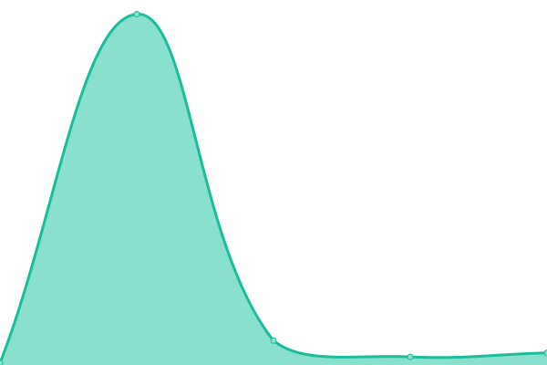

# [📈 Live Status](https://demo.upptime.js.org): <!--live status--> **🟧 Partial outage**

This repository contains the open-source uptime monitor and status page for [Patrick Little](Open.Canada.ca), powered by [Upptime](https://github.com/upptime/upptime).

With [Upptime](https://upptime.js.org), you can get your own unlimited and free uptime monitor and status page, powered entirely by a GitHub repository. We use [Issues](https://github.com/PatLittle/Consultations-Tracker/issues) as incident reports, [Actions](https://github.com/PatLittle/Consultations-Tracker/actions) as uptime monitors, and [Pages](https://demo.upptime.js.org) for the status page.

<!--start: status pages-->
<!-- This summary is generated by Upptime (https://github.com/upptime/upptime) -->
<!-- Do not edit this manually, your changes will be overwritten -->
<!-- prettier-ignore -->
| URL | Status | History | Response Time | Uptime |
| --- | ------ | ------- | ------------- | ------ |
|  [White River First Nations](https://www.rcaanc-cirnac.gc.ca/eng/1511969222951/1529103469169) | 🟩 Up | [white-river-first-nations.yml](https://github.com/PatLittle/Consultations-Tracker/commits/HEAD/history/white-river-first-nations.yml) | 

 1653ms
     
 | 

<a href="https://PatLittle.github.io/Consultations-Tracker/history/white-river-first-nations">100.00%</a>
    

|  [Administrative Monetary Penalty System Review](https://www.cbsa-asfc.gc.ca/trade-commerce/amps/menu-eng.html) | 🟩 Up | [administrative-monetary-penalty-system-review.yml](https://github.com/PatLittle/Consultations-Tracker/commits/HEAD/history/administrative-monetary-penalty-system-review.yml) | 

 219ms
     
 | 

<a href="https://PatLittle.github.io/Consultations-Tracker/history/administrative-monetary-penalty-system-review">100.00%</a>
    

|  [Potential regulatory amendments to the Valuation for Duty Regulations](https://www.cbsa-asfc.gc.ca/agency-agence/consult/consultations/2025-2-eng.html) | 🟩 Up | [potential-regulatory-amendments-to-the-valuation-for-duty-regulations.yml](https://github.com/PatLittle/Consultations-Tracker/commits/HEAD/history/potential-regulatory-amendments-to-the-valuation-for-duty-regulations.yml) | 

 54ms
     
 | 

<a href="https://PatLittle.github.io/Consultations-Tracker/history/potential-regulatory-amendments-to-the-valuation-for-duty-regulations">100.00%</a>
    

|  [Regulatory Framework Plan](https://can01.safelinks.protection.outlook.com/?url=https%3A%2F%2Fwww.cer-rec.gc.ca%2Fen%2Fabout%2Fhow-we-regulate%2Fplans-for-regulatory-framework%2F&data=05%7C02%7CMichelle.Shabits%40cer-rec.gc.ca%7Cec1c386ebea64452821d08dc41ebb1b9%7C56e9b8d38a3549abbdfc27de59608f01%7C0%7C0%7C638457728797041411%7CUnknown%7CTWFpbGZsb3d8eyJWIjoiMC4wLjAwMDAiLCJQIjoiV2luMzIiLCJBTiI6Ik1haWwiLCJXVCI6Mn0%3D%7C0%7C%7C%7C&sdata=tKxvqtPetzkvcXlETiyyf51rWnRpUftsM2o2U5IySO4%3D&reserved=0) | 🟩 Up | [regulatory-framework-plan.yml](https://github.com/PatLittle/Consultations-Tracker/commits/HEAD/history/regulatory-framework-plan.yml) | 

 970ms
     
 | 

<a href="https://PatLittle.github.io/Consultations-Tracker/history/regulatory-framework-plan">100.00%</a>
    

|  [Regulated Industry Engagement](https://www.cer-rec.gc.ca/en/consultation-engagement/stakeholder-engagement/regulated-industry-engagement/index.html) | 🟩 Up | [regulated-industry-engagement.yml](https://github.com/PatLittle/Consultations-Tracker/commits/HEAD/history/regulated-industry-engagement.yml) | 

 234ms
     
 | 

<a href="https://PatLittle.github.io/Consultations-Tracker/history/regulated-industry-engagement">100.00%</a>
    

|  [Draft Contractor Oversight Guidance](https://www.cerdialogue.ca/contractor-oversight-guidance) | 🟩 Up | [draft-contractor-oversight-guidance.yml](https://github.com/PatLittle/Consultations-Tracker/commits/HEAD/history/draft-contractor-oversight-guidance.yml) | 

 751ms
     
 | 

<a href="https://PatLittle.github.io/Consultations-Tracker/history/draft-contractor-oversight-guidance">100.00%</a>
    

|  [Consultation on Automatic tax filing](https://www.canada.ca/en/revenue-agency/corporate/about-canada-revenue-agency-cra/transparency-proactive-disclosure-canada-revenue-agency/consultations-engagement-canada-revenue-agency/automatic-tax-filing-consultation.html) | 🟩 Up | [consultation-on-automatic-tax-filing.yml](https://github.com/PatLittle/Consultations-Tracker/commits/HEAD/history/consultation-on-automatic-tax-filing.yml) | 

 1828ms
     
 | 

<a href="https://PatLittle.github.io/Consultations-Tracker/history/consultation-on-automatic-tax-filing">100.00%</a>
    

|  [Share your thoughts: Proposal to deregulate Phytophthora abietivora in Canada](Share your thoughtsProposal to deregulate Phytophthora abietivora in Canada - inspection.canada.ca) | 🟥 Down | [share-your-thoughts-proposal-to-deregulate-phytophthora-abietivora-in-canada.yml](https://github.com/PatLittle/Consultations-Tracker/commits/HEAD/history/share-your-thoughts-proposal-to-deregulate-phytophthora-abietivora-in-canada.yml) | 

 0ms
     
 | 

<a href="https://PatLittle.github.io/Consultations-Tracker/history/share-your-thoughts-proposal-to-deregulate-phytophthora-abietivora-in-canada">100.00%</a>
    

|  [Share your thoughts: Options for emerald ash borer management in Canada](https://inspection.canada.ca/en/about-cfia/transparency/consultations-and-engagement/risk-management-emerald-ash-borer) | 🟩 Up | [share-your-thoughts-options-for-emerald-ash-borer-management-in-canada.yml](https://github.com/PatLittle/Consultations-Tracker/commits/HEAD/history/share-your-thoughts-options-for-emerald-ash-borer-management-in-canada.yml) | 

 0ms
     
 | 

<a href="https://PatLittle.github.io/Consultations-Tracker/history/share-your-thoughts-options-for-emerald-ash-borer-management-in-canada">100.00%</a>
    

|  [Proposed amended livestock feed ingredient – Polymethylolcarbamide](https://inspection.canada.ca/en/about-cfia/transparency/consultations-and-engagement/polymethylolcarbamide) | 🟩 Up | [proposed-amended-livestock-feed-ingredient-polymethylolcarbamide.yml](https://github.com/PatLittle/Consultations-Tracker/commits/HEAD/history/proposed-amended-livestock-feed-ingredient-polymethylolcarbamide.yml) | 

 173ms
     
 | 

<a href="https://PatLittle.github.io/Consultations-Tracker/history/proposed-amended-livestock-feed-ingredient-polymethylolcarbamide">100.00%</a>
    

|  [Proposed amended livestock feed ingredient – L-Ascorbyl-2-polyphosphate](https://inspection.canada.ca/en/about-cfia/transparency/consultations-and-engagement/ascorbyl-2-polyphosphate) | 🟩 Up | [proposed-amended-livestock-feed-ingredient-l-ascorbyl-2-polyphosphate.yml](https://github.com/PatLittle/Consultations-Tracker/commits/HEAD/history/proposed-amended-livestock-feed-ingredient-l-ascorbyl-2-polyphosphate.yml) | 

 75ms
     
 | 

<a href="https://PatLittle.github.io/Consultations-Tracker/history/proposed-amended-livestock-feed-ingredient-l-ascorbyl-2-polyphosphate">100.00%</a>
    

|  [Proposed new livestock feed ingredient – Micro-algae fermentation oil](https://inspection.canada.ca/en/about-cfia/transparency/consultations-and-engagement/micro-algae-fermentation-oil) | 🟩 Up | [proposed-new-livestock-feed-ingredient-micro-algae-fermentation-oil.yml](https://github.com/PatLittle/Consultations-Tracker/commits/HEAD/history/proposed-new-livestock-feed-ingredient-micro-algae-fermentation-oil.yml) | 

 169ms
     
 | 

<a href="https://PatLittle.github.io/Consultations-Tracker/history/proposed-new-livestock-feed-ingredient-micro-algae-fermentation-oil">100.00%</a>
    

|  [Changing Narrative Fund](https://www.canada.ca/en/canadian-heritage/campaigns/changing-narratives-fund.html) | 🟩 Up | [changing-narrative-fund.yml](https://github.com/PatLittle/Consultations-Tracker/commits/HEAD/history/changing-narrative-fund.yml) | 

 1762ms
     
 | 

<a href="https://PatLittle.github.io/Consultations-Tracker/history/changing-narrative-fund">100.00%</a>
    

|  [2022-23 Consultations on renewal of the Museum Policy](https://www.canada.ca/en/canadian-heritage/campaigns/renewal-museum-policy.html) | 🟩 Up | [2022-23-consultations-on-renewal-of-the-museum-policy.yml](https://github.com/PatLittle/Consultations-Tracker/commits/HEAD/history/2022-23-consultations-on-renewal-of-the-museum-policy.yml) | 

 2263ms
     
 | 

<a href="https://PatLittle.github.io/Consultations-Tracker/history/2022-23-consultations-on-renewal-of-the-museum-policy">100.00%</a>
    

|  [REGDOC-3.2.2, Indigenous Engagement](https://www.cnsc-ccsn.gc.ca/eng/acts-and-regulations/regulatory-documents/history/regdoc3-2-2/) | 🟩 Up | [regdoc-3-2-2-indigenous-engagement.yml](https://github.com/PatLittle/Consultations-Tracker/commits/HEAD/history/regdoc-3-2-2-indigenous-engagement.yml) | 

 136ms
     
 | 

<a href="https://PatLittle.github.io/Consultations-Tracker/history/regdoc-3-2-2-indigenous-engagement">100.00%</a>
    

|  [REGDOC-2.13.2, Import and Export](https://www.cnsc-ccsn.gc.ca/eng/acts-and-regulations/regulatory-documents/history/regdoc2-13-2/) | 🟩 Up | [regdoc-2-13-2-import-and-export.yml](https://github.com/PatLittle/Consultations-Tracker/commits/HEAD/history/regdoc-2-13-2-import-and-export.yml) | 

 105ms
     
 | 

<a href="https://PatLittle.github.io/Consultations-Tracker/history/regdoc-2-13-2-import-and-export">100.00%</a>
    

|  [Co-development of a new Indigenous Broadcasting Policy](https://crtc.gc.ca/eng/archive/2019/2019-217.htm) | 🟥 Down | [co-development-of-a-new-indigenous-broadcasting-policy.yml](https://github.com/PatLittle/Consultations-Tracker/commits/HEAD/history/co-development-of-a-new-indigenous-broadcasting-policy.yml) | 

 0ms
     
 | 

<a href="https://PatLittle.github.io/Consultations-Tracker/history/co-development-of-a-new-indigenous-broadcasting-policy">100.00%</a>
    

|  [Share your thoughts about closed captioning of programming from online streaming services](https://crtc.gc.ca/eng/consultation/cc.htm) | 🟥 Down | [share-your-thoughts-about-closed-captioning-of-programming-from-online-streaming-services.yml](https://github.com/PatLittle/Consultations-Tracker/commits/HEAD/history/share-your-thoughts-about-closed-captioning-of-programming-from-online-streaming-services.yml) | 

 0ms
     
 | 

<a href="https://PatLittle.github.io/Consultations-Tracker/history/share-your-thoughts-about-closed-captioning-of-programming-from-online-streaming-services">100.00%</a>
    

|  [Consultation on the Application for Authorization of the Lac-Mégantic Rail Bypass Project](https://formulaires-forms.otc-cta.gc.ca/en/lac-megantic-bypass-railway-consultation) | 🟩 Up | [consultation-on-the-application-for-authorization-of-the-lac-megantic-rail-bypass-project.yml](https://github.com/PatLittle/Consultations-Tracker/commits/HEAD/history/consultation-on-the-application-for-authorization-of-the-lac-megantic-rail-bypass-project.yml) | 

 276ms
     
 | 

<a href="https://PatLittle.github.io/Consultations-Tracker/history/consultation-on-the-application-for-authorization-of-the-lac-megantic-rail-bypass-project">100.00%</a>
    

|  [Consultation on commercial market factors to be considered in determining fair and reasonable interswitching rates](https://otc-cta.gc.ca/eng/consultation/consultation-on-commercial-market-factors-to-be-considered-in-determining-fair-and-reasonable-interswitching-rates) | 🟩 Up | [consultation-on-commercial-market-factors-to-be-considered-in-determining-fair-and-reasonable-interswitching-rates.yml](https://github.com/PatLittle/Consultations-Tracker/commits/HEAD/history/consultation-on-commercial-market-factors-to-be-considered-in-determining-fair-and-reasonable-interswitching-rates.yml) | 

 0ms
     
 | 

<a href="https://PatLittle.github.io/Consultations-Tracker/history/consultation-on-commercial-market-factors-to-be-considered-in-determining-fair-and-reasonable-interswitching-rates">100.00%</a>
    

|  [National Infrastructure Assessment](https://www.infrastructure.gc.ca/nia-eni/index-eng.html) | 🟩 Up | [national-infrastructure-assessment.yml](https://github.com/PatLittle/Consultations-Tracker/commits/HEAD/history/national-infrastructure-assessment.yml) | 

 781ms
     
 | 

<a href="https://PatLittle.github.io/Consultations-Tracker/history/national-infrastructure-assessment">100.00%</a>
    

|  [National Capital (NCR) Residency for judges of the Federal Court and Tax Court of Canada](TBC) | 🟥 Down | [national-capital-ncr-residency-for-judges-of-the-federal-court-and-tax-court-of-canada.yml](https://github.com/PatLittle/Consultations-Tracker/commits/HEAD/history/national-capital-ncr-residency-for-judges-of-the-federal-court-and-tax-court-of-canada.yml) | 

 0ms
     
 | 

<a href="https://PatLittle.github.io/Consultations-Tracker/history/national-capital-ncr-residency-for-judges-of-the-federal-court-and-tax-court-of-canada">100.00%</a>
    

|  [Share your ideas: Blackwater Project](https://www.canada.ca/en/environment-climate-change/services/managing-pollution/sources-industry/mining/metal-diamond-mining-effluent-regulation/blackwater-consultation.html) | 🟥 Down | [share-your-ideas-blackwater-project.yml](https://github.com/PatLittle/Consultations-Tracker/commits/HEAD/history/share-your-ideas-blackwater-project.yml) | 

 2415ms
     
 | 

<a href="https://PatLittle.github.io/Consultations-Tracker/history/share-your-ideas-blackwater-project">100.00%</a>
    

|  [Consultation on Amending the List of Species under the Species at Risk Act: Terrestrial Species January 2025](https://canada.ca/en/environment-climate-change/services/species-risk-public-registry/consultation-documents/part-3-consultation-amending-terrestrial-species-list-sara-summary-jan-2025.html) | 🟩 Up | [consultation-on-amending-the-list-of-species-under-the-species-at-risk-act-terrestrial-species-january-2025.yml](https://github.com/PatLittle/Consultations-Tracker/commits/HEAD/history/consultation-on-amending-the-list-of-species-under-the-species-at-risk-act-terrestrial-species-january-2025.yml) | 

 2636ms
     
 | 

<a href="https://PatLittle.github.io/Consultations-Tracker/history/consultation-on-amending-the-list-of-species-under-the-species-at-risk-act-terrestrial-species-january-2025">100.00%</a>
    

|  [Share your views and ideas: Review of the Environmental Emergency Regulations, 2019](https://www.canada.ca/en/environment-climate-change/corporate/transparency/consultations/environmental-emergencies-regulations-consultation.html) | 🟩 Up | [share-your-views-and-ideas-review-of-the-environmental-emergency-regulations-2019.yml](https://github.com/PatLittle/Consultations-Tracker/commits/HEAD/history/share-your-views-and-ideas-review-of-the-environmental-emergency-regulations-2019.yml) | 

 1713ms
     
 | 

<a href="https://PatLittle.github.io/Consultations-Tracker/history/share-your-views-and-ideas-review-of-the-environmental-emergency-regulations-2019">100.00%</a>
    

|  [Evaluation by Environment and Climate Change Canada of the ongoing need for the Emergency Order for the Protection of the Western Chorus Frog (Longueuil)](https://www.canada.ca/en/environment-climate-change/services/species-risk-public-registry/consultation-documents/western-chorus-frog-longueuil-2025.html) | 🟩 Up | [evaluation-by-environment-and-climate-change-canada-of-the-ongoing-need-for-the-emergency-order-for-the-protection-of-the-western-chorus-frog-longueuil.yml](https://github.com/PatLittle/Consultations-Tracker/commits/HEAD/history/evaluation-by-environment-and-climate-change-canada-of-the-ongoing-need-for-the-emergency-order-for-the-protection-of-the-western-chorus-frog-longueuil.yml) | 

 1698ms
     
 | 

<a href="https://PatLittle.github.io/Consultations-Tracker/history/evaluation-by-environment-and-climate-change-canada-of-the-ongoing-need-for-the-emergency-order-for-the-protection-of-the-western-chorus-frog-longueuil">100.00%</a>
    

|  [Notice with respect to the availability of the proposed environmental occurrences notification agreements between Canada and Alberta, Canada and British Columbia, Canada and Manitoba, Canada and Ontario, Canada and Saskatchewan, and Canada and Yukon](https://www.canada.ca/en/environment-climate-change/services/canadian-environmental-protection-act-registry/agreements/occurrences-notification.html) | 🟩 Up | [notice-with-respect-to-the-availability-of-the-proposed-environmental-occurrences-notification-agreements-between-canada-and-alberta-canada-and-british-columbia-canada-and-manitoba-canada-and-ontario-canada-and-saskatchewan-and-canada-and-yukon.yml](https://github.com/PatLittle/Consultations-Tracker/commits/HEAD/history/notice-with-respect-to-the-availability-of-the-proposed-environmental-occurrences-notification-agreements-between-canada-and-alberta-canada-and-british-columbia-canada-and-manitoba-canada-and-ontario-canada-and-saskatchewan-and-canada-and-yukon.yml) | 

 2249ms
     
 | 

<a href="https://PatLittle.github.io/Consultations-Tracker/history/notice-with-respect-to-the-availability-of-the-proposed-environmental-occurrences-notification-agreements-between-canada-and-alberta-canada-and-british-columbia-canada-and-manitoba-canada-and-ontario-canada-and-saskatchewan-and-canada-and-yukon">100.00%</a>
    

|  [Draft Assessment for Manganese and its Compounds, and the Risk Management Scope](https://gazette.gc.ca/rp-pr/p1/2025/2025-10-25/html/notice-avis-eng.html#ne3) | 🟩 Up | [draft-assessment-for-manganese-and-its-compounds-and-the-risk-management-scope.yml](https://github.com/PatLittle/Consultations-Tracker/commits/HEAD/history/draft-assessment-for-manganese-and-its-compounds-and-the-risk-management-scope.yml) | 

 334ms
     
 | 

<a href="https://PatLittle.github.io/Consultations-Tracker/history/draft-assessment-for-manganese-and-its-compounds-and-the-risk-management-scope">100.00%</a>
    

|  [Notice with respect to the availability of the proposed environmental occurrences notification agreements between Canada and Alberta, Canada and British Columbia, Canada and Manitoba, Canada and Ontario, Canada and Saskatchewan, and Canada and Yukon](https://www.canada.ca/en/environment-climate-change/services/canadian-environmental-protection-act-registry/agreements/occurrences-notification.html) | 🟩 Up | [notice-with-respect-to-the-availability-of-the-proposed-environmental-occurrences-notification-agreements-between-canada-and-alberta-canada-and-british-columbia-canada-and-manitoba-canada-and-ontario-canada-and-saskatchewan-and-canada-and-yukon.yml](https://github.com/PatLittle/Consultations-Tracker/commits/HEAD/history/notice-with-respect-to-the-availability-of-the-proposed-environmental-occurrences-notification-agreements-between-canada-and-alberta-canada-and-british-columbia-canada-and-manitoba-canada-and-ontario-canada-and-saskatchewan-and-canada-and-yukon.yml) | 

 2249ms
     
 | 

<a href="https://PatLittle.github.io/Consultations-Tracker/history/notice-with-respect-to-the-availability-of-the-proposed-environmental-occurrences-notification-agreements-between-canada-and-alberta-canada-and-british-columbia-canada-and-manitoba-canada-and-ontario-canada-and-saskatchewan-and-canada-and-yukon">100.00%</a>
    

|  [Science approach document on the prioritization of chemicals in plastics](https://gazette.gc.ca/rp-pr/p1/2025/2025-12-06/html/notice-avis-eng.html#na2) | 🟩 Up | [science-approach-document-on-the-prioritization-of-chemicals-in-plastics.yml](https://github.com/PatLittle/Consultations-Tracker/commits/HEAD/history/science-approach-document-on-the-prioritization-of-chemicals-in-plastics.yml) | 

 0ms
     
 | 

<a href="https://PatLittle.github.io/Consultations-Tracker/history/science-approach-document-on-the-prioritization-of-chemicals-in-plastics">100.00%</a>
    

|  [Notice with respect to the availability of the proposed environmental occurrences notification agreements between Canada and Alberta, Canada and British Columbia, Canada and Manitoba, Canada and Ontario, Canada and Saskatchewan, and Canada and Yukon](https://www.canada.ca/en/environment-climate-change/services/canadian-environmental-protection-act-registry/agreements/occurrences-notification.html) | 🟩 Up | [notice-with-respect-to-the-availability-of-the-proposed-environmental-occurrences-notification-agreements-between-canada-and-alberta-canada-and-british-columbia-canada-and-manitoba-canada-and-ontario-canada-and-saskatchewan-and-canada-and-yukon.yml](https://github.com/PatLittle/Consultations-Tracker/commits/HEAD/history/notice-with-respect-to-the-availability-of-the-proposed-environmental-occurrences-notification-agreements-between-canada-and-alberta-canada-and-british-columbia-canada-and-manitoba-canada-and-ontario-canada-and-saskatchewan-and-canada-and-yukon.yml) | 

 2249ms
     
 | 

<a href="https://PatLittle.github.io/Consultations-Tracker/history/notice-with-respect-to-the-availability-of-the-proposed-environmental-occurrences-notification-agreements-between-canada-and-alberta-canada-and-british-columbia-canada-and-manitoba-canada-and-ontario-canada-and-saskatchewan-and-canada-and-yukon">100.00%</a>
    

|  [Targeted amendments to the Clean Fuel Regulations](https://www.canada.ca/en/environment-climate-change/corporate/transparency/consultations/share-view-ideas-targeted-amendments-clean-fuel-regulations.html) | 🟩 Up | [targeted-amendments-to-the-clean-fuel-regulations.yml](https://github.com/PatLittle/Consultations-Tracker/commits/HEAD/history/targeted-amendments-to-the-clean-fuel-regulations.yml) | 

 1682ms
     
 | 

<a href="https://PatLittle.github.io/Consultations-Tracker/history/targeted-amendments-to-the-clean-fuel-regulations">100.00%</a>
    

|  [Proposed Regulations Amending the Sulphur in Gasoline Regulations](https://gazette.gc.ca/rp-pr/p1/2025/2025-12-13/html/reg1-eng.html) | 🟩 Up | [proposed-regulations-amending-the-sulphur-in-gasoline-regulations.yml](https://github.com/PatLittle/Consultations-Tracker/commits/HEAD/history/proposed-regulations-amending-the-sulphur-in-gasoline-regulations.yml) | 

 0ms
     
 | 

<a href="https://PatLittle.github.io/Consultations-Tracker/history/proposed-regulations-amending-the-sulphur-in-gasoline-regulations">100.00%</a>
    

|  [Driving Effective Carbon Markets in Canada](https://www.canada.ca/en/environment-climate-change/corporate/transparency/consultations/comment-driving-effective-carbon-markets.html) | 🟩 Up | [driving-effective-carbon-markets-in-canada.yml](https://github.com/PatLittle/Consultations-Tracker/commits/HEAD/history/driving-effective-carbon-markets-in-canada.yml) | 

 0ms
     
 | 

<a href="https://PatLittle.github.io/Consultations-Tracker/history/driving-effective-carbon-markets-in-canada">100.00%</a>
    

|  [Proposed Regulations Amending the Single-use Plastics Prohibition Regulations](https://www.canada.ca/en/environment-climate-change/corporate/transparency/consultations/proposed-amendments-single-use-plastics-prohibition-regulations.html) | 🟩 Up | [proposed-regulations-amending-the-single-use-plastics-prohibition-regulations.yml](https://github.com/PatLittle/Consultations-Tracker/commits/HEAD/history/proposed-regulations-amending-the-single-use-plastics-prohibition-regulations.yml) | 

 2368ms
     
 | 

<a href="https://PatLittle.github.io/Consultations-Tracker/history/proposed-regulations-amending-the-single-use-plastics-prohibition-regulations">100.00%</a>
    

|  [Engagement on renewing Canada’s National Financial Literacy Strategy](https://www.canada.ca/en/financial-consumer-agency/corporate/transparency/consultations/engagement-renewing-national-financial-literacy-strategy.html) | 🟩 Up | [engagement-on-renewing-canada-s-national-financial-literacy-strategy.yml](https://github.com/PatLittle/Consultations-Tracker/commits/HEAD/history/engagement-on-renewing-canada-s-national-financial-literacy-strategy.yml) | 

 1842ms
     
 | 

<a href="https://PatLittle.github.io/Consultations-Tracker/history/engagement-on-renewing-canada-s-national-financial-literacy-strategy">100.00%</a>
    

|  [Let's talk Pacific Salmon](https://letstalkpacificsalmon.ca/) | 🟩 Up | [let-s-talk-pacific-salmon.yml](https://github.com/PatLittle/Consultations-Tracker/commits/HEAD/history/let-s-talk-pacific-salmon.yml) | 

 1187ms
     
 | 

<a href="https://PatLittle.github.io/Consultations-Tracker/history/let-s-talk-pacific-salmon">100.00%</a>
    

|  [Proposed ticketing for the enforcement of a fisheries offence under the Fisheries Act](TBD) | 🟥 Down | [proposed-ticketing-for-the-enforcement-of-a-fisheries-offence-under-the-fisheries-act.yml](https://github.com/PatLittle/Consultations-Tracker/commits/HEAD/history/proposed-ticketing-for-the-enforcement-of-a-fisheries-offence-under-the-fisheries-act.yml) | 

 0ms
     
 | 

<a href="https://PatLittle.github.io/Consultations-Tracker/history/proposed-ticketing-for-the-enforcement-of-a-fisheries-offence-under-the-fisheries-act">100.00%</a>
    

|  [Whitby Harbour Remediation Project](https://www.dfo-mpo.gc.ca/sch-ppb/whitby/index-eng.html) | 🟩 Up | [whitby-harbour-remediation-project.yml](https://github.com/PatLittle/Consultations-Tracker/commits/HEAD/history/whitby-harbour-remediation-project.yml) | 

 348ms
     
 | 

<a href="https://PatLittle.github.io/Consultations-Tracker/history/whitby-harbour-remediation-project">100.00%</a>
    

|  [Recovery Strategy for the Mountain Sucker (Catostomus platyrhynchus), Milk River populations, in Canada](https://species-registry.canada.ca/index-en.html#/documents/7LZ1syQXItFTRlqBFnKfT) | 🟥 Down | [recovery-strategy-for-the-mountain-sucker-catostomus-platyrhynchus-milk-river-populations-in-canada.yml](https://github.com/PatLittle/Consultations-Tracker/commits/HEAD/history/recovery-strategy-for-the-mountain-sucker-catostomus-platyrhynchus-milk-river-populations-in-canada.yml) | 

 0ms
     
 | 

<a href="https://PatLittle.github.io/Consultations-Tracker/history/recovery-strategy-for-the-mountain-sucker-catostomus-platyrhynchus-milk-river-populations-in-canada">100.00%</a>
    

|  [Management plan for the Channel Darter (St.Lawrence population)](https://species-registry.canada.ca/index-en.html#/documents/c1lK6z18p1C9z3ePBMQ8f) | 🟥 Down | [management-plan-for-the-channel-darter-st-lawrence-population.yml](https://github.com/PatLittle/Consultations-Tracker/commits/HEAD/history/management-plan-for-the-channel-darter-st-lawrence-population.yml) | 

 40ms
     
 | 

<a href="https://PatLittle.github.io/Consultations-Tracker/history/management-plan-for-the-channel-darter-st-lawrence-population">100.00%</a>
    

|  [Public engagement on management measures in the Newfoundland and Labrador (NL) Recreational Groundfish Fishery](https://www.dfo-mpo.gc.ca/about-notre-sujet/engagement/2025/recreational-groundfish-fishery-peche-recreative-poisson-fond-eng.html) | 🟩 Up | [public-engagement-on-management-measures-in-the-newfoundland-and-labrador-nl-recreational-groundfish-fishery.yml](https://github.com/PatLittle/Consultations-Tracker/commits/HEAD/history/public-engagement-on-management-measures-in-the-newfoundland-and-labrador-nl-recreational-groundfish-fishery.yml) | 

 0ms
     
 | 

<a href="https://PatLittle.github.io/Consultations-Tracker/history/public-engagement-on-management-measures-in-the-newfoundland-and-labrador-nl-recreational-groundfish-fishery">100.00%</a>
    

|  [Stakeholder engagement on potential marine conservation areas in Newfoundland and Labrador Region](https://www.dfo-mpo.gc.ca/oceans/conservation/plan/index-eng.html) | 🟩 Up | [stakeholder-engagement-on-potential-marine-conservation-areas-in-newfoundland-and-labrador-region.yml](https://github.com/PatLittle/Consultations-Tracker/commits/HEAD/history/stakeholder-engagement-on-potential-marine-conservation-areas-in-newfoundland-and-labrador-region.yml) | 

 0ms
     
 | 

<a href="https://PatLittle.github.io/Consultations-Tracker/history/stakeholder-engagement-on-potential-marine-conservation-areas-in-newfoundland-and-labrador-region">100.00%</a>
    

|  [Fish and Fish Habitat Restoration Priorities for Lake Ontario](https://www.talkfishhabitat.ca/wave-2/news_feed/announcing-ffhpp-framework-to-identify-fish-habitat-restoration-priorities) | 🟩 Up | [fish-and-fish-habitat-restoration-priorities-for-lake-ontario.yml](https://github.com/PatLittle/Consultations-Tracker/commits/HEAD/history/fish-and-fish-habitat-restoration-priorities-for-lake-ontario.yml) | 

 627ms
     
 | 

<a href="https://PatLittle.github.io/Consultations-Tracker/history/fish-and-fish-habitat-restoration-priorities-for-lake-ontario">100.00%</a>
    

|  [Fish and Fish Habitat Restoration Priorities for Manitoba Phase 2](https://www.talkfishhabitat.ca/wave-2/news_feed/announcing-ffhpp-framework-to-identify-fish-habitat-restoration-priorities) | 🟩 Up | [fish-and-fish-habitat-restoration-priorities-for-manitoba-phase-2.yml](https://github.com/PatLittle/Consultations-Tracker/commits/HEAD/history/fish-and-fish-habitat-restoration-priorities-for-manitoba-phase-2.yml) | 

 379ms
     
 | 

<a href="https://PatLittle.github.io/Consultations-Tracker/history/fish-and-fish-habitat-restoration-priorities-for-manitoba-phase-2">100.00%</a>
    

|  [Proposed Amendments to the Export Permits Regulations](https://webarchiveweb.wayback.bac-lac.canada.ca/1/https://www.international.gc.ca/trade-commerce/controls-controles/expor/backgrounder-amendments-epr-information-modification-rle.aspx?lang=eng) | 🟩 Up | [proposed-amendments-to-the-export-permits-regulations.yml](https://github.com/PatLittle/Consultations-Tracker/commits/HEAD/history/proposed-amendments-to-the-export-permits-regulations.yml) | 

 679ms
     
 | 

<a href="https://PatLittle.github.io/Consultations-Tracker/history/proposed-amendments-to-the-export-permits-regulations">100.00%</a>
    

|  [Consulting Canadians on a potential free trade agreement with the United Arab Emirates](https://international.canada.ca/en/global-affairs/consultations/trade/2025-12-03-united-arab-emirates) | 🟩 Up | [consulting-canadians-on-a-potential-free-trade-agreement-with-the-united-arab-emirates.yml](https://github.com/PatLittle/Consultations-Tracker/commits/HEAD/history/consulting-canadians-on-a-potential-free-trade-agreement-with-the-united-arab-emirates.yml) | 

 387ms
     
 | 

<a href="https://PatLittle.github.io/Consultations-Tracker/history/consulting-canadians-on-a-potential-free-trade-agreement-with-the-united-arab-emirates">100.00%</a>
    

|  [Consulting Canadians on a potential Comprehensive Economic Partnership Agreement with India](https://international.canada.ca/en/global-affairs/consultations/trade/2025-12-15-india) | 🟩 Up | [consulting-canadians-on-a-potential-comprehensive-economic-partnership-agreement-with-india.yml](https://github.com/PatLittle/Consultations-Tracker/commits/HEAD/history/consulting-canadians-on-a-potential-comprehensive-economic-partnership-agreement-with-india.yml) | 

 125ms
     
 | 

<a href="https://PatLittle.github.io/Consultations-Tracker/history/consulting-canadians-on-a-potential-comprehensive-economic-partnership-agreement-with-india">100.00%</a>
    

|  [Share your views: Consulting Canadians on a potential Canada-Thailand Free Trade Agreement](https://international.canada.ca/en/global-affairs/consultations/trade/2025-12-10-thailand) | 🟩 Up | [share-your-views-consulting-canadians-on-a-potential-canada-thailand-free-trade-agreement.yml](https://github.com/PatLittle/Consultations-Tracker/commits/HEAD/history/share-your-views-consulting-canadians-on-a-potential-canada-thailand-free-trade-agreement.yml) | 

 127ms
     
 | 

<a href="https://PatLittle.github.io/Consultations-Tracker/history/share-your-views-consulting-canadians-on-a-potential-canada-thailand-free-trade-agreement">100.00%</a>
    

|  [Share your views: Consulting Canadians on a potential free trade agreement with Mercosur](https://international.canada.ca/en/global-affairs/consultations/trade/2025-12-02-mercosur) | 🟩 Up | [share-your-views-consulting-canadians-on-a-potential-free-trade-agreement-with-mercosur.yml](https://github.com/PatLittle/Consultations-Tracker/commits/HEAD/history/share-your-views-consulting-canadians-on-a-potential-free-trade-agreement-with-mercosur.yml) | 

 127ms
     
 | 

<a href="https://PatLittle.github.io/Consultations-Tracker/history/share-your-views-consulting-canadians-on-a-potential-free-trade-agreement-with-mercosur">100.00%</a>
    

|  [Release of draft (step 2) ICH Guideline Q3E: Impurities: Guideline for Extractables and Leachables](https://www.canada.ca/en/health-canada/services/drugs-health-products/drug-products/applications-submissions/guidance-documents/international-council-harmonisation/consultations-notices.html) | 🟩 Up | [release-of-draft-step-2-ich-guideline-q3-e-impurities-guideline-for-extractables-and-leachables.yml](https://github.com/PatLittle/Consultations-Tracker/commits/HEAD/history/release-of-draft-step-2-ich-guideline-q3-e-impurities-guideline-for-extractables-and-leachables.yml) | 

 2734ms
     
 | 

<a href="https://PatLittle.github.io/Consultations-Tracker/history/release-of-draft-step-2-ich-guideline-q3-e-impurities-guideline-for-extractables-and-leachables">100.00%</a>
    

|  [Consultation on DEET plus related active toluamides and its associated end-use products, Proposed Re-evaluation Decision PRVD2025-09](https://www.canada.ca/en/health-canada/services/consumer-product-safety/pesticides-pest-management/public/consultations/proposed-re-evaluation-decisions/2025/deet-plus-related-active-toluamides.html) | 🟩 Up | [consultation-on-deet-plus-related-active-toluamides-and-its-associated-end-use-products-proposed-re-evaluation-decision-prvd-2025-09.yml](https://github.com/PatLittle/Consultations-Tracker/commits/HEAD/history/consultation-on-deet-plus-related-active-toluamides-and-its-associated-end-use-products-proposed-re-evaluation-decision-prvd-2025-09.yml) | 

 2176ms
     
 | 

<a href="https://PatLittle.github.io/Consultations-Tracker/history/consultation-on-deet-plus-related-active-toluamides-and-its-associated-end-use-products-proposed-re-evaluation-decision-prvd-2025-09">100.00%</a>
    

|  [Consultation on iodosulfuron-methyl-sodium and its associated end-use product, Proposed Re-evaluation Decision PRVD2025-10](https://www.canada.ca/en/health-canada/services/consumer-product-safety/pesticides-pest-management/public/consultations/proposed-re-evaluation-decisions/2025/iodosulfuron-methyl-sodium.html) | 🟩 Up | [consultation-on-iodosulfuron-methyl-sodium-and-its-associated-end-use-product-proposed-re-evaluation-decision-prvd-2025-10.yml](https://github.com/PatLittle/Consultations-Tracker/commits/HEAD/history/consultation-on-iodosulfuron-methyl-sodium-and-its-associated-end-use-product-proposed-re-evaluation-decision-prvd-2025-10.yml) | 

 1345ms
     
 | 

<a href="https://PatLittle.github.io/Consultations-Tracker/history/consultation-on-iodosulfuron-methyl-sodium-and-its-associated-end-use-product-proposed-re-evaluation-decision-prvd-2025-10">100.00%</a>
    

|  [Canada Gazette, Part I, Volume 159, Number 45: Regulations Amending the Medical Devices Regulations (Establishment Licences)](https://gazette.gc.ca/rp-pr/p1/2025/2025-11-08/html/reg1-eng.html) | 🟩 Up | [canada-gazette-part-i-volume-159-number-45-regulations-amending-the-medical-devices-regulations-establishment-licences.yml](https://github.com/PatLittle/Consultations-Tracker/commits/HEAD/history/canada-gazette-part-i-volume-159-number-45-regulations-amending-the-medical-devices-regulations-establishment-licences.yml) | 

 785ms
     
 | 

<a href="https://PatLittle.github.io/Consultations-Tracker/history/canada-gazette-part-i-volume-159-number-45-regulations-amending-the-medical-devices-regulations-establishment-licences">100.00%</a>
    

|  [Consultation on ethiprole, Proposed Maximum Residue Limit PMRL2025-23](https://www.canada.ca/en/health-canada/services/consumer-product-safety/pesticides-pest-management/public/consultations/proposed-maximum-residue-limit/2025/ethiprole.html) | 🟩 Up | [consultation-on-ethiprole-proposed-maximum-residue-limit-pmrl-2025-23.yml](https://github.com/PatLittle/Consultations-Tracker/commits/HEAD/history/consultation-on-ethiprole-proposed-maximum-residue-limit-pmrl-2025-23.yml) | 

 1413ms
     
 | 

<a href="https://PatLittle.github.io/Consultations-Tracker/history/consultation-on-ethiprole-proposed-maximum-residue-limit-pmrl-2025-23">100.00%</a>
    

|  [Consultation on quizalofop-ethyl, Proposed Maximum Residue Limit PMRL2025-24](https://www.canada.ca/en/health-canada/services/consumer-product-safety/pesticides-pest-management/public/consultations/proposed-maximum-residue-limit/2025/quizalofop-ethyl.html) | 🟩 Up | [consultation-on-quizalofop-ethyl-proposed-maximum-residue-limit-pmrl-2025-24.yml](https://github.com/PatLittle/Consultations-Tracker/commits/HEAD/history/consultation-on-quizalofop-ethyl-proposed-maximum-residue-limit-pmrl-2025-24.yml) | 

 1849ms
     
 | 

<a href="https://PatLittle.github.io/Consultations-Tracker/history/consultation-on-quizalofop-ethyl-proposed-maximum-residue-limit-pmrl-2025-24">100.00%</a>
    

|  [Consultation for pyrethrins, Proposed Maximum Residue Limit PMRL2025-25](https://www.canada.ca/en/health-canada/services/consumer-product-safety/pesticides-pest-management/public/consultations/proposed-maximum-residue-limit/2025/pyrethrins.html) | 🟩 Up | [consultation-for-pyrethrins-proposed-maximum-residue-limit-pmrl-2025-25.yml](https://github.com/PatLittle/Consultations-Tracker/commits/HEAD/history/consultation-for-pyrethrins-proposed-maximum-residue-limit-pmrl-2025-25.yml) | 

 2146ms
     
 | 

<a href="https://PatLittle.github.io/Consultations-Tracker/history/consultation-for-pyrethrins-proposed-maximum-residue-limit-pmrl-2025-25">100.00%</a>
    

|  [Consultation on penthiopyrad, Proposed Maximum Residue Limit PMRL2025-26](https://www.canada.ca/en/health-canada/services/consumer-product-safety/pesticides-pest-management/public/consultations/proposed-maximum-residue-limit/2025/penthiopyrad.html) | 🟩 Up | [consultation-on-penthiopyrad-proposed-maximum-residue-limit-pmrl-2025-26.yml](https://github.com/PatLittle/Consultations-Tracker/commits/HEAD/history/consultation-on-penthiopyrad-proposed-maximum-residue-limit-pmrl-2025-26.yml) | 

 3148ms
     
 | 

<a href="https://PatLittle.github.io/Consultations-Tracker/history/consultation-on-penthiopyrad-proposed-maximum-residue-limit-pmrl-2025-26">100.00%</a>
    

|  [Consultation on spidoxamat, Proposed Maximum Residue Limit PMRL2025-27](https://www.canada.ca/en/health-canada/services/consumer-product-safety/pesticides-pest-management/public/consultations/proposed-maximum-residue-limit/2025/spidoxamat.html) | 🟩 Up | [consultation-on-spidoxamat-proposed-maximum-residue-limit-pmrl-2025-27.yml](https://github.com/PatLittle/Consultations-Tracker/commits/HEAD/history/consultation-on-spidoxamat-proposed-maximum-residue-limit-pmrl-2025-27.yml) | 

 2713ms
     
 | 

<a href="https://PatLittle.github.io/Consultations-Tracker/history/consultation-on-spidoxamat-proposed-maximum-residue-limit-pmrl-2025-27">100.00%</a>
    

|  [Consultation on proposed updates to the Cosmetic Ingredient Hotlist: Prohibited and restricted ingredients](https://www.canada.ca/en/health-canada/programs/consultation-proposed-updates-cosmetic-ingredients-hotlist.html) | 🟩 Up | [consultation-on-proposed-updates-to-the-cosmetic-ingredient-hotlist-prohibited-and-restricted-ingredients.yml](https://github.com/PatLittle/Consultations-Tracker/commits/HEAD/history/consultation-on-proposed-updates-to-the-cosmetic-ingredient-hotlist-prohibited-and-restricted-ingredients.yml) | 

 1817ms
     
 | 

<a href="https://PatLittle.github.io/Consultations-Tracker/history/consultation-on-proposed-updates-to-the-cosmetic-ingredient-hotlist-prohibited-and-restricted-ingredients">100.00%</a>
    

|  [Proposal to modify the List of Permitted Food Enzymes to authorize the use of exo-inulinase](https://www.canada.ca/en/health-canada/services/food-nutrition/legislation-guidelines/acts-regulations/notices-proposal-notices-modification/permitted-food-enzymes-authorize-exo-inulinase.html) | 🟩 Up | [proposal-to-modify-the-list-of-permitted-food-enzymes-to-authorize-the-use-of-exo-inulinase.yml](https://github.com/PatLittle/Consultations-Tracker/commits/HEAD/history/proposal-to-modify-the-list-of-permitted-food-enzymes-to-authorize-the-use-of-exo-inulinase.yml) | 

 1831ms
     
 | 

<a href="https://PatLittle.github.io/Consultations-Tracker/history/proposal-to-modify-the-list-of-permitted-food-enzymes-to-authorize-the-use-of-exo-inulinase">100.00%</a>
    

|  [Consultation: Comment period for the danger to human health or safety assessment for products containing button or coin batteries and the packaging of button and coin batteries](https://www.canada.ca/en/services/health/consultations/consultation-comment-period-danger-human-health-safety-assessment-products-containing-button-coin-batteries-packaging.html) | 🟩 Up | [consultation-comment-period-for-the-danger-to-human-health-or-safety-assessment-for-products-containing-button-or-coin-batteries-and-the-packaging-of-button-and-coin-batteries.yml](https://github.com/PatLittle/Consultations-Tracker/commits/HEAD/history/consultation-comment-period-for-the-danger-to-human-health-or-safety-assessment-for-products-containing-button-or-coin-batteries-and-the-packaging-of-button-and-coin-batteries.yml) | 

 2154ms
     
 | 

<a href="https://PatLittle.github.io/Consultations-Tracker/history/consultation-comment-period-for-the-danger-to-human-health-or-safety-assessment-for-products-containing-button-or-coin-batteries-and-the-packaging-of-button-and-coin-batteries">100.00%</a>
    

|  [Consultation: Proposed risk-based approach for the authorization of infant food for a special dietary purpose](https://www.canada.ca/en/health-canada/programs/consultation-proposed-risk-based-approach-authorization-infant-food-special-dietary-purpose.html) | 🟩 Up | [consultation-proposed-risk-based-approach-for-the-authorization-of-infant-food-for-a-special-dietary-purpose.yml](https://github.com/PatLittle/Consultations-Tracker/commits/HEAD/history/consultation-proposed-risk-based-approach-for-the-authorization-of-infant-food-for-a-special-dietary-purpose.yml) | 

 1827ms
     
 | 

<a href="https://PatLittle.github.io/Consultations-Tracker/history/consultation-proposed-risk-based-approach-for-the-authorization-of-infant-food-for-a-special-dietary-purpose">100.00%</a>
    

|  [Consultation: Proposed new requirements for lithium-ion batteries and consumer products containing lithium-ion batteries under the Canada Consumer Product Safety Act](https://www.canada.ca/en/health-canada/programs/consultation-proposed-new-requirements-containing-lithium-ion-batteries-canada-consumer-product-safety-act.html) | 🟩 Up | [consultation-proposed-new-requirements-for-lithium-ion-batteries-and-consumer-products-containing-lithium-ion-batteries-under-the-canada-consumer-product-safety-act.yml](https://github.com/PatLittle/Consultations-Tracker/commits/HEAD/history/consultation-proposed-new-requirements-for-lithium-ion-batteries-and-consumer-products-containing-lithium-ion-batteries-under-the-canada-consumer-product-safety-act.yml) | 

 2409ms
     
 | 

<a href="https://PatLittle.github.io/Consultations-Tracker/history/consultation-proposed-new-requirements-for-lithium-ion-batteries-and-consumer-products-containing-lithium-ion-batteries-under-the-canada-consumer-product-safety-act">100.00%</a>
    

|  [Consultation on 2-phenethyl propionate, nuranone, geraniol, eugenol, and Japanese Beetle Trap Refill, Proposed Registration Decision PRD2025-14](https://www.canada.ca/en/health-canada/services/consumer-product-safety/pesticides-pest-management/public/consultations/proposed-registration-decisions/2025/2-phenethyl-propionate-nuranone-geraniol-eugenol-japanese-beetle-trap-refill.html) | 🟩 Up | [consultation-on-2-phenethyl-propionate-nuranone-geraniol-eugenol-and-japanese-beetle-trap-refill-proposed-registration-decision-prd-2025-14.yml](https://github.com/PatLittle/Consultations-Tracker/commits/HEAD/history/consultation-on-2-phenethyl-propionate-nuranone-geraniol-eugenol-and-japanese-beetle-trap-refill-proposed-registration-decision-prd-2025-14.yml) | 

 2138ms
     
 | 

<a href="https://PatLittle.github.io/Consultations-Tracker/history/consultation-on-2-phenethyl-propionate-nuranone-geraniol-eugenol-and-japanese-beetle-trap-refill-proposed-registration-decision-prd-2025-14">100.00%</a>
    

|  [Consultation on formic acid and FENNOSURF 600-C, Proposed Registration Decision PRD2025-16](https://www.canada.ca/en/health-canada/services/consumer-product-safety/pesticides-pest-management/public/consultations/proposed-registration-decisions/2025/formic-acid-fennosurf-600-c.html) | 🟩 Up | [consultation-on-formic-acid-and-fennosurf-600-c-proposed-registration-decision-prd-2025-16.yml](https://github.com/PatLittle/Consultations-Tracker/commits/HEAD/history/consultation-on-formic-acid-and-fennosurf-600-c-proposed-registration-decision-prd-2025-16.yml) | 

 2565ms
     
 | 

<a href="https://PatLittle.github.io/Consultations-Tracker/history/consultation-on-formic-acid-and-fennosurf-600-c-proposed-registration-decision-prd-2025-16">100.00%</a>
    

|  [Consultation on Nealta Miticide, containing cyflumetofen, Proposed Registration Decision PRD2025-17](https://www.canada.ca/en/health-canada/services/consumer-product-safety/pesticides-pest-management/public/consultations/proposed-registration-decisions/2025/nealta-miticide-containing-cyflumetofen.html) | 🟩 Up | [consultation-on-nealta-miticide-containing-cyflumetofen-proposed-registration-decision-prd-2025-17.yml](https://github.com/PatLittle/Consultations-Tracker/commits/HEAD/history/consultation-on-nealta-miticide-containing-cyflumetofen-proposed-registration-decision-prd-2025-17.yml) | 

 2738ms
     
 | 

<a href="https://PatLittle.github.io/Consultations-Tracker/history/consultation-on-nealta-miticide-containing-cyflumetofen-proposed-registration-decision-prd-2025-17">100.00%</a>
    

|  [Proposal to modify the List of Permitted Preservatives to authorize the use of rosemary extract](https://www.canada.ca/en/health-canada/services/food-nutrition/legislation-guidelines/acts-regulations/notices-proposal-notices-modification/list-permitted-preservatives-authorize-use-rosemary-extract.html) | 🟩 Up | [proposal-to-modify-the-list-of-permitted-preservatives-to-authorize-the-use-of-rosemary-extract.yml](https://github.com/PatLittle/Consultations-Tracker/commits/HEAD/history/proposal-to-modify-the-list-of-permitted-preservatives-to-authorize-the-use-of-rosemary-extract.yml) | 

 2140ms
     
 | 

<a href="https://PatLittle.github.io/Consultations-Tracker/history/proposal-to-modify-the-list-of-permitted-preservatives-to-authorize-the-use-of-rosemary-extract">100.00%</a>
    

|  [Consultation: Draft guidance on human and veterinary drug submissions based on promising evidence and terms and conditions](https://www.canada.ca/en/health-canada/programs/consultation-draft-guidance-human-veterinary-drug-submissions-based-promising-evidence-terms-conditions.html) | 🟩 Up | [consultation-draft-guidance-on-human-and-veterinary-drug-submissions-based-on-promising-evidence-and-terms-and-conditions.yml](https://github.com/PatLittle/Consultations-Tracker/commits/HEAD/history/consultation-draft-guidance-on-human-and-veterinary-drug-submissions-based-on-promising-evidence-and-terms-and-conditions.yml) | 

 1845ms
     
 | 

<a href="https://PatLittle.github.io/Consultations-Tracker/history/consultation-draft-guidance-on-human-and-veterinary-drug-submissions-based-on-promising-evidence-and-terms-and-conditions">100.00%</a>
    

|  [Consultation: Draft guidance on terms and conditions for human and veterinary drugs](https://www.canada.ca/en/health-canada/programs/consultation-draft-guidance-terms-conditions-human-veterinary-drugs.html) | 🟩 Up | [consultation-draft-guidance-on-terms-and-conditions-for-human-and-veterinary-drugs.yml](https://github.com/PatLittle/Consultations-Tracker/commits/HEAD/history/consultation-draft-guidance-on-terms-and-conditions-for-human-and-veterinary-drugs.yml) | 

 1843ms
     
 | 

<a href="https://PatLittle.github.io/Consultations-Tracker/history/consultation-draft-guidance-on-terms-and-conditions-for-human-and-veterinary-drugs">100.00%</a>
    

|  [Consultation on benzoic acid and Microban Additive GS, Proposed Registration Decision PRD2025-18](https://www.canada.ca/en/health-canada/services/consumer-product-safety/pesticides-pest-management/public/consultations/proposed-registration-decisions/2025/benzoic-acid-microban-additive-gs.html) | 🟩 Up | [consultation-on-benzoic-acid-and-microban-additive-gs-proposed-registration-decision-prd-2025-18.yml](https://github.com/PatLittle/Consultations-Tracker/commits/HEAD/history/consultation-on-benzoic-acid-and-microban-additive-gs-proposed-registration-decision-prd-2025-18.yml) | 

 2130ms
     
 | 

<a href="https://PatLittle.github.io/Consultations-Tracker/history/consultation-on-benzoic-acid-and-microban-additive-gs-proposed-registration-decision-prd-2025-18">100.00%</a>
    

|  [Consultation: Modernizing the framework for clinical trials](https://www.canada.ca/en/health-canada/programs/consultation-modernizing-framework-clinical-trials.html) | 🟩 Up | [consultation-modernizing-the-framework-for-clinical-trials.yml](https://github.com/PatLittle/Consultations-Tracker/commits/HEAD/history/consultation-modernizing-the-framework-for-clinical-trials.yml) | 

 2438ms
     
 | 

<a href="https://PatLittle.github.io/Consultations-Tracker/history/consultation-modernizing-the-framework-for-clinical-trials">100.00%</a>
    

|  [Canada Gazette, Part I, Volume 159, Number 51: Order Providing for Reliance on Decisions of, or Documents Produced by, Foreign Regulatory Authorities in Respect of Certain Drugs](https://gazette.gc.ca/rp-pr/p1/2025/2025-12-20/html/reg4-eng.html) | 🟩 Up | [canada-gazette-part-i-volume-159-number-51-order-providing-for-reliance-on-decisions-of-or-documents-produced-by-foreign-regulatory-authorities-in-respect-of-certain-drugs.yml](https://github.com/PatLittle/Consultations-Tracker/commits/HEAD/history/canada-gazette-part-i-volume-159-number-51-order-providing-for-reliance-on-decisions-of-or-documents-produced-by-foreign-regulatory-authorities-in-respect-of-certain-drugs.yml) | 

 0ms
     
 | 

<a href="https://PatLittle.github.io/Consultations-Tracker/history/canada-gazette-part-i-volume-159-number-51-order-providing-for-reliance-on-decisions-of-or-documents-produced-by-foreign-regulatory-authorities-in-respect-of-certain-drugs">100.00%</a>
    

|  [Consultation: Removal of reconsideration process from requests for priority review and advance consideration for Notice of Compliance with conditions](https://www.canada.ca/en/health-canada/programs/consultation-removal-reconsideration-process-requests-priority-review-advance-consideration-notice-compliance-conditions.html) | 🟩 Up | [consultation-removal-of-reconsideration-process-from-requests-for-priority-review-and-advance-consideration-for-notice-of-compliance-with-conditions.yml](https://github.com/PatLittle/Consultations-Tracker/commits/HEAD/history/consultation-removal-of-reconsideration-process-from-requests-for-priority-review-and-advance-consideration-for-notice-of-compliance-with-conditions.yml) | 

 2547ms
     
 | 

<a href="https://PatLittle.github.io/Consultations-Tracker/history/consultation-removal-of-reconsideration-process-from-requests-for-priority-review-and-advance-consideration-for-notice-of-compliance-with-conditions">100.00%</a>
    

|  [Consultation: Draft guidance on decentralized clinical trials](https://www.canada.ca/en/health-canada/programs/consultation-draft-guidance-decentralized-clinical-trials.html) | 🟩 Up | [consultation-draft-guidance-on-decentralized-clinical-trials.yml](https://github.com/PatLittle/Consultations-Tracker/commits/HEAD/history/consultation-draft-guidance-on-decentralized-clinical-trials.yml) | 

 2752ms
     
 | 

<a href="https://PatLittle.github.io/Consultations-Tracker/history/consultation-draft-guidance-on-decentralized-clinical-trials">100.00%</a>
    

|  [Regulations Amending the Immigration and Refugee Protection Regulations (Temporary Foreign Workers)](https://gazette.gc.ca/rp-pr/p1/2021/2021-07-10/html/reg2-eng.html) | 🟩 Up | [regulations-amending-the-immigration-and-refugee-protection-regulations-temporary-foreign-workers.yml](https://github.com/PatLittle/Consultations-Tracker/commits/HEAD/history/regulations-amending-the-immigration-and-refugee-protection-regulations-temporary-foreign-workers.yml) | 

 197ms
     
 | 

<a href="https://PatLittle.github.io/Consultations-Tracker/history/regulations-amending-the-immigration-and-refugee-protection-regulations-temporary-foreign-workers">100.00%</a>
    

|  [Indian Oil and Gas Regulations - Phase II](http://www.pgic-iogc.gc.ca/eng/1471964522302/1471964567990) | 🟩 Up | [indian-oil-and-gas-regulations-phase-ii.yml](https://github.com/PatLittle/Consultations-Tracker/commits/HEAD/history/indian-oil-and-gas-regulations-phase-ii.yml) | 

 746ms
     
 | 

<a href="https://PatLittle.github.io/Consultations-Tracker/history/indian-oil-and-gas-regulations-phase-ii">100.00%</a>
    

|  [Indigenous Procurement Modernization (including Procurement Strategy for Aboriginal Business)](https://www.aadnc-aandc.gc.ca/eng/1554218527634/1554218554486) | 🟥 Down | [indigenous-procurement-modernization-including-procurement-strategy-for-aboriginal-business.yml](https://github.com/PatLittle/Consultations-Tracker/commits/HEAD/history/indigenous-procurement-modernization-including-procurement-strategy-for-aboriginal-business.yml) | 

 1521ms
     
 | 

<a href="https://PatLittle.github.io/Consultations-Tracker/history/indigenous-procurement-modernization-including-procurement-strategy-for-aboriginal-business">100.00%</a>
    

|  [Developing laws and regulations for First Nations drinking water and wastewater: engagement 2022/2023](Developing laws and regulations for First Nations drinking water and wastewaterengagement 2022/2023 (sac-isc.gc.ca)) | 🟥 Down | [developing-laws-and-regulations-for-first-nations-drinking-water-and-wastewater-engagement-2022-2023.yml](https://github.com/PatLittle/Consultations-Tracker/commits/HEAD/history/developing-laws-and-regulations-for-first-nations-drinking-water-and-wastewater-engagement-2022-2023.yml) | 

 0ms
     
 | 

<a href="https://PatLittle.github.io/Consultations-Tracker/history/developing-laws-and-regulations-for-first-nations-drinking-water-and-wastewater-engagement-2022-2023">100.00%</a>
    

|  [Competition Bureau invites feedback on changes to the Textile Labelling and Advertising Regulations](https://www.ic.gc.ca/eic/site/cb-bc.nsf/eng/h_00142.html) | 🟩 Up | [competition-bureau-invites-feedback-on-changes-to-the-textile-labelling-and-advertising-regulations.yml](https://github.com/PatLittle/Consultations-Tracker/commits/HEAD/history/competition-bureau-invites-feedback-on-changes-to-the-textile-labelling-and-advertising-regulations.yml) | 

 1747ms
     
 | 

<a href="https://PatLittle.github.io/Consultations-Tracker/history/competition-bureau-invites-feedback-on-changes-to-the-textile-labelling-and-advertising-regulations">100.00%</a>
    

|  [Canada Gazette, Part I: Public Consultations on proposed changes to the Patent Rules and Trademark Regulations in regards to the creation of the College of Patent Agents and Trademark Agents , as part of Budget Implementation Act, 2018, No. 2.](Not yet available) | 🟥 Down | [canada-gazette-part-i-public-consultations-on-proposed-changes-to-the-patent-rules-and-trademark-regulations-in-regards-to-the-creation-of-the-college-of-patent-agents-and-trademark-agents-as-part-of-budget-implementation-act-2018-no-2.yml](https://github.com/PatLittle/Consultations-Tracker/commits/HEAD/history/canada-gazette-part-i-public-consultations-on-proposed-changes-to-the-patent-rules-and-trademark-regulations-in-regards-to-the-creation-of-the-college-of-patent-agents-and-trademark-agents-as-part-of-budget-implementation-act-2018-no-2.yml) | 

 0ms
     
 | 

<a href="https://PatLittle.github.io/Consultations-Tracker/history/canada-gazette-part-i-public-consultations-on-proposed-changes-to-the-patent-rules-and-trademark-regulations-in-regards-to-the-creation-of-the-college-of-patent-agents-and-trademark-agents-as-part-of-budget-implementation-act-2018-no-2">100.00%</a>
    

|  [Notice No. TIPB-001-2024 — Petition to the Governor in Council concerning Telecom Decision CRTC 2023-358](https://canadagazette.gc.ca/rp-pr/p1/2024/2024-04-27/pdf/g1-15817.pdf) | 🟩 Up | [notice-no-tipb-001-2024-petition-to-the-governor-in-council-concerning-telecom-decision-crtc-2023-358.yml](https://github.com/PatLittle/Consultations-Tracker/commits/HEAD/history/notice-no-tipb-001-2024-petition-to-the-governor-in-council-concerning-telecom-decision-crtc-2023-358.yml) | 

 1790ms
     
 | 

<a href="https://PatLittle.github.io/Consultations-Tracker/history/notice-no-tipb-001-2024-petition-to-the-governor-in-council-concerning-telecom-decision-crtc-2023-358">100.00%</a>
    

|  [Amendments to Directive No 11R3, Surplus Income Directive](https://ised-isde.canada.ca/site/office-superintendent-bankruptcy/en/public-consultations) | 🟩 Up | [amendments-to-directive-no-11-r3-surplus-income-directive.yml](https://github.com/PatLittle/Consultations-Tracker/commits/HEAD/history/amendments-to-directive-no-11-r3-surplus-income-directive.yml) | 

 110ms
     
 | 

<a href="https://PatLittle.github.io/Consultations-Tracker/history/amendments-to-directive-no-11-r3-surplus-income-directive">100.00%</a>
    

|  [Consultation on a Policy, and Licensing, and Technical Framework for Supplemental Mobile Coverage by Satellite](https://ised-isde.canada.ca/site/spectrum-management-telecommunications/en/learn-more/key-documents/consultations/consultation-policy-licensing-and-technical-framework-supplemental-mobile-coverage-satellite) | 🟩 Up | [consultation-on-a-policy-and-licensing-and-technical-framework-for-supplemental-mobile-coverage-by-satellite.yml](https://github.com/PatLittle/Consultations-Tracker/commits/HEAD/history/consultation-on-a-policy-and-licensing-and-technical-framework-for-supplemental-mobile-coverage-by-satellite.yml) | 

 108ms
     
 | 

<a href="https://PatLittle.github.io/Consultations-Tracker/history/consultation-on-a-policy-and-licensing-and-technical-framework-for-supplemental-mobile-coverage-by-satellite">100.00%</a>
    

|  [Amendments to Directive No 2R2, Joint Filing, and to various forms](https://ised-isde.canada.ca/site/office-superintendent-bankruptcy/en/public-consultations) | 🟩 Up | [amendments-to-directive-no-2-r2-joint-filing-and-to-various-forms.yml](https://github.com/PatLittle/Consultations-Tracker/commits/HEAD/history/amendments-to-directive-no-2-r2-joint-filing-and-to-various-forms.yml) | 

 51ms
     
 | 

<a href="https://PatLittle.github.io/Consultations-Tracker/history/amendments-to-directive-no-2-r2-joint-filing-and-to-various-forms">100.00%</a>
    

|  [Amendments to Superintendent's directives relating to cybersecurity guidelines, minimum requirements and measures for the Licensed Insolvency Trustee community](https://ised-isde.canada.ca/site/office-superintendent-bankruptcy/en/public-consultations) | 🟩 Up | [amendments-to-superintendent-s-directives-relating-to-cybersecurity-guidelines-minimum-requirements-and-measures-for-the-licensed-insolvency-trustee-community.yml](https://github.com/PatLittle/Consultations-Tracker/commits/HEAD/history/amendments-to-superintendent-s-directives-relating-to-cybersecurity-guidelines-minimum-requirements-and-measures-for-the-licensed-insolvency-trustee-community.yml) | 

 56ms
     
 | 

<a href="https://PatLittle.github.io/Consultations-Tracker/history/amendments-to-superintendent-s-directives-relating-to-cybersecurity-guidelines-minimum-requirements-and-measures-for-the-licensed-insolvency-trustee-community">100.00%</a>
    

|  [Consultation on proposed harmonized requirements for the evaluation of software in software-controlled measuring devices](https://ised-isde.canada.ca/site/measurement-canada/en/consultations/consultation-proposed-harmonized-requirements-evaluation-software-software-controlled-measuring?auHash=eLMDgV8gUm3VSwLpDbcfAMkLCLJhXhGFYiZTkFfMeTA) | 🟩 Up | [consultation-on-proposed-harmonized-requirements-for-the-evaluation-of-software-in-software-controlled-measuring-devices.yml](https://github.com/PatLittle/Consultations-Tracker/commits/HEAD/history/consultation-on-proposed-harmonized-requirements-for-the-evaluation-of-software-in-software-controlled-measuring-devices.yml) | 

 0ms
     
 | 

<a href="https://PatLittle.github.io/Consultations-Tracker/history/consultation-on-proposed-harmonized-requirements-for-the-evaluation-of-software-in-software-controlled-measuring-devices">100.00%</a>
    

|  [Rural Development Action Plan - Consultation](https://ised-isde.canada.ca/site/rural/en/help-shape-future-rural-canada-moving-strategy-action) | 🟩 Up | [rural-development-action-plan-consultation.yml](https://github.com/PatLittle/Consultations-Tracker/commits/HEAD/history/rural-development-action-plan-consultation.yml) | 

 45ms
     
 | 

<a href="https://PatLittle.github.io/Consultations-Tracker/history/rural-development-action-plan-consultation">100.00%</a>
    

|  [Indigenous Advisory Circle](https://library-archives.canada.ca/eng/corporate/about-us/our-partners/Pages/indigenous-advisory-circle.aspx) | 🟩 Up | [indigenous-advisory-circle.yml](https://github.com/PatLittle/Consultations-Tracker/commits/HEAD/history/indigenous-advisory-circle.yml) | 

 2660ms
     
 | 

<a href="https://PatLittle.github.io/Consultations-Tracker/history/indigenous-advisory-circle">100.00%</a>
    

|  [Stakeholders' Forum](https://library-archives.canada.ca/eng/corporate/about-us/our-partners/pages/stakeholders-forum.aspx) | 🟩 Up | [stakeholders-forum.yml](https://github.com/PatLittle/Consultations-Tracker/commits/HEAD/history/stakeholders-forum.yml) | 

 2612ms
     
 | 

<a href="https://PatLittle.github.io/Consultations-Tracker/history/stakeholders-forum">100.00%</a>
    

|  [Services Consultation Committee](https://library-archives.canada.ca/eng/corporate/about-us/our-partners/Pages/services-consultation-group.aspx) | 🟩 Up | [services-consultation-committee.yml](https://github.com/PatLittle/Consultations-Tracker/commits/HEAD/history/services-consultation-committee.yml) | 

 2363ms
     
 | 

<a href="https://PatLittle.github.io/Consultations-Tracker/history/services-consultation-committee">100.00%</a>
    

|  [Youth Advisory Council](https://library-archives.canada.ca/eng/corporate/about-us/our-partners/Pages/youth-advisory-council.aspx) | 🟩 Up | [youth-advisory-council.yml](https://github.com/PatLittle/Consultations-Tracker/commits/HEAD/history/youth-advisory-council.yml) | 

 1859ms
     
 | 

<a href="https://PatLittle.github.io/Consultations-Tracker/history/youth-advisory-council">100.00%</a>
    

|  [Consultation to inform the regulatory development to support the implementation of An Act to amend the National Defence Act and to make related and consequential amendments to other Acts](https://www.canada.ca/en/department-national-defence/services/benefits-military/legal-services/victim-service-offence.html) | 🟩 Up | [consultation-to-inform-the-regulatory-development-to-support-the-implementation-of-an-act-to-amend-the-national-defence-act-and-to-make-related-and-consequential-amendments-to-other-acts.yml](https://github.com/PatLittle/Consultations-Tracker/commits/HEAD/history/consultation-to-inform-the-regulatory-development-to-support-the-implementation-of-an-act-to-amend-the-national-defence-act-and-to-make-related-and-consequential-amendments-to-other-acts.yml) | 

 1649ms
     
 | 

<a href="https://PatLittle.github.io/Consultations-Tracker/history/consultation-to-inform-the-regulatory-development-to-support-the-implementation-of-an-act-to-amend-the-national-defence-act-and-to-make-related-and-consequential-amendments-to-other-acts">100.00%</a>
    

|  [Consultation to inform the regulatory development to support the implementation of An Act to amend the National Defence Act and to make related and consequential amendments to other Acts](https://www.canada.ca/en/department-national-defence/services/benefits-military/legal-services/victim-service-offence.html) | 🟩 Up | [consultation-to-inform-the-regulatory-development-to-support-the-implementation-of-an-act-to-amend-the-national-defence-act-and-to-make-related-and-consequential-amendments-to-other-acts.yml](https://github.com/PatLittle/Consultations-Tracker/commits/HEAD/history/consultation-to-inform-the-regulatory-development-to-support-the-implementation-of-an-act-to-amend-the-national-defence-act-and-to-make-related-and-consequential-amendments-to-other-acts.yml) | 

 1649ms
     
 | 

<a href="https://PatLittle.github.io/Consultations-Tracker/history/consultation-to-inform-the-regulatory-development-to-support-the-implementation-of-an-act-to-amend-the-national-defence-act-and-to-make-related-and-consequential-amendments-to-other-acts">100.00%</a>
    

|  [Social systems professional services](www.marsdd.com) | 🟩 Up | [social-systems-professional-services.yml](https://github.com/PatLittle/Consultations-Tracker/commits/HEAD/history/social-systems-professional-services.yml) | 

 299ms
     
 | 

<a href="https://PatLittle.github.io/Consultations-Tracker/history/social-systems-professional-services">100.00%</a>
    

|  [Canada in a Changing Climate](https://natural-resources.canada.ca/climate-change/canada-changing-climate/canada-changing-climate-national-assessment-process) | 🟩 Up | [canada-in-a-changing-climate.yml](https://github.com/PatLittle/Consultations-Tracker/commits/HEAD/history/canada-in-a-changing-climate.yml) | 

 0ms
     
 | 

<a href="https://PatLittle.github.io/Consultations-Tracker/history/canada-in-a-changing-climate">100.00%</a>
    

|  [Indigenous Ministerial Arrangements Regulations](https://www.rncanengagenrcan.ca/en/content/development-new-indigenous-ministerial-arrangements-regulations) | 🟩 Up | [indigenous-ministerial-arrangements-regulations.yml](https://github.com/PatLittle/Consultations-Tracker/commits/HEAD/history/indigenous-ministerial-arrangements-regulations.yml) | 

 1027ms
     
 | 

<a href="https://PatLittle.github.io/Consultations-Tracker/history/indigenous-ministerial-arrangements-regulations">100.00%</a>
    

|  [Modernization of the Explosives Regulations, 2013](https://natural-resources.canada.ca/minerals-mining/explosives-fireworks-ammunition/explosives/amendments-explosives-regulations-2013) | 🟩 Up | [modernization-of-the-explosives-regulations-2013.yml](https://github.com/PatLittle/Consultations-Tracker/commits/HEAD/history/modernization-of-the-explosives-regulations-2013.yml) | 

 71ms
     
 | 

<a href="https://PatLittle.github.io/Consultations-Tracker/history/modernization-of-the-explosives-regulations-2013">100.00%</a>
    

|  [Canada-NS and Canada-NL Offshore Renewable Energy Regulations](https://natural-resources.canada.ca/energy-sources/renewable-energy/offshore-renewable-energy-regulations-initiative) | 🟩 Up | [canada-ns-and-canada-nl-offshore-renewable-energy-regulations.yml](https://github.com/PatLittle/Consultations-Tracker/commits/HEAD/history/canada-ns-and-canada-nl-offshore-renewable-energy-regulations.yml) | 

 65ms
     
 | 

<a href="https://PatLittle.github.io/Consultations-Tracker/history/canada-ns-and-canada-nl-offshore-renewable-energy-regulations">100.00%</a>
    

|  [Amending the Nuclear Liability and Compensation Regulations, pre-publication in CG Part I]([To be updated in fall]) | 🟥 Down | [amending-the-nuclear-liability-and-compensation-regulations-pre-publication-in-cg-part-i.yml](https://github.com/PatLittle/Consultations-Tracker/commits/HEAD/history/amending-the-nuclear-liability-and-compensation-regulations-pre-publication-in-cg-part-i.yml) | 

 0ms
     
 | 

<a href="https://PatLittle.github.io/Consultations-Tracker/history/amending-the-nuclear-liability-and-compensation-regulations-pre-publication-in-cg-part-i">100.00%</a>
    

|  [Engagement: Designated Officer Regulations under the Canadian Energy Regulator Act](https://www.letstalknaturalresources.ca/designated-officer-regulations) | 🟩 Up | [engagement-designated-officer-regulations-under-the-canadian-energy-regulator-act.yml](https://github.com/PatLittle/Consultations-Tracker/commits/HEAD/history/engagement-designated-officer-regulations-under-the-canadian-energy-regulator-act.yml) | 

 1528ms
     
 | 

<a href="https://PatLittle.github.io/Consultations-Tracker/history/engagement-designated-officer-regulations-under-the-canadian-energy-regulator-act">100.00%</a>
    

|  [Capital Adequacy Requirements (CAR) Guideline (2027)](https://www.osfi-bsif.gc.ca/en/guidance/guidance-library/capital-adequacy-requirements-car-guideline-2027?utm_campaign=PANTHEON_STRIPPED&utm_medium=PANTHEON_STRIPPED&utm_source=PANTHEON_STRIPPED&utm_term=PANTHEON_STRIPPED) | 🟩 Up | [capital-adequacy-requirements-car-guideline-2027.yml](https://github.com/PatLittle/Consultations-Tracker/commits/HEAD/history/capital-adequacy-requirements-car-guideline-2027.yml) | 

 1237ms
     
 | 

<a href="https://PatLittle.github.io/Consultations-Tracker/history/capital-adequacy-requirements-car-guideline-2027">100.00%</a>
    

|  [General Regulations under the Canada National Marine Conservation Areas Act](https://www.letstalknmcas.ca/) | 🟩 Up | [general-regulations-under-the-canada-national-marine-conservation-areas-act.yml](https://github.com/PatLittle/Consultations-Tracker/commits/HEAD/history/general-regulations-under-the-canada-national-marine-conservation-areas-act.yml) | 

 1310ms
     
 | 

<a href="https://PatLittle.github.io/Consultations-Tracker/history/general-regulations-under-the-canada-national-marine-conservation-areas-act">100.00%</a>
    

|  [Notice of Mooring Restrictions – Ontario Waterways - Trent-Severn Waterway National Historic Site](https://parks.canada.ca/lhn-nhs/on/trentsevern/info/avis-restrictions-amarrage-notice-mooring-restrictions/) | 🟩 Up | [notice-of-mooring-restrictions-ontario-waterways-trent-severn-waterway-national-historic-site.yml](https://github.com/PatLittle/Consultations-Tracker/commits/HEAD/history/notice-of-mooring-restrictions-ontario-waterways-trent-severn-waterway-national-historic-site.yml) | 

 720ms
     
 | 

<a href="https://PatLittle.github.io/Consultations-Tracker/history/notice-of-mooring-restrictions-ontario-waterways-trent-severn-waterway-national-historic-site">100.00%</a>
    

|  [Notice of Mooring Restrictions – Ontario Waterways - Rideau Canal National Historic Site](https://parks.canada.ca/lhn-nhs/on/rideau/info/avis-restrictions-amarrage-notice-mooring-restrictions/) | 🟩 Up | [notice-of-mooring-restrictions-ontario-waterways-rideau-canal-national-historic-site.yml](https://github.com/PatLittle/Consultations-Tracker/commits/HEAD/history/notice-of-mooring-restrictions-ontario-waterways-rideau-canal-national-historic-site.yml) | 

 354ms
     
 | 

<a href="https://PatLittle.github.io/Consultations-Tracker/history/notice-of-mooring-restrictions-ontario-waterways-rideau-canal-national-historic-site">100.00%</a>
    

|  [Fortress of Louisbourg National Historic Site Management Plan](https://www.pc.gc.ca/en/lhn-nhs/ns/louisbourg/info/plan) | 🟩 Up | [fortress-of-louisbourg-national-historic-site-management-plan.yml](https://github.com/PatLittle/Consultations-Tracker/commits/HEAD/history/fortress-of-louisbourg-national-historic-site-management-plan.yml) | 

 485ms
     
 | 

<a href="https://PatLittle.github.io/Consultations-Tracker/history/fortress-of-louisbourg-national-historic-site-management-plan">100.00%</a>
    

|  [Visitor Use Management - Jasper National Park](https://www.letstalkmountainparks.ca/visitor-use-management-jasper) | 🟩 Up | [visitor-use-management-jasper-national-park.yml](https://github.com/PatLittle/Consultations-Tracker/commits/HEAD/history/visitor-use-management-jasper-national-park.yml) | 

 722ms
     
 | 

<a href="https://PatLittle.github.io/Consultations-Tracker/history/visitor-use-management-jasper-national-park">100.00%</a>
    

|  [Visitor Use Management - Lake Louise Area](https://www.letstalkmountainparks.ca/lakelouisevum) | 🟩 Up | [visitor-use-management-lake-louise-area.yml](https://github.com/PatLittle/Consultations-Tracker/commits/HEAD/history/visitor-use-management-lake-louise-area.yml) | 

 606ms
     
 | 

<a href="https://PatLittle.github.io/Consultations-Tracker/history/visitor-use-management-lake-louise-area">100.00%</a>
    

|  [Updating the Community Plans for Field, B.C. and Lake Louise, Alberta](https://www.letstalkmountainparks.ca/communityplanupdates) | 🟩 Up | [updating-the-community-plans-for-field-b-c-and-lake-louise-alberta.yml](https://github.com/PatLittle/Consultations-Tracker/commits/HEAD/history/updating-the-community-plans-for-field-b-c-and-lake-louise-alberta.yml) | 

 514ms
     
 | 

<a href="https://PatLittle.github.io/Consultations-Tracker/history/updating-the-community-plans-for-field-b-c-and-lake-louise-alberta">100.00%</a>
    

|  [Public Engagement on the Strategic Environmental Assessment for the Town of Banff railway lands area redevelopment plan](www.letstalkmountainparks.ca/town-of-banff-area-redevelopment-plan-strategic-environmental-assessment) | 🟩 Up | [public-engagement-on-the-strategic-environmental-assessment-for-the-town-of-banff-railway-lands-area-redevelopment-plan.yml](https://github.com/PatLittle/Consultations-Tracker/commits/HEAD/history/public-engagement-on-the-strategic-environmental-assessment-for-the-town-of-banff-railway-lands-area-redevelopment-plan.yml) | 

 664ms
     
 | 

<a href="https://PatLittle.github.io/Consultations-Tracker/history/public-engagement-on-the-strategic-environmental-assessment-for-the-town-of-banff-railway-lands-area-redevelopment-plan">100.00%</a>
    

|  [Town of Banff Railways Lands Area Redevelopment Plan - Term of Reference for Strategic Environmental Assessment](https://www.letstalkmountainparks.ca/town-of-banff-area-redevelopment-plan-strategic-environmental-assessment/widgets/194782/documents) | 🟩 Up | [town-of-banff-railways-lands-area-redevelopment-plan-term-of-reference-for-strategic-environmental-assessment.yml](https://github.com/PatLittle/Consultations-Tracker/commits/HEAD/history/town-of-banff-railways-lands-area-redevelopment-plan-term-of-reference-for-strategic-environmental-assessment.yml) | 

 276ms
     
 | 

<a href="https://PatLittle.github.io/Consultations-Tracker/history/town-of-banff-railways-lands-area-redevelopment-plan-term-of-reference-for-strategic-environmental-assessment">100.00%</a>
    

|  [Alexander Graham Bell National Historic Site Management Plan](https://parks.canada.ca/lhn-nhs/ns/grahambell/info/plan) | 🟩 Up | [alexander-graham-bell-national-historic-site-management-plan.yml](https://github.com/PatLittle/Consultations-Tracker/commits/HEAD/history/alexander-graham-bell-national-historic-site-management-plan.yml) | 

 221ms
     
 | 

<a href="https://PatLittle.github.io/Consultations-Tracker/history/alexander-graham-bell-national-historic-site-management-plan">100.00%</a>
    

|  [Independent Review of the Preclearance Act, 2016](https://www.canada.ca/en/public-safety-canada/consultations/public-consultation-towards-independent-review-preclearance-act-2016.html) | 🟩 Up | [independent-review-of-the-preclearance-act-2016.yml](https://github.com/PatLittle/Consultations-Tracker/commits/HEAD/history/independent-review-of-the-preclearance-act-2016.yml) | 

 1486ms
     
 | 

<a href="https://PatLittle.github.io/Consultations-Tracker/history/independent-review-of-the-preclearance-act-2016">100.00%</a>
    

|  [Public engagement on how to strengthen federal leadership in emergency management](https://www.canada.ca/en/public-safety-canada/consultations/public-engagement-strengthen-federal-leadership-emergency-management.html) | 🟩 Up | [public-engagement-on-how-to-strengthen-federal-leadership-in-emergency-management.yml](https://github.com/PatLittle/Consultations-Tracker/commits/HEAD/history/public-engagement-on-how-to-strengthen-federal-leadership-in-emergency-management.yml) | 

 0ms
     
 | 

<a href="https://PatLittle.github.io/Consultations-Tracker/history/public-engagement-on-how-to-strengthen-federal-leadership-in-emergency-management">100.00%</a>
    

|  [PSPC Controlled Goods Program’s Industry Engagement Committee (IEC)](https://www.tpsgc-pwgsc.gc.ca/pmc-cgp/pipmc-secgp-eng.html) | 🟥 Down | [pspc-controlled-goods-program-s-industry-engagement-committee-iec.yml](https://github.com/PatLittle/Consultations-Tracker/commits/HEAD/history/pspc-controlled-goods-program-s-industry-engagement-committee-iec.yml) | 

 0ms
     
 | 

<a href="https://PatLittle.github.io/Consultations-Tracker/history/pspc-controlled-goods-program-s-industry-engagement-committee-iec">100.00%</a>
    

|  [Three-year Departmental Accessibility Plan](https://www.canada.ca/en/public-services-procurement/corporate/accessibility.html) | 🟩 Up | [three-year-departmental-accessibility-plan.yml](https://github.com/PatLittle/Consultations-Tracker/commits/HEAD/history/three-year-departmental-accessibility-plan.yml) | 

 2002ms
     
 | 

<a href="https://PatLittle.github.io/Consultations-Tracker/history/three-year-departmental-accessibility-plan">100.00%</a>
    

|  [Domestic Assessment of Product Category Filters for the Green Public Procurement Tool (GPPT)](https://circularinnovation.ca/pspc-consultation-sessions-and-registration/) | 🟩 Up | [domestic-assessment-of-product-category-filters-for-the-green-public-procurement-tool-gppt.yml](https://github.com/PatLittle/Consultations-Tracker/commits/HEAD/history/domestic-assessment-of-product-category-filters-for-the-green-public-procurement-tool-gppt.yml) | 

 389ms
     
 | 

<a href="https://PatLittle.github.io/Consultations-Tracker/history/domestic-assessment-of-product-category-filters-for-the-green-public-procurement-tool-gppt">100.00%</a>
    

|  [Multifactor Productivity Application](https://www.statcan.gc.ca/eng/consultation/2019/mpa) | 🟩 Up | [multifactor-productivity-application.yml](https://github.com/PatLittle/Consultations-Tracker/commits/HEAD/history/multifactor-productivity-application.yml) | 

 529ms
     
 | 

<a href="https://PatLittle.github.io/Consultations-Tracker/history/multifactor-productivity-application">100.00%</a>
    

|  [Statistics Canada Client Survey 2022](https://www.statcan.gc.ca/en/consultation/2022/sccs2022) | 🟩 Up | [statistics-canada-client-survey-2022.yml](https://github.com/PatLittle/Consultations-Tracker/commits/HEAD/history/statistics-canada-client-survey-2022.yml) | 

 303ms
     
 | 

<a href="https://PatLittle.github.io/Consultations-Tracker/history/statistics-canada-client-survey-2022">100.00%</a>
    

|  [Census of the Environment Program](https://www.statcan.gc.ca/en/consultation/2022/coep) | 🟩 Up | [census-of-the-environment-program.yml](https://github.com/PatLittle/Consultations-Tracker/commits/HEAD/history/census-of-the-environment-program.yml) | 

 56ms
     
 | 

<a href="https://PatLittle.github.io/Consultations-Tracker/history/census-of-the-environment-program">100.00%</a>
    

|  [Missing persons data standards consultative engagement](https://www.statcan.gc.ca/en/consultation/2023/missing-persons-data-standards) | 🟩 Up | [missing-persons-data-standards-consultative-engagement.yml](https://github.com/PatLittle/Consultations-Tracker/commits/HEAD/history/missing-persons-data-standards-consultative-engagement.yml) | 

 68ms
     
 | 

<a href="https://PatLittle.github.io/Consultations-Tracker/history/missing-persons-data-standards-consultative-engagement">100.00%</a>
    

|  [Invitation to participate in the revision of the North American Industry Classification System (NAICS) Canada](https://www.statcan.gc.ca/en/consultation/2023/naics) | 🟩 Up | [invitation-to-participate-in-the-revision-of-the-north-american-industry-classification-system-naics-canada.yml](https://github.com/PatLittle/Consultations-Tracker/commits/HEAD/history/invitation-to-participate-in-the-revision-of-the-north-american-industry-classification-system-naics-canada.yml) | 

 0ms
     
 | 

<a href="https://PatLittle.github.io/Consultations-Tracker/history/invitation-to-participate-in-the-revision-of-the-north-american-industry-classification-system-naics-canada">100.00%</a>
    

|  [Invitation to participate in the revision of the North American Product Classification System (NAPCS) Canada](https://www.statcan.gc.ca/en/consultation/2023/napcs) | 🟩 Up | [invitation-to-participate-in-the-revision-of-the-north-american-product-classification-system-napcs-canada.yml](https://github.com/PatLittle/Consultations-Tracker/commits/HEAD/history/invitation-to-participate-in-the-revision-of-the-north-american-product-classification-system-napcs-canada.yml) | 

 0ms
     
 | 

<a href="https://PatLittle.github.io/Consultations-Tracker/history/invitation-to-participate-in-the-revision-of-the-north-american-product-classification-system-napcs-canada">100.00%</a>
    

|  [Invitation to participate in the revision of the Classification of Instructional Programs (CIP) Canada](https://www.statcan.gc.ca/en/consultation/2024/cip) | 🟩 Up | [invitation-to-participate-in-the-revision-of-the-classification-of-instructional-programs-cip-canada.yml](https://github.com/PatLittle/Consultations-Tracker/commits/HEAD/history/invitation-to-participate-in-the-revision-of-the-classification-of-instructional-programs-cip-canada.yml) | 

 0ms
     
 | 

<a href="https://PatLittle.github.io/Consultations-Tracker/history/invitation-to-participate-in-the-revision-of-the-classification-of-instructional-programs-cip-canada">100.00%</a>
    

|  [Invitation to participate in the revision of the National Occupational Classification (NOC)](https://www.statcan.gc.ca/en/consultation/2024/noc) | 🟩 Up | [invitation-to-participate-in-the-revision-of-the-national-occupational-classification-noc.yml](https://github.com/PatLittle/Consultations-Tracker/commits/HEAD/history/invitation-to-participate-in-the-revision-of-the-national-occupational-classification-noc.yml) | 

 0ms
     
 | 

<a href="https://PatLittle.github.io/Consultations-Tracker/history/invitation-to-participate-in-the-revision-of-the-national-occupational-classification-noc">100.00%</a>
    

|  [Participate in the permanent consultation for the revision of the Canadian Research and Development Classification (CRDC)](https://www.statcan.gc.ca/en/consultation/2025/crdc) | 🟩 Up | [participate-in-the-permanent-consultation-for-the-revision-of-the-canadian-research-and-development-classification-crdc.yml](https://github.com/PatLittle/Consultations-Tracker/commits/HEAD/history/participate-in-the-permanent-consultation-for-the-revision-of-the-canadian-research-and-development-classification-crdc.yml) | 

 0ms
     
 | 

<a href="https://PatLittle.github.io/Consultations-Tracker/history/participate-in-the-permanent-consultation-for-the-revision-of-the-canadian-research-and-development-classification-crdc">100.00%</a>
    

|  [Contribute to Statistics Canada's Web modernization Journey](https://www.statcan.gc.ca/en/consultation/2025/web-modernization-journey) | 🟩 Up | [contribute-to-statistics-canada-s-web-modernization-journey.yml](https://github.com/PatLittle/Consultations-Tracker/commits/HEAD/history/contribute-to-statistics-canada-s-web-modernization-journey.yml) | 

 274ms
     
 | 

<a href="https://PatLittle.github.io/Consultations-Tracker/history/contribute-to-statistics-canada-s-web-modernization-journey">100.00%</a>
    

|  [Share your feedback on Census of Environment products](https://www.statcan.gc.ca/en/consultation/2025/census-environment-products) | 🟩 Up | [share-your-feedback-on-census-of-environment-products.yml](https://github.com/PatLittle/Consultations-Tracker/commits/HEAD/history/share-your-feedback-on-census-of-environment-products.yml) | 

 130ms
     
 | 

<a href="https://PatLittle.github.io/Consultations-Tracker/history/share-your-feedback-on-census-of-environment-products">100.00%</a>
    

|  [Share your experiences with the Labour Force Survey](https://www.statcan.gc.ca/en/consultation/2025/labour-force-survey) | 🟩 Up | [share-your-experiences-with-the-labour-force-survey.yml](https://github.com/PatLittle/Consultations-Tracker/commits/HEAD/history/share-your-experiences-with-the-labour-force-survey.yml) | 

 256ms
     
 | 

<a href="https://PatLittle.github.io/Consultations-Tracker/history/share-your-experiences-with-the-labour-force-survey">100.00%</a>
    

|  [Contribute to Statistics Canada’s consultative engagement on the Residential Building Occupancy Project](https://www.statcan.gc.ca/en/consultation/2025/rbo) | 🟩 Up | [contribute-to-statistics-canada-s-consultative-engagement-on-the-residential-building-occupancy-project.yml](https://github.com/PatLittle/Consultations-Tracker/commits/HEAD/history/contribute-to-statistics-canada-s-consultative-engagement-on-the-residential-building-occupancy-project.yml) | 

 259ms
     
 | 

<a href="https://PatLittle.github.io/Consultations-Tracker/history/contribute-to-statistics-canada-s-consultative-engagement-on-the-residential-building-occupancy-project">100.00%</a>
    

|  [Watchlist 2020 mid-cycle consultation with industry](https://www.tsb.gc.ca/eng/qui-about/relation.html) | 🟥 Down | [watchlist-2020-mid-cycle-consultation-with-industry.yml](https://github.com/PatLittle/Consultations-Tracker/commits/HEAD/history/watchlist-2020-mid-cycle-consultation-with-industry.yml) | 

 381ms
     
 | 

<a href="https://PatLittle.github.io/Consultations-Tracker/history/watchlist-2020-mid-cycle-consultation-with-industry">100.00%</a>
    

|  [Watchlist 2025 mid-cycle consultations with industry](https://www.tsb.gc.ca/eng/surveillance-watchlist/2022.html) | 🟩 Up | [watchlist-2025-mid-cycle-consultations-with-industry.yml](https://github.com/PatLittle/Consultations-Tracker/commits/HEAD/history/watchlist-2025-mid-cycle-consultations-with-industry.yml) | 

 162ms
     
 | 

<a href="https://PatLittle.github.io/Consultations-Tracker/history/watchlist-2025-mid-cycle-consultations-with-industry">100.00%</a>
    

|  [Oceans Protection Plan](https://www.letstalktransportation.ca/OPP) | 🟩 Up | [oceans-protection-plan.yml](https://github.com/PatLittle/Consultations-Tracker/commits/HEAD/history/oceans-protection-plan.yml) | 

 766ms
     
 | 

<a href="https://PatLittle.github.io/Consultations-Tracker/history/oceans-protection-plan">100.00%</a>
    

|  [OPP - Understanding the Cumulative Effects of Marine Vessel Activity on Coastal and Marine Environments](https://letstalktransportation.ca/understanding-the-effects-of-marine-vessel-activity-on-coastal-environments) | 🟩 Up | [opp-understanding-the-cumulative-effects-of-marine-vessel-activity-on-coastal-and-marine-environments.yml](https://github.com/PatLittle/Consultations-Tracker/commits/HEAD/history/opp-understanding-the-cumulative-effects-of-marine-vessel-activity-on-coastal-and-marine-environments.yml) | 

 385ms
     
 | 

<a href="https://PatLittle.github.io/Consultations-Tracker/history/opp-understanding-the-cumulative-effects-of-marine-vessel-activity-on-coastal-and-marine-environments">100.00%</a>
    

|  [OPP: Northern Low-Impact Shipping Corridors](https://www.dfo-mpo.gc.ca/about-notre-sujet/engagement/2021/shipping-corridors-navigation-eng.html) | 🟩 Up | [opp-northern-low-impact-shipping-corridors.yml](https://github.com/PatLittle/Consultations-Tracker/commits/HEAD/history/opp-northern-low-impact-shipping-corridors.yml) | 

 210ms
     
 | 

<a href="https://PatLittle.github.io/Consultations-Tracker/history/opp-northern-low-impact-shipping-corridors">100.00%</a>
    

|  [TBD: Zero Emission Vehicle Safety (Electric Battery and Hydrogen)](https://N/A) | 🟥 Down | [tbd-zero-emission-vehicle-safety-electric-battery-and-hydrogen.yml](https://github.com/PatLittle/Consultations-Tracker/commits/HEAD/history/tbd-zero-emission-vehicle-safety-electric-battery-and-hydrogen.yml) | 

 0ms
     
 | 

<a href="https://PatLittle.github.io/Consultations-Tracker/history/tbd-zero-emission-vehicle-safety-electric-battery-and-hydrogen">100.00%</a>
    

|  [Fee Modernization Initiative for Transport Canada's Owned and Operated Ports](https://NA) | 🟥 Down | [fee-modernization-initiative-for-transport-canada-s-owned-and-operated-ports.yml](https://github.com/PatLittle/Consultations-Tracker/commits/HEAD/history/fee-modernization-initiative-for-transport-canada-s-owned-and-operated-ports.yml) | 

 0ms
     
 | 

<a href="https://PatLittle.github.io/Consultations-Tracker/history/fee-modernization-initiative-for-transport-canada-s-owned-and-operated-ports">100.00%</a>
    

|  [Proposed amendments to the Environmental Response Regulations](TBD) | 🟥 Down | [proposed-amendments-to-the-environmental-response-regulations.yml](https://github.com/PatLittle/Consultations-Tracker/commits/HEAD/history/proposed-amendments-to-the-environmental-response-regulations.yml) | 

 0ms
     
 | 

<a href="https://PatLittle.github.io/Consultations-Tracker/history/proposed-amendments-to-the-environmental-response-regulations">100.00%</a>
    

|  [Canadian Marine Advisory Council - Fall 2025](https://tc.canada.ca/en/marine/canadian-marine-advisory-council-cmac-engagement-opportunity-marine-safety-security-regulations#canada_gazette_1) | 🟩 Up | [canadian-marine-advisory-council-fall-2025.yml](https://github.com/PatLittle/Consultations-Tracker/commits/HEAD/history/canadian-marine-advisory-council-fall-2025.yml) | 

 665ms
     
 | 

<a href="https://PatLittle.github.io/Consultations-Tracker/history/canadian-marine-advisory-council-fall-2025">100.00%</a>
    

|  [Commercial Air Services Standards Omnibus Package](https://NA) | 🟥 Down | [commercial-air-services-standards-omnibus-package.yml](https://github.com/PatLittle/Consultations-Tracker/commits/HEAD/history/commercial-air-services-standards-omnibus-package.yml) | 

 0ms
     
 | 

<a href="https://PatLittle.github.io/Consultations-Tracker/history/commercial-air-services-standards-omnibus-package">0.00%</a>
    

|  [Consultation to fuel Transport Canada’s Accessibility plan 2026-2028](https://NA) | 🟥 Down | [consultation-to-fuel-transport-canada-s-accessibility-plan-2026-2028.yml](https://github.com/PatLittle/Consultations-Tracker/commits/HEAD/history/consultation-to-fuel-transport-canada-s-accessibility-plan-2026-2028.yml) | 

 0ms
     
 | 

<a href="https://PatLittle.github.io/Consultations-Tracker/history/consultation-to-fuel-transport-canada-s-accessibility-plan-2026-2028">100.00%</a>
    

|  [PICA 2025-001: Use of Foreign Ex-Military Aircraft in Canadian Commercial Aviation](https://wwwapps.tc.gc.ca/Saf-Sec-Sur/2/NPA-APM/npaapmr.aspx?id=3064&GoCTemplateCulture=en-CA) | 🟩 Up | [pica-2025-001-use-of-foreign-ex-military-aircraft-in-canadian-commercial-aviation.yml](https://github.com/PatLittle/Consultations-Tracker/commits/HEAD/history/pica-2025-001-use-of-foreign-ex-military-aircraft-in-canadian-commercial-aviation.yml) | 

 0ms
     
 | 

<a href="https://PatLittle.github.io/Consultations-Tracker/history/pica-2025-001-use-of-foreign-ex-military-aircraft-in-canadian-commercial-aviation">100.00%</a>
    

|  [NPA 2025-005 - Simultaneous Independent Parallel Instrument Approaches – Closely Spaced Parallel Operations (CSPO) / Precision Runway Monitor (PRM)](https://wwwapps.tc.gc.ca/Saf-Sec-Sur/2/NPA-APM/npaapmr.aspx?id=3062&GoCTemplateCulture=en-CA) | 🟩 Up | [npa-2025-005-simultaneous-independent-parallel-instrument-approaches-closely-spaced-parallel-operations-cspo-precision-runway-monitor-prm.yml](https://github.com/PatLittle/Consultations-Tracker/commits/HEAD/history/npa-2025-005-simultaneous-independent-parallel-instrument-approaches-closely-spaced-parallel-operations-cspo-precision-runway-monitor-prm.yml) | 

 133ms
     
 | 

<a href="https://PatLittle.github.io/Consultations-Tracker/history/npa-2025-005-simultaneous-independent-parallel-instrument-approaches-closely-spaced-parallel-operations-cspo-precision-runway-monitor-prm">100.00%</a>
    

|  [Canadian experience with vehicle headlights and glare during night-time driving](https://NA) | 🟥 Down | [canadian-experience-with-vehicle-headlights-and-glare-during-night-time-driving.yml](https://github.com/PatLittle/Consultations-Tracker/commits/HEAD/history/canadian-experience-with-vehicle-headlights-and-glare-during-night-time-driving.yml) | 

 0ms
     
 | 

<a href="https://PatLittle.github.io/Consultations-Tracker/history/canadian-experience-with-vehicle-headlights-and-glare-during-night-time-driving">100.00%</a>
    

|  [Horizontal Red Tape Reviews](https://www.canada.ca/en/government/system/laws/developing-improving-federal-regulations/red-tape-reduction-office/horizontal-red-tape-reviews.html) | 🟩 Up | [horizontal-red-tape-reviews.yml](https://github.com/PatLittle/Consultations-Tracker/commits/HEAD/history/horizontal-red-tape-reviews.yml) | 

 2449ms
     
 | 

<a href="https://PatLittle.github.io/Consultations-Tracker/history/horizontal-red-tape-reviews">100.00%</a>
    

|  [2025 review of the Access to Information Act: Policy Approaches](https://www.canada.ca/en/treasury-board-secretariat/services/access-information-privacy/modernizing-access-information/reviewing-access-information-act/2025-review-access-information-act/2025-review-access-information-act-policy-approaches.html) | 🟥 Down | [2025-review-of-the-access-to-information-act-policy-approaches.yml](https://github.com/PatLittle/Consultations-Tracker/commits/HEAD/history/2025-review-of-the-access-to-information-act-policy-approaches.yml) | 

 2274ms
     
 | 

<a href="https://PatLittle.github.io/Consultations-Tracker/history/2025-review-of-the-access-to-information-act-policy-approaches">100.00%</a>
    

|  [Ministerial Advisory Groups • Recognition  •  Families  • Care and Support • Policy •  Health and Well-being • Service Excellence and Transition](https://www.veterans.gc.ca/en/about-vac/public-engagement/ministerial-advisory-groups) | 🟩 Up | [ministerial-advisory-groups-recognition-families-care-and-support-policy-health-and-well-being-service-excellence-and-transition.yml](https://github.com/PatLittle/Consultations-Tracker/commits/HEAD/history/ministerial-advisory-groups-recognition-families-care-and-support-policy-health-and-well-being-service-excellence-and-transition.yml) | 

 295ms
     
 | 

<a href="https://PatLittle.github.io/Consultations-Tracker/history/ministerial-advisory-groups-recognition-families-care-and-support-policy-health-and-well-being-service-excellence-and-transition">100.00%</a>
    

<!--end: status pages-->

[**Visit our status website →**](https://demo.upptime.js.org)

## 📄 License

- Powered by: [Upptime](https://github.com/upptime/upptime)
- Code: [MIT](./LICENSE) © [Patrick Little](Open.Canada.ca)
- Data in the `./history` directory: [Open Database License](https://opendatacommons.org/licenses/odbl/1-0/)
