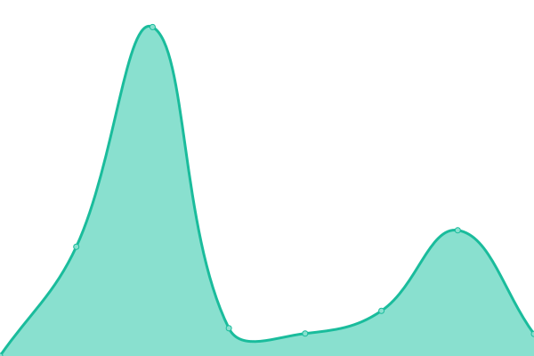
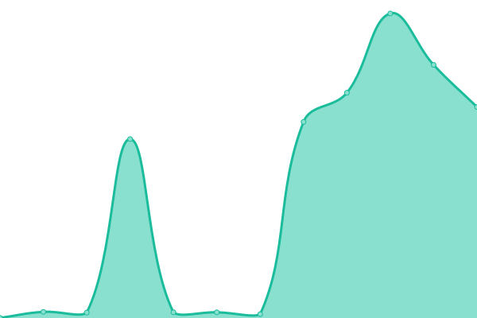

# [📈 Live Status](https://demo.upptime.js.org): <!--live status--> **🟧 Partial outage**

This repository contains the open-source uptime monitor and status page for [Patrick Little](Open.Canada.ca), powered by [Upptime](https://github.com/upptime/upptime).

With [Upptime](https://upptime.js.org), you can get your own unlimited and free uptime monitor and status page, powered entirely by a GitHub repository. We use [Issues](https://github.com/PatLittle/Consultations-Tracker/issues) as incident reports, [Actions](https://github.com/PatLittle/Consultations-Tracker/actions) as uptime monitors, and [Pages](https://demo.upptime.js.org) for the status page.

<!--start: status pages-->
<!-- This summary is generated by Upptime (https://github.com/upptime/upptime) -->
<!-- Do not edit this manually, your changes will be overwritten -->
<!-- prettier-ignore -->
| URL | Status | History | Response Time | Uptime |
| --- | ------ | ------- | ------------- | ------ |
|  [Share your thoughts: Emergency Management Framework for Agriculture in Canada](https://agriculture.canada.ca/en/department/transparency/public-opinion-research-consultations/share-your-thoughts-emergency-management-framework-agriculture-canada) | 🟩 Up | [share-your-thoughts-emergency-management-framework-for-agriculture-in-canada.yml](https://github.com/PatLittle/Consultations-Tracker/commits/HEAD/history/share-your-thoughts-emergency-management-framework-for-agriculture-in-canada.yml) | 

 0ms
     
 | 

<a href="https://PatLittle.github.io/Consultations-Tracker/history/share-your-thoughts-emergency-management-framework-for-agriculture-in-canada">100.00%</a>
    

|  [White River First Nations](https://www.rcaanc-cirnac.gc.ca/eng/1511969222951/1529103469169) | 🟩 Up | [white-river-first-nations.yml](https://github.com/PatLittle/Consultations-Tracker/commits/HEAD/history/white-river-first-nations.yml) | 

 1888ms
     
 | 

<a href="https://PatLittle.github.io/Consultations-Tracker/history/white-river-first-nations">98.52%</a>
    

|  [Use of digital tools at the border](https://www.cbsa-asfc.gc.ca/services/border-tech-frontiere/modern-eng.html) | 🟩 Up | [use-of-digital-tools-at-the-border.yml](https://github.com/PatLittle/Consultations-Tracker/commits/HEAD/history/use-of-digital-tools-at-the-border.yml) | 

 450ms
     
 | 

<a href="https://PatLittle.github.io/Consultations-Tracker/history/use-of-digital-tools-at-the-border">100.00%</a>
    

|  [Onshore Pipeline Regulations and Filing Manuals Review Project](https://www.cerdialogue.ca/opr) | 🟩 Up | [onshore-pipeline-regulations-and-filing-manuals-review-project.yml](https://github.com/PatLittle/Consultations-Tracker/commits/HEAD/history/onshore-pipeline-regulations-and-filing-manuals-review-project.yml) | 

 920ms
     
 | 

<a href="https://PatLittle.github.io/Consultations-Tracker/history/onshore-pipeline-regulations-and-filing-manuals-review-project">100.00%</a>
    

|  [Regulatory Framework Plan](https://can01.safelinks.protection.outlook.com/?url=https%3A%2F%2Fwww.cer-rec.gc.ca%2Fen%2Fabout%2Fhow-we-regulate%2Fplans-for-regulatory-framework%2F&data=05%7C02%7CMichelle.Shabits%40cer-rec.gc.ca%7Cec1c386ebea64452821d08dc41ebb1b9%7C56e9b8d38a3549abbdfc27de59608f01%7C0%7C0%7C638457728797041411%7CUnknown%7CTWFpbGZsb3d8eyJWIjoiMC4wLjAwMDAiLCJQIjoiV2luMzIiLCJBTiI6Ik1haWwiLCJXVCI6Mn0%3D%7C0%7C%7C%7C&sdata=tKxvqtPetzkvcXlETiyyf51rWnRpUftsM2o2U5IySO4%3D&reserved=0) | 🟩 Up | [regulatory-framework-plan.yml](https://github.com/PatLittle/Consultations-Tracker/commits/HEAD/history/regulatory-framework-plan.yml) | 

 1055ms
     
 | 

<a href="https://PatLittle.github.io/Consultations-Tracker/history/regulatory-framework-plan">100.00%</a>
    

|  [Regulated Industry Engagement](https://www.cer-rec.gc.ca/en/consultation-engagement/stakeholder-engagement/regulated-industry-engagement/index.html) | 🟩 Up | [regulated-industry-engagement.yml](https://github.com/PatLittle/Consultations-Tracker/commits/HEAD/history/regulated-industry-engagement.yml) | 

 327ms
     
 | 

<a href="https://PatLittle.github.io/Consultations-Tracker/history/regulated-industry-engagement">100.00%</a>
    

|  [Rules of Practice and Procedure Review](https://www.cerdialogue.ca/rules-of-practice-and-procedure-regulations) | 🟩 Up | [rules-of-practice-and-procedure-review.yml](https://github.com/PatLittle/Consultations-Tracker/commits/HEAD/history/rules-of-practice-and-procedure-review.yml) | 

 466ms
     
 | 

<a href="https://PatLittle.github.io/Consultations-Tracker/history/rules-of-practice-and-procedure-review">100.00%</a>
    

|  [Mortgage Industry Consultations on Income Verification Tool](https://www.canada.ca/en/revenue-agency/corporate/about-canada-revenue-agency-cra/transparency-proactive-disclosure-canada-revenue-agency/consultations-engagement-canada-revenue-agency/consultations-income-verification.html) | 🟩 Up | [mortgage-industry-consultations-on-income-verification-tool.yml](https://github.com/PatLittle/Consultations-Tracker/commits/HEAD/history/mortgage-industry-consultations-on-income-verification-tool.yml) | 

 2321ms
     
 | 

<a href="https://PatLittle.github.io/Consultations-Tracker/history/mortgage-industry-consultations-on-income-verification-tool">100.00%</a>
    

|  [Changing Narrative Fund](https://www.canada.ca/en/canadian-heritage/campaigns/changing-narratives-fund.html) | 🟩 Up | [changing-narrative-fund.yml](https://github.com/PatLittle/Consultations-Tracker/commits/HEAD/history/changing-narrative-fund.yml) | 

 1665ms
     
 | 

<a href="https://PatLittle.github.io/Consultations-Tracker/history/changing-narrative-fund">100.00%</a>
    

|  [2022-23 Consultations on renewal of the Museum Policy](https://www.canada.ca/en/canadian-heritage/campaigns/renewal-museum-policy.html) | 🟩 Up | [2022-23-consultations-on-renewal-of-the-museum-policy.yml](https://github.com/PatLittle/Consultations-Tracker/commits/HEAD/history/2022-23-consultations-on-renewal-of-the-museum-policy.yml) | 

 2306ms
     
 | 

<a href="https://PatLittle.github.io/Consultations-Tracker/history/2022-23-consultations-on-renewal-of-the-museum-policy">100.00%</a>
    

|  [REGDOC-2.10.1, Nuclear Emergency Preparedness and Response, Version 3](https://www.cnsc-ccsn.gc.ca/eng/acts-and-regulations/consultation/regdoc2-10-1-v3-consultation/) | 🟩 Up | [regdoc-2-10-1-nuclear-emergency-preparedness-and-response-version-3.yml](https://github.com/PatLittle/Consultations-Tracker/commits/HEAD/history/regdoc-2-10-1-nuclear-emergency-preparedness-and-response-version-3.yml) | 

 282ms
     
 | 

<a href="https://PatLittle.github.io/Consultations-Tracker/history/regdoc-2-10-1-nuclear-emergency-preparedness-and-response-version-3">100.00%</a>
    

|  [Co-development of a new Indigenous Broadcasting Policy](https://crtc.gc.ca/eng/archive/2019/2019-217.htm) | 🟩 Up | [co-development-of-a-new-indigenous-broadcasting-policy.yml](https://github.com/PatLittle/Consultations-Tracker/commits/HEAD/history/co-development-of-a-new-indigenous-broadcasting-policy.yml) | 

 351ms
     
 | 

<a href="https://PatLittle.github.io/Consultations-Tracker/history/co-development-of-a-new-indigenous-broadcasting-policy">100.00%</a>
    

|  [Share your thoughts about closed captioning of programming from online streaming services](https://crtc.gc.ca/eng/consultation/cc.htm) | 🟩 Up | [share-your-thoughts-about-closed-captioning-of-programming-from-online-streaming-services.yml](https://github.com/PatLittle/Consultations-Tracker/commits/HEAD/history/share-your-thoughts-about-closed-captioning-of-programming-from-online-streaming-services.yml) | 

 61ms
     
 | 

<a href="https://PatLittle.github.io/Consultations-Tracker/history/share-your-thoughts-about-closed-captioning-of-programming-from-online-streaming-services">100.00%</a>
    

|  [Share your thoughts about described video and audio description](https://crtc.gc.ca/eng/consultation/descri.htm) | 🟩 Up | [share-your-thoughts-about-described-video-and-audio-description.yml](https://github.com/PatLittle/Consultations-Tracker/commits/HEAD/history/share-your-thoughts-about-described-video-and-audio-description.yml) | 

 60ms
     
 | 

<a href="https://PatLittle.github.io/Consultations-Tracker/history/share-your-thoughts-about-described-video-and-audio-description">100.00%</a>
    

|  [Share your thoughts on a temporary fund to support local news production by commercial radio stations](https://crtc.gc.ca/eng/consultation/local.htm) | 🟩 Up | [share-your-thoughts-on-a-temporary-fund-to-support-local-news-production-by-commercial-radio-stations.yml](https://github.com/PatLittle/Consultations-Tracker/commits/HEAD/history/share-your-thoughts-on-a-temporary-fund-to-support-local-news-production-by-commercial-radio-stations.yml) | 

 61ms
     
 | 

<a href="https://PatLittle.github.io/Consultations-Tracker/history/share-your-thoughts-on-a-temporary-fund-to-support-local-news-production-by-commercial-radio-stations">100.00%</a>
    

|  [Share your thoughts about the modernization of radio processes](https://crtc.gc.ca/eng/consultation/modernradio.htm) | 🟩 Up | [share-your-thoughts-about-the-modernization-of-radio-processes.yml](https://github.com/PatLittle/Consultations-Tracker/commits/HEAD/history/share-your-thoughts-about-the-modernization-of-radio-processes.yml) | 

 57ms
     
 | 

<a href="https://PatLittle.github.io/Consultations-Tracker/history/share-your-thoughts-about-the-modernization-of-radio-processes">100.00%</a>
    

|  [Share your thoughts on Canadian content for TV and online streaming services](https://crtc.gc.ca/eng/consultation/cancon.htm) | 🟩 Up | [share-your-thoughts-on-canadian-content-for-tv-and-online-streaming-services.yml](https://github.com/PatLittle/Consultations-Tracker/commits/HEAD/history/share-your-thoughts-on-canadian-content-for-tv-and-online-streaming-services.yml) | 

 56ms
     
 | 

<a href="https://PatLittle.github.io/Consultations-Tracker/history/share-your-thoughts-on-canadian-content-for-tv-and-online-streaming-services">100.00%</a>
    

|  [TRC Call to Action 66: Moving from Pilot Project to Long-Term Implementation](Not available) | 🟥 Down | [trc-call-to-action-66-moving-from-pilot-project-to-long-term-implementation.yml](https://github.com/PatLittle/Consultations-Tracker/commits/HEAD/history/trc-call-to-action-66-moving-from-pilot-project-to-long-term-implementation.yml) | 

 0ms
     
 | 

<a href="https://PatLittle.github.io/Consultations-Tracker/history/trc-call-to-action-66-moving-from-pilot-project-to-long-term-implementation">100.00%</a>
    

|  [Consultations on the Taxation of Vacant Lands](https://www.canada.ca/en/department-finance/programs/consultations/2024/consultations-on-the-taxation-of-vacant-lands.html) | 🟩 Up | [consultations-on-the-taxation-of-vacant-lands.yml](https://github.com/PatLittle/Consultations-Tracker/commits/HEAD/history/consultations-on-the-taxation-of-vacant-lands.yml) | 

 2404ms
     
 | 

<a href="https://PatLittle.github.io/Consultations-Tracker/history/consultations-on-the-taxation-of-vacant-lands">100.00%</a>
    

|  [Council of Europe Second Additional Protocol to the Convention on Cybercrime on Enhanced Cooperation and Disclosure of Electronic EvidenceConsultations, 2023](https://www.justice.gc.ca/eng/cj-jp/cyber/id-di/index.html) | 🟩 Up | [council-of-europe-second-additional-protocol-to-the-convention-on-cybercrime-on-enhanced-cooperation-and-disclosure-of-electronic-evidence-consultations-2023.yml](https://github.com/PatLittle/Consultations-Tracker/commits/HEAD/history/council-of-europe-second-additional-protocol-to-the-convention-on-cybercrime-on-enhanced-cooperation-and-disclosure-of-electronic-evidence-consultations-2023.yml) | 

 360ms
     
 | 

<a href="https://PatLittle.github.io/Consultations-Tracker/history/council-of-europe-second-additional-protocol-to-the-convention-on-cybercrime-on-enhanced-cooperation-and-disclosure-of-electronic-evidence-consultations-2023">100.00%</a>
    

|  [Consultations for the 2025 Annual Report on the 2030 Agenda and the Sustainable Development Goals](https://srv217.services.gc.ca/ihst4/Intro.aspx?cid=2cd15f32-a51c-467a-8f45-18098c4f7cf7&lc=eng) | 🟩 Up | [consultations-for-the-2025-annual-report-on-the-2030-agenda-and-the-sustainable-development-goals.yml](https://github.com/PatLittle/Consultations-Tracker/commits/HEAD/history/consultations-for-the-2025-annual-report-on-the-2030-agenda-and-the-sustainable-development-goals.yml) | 

 1052ms
     
 | 

<a href="https://PatLittle.github.io/Consultations-Tracker/history/consultations-for-the-2025-annual-report-on-the-2030-agenda-and-the-sustainable-development-goals">100.00%</a>
    

|  [Share your ideas: Blackwater Project](https://www.canada.ca/en/environment-climate-change/services/managing-pollution/sources-industry/mining/metal-diamond-mining-effluent-regulation/blackwater-consultation.html) | 🟥 Down | [share-your-ideas-blackwater-project.yml](https://github.com/PatLittle/Consultations-Tracker/commits/HEAD/history/share-your-ideas-blackwater-project.yml) | 

 2179ms
     
 | 

<a href="https://PatLittle.github.io/Consultations-Tracker/history/share-your-ideas-blackwater-project">100.00%</a>
    

|  [Consultation on Amending the List of Species under the Species at Risk Act: Terrestrial Species December 2023](https://species-registry.canada.ca/index-en.html#/documents/1171) | 🟩 Up | [consultation-on-amending-the-list-of-species-under-the-species-at-risk-act-terrestrial-species-december-2023.yml](https://github.com/PatLittle/Consultations-Tracker/commits/HEAD/history/consultation-on-amending-the-list-of-species-under-the-species-at-risk-act-terrestrial-species-december-2023.yml) | 

 171ms
     
 | 

<a href="https://PatLittle.github.io/Consultations-Tracker/history/consultation-on-amending-the-list-of-species-under-the-species-at-risk-act-terrestrial-species-december-2023">100.00%</a>
    

|  [Comment on: Draft Canada-Saskatchewan Equivalency Agreement on coal-fired electricity regulations (2025-2026)](https://www.canada.ca/en/environment-climate-change/services/canadian-environmental-protection-act-registry/agreements/equivalency/canada-saskatchewan-greenhouse-gas-electricity-producers-2025.html) | 🟩 Up | [comment-on-draft-canada-saskatchewan-equivalency-agreement-on-coal-fired-electricity-regulations-2025-2026.yml](https://github.com/PatLittle/Consultations-Tracker/commits/HEAD/history/comment-on-draft-canada-saskatchewan-equivalency-agreement-on-coal-fired-electricity-regulations-2025-2026.yml) | 

 2519ms
     
 | 

<a href="https://PatLittle.github.io/Consultations-Tracker/history/comment-on-draft-canada-saskatchewan-equivalency-agreement-on-coal-fired-electricity-regulations-2025-2026">100.00%</a>
    

|  [Draft implementation framework for a Right to a Healthy Environment in the Canadian Environmental Protection Act, 1999](https://www.canada.ca/en/environment-climate-change/corporate/transparency/consultations/draft-implementation-framework.html) | 🟩 Up | [draft-implementation-framework-for-a-right-to-a-healthy-environment-in-the-canadian-environmental-protection-act-1999.yml](https://github.com/PatLittle/Consultations-Tracker/commits/HEAD/history/draft-implementation-framework-for-a-right-to-a-healthy-environment-in-the-canadian-environmental-protection-act-1999.yml) | 

 0ms
     
 | 

<a href="https://PatLittle.github.io/Consultations-Tracker/history/draft-implementation-framework-for-a-right-to-a-healthy-environment-in-the-canadian-environmental-protection-act-1999">100.00%</a>
    

|  [Proposed Coal Mining Effluent Regulations](https://www.canada.ca/en/environment-climate-change/services/managing-pollution/sources-industry/mining-effluent/proposed-coal-mining-effluent-regulations.html) | 🟩 Up | [proposed-coal-mining-effluent-regulations.yml](https://github.com/PatLittle/Consultations-Tracker/commits/HEAD/history/proposed-coal-mining-effluent-regulations.yml) | 

 2581ms
     
 | 

<a href="https://PatLittle.github.io/Consultations-Tracker/history/proposed-coal-mining-effluent-regulations">100.00%</a>
    

|  [Proposed Plan of Priorities](https://www.canada.ca/en/environment-climate-change/corporate/transparency/consultations/proposed-plan-priorities.html) | 🟩 Up | [proposed-plan-of-priorities.yml](https://github.com/PatLittle/Consultations-Tracker/commits/HEAD/history/proposed-plan-of-priorities.yml) | 

 2487ms
     
 | 

<a href="https://PatLittle.github.io/Consultations-Tracker/history/proposed-plan-of-priorities">100.00%</a>
    

|  [Proposed Watch List Approach](https://www.canada.ca/en/environment-climate-change/corporate/transparency/consultations/proposed-watch-list.html) | 🟩 Up | [proposed-watch-list-approach.yml](https://github.com/PatLittle/Consultations-Tracker/commits/HEAD/history/proposed-watch-list-approach.yml) | 

 2492ms
     
 | 

<a href="https://PatLittle.github.io/Consultations-Tracker/history/proposed-watch-list-approach">100.00%</a>
    

|  [Eastern Shore Islands Area of Interest Consultations](http://www.dfo-mpo.gc.ca/oceans/consultations/easternshore-ilescoteest/index-eng.html) | 🟩 Up | [eastern-shore-islands-area-of-interest-consultations.yml](https://github.com/PatLittle/Consultations-Tracker/commits/HEAD/history/eastern-shore-islands-area-of-interest-consultations.yml) | 

 482ms
     
 | 

<a href="https://PatLittle.github.io/Consultations-Tracker/history/eastern-shore-islands-area-of-interest-consultations">100.00%</a>
    

|  [Northern Gulf of St. Lawrence Study Area](https://www.dfo-mpo.gc.ca/oceans/canada-quebec-agreement-entente/index-eng.html) | 🟩 Up | [northern-gulf-of-st-lawrence-study-area.yml](https://github.com/PatLittle/Consultations-Tracker/commits/HEAD/history/northern-gulf-of-st-lawrence-study-area.yml) | 

 329ms
     
 | 

<a href="https://PatLittle.github.io/Consultations-Tracker/history/northern-gulf-of-st-lawrence-study-area">100.00%</a>
    

|  [Fundian Channel- Browns Bank Area of Interest](https://www.dfo-mpo.gc.ca/oceans/aoi-si/fundian-fundy-browns-eng.html) | 🟩 Up | [fundian-channel-browns-bank-area-of-interest.yml](https://github.com/PatLittle/Consultations-Tracker/commits/HEAD/history/fundian-channel-browns-bank-area-of-interest.yml) | 

 192ms
     
 | 

<a href="https://PatLittle.github.io/Consultations-Tracker/history/fundian-channel-browns-bank-area-of-interest">100.00%</a>
    

|  [Let's talk Pacific Salmon](https://letstalkpacificsalmon.ca/) | 🟩 Up | [let-s-talk-pacific-salmon.yml](https://github.com/PatLittle/Consultations-Tracker/commits/HEAD/history/let-s-talk-pacific-salmon.yml) | 

 1209ms
     
 | 

<a href="https://PatLittle.github.io/Consultations-Tracker/history/let-s-talk-pacific-salmon">100.00%</a>
    

|  [Proposed ticketing for the enforcement of a fisheries offence under the Fisheries Act](TBD) | 🟥 Down | [proposed-ticketing-for-the-enforcement-of-a-fisheries-offence-under-the-fisheries-act.yml](https://github.com/PatLittle/Consultations-Tracker/commits/HEAD/history/proposed-ticketing-for-the-enforcement-of-a-fisheries-offence-under-the-fisheries-act.yml) | 

 0ms
     
 | 

<a href="https://PatLittle.github.io/Consultations-Tracker/history/proposed-ticketing-for-the-enforcement-of-a-fisheries-offence-under-the-fisheries-act">100.00%</a>
    

|  [Marine Conservation Network Plan](https://www.dfo-mpo.gc.ca/oceans/networks-reseaux/development-developpement-eng.html) | 🟩 Up | [marine-conservation-network-plan.yml](https://github.com/PatLittle/Consultations-Tracker/commits/HEAD/history/marine-conservation-network-plan.yml) | 

 94ms
     
 | 

<a href="https://PatLittle.github.io/Consultations-Tracker/history/marine-conservation-network-plan">100.00%</a>
    

|  [Whitby Harbour Remediation Project](https://www.dfo-mpo.gc.ca/sch-ppb/whitby/index-eng.html) | 🟩 Up | [whitby-harbour-remediation-project.yml](https://github.com/PatLittle/Consultations-Tracker/commits/HEAD/history/whitby-harbour-remediation-project.yml) | 

 185ms
     
 | 

<a href="https://PatLittle.github.io/Consultations-Tracker/history/whitby-harbour-remediation-project">100.00%</a>
    

|  [Canada's (Draft) Ocean Noise Strategy](https://www.dfo-mpo.gc.ca/oceans/consultations/noise-bruit/2024/index-eng.html) | 🟩 Up | [canada-s-draft-ocean-noise-strategy.yml](https://github.com/PatLittle/Consultations-Tracker/commits/HEAD/history/canada-s-draft-ocean-noise-strategy.yml) | 

 94ms
     
 | 

<a href="https://PatLittle.github.io/Consultations-Tracker/history/canada-s-draft-ocean-noise-strategy">100.00%</a>
    

|  [Revision of the management plan for Banc-des-Américains Marine Protected Area (MPA)](https://www.dfo-mpo.gc.ca/oceans/mpa-zpm/american-americains/index-eng.html) | 🟩 Up | [revision-of-the-management-plan-for-banc-des-americains-marine-protected-area-mpa.yml](https://github.com/PatLittle/Consultations-Tracker/commits/HEAD/history/revision-of-the-management-plan-for-banc-des-americains-marine-protected-area-mpa.yml) | 

 114ms
     
 | 

<a href="https://PatLittle.github.io/Consultations-Tracker/history/revision-of-the-management-plan-for-banc-des-americains-marine-protected-area-mpa">100.00%</a>
    

|  [Elver Fishery Management Review](https://www.dfo-mpo.gc.ca/fisheries-peches/ifmp-gmp/elver-anguille/index-eng.html) | 🟩 Up | [elver-fishery-management-review.yml](https://github.com/PatLittle/Consultations-Tracker/commits/HEAD/history/elver-fishery-management-review.yml) | 

 334ms
     
 | 

<a href="https://PatLittle.github.io/Consultations-Tracker/history/elver-fishery-management-review">100.00%</a>
    

|  [Management Plan for the Mapleleaf (Quadrula quadrula) Great Lakes  Upper St. Lawrence Population, and Rainbow (Villosa iris) in Canada](https://wildlife-species.canada.ca/species-risk-registry/involved/consultation/default_e.cfm) | 🟩 Up | [management-plan-for-the-mapleleaf-quadrula-quadrula-great-lakes-upper-st-lawrence-population-and-rainbow-villosa-iris-in-canada.yml](https://github.com/PatLittle/Consultations-Tracker/commits/HEAD/history/management-plan-for-the-mapleleaf-quadrula-quadrula-great-lakes-upper-st-lawrence-population-and-rainbow-villosa-iris-in-canada.yml) | 

 0ms
     
 | 

<a href="https://PatLittle.github.io/Consultations-Tracker/history/management-plan-for-the-mapleleaf-quadrula-quadrula-great-lakes-upper-st-lawrence-population-and-rainbow-villosa-iris-in-canada">100.00%</a>
    

|  [Banc-des-Américains Oceans Act Marine Protected Area Management Plan](https://www.dfo-mpo.gc.ca/oceans/mpa-zpm/american-americains/index-eng.html) | 🟩 Up | [banc-des-americains-oceans-act-marine-protected-area-management-plan.yml](https://github.com/PatLittle/Consultations-Tracker/commits/HEAD/history/banc-des-americains-oceans-act-marine-protected-area-management-plan.yml) | 

 118ms
     
 | 

<a href="https://PatLittle.github.io/Consultations-Tracker/history/banc-des-americains-oceans-act-marine-protected-area-management-plan">100.00%</a>
    

|  [Construction of a waterfront wharf at Pointe-Basse Harbour in Magdalen Islands](https://aeic-iaac.gc.ca/050/evaluations/proj/88682?culture=en-CA) | 🟩 Up | [construction-of-a-waterfront-wharf-at-pointe-basse-harbour-in-magdalen-islands.yml](https://github.com/PatLittle/Consultations-Tracker/commits/HEAD/history/construction-of-a-waterfront-wharf-at-pointe-basse-harbour-in-magdalen-islands.yml) | 

 0ms
     
 | 

<a href="https://PatLittle.github.io/Consultations-Tracker/history/construction-of-a-waterfront-wharf-at-pointe-basse-harbour-in-magdalen-islands">100.00%</a>
    

|  [Multi-species Action Plan for the Richelieu River Watershed in Canada](https://species-registry.canada.ca/index-en.html#/consultations/2965) | 🟩 Up | [multi-species-action-plan-for-the-richelieu-river-watershed-in-canada.yml](https://github.com/PatLittle/Consultations-Tracker/commits/HEAD/history/multi-species-action-plan-for-the-richelieu-river-watershed-in-canada.yml) | 

 0ms
     
 | 

<a href="https://PatLittle.github.io/Consultations-Tracker/history/multi-species-action-plan-for-the-richelieu-river-watershed-in-canada">100.00%</a>
    

|  [Possession and Export of Elvers Regulations](https://www.gazette.gc.ca/rp-pr/p1/2024/2024-06-29/html/reg6-eng.html) | 🟩 Up | [possession-and-export-of-elvers-regulations.yml](https://github.com/PatLittle/Consultations-Tracker/commits/HEAD/history/possession-and-export-of-elvers-regulations.yml) | 

 496ms
     
 | 

<a href="https://PatLittle.github.io/Consultations-Tracker/history/possession-and-export-of-elvers-regulations">100.00%</a>
    

|  [Ghost Gear Update and Path Forward Meetings](https://www.dfo-mpo.gc.ca/fisheries-peches/management-gestion/ghostgear-equipementfantome/index-eng.html) | 🟩 Up | [ghost-gear-update-and-path-forward-meetings.yml](https://github.com/PatLittle/Consultations-Tracker/commits/HEAD/history/ghost-gear-update-and-path-forward-meetings.yml) | 

 95ms
     
 | 

<a href="https://PatLittle.github.io/Consultations-Tracker/history/ghost-gear-update-and-path-forward-meetings">100.00%</a>
    

|  [Share and view ideas: Ghost Gear Program뗩 Gear Management Survey](https://www.dfo-mpo.gc.ca/fisheries-peches/management-gestion/ghostgear-equipementfantome/ghost-gear-survey-engins-fantomes-sondage-eng.html) | 🟩 Up | [share-and-view-ideas-ghost-gear-program-s-gear-management-survey.yml](https://github.com/PatLittle/Consultations-Tracker/commits/HEAD/history/share-and-view-ideas-ghost-gear-program-s-gear-management-survey.yml) | 

 81ms
     
 | 

<a href="https://PatLittle.github.io/Consultations-Tracker/history/share-and-view-ideas-ghost-gear-program-s-gear-management-survey">100.00%</a>
    

|  [Whalesafe Gear Strategy](https://www.dfo-mpo.gc.ca/species-especes/mammals-mammiferes/whales-baleines/gear-equipement/index-eng.html) | 🟩 Up | [whalesafe-gear-strategy.yml](https://github.com/PatLittle/Consultations-Tracker/commits/HEAD/history/whalesafe-gear-strategy.yml) | 

 69ms
     
 | 

<a href="https://PatLittle.github.io/Consultations-Tracker/history/whalesafe-gear-strategy">100.00%</a>
    

|  [Proposed Amendments to the Export Permits Regulations](https://www.international.gc.ca/trade-commerce/controls-controles/expor/backgrounder-amendments-epr-information-modification-rle.aspx?lang=eng) | 🟩 Up | [proposed-amendments-to-the-export-permits-regulations.yml](https://github.com/PatLittle/Consultations-Tracker/commits/HEAD/history/proposed-amendments-to-the-export-permits-regulations.yml) | 

 509ms
     
 | 

<a href="https://PatLittle.github.io/Consultations-Tracker/history/proposed-amendments-to-the-export-permits-regulations">100.00%</a>
    

|  [Consulting Canadians on the proposed addition of Brazil and Montenegro to the Automatic Firearms Country Control List (AFCCL)](https://www.international.gc.ca/trade-commerce/consultations/firearms-armes/2024-10-31-consultation.aspx?lang=eng) | 🟩 Up | [consulting-canadians-on-the-proposed-addition-of-brazil-and-montenegro-to-the-automatic-firearms-country-control-list-afccl.yml](https://github.com/PatLittle/Consultations-Tracker/commits/HEAD/history/consulting-canadians-on-the-proposed-addition-of-brazil-and-montenegro-to-the-automatic-firearms-country-control-list-afccl.yml) | 

 175ms
     
 | 

<a href="https://PatLittle.github.io/Consultations-Tracker/history/consulting-canadians-on-the-proposed-addition-of-brazil-and-montenegro-to-the-automatic-firearms-country-control-list-afccl">100.00%</a>
    

|  [Notice of intent to consult on modernization of provisions pertaining to hospitals and practitioners in regulations made under the Controlled Drugs and Substances Act](https://www.canada.ca/en/public-health/programs/consultation-updating-provisions-hospitals-practitioners-regulations-controlled-drugs-substances-act.html) | 🟩 Up | [notice-of-intent-to-consult-on-modernization-of-provisions-pertaining-to-hospitals-and-practitioners-in-regulations-made-under-the-controlled-drugs-and-substances-act.yml](https://github.com/PatLittle/Consultations-Tracker/commits/HEAD/history/notice-of-intent-to-consult-on-modernization-of-provisions-pertaining-to-hospitals-and-practitioners-in-regulations-made-under-the-controlled-drugs-and-substances-act.yml) | 

 0ms
     
 | 

<a href="https://PatLittle.github.io/Consultations-Tracker/history/notice-of-intent-to-consult-on-modernization-of-provisions-pertaining-to-hospitals-and-practitioners-in-regulations-made-under-the-controlled-drugs-and-substances-act">100.00%</a>
    

|  [Consultation on Clomazone, Proposed Maximum Residue Limit PMRL2024-17](https://www.canada.ca/en/health-canada/services/consumer-product-safety/pesticides-pest-management/public/consultations/proposed-maximum-residue-limit/2024/clomazone.html) | 🟩 Up | [consultation-on-clomazone-proposed-maximum-residue-limit-pmrl-2024-17.yml](https://github.com/PatLittle/Consultations-Tracker/commits/HEAD/history/consultation-on-clomazone-proposed-maximum-residue-limit-pmrl-2024-17.yml) | 

 2240ms
     
 | 

<a href="https://PatLittle.github.io/Consultations-Tracker/history/consultation-on-clomazone-proposed-maximum-residue-limit-pmrl-2024-17">100.00%</a>
    

|  [Consultation on rimsulfuron, Proposed Maximum Residue Limit PMRL2024-16](https://www.canada.ca/en/health-canada/services/consumer-product-safety/pesticides-pest-management/public/consultations/proposed-maximum-residue-limit/2024/rimsulfuron.html) | 🟩 Up | [consultation-on-rimsulfuron-proposed-maximum-residue-limit-pmrl-2024-16.yml](https://github.com/PatLittle/Consultations-Tracker/commits/HEAD/history/consultation-on-rimsulfuron-proposed-maximum-residue-limit-pmrl-2024-16.yml) | 

 2021ms
     
 | 

<a href="https://PatLittle.github.io/Consultations-Tracker/history/consultation-on-rimsulfuron-proposed-maximum-residue-limit-pmrl-2024-16">100.00%</a>
    

|  [Consultation on pyridate, Proposed Maximum Residue Limit PMRL2024-18](https://www.canada.ca/en/health-canada/services/consumer-product-safety/pesticides-pest-management/public/consultations/proposed-maximum-residue-limit/2024/pyridate.html) | 🟩 Up | [consultation-on-pyridate-proposed-maximum-residue-limit-pmrl-2024-18.yml](https://github.com/PatLittle/Consultations-Tracker/commits/HEAD/history/consultation-on-pyridate-proposed-maximum-residue-limit-pmrl-2024-18.yml) | 

 1719ms
     
 | 

<a href="https://PatLittle.github.io/Consultations-Tracker/history/consultation-on-pyridate-proposed-maximum-residue-limit-pmrl-2024-18">100.00%</a>
    

|  [Consultation on 3-methyl-2-cyclohexen-1-one and its associated end-use products, Proposed Re-evaluation Decision PRVD2024-05](https://www.canada.ca/en/health-canada/services/consumer-product-safety/pesticides-pest-management/public/consultations/proposed-re-evaluation-decisions/2024/3-methyl-2-cyclohexen-1-one.html) | 🟩 Up | [consultation-on-3-methyl-2-cyclohexen-1-one-and-its-associated-end-use-products-proposed-re-evaluation-decision-prvd-2024-05.yml](https://github.com/PatLittle/Consultations-Tracker/commits/HEAD/history/consultation-on-3-methyl-2-cyclohexen-1-one-and-its-associated-end-use-products-proposed-re-evaluation-decision-prvd-2024-05.yml) | 

 1755ms
     
 | 

<a href="https://PatLittle.github.io/Consultations-Tracker/history/consultation-on-3-methyl-2-cyclohexen-1-one-and-its-associated-end-use-products-proposed-re-evaluation-decision-prvd-2024-05">100.00%</a>
    

|  [Consultation on Triallate, Proposed Maximum Residue Limit PMRL2024-19](https://www.canada.ca/en/health-canada/services/consumer-product-safety/pesticides-pest-management/public/consultations/proposed-maximum-residue-limit/2024/triallate.html) | 🟩 Up | [consultation-on-triallate-proposed-maximum-residue-limit-pmrl-2024-19.yml](https://github.com/PatLittle/Consultations-Tracker/commits/HEAD/history/consultation-on-triallate-proposed-maximum-residue-limit-pmrl-2024-19.yml) | 

 1975ms
     
 | 

<a href="https://PatLittle.github.io/Consultations-Tracker/history/consultation-on-triallate-proposed-maximum-residue-limit-pmrl-2024-19">100.00%</a>
    

|  [Consultation on Spiromesifen, Proposed Maximum Residue Limit PMRL2024-20](https://www.canada.ca/en/health-canada/services/consumer-product-safety/pesticides-pest-management/public/consultations/proposed-maximum-residue-limit/2024/spiromesifen.html) | 🟩 Up | [consultation-on-spiromesifen-proposed-maximum-residue-limit-pmrl-2024-20.yml](https://github.com/PatLittle/Consultations-Tracker/commits/HEAD/history/consultation-on-spiromesifen-proposed-maximum-residue-limit-pmrl-2024-20.yml) | 

 2666ms
     
 | 

<a href="https://PatLittle.github.io/Consultations-Tracker/history/consultation-on-spiromesifen-proposed-maximum-residue-limit-pmrl-2024-20">100.00%</a>
    

|  [Consultation on clethodim, Proposed Maximum Residue Limit PMRL2024-21](https://www.canada.ca/en/health-canada/services/consumer-product-safety/pesticides-pest-management/public/consultations/proposed-maximum-residue-limit/2024/clethodim.html) | 🟩 Up | [consultation-on-clethodim-proposed-maximum-residue-limit-pmrl-2024-21.yml](https://github.com/PatLittle/Consultations-Tracker/commits/HEAD/history/consultation-on-clethodim-proposed-maximum-residue-limit-pmrl-2024-21.yml) | 

 2581ms
     
 | 

<a href="https://PatLittle.github.io/Consultations-Tracker/history/consultation-on-clethodim-proposed-maximum-residue-limit-pmrl-2024-21">100.00%</a>
    

|  [Reclassification of the group of formulants Nonylphenol ethoxylates (NPEs) to List 1  Formulants of toxicological concern, Regulatory Proposal PRO2024-05](https://www.canada.ca/en/health-canada/services/consumer-product-safety/pesticides-pest-management/public/consultations/regulatory-proposals/2024/reclassification-group-formulants-nonylphenol-ethoxylates-list-1.html) | 🟩 Up | [reclassification-of-the-group-of-formulants-nonylphenol-ethoxylates-np-es-to-list-1-formulants-of-toxicological-concern-regulatory-proposal-pro-2024-05.yml](https://github.com/PatLittle/Consultations-Tracker/commits/HEAD/history/reclassification-of-the-group-of-formulants-nonylphenol-ethoxylates-np-es-to-list-1-formulants-of-toxicological-concern-regulatory-proposal-pro-2024-05.yml) | 

 1889ms
     
 | 

<a href="https://PatLittle.github.io/Consultations-Tracker/history/reclassification-of-the-group-of-formulants-nonylphenol-ethoxylates-np-es-to-list-1-formulants-of-toxicological-concern-regulatory-proposal-pro-2024-05">100.00%</a>
    

|  [Consultation on flupyradifurone, Proposed Maximum Residue Limit PMRL2024-22](https://www.canada.ca/en/health-canada/services/consumer-product-safety/pesticides-pest-management/public/consultations/proposed-maximum-residue-limit/2024/flupyradifurone.html) | 🟩 Up | [consultation-on-flupyradifurone-proposed-maximum-residue-limit-pmrl-2024-22.yml](https://github.com/PatLittle/Consultations-Tracker/commits/HEAD/history/consultation-on-flupyradifurone-proposed-maximum-residue-limit-pmrl-2024-22.yml) | 

 1710ms
     
 | 

<a href="https://PatLittle.github.io/Consultations-Tracker/history/consultation-on-flupyradifurone-proposed-maximum-residue-limit-pmrl-2024-22">100.00%</a>
    

|  [Consultation on guidelines for Canadian drinking water quality: Radiological Parameters](https://www.canada.ca/en/health-canada/programs/consultation-guidelines-canadian-drinking-water-quality-radiological-parameters.html) | 🟩 Up | [consultation-on-guidelines-for-canadian-drinking-water-quality-radiological-parameters.yml](https://github.com/PatLittle/Consultations-Tracker/commits/HEAD/history/consultation-on-guidelines-for-canadian-drinking-water-quality-radiological-parameters.yml) | 

 2691ms
     
 | 

<a href="https://PatLittle.github.io/Consultations-Tracker/history/consultation-on-guidelines-for-canadian-drinking-water-quality-radiological-parameters">100.00%</a>
    

|  [Consultation: Draft good manufacturing practices guide for natural health products](https://www.canada.ca/en/health-canada/programs/consultation-draft-good-manufacturing-practices-guide-natural-health-products.html) | 🟩 Up | [consultation-draft-good-manufacturing-practices-guide-for-natural-health-products.yml](https://github.com/PatLittle/Consultations-Tracker/commits/HEAD/history/consultation-draft-good-manufacturing-practices-guide-for-natural-health-products.yml) | 

 2126ms
     
 | 

<a href="https://PatLittle.github.io/Consultations-Tracker/history/consultation-draft-good-manufacturing-practices-guide-for-natural-health-products">100.00%</a>
    

|  [Share your thoughts: Consultation on draft National Priority List of Pediatric Drugs](https://www.canada.ca/en/health-canada/programs/consultation-draft-national-priority-list-pediatric-drugs.html) | 🟩 Up | [share-your-thoughts-consultation-on-draft-national-priority-list-of-pediatric-drugs.yml](https://github.com/PatLittle/Consultations-Tracker/commits/HEAD/history/share-your-thoughts-consultation-on-draft-national-priority-list-of-pediatric-drugs.yml) | 

 1970ms
     
 | 

<a href="https://PatLittle.github.io/Consultations-Tracker/history/share-your-thoughts-consultation-on-draft-national-priority-list-of-pediatric-drugs">100.00%</a>
    

|  [Consultation: Proposed compositional requirements for infant foods and foods currently regulated as foods for special dietary use](https://www.canada.ca/en/health-canada/programs/consultation-proposed-compositional-requirements-infant-foods-currently-regulated-special-dietary-use.html) | 🟩 Up | [consultation-proposed-compositional-requirements-for-infant-foods-and-foods-currently-regulated-as-foods-for-special-dietary-use.yml](https://github.com/PatLittle/Consultations-Tracker/commits/HEAD/history/consultation-proposed-compositional-requirements-for-infant-foods-and-foods-currently-regulated-as-foods-for-special-dietary-use.yml) | 

 2113ms
     
 | 

<a href="https://PatLittle.github.io/Consultations-Tracker/history/consultation-proposed-compositional-requirements-for-infant-foods-and-foods-currently-regulated-as-foods-for-special-dietary-use">100.00%</a>
    

|  [Consultation on the proposed special review decision for iodocarb (3-iodo-2-propynyl butyl carbamate) and its associated end use products, PSRD2024-02](https://www.canada.ca/en/health-canada/services/consumer-product-safety/pesticides-pest-management/public/consultations/proposed-special-review-decision/2024/iodocarb-3-iodo-2-propynyl-butyl-carbamate.html) | 🟩 Up | [consultation-on-the-proposed-special-review-decision-for-iodocarb-3-iodo-2-propynyl-butyl-carbamate-and-its-associated-end-use-products-psrd-2024-02.yml](https://github.com/PatLittle/Consultations-Tracker/commits/HEAD/history/consultation-on-the-proposed-special-review-decision-for-iodocarb-3-iodo-2-propynyl-butyl-carbamate-and-its-associated-end-use-products-psrd-2024-02.yml) | 

 1778ms
     
 | 

<a href="https://PatLittle.github.io/Consultations-Tracker/history/consultation-on-the-proposed-special-review-decision-for-iodocarb-3-iodo-2-propynyl-butyl-carbamate-and-its-associated-end-use-products-psrd-2024-02">100.00%</a>
    

|  [Consultation on spinosad, Proposed Maximum Residue Limit PMRL2024-23](https://www.canada.ca/en/health-canada/services/consumer-product-safety/pesticides-pest-management/public/consultations/proposed-maximum-residue-limit/2024/spinosad.html) | 🟩 Up | [consultation-on-spinosad-proposed-maximum-residue-limit-pmrl-2024-23.yml](https://github.com/PatLittle/Consultations-Tracker/commits/HEAD/history/consultation-on-spinosad-proposed-maximum-residue-limit-pmrl-2024-23.yml) | 

 2452ms
     
 | 

<a href="https://PatLittle.github.io/Consultations-Tracker/history/consultation-on-spinosad-proposed-maximum-residue-limit-pmrl-2024-23">100.00%</a>
    

|  [Notice of intent  Consultation on modernizing the medical device establishment licensing framework (Phase II)](https://gazette.gc.ca/rp-pr/p1/2024/2024-11-09/html/notice-avis-eng.html#ns4) | 🟩 Up | [notice-of-intent-consultation-on-modernizing-the-medical-device-establishment-licensing-framework-phase-ii.yml](https://github.com/PatLittle/Consultations-Tracker/commits/HEAD/history/notice-of-intent-consultation-on-modernizing-the-medical-device-establishment-licensing-framework-phase-ii.yml) | 

 441ms
     
 | 

<a href="https://PatLittle.github.io/Consultations-Tracker/history/notice-of-intent-consultation-on-modernizing-the-medical-device-establishment-licensing-framework-phase-ii">100.00%</a>
    

|  [Consultation on flonicamid, Proposed Maximum Residue Limit PMRL2024-24](https://www.canada.ca/en/health-canada/services/consumer-product-safety/pesticides-pest-management/public/consultations/proposed-maximum-residue-limit/2024/flonicamid.html) | 🟩 Up | [consultation-on-flonicamid-proposed-maximum-residue-limit-pmrl-2024-24.yml](https://github.com/PatLittle/Consultations-Tracker/commits/HEAD/history/consultation-on-flonicamid-proposed-maximum-residue-limit-pmrl-2024-24.yml) | 

 2618ms
     
 | 

<a href="https://PatLittle.github.io/Consultations-Tracker/history/consultation-on-flonicamid-proposed-maximum-residue-limit-pmrl-2024-24">100.00%</a>
    

|  [Regulations Amending the Immigration and Refugee Protection Regulations (Temporary Foreign Workers)](https://gazette.gc.ca/rp-pr/p1/2021/2021-07-10/html/reg2-eng.html) | 🟩 Up | [regulations-amending-the-immigration-and-refugee-protection-regulations-temporary-foreign-workers.yml](https://github.com/PatLittle/Consultations-Tracker/commits/HEAD/history/regulations-amending-the-immigration-and-refugee-protection-regulations-temporary-foreign-workers.yml) | 

 270ms
     
 | 

<a href="https://PatLittle.github.io/Consultations-Tracker/history/regulations-amending-the-immigration-and-refugee-protection-regulations-temporary-foreign-workers">100.00%</a>
    

|  [Public Comments Invited & Information Sessions](https://iaac-aeic.gc.ca/050/evaluations/document/159254?culture=en-CA) | 🟩 Up | [public-comments-invited-and-information-sessions.yml](https://github.com/PatLittle/Consultations-Tracker/commits/HEAD/history/public-comments-invited-and-information-sessions.yml) | 

 754ms
     
 | 

<a href="https://PatLittle.github.io/Consultations-Tracker/history/public-comments-invited-and-information-sessions">97.77%</a>
    

|  [Rocky Creek Metallurgical Coal ProjectPublic NoticeParticipant Funding Available](https://iaac-aeic.gc.ca/050/evaluations/document/159264?culture=en-CA) | 🟩 Up | [rocky-creek-metallurgical-coal-project-public-notice-participant-funding-available.yml](https://github.com/PatLittle/Consultations-Tracker/commits/HEAD/history/rocky-creek-metallurgical-coal-project-public-notice-participant-funding-available.yml) | 

 660ms
     
 | 

<a href="https://PatLittle.github.io/Consultations-Tracker/history/rocky-creek-metallurgical-coal-project-public-notice-participant-funding-available">100.00%</a>
    

|  [Boat Harbour Remediation ProjectPublic NoticePublic Comments Invited on the Draft Report and Potential Conditions](https://iaac-aeic.gc.ca/050/evaluations/document/159328?culture=en-CA) | 🟩 Up | [boat-harbour-remediation-project-public-notice-public-comments-invited-on-the-draft-report-and-potential-conditions.yml](https://github.com/PatLittle/Consultations-Tracker/commits/HEAD/history/boat-harbour-remediation-project-public-notice-public-comments-invited-on-the-draft-report-and-potential-conditions.yml) | 

 388ms
     
 | 

<a href="https://PatLittle.github.io/Consultations-Tracker/history/boat-harbour-remediation-project-public-notice-public-comments-invited-on-the-draft-report-and-potential-conditions">100.00%</a>
    

|  [Indian Oil and Gas Regulations - Phase II](http://www.pgic-iogc.gc.ca/eng/1471964522302/1471964567990) | 🟩 Up | [indian-oil-and-gas-regulations-phase-ii.yml](https://github.com/PatLittle/Consultations-Tracker/commits/HEAD/history/indian-oil-and-gas-regulations-phase-ii.yml) | 

 962ms
     
 | 

<a href="https://PatLittle.github.io/Consultations-Tracker/history/indian-oil-and-gas-regulations-phase-ii">98.53%</a>
    

|  [Indigenous Procurement Modernization (including Procurement Strategy for Aboriginal Business)](https://www.aadnc-aandc.gc.ca/eng/1554218527634/1554218554486) | 🟩 Up | [indigenous-procurement-modernization-including-procurement-strategy-for-aboriginal-business.yml](https://github.com/PatLittle/Consultations-Tracker/commits/HEAD/history/indigenous-procurement-modernization-including-procurement-strategy-for-aboriginal-business.yml) | 

 2181ms
     
 | 

<a href="https://PatLittle.github.io/Consultations-Tracker/history/indigenous-procurement-modernization-including-procurement-strategy-for-aboriginal-business">100.00%</a>
    

|  [Developing laws and regulations for First Nations drinking water and wastewater: engagement 2022/2023](Developing laws and regulations for First Nations drinking water and wastewaterengagement 2022/2023 (sac-isc.gc.ca)) | 🟥 Down | [developing-laws-and-regulations-for-first-nations-drinking-water-and-wastewater-engagement-2022-2023.yml](https://github.com/PatLittle/Consultations-Tracker/commits/HEAD/history/developing-laws-and-regulations-for-first-nations-drinking-water-and-wastewater-engagement-2022-2023.yml) | 

 0ms
     
 | 

<a href="https://PatLittle.github.io/Consultations-Tracker/history/developing-laws-and-regulations-for-first-nations-drinking-water-and-wastewater-engagement-2022-2023">100.00%</a>
    

|  [Engagement 2023: Updating the Protocol For Centralised Drinking Water Systems in First Nations communities](https://www.sac-isc.gc.ca/eng/1689939603075/1689939693020) | 🟩 Up | [engagement-2023-updating-the-protocol-for-centralised-drinking-water-systems-in-first-nations-communities.yml](https://github.com/PatLittle/Consultations-Tracker/commits/HEAD/history/engagement-2023-updating-the-protocol-for-centralised-drinking-water-systems-in-first-nations-communities.yml) | 

 0ms
     
 | 

<a href="https://PatLittle.github.io/Consultations-Tracker/history/engagement-2023-updating-the-protocol-for-centralised-drinking-water-systems-in-first-nations-communities">100.00%</a>
    

|  [National Infrastructure Assessment](https://www.infrastructure.gc.ca/nia-eni/index-eng.html) | 🟩 Up | [national-infrastructure-assessment.yml](https://github.com/PatLittle/Consultations-Tracker/commits/HEAD/history/national-infrastructure-assessment.yml) | 

 598ms
     
 | 

<a href="https://PatLittle.github.io/Consultations-Tracker/history/national-infrastructure-assessment">100.00%</a>
    

|  [Competition Bureau invites feedback on changes to the Textile Labelling and Advertising Regulations](https://www.ic.gc.ca/eic/site/cb-bc.nsf/eng/h_00142.html) | 🟩 Up | [competition-bureau-invites-feedback-on-changes-to-the-textile-labelling-and-advertising-regulations.yml](https://github.com/PatLittle/Consultations-Tracker/commits/HEAD/history/competition-bureau-invites-feedback-on-changes-to-the-textile-labelling-and-advertising-regulations.yml) | 

 2049ms
     
 | 

<a href="https://PatLittle.github.io/Consultations-Tracker/history/competition-bureau-invites-feedback-on-changes-to-the-textile-labelling-and-advertising-regulations">100.00%</a>
    

|  [Canada Gazette, Part I: Public Consultations on proposed changes to the Patent Rules and Trademark Regulations in regards to the creation of the College of Patent Agents and Trademark Agents , as part of Budget Implementation Act, 2018, No. 2.](Not yet available) | 🟥 Down | [canada-gazette-part-i-public-consultations-on-proposed-changes-to-the-patent-rules-and-trademark-regulations-in-regards-to-the-creation-of-the-college-of-patent-agents-and-trademark-agents-as-part-of-budget-implementation-act-2018-no-2.yml](https://github.com/PatLittle/Consultations-Tracker/commits/HEAD/history/canada-gazette-part-i-public-consultations-on-proposed-changes-to-the-patent-rules-and-trademark-regulations-in-regards-to-the-creation-of-the-college-of-patent-agents-and-trademark-agents-as-part-of-budget-implementation-act-2018-no-2.yml) | 

 0ms
     
 | 

<a href="https://PatLittle.github.io/Consultations-Tracker/history/canada-gazette-part-i-public-consultations-on-proposed-changes-to-the-patent-rules-and-trademark-regulations-in-regards-to-the-creation-of-the-college-of-patent-agents-and-trademark-agents-as-part-of-budget-implementation-act-2018-no-2">100.00%</a>
    

|  [Notice No. TIPB-001-2024  Petition to the Governor말n Council concerning Telecom DecisionCRTC2023-358](https://canadagazette.gc.ca/rp-pr/p1/2024/2024-04-27/pdf/g1-15817.pdf) | 🟩 Up | [notice-no-tipb-001-2024-petition-to-the-governor-in-council-concerning-telecom-decision-crtc-2023-358.yml](https://github.com/PatLittle/Consultations-Tracker/commits/HEAD/history/notice-no-tipb-001-2024-petition-to-the-governor-in-council-concerning-telecom-decision-crtc-2023-358.yml) | 

 978ms
     
 | 

<a href="https://PatLittle.github.io/Consultations-Tracker/history/notice-no-tipb-001-2024-petition-to-the-governor-in-council-concerning-telecom-decision-crtc-2023-358">100.00%</a>
    

|  [Amendments to Directive No 11R3, Surplus Income Directive](https://ised-isde.canada.ca/site/office-superintendent-bankruptcy/en/public-consultations) | 🟩 Up | [amendments-to-directive-no-11-r3-surplus-income-directive.yml](https://github.com/PatLittle/Consultations-Tracker/commits/HEAD/history/amendments-to-directive-no-11-r3-surplus-income-directive.yml) | 

 151ms
     
 | 

<a href="https://PatLittle.github.io/Consultations-Tracker/history/amendments-to-directive-no-11-r3-surplus-income-directive">100.00%</a>
    

|  [Consultation on a Policy, and Licensing, and Technical Framework for Supplemental Mobile Coverage by Satellite](https://ised-isde.canada.ca/site/spectrum-management-telecommunications/en/learn-more/key-documents/consultations/consultation-policy-licensing-and-technical-framework-supplemental-mobile-coverage-satellite) | 🟩 Up | [consultation-on-a-policy-and-licensing-and-technical-framework-for-supplemental-mobile-coverage-by-satellite.yml](https://github.com/PatLittle/Consultations-Tracker/commits/HEAD/history/consultation-on-a-policy-and-licensing-and-technical-framework-for-supplemental-mobile-coverage-by-satellite.yml) | 

 150ms
     
 | 

<a href="https://PatLittle.github.io/Consultations-Tracker/history/consultation-on-a-policy-and-licensing-and-technical-framework-for-supplemental-mobile-coverage-by-satellite">100.00%</a>
    

|  [Right to Repair Consultation](https://ised-isde.canada.ca/site/ised/en/right-repair-consultation) | 🟩 Up | [right-to-repair-consultation.yml](https://github.com/PatLittle/Consultations-Tracker/commits/HEAD/history/right-to-repair-consultation.yml) | 

 1042ms
     
 | 

<a href="https://PatLittle.github.io/Consultations-Tracker/history/right-to-repair-consultation">100.00%</a>
    

|  [Indigenous Advisory Circle](https://library-archives.canada.ca/eng/corporate/about-us/our-partners/Pages/indigenous-advisory-circle.aspx) | 🟩 Up | [indigenous-advisory-circle.yml](https://github.com/PatLittle/Consultations-Tracker/commits/HEAD/history/indigenous-advisory-circle.yml) | 

 611ms
     
 | 

<a href="https://PatLittle.github.io/Consultations-Tracker/history/indigenous-advisory-circle">100.00%</a>
    

|  [Stakeholders' Forum](https://library-archives.canada.ca/eng/corporate/about-us/our-partners/pages/stakeholders-forum.aspx) | 🟩 Up | [stakeholders-forum.yml](https://github.com/PatLittle/Consultations-Tracker/commits/HEAD/history/stakeholders-forum.yml) | 

 399ms
     
 | 

<a href="https://PatLittle.github.io/Consultations-Tracker/history/stakeholders-forum">100.00%</a>
    

|  [Services Consultation Committee](https://library-archives.canada.ca/eng/corporate/about-us/our-partners/Pages/services-consultation-group.aspx) | 🟩 Up | [services-consultation-committee.yml](https://github.com/PatLittle/Consultations-Tracker/commits/HEAD/history/services-consultation-committee.yml) | 

 420ms
     
 | 

<a href="https://PatLittle.github.io/Consultations-Tracker/history/services-consultation-committee">100.00%</a>
    

|  [Youth Advisory Council](https://library-archives.canada.ca/eng/corporate/about-us/our-partners/Pages/youth-advisory-council.aspx) | 🟩 Up | [youth-advisory-council.yml](https://github.com/PatLittle/Consultations-Tracker/commits/HEAD/history/youth-advisory-council.yml) | 

 344ms
     
 | 

<a href="https://PatLittle.github.io/Consultations-Tracker/history/youth-advisory-council">100.00%</a>
    

|  [Consultation to inform the regulatory development to support the implementation of An Act to amend the National Defence Act and to make related and consequential amendments to other Acts](https://www.canada.ca/en/department-national-defence/services/benefits-military/legal-services/victim-service-offence.html) | 🟩 Up | [consultation-to-inform-the-regulatory-development-to-support-the-implementation-of-an-act-to-amend-the-national-defence-act-and-to-make-related-and-consequential-amendments-to-other-acts.yml](https://github.com/PatLittle/Consultations-Tracker/commits/HEAD/history/consultation-to-inform-the-regulatory-development-to-support-the-implementation-of-an-act-to-amend-the-national-defence-act-and-to-make-related-and-consequential-amendments-to-other-acts.yml) | 

 2110ms
     
 | 

<a href="https://PatLittle.github.io/Consultations-Tracker/history/consultation-to-inform-the-regulatory-development-to-support-the-implementation-of-an-act-to-amend-the-national-defence-act-and-to-make-related-and-consequential-amendments-to-other-acts">100.00%</a>
    

|  [Consultation to inform the regulatory development to support the implementation of An Act to amend the National Defence Act and to make related and consequential amendments to other Acts](https://www.canada.ca/en/department-national-defence/services/benefits-military/legal-services/victim-service-offence.html) | 🟩 Up | [consultation-to-inform-the-regulatory-development-to-support-the-implementation-of-an-act-to-amend-the-national-defence-act-and-to-make-related-and-consequential-amendments-to-other-acts.yml](https://github.com/PatLittle/Consultations-Tracker/commits/HEAD/history/consultation-to-inform-the-regulatory-development-to-support-the-implementation-of-an-act-to-amend-the-national-defence-act-and-to-make-related-and-consequential-amendments-to-other-acts.yml) | 

 2110ms
     
 | 

<a href="https://PatLittle.github.io/Consultations-Tracker/history/consultation-to-inform-the-regulatory-development-to-support-the-implementation-of-an-act-to-amend-the-national-defence-act-and-to-make-related-and-consequential-amendments-to-other-acts">100.00%</a>
    

|  [Social systems professional services](www.marsdd.com) | 🟩 Up | [social-systems-professional-services.yml](https://github.com/PatLittle/Consultations-Tracker/commits/HEAD/history/social-systems-professional-services.yml) | 

 404ms
     
 | 

<a href="https://PatLittle.github.io/Consultations-Tracker/history/social-systems-professional-services">100.00%</a>
    

|  [Canada Offshore Renewable Energy Regulations](https://www.rncanengagenrcan.ca/en/collections/offshore-renewable-energy-regulations-initiative) | 🟩 Up | [canada-offshore-renewable-energy-regulations.yml](https://github.com/PatLittle/Consultations-Tracker/commits/HEAD/history/canada-offshore-renewable-energy-regulations.yml) | 

 1780ms
     
 | 

<a href="https://PatLittle.github.io/Consultations-Tracker/history/canada-offshore-renewable-energy-regulations">100.00%</a>
    

|  [Indigenous Ministerial Arrangements Regulations](https://www.rncanengagenrcan.ca/en/content/development-new-indigenous-ministerial-arrangements-regulations) | 🟩 Up | [indigenous-ministerial-arrangements-regulations.yml](https://github.com/PatLittle/Consultations-Tracker/commits/HEAD/history/indigenous-ministerial-arrangements-regulations.yml) | 

 127ms
     
 | 

<a href="https://PatLittle.github.io/Consultations-Tracker/history/indigenous-ministerial-arrangements-regulations">100.00%</a>
    

|  [Pre-consultations on Amendment 19 to the Energy Efficiency Regulations](Pre-consultations for Next Amendments (canada.ca) - https://natural-resources.canada.ca/energy-efficiency/energy-efficiency-regulations/pre-consultations-for-next-amendments/24439) | 🟥 Down | [pre-consultations-on-amendment-19-to-the-energy-efficiency-regulations.yml](https://github.com/PatLittle/Consultations-Tracker/commits/HEAD/history/pre-consultations-on-amendment-19-to-the-energy-efficiency-regulations.yml) | 

 0ms
     
 | 

<a href="https://PatLittle.github.io/Consultations-Tracker/history/pre-consultations-on-amendment-19-to-the-energy-efficiency-regulations">100.00%</a>
    

|  [Discussion Paper - Home Labelling: Informing Canadians on Home Energy Performance](TBC - (https://natural-resources.canada.ca/energy-efficiency/homes/20546)) | 🟥 Down | [discussion-paper-home-labelling-informing-canadians-on-home-energy-performance.yml](https://github.com/PatLittle/Consultations-Tracker/commits/HEAD/history/discussion-paper-home-labelling-informing-canadians-on-home-energy-performance.yml) | 

 0ms
     
 | 

<a href="https://PatLittle.github.io/Consultations-Tracker/history/discussion-paper-home-labelling-informing-canadians-on-home-energy-performance">100.00%</a>
    

|  [General Regulations under the Canada National Marine Conservation Areas Act](https://www.letstalknmcas.ca/) | 🟩 Up | [general-regulations-under-the-canada-national-marine-conservation-areas-act.yml](https://github.com/PatLittle/Consultations-Tracker/commits/HEAD/history/general-regulations-under-the-canada-national-marine-conservation-areas-act.yml) | 

 1305ms
     
 | 

<a href="https://PatLittle.github.io/Consultations-Tracker/history/general-regulations-under-the-canada-national-marine-conservation-areas-act">100.00%</a>
    

|  [Notice of Mooring Restrictions  Ontario Waterways - Trent-Severn Waterway National Historic Site](https://parks.canada.ca/lhn-nhs/on/trentsevern/info/avis-restrictions-amarrage-notice-mooring-restrictions/) | 🟩 Up | [notice-of-mooring-restrictions-ontario-waterways-trent-severn-waterway-national-historic-site.yml](https://github.com/PatLittle/Consultations-Tracker/commits/HEAD/history/notice-of-mooring-restrictions-ontario-waterways-trent-severn-waterway-national-historic-site.yml) | 

 747ms
     
 | 

<a href="https://PatLittle.github.io/Consultations-Tracker/history/notice-of-mooring-restrictions-ontario-waterways-trent-severn-waterway-national-historic-site">100.00%</a>
    

|  [Notice of Mooring Restrictions  Ontario Waterways - Rideau Canal National Historic Site](https://parks.canada.ca/lhn-nhs/on/rideau/info/avis-restrictions-amarrage-notice-mooring-restrictions/) | 🟩 Up | [notice-of-mooring-restrictions-ontario-waterways-rideau-canal-national-historic-site.yml](https://github.com/PatLittle/Consultations-Tracker/commits/HEAD/history/notice-of-mooring-restrictions-ontario-waterways-rideau-canal-national-historic-site.yml) | 

 342ms
     
 | 

<a href="https://PatLittle.github.io/Consultations-Tracker/history/notice-of-mooring-restrictions-ontario-waterways-rideau-canal-national-historic-site">100.00%</a>
    

|  [Fortress of Louisbourg National Historic Site Management Plan](https://www.pc.gc.ca/en/lhn-nhs/ns/louisbourg/info/plan) | 🟩 Up | [fortress-of-louisbourg-national-historic-site-management-plan.yml](https://github.com/PatLittle/Consultations-Tracker/commits/HEAD/history/fortress-of-louisbourg-national-historic-site-management-plan.yml) | 

 541ms
     
 | 

<a href="https://PatLittle.github.io/Consultations-Tracker/history/fortress-of-louisbourg-national-historic-site-management-plan">100.00%</a>
    

|  [Visitor Use Management - Jasper National Park](https://www.letstalkmountainparks.ca/visitor-use-management-jasper) | 🟩 Up | [visitor-use-management-jasper-national-park.yml](https://github.com/PatLittle/Consultations-Tracker/commits/HEAD/history/visitor-use-management-jasper-national-park.yml) | 

 697ms
     
 | 

<a href="https://PatLittle.github.io/Consultations-Tracker/history/visitor-use-management-jasper-national-park">100.00%</a>
    

|  [Visitor Use Management - Lake Louise Area](https://www.letstalkmountainparks.ca/lakelouisevum) | 🟩 Up | [visitor-use-management-lake-louise-area.yml](https://github.com/PatLittle/Consultations-Tracker/commits/HEAD/history/visitor-use-management-lake-louise-area.yml) | 

 501ms
     
 | 

<a href="https://PatLittle.github.io/Consultations-Tracker/history/visitor-use-management-lake-louise-area">100.00%</a>
    

|  [Updating the Community Plans for Field, B.C. and Lake Louise, Alberta](https://www.letstalkmountainparks.ca/communityplanupdates) | 🟩 Up | [updating-the-community-plans-for-field-b-c-and-lake-louise-alberta.yml](https://github.com/PatLittle/Consultations-Tracker/commits/HEAD/history/updating-the-community-plans-for-field-b-c-and-lake-louise-alberta.yml) | 

 487ms
     
 | 

<a href="https://PatLittle.github.io/Consultations-Tracker/history/updating-the-community-plans-for-field-b-c-and-lake-louise-alberta">100.00%</a>
    

|  [Saguenay-St. Lawrence Marine Park expansion project](https://parcmarin.qc.ca/consultations/home/) | 🟩 Up | [saguenay-st-lawrence-marine-park-expansion-project.yml](https://github.com/PatLittle/Consultations-Tracker/commits/HEAD/history/saguenay-st-lawrence-marine-park-expansion-project.yml) | 

 940ms
     
 | 

<a href="https://PatLittle.github.io/Consultations-Tracker/history/saguenay-st-lawrence-marine-park-expansion-project">95.85%</a>
    

|  [Targeted Stakeholder Engagement to Inform Canada뗩 Public Safety Broadband Network (PSBN)](https://www.canada.ca/en/services/policing/emergencies/consultation-governance-framework-psbn.html) | 🟩 Up | [targeted-stakeholder-engagement-to-inform-canada-s-public-safety-broadband-network-psbn.yml](https://github.com/PatLittle/Consultations-Tracker/commits/HEAD/history/targeted-stakeholder-engagement-to-inform-canada-s-public-safety-broadband-network-psbn.yml) | 

 2626ms
     
 | 

<a href="https://PatLittle.github.io/Consultations-Tracker/history/targeted-stakeholder-engagement-to-inform-canada-s-public-safety-broadband-network-psbn">100.00%</a>
    

|  [PSPC Controlled Goods Program뗩 Industry Engagement Committee (IEC)](https://www.tpsgc-pwgsc.gc.ca/pmc-cgp/pipmc-secgp-eng.html) | 🟥 Down | [pspc-controlled-goods-program-s-industry-engagement-committee-iec.yml](https://github.com/PatLittle/Consultations-Tracker/commits/HEAD/history/pspc-controlled-goods-program-s-industry-engagement-committee-iec.yml) | 

 394ms
     
 | 

<a href="https://PatLittle.github.io/Consultations-Tracker/history/pspc-controlled-goods-program-s-industry-engagement-committee-iec">100.00%</a>
    

|  [Three-year Departmental Accessibility Plan](https://www.canada.ca/en/public-services-procurement/corporate/accessibility.html) | 🟩 Up | [three-year-departmental-accessibility-plan.yml](https://github.com/PatLittle/Consultations-Tracker/commits/HEAD/history/three-year-departmental-accessibility-plan.yml) | 

 1736ms
     
 | 

<a href="https://PatLittle.github.io/Consultations-Tracker/history/three-year-departmental-accessibility-plan">100.00%</a>
    

|  [Alexandra Bridge Replacement Project](https://ncc-ccn.gc.ca/projects/alexandra-bridge-replacement#) | 🟥 Down | [alexandra-bridge-replacement-project.yml](https://github.com/PatLittle/Consultations-Tracker/commits/HEAD/history/alexandra-bridge-replacement-project.yml) | 

 443ms
     
 | 

<a href="https://PatLittle.github.io/Consultations-Tracker/history/alexandra-bridge-replacement-project">90.42%</a>
    

|  [Public Lands for Homes](https://www.canada.ca/en/public-services-procurement/services/infrastructure-buildings/public-lands-homes.html) | 🟩 Up | [public-lands-for-homes.yml](https://github.com/PatLittle/Consultations-Tracker/commits/HEAD/history/public-lands-for-homes.yml) | 

 1990ms
     
 | 

<a href="https://PatLittle.github.io/Consultations-Tracker/history/public-lands-for-homes">100.00%</a>
    

|  [Multifactor Productivity Application](https://www.statcan.gc.ca/eng/consultation/2019/mpa) | 🟩 Up | [multifactor-productivity-application.yml](https://github.com/PatLittle/Consultations-Tracker/commits/HEAD/history/multifactor-productivity-application.yml) | 

 463ms
     
 | 

<a href="https://PatLittle.github.io/Consultations-Tracker/history/multifactor-productivity-application">100.00%</a>
    

|  [Statistics Canada Client Survey 2022](https://www.statcan.gc.ca/en/consultation/2022/sccs2022) | 🟩 Up | [statistics-canada-client-survey-2022.yml](https://github.com/PatLittle/Consultations-Tracker/commits/HEAD/history/statistics-canada-client-survey-2022.yml) | 

 200ms
     
 | 

<a href="https://PatLittle.github.io/Consultations-Tracker/history/statistics-canada-client-survey-2022">100.00%</a>
    

|  [Census of the Environment Program](https://www.statcan.gc.ca/en/consultation/2022/coep) | 🟩 Up | [census-of-the-environment-program.yml](https://github.com/PatLittle/Consultations-Tracker/commits/HEAD/history/census-of-the-environment-program.yml) | 

 119ms
     
 | 

<a href="https://PatLittle.github.io/Consultations-Tracker/history/census-of-the-environment-program">100.00%</a>
    

|  [Missing persons data standards consultative engagement](https://www.statcan.gc.ca/en/consultation/2023/missing-persons-data-standards) | 🟩 Up | [missing-persons-data-standards-consultative-engagement.yml](https://github.com/PatLittle/Consultations-Tracker/commits/HEAD/history/missing-persons-data-standards-consultative-engagement.yml) | 

 110ms
     
 | 

<a href="https://PatLittle.github.io/Consultations-Tracker/history/missing-persons-data-standards-consultative-engagement">100.00%</a>
    

|  [Census Data on Demand (CDOD) program consultative engagement](https://www.statcan.gc.ca/en/consultation/2023/census-data-on-demand) | 🟩 Up | [census-data-on-demand-cdod-program-consultative-engagement.yml](https://github.com/PatLittle/Consultations-Tracker/commits/HEAD/history/census-data-on-demand-cdod-program-consultative-engagement.yml) | 

 134ms
     
 | 

<a href="https://PatLittle.github.io/Consultations-Tracker/history/census-data-on-demand-cdod-program-consultative-engagement">100.00%</a>
    

|  [Invitation to participate in the revision of the North American Industry Classification System (NAICS) Canada](https://www.statcan.gc.ca/en/consultation/2023/naics) | 🟩 Up | [invitation-to-participate-in-the-revision-of-the-north-american-industry-classification-system-naics-canada.yml](https://github.com/PatLittle/Consultations-Tracker/commits/HEAD/history/invitation-to-participate-in-the-revision-of-the-north-american-industry-classification-system-naics-canada.yml) | 

 0ms
     
 | 

<a href="https://PatLittle.github.io/Consultations-Tracker/history/invitation-to-participate-in-the-revision-of-the-north-american-industry-classification-system-naics-canada">100.00%</a>
    

|  [Invitation to participate in the revision of the North American Product Classification System (NAPCS) Canada](https://www.statcan.gc.ca/en/consultation/2023/napcs) | 🟩 Up | [invitation-to-participate-in-the-revision-of-the-north-american-product-classification-system-napcs-canada.yml](https://github.com/PatLittle/Consultations-Tracker/commits/HEAD/history/invitation-to-participate-in-the-revision-of-the-north-american-product-classification-system-napcs-canada.yml) | 

 0ms
     
 | 

<a href="https://PatLittle.github.io/Consultations-Tracker/history/invitation-to-participate-in-the-revision-of-the-north-american-product-classification-system-napcs-canada">100.00%</a>
    

|  [Invitation to participate in a flood awareness consultative engagement](https://www.statcan.gc.ca/en/consultation/2024/flood-awareness) | 🟩 Up | [invitation-to-participate-in-a-flood-awareness-consultative-engagement.yml](https://github.com/PatLittle/Consultations-Tracker/commits/HEAD/history/invitation-to-participate-in-a-flood-awareness-consultative-engagement.yml) | 

 0ms
     
 | 

<a href="https://PatLittle.github.io/Consultations-Tracker/history/invitation-to-participate-in-a-flood-awareness-consultative-engagement">100.00%</a>
    

|  [Invitation to participate in the revision of the Classification of Instructional Programs (CIP) Canada](https://www.statcan.gc.ca/en/consultation/2024/cip) | 🟩 Up | [invitation-to-participate-in-the-revision-of-the-classification-of-instructional-programs-cip-canada.yml](https://github.com/PatLittle/Consultations-Tracker/commits/HEAD/history/invitation-to-participate-in-the-revision-of-the-classification-of-instructional-programs-cip-canada.yml) | 

 0ms
     
 | 

<a href="https://PatLittle.github.io/Consultations-Tracker/history/invitation-to-participate-in-the-revision-of-the-classification-of-instructional-programs-cip-canada">100.00%</a>
    

|  [Invitation to participate in the revision of the National Occupational Classification (NOC)](https://www.statcan.gc.ca/en/consultation/2024/noc) | 🟩 Up | [invitation-to-participate-in-the-revision-of-the-national-occupational-classification-noc.yml](https://github.com/PatLittle/Consultations-Tracker/commits/HEAD/history/invitation-to-participate-in-the-revision-of-the-national-occupational-classification-noc.yml) | 

 0ms
     
 | 

<a href="https://PatLittle.github.io/Consultations-Tracker/history/invitation-to-participate-in-the-revision-of-the-national-occupational-classification-noc">100.00%</a>
    

|  [Share your feedback on the Labour Force Survey (LFS) Supplements Program](https://www.statcan.gc.ca/en/consultation/2024/survey-labour-force) | 🟩 Up | [share-your-feedback-on-the-labour-force-survey-lfs-supplements-program.yml](https://github.com/PatLittle/Consultations-Tracker/commits/HEAD/history/share-your-feedback-on-the-labour-force-survey-lfs-supplements-program.yml) | 

 77ms
     
 | 

<a href="https://PatLittle.github.io/Consultations-Tracker/history/share-your-feedback-on-the-labour-force-survey-lfs-supplements-program">100.00%</a>
    

|  [Share your input on the Survey of Household Spending (SHS)](https://www.statcan.gc.ca/en/consultation/2024/survey-household-spending) | 🟩 Up | [share-your-input-on-the-survey-of-household-spending-shs.yml](https://github.com/PatLittle/Consultations-Tracker/commits/HEAD/history/share-your-input-on-the-survey-of-household-spending-shs.yml) | 

 105ms
     
 | 

<a href="https://PatLittle.github.io/Consultations-Tracker/history/share-your-input-on-the-survey-of-household-spending-shs">100.00%</a>
    

|  [Watchlist 2020 mid-cycle consultation with industry](https://www.tsb.gc.ca/eng/qui-about/relation.html) | 🟥 Down | [watchlist-2020-mid-cycle-consultation-with-industry.yml](https://github.com/PatLittle/Consultations-Tracker/commits/HEAD/history/watchlist-2020-mid-cycle-consultation-with-industry.yml) | 

 710ms
     
 | 

<a href="https://PatLittle.github.io/Consultations-Tracker/history/watchlist-2020-mid-cycle-consultation-with-industry">100.00%</a>
    

|  [Watchlist 2025 mid-cycle consultations with industry](https://www.tsb.gc.ca/eng/surveillance-watchlist/2022.html) | 🟩 Up | [watchlist-2025-mid-cycle-consultations-with-industry.yml](https://github.com/PatLittle/Consultations-Tracker/commits/HEAD/history/watchlist-2025-mid-cycle-consultations-with-industry.yml) | 

 1003ms
     
 | 

<a href="https://PatLittle.github.io/Consultations-Tracker/history/watchlist-2025-mid-cycle-consultations-with-industry">100.00%</a>
    

|  [Oceans Protection Plan](https://www.letstalktransportation.ca/OPP) | 🟩 Up | [oceans-protection-plan.yml](https://github.com/PatLittle/Consultations-Tracker/commits/HEAD/history/oceans-protection-plan.yml) | 

 1086ms
     
 | 

<a href="https://PatLittle.github.io/Consultations-Tracker/history/oceans-protection-plan">100.00%</a>
    

|  [OPP - Understanding the Cumulative Effects of Marine Vessel Activity on Coastal and Marine Environments](https://letstalktransportation.ca/understanding-the-effects-of-marine-vessel-activity-on-coastal-environments) | 🟩 Up | [opp-understanding-the-cumulative-effects-of-marine-vessel-activity-on-coastal-and-marine-environments.yml](https://github.com/PatLittle/Consultations-Tracker/commits/HEAD/history/opp-understanding-the-cumulative-effects-of-marine-vessel-activity-on-coastal-and-marine-environments.yml) | 

 549ms
     
 | 

<a href="https://PatLittle.github.io/Consultations-Tracker/history/opp-understanding-the-cumulative-effects-of-marine-vessel-activity-on-coastal-and-marine-environments">100.00%</a>
    

|  [OPP: Northern Low-Impact Shipping Corridors](https://www.dfo-mpo.gc.ca/about-notre-sujet/engagement/2021/shipping-corridors-navigation-eng.html) | 🟩 Up | [opp-northern-low-impact-shipping-corridors.yml](https://github.com/PatLittle/Consultations-Tracker/commits/HEAD/history/opp-northern-low-impact-shipping-corridors.yml) | 

 244ms
     
 | 

<a href="https://PatLittle.github.io/Consultations-Tracker/history/opp-northern-low-impact-shipping-corridors">100.00%</a>
    

|  [Options to Address Mandatory Wear of Lifejackets/Personal Floatation Devices on Pleasure Craft](https://tc.canada.ca/en/corporate-services/consultations/let-s-talk-making-personal-flotation-devices-lifejackets-mandatory-recreational-boaters) | 🟩 Up | [options-to-address-mandatory-wear-of-lifejackets-personal-floatation-devices-on-pleasure-craft.yml](https://github.com/PatLittle/Consultations-Tracker/commits/HEAD/history/options-to-address-mandatory-wear-of-lifejackets-personal-floatation-devices-on-pleasure-craft.yml) | 

 873ms
     
 | 

<a href="https://PatLittle.github.io/Consultations-Tracker/history/options-to-address-mandatory-wear-of-lifejackets-personal-floatation-devices-on-pleasure-craft">100.00%</a>
    

|  [Proposed amendments to the Environmental Response Regulations](TBD) | 🟥 Down | [proposed-amendments-to-the-environmental-response-regulations.yml](https://github.com/PatLittle/Consultations-Tracker/commits/HEAD/history/proposed-amendments-to-the-environmental-response-regulations.yml) | 

 0ms
     
 | 

<a href="https://PatLittle.github.io/Consultations-Tracker/history/proposed-amendments-to-the-environmental-response-regulations">100.00%</a>
    

|  [Canadian Marine Advisory Council - Fall 2024](https://tc.canada.ca/en/marine/canadian-marine-advisory-council-cmac-engagement-opportunity-marine-safety-security-regulations#canada_gazette_1) | 🟩 Up | [canadian-marine-advisory-council-fall-2024.yml](https://github.com/PatLittle/Consultations-Tracker/commits/HEAD/history/canadian-marine-advisory-council-fall-2024.yml) | 

 426ms
     
 | 

<a href="https://PatLittle.github.io/Consultations-Tracker/history/canadian-marine-advisory-council-fall-2024">100.00%</a>
    

|  [Canadian Marine Advisory Council - Fall 2025](https://tc.canada.ca/en/marine/canadian-marine-advisory-council-cmac-engagement-opportunity-marine-safety-security-regulations#canada_gazette_1) | 🟩 Up | [canadian-marine-advisory-council-fall-2025.yml](https://github.com/PatLittle/Consultations-Tracker/commits/HEAD/history/canadian-marine-advisory-council-fall-2025.yml) | 

 128ms
     
 | 

<a href="https://PatLittle.github.io/Consultations-Tracker/history/canadian-marine-advisory-council-fall-2025">100.00%</a>
    

|  [Discussion Paper: Potential regulations to increase access to marine emergency services and to improve response to pollution incidents](https://tc.canada.ca/en/corporate-services/consultations/discussion-paper-potential-regulations-increase-access-marine-emergency-services-improve-response-pollution-incidents) | 🟩 Up | [discussion-paper-potential-regulations-to-increase-access-to-marine-emergency-services-and-to-improve-response-to-pollution-incidents.yml](https://github.com/PatLittle/Consultations-Tracker/commits/HEAD/history/discussion-paper-potential-regulations-to-increase-access-to-marine-emergency-services-and-to-improve-response-to-pollution-incidents.yml) | 

 545ms
     
 | 

<a href="https://PatLittle.github.io/Consultations-Tracker/history/discussion-paper-potential-regulations-to-increase-access-to-marine-emergency-services-and-to-improve-response-to-pollution-incidents">100.00%</a>
    

|  [2025 Women뗩 Forum](https://letstalkveterans.ca/) | 🟩 Up | [2025-women-s-forum.yml](https://github.com/PatLittle/Consultations-Tracker/commits/HEAD/history/2025-women-s-forum.yml) | 

 1273ms
     
 | 

<a href="https://PatLittle.github.io/Consultations-Tracker/history/2025-women-s-forum">100.00%</a>
    

<!--end: status pages-->

[**Visit our status website →**](https://demo.upptime.js.org)

## 📄 License

- Powered by: [Upptime](https://github.com/upptime/upptime)
- Code: [MIT](./LICENSE) © [Patrick Little](Open.Canada.ca)
- Data in the `./history` directory: [Open Database License](https://opendatacommons.org/licenses/odbl/1-0/)
