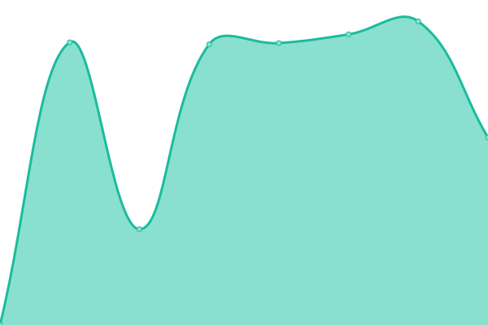

# [📈 Live Status](https://demo.upptime.js.org): <!--live status--> **🟧 Partial outage**

This repository contains the open-source uptime monitor and status page for [Patrick Little](Open.Canada.ca), powered by [Upptime](https://github.com/upptime/upptime).

With [Upptime](https://upptime.js.org), you can get your own unlimited and free uptime monitor and status page, powered entirely by a GitHub repository. We use [Issues](https://github.com/PatLittle/Consultations-Tracker/issues) as incident reports, [Actions](https://github.com/PatLittle/Consultations-Tracker/actions) as uptime monitors, and [Pages](https://demo.upptime.js.org) for the status page.

<!--start: status pages-->
<!-- This summary is generated by Upptime (https://github.com/upptime/upptime) -->
<!-- Do not edit this manually, your changes will be overwritten -->
<!-- prettier-ignore -->
| URL | Status | History | Response Time | Uptime |
| --- | ------ | ------- | ------------- | ------ |
|  [CBSA Assessment and Revenue Management (CARM) Information sessions on implementation](https://www.cbsa-asfc.gc.ca/prog/carm-gcra/menu-eng.html) | 🟩 Up | [cbsa-assessment-and-revenue-management-carm-information-sessions-on-implementation.yml](https://github.com/PatLittle/Consultations-Tracker/commits/HEAD/history/cbsa-assessment-and-revenue-management-carm-information-sessions-on-implementation.yml) | 

 305ms
     
 | 

<a href="https://PatLittle.github.io/Consultations-Tracker/history/cbsa-assessment-and-revenue-management-carm-information-sessions-on-implementation">100.00%</a>
    

|  [White River First Nations](https://www.rcaanc-cirnac.gc.ca/eng/1511969222951/1529103469169) | 🟩 Up | [white-river-first-nations.yml](https://github.com/PatLittle/Consultations-Tracker/commits/HEAD/history/white-river-first-nations.yml) | 

 566ms
     
 | 

<a href="https://PatLittle.github.io/Consultations-Tracker/history/white-river-first-nations">100.00%</a>
    

|  [Filing Manual Updates](https://www.cer-rec.gc.ca/en/applications-hearings/submit-applications-documents/filing-manuals/filing-manual/filing-manual-updates/index.html) | 🟩 Up | [filing-manual-updates.yml](https://github.com/PatLittle/Consultations-Tracker/commits/HEAD/history/filing-manual-updates.yml) | 

 665ms
     
 | 

<a href="https://PatLittle.github.io/Consultations-Tracker/history/filing-manual-updates">100.00%</a>
    

|  [Regulatory Framework Plan](https://www.cer-rec.gc.ca/en/about/how-we-regulate/plans-for-regulatory-framework/regulatory-framework-plan/index.html#s6) | 🟩 Up | [regulatory-framework-plan.yml](https://github.com/PatLittle/Consultations-Tracker/commits/HEAD/history/regulatory-framework-plan.yml) | 

 310ms
     
 | 

<a href="https://PatLittle.github.io/Consultations-Tracker/history/regulatory-framework-plan">100.00%</a>
    

|  [Regulated Industry Engagement: ](https://www.cer-rec.gc.ca/en/applications-hearings/submit-applications-documents/filing-manuals/filing-manual/filing-manual-updates/) | 🟩 Up | [regulated-industry-engagement.yml](https://github.com/PatLittle/Consultations-Tracker/commits/HEAD/history/regulated-industry-engagement.yml) | 

 296ms
     
 | 

<a href="https://PatLittle.github.io/Consultations-Tracker/history/regulated-industry-engagement">100.00%</a>
    

|  [Official language minority communities (External organizations)  ](https://www.canada.ca/en/revenue-agency/programs/about-canada-revenue-agency-cra/corporate-reports-information/consultations-official-language-minority-communities-across-canada.html) | 🟩 Up | [official-language-minority-communities-external-organizations.yml](https://github.com/PatLittle/Consultations-Tracker/commits/HEAD/history/official-language-minority-communities-external-organizations.yml) | 

 2335ms
     
 | 

<a href="https://PatLittle.github.io/Consultations-Tracker/history/official-language-minority-communities-external-organizations">100.00%</a>
    

|  [Notice of Intent: Amendment to the Safe Food for Canadians Regulations](https://inspection.canada.ca/about-cfia/acts-and-regulations/regulatory-initiatives-notices-of-intent/amendment-of-sfcr/eng/1673446782165/1673446782946) | 🟩 Up | [notice-of-intent-amendment-to-the-safe-food-for-canadians-regulations.yml](https://github.com/PatLittle/Consultations-Tracker/commits/HEAD/history/notice-of-intent-amendment-to-the-safe-food-for-canadians-regulations.yml) | 

 355ms
     
 | 

<a href="https://PatLittle.github.io/Consultations-Tracker/history/notice-of-intent-amendment-to-the-safe-food-for-canadians-regulations">100.00%</a>
    

|  [IPPC Member consultation on draft International Standards for Phytosanitary Measures and Implementation and Capacity Development Documents](https://inspection.canada.ca/importing-food-plants-or-animals/plant-and-plant-product-imports/international-plant-protection/eng/1307387838940/1307388165125#a3) | 🟩 Up | [ippc-member-consultation-on-draft-international-standards-for-phytosanitary-measures-and-implementation-and-capacity-development-documents.yml](https://github.com/PatLittle/Consultations-Tracker/commits/HEAD/history/ippc-member-consultation-on-draft-international-standards-for-phytosanitary-measures-and-implementation-and-capacity-development-documents.yml) | 

 82ms
     
 | 

<a href="https://PatLittle.github.io/Consultations-Tracker/history/ippc-member-consultation-on-draft-international-standards-for-phytosanitary-measures-and-implementation-and-capacity-development-documents">100.00%</a>
    

|  [Share your thoughts: Support the development of a new national-level potato wart response plan](N) | 🟥 Down | [share-your-thoughts-support-the-development-of-a-new-national-level-potato-wart-response-plan.yml](https://github.com/PatLittle/Consultations-Tracker/commits/HEAD/history/share-your-thoughts-support-the-development-of-a-new-national-level-potato-wart-response-plan.yml) | 

 0ms
     
 | 

<a href="https://PatLittle.github.io/Consultations-Tracker/history/share-your-thoughts-support-the-development-of-a-new-national-level-potato-wart-response-plan">100.00%</a>
    

|  [Share your thoughts: Proposed new livestock feed ingredient – 3-Nitrooxypropanol (3-NOP)](https://inspection.canada.ca/about-cfia/transparency/consultations-and-engagement/proposed-new-livestock-feed-ingredient-3-nitrooxyp/eng/1699286069890/1699286070639) | 🟩 Up | [share-your-thoughts-proposed-new-livestock-feed-ingredient-3-nitrooxypropanol-3-nop.yml](https://github.com/PatLittle/Consultations-Tracker/commits/HEAD/history/share-your-thoughts-proposed-new-livestock-feed-ingredient-3-nitrooxypropanol-3-nop.yml) | 

 79ms
     
 | 

<a href="https://PatLittle.github.io/Consultations-Tracker/history/share-your-thoughts-proposed-new-livestock-feed-ingredient-3-nitrooxypropanol-3-nop">100.00%</a>
    

|  [Changing Narrative Fund](https://www.canada.ca/en/canadian-heritage/campaigns/changing-narratives-fund.html) | 🟩 Up | [changing-narrative-fund.yml](https://github.com/PatLittle/Consultations-Tracker/commits/HEAD/history/changing-narrative-fund.yml) | 

 2191ms
     
 | 

<a href="https://PatLittle.github.io/Consultations-Tracker/history/changing-narrative-fund">100.00%</a>
    

|  [2022-23 Consultations on renewal of the Museum Policy](https://www.canada.ca/en/canadian-heritage/campaigns/renewal-museum-policy.html) | 🟩 Up | [2022-23-consultations-on-renewal-of-the-museum-policy.yml](https://github.com/PatLittle/Consultations-Tracker/commits/HEAD/history/2022-23-consultations-on-renewal-of-the-museum-policy.yml) | 

 1829ms
     
 | 

<a href="https://PatLittle.github.io/Consultations-Tracker/history/2022-23-consultations-on-renewal-of-the-museum-policy">100.00%</a>
    

|  [Regulatory Framework Plan](https://letstalknuclearsafety.ca/regulatory-framework-plan-2) | 🟩 Up | [regulatory-framework-plan.yml](https://github.com/PatLittle/Consultations-Tracker/commits/HEAD/history/regulatory-framework-plan.yml) | 

 310ms
     
 | 

<a href="https://PatLittle.github.io/Consultations-Tracker/history/regulatory-framework-plan">100.00%</a>
    

|  [Co-development of a new Indigenous Broadcasting Policy](https://crtc.gc.ca/eng/archive/2019/2019-217.htm) | 🟩 Up | [co-development-of-a-new-indigenous-broadcasting-policy.yml](https://github.com/PatLittle/Consultations-Tracker/commits/HEAD/history/co-development-of-a-new-indigenous-broadcasting-policy.yml) | 

 1257ms
     
 | 

<a href="https://PatLittle.github.io/Consultations-Tracker/history/co-development-of-a-new-indigenous-broadcasting-policy">100.00%</a>
    

|  [Consultation on telecommunications services in the Far North](https://crtc.gc.ca/eng/consultation/northwestel-norouestel.htm) | 🟩 Up | [consultation-on-telecommunications-services-in-the-far-north.yml](https://github.com/PatLittle/Consultations-Tracker/commits/HEAD/history/consultation-on-telecommunications-services-in-the-far-north.yml) | 

 0ms
     
 | 

<a href="https://PatLittle.github.io/Consultations-Tracker/history/consultation-on-telecommunications-services-in-the-far-north">100.00%</a>
    

|  [Enhancing the framing and parameters of GBA Plus](Not  available) | 🟥 Down | [enhancing-the-framing-and-parameters-of-gba-plus.yml](https://github.com/PatLittle/Consultations-Tracker/commits/HEAD/history/enhancing-the-framing-and-parameters-of-gba-plus.yml) | 

 0ms
     
 | 

<a href="https://PatLittle.github.io/Consultations-Tracker/history/enhancing-the-framing-and-parameters-of-gba-plus">100.00%</a>
    

|  [Bilateral funding agreements with Provinces and Territories on the implementation of the National Action Plan to End Gender-Based Violence](Not yet available) | 🟥 Down | [bilateral-funding-agreements-with-provinces-and-territories-on-the-implementation-of-the-national-action-plan-to-end-gender-based-violence.yml](https://github.com/PatLittle/Consultations-Tracker/commits/HEAD/history/bilateral-funding-agreements-with-provinces-and-territories-on-the-implementation-of-the-national-action-plan-to-end-gender-based-violence.yml) | 

 0ms
     
 | 

<a href="https://PatLittle.github.io/Consultations-Tracker/history/bilateral-funding-agreements-with-provinces-and-territories-on-the-implementation-of-the-national-action-plan-to-end-gender-based-violence">100.00%</a>
    

|  [The proposed acquisition of HSBC Bank Canada by the Royal Bank of Canada](https://www.canada.ca/en/department-finance/programs/consultations/2023/proposed-acquisition-of-hsbc-bank-canada-by-royal-bank-of-canada.html) | 🟩 Up | [the-proposed-acquisition-of-hsbc-bank-canada-by-the-royal-bank-of-canada.yml](https://github.com/PatLittle/Consultations-Tracker/commits/HEAD/history/the-proposed-acquisition-of-hsbc-bank-canada-by-the-royal-bank-of-canada.yml) | 

 1981ms
     
 | 

<a href="https://PatLittle.github.io/Consultations-Tracker/history/the-proposed-acquisition-of-hsbc-bank-canada-by-the-royal-bank-of-canada">100.00%</a>
    

|  [Consultation on Cracking Down on Predatory Lending Faster by Further Lowering the Criminal Rate of Interest and Increasing Access to Low-Cost Credit](https://www.canada.ca/en/department-finance/programs/consultations/2023/consultation-on-cracking-down-on-predatory-lending-faster-by-further-lowering-the-criminal-rate-of-interest-and-increasing-access-to-low-cost-credit.html) | 🟩 Up | [consultation-on-cracking-down-on-predatory-lending-faster-by-further-lowering-the-criminal-rate-of-interest-and-increasing-access-to-low-cost-credit.yml](https://github.com/PatLittle/Consultations-Tracker/commits/HEAD/history/consultation-on-cracking-down-on-predatory-lending-faster-by-further-lowering-the-criminal-rate-of-interest-and-increasing-access-to-low-cost-credit.yml) | 

 1393ms
     
 | 

<a href="https://PatLittle.github.io/Consultations-Tracker/history/consultation-on-cracking-down-on-predatory-lending-faster-by-further-lowering-the-criminal-rate-of-interest-and-increasing-access-to-low-cost-credit">100.00%</a>
    

|  [Consultation on Defending Canadian Businesses Against Foreign Tax Credit Restrictions](https://www.canada.ca/en/department-finance/programs/consultations/2023/consultation-on-defending-canadian-businesses-against-unfair-foreign-tax-credit-restrictions.html) | 🟩 Up | [consultation-on-defending-canadian-businesses-against-foreign-tax-credit-restrictions.yml](https://github.com/PatLittle/Consultations-Tracker/commits/HEAD/history/consultation-on-defending-canadian-businesses-against-foreign-tax-credit-restrictions.yml) | 

 2281ms
     
 | 

<a href="https://PatLittle.github.io/Consultations-Tracker/history/consultation-on-defending-canadian-businesses-against-foreign-tax-credit-restrictions">100.00%</a>
    

|  [Amendments to the Interpretation Act to add a non-derogation clause and to repeal some existing non-derogation clauses.](https://www.justice.gc.ca/eng/declaration/legislation.html#sb-5) | 🟩 Up | [amendments-to-the-interpretation-act-to-add-a-non-derogation-clause-and-to-repeal-some-existing-non-derogation-clauses.yml](https://github.com/PatLittle/Consultations-Tracker/commits/HEAD/history/amendments-to-the-interpretation-act-to-add-a-non-derogation-clause-and-to-repeal-some-existing-non-derogation-clauses.yml) | 

 464ms
     
 | 

<a href="https://PatLittle.github.io/Consultations-Tracker/history/amendments-to-the-interpretation-act-to-add-a-non-derogation-clause-and-to-repeal-some-existing-non-derogation-clauses">100.00%</a>
    

|  [Clean Fuel Standard](https://www.canada.ca/en/environment-climate-change/services/managing-pollution/energy-production/fuel-regulations/clean-fuel-standard.html) | 🟩 Up | [clean-fuel-standard.yml](https://github.com/PatLittle/Consultations-Tracker/commits/HEAD/history/clean-fuel-standard.yml) | 

 4014ms
     
 | 

<a href="https://PatLittle.github.io/Consultations-Tracker/history/clean-fuel-standard">100.00%</a>
    

|  [Consultation on the modernization of the Pulp and Paper Effluent Regulations](https://www.canada.ca/en/environment-climate-change/services/managing-pollution/fisheries-act-registry/consultation-modernization-pulp-paper-effluent-regulations.html) | 🟩 Up | [consultation-on-the-modernization-of-the-pulp-and-paper-effluent-regulations.yml](https://github.com/PatLittle/Consultations-Tracker/commits/HEAD/history/consultation-on-the-modernization-of-the-pulp-and-paper-effluent-regulations.yml) | 

 2156ms
     
 | 

<a href="https://PatLittle.github.io/Consultations-Tracker/history/consultation-on-the-modernization-of-the-pulp-and-paper-effluent-regulations">100.00%</a>
    

|  [Metal and Diamond Mining Effluent Regulations - Schedule 2 Amendments (Project: Blackwater)](Share your ideasBlackwater Project - Canada.ca) | 🟥 Down | [metal-and-diamond-mining-effluent-regulations-schedule-2-amendments-project-blackwater.yml](https://github.com/PatLittle/Consultations-Tracker/commits/HEAD/history/metal-and-diamond-mining-effluent-regulations-schedule-2-amendments-project-blackwater.yml) | 

 0ms
     
 | 

<a href="https://PatLittle.github.io/Consultations-Tracker/history/metal-and-diamond-mining-effluent-regulations-schedule-2-amendments-project-blackwater">100.00%</a>
    

|  [Share and view ideas: Renewal of the Federal Agenda for Volatile Organic Compounds in Consumer and Commercial Product](https://www.canada.ca/en/environment-climate-change/services/managing-pollution/sources-industry/volatile-organic-compounds-consumer-commercial/renewal-federal-agenda-volatile-organic-compound-consumer-commercial-product.html) | 🟩 Up | [share-and-view-ideas-renewal-of-the-federal-agenda-for-volatile-organic-compounds-in-consumer-and-commercial-product.yml](https://github.com/PatLittle/Consultations-Tracker/commits/HEAD/history/share-and-view-ideas-renewal-of-the-federal-agenda-for-volatile-organic-compounds-in-consumer-and-commercial-product.yml) | 

 0ms
     
 | 

<a href="https://PatLittle.github.io/Consultations-Tracker/history/share-and-view-ideas-renewal-of-the-federal-agenda-for-volatile-organic-compounds-in-consumer-and-commercial-product">100.00%</a>
    

|  [Share your ideas: Blackwater Project](https://www.canada.ca/en/environment-climate-change/services/managing-pollution/sources-industry/mining/metal-diamond-mining-effluent-regulation/blackwater-consultation.html) | 🟥 Down | [share-your-ideas-blackwater-project.yml](https://github.com/PatLittle/Consultations-Tracker/commits/HEAD/history/share-your-ideas-blackwater-project.yml) | 

 2011ms
     
 | 

<a href="https://PatLittle.github.io/Consultations-Tracker/history/share-your-ideas-blackwater-project">100.00%</a>
    

|  [Share ideas: Mont-Wright Mining Project (Dyno Basin)](https://canada.ca/en/environment-climate-change/services/managing-pollution/sources-industry/mining/metal-diamond-mining-effluent-regulation/basin-dyno-consultation.html) | 🟥 Down | [share-ideas-mont-wright-mining-project-dyno-basin.yml](https://github.com/PatLittle/Consultations-Tracker/commits/HEAD/history/share-ideas-mont-wright-mining-project-dyno-basin.yml) | 

 2249ms
     
 | 

<a href="https://PatLittle.github.io/Consultations-Tracker/history/share-ideas-mont-wright-mining-project-dyno-basin">100.00%</a>
    

|  [Recovery Strategy (Amended) and Action Plan for the Piping Plover melodus subspecies (Charadrius melodus melodus) in Canada [Proposed]](https://registre-especes.canada.ca/index-fr.html#/documents/923) | 🟩 Up | [recovery-strategy-amended-and-action-plan-for-the-piping-plover-melodus-subspecies-charadrius-melodus-melodus-in-canada-proposed.yml](https://github.com/PatLittle/Consultations-Tracker/commits/HEAD/history/recovery-strategy-amended-and-action-plan-for-the-piping-plover-melodus-subspecies-charadrius-melodus-melodus-in-canada-proposed.yml) | 

 0ms
     
 | 

<a href="https://PatLittle.github.io/Consultations-Tracker/history/recovery-strategy-amended-and-action-plan-for-the-piping-plover-melodus-subspecies-charadrius-melodus-melodus-in-canada-proposed">100.00%</a>
    

|  [Metal and Diamond Mining Effluent Regulations - Schedule 2 Amendments (Project: Macassa)](https://www.canada.ca/en/environment-climate-change/corporate/transparency/consultations/macassa-project-consultation.html) | 🟩 Up | [metal-and-diamond-mining-effluent-regulations-schedule-2-amendments-project-macassa.yml](https://github.com/PatLittle/Consultations-Tracker/commits/HEAD/history/metal-and-diamond-mining-effluent-regulations-schedule-2-amendments-project-macassa.yml) | 

 2136ms
     
 | 

<a href="https://PatLittle.github.io/Consultations-Tracker/history/metal-and-diamond-mining-effluent-regulations-schedule-2-amendments-project-macassa">100.00%</a>
    

|  [Let's Talk Weather](https://www.canada.ca/en/services/environment/weather/lets-talk-weather-consultation.html) | 🟩 Up | [let-s-talk-weather.yml](https://github.com/PatLittle/Consultations-Tracker/commits/HEAD/history/let-s-talk-weather.yml) | 

 1884ms
     
 | 

<a href="https://PatLittle.github.io/Consultations-Tracker/history/let-s-talk-weather">100.00%</a>
    

|  [Share your thoughts: New Substances Notification Regulations (Organisms) consultation](https://www.canada.ca/en/environment-climate-change/corporate/transparency/consultations/new-substance-notification.html) | 🟩 Up | [share-your-thoughts-new-substances-notification-regulations-organisms-consultation.yml](https://github.com/PatLittle/Consultations-Tracker/commits/HEAD/history/share-your-thoughts-new-substances-notification-regulations-organisms-consultation.yml) | 

 2045ms
     
 | 

<a href="https://PatLittle.github.io/Consultations-Tracker/history/share-your-thoughts-new-substances-notification-regulations-organisms-consultation">100.00%</a>
    

|  [Share your ideas: Proposed amendments to the Volatile Organic Compound (VOC) Concentration Limits for Architectural Coatings Regulations ](https://www.canada.ca/en/environment-climate-change/services/managing-pollution/sources-industry/volatile-organic-compounds-consumer-commercial/consultation-architectural-coatings-regulations/architectural-coatings.html) | 🟩 Up | [share-your-ideas-proposed-amendments-to-the-volatile-organic-compound-voc-concentration-limits-for-architectural-coatings-regulations.yml](https://github.com/PatLittle/Consultations-Tracker/commits/HEAD/history/share-your-ideas-proposed-amendments-to-the-volatile-organic-compound-voc-concentration-limits-for-architectural-coatings-regulations.yml) | 

 1826ms
     
 | 

<a href="https://PatLittle.github.io/Consultations-Tracker/history/share-your-ideas-proposed-amendments-to-the-volatile-organic-compound-voc-concentration-limits-for-architectural-coatings-regulations">100.00%</a>
    

|  [Notice of intent on the labelling of toxic substances in products, including toxic flame retardants](https://www.canada.ca/en/environment-climate-change/corporate/transparency/consultations/labelling-toxic.html) | 🟩 Up | [notice-of-intent-on-the-labelling-of-toxic-substances-in-products-including-toxic-flame-retardants.yml](https://github.com/PatLittle/Consultations-Tracker/commits/HEAD/history/notice-of-intent-on-the-labelling-of-toxic-substances-in-products-including-toxic-flame-retardants.yml) | 

 0ms
     
 | 

<a href="https://PatLittle.github.io/Consultations-Tracker/history/notice-of-intent-on-the-labelling-of-toxic-substances-in-products-including-toxic-flame-retardants">100.00%</a>
    

|  [Offsetting Policy for Biodiversity](https://www.canada.ca/en/environment-climate-change/services/biodiversity/share-view-ideas-offsetting-policy-biodiversity.html ) | 🟥 Down | [offsetting-policy-for-biodiversity.yml](https://github.com/PatLittle/Consultations-Tracker/commits/HEAD/history/offsetting-policy-for-biodiversity.yml) | 

 0ms
     
 | 

<a href="https://PatLittle.github.io/Consultations-Tracker/history/offsetting-policy-for-biodiversity">100.00%</a>
    

|  [Consultations on Canada's 2030 Biodiversity Strategy](https://www.canada.ca/en/services/environment/wildlife-plants-species/biodiversity.html) | 🟩 Up | [consultations-on-canada-s-2030-biodiversity-strategy.yml](https://github.com/PatLittle/Consultations-Tracker/commits/HEAD/history/consultations-on-canada-s-2030-biodiversity-strategy.yml) | 

 2632ms
     
 | 

<a href="https://PatLittle.github.io/Consultations-Tracker/history/consultations-on-canada-s-2030-biodiversity-strategy">100.00%</a>
    

|  [Draft Canada-US Lake Huron Lakewide Action & Management Plan](https://binational.net/2023/03/13/2022-2026-lake-huron-lakewide-action-and-management-plan-available-for-public-review-and-comment/) | 🟥 Down | [draft-canada-us-lake-huron-lakewide-action-and-management-plan.yml](https://github.com/PatLittle/Consultations-Tracker/commits/HEAD/history/draft-canada-us-lake-huron-lakewide-action-and-management-plan.yml) | 

 0ms
     
 | 

<a href="https://PatLittle.github.io/Consultations-Tracker/history/draft-canada-us-lake-huron-lakewide-action-and-management-plan">100.00%</a>
    

|  [Share your thoughts: Proposed amendments to the Cross-Border Movement of Hazardous Waste and Hazardous Recyclable Material Regulations](https://www.canada.ca/en/environment-climate-change/services/managing-reducing-waste/consultations/cross-border-movement.html) | 🟩 Up | [share-your-thoughts-proposed-amendments-to-the-cross-border-movement-of-hazardous-waste-and-hazardous-recyclable-material-regulations.yml](https://github.com/PatLittle/Consultations-Tracker/commits/HEAD/history/share-your-thoughts-proposed-amendments-to-the-cross-border-movement-of-hazardous-waste-and-hazardous-recyclable-material-regulations.yml) | 

 2363ms
     
 | 

<a href="https://PatLittle.github.io/Consultations-Tracker/history/share-your-thoughts-proposed-amendments-to-the-cross-border-movement-of-hazardous-waste-and-hazardous-recyclable-material-regulations">100.00%</a>
    

|  [Share your thoughts: Proposed amended Guidelines for the Reduction of Dyes Released from Pulp and Paper Mills](https://www.canada.ca/en/environment-climate-change/corporate/transparency/consultations/proposed-guidelines-reduction-dyes.html ) | 🟥 Down | [share-your-thoughts-proposed-amended-guidelines-for-the-reduction-of-dyes-released-from-pulp-and-paper-mills.yml](https://github.com/PatLittle/Consultations-Tracker/commits/HEAD/history/share-your-thoughts-proposed-amended-guidelines-for-the-reduction-of-dyes-released-from-pulp-and-paper-mills.yml) | 

 0ms
     
 | 

<a href="https://PatLittle.github.io/Consultations-Tracker/history/share-your-thoughts-proposed-amended-guidelines-for-the-reduction-of-dyes-released-from-pulp-and-paper-mills">100.00%</a>
    

|  [Share your thoughts: Draft State of Per- and Polyfluoroalkyl Substances (PFAS) Report and Risk Management Scope](https://www.canada.ca/en/environment-climate-change/corporate/transparency/consultations/draft-state-pfas-report.html ) | 🟥 Down | [share-your-thoughts-draft-state-of-per-and-polyfluoroalkyl-substances-pfas-report-and-risk-management-scope.yml](https://github.com/PatLittle/Consultations-Tracker/commits/HEAD/history/share-your-thoughts-draft-state-of-per-and-polyfluoroalkyl-substances-pfas-report-and-risk-management-scope.yml) | 

 0ms
     
 | 

<a href="https://PatLittle.github.io/Consultations-Tracker/history/share-your-thoughts-draft-state-of-per-and-polyfluoroalkyl-substances-pfas-report-and-risk-management-scope">100.00%</a>
    

|  [Share and view ideas: Proposed amendments to the Wastewater Systems Effluent Regulations](https://www.canada.ca/en/environment-climate-change/services/wastewater/consultations-wastewater.html) | 🟩 Up | [share-and-view-ideas-proposed-amendments-to-the-wastewater-systems-effluent-regulations.yml](https://github.com/PatLittle/Consultations-Tracker/commits/HEAD/history/share-and-view-ideas-proposed-amendments-to-the-wastewater-systems-effluent-regulations.yml) | 

 2314ms
     
 | 

<a href="https://PatLittle.github.io/Consultations-Tracker/history/share-and-view-ideas-proposed-amendments-to-the-wastewater-systems-effluent-regulations">100.00%</a>
    

|  [Share your ideas: Amendments to the Metal and Diamond Mining Effluent Regulations for the Dome Mine](https://www.canada.ca/en/environment-climate-change/corporate/transparency/consultations/dome-mine-project.html) | 🟩 Up | [share-your-ideas-amendments-to-the-metal-and-diamond-mining-effluent-regulations-for-the-dome-mine.yml](https://github.com/PatLittle/Consultations-Tracker/commits/HEAD/history/share-your-ideas-amendments-to-the-metal-and-diamond-mining-effluent-regulations-for-the-dome-mine.yml) | 

 1708ms
     
 | 

<a href="https://PatLittle.github.io/Consultations-Tracker/history/share-your-ideas-amendments-to-the-metal-and-diamond-mining-effluent-regulations-for-the-dome-mine">100.00%</a>
    

|  [Oil sands mining effluent](https://www.canada.ca/en/environment-climate-change/services/managing-pollution/sources-industry/mining-effluent/oil-sands.html ) | 🟥 Down | [oil-sands-mining-effluent.yml](https://github.com/PatLittle/Consultations-Tracker/commits/HEAD/history/oil-sands-mining-effluent.yml) | 

 0ms
     
 | 

<a href="https://PatLittle.github.io/Consultations-Tracker/history/oil-sands-mining-effluent">100.00%</a>
    

|  [Share your ideas: Assessing phosphorus targets for Lake Ontario](https://www.canada.ca/en/environment-climate-change/corporate/transparency/consultations/consultation-phosphorus-lake-ontario.html) | 🟩 Up | [share-your-ideas-assessing-phosphorus-targets-for-lake-ontario.yml](https://github.com/PatLittle/Consultations-Tracker/commits/HEAD/history/share-your-ideas-assessing-phosphorus-targets-for-lake-ontario.yml) | 

 2335ms
     
 | 

<a href="https://PatLittle.github.io/Consultations-Tracker/history/share-your-ideas-assessing-phosphorus-targets-for-lake-ontario">100.00%</a>
    

|  [Development of a pollution prevention (P2) planning notice for primary food plastic packaging](https://www.canada.ca/en/environment-climate-change/corporate/transparency/consultations/pollution-prevention-planning-notice-plastic-primary-food-packaging.html) | 🟩 Up | [development-of-a-pollution-prevention-p2-planning-notice-for-primary-food-plastic-packaging.yml](https://github.com/PatLittle/Consultations-Tracker/commits/HEAD/history/development-of-a-pollution-prevention-p2-planning-notice-for-primary-food-plastic-packaging.yml) | 

 1744ms
     
 | 

<a href="https://PatLittle.github.io/Consultations-Tracker/history/development-of-a-pollution-prevention-p2-planning-notice-for-primary-food-plastic-packaging">100.00%</a>
    

|  [Participate in the risk assessment process for the EntoEngine fly producing human FGF2](https://www.canada.ca/en/environment-climate-change/corporate/transparency/consultations/entoengine-2.html) | 🟩 Up | [participate-in-the-risk-assessment-process-for-the-ento-engine-fly-producing-human-fgf-2.yml](https://github.com/PatLittle/Consultations-Tracker/commits/HEAD/history/participate-in-the-risk-assessment-process-for-the-ento-engine-fly-producing-human-fgf-2.yml) | 

 0ms
     
 | 

<a href="https://PatLittle.github.io/Consultations-Tracker/history/participate-in-the-risk-assessment-process-for-the-ento-engine-fly-producing-human-fgf-2">100.00%</a>
    

|  [Proposed Amendments to the Cross-Border Movement of Hazardous Waste and Hazardous Recyclable Materials Regulations ](https://www.canada.ca/en/environment-climate-change/services/managing-reducing-waste/consultations/proposed-regulations-amending-certain-regulations-department-environment-cross-border-movement.html) | 🟩 Up | [proposed-amendments-to-the-cross-border-movement-of-hazardous-waste-and-hazardous-recyclable-materials-regulations.yml](https://github.com/PatLittle/Consultations-Tracker/commits/HEAD/history/proposed-amendments-to-the-cross-border-movement-of-hazardous-waste-and-hazardous-recyclable-materials-regulations.yml) | 

 1994ms
     
 | 

<a href="https://PatLittle.github.io/Consultations-Tracker/history/proposed-amendments-to-the-cross-border-movement-of-hazardous-waste-and-hazardous-recyclable-materials-regulations">100.00%</a>
    

|  [Consultation on FCAC's proposed Guideline on Complaint-Handling Procedures for Trust and Loan Companies and Insurance Companies](https://www.canada.ca/en/financial-consumer-agency/corporate/transparency/consultations/complaint-handling-procedures-trust-loan-insurance.html) | 🟩 Up | [consultation-on-fcac-s-proposed-guideline-on-complaint-handling-procedures-for-trust-and-loan-companies-and-insurance-companies.yml](https://github.com/PatLittle/Consultations-Tracker/commits/HEAD/history/consultation-on-fcac-s-proposed-guideline-on-complaint-handling-procedures-for-trust-and-loan-companies-and-insurance-companies.yml) | 

 2137ms
     
 | 

<a href="https://PatLittle.github.io/Consultations-Tracker/history/consultation-on-fcac-s-proposed-guideline-on-complaint-handling-procedures-for-trust-and-loan-companies-and-insurance-companies">100.00%</a>
    

|  [Eastern Shore Islands Area of Interest Consultations ](http://www.dfo-mpo.gc.ca/oceans/consultations/easternshore-ilescoteest/index-eng.html) | 🟩 Up | [eastern-shore-islands-area-of-interest-consultations.yml](https://github.com/PatLittle/Consultations-Tracker/commits/HEAD/history/eastern-shore-islands-area-of-interest-consultations.yml) | 

 517ms
     
 | 

<a href="https://PatLittle.github.io/Consultations-Tracker/history/eastern-shore-islands-area-of-interest-consultations">100.00%</a>
    

|  [St. Lawrence Estuary Area of Interest ](https://www.dfo-mpo.gc.ca/oceans/canada-quebec-agreement-entente/index-eng.html) | 🟩 Up | [st-lawrence-estuary-area-of-interest.yml](https://github.com/PatLittle/Consultations-Tracker/commits/HEAD/history/st-lawrence-estuary-area-of-interest.yml) | 

 368ms
     
 | 

<a href="https://PatLittle.github.io/Consultations-Tracker/history/st-lawrence-estuary-area-of-interest">100.00%</a>
    

|  [Northern Gulf of St. Lawrence Study Area](https://www.dfo-mpo.gc.ca/oceans/canada-quebec-agreement-entente/index-eng.html) | 🟩 Up | [northern-gulf-of-st-lawrence-study-area.yml](https://github.com/PatLittle/Consultations-Tracker/commits/HEAD/history/northern-gulf-of-st-lawrence-study-area.yml) | 

 186ms
     
 | 

<a href="https://PatLittle.github.io/Consultations-Tracker/history/northern-gulf-of-st-lawrence-study-area">100.00%</a>
    

|  [Fundian Channel- Browns Bank Area of Interest ](https://www.dfo-mpo.gc.ca/oceans/aoi-si/fundian-fundy-browns-eng.html) | 🟩 Up | [fundian-channel-browns-bank-area-of-interest.yml](https://github.com/PatLittle/Consultations-Tracker/commits/HEAD/history/fundian-channel-browns-bank-area-of-interest.yml) | 

 221ms
     
 | 

<a href="https://PatLittle.github.io/Consultations-Tracker/history/fundian-channel-browns-bank-area-of-interest">100.00%</a>
    

|  [Aquaculture Activities Regulations (AAR)](https://www.dfo-mpo.gc.ca/aquaculture/management-gestion/aar-raa-eng.htm) | 🟩 Up | [aquaculture-activities-regulations-aar.yml](https://github.com/PatLittle/Consultations-Tracker/commits/HEAD/history/aquaculture-activities-regulations-aar.yml) | 

 119ms
     
 | 

<a href="https://PatLittle.github.io/Consultations-Tracker/history/aquaculture-activities-regulations-aar">100.00%</a>
    

|  [Let's talk Pacific Salmon](https://letstalkpacificsalmon.ca/) | 🟩 Up | [let-s-talk-pacific-salmon.yml](https://github.com/PatLittle/Consultations-Tracker/commits/HEAD/history/let-s-talk-pacific-salmon.yml) | 

 1694ms
     
 | 

<a href="https://PatLittle.github.io/Consultations-Tracker/history/let-s-talk-pacific-salmon">100.00%</a>
    

|  [Proposed ticketing for the enforcement of a fisheries offence under the Fisheries Act](TBD) | 🟥 Down | [proposed-ticketing-for-the-enforcement-of-a-fisheries-offence-under-the-fisheries-act.yml](https://github.com/PatLittle/Consultations-Tracker/commits/HEAD/history/proposed-ticketing-for-the-enforcement-of-a-fisheries-offence-under-the-fisheries-act.yml) | 

 0ms
     
 | 

<a href="https://PatLittle.github.io/Consultations-Tracker/history/proposed-ticketing-for-the-enforcement-of-a-fisheries-offence-under-the-fisheries-act">100.00%</a>
    

|  [Wave 3-Engagement on Policy and Regulatory Initiatives – Fish and Fish Habitat Protection](http://www.talkfishhabitat.ca) | 🟩 Up | [wave-3-engagement-on-policy-and-regulatory-initiatives-fish-and-fish-habitat-protection.yml](https://github.com/PatLittle/Consultations-Tracker/commits/HEAD/history/wave-3-engagement-on-policy-and-regulatory-initiatives-fish-and-fish-habitat-protection.yml) | 

 1402ms
     
 | 

<a href="https://PatLittle.github.io/Consultations-Tracker/history/wave-3-engagement-on-policy-and-regulatory-initiatives-fish-and-fish-habitat-protection">100.00%</a>
    

|  [Tang.ɢwan — ḥačxwiqak — Tsiǥis Marine Protected Area (Offshore Pacific)](https://www.canadagazette.gc.ca/rp-pr/p1/2023/2023-02-18/html/reg5-eng.html) | 🟩 Up | [tang-wan-acxwiqak-tsi-is-marine-protected-area-offshore-pacific.yml](https://github.com/PatLittle/Consultations-Tracker/commits/HEAD/history/tang-wan-acxwiqak-tsi-is-marine-protected-area-offshore-pacific.yml) | 

 348ms
     
 | 

<a href="https://PatLittle.github.io/Consultations-Tracker/history/tang-wan-acxwiqak-tsi-is-marine-protected-area-offshore-pacific">100.00%</a>
    

|  [Conservation Network Development](https://www.dfo-mpo.gc.ca/oceans/networks-reseaux/development-developpement-eng.html) | 🟩 Up | [conservation-network-development.yml](https://github.com/PatLittle/Consultations-Tracker/commits/HEAD/history/conservation-network-development.yml) | 

 286ms
     
 | 

<a href="https://PatLittle.github.io/Consultations-Tracker/history/conservation-network-development">100.00%</a>
    

|  [Whitby Harbour Remediation Project](https://www.dfo-mpo.gc.ca/sch-ppb/whitby/index-eng.html) | 🟩 Up | [whitby-harbour-remediation-project.yml](https://github.com/PatLittle/Consultations-Tracker/commits/HEAD/history/whitby-harbour-remediation-project.yml) | 

 191ms
     
 | 

<a href="https://PatLittle.github.io/Consultations-Tracker/history/whitby-harbour-remediation-project">100.00%</a>
    

|  [Discussion framework for a BC aquaculture open-net pen transition plan](https://www.pac.dfo-mpo.gc.ca/consultation/aquaculture/bc-transition-cb/index-eng.html) | 🟩 Up | [discussion-framework-for-a-bc-aquaculture-open-net-pen-transition-plan.yml](https://github.com/PatLittle/Consultations-Tracker/commits/HEAD/history/discussion-framework-for-a-bc-aquaculture-open-net-pen-transition-plan.yml) | 

 524ms
     
 | 

<a href="https://PatLittle.github.io/Consultations-Tracker/history/discussion-framework-for-a-bc-aquaculture-open-net-pen-transition-plan">100.00%</a>
    

|  [Consultation on a regulatory proposal to prescribe stocks to the Fish Stocks provisions](To be determined) | 🟥 Down | [consultation-on-a-regulatory-proposal-to-prescribe-stocks-to-the-fish-stocks-provisions.yml](https://github.com/PatLittle/Consultations-Tracker/commits/HEAD/history/consultation-on-a-regulatory-proposal-to-prescribe-stocks-to-the-fish-stocks-provisions.yml) | 

 0ms
     
 | 

<a href="https://PatLittle.github.io/Consultations-Tracker/history/consultation-on-a-regulatory-proposal-to-prescribe-stocks-to-the-fish-stocks-provisions">100.00%</a>
    

|  [Rope-on-Demand/Ropeless Fishing Systems Manufacturers Meeting ](https://www.dfo-mpo.gc.ca/species-especes/mammals-mammiferes/whales-baleines/gear-equipement/index-eng.html) | 🟩 Up | [rope-on-demand-ropeless-fishing-systems-manufacturers-meeting.yml](https://github.com/PatLittle/Consultations-Tracker/commits/HEAD/history/rope-on-demand-ropeless-fishing-systems-manufacturers-meeting.yml) | 

 152ms
     
 | 

<a href="https://PatLittle.github.io/Consultations-Tracker/history/rope-on-demand-ropeless-fishing-systems-manufacturers-meeting">100.00%</a>
    

|  [Consultation check-in on 14 aquatic species under consideration for addition or reclassification to Schedule 1 of the Species at Risk Act](https://www.canada.ca/en/environment-climate-change/services/species-risk-public-registry/consultation-documents/check-in-14-aquatic.html) | 🟩 Up | [consultation-check-in-on-14-aquatic-species-under-consideration-for-addition-or-reclassification-to-schedule-1-of-the-species-at-risk-act.yml](https://github.com/PatLittle/Consultations-Tracker/commits/HEAD/history/consultation-check-in-on-14-aquatic-species-under-consideration-for-addition-or-reclassification-to-schedule-1-of-the-species-at-risk-act.yml) | 

 2033ms
     
 | 

<a href="https://PatLittle.github.io/Consultations-Tracker/history/consultation-check-in-on-14-aquatic-species-under-consideration-for-addition-or-reclassification-to-schedule-1-of-the-species-at-risk-act">100.00%</a>
    

|  [Potential 2023 management measures to address key threats to Southern Resident Killer Whales](https://www.pac.dfo-mpo.gc.ca/fm-gp/mammals-mammiferes/whales-baleines/srkw-measures-mesures-ers-eng.html) | 🟩 Up | [potential-2023-management-measures-to-address-key-threats-to-southern-resident-killer-whales.yml](https://github.com/PatLittle/Consultations-Tracker/commits/HEAD/history/potential-2023-management-measures-to-address-key-threats-to-southern-resident-killer-whales.yml) | 

 164ms
     
 | 

<a href="https://PatLittle.github.io/Consultations-Tracker/history/potential-2023-management-measures-to-address-key-threats-to-southern-resident-killer-whales">100.00%</a>
    

|  [Draft Ocean Noise Strategy for Canada](http://www.dfo-mpo.gc.ca/oceans/consultations/noise-bruit/index-eng.html) | 🟩 Up | [draft-ocean-noise-strategy-for-canada.yml](https://github.com/PatLittle/Consultations-Tracker/commits/HEAD/history/draft-ocean-noise-strategy-for-canada.yml) | 

 210ms
     
 | 

<a href="https://PatLittle.github.io/Consultations-Tracker/history/draft-ocean-noise-strategy-for-canada">100.00%</a>
    

|  [Wave 3 - Engagement on Policy and Regulatory Initiatives – Fish and Fish Habitat Protection](http://www.talkfishhabitat.ca) | 🟩 Up | [wave-3-engagement-on-policy-and-regulatory-initiatives-fish-and-fish-habitat-protection.yml](https://github.com/PatLittle/Consultations-Tracker/commits/HEAD/history/wave-3-engagement-on-policy-and-regulatory-initiatives-fish-and-fish-habitat-protection.yml) | 

 1402ms
     
 | 

<a href="https://PatLittle.github.io/Consultations-Tracker/history/wave-3-engagement-on-policy-and-regulatory-initiatives-fish-and-fish-habitat-protection">100.00%</a>
    

|  [Revision of the management plan for Banc-des-Américains Marine Protected Area (MPA)](https://www.dfo-mpo.gc.ca/oceans/mpa-zpm/american-americains/index-eng.html) | 🟩 Up | [revision-of-the-management-plan-for-banc-des-americains-marine-protected-area-mpa.yml](https://github.com/PatLittle/Consultations-Tracker/commits/HEAD/history/revision-of-the-management-plan-for-banc-des-americains-marine-protected-area-mpa.yml) | 

 307ms
     
 | 

<a href="https://PatLittle.github.io/Consultations-Tracker/history/revision-of-the-management-plan-for-banc-des-americains-marine-protected-area-mpa">100.00%</a>
    

|  [Harrington Harbor hauling slip repair](https://iaac-aeic.gc.ca/050/evaluations/proj/84543?culture=en-CA) | 🟩 Up | [harrington-harbor-hauling-slip-repair.yml](https://github.com/PatLittle/Consultations-Tracker/commits/HEAD/history/harrington-harbor-hauling-slip-repair.yml) | 

 1086ms
     
 | 

<a href="https://PatLittle.github.io/Consultations-Tracker/history/harrington-harbor-hauling-slip-repair">100.00%</a>
    

|  [Tang.ɢwan — ḥačxwiqak — Tsiǥis Marine Protected Area (Offshore Pacific)](https://www.canadagazette.gc.ca/rp-pr/p1/2023/2023-02-18/html/reg5-eng.html) | 🟩 Up | [tang-wan-acxwiqak-tsi-is-marine-protected-area-offshore-pacific.yml](https://github.com/PatLittle/Consultations-Tracker/commits/HEAD/history/tang-wan-acxwiqak-tsi-is-marine-protected-area-offshore-pacific.yml) | 

 348ms
     
 | 

<a href="https://PatLittle.github.io/Consultations-Tracker/history/tang-wan-acxwiqak-tsi-is-marine-protected-area-offshore-pacific">100.00%</a>
    

|  [Elver Fishery Management Review](https://www.dfo-mpo.gc.ca/fisheries-peches/ifmp-gmp/elver-anguille/index-eng.html) | 🟩 Up | [elver-fishery-management-review.yml](https://github.com/PatLittle/Consultations-Tracker/commits/HEAD/history/elver-fishery-management-review.yml) | 

 544ms
     
 | 

<a href="https://PatLittle.github.io/Consultations-Tracker/history/elver-fishery-management-review">100.00%</a>
    

|  [Marine Spatial Planning ](https://www.dfo-mpo.gc.ca/oceans/planning-planification/index-eng.html) | 🟩 Up | [marine-spatial-planning.yml](https://github.com/PatLittle/Consultations-Tracker/commits/HEAD/history/marine-spatial-planning.yml) | 

 72ms
     
 | 

<a href="https://PatLittle.github.io/Consultations-Tracker/history/marine-spatial-planning">100.00%</a>
    

|  [Management Plan for the Mapleleaf (Quadrula quadrula) Great Lakes – Upper St. Lawrence Population, and Rainbow (Villosa iris) in Canada](https://wildlife-species.canada.ca/species-risk-registry/involved/consultation/default_e.cfm) | 🟩 Up | [management-plan-for-the-mapleleaf-quadrula-quadrula-great-lakes-upper-st-lawrence-population-and-rainbow-villosa-iris-in-canada.yml](https://github.com/PatLittle/Consultations-Tracker/commits/HEAD/history/management-plan-for-the-mapleleaf-quadrula-quadrula-great-lakes-upper-st-lawrence-population-and-rainbow-villosa-iris-in-canada.yml) | 

 0ms
     
 | 

<a href="https://PatLittle.github.io/Consultations-Tracker/history/management-plan-for-the-mapleleaf-quadrula-quadrula-great-lakes-upper-st-lawrence-population-and-rainbow-villosa-iris-in-canada">100.00%</a>
    

|  [Management Plan for the Northern Sunfish (Lepomis peltastes) in Canada (Great Lakes – Upper St. Lawrence Populations) ](https://www.registrelep-sararegistry.gc.ca/document/default_e.cfm?documentID=173) | 🟩 Up | [management-plan-for-the-northern-sunfish-lepomis-peltastes-in-canada-great-lakes-upper-st-lawrence-populations.yml](https://github.com/PatLittle/Consultations-Tracker/commits/HEAD/history/management-plan-for-the-northern-sunfish-lepomis-peltastes-in-canada-great-lakes-upper-st-lawrence-populations.yml) | 

 0ms
     
 | 

<a href="https://PatLittle.github.io/Consultations-Tracker/history/management-plan-for-the-northern-sunfish-lepomis-peltastes-in-canada-great-lakes-upper-st-lawrence-populations">100.00%</a>
    

|  [Addition of a line of floating pontoons and the riprap to breakwater 301 at Grosse-Île harbour, Magdalen Islands](https://iaac-aeic.gc.ca/050/evaluations/proj/86003?culture=en-CA) | 🟩 Up | [addition-of-a-line-of-floating-pontoons-and-the-riprap-to-breakwater-301-at-grosse-ile-harbour-magdalen-islands.yml](https://github.com/PatLittle/Consultations-Tracker/commits/HEAD/history/addition-of-a-line-of-floating-pontoons-and-the-riprap-to-breakwater-301-at-grosse-ile-harbour-magdalen-islands.yml) | 

 822ms
     
 | 

<a href="https://PatLittle.github.io/Consultations-Tracker/history/addition-of-a-line-of-floating-pontoons-and-the-riprap-to-breakwater-301-at-grosse-ile-harbour-magdalen-islands">100.00%</a>
    

|  [Relocation of the line of floating pontoons at Entry Island Harbour](https://iaac-aeic.gc.ca/050/evaluations/proj/85998?culture=en-CA) | 🟩 Up | [relocation-of-the-line-of-floating-pontoons-at-entry-island-harbour.yml](https://github.com/PatLittle/Consultations-Tracker/commits/HEAD/history/relocation-of-the-line-of-floating-pontoons-at-entry-island-harbour.yml) | 

 1330ms
     
 | 

<a href="https://PatLittle.github.io/Consultations-Tracker/history/relocation-of-the-line-of-floating-pontoons-at-entry-island-harbour">100.00%</a>
    

|  [Listing of Lumpfish, Ringed Seal and Harbour Porpoise on the Species at Risk public registry](Species at risk public registry - Canada.ca) | 🟥 Down | [listing-of-lumpfish-ringed-seal-and-harbour-porpoise-on-the-species-at-risk-public-registry.yml](https://github.com/PatLittle/Consultations-Tracker/commits/HEAD/history/listing-of-lumpfish-ringed-seal-and-harbour-porpoise-on-the-species-at-risk-public-registry.yml) | 

 0ms
     
 | 

<a href="https://PatLittle.github.io/Consultations-Tracker/history/listing-of-lumpfish-ringed-seal-and-harbour-porpoise-on-the-species-at-risk-public-registry">100.00%</a>
    

|  [Proposed Amendments to the Export Permits Regulations](https://www.international.gc.ca/trade-commerce/controls-controles/expor/backgrounder-amendments-epr-information-modification-rle.aspx?lang=eng) | 🟩 Up | [proposed-amendments-to-the-export-permits-regulations.yml](https://github.com/PatLittle/Consultations-Tracker/commits/HEAD/history/proposed-amendments-to-the-export-permits-regulations.yml) | 

 450ms
     
 | 

<a href="https://PatLittle.github.io/Consultations-Tracker/history/proposed-amendments-to-the-export-permits-regulations">100.00%</a>
    

|  [Canada’s participation in treaty negotiations on artificial intelligence at the Council of Europe](https://www.international.gc.ca/consultation/artificial-intelligence-artificielle/index.aspx?lang=eng) | 🟩 Up | [canada-s-participation-in-treaty-negotiations-on-artificial-intelligence-at-the-council-of-europe.yml](https://github.com/PatLittle/Consultations-Tracker/commits/HEAD/history/canada-s-participation-in-treaty-negotiations-on-artificial-intelligence-at-the-council-of-europe.yml) | 

 0ms
     
 | 

<a href="https://PatLittle.github.io/Consultations-Tracker/history/canada-s-participation-in-treaty-negotiations-on-artificial-intelligence-at-the-council-of-europe">100.00%</a>
    

|  [Engagement on Indigenous Perspectives on Medical Assistance in Dying](https://www.canada.ca/en/health-canada/programs/engagement-indigenous-perspectives-medical-assistance-dying.html) | 🟩 Up | [engagement-on-indigenous-perspectives-on-medical-assistance-in-dying.yml](https://github.com/PatLittle/Consultations-Tracker/commits/HEAD/history/engagement-on-indigenous-perspectives-on-medical-assistance-in-dying.yml) | 

 0ms
     
 | 

<a href="https://PatLittle.github.io/Consultations-Tracker/history/engagement-on-indigenous-perspectives-on-medical-assistance-in-dying">100.00%</a>
    

|  [Consultation on pyriofenone, Proposed Maximum Residue Limit PMRL2023-44](https://www.canada.ca/en/health-canada/services/consumer-product-safety/pesticides-pest-management/public/consultations/proposed-maximum-residue-limit/2023/pyriofenone.html) | 🟩 Up | [consultation-on-pyriofenone-proposed-maximum-residue-limit-pmrl-2023-44.yml](https://github.com/PatLittle/Consultations-Tracker/commits/HEAD/history/consultation-on-pyriofenone-proposed-maximum-residue-limit-pmrl-2023-44.yml) | 

 2574ms
     
 | 

<a href="https://PatLittle.github.io/Consultations-Tracker/history/consultation-on-pyriofenone-proposed-maximum-residue-limit-pmrl-2023-44">100.00%</a>
    

|  [Consultation on carfentrazone-ethyl, Proposed Maximum Residue Limit PMRL2023-45](https://www.canada.ca/en/health-canada/services/consumer-product-safety/pesticides-pest-management/public/consultations/proposed-maximum-residue-limit/2023/carfentrazone-ethyl-mustard-seeds.html) | 🟩 Up | [consultation-on-carfentrazone-ethyl-proposed-maximum-residue-limit-pmrl-2023-45.yml](https://github.com/PatLittle/Consultations-Tracker/commits/HEAD/history/consultation-on-carfentrazone-ethyl-proposed-maximum-residue-limit-pmrl-2023-45.yml) | 

 2175ms
     
 | 

<a href="https://PatLittle.github.io/Consultations-Tracker/history/consultation-on-carfentrazone-ethyl-proposed-maximum-residue-limit-pmrl-2023-45">100.00%</a>
    

|  [Consultation on Lecanicillium muscarium strain Ve6 and Mycotal Biological Insecticide, Proposed Registration Decision PRD2023-09](https://www.canada.ca/en/health-canada/services/consumer-product-safety/pesticides-pest-management/public/consultations/proposed-registration-decisions/2023/lecanicillium-muscarium-ve6-mycotal-biological-insecticide.html) | 🟩 Up | [consultation-on-lecanicillium-muscarium-strain-ve6-and-mycotal-biological-insecticide-proposed-registration-decision-prd-2023-09.yml](https://github.com/PatLittle/Consultations-Tracker/commits/HEAD/history/consultation-on-lecanicillium-muscarium-strain-ve6-and-mycotal-biological-insecticide-proposed-registration-decision-prd-2023-09.yml) | 

 1893ms
     
 | 

<a href="https://PatLittle.github.io/Consultations-Tracker/history/consultation-on-lecanicillium-muscarium-strain-ve6-and-mycotal-biological-insecticide-proposed-registration-decision-prd-2023-09">100.00%</a>
    

|  [Consultation on the proposed Regulations Amending Certain Regulations Concerning Food Additives and Compositional Standards, Microbiological Criteria and Methods of Analysis for Food](https://www.canada.ca/en/health-canada/programs/consultation-proposed-regulations-amending-certain-regulations-concerning-food-additives-compositional-standards-microbiological-criteria-methods-analysis-food.html) | 🟩 Up | [consultation-on-the-proposed-regulations-amending-certain-regulations-concerning-food-additives-and-compositional-standards-microbiological-criteria-and-methods-of-analysis-for-food.yml](https://github.com/PatLittle/Consultations-Tracker/commits/HEAD/history/consultation-on-the-proposed-regulations-amending-certain-regulations-concerning-food-additives-and-compositional-standards-microbiological-criteria-and-methods-of-analysis-for-food.yml) | 

 2622ms
     
 | 

<a href="https://PatLittle.github.io/Consultations-Tracker/history/consultation-on-the-proposed-regulations-amending-certain-regulations-concerning-food-additives-and-compositional-standards-microbiological-criteria-and-methods-of-analysis-for-food">100.00%</a>
    

|  [Consultation on the proposed special review decision of fosetyl-aluminum and its associated end-use products, PSRD2023-02](https://www.canada.ca/en/health-canada/services/consumer-product-safety/pesticides-pest-management/public/consultations/proposed-special-review-decision/2023/fosetyl-aluminum.html) | 🟩 Up | [consultation-on-the-proposed-special-review-decision-of-fosetyl-aluminum-and-its-associated-end-use-products-psrd-2023-02.yml](https://github.com/PatLittle/Consultations-Tracker/commits/HEAD/history/consultation-on-the-proposed-special-review-decision-of-fosetyl-aluminum-and-its-associated-end-use-products-psrd-2023-02.yml) | 

 1823ms
     
 | 

<a href="https://PatLittle.github.io/Consultations-Tracker/history/consultation-on-the-proposed-special-review-decision-of-fosetyl-aluminum-and-its-associated-end-use-products-psrd-2023-02">100.00%</a>
    

|  [Consultation on Paclobutrazol, Proposed Registration Decision PRD2023-10](https://www.canada.ca/en/health-canada/services/consumer-product-safety/pesticides-pest-management/public/consultations/proposed-registration-decisions/2023/paclobutrazol.html) | 🟩 Up | [consultation-on-paclobutrazol-proposed-registration-decision-prd-2023-10.yml](https://github.com/PatLittle/Consultations-Tracker/commits/HEAD/history/consultation-on-paclobutrazol-proposed-registration-decision-prd-2023-10.yml) | 

 2052ms
     
 | 

<a href="https://PatLittle.github.io/Consultations-Tracker/history/consultation-on-paclobutrazol-proposed-registration-decision-prd-2023-10">100.00%</a>
    

|  [Consultation: Regulatory modernization of foods for special dietary use and infant foods](https://www.canada.ca/en/health-canada/programs/consultation-regulatory-modernization-foods-special-dietary-use-infant-foods.html) | 🟩 Up | [consultation-regulatory-modernization-of-foods-for-special-dietary-use-and-infant-foods.yml](https://github.com/PatLittle/Consultations-Tracker/commits/HEAD/history/consultation-regulatory-modernization-of-foods-for-special-dietary-use-and-infant-foods.yml) | 

 2090ms
     
 | 

<a href="https://PatLittle.github.io/Consultations-Tracker/history/consultation-regulatory-modernization-of-foods-for-special-dietary-use-and-infant-foods">100.00%</a>
    

|  [Share your thoughts: Strategy to replace, reduce or refine vertebrate animal testing](https://www.canada.ca/en/health-canada/programs/consultation-strategy-replace-reduce-refine-vertebrate-animal-testing.html) | 🟩 Up | [share-your-thoughts-strategy-to-replace-reduce-or-refine-vertebrate-animal-testing.yml](https://github.com/PatLittle/Consultations-Tracker/commits/HEAD/history/share-your-thoughts-strategy-to-replace-reduce-or-refine-vertebrate-animal-testing.yml) | 

 1933ms
     
 | 

<a href="https://PatLittle.github.io/Consultations-Tracker/history/share-your-thoughts-strategy-to-replace-reduce-or-refine-vertebrate-animal-testing">100.00%</a>
    

|  [Regulations Amending the Immigration and Refugee Protection Regulations (Temporary Foreign Workers)]( https://gazette.gc.ca/rp-pr/p1/2021/2021-07-10/html/reg2-eng.html) | 🟥 Down | [regulations-amending-the-immigration-and-refugee-protection-regulations-temporary-foreign-workers.yml](https://github.com/PatLittle/Consultations-Tracker/commits/HEAD/history/regulations-amending-the-immigration-and-refugee-protection-regulations-temporary-foreign-workers.yml) | 

 0ms
     
 | 

<a href="https://PatLittle.github.io/Consultations-Tracker/history/regulations-amending-the-immigration-and-refugee-protection-regulations-temporary-foreign-workers">100.00%</a>
    

|  [An immigration system for Canada’s future](https://www.canada.ca/en/immigration-refugees-citizenship/campaigns/canada-future-immigration-system.html) | 🟩 Up | [an-immigration-system-for-canada-s-future.yml](https://github.com/PatLittle/Consultations-Tracker/commits/HEAD/history/an-immigration-system-for-canada-s-future.yml) | 

 1832ms
     
 | 

<a href="https://PatLittle.github.io/Consultations-Tracker/history/an-immigration-system-for-canada-s-future">100.00%</a>
    

|  [De Havilland Field ProjectComments Invited on the Summary of the Initial Project Description](Public Notice - Comments Invited on the Summary of the Initial Project Description (iaac-aeic.gc.ca)) | 🟥 Down | [de-havilland-field-project-comments-invited-on-the-summary-of-the-initial-project-description.yml](https://github.com/PatLittle/Consultations-Tracker/commits/HEAD/history/de-havilland-field-project-comments-invited-on-the-summary-of-the-initial-project-description.yml) | 

 0ms
     
 | 

<a href="https://PatLittle.github.io/Consultations-Tracker/history/de-havilland-field-project-comments-invited-on-the-summary-of-the-initial-project-description">100.00%</a>
    

|  [Aspen Power Station Project -Participant Funding Available](Public Notice - Participant Funding Available (iaac-aeic.gc.ca)) | 🟥 Down | [aspen-power-station-project-participant-funding-available.yml](https://github.com/PatLittle/Consultations-Tracker/commits/HEAD/history/aspen-power-station-project-participant-funding-available.yml) | 

 0ms
     
 | 

<a href="https://PatLittle.github.io/Consultations-Tracker/history/aspen-power-station-project-participant-funding-available">100.00%</a>
    

|  [Aspen Power Station Project - Comments Invited on the Summary of the Initial Project Description](Public NoticeComments Invited on the Summary of the Initial Project Description (iaac-aeic.gc.ca)) | 🟥 Down | [aspen-power-station-project-comments-invited-on-the-summary-of-the-initial-project-description.yml](https://github.com/PatLittle/Consultations-Tracker/commits/HEAD/history/aspen-power-station-project-comments-invited-on-the-summary-of-the-initial-project-description.yml) | 

 0ms
     
 | 

<a href="https://PatLittle.github.io/Consultations-Tracker/history/aspen-power-station-project-comments-invited-on-the-summary-of-the-initial-project-description">100.00%</a>
    

|  [Strange Lake Rare Earth Mining ProjectPublic Comments Invited on the Summary of the Initial Project Description](https://iaac-aeic.gc.ca/050/evaluations/document/153177?culture=en-CA) | 🟩 Up | [strange-lake-rare-earth-mining-project-public-comments-invited-on-the-summary-of-the-initial-project-description.yml](https://github.com/PatLittle/Consultations-Tracker/commits/HEAD/history/strange-lake-rare-earth-mining-project-public-comments-invited-on-the-summary-of-the-initial-project-description.yml) | 

 242ms
     
 | 

<a href="https://PatLittle.github.io/Consultations-Tracker/history/strange-lake-rare-earth-mining-project-public-comments-invited-on-the-summary-of-the-initial-project-description">100.00%</a>
    

|  [Strange Lake Rare Earth Mining ProjectParticipant Funding Available](https://iaac-aeic.gc.ca/050/evaluations/document/153236?culture=en-CA) | 🟩 Up | [strange-lake-rare-earth-mining-project-participant-funding-available.yml](https://github.com/PatLittle/Consultations-Tracker/commits/HEAD/history/strange-lake-rare-earth-mining-project-participant-funding-available.yml) | 

 220ms
     
 | 

<a href="https://PatLittle.github.io/Consultations-Tracker/history/strange-lake-rare-earth-mining-project-participant-funding-available">100.00%</a>
    

|  [Indian Oil and Gas Regulations - Phase II](http://www.pgic-iogc.gc.ca/eng/1471964522302/1471964567990) | 🟩 Up | [indian-oil-and-gas-regulations-phase-ii.yml](https://github.com/PatLittle/Consultations-Tracker/commits/HEAD/history/indian-oil-and-gas-regulations-phase-ii.yml) | 

 711ms
     
 | 

<a href="https://PatLittle.github.io/Consultations-Tracker/history/indian-oil-and-gas-regulations-phase-ii">100.00%</a>
    

|  [Indigenous Procurement Modernization (including Procurement Strategy for Aboriginal Business)](https://www.aadnc-aandc.gc.ca/eng/1554218527634/1554218554486) | 🟩 Up | [indigenous-procurement-modernization-including-procurement-strategy-for-aboriginal-business.yml](https://github.com/PatLittle/Consultations-Tracker/commits/HEAD/history/indigenous-procurement-modernization-including-procurement-strategy-for-aboriginal-business.yml) | 

 1975ms
     
 | 

<a href="https://PatLittle.github.io/Consultations-Tracker/history/indigenous-procurement-modernization-including-procurement-strategy-for-aboriginal-business">100.00%</a>
    

|  [Developing laws and regulations for First Nations drinking water and wastewater: engagement 2022/2023](Developing laws and regulations for First Nations drinking water and wastewaterengagement 2022/2023 (sac-isc.gc.ca)) | 🟥 Down | [developing-laws-and-regulations-for-first-nations-drinking-water-and-wastewater-engagement-2022-2023.yml](https://github.com/PatLittle/Consultations-Tracker/commits/HEAD/history/developing-laws-and-regulations-for-first-nations-drinking-water-and-wastewater-engagement-2022-2023.yml) | 

 0ms
     
 | 

<a href="https://PatLittle.github.io/Consultations-Tracker/history/developing-laws-and-regulations-for-first-nations-drinking-water-and-wastewater-engagement-2022-2023">100.00%</a>
    

|  [Engagement 2023: Updating the Protocol For Centralised Drinking Water Systems in First Nations communities](https://www.sac-isc.gc.ca/eng/1689939603075/1689939693020) | 🟩 Up | [engagement-2023-updating-the-protocol-for-centralised-drinking-water-systems-in-first-nations-communities.yml](https://github.com/PatLittle/Consultations-Tracker/commits/HEAD/history/engagement-2023-updating-the-protocol-for-centralised-drinking-water-systems-in-first-nations-communities.yml) | 

 0ms
     
 | 

<a href="https://PatLittle.github.io/Consultations-Tracker/history/engagement-2023-updating-the-protocol-for-centralised-drinking-water-systems-in-first-nations-communities">100.00%</a>
    

|  [National Infrastructure Assessment](https://www.infrastructure.gc.ca/nia-eni/index-eng.html) | 🟩 Up | [national-infrastructure-assessment.yml](https://github.com/PatLittle/Consultations-Tracker/commits/HEAD/history/national-infrastructure-assessment.yml) | 

 343ms
     
 | 

<a href="https://PatLittle.github.io/Consultations-Tracker/history/national-infrastructure-assessment">100.00%</a>
    

|  [Competition Bureau invites feedback on changes to the Textile Labelling and Advertising Regulations](https://www.ic.gc.ca/eic/site/cb-bc.nsf/eng/h_00142.html) | 🟩 Up | [competition-bureau-invites-feedback-on-changes-to-the-textile-labelling-and-advertising-regulations.yml](https://github.com/PatLittle/Consultations-Tracker/commits/HEAD/history/competition-bureau-invites-feedback-on-changes-to-the-textile-labelling-and-advertising-regulations.yml) | 

 2050ms
     
 | 

<a href="https://PatLittle.github.io/Consultations-Tracker/history/competition-bureau-invites-feedback-on-changes-to-the-textile-labelling-and-advertising-regulations">100.00%</a>
    

|  [Canada Gazette, Part I: Public Consultations on proposed changes to the Patent Rules and Trademark Regulations in regards to the creation of the College of Patent Agents and Trademark Agents , as part of Budget Implementation Act, 2018, No. 2.   ](Not yet available) | 🟥 Down | [canada-gazette-part-i-public-consultations-on-proposed-changes-to-the-patent-rules-and-trademark-regulations-in-regards-to-the-creation-of-the-college-of-patent-agents-and-trademark-agents-as-part-of-budget-implementation-act-2018-no-2.yml](https://github.com/PatLittle/Consultations-Tracker/commits/HEAD/history/canada-gazette-part-i-public-consultations-on-proposed-changes-to-the-patent-rules-and-trademark-regulations-in-regards-to-the-creation-of-the-college-of-patent-agents-and-trademark-agents-as-part-of-budget-implementation-act-2018-no-2.yml) | 

 0ms
     
 | 

<a href="https://PatLittle.github.io/Consultations-Tracker/history/canada-gazette-part-i-public-consultations-on-proposed-changes-to-the-patent-rules-and-trademark-regulations-in-regards-to-the-creation-of-the-college-of-patent-agents-and-trademark-agents-as-part-of-budget-implementation-act-2018-no-2">100.00%</a>
    

|  [Form 60.1, Request for Withdrawal of Mediation, Form 80.1, Notice of Withdrawal of the Opposition to Discharge of Bankrupt, and Proposed Amendments to Forms 62, Notice of Cancellation of Mediation, and Form 84, Certificate of Discharge](https://ised-isde.canada.ca/site/office-superintendent-bankruptcy/en/public-consultations) | 🟩 Up | [form-60-1-request-for-withdrawal-of-mediation-form-80-1-notice-of-withdrawal-of-the-opposition-to-discharge-of-bankrupt-and-proposed-amendments-to-forms-62-notice-of-cancellation-of-mediation-and-form-84-certificate-of-discharge.yml](https://github.com/PatLittle/Consultations-Tracker/commits/HEAD/history/form-60-1-request-for-withdrawal-of-mediation-form-80-1-notice-of-withdrawal-of-the-opposition-to-discharge-of-bankrupt-and-proposed-amendments-to-forms-62-notice-of-cancellation-of-mediation-and-form-84-certificate-of-discharge.yml) | 

 387ms
     
 | 

<a href="https://PatLittle.github.io/Consultations-Tracker/history/form-60-1-request-for-withdrawal-of-mediation-form-80-1-notice-of-withdrawal-of-the-opposition-to-discharge-of-bankrupt-and-proposed-amendments-to-forms-62-notice-of-cancellation-of-mediation-and-form-84-certificate-of-discharge">100.00%</a>
    

|  [Amendements to Directive No 11R3, Surplus Income Directive](https://ised-isde.canada.ca/site/office-superintendent-bankruptcy/en/public-consultations) | 🟩 Up | [amendements-to-directive-no-11-r3-surplus-income-directive.yml](https://github.com/PatLittle/Consultations-Tracker/commits/HEAD/history/amendements-to-directive-no-11-r3-surplus-income-directive.yml) | 

 94ms
     
 | 

<a href="https://PatLittle.github.io/Consultations-Tracker/history/amendements-to-directive-no-11-r3-surplus-income-directive">100.00%</a>
    

|  [Proposed Amendments to Directive No 23, Publication in Local Newspaper](https://ised-isde.canada.ca/site/office-superintendent-bankruptcy/en/public-consultations) | 🟩 Up | [proposed-amendments-to-directive-no-23-publication-in-local-newspaper.yml](https://github.com/PatLittle/Consultations-Tracker/commits/HEAD/history/proposed-amendments-to-directive-no-23-publication-in-local-newspaper.yml) | 

 0ms
     
 | 

<a href="https://PatLittle.github.io/Consultations-Tracker/history/proposed-amendments-to-directive-no-23-publication-in-local-newspaper">100.00%</a>
    

|  [Consultation on the impacts of alternative fuel and fuel blends on metering devices](https://ised-isde.canada.ca/site/measurement-canada/en/consultations/share-your-thoughts-impacts-alternative-fuel-and-fuel-blends-metering-devices) | 🟩 Up | [consultation-on-the-impacts-of-alternative-fuel-and-fuel-blends-on-metering-devices.yml](https://github.com/PatLittle/Consultations-Tracker/commits/HEAD/history/consultation-on-the-impacts-of-alternative-fuel-and-fuel-blends-on-metering-devices.yml) | 

 51ms
     
 | 

<a href="https://PatLittle.github.io/Consultations-Tracker/history/consultation-on-the-impacts-of-alternative-fuel-and-fuel-blends-on-metering-devices">100.00%</a>
    

|  [Consultation on Copyright in the Age of Generative Artificial Intelligence](https://ised-isde.canada.ca/site/strategic-policy-sector/en/marketplace-framework-policy/consultation-copyright-age-generative-artificial-intelligence ) | 🟥 Down | [consultation-on-copyright-in-the-age-of-generative-artificial-intelligence.yml](https://github.com/PatLittle/Consultations-Tracker/commits/HEAD/history/consultation-on-copyright-in-the-age-of-generative-artificial-intelligence.yml) | 

 0ms
     
 | 

<a href="https://PatLittle.github.io/Consultations-Tracker/history/consultation-on-copyright-in-the-age-of-generative-artificial-intelligence">100.00%</a>
    

|  [Bulletin on Amendments to the Abuse of Dominance Provisions](https://ised-isde.canada.ca/site/competition-bureau-canada/en/how-we-foster-competition/consultations/bulletin-amendments-abuse-dominance-provisions) | 🟩 Up | [bulletin-on-amendments-to-the-abuse-of-dominance-provisions.yml](https://github.com/PatLittle/Consultations-Tracker/commits/HEAD/history/bulletin-on-amendments-to-the-abuse-of-dominance-provisions.yml) | 

 1529ms
     
 | 

<a href="https://PatLittle.github.io/Consultations-Tracker/history/bulletin-on-amendments-to-the-abuse-of-dominance-provisions">100.00%</a>
    

|  [Consultation on the Licence Renewal Process for the 24 GHz and 38 GHz Bands and Preliminary Consultation on Changes to the 24.25-26.5 GHz Band](https://ised-isde.canada.ca/site/spectrum-management-telecommunications/en/node/2033) | 🟩 Up | [consultation-on-the-licence-renewal-process-for-the-24-g-hz-and-38-g-hz-bands-and-preliminary-consultation-on-changes-to-the-24-25-26-5-g-hz-band.yml](https://github.com/PatLittle/Consultations-Tracker/commits/HEAD/history/consultation-on-the-licence-renewal-process-for-the-24-g-hz-and-38-g-hz-bands-and-preliminary-consultation-on-changes-to-the-24-25-26-5-g-hz-band.yml) | 

 100ms
     
 | 

<a href="https://PatLittle.github.io/Consultations-Tracker/history/consultation-on-the-licence-renewal-process-for-the-24-g-hz-and-38-g-hz-bands-and-preliminary-consultation-on-changes-to-the-24-25-26-5-g-hz-band">100.00%</a>
    

|  [Indigenous Advisory Circle](https://library-archives.canada.ca/eng/corporate/about-us/our-partners/Pages/indigenous-advisory-circle.aspx) | 🟩 Up | [indigenous-advisory-circle.yml](https://github.com/PatLittle/Consultations-Tracker/commits/HEAD/history/indigenous-advisory-circle.yml) | 

 517ms
     
 | 

<a href="https://PatLittle.github.io/Consultations-Tracker/history/indigenous-advisory-circle">100.00%</a>
    

|  [Stakeholders' Forum ](https://library-archives.canada.ca/eng/corporate/about-us/our-partners/pages/stakeholders-forum.aspx) | 🟩 Up | [stakeholders-forum.yml](https://github.com/PatLittle/Consultations-Tracker/commits/HEAD/history/stakeholders-forum.yml) | 

 275ms
     
 | 

<a href="https://PatLittle.github.io/Consultations-Tracker/history/stakeholders-forum">100.00%</a>
    

|  [Services Consultation Committee](https://library-archives.canada.ca/eng/corporate/about-us/our-partners/Pages/services-consultation-group.aspx) | 🟩 Up | [services-consultation-committee.yml](https://github.com/PatLittle/Consultations-Tracker/commits/HEAD/history/services-consultation-committee.yml) | 

 346ms
     
 | 

<a href="https://PatLittle.github.io/Consultations-Tracker/history/services-consultation-committee">100.00%</a>
    

|  [Youth Advisory Council](https://library-archives.canada.ca/eng/corporate/about-us/our-partners/Pages/youth-advisory-council.aspx) | 🟩 Up | [youth-advisory-council.yml](https://github.com/PatLittle/Consultations-Tracker/commits/HEAD/history/youth-advisory-council.yml) | 

 269ms
     
 | 

<a href="https://PatLittle.github.io/Consultations-Tracker/history/youth-advisory-council">100.00%</a>
    

|  [Consultation to inform the regulatory development to support the implementation of An Act to amend the National Defence Act and to make related and consequential amendments to other Acts](https://www.canada.ca/en/department-national-defence/services/benefits-military/legal-services/victim-service-offence.html) | 🟩 Up | [consultation-to-inform-the-regulatory-development-to-support-the-implementation-of-an-act-to-amend-the-national-defence-act-and-to-make-related-and-consequential-amendments-to-other-acts.yml](https://github.com/PatLittle/Consultations-Tracker/commits/HEAD/history/consultation-to-inform-the-regulatory-development-to-support-the-implementation-of-an-act-to-amend-the-national-defence-act-and-to-make-related-and-consequential-amendments-to-other-acts.yml) | 

 1928ms
     
 | 

<a href="https://PatLittle.github.io/Consultations-Tracker/history/consultation-to-inform-the-regulatory-development-to-support-the-implementation-of-an-act-to-amend-the-national-defence-act-and-to-make-related-and-consequential-amendments-to-other-acts">100.00%</a>
    

|  [Consultation to inform the regulatory development to support the implementation of An Act to amend the National Defence Act and to make related and consequential amendments to other Acts](https://www.canada.ca/en/department-national-defence/services/benefits-military/legal-services/victim-service-offence.html) | 🟩 Up | [consultation-to-inform-the-regulatory-development-to-support-the-implementation-of-an-act-to-amend-the-national-defence-act-and-to-make-related-and-consequential-amendments-to-other-acts.yml](https://github.com/PatLittle/Consultations-Tracker/commits/HEAD/history/consultation-to-inform-the-regulatory-development-to-support-the-implementation-of-an-act-to-amend-the-national-defence-act-and-to-make-related-and-consequential-amendments-to-other-acts.yml) | 

 1928ms
     
 | 

<a href="https://PatLittle.github.io/Consultations-Tracker/history/consultation-to-inform-the-regulatory-development-to-support-the-implementation-of-an-act-to-amend-the-national-defence-act-and-to-make-related-and-consequential-amendments-to-other-acts">100.00%</a>
    

|  [Social systems professional services](www.marsdd.com) | 🟩 Up | [social-systems-professional-services.yml](https://github.com/PatLittle/Consultations-Tracker/commits/HEAD/history/social-systems-professional-services.yml) | 

 504ms
     
 | 

<a href="https://PatLittle.github.io/Consultations-Tracker/history/social-systems-professional-services">100.00%</a>
    

|  [The Offshore Renewable Energy Regulations Initiative](https://www.rncanengagenrcan.ca/en/collections/offshore-renewable-energy-regulations-initiative) | 🟩 Up | [the-offshore-renewable-energy-regulations-initiative.yml](https://github.com/PatLittle/Consultations-Tracker/commits/HEAD/history/the-offshore-renewable-energy-regulations-initiative.yml) | 

 507ms
     
 | 

<a href="https://PatLittle.github.io/Consultations-Tracker/history/the-offshore-renewable-energy-regulations-initiative">100.00%</a>
    

|  [Indigenous Ministerial Arrangements Regulations](https://www.rncanengagenrcan.ca/en/content/development-new-indigenous-ministerial-arrangements-regulations) | 🟩 Up | [indigenous-ministerial-arrangements-regulations.yml](https://github.com/PatLittle/Consultations-Tracker/commits/HEAD/history/indigenous-ministerial-arrangements-regulations.yml) | 

 110ms
     
 | 

<a href="https://PatLittle.github.io/Consultations-Tracker/history/indigenous-ministerial-arrangements-regulations">100.00%</a>
    

|  [Criteria for Ecological Corridors in Canada](https://parks.canada.ca/nature/science/conservation/corridors-ecologiques-ecological-corridors/criteres-criteria) | 🟩 Up | [criteria-for-ecological-corridors-in-canada.yml](https://github.com/PatLittle/Consultations-Tracker/commits/HEAD/history/criteria-for-ecological-corridors-in-canada.yml) | 

 0ms
     
 | 

<a href="https://PatLittle.github.io/Consultations-Tracker/history/criteria-for-ecological-corridors-in-canada">97.38%</a>
    

|  [Consultation: A vision for public health assessment for Canada’s future](https://www.canada.ca/en/public-health/programs/consultation-vision-public-health-assessment-canada-future.html) | 🟩 Up | [consultation-a-vision-for-public-health-assessment-for-canada-s-future.yml](https://github.com/PatLittle/Consultations-Tracker/commits/HEAD/history/consultation-a-vision-for-public-health-assessment-for-canada-s-future.yml) | 

 1954ms
     
 | 

<a href="https://PatLittle.github.io/Consultations-Tracker/history/consultation-a-vision-for-public-health-assessment-for-canada-s-future">100.00%</a>
    

|  [National Risk Profile (NRP) Targeted Engagement](https://www.canada.ca/en/services/policing/emergencies/targeted-engagement-nrp.html) | 🟩 Up | [national-risk-profile-nrp-targeted-engagement.yml](https://github.com/PatLittle/Consultations-Tracker/commits/HEAD/history/national-risk-profile-nrp-targeted-engagement.yml) | 

 2600ms
     
 | 

<a href="https://PatLittle.github.io/Consultations-Tracker/history/national-risk-profile-nrp-targeted-engagement">100.00%</a>
    

|  [Consultations on Foreign Interference](https://www.canada.ca/en/services/defence/nationalsecurity/consulting-canadians-countering-foreign-interference.html) | 🟩 Up | [consultations-on-foreign-interference.yml](https://github.com/PatLittle/Consultations-Tracker/commits/HEAD/history/consultations-on-foreign-interference.yml) | 

 1520ms
     
 | 

<a href="https://PatLittle.github.io/Consultations-Tracker/history/consultations-on-foreign-interference">100.00%</a>
    

|  [PSPC Controlled Goods Program’s Industry Engagement Committee (IEC) ](https://www.tpsgc-pwgsc.gc.ca/pmc-cgp/pipmc-secgp-eng.html) | 🟩 Up | [pspc-controlled-goods-program-s-industry-engagement-committee-iec.yml](https://github.com/PatLittle/Consultations-Tracker/commits/HEAD/history/pspc-controlled-goods-program-s-industry-engagement-committee-iec.yml) | 

 386ms
     
 | 

<a href="https://PatLittle.github.io/Consultations-Tracker/history/pspc-controlled-goods-program-s-industry-engagement-committee-iec">100.00%</a>
    

|  [Providing green energy services to buildings in the National Capital Region (NCR) beyond the Federal Government Portfolio](https://www.tpsgc-pwgsc.gc.ca/trans/documentinfo-briefingmaterial/proc/2020_02_27/p15-eng.html#a3) | 🟩 Up | [providing-green-energy-services-to-buildings-in-the-national-capital-region-ncr-beyond-the-federal-government-portfolio.yml](https://github.com/PatLittle/Consultations-Tracker/commits/HEAD/history/providing-green-energy-services-to-buildings-in-the-national-capital-region-ncr-beyond-the-federal-government-portfolio.yml) | 

 0ms
     
 | 

<a href="https://PatLittle.github.io/Consultations-Tracker/history/providing-green-energy-services-to-buildings-in-the-national-capital-region-ncr-beyond-the-federal-government-portfolio">100.00%</a>
    

|  [Three-year Departmental Accessibility Plan](na) | 🟥 Down | [three-year-departmental-accessibility-plan.yml](https://github.com/PatLittle/Consultations-Tracker/commits/HEAD/history/three-year-departmental-accessibility-plan.yml) | 

 0ms
     
 | 

<a href="https://PatLittle.github.io/Consultations-Tracker/history/three-year-departmental-accessibility-plan">100.00%</a>
    

|  [Alexandra Bridge Replacement Project](https://ncc-ccn.gc.ca/projects/alexandra-bridge-replacement#) | 🟩 Up | [alexandra-bridge-replacement-project.yml](https://github.com/PatLittle/Consultations-Tracker/commits/HEAD/history/alexandra-bridge-replacement-project.yml) | 

 426ms
     
 | 

<a href="https://PatLittle.github.io/Consultations-Tracker/history/alexandra-bridge-replacement-project">100.00%</a>
    

|  [Multifactor Productivity Application](https://www.statcan.gc.ca/eng/consultation/2019/mpa ) | 🟥 Down | [multifactor-productivity-application.yml](https://github.com/PatLittle/Consultations-Tracker/commits/HEAD/history/multifactor-productivity-application.yml) | 

 0ms
     
 | 

<a href="https://PatLittle.github.io/Consultations-Tracker/history/multifactor-productivity-application">100.00%</a>
    

|  [Statistics Canada Client Survey 2022](https://www.statcan.gc.ca/en/consultation/2022/sccs2022) | 🟩 Up | [statistics-canada-client-survey-2022.yml](https://github.com/PatLittle/Consultations-Tracker/commits/HEAD/history/statistics-canada-client-survey-2022.yml) | 

 317ms
     
 | 

<a href="https://PatLittle.github.io/Consultations-Tracker/history/statistics-canada-client-survey-2022">100.00%</a>
    

|  [Census of the Environment Program](https://www.statcan.gc.ca/en/consultation/2022/coep) | 🟩 Up | [census-of-the-environment-program.yml](https://github.com/PatLittle/Consultations-Tracker/commits/HEAD/history/census-of-the-environment-program.yml) | 

 107ms
     
 | 

<a href="https://PatLittle.github.io/Consultations-Tracker/history/census-of-the-environment-program">100.00%</a>
    

|  [Statistics Canada is seeking input on the new Census of Environment program](https://www.statcan.gc.ca/en/consultation/2022/coep) | 🟩 Up | [statistics-canada-is-seeking-input-on-the-new-census-of-environment-program.yml](https://github.com/PatLittle/Consultations-Tracker/commits/HEAD/history/statistics-canada-is-seeking-input-on-the-new-census-of-environment-program.yml) | 

 115ms
     
 | 

<a href="https://PatLittle.github.io/Consultations-Tracker/history/statistics-canada-is-seeking-input-on-the-new-census-of-environment-program">100.00%</a>
    

|  [Statistics Canada is seeking input on the improved Standards, data sources and methods hub](https://www.statcan.gc.ca/en/consultation/2023/csds) | 🟩 Up | [statistics-canada-is-seeking-input-on-the-improved-standards-data-sources-and-methods-hub.yml](https://github.com/PatLittle/Consultations-Tracker/commits/HEAD/history/statistics-canada-is-seeking-input-on-the-improved-standards-data-sources-and-methods-hub.yml) | 

 140ms
     
 | 

<a href="https://PatLittle.github.io/Consultations-Tracker/history/statistics-canada-is-seeking-input-on-the-improved-standards-data-sources-and-methods-hub">100.00%</a>
    

|  [Missing persons data standards consultative engagement](https://www.statcan.gc.ca/en/consultation/2023/missing-persons-data-standards) | 🟩 Up | [missing-persons-data-standards-consultative-engagement.yml](https://github.com/PatLittle/Consultations-Tracker/commits/HEAD/history/missing-persons-data-standards-consultative-engagement.yml) | 

 106ms
     
 | 

<a href="https://PatLittle.github.io/Consultations-Tracker/history/missing-persons-data-standards-consultative-engagement">100.00%</a>
    

|  [Statistics Canada's data products consultative engagement](https://www.statcan.gc.ca/en/consultation/2023/stdp) | 🟩 Up | [statistics-canada-s-data-products-consultative-engagement.yml](https://github.com/PatLittle/Consultations-Tracker/commits/HEAD/history/statistics-canada-s-data-products-consultative-engagement.yml) | 

 87ms
     
 | 

<a href="https://PatLittle.github.io/Consultations-Tracker/history/statistics-canada-s-data-products-consultative-engagement">100.00%</a>
    

|  [Census Data on Demand (CDOD) program consultative engagement](https://www.statcan.gc.ca/en/consultation/2023/census-data-on-demand ) | 🟥 Down | [census-data-on-demand-cdod-program-consultative-engagement.yml](https://github.com/PatLittle/Consultations-Tracker/commits/HEAD/history/census-data-on-demand-cdod-program-consultative-engagement.yml) | 

 0ms
     
 | 

<a href="https://PatLittle.github.io/Consultations-Tracker/history/census-data-on-demand-cdod-program-consultative-engagement">100.00%</a>
    

|  [Invitation to participate in the revision of the North American Industry Classification System (NAICS) Canada](https://www.statcan.gc.ca/en/consultation/2023/naics) | 🟩 Up | [invitation-to-participate-in-the-revision-of-the-north-american-industry-classification-system-naics-canada.yml](https://github.com/PatLittle/Consultations-Tracker/commits/HEAD/history/invitation-to-participate-in-the-revision-of-the-north-american-industry-classification-system-naics-canada.yml) | 

 0ms
     
 | 

<a href="https://PatLittle.github.io/Consultations-Tracker/history/invitation-to-participate-in-the-revision-of-the-north-american-industry-classification-system-naics-canada">100.00%</a>
    

|  [Invitation to participate in the revision of the North American Product Classification System (NAPCS) Canada](https://www.statcan.gc.ca/en/consultation/2023/napcs) | 🟩 Up | [invitation-to-participate-in-the-revision-of-the-north-american-product-classification-system-napcs-canada.yml](https://github.com/PatLittle/Consultations-Tracker/commits/HEAD/history/invitation-to-participate-in-the-revision-of-the-north-american-product-classification-system-napcs-canada.yml) | 

 0ms
     
 | 

<a href="https://PatLittle.github.io/Consultations-Tracker/history/invitation-to-participate-in-the-revision-of-the-north-american-product-classification-system-napcs-canada">100.00%</a>
    

|  [Market Basket Measure of poverty (2023-base) consultative engagement](https://www.statcan.gc.ca/en/consultation/2023/mbm-poverty) | 🟩 Up | [market-basket-measure-of-poverty-2023-base-consultative-engagement.yml](https://github.com/PatLittle/Consultations-Tracker/commits/HEAD/history/market-basket-measure-of-poverty-2023-base-consultative-engagement.yml) | 

 76ms
     
 | 

<a href="https://PatLittle.github.io/Consultations-Tracker/history/market-basket-measure-of-poverty-2023-base-consultative-engagement">100.00%</a>
    

|  [Statistics Canada's data products consultative engagement](https://www.statcan.gc.ca/en/consultation/2023/stdp) | 🟩 Up | [statistics-canada-s-data-products-consultative-engagement.yml](https://github.com/PatLittle/Consultations-Tracker/commits/HEAD/history/statistics-canada-s-data-products-consultative-engagement.yml) | 

 87ms
     
 | 

<a href="https://PatLittle.github.io/Consultations-Tracker/history/statistics-canada-s-data-products-consultative-engagement">100.00%</a>
    

|  [Watchlist 2020 mid-cycle consultation with industry](	https://www.tsb.gc.ca/eng/qui-about/relation.html) | 🟥 Down | [watchlist-2020-mid-cycle-consultation-with-industry.yml](https://github.com/PatLittle/Consultations-Tracker/commits/HEAD/history/watchlist-2020-mid-cycle-consultation-with-industry.yml) | 

 0ms
     
 | 

<a href="https://PatLittle.github.io/Consultations-Tracker/history/watchlist-2020-mid-cycle-consultation-with-industry">100.00%</a>
    

|  [Oceans Protection Plan](https://www.letstalktransportation.ca/OPP) | 🟩 Up | [oceans-protection-plan.yml](https://github.com/PatLittle/Consultations-Tracker/commits/HEAD/history/oceans-protection-plan.yml) | 

 2660ms
     
 | 

<a href="https://PatLittle.github.io/Consultations-Tracker/history/oceans-protection-plan">100.00%</a>
    

|  [OPP - Understanding the Cumulative Effects of Marine Vessel Activity on Coastal and Marine Environments](https://letstalktransportation.ca/understanding-the-effects-of-marine-vessel-activity-on-coastal-environments) | 🟩 Up | [opp-understanding-the-cumulative-effects-of-marine-vessel-activity-on-coastal-and-marine-environments.yml](https://github.com/PatLittle/Consultations-Tracker/commits/HEAD/history/opp-understanding-the-cumulative-effects-of-marine-vessel-activity-on-coastal-and-marine-environments.yml) | 

 552ms
     
 | 

<a href="https://PatLittle.github.io/Consultations-Tracker/history/opp-understanding-the-cumulative-effects-of-marine-vessel-activity-on-coastal-and-marine-environments">100.00%</a>
    

|  [Canadian Marine Advisory Council (CMAC)](https://www.tc.gc.ca/eng/engagement-marine-safety-security-regulations.html) | 🟩 Up | [canadian-marine-advisory-council-cmac.yml](https://github.com/PatLittle/Consultations-Tracker/commits/HEAD/history/canadian-marine-advisory-council-cmac.yml) | 

 697ms
     
 | 

<a href="https://PatLittle.github.io/Consultations-Tracker/history/canadian-marine-advisory-council-cmac">100.00%</a>
    

|  [OPP: Northern Low-Impact Shipping Corridors](https://www.dfo-mpo.gc.ca/about-notre-sujet/engagement/2021/shipping-corridors-navigation-eng.html) | 🟩 Up | [opp-northern-low-impact-shipping-corridors.yml](https://github.com/PatLittle/Consultations-Tracker/commits/HEAD/history/opp-northern-low-impact-shipping-corridors.yml) | 

 240ms
     
 | 

<a href="https://PatLittle.github.io/Consultations-Tracker/history/opp-northern-low-impact-shipping-corridors">100.00%</a>
    

|  [Options to Address Mandatory Wear of Lifejackets/Personal Floatation Devices on Pleasure Craft](https://N/A) | 🟥 Down | [options-to-address-mandatory-wear-of-lifejackets-personal-floatation-devices-on-pleasure-craft.yml](https://github.com/PatLittle/Consultations-Tracker/commits/HEAD/history/options-to-address-mandatory-wear-of-lifejackets-personal-floatation-devices-on-pleasure-craft.yml) | 

 0ms
     
 | 

<a href="https://PatLittle.github.io/Consultations-Tracker/history/options-to-address-mandatory-wear-of-lifejackets-personal-floatation-devices-on-pleasure-craft">100.00%</a>
    

|  [Consultation on a user interface for the Regulatory Evaluation Platform](https://Webpage in development) | 🟥 Down | [consultation-on-a-user-interface-for-the-regulatory-evaluation-platform.yml](https://github.com/PatLittle/Consultations-Tracker/commits/HEAD/history/consultation-on-a-user-interface-for-the-regulatory-evaluation-platform.yml) | 

 0ms
     
 | 

<a href="https://PatLittle.github.io/Consultations-Tracker/history/consultation-on-a-user-interface-for-the-regulatory-evaluation-platform">100.00%</a>
    

|  [Let’s Talk Polar Code: Adding new vessel types to the Arctic Shipping Safety and Pollution Prevention Regulations](https://tc.canada.ca/en/corporate-services/consultations/let-s-talk-polar-code-adding-new-vessel-types-arctic-shipping-safety-pollution-prevention-regulations) | 🟩 Up | [let-s-talk-polar-code-adding-new-vessel-types-to-the-arctic-shipping-safety-and-pollution-prevention-regulations.yml](https://github.com/PatLittle/Consultations-Tracker/commits/HEAD/history/let-s-talk-polar-code-adding-new-vessel-types-to-the-arctic-shipping-safety-and-pollution-prevention-regulations.yml) | 

 697ms
     
 | 

<a href="https://PatLittle.github.io/Consultations-Tracker/history/let-s-talk-polar-code-adding-new-vessel-types-to-the-arctic-shipping-safety-and-pollution-prevention-regulations">100.00%</a>
    

|  [Let’s Talk Transportation: Public Interest Assessment of Bunge’s Proposed Acquisition of Viterra](https://tc.canada.ca/en/corporate-services/consultations/let-s-talk-transportation-public-interest-assessment-bunge-s-proposed-acquisition-viterra) | 🟩 Up | [let-s-talk-transportation-public-interest-assessment-of-bunge-s-proposed-acquisition-of-viterra.yml](https://github.com/PatLittle/Consultations-Tracker/commits/HEAD/history/let-s-talk-transportation-public-interest-assessment-of-bunge-s-proposed-acquisition-of-viterra.yml) | 

 689ms
     
 | 

<a href="https://PatLittle.github.io/Consultations-Tracker/history/let-s-talk-transportation-public-interest-assessment-of-bunge-s-proposed-acquisition-of-viterra">100.00%</a>
    

|  [Updates to Canada's Vehicle Cyber Security Guidance](https://N/A) | 🟥 Down | [updates-to-canada-s-vehicle-cyber-security-guidance.yml](https://github.com/PatLittle/Consultations-Tracker/commits/HEAD/history/updates-to-canada-s-vehicle-cyber-security-guidance.yml) | 

 0ms
     
 | 

<a href="https://PatLittle.github.io/Consultations-Tracker/history/updates-to-canada-s-vehicle-cyber-security-guidance">100.00%</a>
    

|  [TBD: Updating Technical Standard Documents to accommodate new Standard Reference Test Tire](https://N/A) | 🟥 Down | [tbd-updating-technical-standard-documents-to-accommodate-new-standard-reference-test-tire.yml](https://github.com/PatLittle/Consultations-Tracker/commits/HEAD/history/tbd-updating-technical-standard-documents-to-accommodate-new-standard-reference-test-tire.yml) | 

 0ms
     
 | 

<a href="https://PatLittle.github.io/Consultations-Tracker/history/tbd-updating-technical-standard-documents-to-accommodate-new-standard-reference-test-tire">100.00%</a>
    

|  [TBD: Adopting Global Technical Regulations 13 and 20 for Zero Emission Vehicle Safety (Electric Battery and Hydrogen)](https://N/A) | 🟥 Down | [tbd-adopting-global-technical-regulations-13-and-20-for-zero-emission-vehicle-safety-electric-battery-and-hydrogen.yml](https://github.com/PatLittle/Consultations-Tracker/commits/HEAD/history/tbd-adopting-global-technical-regulations-13-and-20-for-zero-emission-vehicle-safety-electric-battery-and-hydrogen.yml) | 

 0ms
     
 | 

<a href="https://PatLittle.github.io/Consultations-Tracker/history/tbd-adopting-global-technical-regulations-13-and-20-for-zero-emission-vehicle-safety-electric-battery-and-hydrogen">100.00%</a>
    

|  [TBD: Requirements for Automatic Emergency Braking Systems](https://N/A) | 🟥 Down | [tbd-requirements-for-automatic-emergency-braking-systems.yml](https://github.com/PatLittle/Consultations-Tracker/commits/HEAD/history/tbd-requirements-for-automatic-emergency-braking-systems.yml) | 

 0ms
     
 | 

<a href="https://PatLittle.github.io/Consultations-Tracker/history/tbd-requirements-for-automatic-emergency-braking-systems">100.00%</a>
    

|  [TBD: Requirements for Advanced Driver Assistance Systems](https://N/A) | 🟥 Down | [tbd-requirements-for-advanced-driver-assistance-systems.yml](https://github.com/PatLittle/Consultations-Tracker/commits/HEAD/history/tbd-requirements-for-advanced-driver-assistance-systems.yml) | 

 0ms
     
 | 

<a href="https://PatLittle.github.io/Consultations-Tracker/history/tbd-requirements-for-advanced-driver-assistance-systems">100.00%</a>
    

|  [Fee Modernisation Initiative for Transport Canada's Owned and Operated Ports](https://TBD) | 🟥 Down | [fee-modernisation-initiative-for-transport-canada-s-owned-and-operated-ports.yml](https://github.com/PatLittle/Consultations-Tracker/commits/HEAD/history/fee-modernisation-initiative-for-transport-canada-s-owned-and-operated-ports.yml) | 

 0ms
     
 | 

<a href="https://PatLittle.github.io/Consultations-Tracker/history/fee-modernisation-initiative-for-transport-canada-s-owned-and-operated-ports">100.00%</a>
    

|  [Proposed amendments to the Environmental Response Regulations](TBD) | 🟥 Down | [proposed-amendments-to-the-environmental-response-regulations.yml](https://github.com/PatLittle/Consultations-Tracker/commits/HEAD/history/proposed-amendments-to-the-environmental-response-regulations.yml) | 

 0ms
     
 | 

<a href="https://PatLittle.github.io/Consultations-Tracker/history/proposed-amendments-to-the-environmental-response-regulations">100.00%</a>
    

|  [Fall 2023 OPP Pacific Dialogue Forum](https://whova.com/portal/registration/foppd_202311/) | 🟩 Up | [fall-2023-opp-pacific-dialogue-forum.yml](https://github.com/PatLittle/Consultations-Tracker/commits/HEAD/history/fall-2023-opp-pacific-dialogue-forum.yml) | 

 298ms
     
 | 

<a href="https://PatLittle.github.io/Consultations-Tracker/history/fall-2023-opp-pacific-dialogue-forum">100.00%</a>
    

|  [Salish Sea Summit – As part of the Salish Sea Strategy](https://tc.canada.ca/en/campaigns/protecting-our-coasts-oceans-protection-plan/stronger-partnerships-indigenous-coastal-communities/what-salish-sea-strategy) | 🟩 Up | [salish-sea-summit-as-part-of-the-salish-sea-strategy.yml](https://github.com/PatLittle/Consultations-Tracker/commits/HEAD/history/salish-sea-summit-as-part-of-the-salish-sea-strategy.yml) | 

 320ms
     
 | 

<a href="https://PatLittle.github.io/Consultations-Tracker/history/salish-sea-summit-as-part-of-the-salish-sea-strategy">100.00%</a>
    

|  [EMSA Workshop](https://N/A) | 🟥 Down | [emsa-workshop.yml](https://github.com/PatLittle/Consultations-Tracker/commits/HEAD/history/emsa-workshop.yml) | 

 0ms
     
 | 

<a href="https://PatLittle.github.io/Consultations-Tracker/history/emsa-workshop">100.00%</a>
    

|  [The Vessel Operation Restriction Regulations: Providing provinces and municipalities with a greater role in managing their waterways](https://tc.canada.ca/en/corporate-services/consultations/vessel-operation-restriction-regulations-providing-provinces-municipalities-greater-role-managing-their-waterways-0) | 🟩 Up | [the-vessel-operation-restriction-regulations-providing-provinces-and-municipalities-with-a-greater-role-in-managing-their-waterways.yml](https://github.com/PatLittle/Consultations-Tracker/commits/HEAD/history/the-vessel-operation-restriction-regulations-providing-provinces-and-municipalities-with-a-greater-role-in-managing-their-waterways.yml) | 

 0ms
     
 | 

<a href="https://PatLittle.github.io/Consultations-Tracker/history/the-vessel-operation-restriction-regulations-providing-provinces-and-municipalities-with-a-greater-role-in-managing-their-waterways">100.00%</a>
    

|  [Updating Regulations for Response Organizations and Oil Handling Facilities](https://NA) | 🟥 Down | [updating-regulations-for-response-organizations-and-oil-handling-facilities.yml](https://github.com/PatLittle/Consultations-Tracker/commits/HEAD/history/updating-regulations-for-response-organizations-and-oil-handling-facilities.yml) | 

 0ms
     
 | 

<a href="https://PatLittle.github.io/Consultations-Tracker/history/updating-regulations-for-response-organizations-and-oil-handling-facilities">100.00%</a>
    

|  [Long-Term Anchoring](https://letstalktransportation.ca/long-term-anchoring) | 🟩 Up | [long-term-anchoring.yml](https://github.com/PatLittle/Consultations-Tracker/commits/HEAD/history/long-term-anchoring.yml) | 

 812ms
     
 | 

<a href="https://PatLittle.github.io/Consultations-Tracker/history/long-term-anchoring">100.00%</a>
    

|  [Creating Canada’s 6th  National Action Plan on Open Government](TBC) | 🟥 Down | [creating-canada-s-6th-national-action-plan-on-open-government.yml](https://github.com/PatLittle/Consultations-Tracker/commits/HEAD/history/creating-canada-s-6th-national-action-plan-on-open-government.yml) | 

 0ms
     
 | 

<a href="https://PatLittle.github.io/Consultations-Tracker/history/creating-canada-s-6th-national-action-plan-on-open-government">100.00%</a>
    

|  [Creating Canada’s 6th  National Action Plan on Open Government](TBC) | 🟥 Down | [creating-canada-s-6th-national-action-plan-on-open-government.yml](https://github.com/PatLittle/Consultations-Tracker/commits/HEAD/history/creating-canada-s-6th-national-action-plan-on-open-government.yml) | 

 0ms
     
 | 

<a href="https://PatLittle.github.io/Consultations-Tracker/history/creating-canada-s-6th-national-action-plan-on-open-government">100.00%</a>
    

|  [Supply Chain Regulatory Review](https://letstalkfederalregulations.ca/) | 🟩 Up | [supply-chain-regulatory-review.yml](https://github.com/PatLittle/Consultations-Tracker/commits/HEAD/history/supply-chain-regulatory-review.yml) | 

 1153ms
     
 | 

<a href="https://PatLittle.github.io/Consultations-Tracker/history/supply-chain-regulatory-review">100.00%</a>
    

|  [Veterans’ health and well-being assessment](https://www.veterans.gc.ca/eng/about-vac/what-we-do/public-engagement/veterans-health-well-being-assessment ) | 🟥 Down | [veterans-health-and-well-being-assessment.yml](https://github.com/PatLittle/Consultations-Tracker/commits/HEAD/history/veterans-health-and-well-being-assessment.yml) | 

 0ms
     
 | 

<a href="https://PatLittle.github.io/Consultations-Tracker/history/veterans-health-and-well-being-assessment">100.00%</a>
    

<!--end: status pages-->

[**Visit our status website →**](https://demo.upptime.js.org)

## 📄 License

- Powered by: [Upptime](https://github.com/upptime/upptime)
- Code: [MIT](./LICENSE) © [Patrick Little](Open.Canada.ca)
- Data in the `./history` directory: [Open Database License](https://opendatacommons.org/licenses/odbl/1-0/)
